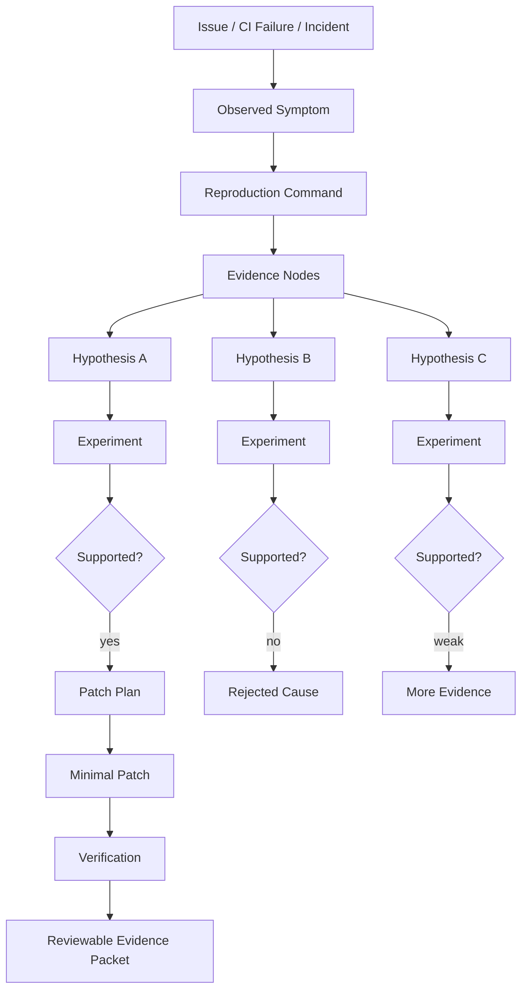
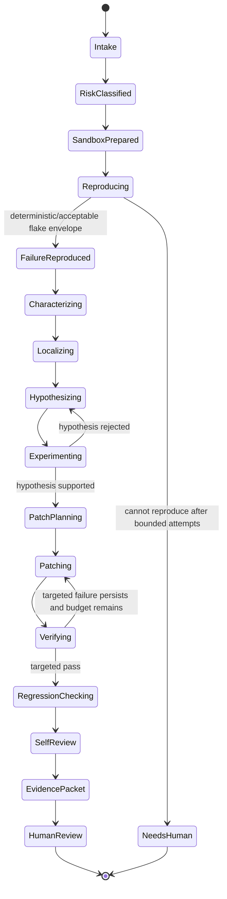
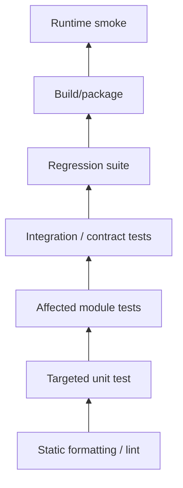
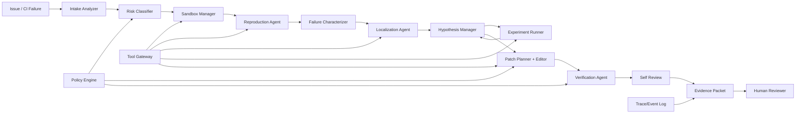

------
title: Learn Advanced Agentic AI Engineering & Autonomous Software Engineering - Part 021
description: Autonomous debugging and repair for software engineering agents: reproduction, failure characterization, localization, hypothesis testing, patch generation, verification, regression control, and reviewable evidence.
series: learn-agentic-ai-engineering
seriesTitle: Learn Advanced Agentic AI Engineering & Autonomous Software Engineering
order: 21
partTitle: Autonomous Debugging and Repair
tags:
- agentic-ai
- autonomous-software-engineering
- debugging
- repair-agent
- verification
- series
date: 2026-06-29
---

# Part 021 — Autonomous Debugging and Repair

> Target part ini: mampu mendesain **autonomous debugging and repair agent** yang tidak sekadar menebak patch, tetapi menjalankan proses engineering yang bisa diaudit: reproduce failure, karakterisasi symptom, localization, hypothesis, experiment, minimal repair, verification, regression control, dan evidence packet.

Autonomous debugging agent sering tampak “pintar” karena bisa membaca stack trace dan langsung mengubah kode.
Tetapi dalam sistem produksi, itu bukan debugging.
Itu **patch guessing**.

Debugging yang benar adalah proses membangun bukti.
Agent yang baik harus bisa menjawab:

- failure apa yang benar-benar terjadi,
- bagaimana failure direproduksi,
- konteks runtime/build/test apa yang dipakai,
- candidate root cause apa saja yang dipertimbangkan,
- bukti apa yang mendukung atau menolak tiap hypothesis,
- patch mana yang paling kecil dan paling aman,
- test apa yang membuktikan patch menyelesaikan problem,
- risiko regresi apa yang tersisa,
- kapan agent harus berhenti dan meminta manusia.

```text
An autonomous repair agent is not a patch generator.
It is a controlled diagnostic system that earns the right to patch through reproducible evidence.
```

---

## 1. Kaufman Framing

### 1.1 Target performance

Setelah part ini, kita ingin mampu:

- mendesain lifecycle debugging agent dari issue sampai PR,
- memisahkan symptom, failure mode, root cause, dan repair,
- membuat reproduction contract yang bisa dipakai ulang,
- memilih localization strategy berdasarkan tipe failure,
- membuat hypothesis-experiment loop yang hemat token dan hemat waktu,
- membuat tool contract untuk test, search, instrumentation, bisect, dan patch,
- mengontrol patch agar minimal, reversible, dan reviewable,
- mengevaluasi debugging agent berdasarkan process quality, bukan hanya pass/fail,
- menentukan stop condition ketika evidence tidak cukup.

Target praktis:

> Jika diberi GitHub issue, CI failure, production incident snippet, atau failing test, kita bisa mendesain agent yang secara sistematis membuktikan failure, mencari root cause, mengusulkan patch, memverifikasi, lalu menghasilkan PR evidence packet yang layak direview engineer senior.

### 1.2 Deconstruct the skill

Autonomous debugging terdiri dari subskill:

1. **Failure intake** — memahami issue, failing command, logs, stack trace, acceptance criteria.
2. **Environment reconstruction** — checkout, dependency, config, seed, service dependency, fixture.
3. **Reproduction** — membuat failure muncul secara reliable.
4. **Failure characterization** — membedakan build, runtime, logic, concurrency, performance, data, atau environment failure.
5. **Localization** — mencari lokasi perubahan paling mungkin.
6. **Hypothesis generation** — membuat candidate root cause yang eksplisit.
7. **Experiment design** — menjalankan command/instrumentation untuk membuktikan atau menolak hypothesis.
8. **Patch planning** — memilih perubahan minimal.
9. **Repair execution** — menerapkan diff secara kecil dan terisolasi.
10. **Verification** — menjalankan targeted test, regression test, static check, dan edge-case test.
11. **Regression reasoning** — memastikan tidak memperbaiki satu case sambil merusak invariant lain.
12. **Evidence packaging** — membuat ringkasan diagnosis, patch rationale, command output, dan residual risk.

### 1.3 Learn enough to self-correct

Materi yang cukup untuk self-correct:

- tahu kapan failure belum reproduced,
- tahu kapan localization masih spekulatif,
- tahu kapan patch terlalu luas,
- tahu kapan test hanya observational dan belum menjadi oracle,
- tahu kapan command output harus dipercaya atau dicurigai,
- tahu kapan retry/test flake harus diperlakukan sebagai signal tersendiri,
- tahu kapan agent harus stop karena evidence lemah.

### 1.4 Remove practice friction

Untuk latihan efektif, siapkan:

- repository kecil dengan bug nyata,
- script `reproduce.sh`, `test.sh`, dan `lint.sh`,
- fixture/log/failing test yang stabil,
- sandbox yang bisa reset cepat,
- diff viewer,
- trace log agent,
- checklist PR evidence packet,
- rubrik evaluasi process quality.

---

## 2. Mental Model: Debugging as Evidence Graph

Debugging agent harus membangun **evidence graph**.



Dalam graph ini:

- **symptom** adalah apa yang terlihat,
- **failure** adalah cara sistem tidak memenuhi expectation,
- **root cause** adalah mekanisme yang menjelaskan failure,
- **patch** adalah perubahan yang menghilangkan root cause tanpa merusak invariant,
- **verification** adalah bukti bahwa patch bekerja,
- **regression reasoning** adalah bukti bahwa patch tidak merusak area lain.

Agent yang buruk melompat dari symptom ke patch.
Agent yang baik melewati evidence graph.

---

## 3. Debugging Agent Lifecycle

### 3.1 State machine



### 3.2 Lifecycle summary

| Stage | Primary question | Required artifact |
|---|---|---|
| Intake | What is being reported? | issue summary, acceptance criteria, constraints |
| Sandbox | Can we safely inspect and run? | clean checkout, dependency status, environment metadata |
| Reproduce | Can we make the failure observable? | reproduction command, logs, failure signature |
| Characterize | What kind of failure is this? | failure type, scope, determinism |
| Localize | Where might the cause live? | candidate files/symbols with confidence |
| Hypothesize | Why does this failure happen? | candidate root causes and expected observations |
| Experiment | Which hypothesis survives evidence? | command/instrumentation outputs |
| Patch | What minimal change removes root cause? | focused diff and rationale |
| Verify | Did the fix work? | targeted and regression command output |
| Review | Is the change safe to submit? | PR evidence packet |

---

## 4. Failure Taxonomy

A debugging agent should classify failure before choosing tools.

### 4.1 Build failure

Examples:

- dependency resolution fails,
- compiler error,
- generated source missing,
- incompatible toolchain,
- API signature mismatch,
- module boundary violation.

Good agent behavior:

- capture exact build command,
- identify first meaningful error,
- avoid editing unrelated files,
- distinguish local environment failure from code failure,
- inspect recent dependency/build config changes,
- run narrower compile target if possible.

Bad behavior:

- changing business code before build root cause is known,
- blindly upgrading dependency,
- editing generated files,
- suppressing compiler warnings/errors without explanation.

### 4.2 Test failure

Examples:

- assertion mismatch,
- fixture mismatch,
- time zone problem,
- flaky ordering,
- stale snapshot,
- wrong mock behavior,
- contract drift.

Good agent behavior:

- identify expectation vs actual,
- inspect test intent,
- confirm whether production code or test is wrong,
- avoid weakening assertions,
- add targeted regression only when it encodes accepted behavior.

Bad behavior:

- deleting failing assertion,
- changing expected value without root-cause rationale,
- over-mocking until the test passes,
- making test less specific.

### 4.3 Runtime exception

Examples:

- null dereference,
- index out of bounds,
- serialization/deserialization failure,
- connection error,
- resource leak,
- unexpected state transition.

Good agent behavior:

- trace call path,
- inspect input contract,
- distinguish invalid input from missing guard,
- determine whether exception should be prevented, translated, or propagated,
- add test around the boundary where contract is violated.

Bad behavior:

- catch-all exception swallowing,
- returning default value silently,
- masking invariant violation,
- adding broad null checks without domain reasoning.

### 4.4 Logic failure

Examples:

- wrong branch,
- off-by-one,
- missing case,
- incorrect ordering,
- stale state,
- wrong aggregation,
- invalid domain transition.

Good agent behavior:

- reconstruct expected invariant,
- inspect domain model,
- create minimal counterexample,
- patch smallest decision point,
- test normal, edge, and regression case.

Bad behavior:

- adding special-case patch for one failing input,
- duplicating logic,
- changing broad algorithm without proof,
- ignoring invariant.

### 4.5 Concurrency failure

Examples:

- race condition,
- deadlock,
- lost update,
- visibility issue,
- non-atomic check-then-act,
- order-dependent test,
- cancellation/shutdown bug.

Good agent behavior:

- avoid overconfidence,
- inspect synchronization boundary,
- run repeated/stress test,
- look for shared mutable state,
- reason about happens-before or equivalent runtime semantics,
- prefer smaller synchronization or ownership fix.

Bad behavior:

- adding sleep,
- increasing timeout without reason,
- making everything synchronized,
- suppressing flaky failure as “environmental”.

### 4.6 Data and migration failure

Examples:

- schema mismatch,
- incompatible migration,
- bad default,
- enum expansion,
- malformed external payload,
- historical data violates new invariant.

Good agent behavior:

- inspect data shape,
- distinguish forward/backward compatibility,
- add migration/compatibility handling,
- avoid breaking old clients,
- test legacy and new payloads.

Bad behavior:

- assuming only current fixture exists,
- hardcoding one payload,
- deleting compatibility path,
- ignoring rollout order.

### 4.7 Performance failure

Examples:

- timeout,
- N+1 query,
- unbounded memory growth,
- excessive retries,
- large context/tool output,
- inefficient search.

Good agent behavior:

- measure before patch,
- find hot path,
- isolate input size,
- avoid speculative micro-optimization,
- verify with benchmark or bounded regression test.

Bad behavior:

- optimizing unrelated code,
- removing correctness checks,
- caching without invalidation strategy,
- increasing timeout only.

---

## 5. Reproduction Contract

A repair agent should not patch until it has a reproduction contract, unless explicitly operating in exploratory/low-confidence mode.

### 5.1 Minimal reproduction fields

```yaml
reproduction:
  source: "github_issue | ci_failure | user_report | production_log | generated_test"
  command: "pytest tests/test_parser.py::test_invalid_payload -q"
  environment:
    os: "linux"
    language_runtime: "python 3.12"
    dependencies_locked: true
    commit: "abc123"
  failure_signature:
    type: "assertion_failure"
    message: "expected status=REJECTED but got status=PENDING"
    stack_top: "workflow/decision.py:143"
  determinism:
    attempts: 3
    failures: 3
    flaky: false
  artifacts:
    - "logs/repro-001.txt"
    - "traces/repro-001.json"
```

### 5.2 Reproduction quality levels

| Level | Meaning | Agent may patch? |
|---|---|---|
| R0 | No reproduction, only vague report | No, except documentation/investigation PR |
| R1 | Failure observed manually once | Usually no |
| R2 | Command reproduces failure in sandbox | Yes, low/medium risk |
| R3 | Minimal failing test exists | Yes |
| R4 | Failure + invariant + regression test established | Yes, preferred |

### 5.3 Handling non-reproducible failures

Some failures are legitimately hard to reproduce: flaky tests, distributed race conditions, environment-specific production incidents.

Agent should then produce an **investigation packet**, not pretend certainty.

```md
## Investigation Packet

- Failure summary:
- Attempts made:
- Commands executed:
- Observed outputs:
- Hypotheses:
- Evidence supporting each hypothesis:
- Evidence against each hypothesis:
- Recommended next instrumentation:
- Safe mitigation options:
- Reason patch was not produced:
```

A mature agent can say: “I should not patch yet.”

---

## 6. Failure Characterization

The first diagnostic skill is not fixing.
It is classification.

### 6.1 Failure signature extraction

For each failure, agent extracts:

- failing command,
- failing test or process,
- first meaningful error,
- stack trace top and causal chain,
- expected vs actual,
- input/fixture involved,
- changed files if from CI on PR,
- recent dependency/build changes,
- environment metadata,
- flaky signal,
- reproducibility confidence.

### 6.2 First meaningful error

Logs often contain multiple errors.
A debugging agent must identify the first causal error, not the loudest downstream error.

Example:

```text
ERROR cannot connect to database
WARN retry failed
ERROR repository initialization failed
ERROR service startup failed
ERROR all tests failed
```

The meaningful root investigation starts near database connectivity or test fixture provisioning, not “all tests failed”.

### 6.3 Symptom vs root cause

| Symptom | Possible root causes |
|---|---|
| Null pointer | missing input validation, wrong fixture, lifecycle ordering, invalid domain state |
| Timeout | deadlock, slow dependency, unbounded retry, performance regression, resource starvation |
| Assertion mismatch | wrong code, wrong test expectation, changed contract, data drift |
| Build failure | dependency conflict, missing generated code, module mismatch, runtime version drift |
| Flaky test | race, shared state, time dependency, external dependency, order dependency |

Agent should carry multiple hypotheses until evidence eliminates them.

---

## 7. Localization Strategies

Localization asks: **where should we inspect first?**

### 7.1 Stack-trace localization

Useful for exceptions.

Steps:

1. Parse stack trace.
2. Remove framework/internal frames.
3. Identify application frames.
4. Locate boundary where invalid state enters.
5. Inspect caller and callee contract.
6. Search for similar usage.

Pitfall:

> Top stack frame is often where failure explodes, not where the root cause was introduced.

### 7.2 Test-name localization

Useful for unit/integration failures.

Inputs:

- test class/module name,
- test method name,
- assertion message,
- fixture name,
- parameterized case name.

Agent should infer behavior area from test intent, then map to production symbols.

### 7.3 Lexical search

Useful early, cheap, and often enough.

Search for:

- error messages,
- method names,
- config keys,
- endpoint paths,
- event names,
- database table names,
- enum values,
- assertion strings.

Good search agents use multiple narrow searches rather than one broad semantic query.

### 7.4 AST/symbol localization

Useful for large repositories.

Agent should inspect:

- class/function definitions,
- call sites,
- implementations of interface,
- overrides,
- dependency injection bindings,
- generated code boundaries,
- public API surface.

AST-aware localization reduces token waste by letting agent reason over symbols, not entire files.

### 7.5 Dynamic trace localization

Useful when static inspection is inconclusive.

Possible tools:

- targeted logging,
- debugger/breakpoint,
- trace instrumentation,
- coverage report,
- call graph sampling,
- SQL/query logs,
- request trace,
- event stream trace.

Agent must remove temporary instrumentation before final patch unless instrumentation is intended as product change.

### 7.6 Spectrum-based fault localization

When a test suite exists, agent can compare execution profiles of passing and failing tests.

Core idea:

- code executed mostly by failing tests is more suspicious,
- code executed by many passing tests is less suspicious,
- suspiciousness is not proof; it is prioritization.

This is useful for autonomous repair because it narrows inspection without relying only on natural-language issue text.

### 7.7 Blame and change localization

Useful for regression.

Agent may inspect:

- recent commits touching failing area,
- PR diff,
- dependency update,
- config change,
- generated code update,
- schema migration.

Danger:

> `git blame` tells who/when, not why. It is an investigative hint, not a root-cause proof.

---

## 8. Hypothesis-Experiment Loop

A debugging agent should make hypotheses explicit.

### 8.1 Hypothesis format

```yaml
hypothesis:
  id: H2
  statement: "The agent fails because status transition validation treats CANCELLED as non-terminal."
  affected_symbols:
    - "DecisionStateMachine#canTransition"
    - "TransitionPolicy#isTerminal"
  predicts:
    - "A test with current=CANCELLED and event=APPROVE returns true incorrectly."
    - "Existing terminal-state tests do not include CANCELLED."
  experiment:
    command: "run targeted unit test or inspect transition table"
  risk_if_wrong: "May patch wrong transition rule and break terminal-state semantics."
```

### 8.2 Good experiment properties

An experiment should be:

- cheap,
- targeted,
- repeatable,
- able to reject a hypothesis,
- recorded in trace,
- tied to an expected observation.

Bad experiment:

```text
Run all tests and see what happens.
```

Good experiment:

```text
Run only TransitionPolicyTest, then add one temporary assertion for CANCELLED terminal state.
```

### 8.3 Disconfirming evidence

Agent should actively search for evidence that would prove itself wrong.

Examples:

- “If this is a null input problem, existing valid-input tests should still pass.”
- “If root cause is parsing, serialized output should already be wrong before persistence.”
- “If root cause is database migration, unit tests without DB should pass.”
- “If failure is flake, repeated runs should vary.”

A repair agent that never disproves itself will overfit patches.

---

## 9. Patch Planning

Patch planning comes after evidence.

### 9.1 Patch plan fields

```yaml
patch_plan:
  root_cause: "Terminal status CANCELLED missing from transition guard."
  intended_change: "Add CANCELLED to terminal state set and add regression test."
  files_to_change:
    - "src/main/.../TransitionPolicy.java"
    - "src/test/.../TransitionPolicyTest.java"
  files_not_to_change:
    - "API DTOs"
    - "Persistence schema"
  compatibility:
    external_api_changed: false
    schema_changed: false
    behavior_change: "Only disallows invalid transition from CANCELLED."
  verification:
    - "targeted unit test"
    - "state machine test suite"
    - "affected integration test if available"
  rollback:
    strategy: "single revertable commit"
```

### 9.2 Minimal diff principle

Patch should be as small as possible while still addressing root cause.

Minimal does not mean clever.
It means:

- smallest semantic surface,
- least unrelated formatting,
- no opportunistic refactor,
- no dependency upgrade unless root cause,
- no test weakening,
- no broad exception suppression,
- no behavior change outside stated scope.

### 9.3 Patch categories

| Category | Example | Risk |
|---|---|---|
| Guard fix | reject invalid state/input | medium if contract unclear |
| Algorithm fix | correct branch/order/calculation | medium/high |
| Compatibility fix | support old and new payload | medium |
| Resource fix | close file, release connection | medium |
| Concurrency fix | lock/atomic/ownership change | high |
| Config/build fix | dependency/plugin/toolchain | medium/high |
| Test-only fix | update invalid test | high if hiding real bug |

### 9.4 When not to patch

Agent should stop when:

- reproduction fails and no reliable evidence exists,
- issue requirement is ambiguous,
- patch requires product decision,
- patch affects auth/payment/legal/safety-critical path,
- root cause is external dependency outage,
- fix requires data migration without migration policy,
- tests are unavailable and blast radius is high,
- patch would require broad architectural redesign.

---

## 10. Tool Contract for Debugging Agents

### 10.1 Core tools

| Tool | Purpose | Safety notes |
|---|---|---|
| `run_command` | execute build/test/debug commands | sandbox, timeout, allowlist |
| `read_file` | inspect source/log/config | path restrictions |
| `search_text` | lexical search | output truncation |
| `symbol_search` | find definitions/call sites | language-aware parser |
| `edit_file` | apply patch | diff guard, file scope |
| `run_tests` | execute targeted/full tests | timeout, flake metadata |
| `capture_trace` | collect runtime trace | secret redaction |
| `git_diff` | inspect change | required before final |
| `git_reset` | rollback candidate patch | scoped only |
| `create_evidence_packet` | summarize process | structured output |

### 10.2 Debugging-specific tool schema

Example:

```json
{
  "name": "run_test_command",
  "description": "Run an approved test command in the repository sandbox and return structured result.",
  "input_schema": {
    "type": "object",
    "properties": {
      "command": { "type": "string" },
      "timeout_seconds": { "type": "integer", "minimum": 1, "maximum": 600 },
      "expected_failure_signature": { "type": "string" },
      "purpose": { "type": "string" }
    },
    "required": ["command", "timeout_seconds", "purpose"]
  }
}
```

The `purpose` field matters.
It forces the agent to say why it is running the command.
This improves trace review and discourages random tool use.

### 10.3 Tool output normalization

Agent should not reason over raw noisy logs only.
Tool gateway should return structured output:

```json
{
  "exit_code": 1,
  "duration_ms": 8421,
  "timed_out": false,
  "summary": "1 test failed, 48 passed",
  "first_error": "AssertionError: expected CANCELLED to be terminal",
  "failure_signature": "TransitionPolicyTest.testCancelledIsTerminal",
  "stdout_ref": "artifact://logs/stdout-123.txt",
  "stderr_ref": "artifact://logs/stderr-123.txt"
}
```

---

## 11. Repair Patterns

### 11.1 Reproduce-before-patch

```text
Before editing production code, establish a failing command or failing test unless risk tier explicitly permits investigation-only changes.
```

Use when:

- bug report has concrete failure,
- CI failure exists,
- behavior can be tested.

Avoid when:

- task is pure refactor,
- documentation issue,
- exploratory investigation.

### 11.2 Failing-test-first

Create or identify failing test before patch.

But beware:

- agent-generated tests can be weak,
- tests may encode the agent’s misunderstanding,
- writing test consumes budget,
- test must become a real oracle, not print-based observation.

### 11.3 Hypothesis narrowing

Agent keeps only top 2–4 hypotheses and designs experiments.

Good for:

- large codebases,
- ambiguous issue reports,
- regression failures.

### 11.4 Patch by invariant

Instead of patching one input, agent identifies invariant.

Bad:

```text
If status == "CANCELLED" return false.
```

Better:

```text
All terminal statuses reject mutating transitions. CANCELLED belongs to terminal statuses.
```

### 11.5 Compatibility repair

For data/API changes:

- accept old and new payload if needed,
- preserve output contract,
- add test for old clients,
- document deprecation path,
- avoid forced migration without approval.

### 11.6 Guarded repair

For invalid input:

- validate at boundary,
- return explicit error,
- do not silently coerce unless domain requires,
- test invalid input.

### 11.7 Two-phase repair for risky systems

For high-risk code:

1. Add diagnostic instrumentation or failing test.
2. Submit patch after confirmation.

This is slower but safer.

---

## 12. Regression Control

A patch is not done when targeted test passes.

### 12.1 Verification hierarchy



The hierarchy depends on repo size and time budget.
Agent should state what it ran and what it did not run.

### 12.2 Verification packet

```yaml
verification:
  targeted:
    command: "pytest tests/test_transition.py::test_cancelled_terminal -q"
    result: "passed"
  affected_suite:
    command: "pytest tests/test_transition.py -q"
    result: "passed"
  full_suite:
    command: "pytest -q"
    result: "not_run"
    reason: "exceeds time budget in sandbox"
  static_checks:
    command: "ruff check src tests"
    result: "passed"
  residual_risk:
    - "No integration test covers distributed transition consumer."
```

### 12.3 Avoid false verification

False verification occurs when:

- test did not exercise changed code,
- test passed before patch,
- test was weakened,
- command failed but agent misread output,
- flake passed once,
- full suite skipped without disclosure,
- mock hides real integration behavior.

Agent should record before/after status for targeted tests when possible.

---

## 13. Debugging Anti-Patterns

### 13.1 Patch before reproduce

Agent edits based on issue text only.

Why dangerous:

- issue may be outdated,
- failure may be environment-specific,
- agent may patch symptom,
- no proof that patch matters.

### 13.2 Stack-trace tunnel vision

Agent changes top frame only.

Better:

- inspect input source,
- inspect caller contract,
- inspect state creation,
- inspect recent changes.

### 13.3 Catch-and-continue repair

Agent wraps failure in broad exception handler.

Danger:

- hides invariant violation,
- corrupts downstream state,
- creates silent data loss.

### 13.4 Assertion weakening

Agent changes test to match current broken behavior.

Allowed only if:

- product contract changed,
- test was demonstrably wrong,
- evidence and approval exist.

### 13.5 Flake dismissal

Agent says “probably flaky” and moves on.

Better:

- repeated runs,
- seed capture,
- order randomization,
- shared state inspection,
- time dependency analysis.

### 13.6 Broad refactor while fixing bug

Agent “cleans up” while patching.

Danger:

- review burden increases,
- regression surface expands,
- root cause is obscured.

### 13.7 Tool-output hallucination

Agent claims tests passed when output shows failure.

Mitigation:

- structured test result parsing,
- exit code validation,
- command logs linked in evidence packet,
- verifier agent/human review.

---

## 14. Autonomous SWE Debugging Blueprint

### 14.1 Component architecture



### 14.2 Minimal event model

```json
{
  "event_type": "debug.experiment.completed",
  "run_id": "run_123",
  "hypothesis_id": "H2",
  "tool": "run_test_command",
  "command": "pytest tests/test_transition.py -q",
  "exit_code": 1,
  "summary": "1 failed, 12 passed",
  "supports_hypothesis": true,
  "artifact_refs": ["artifact://logs/exp-H2-001.txt"]
}
```

This supports:

- replay,
- audit,
- process eval,
- reviewer trust,
- postmortem if patch fails.

---

## 15. Evaluation Metrics

### 15.1 Outcome metrics

- issue resolved,
- targeted test passes,
- regression suite passes,
- CI passes,
- PR accepted,
- production incident avoided,
- rollback not needed.

### 15.2 Process metrics

- reproduction established before patch,
- root cause stated explicitly,
- hypotheses considered,
- commands executed with purpose,
- patch size,
- unrelated file changes,
- test weakening detected,
- evidence packet completeness,
- reviewer intervention rate.

### 15.3 Reliability metrics

- deterministic reproduction rate,
- flake detection rate,
- false-positive pass rate,
- patch rollback rate,
- retry count,
- timeout rate,
- tool failure rate,
- average loop iterations.

### 15.4 Cost metrics

- token per resolved issue,
- tool calls per resolved issue,
- wall-clock time,
- test runtime cost,
- human review time,
- CI cost.

### 15.5 Quality metrics

- patch minimality,
- mutation score delta if applicable,
- maintainability impact,
- complexity delta,
- test quality,
- contract compatibility,
- security risk introduced.

---

## 16. Prompt Contract for Debugging Agent

Use prompt as operational instruction, not as the only control layer.

```md
You are a debugging and repair agent.

Rules:
1. Do not patch production code until you have either:
   - reproduced the failure, or
   - explicitly marked the task as investigation-only.
2. Separate symptom, hypothesis, evidence, and root cause.
3. Before each command, state its purpose.
4. Prefer targeted tests before full suites.
5. Do not weaken tests unless evidence shows the test is wrong.
6. Keep patches minimal and scoped to the root cause.
7. Record commands, outputs, and residual risk.
8. Stop and ask for review if the patch touches high-risk areas.

Output format:
- Failure summary
- Reproduction evidence
- Root-cause hypothesis
- Patch plan
- Verification plan
- Commands run
- Final diff summary
- Residual risks
```

Prompt helps, but enforcement belongs in runtime:

- tool gateway,
- policy engine,
- patch scope guard,
- approval gate,
- test parser,
- event log.

---

## 17. PR Evidence Packet

Every autonomous repair PR should include:

```md
## Summary

<What changed and why.>

## Failure Reproduction

- Command:
- Before result:
- Failure signature:

## Root Cause

<Mechanism, not symptom.>

## Patch Rationale

<Why this is the minimal safe fix.>

## Verification

- Targeted tests:
- Affected suite:
- Static checks:
- Full suite:

## Risk and Compatibility

- API change:
- Schema change:
- Behavior change:
- Known residual risk:

## Agent Trace

- Run id:
- Important artifacts:
- Human approval required:
```

This converts agent work from opaque automation into reviewable engineering.

---

## 18. Practical Exercise

### Exercise 1 — Build a reproduction-first debugger

Input:

- small repo,
- failing test,
- issue text.

Build agent states:

1. `INTAKE`
2. `REPRODUCE`
3. `CHARACTERIZE`
4. `LOCALIZE`
5. `HYPOTHESIZE`
6. `PATCH`
7. `VERIFY`
8. `EVIDENCE_PACKET`

Acceptance criteria:

- agent records failing command before patch,
- patch changes maximum two production files,
- targeted test passes after patch,
- evidence packet includes root cause and residual risk.

### Exercise 2 — Detect bad repair behavior

Create examples of:

- assertion weakening,
- broad catch,
- patch without reproduction,
- unrelated refactor,
- test pass misread.

Build a verifier that flags each case.

### Exercise 3 — Hypothesis manager

Given a failure log, generate three hypotheses.
For each hypothesis, require:

- predicted observation,
- experiment command,
- support/reject criteria.

---

## 19. Production Checklist

Before deploying autonomous debugging/repair:

- [ ] sandbox is isolated,
- [ ] secrets are unavailable or scoped,
- [ ] network access is controlled,
- [ ] tool calls are logged,
- [ ] reproduction is required for patching,
- [ ] high-risk files require approval,
- [ ] generated tests cannot weaken existing tests silently,
- [ ] diff scope guard exists,
- [ ] structured test parser validates exit codes,
- [ ] trace and evidence packet are persisted,
- [ ] reviewer can replay key commands,
- [ ] rollback strategy exists,
- [ ] eval harness measures process and outcome,
- [ ] benchmarks are not the only proof of production readiness.

---

## 20. Key Takeaways

- Autonomous debugging is evidence construction, not patch guessing.
- Reproduction is the gateway from speculation to engineering.
- Localization is prioritization, not proof.
- Hypotheses must predict observations that can be tested.
- A patch without a verification story is not a completed repair.
- Agent-generated tests are useful only when they encode real oracles.
- Debugging agents need policy, tool constraints, traceability, and review gates.
- The final artifact is not just a diff; it is a reviewable evidence packet.

---

## References

- SWE-agent: Agent-Computer Interfaces Enable Automated Software Engineering — https://arxiv.org/abs/2405.15793
- SWE-agent GitHub repository — https://github.com/swe-agent/swe-agent
- AutoCodeRover: Autonomous Program Improvement — https://arxiv.org/abs/2404.05427
- AutoCodeRover repository — https://github.com/AutoCodeRoverSG/auto-code-rover
- SWE-bench — https://www.swebench.com/
- SWE-bench Verified — https://www.swebench.com/verified.html
- OpenAI Codex cloud documentation — https://developers.openai.com/codex/cloud
- OpenAI Codex announcement — https://openai.com/index/introducing-codex/
- OWASP Top 10 for LLM Applications — https://owasp.org/www-project-top-10-for-large-language-model-applications/
- From LLMs to LLM-based Agents for Software Engineering: A Survey — https://arxiv.org/abs/2408.02479
