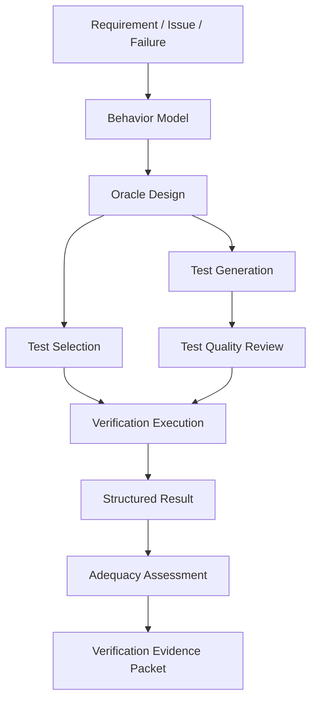
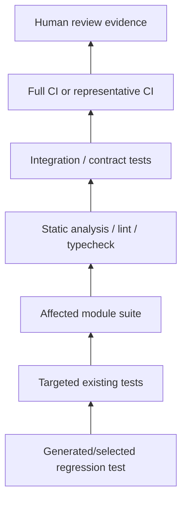
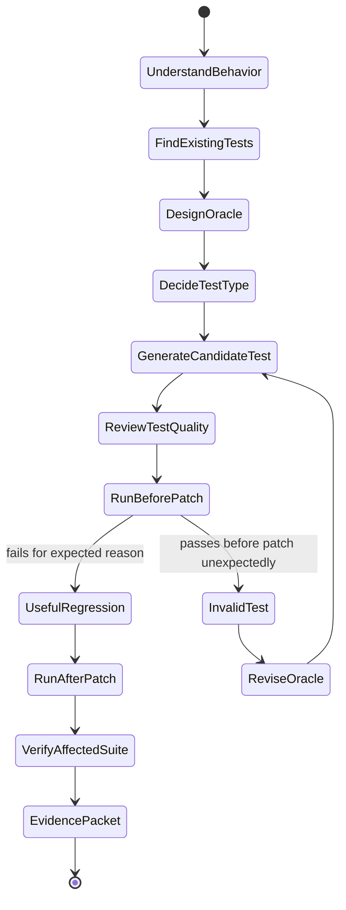
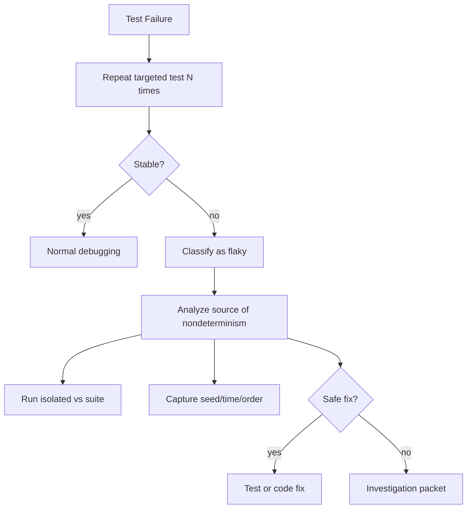
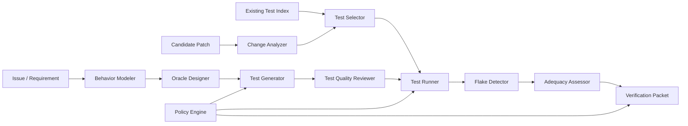

------
title: Learn Advanced Agentic AI Engineering & Autonomous Software Engineering - Part 022
description: Test generation and verification agents for autonomous software engineering: oracle design, test intent, regression tests, property tests, mutation thinking, flaky test detection, verification hierarchy, and quality gates.
series: learn-agentic-ai-engineering
seriesTitle: Learn Advanced Agentic AI Engineering & Autonomous Software Engineering
order: 22
partTitle: Test Generation and Verification Agents
tags:
- agentic-ai
- autonomous-software-engineering
- testing
- verification-agent
- test-generation
- series
date: 2026-06-29
---

# Part 022 — Test Generation and Verification Agents

> Target part ini: mampu mendesain **test generation and verification agents** yang menghasilkan test bernilai, bukan hanya test banyak. Fokusnya adalah oracle design, verification strategy, regression control, flaky-test detection, test adequacy, dan integration ke autonomous SWE lifecycle.

Dalam autonomous software engineering, test generation sering disalahpahami.
Banyak agent menulis test sebagai ritual:

1. lihat bug,
2. tulis test,
3. patch code,
4. run test,
5. claim done.

Masalahnya: test yang dihasilkan agent bisa lemah, salah, terlalu spesifik, hanya mengecek implementation detail, atau sekadar mencetak value tanpa assertion bermakna.

Test agent yang baik bukan “test writer”.
Ia adalah **verification engineer**.

```text
A test generation agent should not optimize for number of tests.
It should optimize for trustworthy evidence about behavior, invariants, and regression risk.
```

---

## 1. Kaufman Framing

### 1.1 Target performance

Setelah part ini, kita ingin mampu:

- membedakan test generation, test selection, verification, dan quality assessment,
- mendesain agent yang menghasilkan test dengan oracle jelas,
- memilih jenis test berdasarkan risk dan behavior,
- menghindari agent-generated tests yang hanya mengunci bug atau implementation detail,
- membuat verification hierarchy untuk coding agent,
- mendeteksi flaky, weak, redundant, dan misleading tests,
- mengintegrasikan mutation thinking, property thinking, dan contract thinking,
- membuat eval harness untuk mengukur kualitas test agent.

Target praktis:

> Jika coding agent membuat patch, kita bisa mendesain verification agent yang memutuskan test apa yang perlu dijalankan/dibuat, apakah test itu membuktikan behavior yang benar, dan apakah patch cukup aman untuk human review.

### 1.2 Deconstruct the skill

Test generation and verification terdiri dari subskill:

1. **Behavior understanding** — memahami requirement, invariant, dan expected behavior.
2. **Oracle design** — menentukan apa yang membuat output benar/salah.
3. **Test selection** — memilih existing tests paling relevan.
4. **Regression test generation** — menambahkan test untuk bug yang direproduksi.
5. **Edge-case generation** — mencari boundary dan equivalence classes.
6. **Property thinking** — menulis invariant yang berlaku untuk banyak input.
7. **Contract verification** — API/schema/event compatibility.
8. **Mutation thinking** — mengevaluasi apakah test benar-benar membunuh bug-like changes.
9. **Flake detection** — membedakan nondeterminism dari bug.
10. **Verification orchestration** — menjalankan command secara hemat dan terstruktur.
11. **Test review** — mendeteksi test yang salah, lemah, atau terlalu coupled.
12. **Evidence reporting** — menyajikan hasil sebagai proof packet.

### 1.3 Learn enough to self-correct

Kita harus bisa mengenali:

- test tanpa oracle,
- test yang hanya memverifikasi mock,
- test yang pass sebelum patch,
- test yang salah karena requirement salah dimengerti,
- test yang terlalu spesifik ke implementation,
- test yang fragile terhadap ordering/time/randomness,
- test yang meningkatkan coverage tapi tidak meningkatkan confidence,
- test yang seharusnya menjadi integration/contract test, bukan unit test.

---

## 2. Mental Model: Verification Over Generation

Test generation adalah subset dari verification.



Agent harus bertanya:

1. Behavior apa yang harus benar?
2. Apa oracle-nya?
3. Test lama mana yang relevan?
4. Test baru apa yang dibutuhkan?
5. Apakah test baru gagal sebelum patch?
6. Apakah test baru pass setelah patch?
7. Apakah test cukup general?
8. Apakah patch melewati regression suite yang relevan?
9. Risiko apa yang belum diverifikasi?

---

## 3. The Core Problem: Oracle Design

A test without an oracle is just execution.

### 3.1 What is a test oracle?

Oracle adalah mekanisme untuk memutuskan apakah behavior benar.

Examples:

| Test type | Oracle |
|---|---|
| Unit test | exact return value, exception, state transition |
| Integration test | persisted state, external contract, side effect |
| Property test | invariant holds for generated inputs |
| Contract test | schema/status/error semantics match contract |
| Snapshot test | output structure matches approved representation |
| Performance test | latency/resource threshold |
| Security test | forbidden behavior does not occur |

### 3.2 Weak oracle examples

Bad:

```java
@Test
void shouldProcess() {
    var result = service.process(input);
    System.out.println(result);
}
```

Bad:

```java
@Test
void shouldProcess() {
    assertNotNull(service.process(input));
}
```

Better:

```java
@Test
void rejectedCaseMustNotBecomePendingAgain() {
    var result = transition.apply(REJECTED, APPROVE);

    assertEquals(REJECTED, result.status());
    assertTrue(result.violations().contains("terminal-state"));
}
```

The better test states behavior and invariant.

### 3.3 Oracle sources

A test agent can derive oracle from:

- issue acceptance criteria,
- existing failing test,
- specification document,
- API contract,
- schema,
- old behavior before regression,
- invariant in domain model,
- human approval,
- production incident expected remediation,
- formal property,
- golden dataset.

If no oracle exists, agent should not pretend certainty.
It should mark the test as exploratory.

---

## 4. Test Agent Responsibilities

### 4.1 Test selection

Before generating tests, agent should find existing relevant tests.

Inputs:

- changed files,
- candidate symbols,
- test naming convention,
- build graph,
- coverage map,
- stack trace,
- dependency graph,
- historical failing tests,
- CI matrix.

Output:

```yaml
test_selection:
  targeted_tests:
    - command: "pytest tests/test_transition.py::test_cancelled_terminal -q"
      reason: "Directly exercises changed transition policy."
  affected_suites:
    - command: "pytest tests/test_transition.py -q"
      reason: "Covers state transition invariants."
  skipped:
    - command: "pytest integration/ -q"
      reason: "Not available in sandbox; requires external service."
```

### 4.2 Regression test generation

Regression test should:

- fail before patch,
- pass after patch,
- encode root cause behavior,
- avoid implementation detail,
- be small enough to debug,
- live in appropriate test layer,
- include clear name and expectation.

### 4.3 Edge-case generation

Agent should identify:

- null/missing input,
- empty collection,
- single item,
- boundary number,
- maximum/minimum date,
- timezone boundary,
- duplicate item,
- invalid enum,
- unsupported version,
- concurrency boundary,
- retry boundary,
- permission boundary.

But edge cases must be relevant.
Blind edge-case generation bloats the suite.

### 4.4 Verification execution

Agent should run commands in order:

1. test that should fail before patch,
2. targeted test after patch,
3. affected suite,
4. static checks,
5. broader regression suite if budget allows,
6. CI-equivalent command if feasible.

### 4.5 Test quality review

Agent should review generated tests for:

- oracle strength,
- readability,
- determinism,
- independence,
- maintainability,
- runtime cost,
- fixture complexity,
- coupling to implementation,
- false positive/negative risk.

---

## 5. Types of Tests for Agentic Verification

### 5.1 Unit tests

Best for:

- pure logic,
- state transition,
- validation,
- parsing,
- calculation,
- boundary behavior.

Agent should use unit tests when root cause is localized and behavior can be isolated.

Risks:

- over-mocking,
- testing implementation detail,
- missing integration contract.

### 5.2 Integration tests

Best for:

- database behavior,
- API endpoint,
- message flow,
- serialization boundary,
- dependency wiring,
- transaction semantics.

Agent should use integration tests when failure crosses components.

Risks:

- slow,
- flaky,
- environment-heavy,
- difficult sandbox setup.

### 5.3 Contract tests

Best for:

- public API,
- event schema,
- external service interaction,
- backward compatibility,
- consumer-driven behavior.

Agent should prefer contract tests when patch affects boundary.

### 5.4 Property-based tests

Best for:

- parsers,
- validators,
- serialization round-trip,
- sorting/order invariants,
- idempotency,
- state machine invariants,
- numeric transformations.

Example properties:

- serializing then deserializing preserves value,
- applying idempotent operation twice equals once,
- terminal state never transitions to active state,
- sorting output is ordered and contains same elements,
- permission denied never produces side effect.

### 5.5 Golden/snapshot tests

Best for:

- stable generated output,
- CLI output,
- documentation generation,
- UI serialization,
- protocol payload.

Risks:

- snapshots become rubber stamps,
- reviewers approve large diffs without semantic review,
- agent updates snapshot to hide regression.

Policy:

> Agent may propose snapshot update, but human review should approve semantic meaning.

### 5.6 Mutation-oriented tests

Mutation thinking asks:

> If a developer made a small plausible mistake, would this test fail?

Examples of mutations:

- `>` becomes `>=`,
- `&&` becomes `||`,
- branch negated,
- collection sorted descending,
- exception removed,
- validation skipped,
- enum case omitted.

Mutation testing tools can automate this in some stacks, but even without tools, agent can reason mutation-style.

---

## 6. Verification Hierarchy for Coding Agents



Agent does not always run everything.
It should choose based on:

- risk tier,
- time budget,
- sandbox capability,
- changed files,
- dependency graph,
- availability of services,
- historical flakiness,
- human review needs.

### 6.1 Verification decision table

| Patch type | Minimum verification | Preferred verification |
|---|---|---|
| Pure logic | regression unit + affected unit suite | property/mutation-oriented check |
| API behavior | endpoint/contract test | consumer compatibility test |
| Persistence | repository/integration test | migration/rollback test |
| Serialization | round-trip + schema test | old/new payload compatibility |
| Concurrency | repeated/stress targeted test | deterministic scheduler if available |
| Build config | clean build target | CI matrix subset |
| Performance | benchmark or representative workload | before/after profile |
| Security-sensitive | negative abuse case | human security review |

---

## 7. Agent-Generated Test Workflow

### 7.1 State machine



### 7.2 Candidate test record

```yaml
generated_test:
  id: T3
  purpose: "Prevent terminal CANCELLED case from being reopened."
  oracle_source: "issue acceptance criteria + existing transition invariant"
  test_type: "unit"
  file: "tests/test_transition_policy.py"
  expected_before_patch: "fail"
  expected_after_patch: "pass"
  behavior_under_test: "terminal state immutability"
  risks:
    - "May duplicate existing terminal-state test if parameterized suite exists."
```

### 7.3 Before/after requirement

A high-quality regression test usually fails before patch and passes after patch.

Exception cases:

- existing test already failed before agent generated new test,
- issue is refactor/performance/security hardening,
- behavior is verified through static check,
- non-deterministic failure cannot be reproduced deterministically.

When before/after is not possible, agent should explain why.

---

## 8. Test Quality Rubric

### 8.1 Scoring dimensions

| Dimension | Bad | Good |
|---|---|---|
| Oracle | no assertion / weak assertion | precise expected behavior |
| Relevance | unrelated coverage | directly tied to root cause |
| Determinism | time/random/order dependent | stable and repeatable |
| Isolation | requires global mutable state | clear setup/teardown |
| Maintainability | obscure fixture | readable intent |
| Scope | tests implementation detail | tests public/domain behavior |
| Regression value | would pass with bug | fails with original bug |
| Cost | slow/brittle | acceptable runtime |

### 8.2 Test smell catalog

#### Test has no meaningful assertion

```java
assertNotNull(result);
```

This may be meaningful only if null is the failure.
Otherwise it is weak.

#### Test mirrors implementation

```java
assertEquals(service.internalCacheKey(input), expectedKey);
```

If `internalCacheKey` is private implementation concept, test may be too coupled.

#### Test only verifies mock interaction

```java
verify(repository).save(any());
```

Sometimes valid, but weak if it never verifies persisted state or domain result.

#### Test encodes current broken behavior

Agent sees actual output and writes it as expected.

This is one of the most dangerous agent test failures.

#### Test depends on wall clock

Use controlled clock.

#### Test depends on random order

Use deterministic seed or assert set semantics.

#### Snapshot rubber-stamping

Large snapshot updated without semantic review.

---

## 9. Flaky Test Detection

Flaky test handling is part of verification.

### 9.1 Flake signals

- pass/fail varies across repeated runs,
- order-dependent failure,
- time-sensitive assertion,
- external dependency calls,
- shared mutable test fixture,
- port/resource collision,
- sleep/timeouts,
- race-sensitive concurrency,
- test pollution from previous test.

### 9.2 Flake investigation loop



### 9.3 Flake policy

Agent should not simply rerun until green.

Policy:

- one retry can handle infrastructure noise,
- repeated variation must be recorded,
- pass-after-retry is not equivalent to verified,
- high-risk code needs stable verification,
- test quarantine requires human approval.

---

## 10. Structural Testing of Agents

Testing the software-under-change is not enough.
We also need to test the agent itself.

### 10.1 Agent trajectory tests

A verification system can assert:

- agent reproduced before patch,
- agent did not call forbidden tools,
- agent generated evidence packet,
- agent ran targeted test after patch,
- agent did not modify high-risk files without approval,
- agent stopped when oracle was missing.

### 10.2 Mocked tool tests

For agent runtime:

- mock repository files,
- mock test command outputs,
- mock tool failures,
- assert agent state transitions,
- assert policy enforcement,
- assert final structured output.

### 10.3 Trace-based assertions

Example:

```yaml
assertions:
  - event_type: "test.generated"
    where:
      expected_before_patch: "fail"
  - event_type: "patch.applied"
    after: "test.before_patch.failed"
  - event_type: "verification.completed"
    where:
      targeted_result: "passed"
  - not_event_type: "policy.violation"
```

This brings normal software testing discipline into agent systems.

---

## 11. Test Generation Patterns

### 11.1 Failure-to-regression pattern

Input:

- failing issue,
- reproduction command,
- root cause.

Output:

- one regression test that fails before patch and passes after patch.

Use for:

- bug fix,
- parser issue,
- state transition bug,
- validation bug.

### 11.2 Invariant expansion pattern

Input:

- one bug case,
- known invariant.

Output:

- parameterized test covering all equivalent states.

Example:

```text
Bug: CANCELLED transitions incorrectly.
Invariant: all terminal states reject mutation.
Test: parameterized over CANCELLED, REJECTED, EXPIRED, CLOSED.
```

### 11.3 Contract preservation pattern

Input:

- patch touches API/schema/event.

Output:

- old payload still accepted,
- new payload accepted,
- invalid payload rejected with expected error.

### 11.4 Metamorphic test pattern

Useful when exact output is hard to know but relation should hold.

Examples:

- sorting twice gives same result,
- adding irrelevant whitespace does not change parse result,
- retrying idempotent operation does not duplicate side effect,
- reordering independent inputs gives same aggregate.

### 11.5 Mutation challenge pattern

Agent asks:

> What small incorrect patch would still pass this test?

Then strengthens the test.

Example:

- if changing `>` to `>=` still passes, add boundary case,
- if skipping validation still passes, add invalid input case,
- if returning constant passes, add multiple input cases.

---

## 12. Verification Agent Architecture



### 12.1 Components

#### Change Analyzer

Determines:

- files changed,
- symbols changed,
- public surface affected,
- risk tier,
- related tests.

#### Behavior Modeler

Extracts:

- expected behavior,
- invariant,
- acceptance criteria,
- edge cases,
- compatibility requirements.

#### Oracle Designer

Defines:

- exact assertion,
- allowed tolerance,
- expected error,
- forbidden side effect,
- property relation.

#### Test Generator

Creates:

- unit test,
- integration test,
- property test,
- contract test,
- regression test.

#### Test Quality Reviewer

Rejects:

- weak assertions,
- duplicate tests,
- implementation-coupled tests,
- tests that pass before patch when they should fail,
- test-only changes that hide real bug.

#### Test Runner

Executes:

- targeted tests,
- affected tests,
- static checks,
- full suite when feasible.

#### Adequacy Assessor

Answers:

- did tests exercise changed behavior,
- did regression fail before patch,
- did patch pass relevant suite,
- what remains unverified.

---

## 13. Tooling Layer

### 13.1 Tool contracts

| Tool | Purpose |
|---|---|
| `find_tests_for_symbol` | map production symbol to tests |
| `run_test` | execute targeted test command |
| `run_suite` | execute broader suite |
| `coverage_for_change` | check whether changed lines/symbols are exercised |
| `generate_test_file` | create candidate test |
| `mutate_candidate` | simulate small bug to challenge tests |
| `detect_flake` | rerun and classify nondeterminism |
| `parse_test_result` | normalize framework output |
| `review_test_quality` | static/LLM/rule-based test smell review |

### 13.2 Structured test result

```json
{
  "command": "pytest tests/test_transition.py -q",
  "exit_code": 0,
  "duration_ms": 1120,
  "summary": "14 passed",
  "failed_tests": [],
  "flaky_signal": false,
  "coverage_hint": {
    "changed_symbols_exercised": ["TransitionPolicy.can_transition"],
    "changed_symbols_not_exercised": []
  },
  "artifact_refs": ["artifact://test-results/transition.xml"]
}
```

### 13.3 Guardrails

- generated tests cannot delete existing assertions,
- generated tests cannot update snapshots without review,
- generated tests cannot mark tests ignored/skipped without approval,
- test runner must check exit code,
- all test commands need timeout,
- external network test requires explicit capability,
- high-cost suite requires budget approval,
- flaky pass must not be reported as clean pass.

---

## 14. Agent-Generated Tests: Useful but Not Magic

A subtle point: writing more tests does not automatically improve autonomous repair.

Agent-generated tests may help when:

- issue has clear expected behavior,
- test can fail before patch,
- oracle is strong,
- existing tests miss the case,
- generated test is reviewed,
- runtime can verify it deterministically.

They may not help when:

- requirement is ambiguous,
- agent misunderstands behavior,
- generated test only observes values,
- generated test consumes too much budget,
- patch correctness depends on integration not unit behavior,
- benchmark already has hidden tests that are enough for scoring,
- test is generated after patch and merely matches patched behavior.

The point is not “always generate tests”.
The point is:

```text
Generate tests when they improve evidence quality.
Do not generate tests as a ritual.
```

---

## 15. Verification Packet

Every verification agent should produce:

```md
## Verification Summary

- Patch under verification:
- Behavior under test:
- Oracle source:
- Risk tier:

## Tests Selected

| Command | Reason | Result |
|---|---|---|

## Tests Generated

| File | Purpose | Before Patch | After Patch | Quality Notes |
|---|---|---|---|---|

## Coverage / Adequacy

- Changed behavior exercised:
- Edge cases covered:
- Contract compatibility checked:
- Mutation-style weaknesses:

## Flakiness

- Repeated runs:
- Flake signal:
- Notes:

## Residual Risk

- Not verified:
- Requires human review:
- Suggested follow-up:
```

This packet is more valuable than a vague “all tests pass”.

---

## 16. Evaluation Metrics for Test Agents

### 16.1 Test usefulness

- generated test fails before patch,
- generated test passes after patch,
- generated test fails on original buggy version,
- generated test catches plausible mutation,
- generated test maps to issue acceptance criteria,
- generated test survives reviewer scrutiny.

### 16.2 Verification effectiveness

- percentage of bad patches rejected,
- percentage of good patches accepted,
- false pass rate,
- false fail rate,
- flake detection rate,
- regression caught before PR,
- human review correction rate.

### 16.3 Cost

- test runtime,
- token cost,
- generated test count,
- CI cost,
- reviewer time,
- maintenance burden.

### 16.4 Maintainability

- test readability,
- fixture complexity,
- duplication,
- brittleness,
- snapshot size,
- dependency on internal implementation,
- long-term failure rate.

---

## 17. Common Anti-Patterns

### 17.1 Coverage theater

Agent adds tests just to raise coverage.

Coverage can show what was executed.
It cannot prove the oracle is strong.

### 17.2 Assertion laundering

Agent converts actual output into expected output without validating requirement.

### 17.3 Snapshot laundering

Agent updates snapshot after patch and calls it verification.

### 17.4 Mock-only verification

Agent verifies that a mock was called but not that behavior was correct.

### 17.5 Test weakening

Agent removes assertion, skips test, increases tolerance, or broadens expected exception.

### 17.6 One-green-run fallacy

Agent reruns flaky test until pass and reports success.

### 17.7 Over-generated suite

Agent creates many slow tests with overlapping behavior.

### 17.8 Missing negative cases

Agent tests happy path only.

### 17.9 Hidden dependency on time/randomness

Agent creates tests that pass today but fail tomorrow.

### 17.10 Benchmark overfitting

Agent optimizes for benchmark hidden tests rather than production verification quality.

---

## 18. Practical Exercise

### Exercise 1 — Build a regression test agent

Given:

- issue text,
- failing command,
- root cause summary,
- candidate patch.

Build agent that outputs:

- selected existing tests,
- generated regression test,
- before/after results,
- verification packet.

Acceptance criteria:

- generated test has precise oracle,
- test fails before patch,
- test passes after patch,
- agent explains residual risk.

### Exercise 2 — Test smell detector

Create rule/LLM hybrid reviewer to detect:

- `assertNotNull` only,
- snapshot update only,
- skipped test,
- broad exception expectation,
- no before-patch failure,
- implementation detail coupling.

### Exercise 3 — Mutation challenge

For a simple function, ask agent to generate tests.
Then mutate production code manually.
Evaluate whether generated tests fail.

### Exercise 4 — Flake classifier

Create test with:

- time dependency,
- random order,
- shared static state.

Build flake detector that reruns and classifies failure mode.

---

## 19. Production Checklist

Before using test generation agents in production:

- [ ] test agent can find existing tests before generating new ones,
- [ ] generated tests require oracle source,
- [ ] regression tests are checked before and after patch,
- [ ] test output parser validates exit code,
- [ ] weak assertions are flagged,
- [ ] snapshot changes require review,
- [ ] skipped/ignored tests require approval,
- [ ] flake detection exists,
- [ ] changed behavior is mapped to test coverage when possible,
- [ ] high-risk patch requires integration/contract/security verification,
- [ ] verification packet is attached to PR,
- [ ] test cost is tracked,
- [ ] long-term test suite health is monitored.

---

## 20. Key Takeaways

- Test generation is not the goal; verification confidence is the goal.
- The hardest part of test generation is oracle design.
- A useful regression test usually fails before patch and passes after patch.
- Agent-generated tests can be misleading when they mirror actual output or implementation detail.
- Existing test selection is often more valuable than generating new tests.
- Flaky tests must be classified, not retried into silence.
- Mutation thinking helps evaluate whether a test would catch plausible bugs.
- Verification agents should produce evidence packets, not vague success claims.

---

## References

- Rethinking the Value of Agent-Generated Tests for LLM-Based Software Engineering Agents — https://arxiv.org/abs/2602.07900
- Automated structural testing of LLM-based agents: methods, framework, and case studies — https://arxiv.org/abs/2601.18827
- From LLMs to LLM-based Agents for Software Engineering: A Survey — https://arxiv.org/abs/2408.02479
- SWE-bench — https://www.swebench.com/
- SWE-bench Verified — https://www.swebench.com/verified.html
- EvoSuite: Automatic Test Suite Generation for Java — https://www.evosuite.org/
- EvoSuite GitHub repository — https://github.com/EvoSuite/evosuite
- PIT Mutation Testing — https://pitest.org/
- OpenAI Codex cloud documentation — https://developers.openai.com/codex/cloud
- OWASP Top 10 for LLM Applications — https://owasp.org/www-project-top-10-for-large-language-model-applications/
