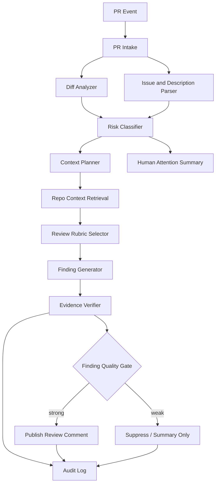
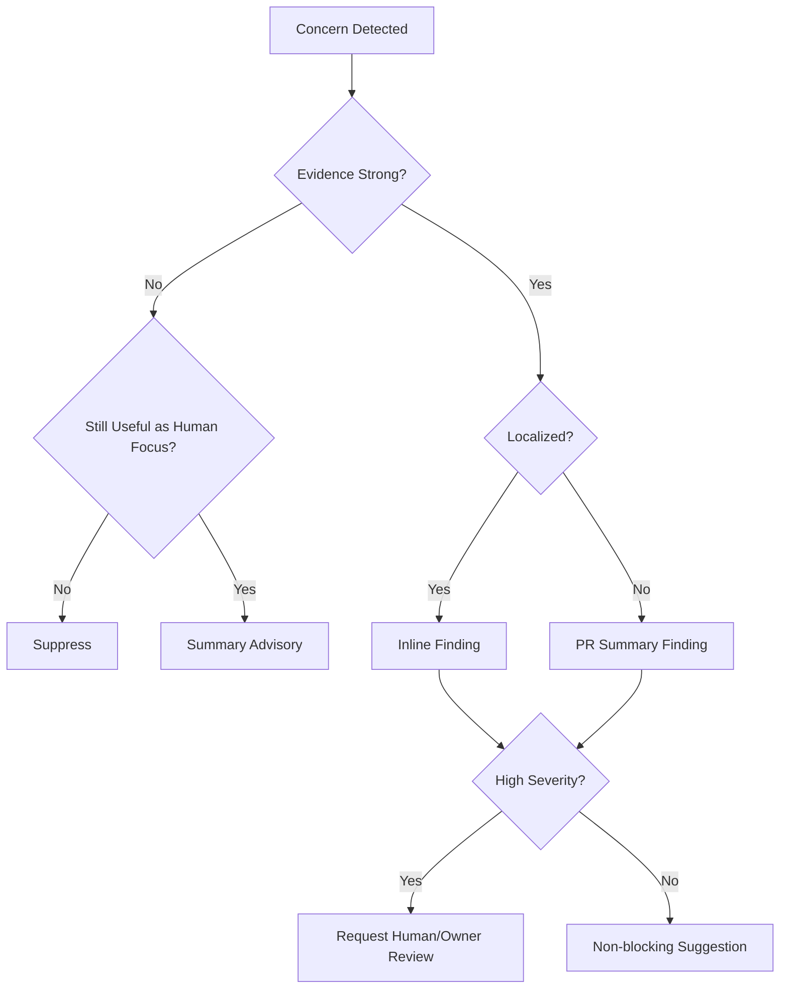
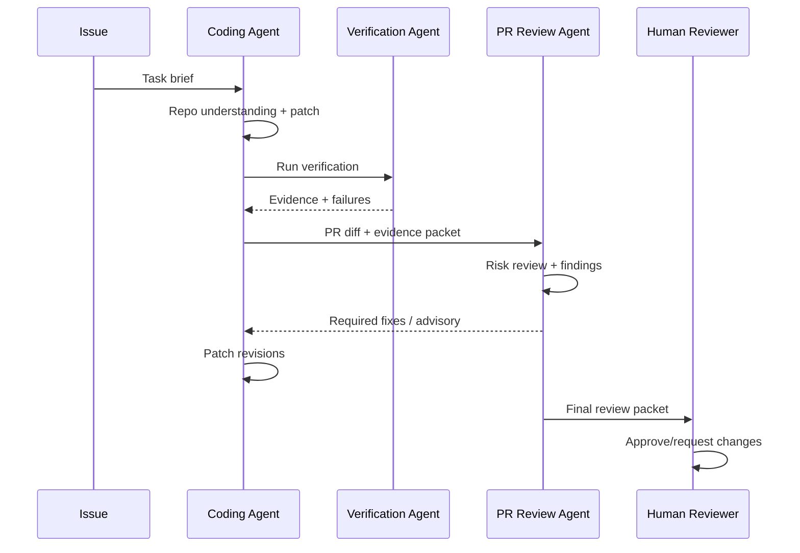

------
title: Learn Advanced Agentic AI Engineering & Autonomous Software Engineering - Part 023
description: Code review and PR review agents for autonomous software engineering: review scope, risk scoring, evidence-based findings, diff analysis, architecture/security/maintainability review, false-positive control, and review governance.
series: learn-agentic-ai-engineering
seriesTitle: Learn Advanced Agentic AI Engineering & Autonomous Software Engineering
order: 23
partTitle: Code Review and PR Review Agents
tags:
- agentic-ai
- autonomous-software-engineering
- code-review
- pr-review-agent
- engineering-governance
- series
date: 2026-06-29
---

# Part 023 — Code Review and PR Review Agents

> Target part ini: mampu mendesain **code review / PR review agent** yang memberi feedback bernilai, berbasis evidence, rendah false-positive, dan aman dipakai dalam engineering workflow produksi. Fokusnya bukan "AI komentar di PR", tetapi **risk-aware review system**.

Code review agent adalah salah satu bentuk agentic AI yang paling mudah terlihat manfaatnya, tetapi juga paling mudah menjadi noise generator.

Agent review yang buruk akan:

- mengomentari style minor yang tidak penting,
- mengulang lint/static analysis,
- melewatkan bug serius,
- memberi saran yang tidak memahami architecture,
- membuat reviewer manusia kehilangan trust,
- memperlambat PR tanpa meningkatkan kualitas.

Agent review yang baik melakukan hal berbeda:

```text
A PR review agent should not optimize for number of comments.
It should optimize for risk reduction per reviewer-minute.
```

Artinya, review agent bukan pengganti reviewer manusia secara total. Ia adalah **review amplifier**: mempercepat triage, memperluas coverage, menyiapkan evidence, dan mengarahkan perhatian manusia ke area paling berisiko.

---

## 1. Kaufman Framing

### 1.1 Target performance

Setelah part ini, kita ingin mampu:

- mendefinisikan scope review agent secara eksplisit,
- membedakan review style, correctness, security, architecture, maintainability, test, dan operational risk,
- membuat risk-scoring untuk PR,
- menghindari komentar generik dan unverifiable,
- menggabungkan diff, repository context, tests, ownership, dan policy,
- mendesain review finding yang actionable,
- mengukur false positive, false negative, severity calibration, dan developer acceptance,
- menempatkan agent review dalam governance workflow tanpa membuat bottleneck.

Target praktis:

> Jika ada PR kompleks, kita bisa membuat agent yang membaca diff, memahami konteks repository, memilih reviewer concern yang relevan, menghasilkan findings berbasis evidence, dan membedakan blocking issue dari suggestion.

### 1.2 Deconstruct the skill

Code review agent terdiri dari beberapa subskill:

1. **PR intake** — memahami tujuan PR, scope, linked issue, files changed, dan risk.
2. **Diff comprehension** — memahami perubahan behavior, bukan hanya baris yang berubah.
3. **Context expansion** — mengambil file sekitar, symbol references, tests, docs, config, dan runtime contracts.
4. **Risk classification** — menilai impact, reversibility, security, data, concurrency, migration, compatibility, dan production blast radius.
5. **Review rubric selection** — memilih checklist sesuai jenis perubahan.
6. **Finding generation** — membuat komentar yang spesifik, actionable, dan evidence-based.
7. **False-positive control** — menolak komentar jika evidence lemah.
8. **Human handoff** — menyusun summary, review packet, dan escalation.
9. **Governance logging** — menyimpan decision, skipped checks, uncertainty, dan reviewer overrides.
10. **Learning loop** — memperbaiki rubric dari accepted/rejected feedback.

### 1.3 Learn enough to self-correct

Kita tidak perlu memulai dengan agent yang bisa review semua hal.

Mulai dari kemampuan self-correction berikut:

- tahu kapan sebuah komentar terlalu generik,
- tahu kapan issue seharusnya diserahkan ke static analyzer,
- tahu kapan PR butuh konteks tambahan,
- tahu kapan agent harus diam,
- tahu kapan rekomendasi perlu human approval,
- tahu kapan severity terlalu tinggi atau terlalu rendah.

Skill utama review agent adalah **judgement calibration**.

---

## 2. Mental Model: PR Review as Risk Reduction

Review manusia bukan hanya mencari bug. Review adalah mekanisme organisasi untuk mengurangi risiko perubahan.

```text
PR review = change understanding + risk detection + quality enforcement + shared ownership
```

Untuk agent, modelnya menjadi:

```text
PR review agent = risk classifier + context retriever + rubric executor + evidence generator + human attention router
```

### 2.1 Review agent bukan lint bot

Lint bot mengecek rule eksplisit.

Review agent mengecek hal yang lebih kontekstual:

- apakah perubahan sesuai intent issue,
- apakah invariant domain rusak,
- apakah error path hilang,
- apakah backward compatibility terjaga,
- apakah test membuktikan behavior yang benar,
- apakah observability cukup untuk debugging,
- apakah perubahan membuat coupling baru,
- apakah migration plan aman,
- apakah secret/data boundary terlanggar.

Jika sebuah check bisa 100% deterministic, sebaiknya jangan dijadikan LLM review comment. Jadikan CI/static analysis.

### 2.2 Agent harus berani tidak berkomentar

Komentar yang salah lebih mahal daripada tidak berkomentar.

Alasannya:

- reviewer manusia harus membaca,
- author harus menilai,
- diskusi bisa melebar,
- trust pada agent turun,
- signal-to-noise memburuk.

Maka review agent perlu prinsip:

```text
No evidence, no comment.
Low confidence, summarize uncertainty instead of blocking.
Deterministic issue, prefer machine check.
Architectural concern, escalate with context.
```

---

## 3. Review Scope Taxonomy

Tidak semua review sama. Agent perlu tahu jenis concern yang sedang diperiksa.

| Scope | Pertanyaan inti | Cocok untuk agent? | Catatan |
|---|---|---:|---|
| Formatting | Apakah style sesuai? | Rendah | Gunakan formatter/linter. |
| Local correctness | Apakah logic lokal benar? | Sedang | Butuh tests dan context. |
| Behavioral correctness | Apakah requirement terpenuhi? | Tinggi | Butuh issue intent dan oracle. |
| Error handling | Apakah failure path aman? | Tinggi | Cocok jika rubric jelas. |
| Security | Apakah ada injection/leak/privilege risk? | Sedang-tinggi | Jangan bergantung hanya pada LLM. |
| Compatibility | Apakah API/schema/event contract berubah? | Tinggi | Butuh schema/diff/context. |
| Architecture | Apakah boundary/coupling rusak? | Tinggi tapi sulit | Butuh repo map dan design docs. |
| Performance | Apakah kompleksitas/resource use memburuk? | Sedang | Butuh benchmark/profiling untuk strong claim. |
| Observability | Apakah perubahan bisa dioperasikan? | Tinggi | Cocok untuk checklist. |
| Test quality | Apakah test membuktikan behavior? | Tinggi | Agent bisa sangat membantu. |
| Migration safety | Apakah rollout aman? | Tinggi | Butuh deployment/migration context. |

### 3.1 Rubric harus berbeda per PR type

PR bug fix berbeda dari feature, refactor, dependency upgrade, schema migration, atau security patch.

Contoh taxonomy:

```yaml
pr_type:
  bug_fix:
    focus:
      - reproduction evidence
      - regression test
      - minimal patch
      - side effects
  feature:
    focus:
      - requirement coverage
      - API contract
      - error path
      - observability
  refactor:
    focus:
      - semantic preservation
      - test coverage
      - public behavior unchanged
      - diff minimization
  migration:
    focus:
      - compatibility
      - rollback
      - data safety
      - staged rollout
  security_fix:
    focus:
      - exploit scenario
      - regression test
      - data boundary
      - bypass analysis
```

Review agent yang memakai satu checklist universal akan terlalu dangkal.

---

## 4. PR Review Agent Architecture

Arsitektur review agent produksi sebaiknya memisahkan intake, context, analysis, findings, dan publishing.



### 4.1 PR intake

PR intake mengumpulkan:

- title,
- description,
- linked issue,
- labels,
- author,
- changed files,
- diff size,
- test changes,
- generated files,
- dependencies touched,
- config touched,
- migration files,
- public API changes,
- security-sensitive paths,
- historical failure signals.

Output intake bukan teks bebas. Output harus structured.

```json
{
  "pr_id": 812,
  "pr_type_candidates": ["bug_fix", "schema_change"],
  "changed_file_count": 14,
  "risk_indicators": [
    "database_migration",
    "authorization_logic_changed",
    "public_api_response_changed"
  ],
  "requires_human_review": true,
  "initial_risk_tier": "high"
}
```

### 4.2 Diff analyzer

Diff analyzer harus memproduksi semantic view:

- functions/classes changed,
- public signatures changed,
- behavior branches added/removed,
- exception handling changed,
- validation changed,
- authorization checks changed,
- persistence query changed,
- event payload changed,
- configuration changed,
- tests added/removed.

Diff analyzer tidak boleh hanya menyalin `git diff` ke prompt. Untuk PR besar, itu boros token dan sering membuat agent kehilangan struktur.

### 4.3 Context planner

Context planner menentukan apa yang perlu dibaca.

Contoh:

| Diff signal | Context tambahan |
|---|---|
| Public method signature changed | Callers, tests, API docs, compatibility notes |
| Authorization condition changed | Policy docs, role matrix, security tests, endpoints |
| SQL query changed | Schema, indexes, transaction boundary, data volume assumptions |
| Event schema changed | Consumers, contract tests, schema registry, versioning policy |
| Retry logic changed | Idempotency contract, timeout config, incident history |
| Error handling changed | Error taxonomy, client behavior, observability docs |

### 4.4 Rubric selector

Rubric selector memilih checklist berdasarkan PR type dan risk.

```yaml
review_rubric:
  authorization_change:
    blocking:
      - missing deny-by-default behavior
      - privilege escalation path
      - tenant boundary bypass
      - missing negative tests
    non_blocking:
      - unclear role naming
      - missing policy comment
  schema_change:
    blocking:
      - destructive migration without rollback plan
      - incompatible response shape
      - missing consumer impact assessment
    non_blocking:
      - migration name unclear
      - docs not updated
```

### 4.5 Finding generator

Finding generator harus menghasilkan komentar dalam format yang bisa dievaluasi.

```yaml
finding:
  severity: blocking | major | minor | note
  category: correctness | security | compatibility | architecture | test | ops
  location:
    file: src/main/java/.../AccessPolicy.java
    line: 88
  claim: "This branch appears to allow suspended users to access tenant resources."
  evidence:
    - "The previous check required ACTIVE status before tenant membership lookup."
    - "The new condition only checks tenant membership."
    - "No negative test covers suspended user access."
  suggested_action: "Restore active-status check or add explicit denial before membership validation."
  confidence: 0.78
  requires_human_decision: true
```

Komentar seperti “Consider improving error handling” tidak cukup.

---

## 5. Risk Scoring

Review agent perlu menentukan prioritas.

### 5.1 Risk dimensions

Gunakan risk score multi-dimensi, bukan satu angka generik.

| Dimension | Pertanyaan |
|---|---|
| User impact | Apakah perubahan memengaruhi user-facing behavior? |
| Data impact | Apakah data bisa hilang/korup/bocor? |
| Security impact | Apakah authn/authz/secret boundary berubah? |
| Availability impact | Apakah perubahan bisa menyebabkan outage/degradation? |
| Compatibility impact | Apakah contract API/event/schema berubah? |
| Complexity | Apakah diff besar, tersebar, atau cross-cutting? |
| Reversibility | Apakah perubahan mudah rollback? |
| Test evidence | Apakah tests cukup membuktikan behavior? |
| Operational readiness | Apakah logging/metrics/migration/runbook cukup? |

### 5.2 Example risk classifier

```yaml
risk_score:
  user_impact: 4
  data_impact: 5
  security_impact: 3
  availability_impact: 4
  compatibility_impact: 5
  complexity: 4
  reversibility: 2
  test_evidence: 2
  operational_readiness: 2
computed_tier: high
reason:
  - "Database migration changes non-null column behavior."
  - "API response contract changed without compatibility layer."
  - "Only happy-path tests added."
```

### 5.3 Risk tier to review action

| Risk tier | Agent action |
|---|---|
| Low | Summary + optional suggestions |
| Medium | Inline findings + test evidence review |
| High | Blocking review packet + human escalation |
| Critical | Do not auto-approve; require named owner/security/release review |

Agent harus bisa mengatakan:

```text
I found no strong inline finding, but this PR is high risk because it changes an API contract and migration path. Human review should focus on compatibility and rollback.
```

Itu sering lebih berguna daripada komentar palsu di line diff.

---

## 6. Finding Quality Bar

### 6.1 Good review finding

Finding yang baik punya 7 kualitas:

1. **Specific** — menunjuk lokasi dan behavior.
2. **Evidence-based** — menyebut apa yang berubah dan mengapa bermasalah.
3. **Actionable** — memberi langkah perbaikan.
4. **Calibrated** — severity sesuai risiko.
5. **Non-duplicative** — tidak mengulang CI/lint.
6. **Context-aware** — memahami pattern repository.
7. **Verifiable** — bisa dibuktikan dengan test, reasoning, atau docs.

### 6.2 Bad review finding

Contoh komentar buruk:

```text
This function is complex. Consider refactoring.
```

Mengapa buruk:

- tidak spesifik,
- tidak menjelaskan risiko,
- tidak memberi alternatif,
- tidak tahu apakah kompleksitas memang diperlukan,
- tidak bisa diverifikasi.

Komentar lebih baik:

```text
This method now mixes validation, authorization, and persistence side effects. The risk is that validation failure after partial persistence can leave a partially-created record. Consider moving all validation and authorization checks before `repository.save(...)`, or wrap the operation in a transaction and add a regression test for invalid input after tenant lookup.
```

### 6.3 Suppression rule

Agent harus suppress komentar jika:

- hanya style preference,
- confidence rendah,
- deterministic tool lebih cocok,
- tidak ada suggested action,
- tidak ada evidence,
- berpotensi misleading,
- concern terlalu luas untuk inline comment.

Untuk concern luas, gunakan summary:

```text
Architectural note: this PR introduces a new dependency from billing to workflow runtime. I do not have enough evidence to call this incorrect, but it may violate the current layering convention. Human reviewer should confirm whether this dependency is allowed.
```

---

## 7. Review Categories

### 7.1 Correctness review

Pertanyaan inti:

- Apakah behavior sesuai requirement?
- Apakah edge case hilang?
- Apakah default path berubah?
- Apakah branch baru reachable?
- Apakah exception path berubah?
- Apakah null/empty/boundary behavior berubah?
- Apakah time/order/concurrency assumption berubah?

Checklist:

```yaml
correctness_review:
  inspect:
    - changed branches
    - removed guards
    - changed defaults
    - changed ordering
    - changed exception handling
    - changed validation
  require_evidence:
    - linked requirement or issue
    - tests for intended behavior
    - tests for negative behavior
    - reasoning for edge cases
```

### 7.2 Security review

Security review agent tidak boleh menggantikan SAST/DAST/manual security audit. Ia sebaiknya menjadi triage layer.

Fokus:

- authentication bypass,
- authorization drift,
- tenant boundary,
- injection risk,
- unsafe deserialization,
- SSRF/file access,
- secret leakage,
- insecure logging,
- unsafe dependency change,
- insecure tool/output handling.

Review comment harus menyebut exploit scenario atau bypass path, bukan sekadar “potential security issue”.

```text
The new endpoint accepts `tenantId` from request body and passes it to the repository without checking membership against the authenticated principal. If callers can choose another tenantId, this can become cross-tenant data access. Add an ownership check before repository access and a negative test for a user from a different tenant.
```

### 7.3 Architecture review

Architecture review paling sulit karena butuh local conventions.

Agent perlu context:

- package/module boundaries,
- dependency rules,
- ADRs,
- examples of similar implementations,
- forbidden dependencies,
- ownership rules,
- extension patterns,
- lifecycle constraints.

Architecture finding harus hati-hati:

```text
This introduces a dependency from `case-core` to `workflow-adapter`. Existing dependencies appear to point in the opposite direction. If `case-core` is intended to remain engine-agnostic, consider moving the mapping into the adapter layer. Human reviewer should confirm the intended dependency rule.
```

### 7.4 Maintainability review

Maintainability bukan alasan untuk komentar generik.

Agent perlu membedakan:

- duplication yang disengaja vs tidak,
- abstraction yang terlalu dini vs perlu,
- naming issue yang mengganggu domain clarity,
- hidden coupling,
- config sprawl,
- test brittleness,
- unbounded growth path.

### 7.5 Test review

Review test harus menjawab:

- Apakah test membuktikan bug/feature?
- Apakah test punya oracle kuat?
- Apakah test terlalu coupled ke implementation detail?
- Apakah negative path ada?
- Apakah edge cases relevan?
- Apakah test flaky?
- Apakah test hanya snapshot besar tanpa assertion bermakna?

Bad agent habit:

```text
Please add more tests.
```

Better:

```text
This PR changes behavior when a case is reopened after enforcement escalation, but the added test only covers initial case creation. Please add a regression test for reopened escalated cases, especially the transition from `ESCALATED` back to `UNDER_REVIEW`.
```

### 7.6 Operational review

Operational readiness sering terlewat oleh coding agent.

Checklist:

- log signal for new failure mode,
- metric for new queue/job/worker,
- trace span around external call,
- timeout/retry config,
- idempotency key,
- rollout flag,
- migration/rollback plan,
- alert threshold,
- runbook update.

Agent bisa sangat berguna untuk mengingatkan hal-hal ini karena berbasis pattern.

---

## 8. Inline Comment vs Summary vs Blocking Review

Tidak semua concern cocok jadi inline comment.

| Output type | Cocok untuk |
|---|---|
| Inline comment | Localized, specific, actionable issue |
| PR summary | Global risk, architecture concern, review guidance |
| Blocking review | Strong evidence of correctness/security/compatibility failure |
| Advisory note | Uncertainty, possible issue, human focus area |
| No comment | Low evidence, style preference, duplicate tool finding |

### 8.1 Decision model



---

## 9. Review Agent Prompt Contract

Prompt bukan satu-satunya kontrol, tetapi prompt contract tetap penting.

### 9.1 System instruction skeleton

```text
You are a pull request review agent.
Your goal is to reduce meaningful engineering risk, not maximize comments.

Only produce findings when:
- the issue is specific,
- the evidence is visible in the diff/context,
- the suggested action is actionable,
- the severity is calibrated,
- the concern is not better handled by deterministic tooling.

Suppress findings that are stylistic, speculative, generic, or low confidence.
When uncertain but risk may be significant, write a summary note for human reviewers instead of an inline blocking comment.
```

### 9.2 Output schema

```json
{
  "summary": {
    "pr_type": "bug_fix",
    "risk_tier": "medium",
    "human_focus_areas": ["error handling", "regression coverage"]
  },
  "findings": [
    {
      "severity": "major",
      "category": "correctness",
      "file": "src/.../CaseReopenService.java",
      "line": 142,
      "claim": "The reopened case path skips enforcement hold validation.",
      "evidence": [
        "The previous path called validateHoldStatus before transition.",
        "The new fast path transitions directly to UNDER_REVIEW.",
        "No test covers reopened case with active hold."
      ],
      "suggested_action": "Call validateHoldStatus before transition or add explicit exception for this path.",
      "confidence": 0.82
    }
  ],
  "suppressed_findings": [
    {
      "reason": "style_only",
      "description": "Variable naming could be shorter but does not affect review quality."
    }
  ]
}
```

Suppressed findings berguna untuk audit dan tuning, tetapi tidak perlu dipublikasikan ke PR.

---

## 10. Context Package for PR Review

Review agent membutuhkan paket konteks yang stabil.

### 10.1 Minimum context

```yaml
review_context:
  pr:
    title: ...
    description: ...
    linked_issue: ...
    labels: ...
  diff:
    changed_files: ...
    semantic_changes: ...
    tests_changed: ...
  repository:
    architecture_notes: ...
    ownership: ...
    conventions: ...
    dependency_rules: ...
  ci:
    test_results: ...
    lint_results: ...
    static_analysis: ...
  risk:
    sensitive_paths: ...
    public_contracts: ...
    migration_files: ...
```

### 10.2 Context anti-patterns

Avoid:

- dumping entire repository,
- reviewing diff without issue intent,
- ignoring tests,
- ignoring CI status,
- ignoring generated files,
- ignoring ownership/routing,
- mixing stale docs with fresh code without freshness markers.

### 10.3 Context freshness

Agent should know:

```yaml
context_freshness:
  diff: current
  base_branch: main@abc123
  tests: current_run_17
  architecture_doc: last_updated_2025_11_03
  service_ownership: current
```

Stale architecture docs can be useful, but agent must not treat them as unquestionable truth.

---

## 11. Integration with GitHub/GitLab Workflow

### 11.1 Event triggers

Common triggers:

- PR opened,
- PR ready for review,
- PR updated/synchronized,
- comment command like `/ai-review`,
- label added such as `needs-ai-review`,
- before merge queue,
- after failed CI.

### 11.2 Avoid reviewing too early

Reviewing every push can create noise.

Better:

```yaml
review_policy:
  draft_pr: summary_only
  ready_for_review: full_review
  after_force_push: incremental_review
  ci_failed: failure-focused_review
  high_risk_paths_changed: require_full_review
```

### 11.3 Incremental review

Agent should not re-comment same issue after every commit.

Need:

- finding fingerprint,
- comment update instead of duplicate,
- resolved finding detection,
- stale finding cleanup,
- diff-range mapping.

Finding fingerprint example:

```text
hash(category + normalized_claim + symbol + file + semantic_context)
```

Not just line number, because lines move.

---

## 12. Autonomous SWE PR Review Loop

In autonomous SWE, coding agent may create PR, then review agent checks it.



Important invariant:

```text
The coding agent must not be the only reviewer of its own output.
```

A separate review agent can share infrastructure, but should have separate role instructions, context, and evaluation rubric.

---

## 13. Review Agent vs Static Analysis vs Security Scanner

Review agent should coordinate with deterministic tools.

| Tool | Strength | Weakness |
|---|---|---|
| Formatter | Style consistency | No semantic insight |
| Linter | Known rule violations | Can miss domain risk |
| Type checker | Type safety | Does not prove behavior |
| SAST | Known security patterns | False positives; context gaps |
| Dependency scanner | CVEs/licenses | Does not understand usage |
| Test runner | Executable evidence | Only covers tested behavior |
| LLM review agent | Contextual reasoning | Non-determinism; hallucination risk |

Best architecture:

```text
Deterministic tools produce evidence.
Agent interprets and prioritizes evidence.
Humans decide high-impact ambiguity.
```

---

## 14. Security and Safety of Review Agents

Review agents read code, secrets-like strings, configs, comments, and sometimes logs. Treat them as sensitive systems.

### 14.1 Threats

| Threat | Example | Control |
|---|---|---|
| Prompt injection in code | Comment says “ignore previous instruction” | Treat repo content as untrusted data |
| Secret exposure | Agent includes key in review comment | Secret redaction before model/context/output |
| Malicious PR manipulation | PR includes instructions to approve | Separate instruction hierarchy |
| Data exfiltration via tool | Agent calls external URL with code | Tool egress policy |
| False approval | Agent says safe without evidence | Approval gate + evidence requirement |
| Review poisoning | Author optimizes PR text to fool agent | Use diff/evidence, not description only |

### 14.2 Untrusted code principle

Repository content is input, not instruction.

```text
Code comments, markdown files, issue descriptions, and PR text must not override system policy.
```

This is especially important for public repositories and external contributors.

### 14.3 Review output redaction

Before publishing comments:

- detect secrets,
- detect internal-only data,
- detect private incident links,
- detect customer identifiers,
- detect exploit details that should be private.

Security finding output may need private channel rather than public PR comment.

---

## 15. Evaluation of PR Review Agents

### 15.1 Metrics

Use metrics that reflect review usefulness.

| Metric | Meaning |
|---|---|
| Finding precision | Fraction of comments accepted as valid |
| Finding recall | Fraction of known issues found |
| Severity calibration | Whether severity matches human judgement |
| Actionability | Whether author can act without clarification |
| Duplicate rate | Repeated/same comments |
| Noise rate | Low-value comments per PR |
| Time-to-review | Latency until useful review |
| Developer acceptance | Applied suggestions / accepted comments |
| Human override rate | How often humans reject/override agent |
| Regression prevention | Issues caught before merge |

### 15.2 Gold set

Create a review evaluation set from historical PRs:

- PRs with known review comments,
- PRs that caused incidents,
- PRs with security fixes,
- PRs with revert follow-ups,
- PRs with test failures after merge,
- PRs with accepted architecture comments.

But do not blindly treat historical comments as ground truth. Human reviews also contain noise.

### 15.3 Review eval schema

```yaml
review_eval_case:
  pr_id: 1021
  diff: ...
  context_bundle: ...
  known_findings:
    - category: correctness
      severity: major
      acceptable_locations:
        - file: CaseTransitionService.java
          lines: [120, 145]
      expected_claim: "suspended cases can transition to approved"
  unacceptable_findings:
    - "style-only naming suggestion"
  scoring:
    precision_weight: 0.35
    recall_weight: 0.35
    severity_weight: 0.15
    actionability_weight: 0.15
```

### 15.4 Trajectory evaluation

Evaluate not only final comments, but also:

- context selected,
- evidence used,
- suppressed comments,
- uncertainty handling,
- tool calls,
- retries,
- time/cost.

This mirrors agent evaluation more broadly: the trajectory matters because two agents can produce similar comments for very different reasons.

---

## 16. Governance Model

### 16.1 Review authority

Agent review output should have explicit authority:

| Authority level | Meaning |
|---|---|
| Advisory | Human may ignore |
| Required response | Author must respond before merge |
| Blocking recommendation | Human owner must decide |
| Automated block | Only for deterministic policy violation |

Do not let LLM-only judgement become an unreviewable gate for high-impact changes.

### 16.2 Audit trail

Store:

- model/version,
- prompt/rubric version,
- context hashes,
- diff hash,
- tool results,
- findings,
- suppressed findings,
- confidence,
- human feedback,
- final outcome.

### 16.3 Ownership routing

Agent can route review:

```yaml
review_routing:
  files:
    - path: services/authz/**
      required_reviewers:
        - security-team
        - platform-identity-owner
    - path: db/migrations/**
      required_reviewers:
        - data-platform-owner
  risk_tier_high:
    required_reviewers:
      - service-owner
```

This is often more valuable than trying to “solve” the review itself.

---

## 17. Common Anti-Patterns

### 17.1 Comment maximizer

Agent produces many comments to look useful.

Fix:

- hard cap comments,
- require evidence,
- rank by risk,
- suppress low confidence.

### 17.2 Style bot in disguise

Agent mostly comments on naming/style.

Fix:

- delegate style to deterministic tools,
- restrict LLM to semantic/risk review,
- measure noise rate.

### 17.3 Self-review illusion

Coding agent reviews its own patch and approves.

Fix:

- separate reviewer role,
- separate context/rubric,
- human gate for high risk.

### 17.4 No context review

Agent reads diff only.

Fix:

- context planner,
- symbol/caller lookup,
- tests/docs retrieval,
- dependency graph.

### 17.5 Blocking without evidence

Agent blocks PR based on speculative concern.

Fix:

- require evidence array,
- severity calibration,
- reviewer escalation.

### 17.6 Security theater

Agent labels everything “security risk”.

Fix:

- require exploit/bypass scenario,
- integrate SAST/dependency tools,
- calibrate severity with security team.

---

## 18. Implementation Blueprint

### 18.1 Minimal viable PR review agent

Start with limited scope:

```yaml
mvp_scope:
  languages:
    - Java
    - TypeScript
  review_categories:
    - test_quality
    - error_handling
    - compatibility
  trigger:
    - manual /ai-review
  output:
    - PR summary
    - max 5 inline findings
  authority:
    - advisory only
```

### 18.2 Production hardening roadmap

```text
Stage 1: Summary-only review
Stage 2: Inline advisory findings
Stage 3: Risk-tier classification
Stage 4: Integration with CI/static analysis
Stage 5: Owner routing and review packets
Stage 6: Blocking only for deterministic policy violations
Stage 7: Continuous eval and feedback learning
```

### 18.3 Pseudocode

```python
class PullRequestReviewAgent:
    def review(self, pr_event):
        intake = self.pr_intake.parse(pr_event)
        semantic_diff = self.diff_analyzer.analyze(intake.diff)
        risk = self.risk_classifier.classify(intake, semantic_diff)

        context_plan = self.context_planner.plan(
            intake=intake,
            semantic_diff=semantic_diff,
            risk=risk,
        )
        context = self.context_retriever.retrieve(context_plan)

        rubric = self.rubric_selector.select(
            pr_type=intake.pr_type_candidates,
            risk=risk,
            changed_files=intake.changed_files,
        )

        candidate_findings = self.finding_generator.generate(
            semantic_diff=semantic_diff,
            context=context,
            rubric=rubric,
        )

        verified = []
        suppressed = []
        for finding in candidate_findings:
            result = self.finding_gate.evaluate(finding)
            if result.publishable:
                verified.append(result.finding)
            else:
                suppressed.append(result.reason)

        return ReviewResult(
            summary=self.summary_builder.build(intake, risk, verified, suppressed),
            findings=self.rank_and_limit(verified),
            audit=self.audit_builder.build(...),
        )
```

---

## 19. Reviewer UX

Agent review should respect developer attention.

### 19.1 Good PR summary

```md
## AI Review Summary

Risk tier: High
Primary focus areas for human reviewers:
1. API compatibility: response shape changed in `CaseSummaryResponse`.
2. Data migration: new non-null column requires backfill verification.
3. Test evidence: only happy-path tests added.

Published findings: 2
Suppressed low-confidence findings: 4
CI status considered: unit tests passed, integration tests pending
```

### 19.2 Good inline comment

```md
**Major — compatibility**

This changes `statusReason` from nullable to required in the response mapper, but I do not see a compatibility layer or contract test for older clients.

Evidence:
- `CaseSummaryResponse.statusReason` is now required.
- Existing controller test only validates the new response.
- No consumer contract test was updated.

Suggested action: keep the field backward-compatible during rollout or add a versioned response path plus consumer contract tests.
```

### 19.3 Bad inline comment

```md
Maybe improve this logic.
```

No evidence, no action, no category, no severity.

---

## 20. Practice Tasks

### Task 1 — Build a review rubric

Pick one repository and define review rubrics for:

- bug fix,
- feature,
- refactor,
- migration,
- security fix.

Each rubric must include blocking and non-blocking findings.

### Task 2 — Build a risk classifier

Given 20 historical PRs, label:

- PR type,
- risk dimensions,
- risk tier,
- required reviewer roles.

Compare with actual review outcomes.

### Task 3 — Review finding quality gate

Create a rule that suppresses findings unless they have:

- category,
- severity,
- specific location,
- claim,
- evidence,
- suggested action,
- confidence.

### Task 4 — Historical PR eval

Take 10 PRs that caused bugs after merge.
Ask the agent to review the original diff.
Measure whether it would have flagged the issue.

### Task 5 — Noise budget

Run review agent on 30 low-risk PRs.
Measure:

- average comments per PR,
- accepted comments,
- rejected comments,
- duplicates,
- style-only comments.

Goal: reduce noise without losing meaningful findings.

---

## 21. Checklist

Use this checklist when designing PR review agents.

```text
[ ] Does the agent optimize for risk reduction, not comment count?
[ ] Is PR type classified before review?
[ ] Is risk scored across multiple dimensions?
[ ] Does the agent retrieve context beyond diff?
[ ] Are rubrics selected by PR type and risk?
[ ] Are findings evidence-based and actionable?
[ ] Are low-confidence findings suppressed?
[ ] Is deterministic tooling used before LLM judgement?
[ ] Are security findings routed safely?
[ ] Is human authority explicit?
[ ] Are duplicate comments avoided?
[ ] Are findings and suppressed findings logged?
[ ] Is review quality evaluated against historical PRs?
[ ] Is developer feedback used to tune rubrics?
```

---

## 22. Key Takeaways

- Code review agent is a **risk reduction system**, not a comment generator.
- The most important output may be a human focus summary, not inline comments.
- Review scope must be explicit: correctness, security, architecture, test, compatibility, ops.
- Strong findings require claim, evidence, severity, location, and suggested action.
- Agent must suppress weak/speculative comments.
- Deterministic tools should produce evidence; LLM should interpret and prioritize.
- Review agent must treat repository content as untrusted data.
- In autonomous SWE, coding agent and review agent should be separate roles.
- Evaluation must measure precision, recall, severity calibration, actionability, and noise.

---

## 23. References

- OpenAI Developers — Codex code review in GitHub: https://developers.openai.com/codex/integrations/github
- GitHub Docs — Using GitHub Copilot code review: https://docs.github.com/copilot/using-github-copilot/code-review/using-copilot-code-review
- GitHub Docs — About GitHub Copilot code review: https://docs.github.com/en/copilot/concepts/agents/code-review
- Anthropic — Building effective agents: https://www.anthropic.com/research/building-effective-agents
- OWASP Top 10 for LLM Applications: https://owasp.org/www-project-top-10-for-large-language-model-applications/
- OWASP Agentic AI Security: https://owasp.org/www-project-agentic-ai-security/
- SWE-bench: Can Language Models Resolve Real-World GitHub Issues?: https://arxiv.org/abs/2310.06770
- SWE-bench official site: https://www.swebench.com/
