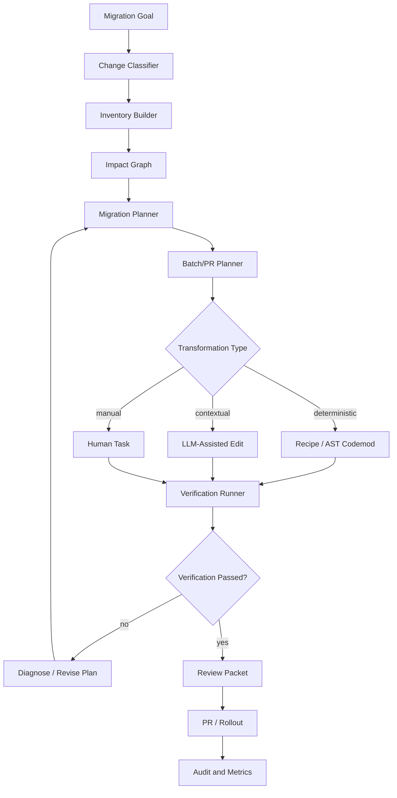
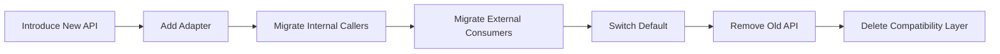
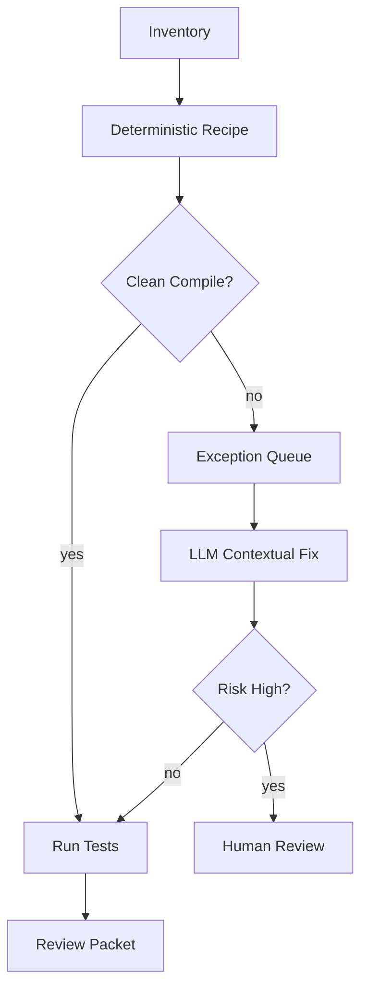
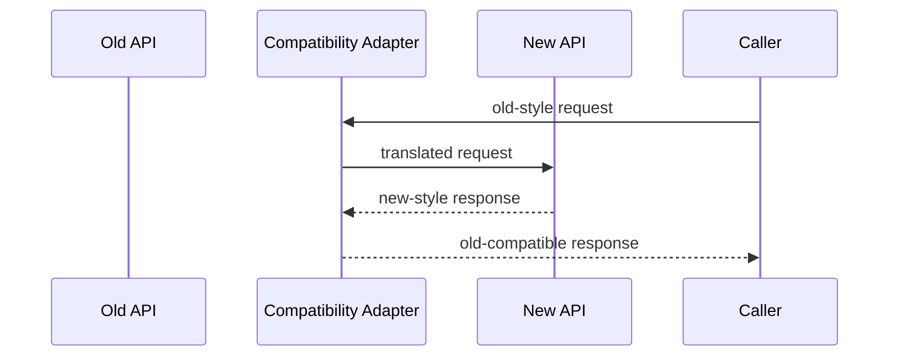
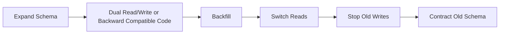
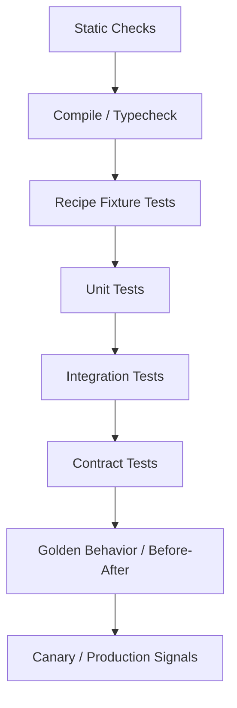

------
title: Learn Advanced Agentic AI Engineering & Autonomous Software Engineering - Part 024
description: Refactoring and migration agents for autonomous software engineering: semantic preservation, large-scale code mods, API migration, dependency upgrades, recipe-driven transformations, rollout strategy, and migration safety.
series: learn-agentic-ai-engineering
seriesTitle: Learn Advanced Agentic AI Engineering & Autonomous Software Engineering
order: 24
partTitle: Refactoring and Migration Agents
tags:
- agentic-ai
- autonomous-software-engineering
- refactoring
- migration-agent
- code-mod
- series
date: 2026-06-29
---

# Part 024 — Refactoring and Migration Agents

> Target part ini: mampu mendesain **refactoring and migration agents** untuk perubahan skala besar yang menjaga semantic preservation, kompatibilitas, rollback path, dan evidence. Fokusnya bukan “agent edit banyak file”, tetapi **controlled transformation system**.

Refactoring dan migration adalah arena yang sangat cocok untuk autonomous software engineering, tetapi juga sangat berbahaya jika agent tidak dibatasi.

Perubahan seperti:

- mengganti API lama ke API baru,
- upgrade framework,
- migrasi package/module,
- memperbaiki vulnerability dependency,
- mengubah schema/event contract,
- mengganti pattern concurrency,
- memindahkan layer architecture,
- menghapus deprecated behavior,

sering menyentuh ratusan sampai ribuan file.

Agent yang naïf akan mencoba membaca banyak file, mengedit banyak tempat, lalu berharap tests cukup.

Agent yang baik memperlakukan migrasi sebagai **program transformasi yang bisa diverifikasi**.

```text
A migration agent should not optimize for broad edits.
It should optimize for safe, repeatable, reviewable, and reversible transformation.
```

---

## 1. Kaufman Framing

### 1.1 Target performance

Setelah part ini, kita ingin mampu:

- membedakan refactoring, migration, modernization, codemod, dan behavioral rewrite,
- menentukan apakah perubahan aman untuk agent atau butuh recipe deterministic,
- membuat migration plan berbasis inventory dan dependency graph,
- menjaga semantic preservation,
- menghindari massive diff yang tidak bisa direview,
- menggabungkan AST/code-mod tools dengan LLM reasoning,
- mendesain rollout, compatibility, rollback, dan verification strategy,
- mengevaluasi migration agent dengan before/after behavior dan diff quality.

Target praktis:

> Jika organisasi perlu upgrade framework, mengganti API deprecated, atau memigrasikan architecture pattern, kita bisa membuat agent yang melakukan inventory, mengusulkan plan, menjalankan transformasi bertahap, memverifikasi hasil, dan menghasilkan PR yang bisa direview secara realistis.

### 1.2 Deconstruct the skill

Refactoring and migration agent terdiri dari subskill:

1. **Change classification** — refactor murni atau behavior change?
2. **Inventory** — semua lokasi terdampak, call sites, tests, configs, docs.
3. **Dependency analysis** — order migrasi berdasarkan graph.
4. **Recipe design** — deterministic transform bila memungkinkan.
5. **LLM-assisted adaptation** — bagian yang butuh judgement lokal.
6. **Semantic preservation** — behavior lama tetap sama kecuali intentionally changed.
7. **Compatibility strategy** — adapter, dual-write, versioning, feature flag.
8. **Batching** — memecah migration menjadi PR kecil.
9. **Verification** — compile, tests, golden behavior, contract tests, diff audit.
10. **Rollback** — revertability dan migration undo path.
11. **Human review packet** — bukti transformasi, risk, exception list.
12. **Governance** — approval, ownership, audit, rollout.

### 1.3 Learn enough to self-correct

Refactoring agent harus bisa menyadari:

- perubahan ini tidak murni refactor,
- diff terlalu besar untuk review,
- transformasi harus deterministic, bukan LLM free-edit,
- tests tidak cukup membuktikan semantic preservation,
- ada compatibility/rollout gap,
- ada area yang harus dikecualikan,
- ada package/module owner yang harus approve.

---

## 2. Mental Model: Transformation, Not Editing

Refactoring/migration agent bukan “coding agent yang lebih besar”.

Coding agent biasanya menyelesaikan satu issue.
Migration agent mengubah banyak bagian sistem dengan constraint ketat.

```text
Migration = inventory + plan + transformation + verification + rollout + audit
```

### 2.1 Refactoring vs migration

| Work type | Behavior berubah? | Scope | Risk |
|---|---:|---|---|
| Local refactor | Tidak | Satu area | Rendah-sedang |
| Structural refactor | Tidak seharusnya | Banyak module | Sedang-tinggi |
| API migration | Bisa | Call sites + contracts | Tinggi |
| Dependency upgrade | Bisa | Build/runtime behavior | Tinggi |
| Framework modernization | Bisa | Cross-cutting | Tinggi |
| Data migration | Ya/operational | Database/storage | Sangat tinggi |
| Architecture migration | Bisa | Ownership/boundaries | Sangat tinggi |

### 2.2 Refactoring invariant

Refactoring memiliki invariant utama:

```text
External observable behavior must remain unchanged.
```

Jika behavior berubah, itu bukan refactoring murni. Itu migration atau feature/change.

Agent harus menandai perubahan behavior secara eksplisit.

```yaml
change_contract:
  intended_behavior_change: false
  allowed_changes:
    - package rename
    - internal method extraction
    - deprecated API replacement with equivalent behavior
  forbidden_changes:
    - response contract change
    - error code change
    - persistence semantics change
    - authorization behavior change
```

---

## 3. Architecture of a Migration Agent



Key design:

- deterministic transformations first,
- LLM only where contextual judgement is required,
- human task for ambiguous/high-risk cases,
- verification after each batch,
- audit everything.

---

## 4. Change Classification

Before any edit, classify the migration.

### 4.1 Classification questions

```yaml
classification_questions:
  - Is observable behavior intended to change?
  - Is the public API affected?
  - Are persisted data formats affected?
  - Are event schemas affected?
  - Are permissions/authz affected?
  - Is runtime configuration affected?
  - Is rollback possible by revert only?
  - Can transformation be expressed as AST recipe?
  - Are tests sufficient to detect semantic drift?
```

### 4.2 Classification output

```json
{
  "migration_type": "api_migration",
  "semantic_preservation_required": true,
  "public_contract_risk": "medium",
  "data_risk": "low",
  "security_risk": "low",
  "recommended_strategy": "deterministic_recipe_plus_contextual_fixups",
  "requires_human_approval": true
}
```

---

## 5. Inventory Builder

Inventory is the map of everything affected.

### 5.1 Inventory dimensions

| Dimension | Examples |
|---|---|
| Source call sites | Method/class/function usages |
| Imports/dependencies | Package imports, build deps, plugin versions |
| Tests | Unit/integration/contract tests touching old API |
| Configuration | YAML/properties/env flags |
| Documentation | README, ADR, generated docs |
| Runtime contracts | API schema, event schema, DB schema |
| Ownership | Teams/files/modules requiring review |
| Exclusions | Generated/vendor/legacy frozen areas |

### 5.2 Inventory output

```yaml
inventory:
  target_api: OldCaseTransitionClient
  total_usages: 184
  by_module:
    case-core: 71
    enforcement-service: 42
    reporting-service: 19
    test-fixtures: 52
  public_contracts:
    - openapi/case-api.yaml
    - events/case-transitioned.schema.json
  high_risk_usages:
    - services/enforcement/.../EscalationHandler.java
    - services/case-core/.../ManualOverrideService.java
  exclusions:
    - generated/**
    - legacy-frozen/**
```

Inventory harus dibuat sebelum plan.

Tanpa inventory, agent akan memilih file yang mudah ditemukan, bukan file yang paling penting.

---

## 6. Impact Graph and Ordering

Migration often has dependency order.



### 6.1 Ordering rules

Common safe order:

1. Add new capability without removing old one.
2. Add compatibility adapter.
3. Add tests proving equivalence.
4. Migrate low-risk callers.
5. Migrate high-risk callers with owners.
6. Switch default behavior behind flag.
7. Monitor production.
8. Remove old path only after stability window.

### 6.2 Bad ordering

```text
Remove old API -> fix compile errors -> hope tests pass
```

This creates unnecessary chaos and hides semantic drift inside compile fixes.

---

## 7. Deterministic Recipes vs LLM Edits

### 7.1 Prefer deterministic transformations

For large-scale changes, AST/recipe-based tools are usually safer than free-form LLM edits.

Examples:

- rename method,
- change import,
- replace API call with equivalent call,
- update annotation,
- change configuration key,
- add parameter with default,
- update dependency coordinates,
- move package.

Deterministic recipe benefits:

- repeatable,
- reviewable,
- testable,
- less hallucination,
- can be rerun,
- easier to rollback,
- works across many repositories.

### 7.2 Use LLM for contextual adaptation

LLM is useful when:

- old and new APIs are not one-to-one,
- local domain naming matters,
- migration requires choosing behavior based on context,
- tests need semantic adaptation,
- docs need explanation,
- error handling differs by caller,
- generated recipe fails on edge cases.

### 7.3 Hybrid pattern

```text
Recipe handles 80% deterministic cases.
LLM handles exception queue.
Human reviews high-risk exceptions.
```



---

## 8. Recipe Design

A recipe is a codified transformation.

### 8.1 Recipe contract

```yaml
recipe:
  name: migrate-old-case-client-to-new-case-client
  intent: Replace OldCaseTransitionClient with NewCaseWorkflowClient where behavior is equivalent.
  applies_to:
    - Java source files
  excludes:
    - generated/**
    - legacy-frozen/**
  preconditions:
    - OldCaseTransitionClient import exists
  transformations:
    - replace import
    - replace constructor dependency
    - replace transitionCase(...) call
  postconditions:
    - no OldCaseTransitionClient usage remains outside exclusions
    - project compiles
    - compatibility tests pass
  semantic_notes:
    - New API requires explicit actorId; derive from existing request context.
```

### 8.2 Recipe should be tested

Test recipe on fixtures:

```text
before.java -> recipe -> after.java
```

For migration recipes, fixture tests are critical because they prevent accidental broad rewrite.

### 8.3 Recipe limitations

Recipes should output exception list:

```yaml
exceptions:
  - file: ManualOverrideService.java
    reason: "New API requires decision reason not available in local scope."
    recommended_action: "Human/LLM contextual edit required."
```

Exception list is not failure. It is controlled uncertainty.

---

## 9. Semantic Preservation

Semantic preservation is the core challenge.

### 9.1 What can drift?

| Drift type | Example |
|---|---|
| Return value drift | Old API returned null, new API throws |
| Error drift | Error code/status changes |
| Timing drift | Lazy call becomes eager call |
| Transaction drift | Operation moves outside transaction |
| Authorization drift | Check happens after side effect |
| Retry drift | New client retries non-idempotent operation |
| Serialization drift | Field omitted vs null |
| Ordering drift | Results sorted differently |
| Concurrency drift | Lock boundary changes |
| Observability drift | Logs/metrics removed |

### 9.2 Preservation evidence

Use multiple layers:

```yaml
semantic_preservation_evidence:
  compile: passed
  unit_tests: passed
  integration_tests: passed
  contract_tests: passed
  golden_master: passed
  before_after_snapshot: no_diff_for_public_response
  mutation_check: selected_mutants_killed
  manual_review: required_for_high_risk_paths
```

### 9.3 Golden behavior tests

For migration, snapshot/golden tests can be useful if carefully scoped.

Example:

```text
Given old implementation and new implementation,
for representative inputs,
public output and error behavior should match.
```

Avoid massive snapshots that no one can review.

---

## 10. Batching and PR Strategy

Large migration PRs fail socially even if technically correct.

### 10.1 Batch types

| Batch type | Goal |
|---|---|
| Preparation PR | Add new abstraction/adapter/tests |
| Mechanical PR | Deterministic low-risk transform |
| Module PR | Migrate one bounded module |
| High-risk PR | Migrate sensitive paths with owner review |
| Cleanup PR | Remove old code after stabilization |

### 10.2 Example migration plan

```yaml
migration_plan:
  phase_1_prepare:
    - add NewCaseWorkflowClient adapter
    - add equivalence tests
    - add feature flag
  phase_2_mechanical:
    - migrate test fixtures
    - migrate low-risk internal callers
  phase_3_core:
    - migrate case-core service
    - migrate enforcement-service with owner review
  phase_4_rollout:
    - enable flag in canary
    - monitor error rate and latency
  phase_5_cleanup:
    - remove OldCaseTransitionClient
    - remove compatibility adapter
```

### 10.3 PR size policy

```yaml
pr_policy:
  max_files_changed_soft: 50
  max_behavior_domains: 1
  generated_changes_separate: true
  mechanical_and_behavioral_changes_separate: true
  require_review_packet: true
```

Mechanical and behavioral changes should be separate whenever possible.

---

## 11. Dependency Upgrade Agents

Dependency upgrade is a common migration case.

### 11.1 Upgrade risk

Dependency upgrades can change:

- public APIs,
- transitive dependencies,
- default config,
- serialization behavior,
- security posture,
- performance,
- startup behavior,
- license constraints,
- runtime compatibility.

### 11.2 Upgrade workflow

```text
Read release notes -> classify breaking changes -> inventory usage -> apply recipes -> compile -> run targeted tests -> run contract tests -> review dependency tree -> produce upgrade packet
```

### 11.3 Upgrade packet

```yaml
upgrade_packet:
  dependency: framework-x
  from: 2.7.4
  to: 3.1.2
  reason:
    - security fix
    - supported version policy
  breaking_changes:
    - config key renamed
    - default timeout changed
  applied_recipes:
    - rename-config-key
    - replace-deprecated-client
  verification:
    - compile passed
    - unit tests passed
    - integration tests passed
    - dependency tree reviewed
  risks:
    - production timeout behavior may change
  rollout:
    - canary service first
    - monitor timeout/error metrics
```

---

## 12. API Migration Agents

API migration requires compatibility thinking.

### 12.1 API migration pattern



### 12.2 Compatibility questions

- Does the new API preserve null/empty semantics?
- Are error codes/statuses equivalent?
- Are timeouts/retries equivalent?
- Is authentication/authorization equivalent?
- Are optional fields still optional?
- Are consumers versioned?
- Is old behavior still supported during rollout?

### 12.3 Agent output for API migration

```yaml
api_migration_review:
  compatibility_preserved: partial
  incompatible_changes:
    - "old API returned 404; new API returns 403 for unauthorized missing resource"
  required_actions:
    - add compatibility mapping in adapter
    - add contract test for unauthorized missing resource
    - update migration note
```

---

## 13. Data Migration Agents

Data migration is high-risk and often should not be fully autonomous.

Agent can assist with:

- impact analysis,
- migration script review,
- backfill plan,
- rollback plan,
- validation query generation,
- runbook generation,
- monitoring checklist,
- dry-run analysis.

But production execution should require human approval.

### 13.1 Data migration checklist

```text
[ ] Is migration additive first?
[ ] Is destructive change delayed?
[ ] Is backfill idempotent?
[ ] Is rollback possible?
[ ] Is validation query defined?
[ ] Is batch size controlled?
[ ] Is lock/runtime impact understood?
[ ] Are old and new application versions compatible during rollout?
[ ] Is monitoring defined?
[ ] Is owner approval required?
```

### 13.2 Expand-contract pattern



Agent should flag migrations that skip expand phase and directly perform destructive contract.

---

## 14. Architecture Migration Agents

Architecture migration changes boundaries, not just code.

Examples:

- monolith to modules,
- controller logic to service layer,
- direct DB access to repository boundary,
- synchronous call to event-driven integration,
- vendor-specific API to internal port/adapter,
- legacy workflow engine to new orchestration layer.

### 14.1 Architecture migration plan

```yaml
architecture_migration:
  target_boundary: "case-core must not depend on workflow-runtime"
  current_violations: 37
  strategy:
    - introduce port interface in case-core
    - implement adapter in workflow-adapter
    - migrate callers by module
    - add architecture test to prevent regression
  verification:
    - dependency rule test
    - module integration tests
    - runtime smoke tests
```

### 14.2 Architecture tests

For long migrations, add tests that prevent backslide:

```text
No class in package `case.core..` may depend on package `workflow.runtime..`.
```

Agent should create or suggest deterministic architecture checks where possible.

---

## 15. LLM Role in Migration

LLM should be a planner and exception handler, not uncontrolled editor.

### 15.1 Good LLM tasks

- summarize breaking changes,
- infer migration pattern from examples,
- classify call sites,
- generate recipe fixture cases,
- explain semantic differences,
- propose batch plan,
- write review packet,
- adapt edge-case call sites,
- generate targeted tests.

### 15.2 Bad LLM tasks

- edit 500 files free-form,
- silently change behavior,
- remove failing tests,
- assume compile success,
- approve own migration,
- perform production data migration without gate.

### 15.3 LLM exception queue

```yaml
exception_queue_item:
  file: ManualEscalationHandler.java
  old_usage: oldClient.transition(caseId, status)
  reason_recipe_failed: new API requires actor and reason
  available_context:
    - request.getActorId()
    - command.getReason()
  proposed_change: newClient.transition(caseId, status, actorId, reason)
  risk: medium
  requires_human_review: true
```

Exception queue makes LLM work bounded and reviewable.

---

## 16. Verification Strategy

Migration verification should be layered.



### 16.1 Static verification

Examples:

- no old imports remain,
- no forbidden dependency remains,
- no deprecated API usage remains,
- architecture rules pass,
- generated files unchanged unless intended.

### 16.2 Behavioral verification

Examples:

- old and new path return same response,
- error behavior unchanged,
- transaction behavior unchanged,
- event payload unchanged,
- performance within expected range.

### 16.3 Operational verification

Examples:

- canary error rate,
- latency,
- retry count,
- database lock time,
- queue lag,
- fallback path usage,
- feature flag metrics.

---

## 17. Rollback and Reversibility

Migration without rollback is not production-grade.

### 17.1 Rollback types

| Rollback type | Example |
|---|---|
| Code revert | Revert PR |
| Config rollback | Disable feature flag |
| Data rollback | Restore backup/reverse migration |
| Dual path fallback | Route traffic back to old implementation |
| Compatibility rollback | Keep old API/schema available |

### 17.2 Agent must flag irreversible actions

Irreversible actions include:

- dropping columns,
- deleting data,
- changing encryption format without migration key strategy,
- removing API used by unknown consumers,
- changing event schema without versioning,
- deleting old code before stability window.

```yaml
rollback_assessment:
  revert_only_sufficient: false
  irreversible_actions:
    - drop_column: case_status_reason
  required_controls:
    - expand-contract migration
    - backup validation
    - manual approval
```

---

## 18. Review Packet for Migration PR

Migration PRs need better explanation than normal PRs.

### 18.1 Review packet structure

```md
## Migration Review Packet

Goal:
- Replace OldCaseTransitionClient with NewCaseWorkflowClient.

Scope:
- 71 call sites in case-core.
- No public API behavior intended to change.

Transformation:
- Recipe applied for import/client replacement.
- 6 contextual call sites manually adapted.

Semantic preservation:
- Compatibility tests passed.
- Old/new response golden comparison passed for 42 scenarios.

Risk:
- Medium: error behavior differs in 2 edge cases.

Human focus:
- Review ManualEscalationHandler and TenantOverrideService.

Rollback:
- Adapter keeps old behavior available behind flag.
```

### 18.2 Exception list

```yaml
exceptions:
  - file: ManualEscalationHandler.java
    reason: "requires actor/reason mapping"
    human_focus: true
  - file: TenantOverrideService.java
    reason: "authorization context differs"
    human_focus: true
```

This reduces reviewer load because humans know where to focus.

---

## 19. Evaluation of Migration Agents

### 19.1 Metrics

| Metric | Meaning |
|---|---|
| Inventory recall | Did agent find all impacted sites? |
| Transformation precision | Did edits only touch intended sites? |
| Compile success | Does code compile after transform? |
| Test pass rate | Do relevant tests pass? |
| Semantic preservation | Did external behavior remain equivalent? |
| Diff reviewability | Is PR reasonably small and structured? |
| Exception quality | Are ambiguous cases isolated? |
| Rollback readiness | Is rollback path documented/tested? |
| Human correction rate | How much human repair was needed? |
| Incident/regression rate | Did migration create production issues? |

### 19.2 Eval cases

Create eval set from historical migrations:

- framework upgrades,
- dependency upgrades,
- API deprecations,
- package renames,
- schema migrations,
- architecture boundary cleanup.

For each eval case, define:

```yaml
eval_case:
  goal: "Migrate from OldClient to NewClient"
  repository_snapshot: main@abc123
  expected_inventory_count: 184
  forbidden_changes:
    - public response shape
    - error code semantics
  required_tests:
    - compatibility tests
    - migration fixture tests
  scoring:
    inventory_recall: 0.25
    semantic_preservation: 0.35
    diff_quality: 0.20
    rollback_plan: 0.20
```

### 19.3 Synthetic vs real migrations

Synthetic migrations are useful for recipe testing.
Real migrations are needed for assessing:

- messy local conventions,
- incomplete tests,
- owner boundaries,
- stale docs,
- runtime behavior,
- organizational review friction.

---

## 20. Security and Governance

Migration agents often touch sensitive areas.

### 20.1 Security concerns

- dependency upgrade introduces malicious package,
- recipe changes authorization checks,
- LLM removes validation to make tests pass,
- generated code includes unsafe defaults,
- secrets appear in migration logs,
- public contract changes expose data,
- migration script corrupts data.

### 20.2 Governance controls

```yaml
governance:
  required_approvals:
    high_risk_migration:
      - service_owner
      - platform_owner
      - security_owner_if_auth_or_secret_touched
      - data_owner_if_schema_or_backfill_touched
  audit:
    - migration_goal
    - recipe_version
    - inventory_hash
    - diff_hash
    - verification_results
    - exception_list
    - human_approvals
```

### 20.3 Policy gates

Agent should stop if:

- migration touches production data destructively,
- public API contract changes without version plan,
- security-sensitive path changes without security review,
- tests are removed/weakened,
- diff exceeds reviewability threshold,
- old path removed before compatibility window.

---

## 21. Common Anti-Patterns

### 21.1 Big bang migration

All changes in one giant PR.

Fix:

- phase migration,
- separate mechanical from behavioral,
- batch by module/risk.

### 21.2 Compile-error driven migration

Delete old API and fix whatever breaks.

Fix:

- inventory first,
- adapter first,
- recipe first,
- verify equivalence.

### 21.3 LLM mass edit

Agent edits hundreds of files free-form.

Fix:

- deterministic recipes,
- exception queue,
- human review for ambiguous cases.

### 21.4 Refactor plus feature

PR mixes semantic-preserving refactor with behavior change.

Fix:

- split PR,
- explicit change contract,
- separate tests.

### 21.5 Test weakening

Agent removes or relaxes failing tests to pass migration.

Fix:

- test deletion gate,
- mutation/behavior review,
- human approval for test weakening.

### 21.6 No rollback

Migration assumes success.

Fix:

- rollback plan mandatory,
- feature flag/adapter,
- expand-contract for data.

---

## 22. Implementation Blueprint

### 22.1 Minimal viable migration agent

Start with narrow target:

```yaml
mvp:
  migration_type: deprecated_api_replacement
  transformation:
    - import replacement
    - method rename
    - argument reorder
  scope:
    - one repository
    - one language
    - non-security paths
  output:
    - inventory
    - migration plan
    - small PR
    - verification packet
  authority:
    - no auto-merge
```

### 22.2 Pseudocode

```python
class MigrationAgent:
    def migrate(self, goal):
        classification = self.classifier.classify(goal)
        if classification.requires_human_before_start:
            return self.approval_request(classification)

        inventory = self.inventory_builder.scan(goal)
        impact_graph = self.impact_graph_builder.build(inventory)
        plan = self.planner.create_batches(classification, inventory, impact_graph)

        results = []
        for batch in plan.batches:
            transform = self.transform_selector.select(batch)
            if transform.kind == "recipe":
                diff = self.recipe_runner.apply(transform.recipe, batch)
            elif transform.kind == "llm_exception":
                diff = self.llm_editor.apply_bounded(batch)
            else:
                results.append(self.human_task(batch))
                continue

            verification = self.verifier.run(batch, diff)
            if not verification.passed:
                diagnosis = self.failure_diagnoser.diagnose(verification)
                plan = self.planner.revise(plan, diagnosis)
                break

            results.append((batch, diff, verification))

        return self.review_packet_builder.build(
            goal=goal,
            classification=classification,
            inventory=inventory,
            plan=plan,
            results=results,
        )
```

---

## 23. Practice Tasks

### Task 1 — Inventory a deprecated API

Pick a deprecated API in a repository.
Create inventory:

- all call sites,
- tests,
- docs,
- configs,
- high-risk usages,
- exclusions.

### Task 2 — Design a migration recipe

Write a recipe contract:

- preconditions,
- transformations,
- postconditions,
- fixture tests,
- exception handling.

### Task 3 — Split a migration plan

Take a large migration and split into:

- preparation PR,
- mechanical PR,
- module PRs,
- high-risk PR,
- cleanup PR.

### Task 4 — Semantic preservation checklist

For one migration, define what behavior must not change:

- API response,
- error behavior,
- persistence behavior,
- event payload,
- authorization behavior.

### Task 5 — Rollback assessment

For one migration plan, identify:

- reversible steps,
- irreversible steps,
- feature flags,
- backups,
- validation queries,
- owner approvals.

---

## 24. Checklist

Use this checklist before allowing a migration agent to edit code.

```text
[ ] Is the change classified correctly?
[ ] Is semantic preservation required?
[ ] Is full inventory available?
[ ] Is impact graph available?
[ ] Is transformation deterministic where possible?
[ ] Are LLM edits bounded to exception queue?
[ ] Are mechanical and behavioral changes separated?
[ ] Is PR batching reviewable?
[ ] Are tests sufficient for behavior preservation?
[ ] Are compatibility and rollout strategy defined?
[ ] Is rollback path defined?
[ ] Are high-risk paths routed to owners?
[ ] Is audit trail stored?
[ ] Are recipe/version/context hashes captured?
```

---

## 25. Key Takeaways

- Migration agent is a **controlled transformation system**, not a mass-edit bot.
- Inventory comes before plan; plan comes before edit.
- Deterministic recipes should handle broad mechanical changes.
- LLM should handle contextual exceptions, not uncontrolled file rewrites.
- Refactoring requires semantic preservation; behavior change must be explicit.
- Large migrations should be phased into reviewable PRs.
- Compatibility and rollback are part of the design, not afterthoughts.
- Data and architecture migrations require strong human approval gates.
- Evaluation must measure inventory recall, semantic preservation, diff quality, and rollback readiness.

---

## 26. References

- OpenRewrite Docs — Introduction: https://docs.openrewrite.org/
- OpenRewrite Docs — Recipes: https://docs.openrewrite.org/concepts-and-explanations/recipes
- OpenRewrite Docs — How to automate breaking changes: https://docs.openrewrite.org/authoring-recipes/automate-breaking-changes
- OpenRewrite GitHub Repository: https://github.com/openrewrite/rewrite
- Refactoring Guru — Refactoring fundamentals: https://refactoring.guru/refactoring
- Martin Fowler — Refactoring: https://martinfowler.com/books/refactoring.html
- Anthropic — Building effective agents: https://www.anthropic.com/research/building-effective-agents
- SWE-bench: Can Language Models Resolve Real-World GitHub Issues?: https://arxiv.org/abs/2310.06770
- OWASP Top 10 for LLM Applications: https://owasp.org/www-project-top-10-for-large-language-model-applications/
