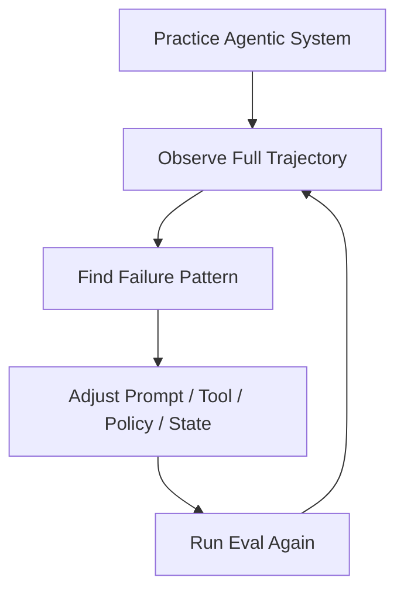
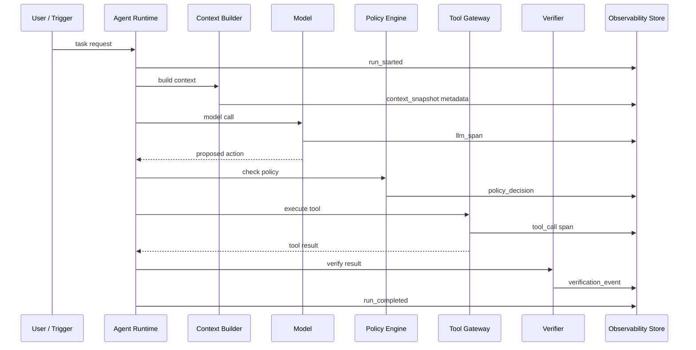
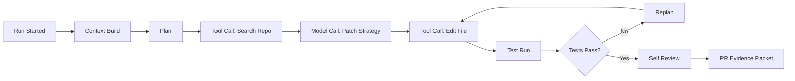
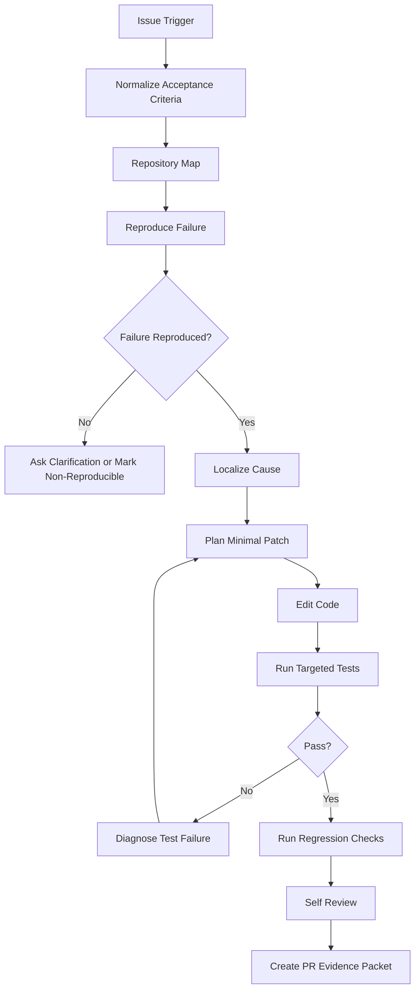
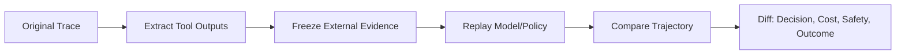
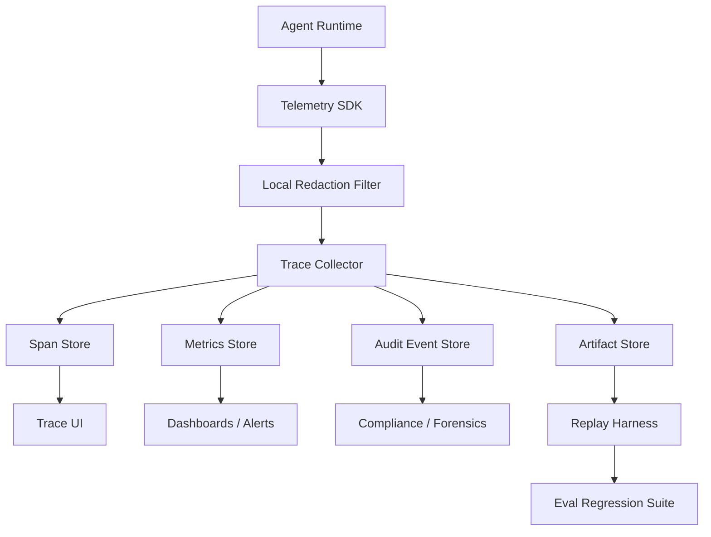

------
title: Learn Advanced Agentic AI Engineering & Autonomous Software Engineering - Part 027
description: Observability for production agentic systems: traces, spans, decision logs, tool-call telemetry, context and memory visibility, trajectory debugging, privacy-aware logging, dashboards, alerts, and audit reconstruction.
series: learn-agentic-ai-engineering
seriesTitle: Learn Advanced Agentic AI Engineering & Autonomous Software Engineering
order: 27
partTitle: Observability for Agentic Systems
tags:
- agentic-ai
- autonomous-software-engineering
- observability
- tracing
- telemetry
- agentops
- series
date: 2026-06-29
---

# Part 027 — Observability for Agentic Systems

> Target part ini: mampu mendesain **observability layer** untuk agentic system produksi: trace, span, event log, tool-call telemetry, context visibility, memory audit, cost/latency monitoring, decision reconstruction, dan incident investigation. Fokusnya bukan sekadar “mencatat prompt dan response”, tetapi **membuat perilaku agent dapat dipahami, diuji, dibatasi, dan dipertanggungjawabkan**.

Agentic system tanpa observability adalah black box yang diberi akses tool.

Itu tidak layak untuk production.

Di aplikasi tradisional, observability biasanya menjawab:

- request mana lambat,
- service mana error,
- dependency mana down,
- deployment mana menyebabkan regression,
- user mana terdampak.

Di agentic system, pertanyaannya bertambah:

- goal apa yang dipahami agent,
- context apa yang dipakai,
- evidence mana yang memengaruhi keputusan,
- tool apa yang dipilih,
- kenapa tool itu dipilih,
- apakah tool call sesuai policy,
- apakah output tool dipercaya terlalu jauh,
- apakah agent mengulang loop tanpa kemajuan,
- apakah approval manusia dilewati,
- apakah memory lama meracuni keputusan baru,
- apakah hasil akhir benar-benar diverifikasi.

Observability agentic system adalah disiplin untuk menjawab semua pertanyaan tersebut dengan bukti operasional.

---

## 1. Hubungan dengan Framework Kaufman

Dalam framework Kaufman, setelah skill dipecah menjadi subskill dan kita mulai deliberate practice, feedback loop menjadi kunci.

Untuk agentic engineering, observability adalah feedback loop utama.

Tanpa observability, kita tidak bisa membedakan:

- agent gagal karena model lemah,
- retrieval salah,
- context terlalu sempit,
- tool schema ambigu,
- policy terlalu longgar,
- verifier tidak berjalan,
- external service bermasalah,
- atau task memang tidak feasible.

Observability membuat praktik menjadi measurable.

Mental model Kaufman untuk part ini:



Tujuannya bukan “mengumpulkan data sebanyak mungkin”.

Tujuannya adalah membangun sistem yang bisa **self-correct** melalui telemetry yang tepat.

---

## 2. Observability Agent Berbeda dari Observability Service Biasa

Service tradisional biasanya deterministic atau semi-deterministic.

Untuk input yang sama, kode yang sama, dan environment yang sama, behavior relatif stabil.

Agentic system berbeda karena:

1. model output probabilistic,
2. context berubah antar run,
3. tool output bisa non-deterministic,
4. planner bisa memilih jalur berbeda,
5. memory bisa memengaruhi keputusan,
6. policy gate bisa mengubah control flow,
7. human approval bisa menunda atau mengubah eksekusi,
8. external effect bisa irreversible,
9. hasil akhir sering bersifat semantic, bukan boolean.

Karena itu, observability agent harus menangkap **trajectory**, bukan hanya request-response.

Trajectory adalah urutan state, decision, context, model call, tool call, guardrail, verifier, human decision, dan output yang terjadi dalam satu run.



---

## 3. Definisi Praktis

### 3.1 Monitoring

Monitoring menjawab: **apa yang sedang terjadi sekarang?**

Contoh:

- error rate tool meningkat,
- token usage melonjak,
- approval queue menumpuk,
- agent loop mendekati budget,
- model latency naik,
- verifier failure meningkat.

### 3.2 Logging

Logging menjawab: **event apa yang terjadi?**

Contoh:

- `tool_call_requested`,
- `policy_denied`,
- `memory_retrieved`,
- `approval_requested`,
- `patch_generated`,
- `test_failed`,
- `run_aborted`.

### 3.3 Tracing

Tracing menjawab: **bagaimana satu run bergerak melintasi banyak langkah?**

Agent tracing harus menghubungkan:

- model spans,
- tool spans,
- retrieval spans,
- memory spans,
- policy spans,
- approval spans,
- verification spans,
- external side-effect spans.

### 3.4 Evaluation Telemetry

Evaluation telemetry menjawab: **apakah agent membaik atau memburuk terhadap benchmark dan production cases?**

Contoh:

- task success rate,
- trajectory compliance rate,
- unauthorized tool attempt rate,
- verifier catch rate,
- regression rate,
- cost per successful task,
- mean approvals per risk tier.

### 3.5 Auditability

Auditability menjawab: **bisakah keputusan agent direkonstruksi setelah kejadian?**

Auditability bukan hanya debugging. Dalam sistem enterprise, auditability juga berarti:

- siapa/apa yang memulai run,
- policy versi mana yang aktif,
- context mana yang digunakan,
- action mana yang dieksekusi,
- credential scope apa yang dipakai,
- siapa yang menyetujui,
- evidence apa yang mendukung keputusan,
- apakah action reversible,
- apakah hasil diverifikasi.

---

## 4. Observability Surface untuk Agentic System

Agentic observability harus memiliki beberapa surface.

| Surface | Pertanyaan Utama | Contoh Telemetry |
|---|---|---|
| Intent | Agent memahami goal apa? | normalized goal, assumptions, risk tier |
| Context | Informasi apa yang masuk ke model? | source ids, token budget, freshness, redaction status |
| Model | Model call menghasilkan apa? | model, temperature, latency, token count, output type |
| Planner | Rencana apa yang dibuat? | task graph, dependencies, replanning reason |
| Tool | Tool apa yang dipanggil? | tool name, args hash, side-effect class, status |
| Policy | Apa yang diizinkan/ditolak? | policy id, decision, reason, risk tier |
| Memory | Memory apa yang dibaca/ditulis? | memory key, namespace, retention class, confidence |
| Human | Siapa approve/reject? | reviewer, decision, diff/evidence packet |
| Verifier | Apa bukti hasil benar? | tests, checks, evidence, confidence |
| Cost | Berapa resource dipakai? | tokens, model cost, tool cost, wall time |
| External Effect | Dampak apa ke sistem luar? | created PR, deleted file, sent email, deployed version |

Kegagalan umum adalah hanya mengobservasi model call.

Itu tidak cukup.

Model call hanya satu bagian dari distributed decision system.

---

## 5. Trace sebagai Unit Observability Utama

Untuk agentic system, trace adalah unit investigasi utama.

Satu trace merepresentasikan satu run.

Satu run dapat berasal dari:

- user request,
- scheduled task,
- webhook,
- CI event,
- incident alert,
- PR review trigger,
- release gate,
- autonomous monitor.

Trace harus punya identitas stabil.

```yaml
trace_id: trc_01J...
run_id: run_01J...
root_task_id: task_01J...
trigger:
  type: user_request
  actor_id: user_123
  source: chat
agent:
  agent_id: repo_issue_resolver
  version: 2026.06.29
  policy_bundle: prod-agent-policy-v17
model:
  provider: openai
  model: example-model
risk:
  tier: medium
  max_autonomy: propose_patch_open_pr
```

Trace bukan hanya log sequential.

Trace harus membawa struktur sebab-akibat.



---

## 6. Span Taxonomy

Span adalah langkah terukur dalam trace.

Untuk agentic systems, gunakan span taxonomy yang eksplisit.

| Span Type | Contoh | Wajib Ada? |
|---|---|---|
| `run` | satu eksekusi agent | Ya |
| `context.build` | menyusun prompt/context | Ya |
| `retrieval.query` | query RAG/search | Jika retrieval dipakai |
| `memory.read` | membaca memory | Jika memory dipakai |
| `memory.write` | menulis memory | Jika memory dipakai |
| `llm.call` | model generation | Ya |
| `plan.create` | membuat plan | Jika planning eksplisit |
| `plan.update` | replanning | Jika plan berubah |
| `tool.call` | memanggil tool | Jika tool dipakai |
| `policy.check` | guardrail/policy decision | Ya untuk action berisiko |
| `approval.wait` | menunggu manusia | Jika HITL dipakai |
| `verification.run` | test/eval/check | Ya untuk workflow non-trivial |
| `external.effect` | side-effect final | Jika ada side-effect |
| `run.finalize` | completion/abort | Ya |

Jangan membuat semua hal menjadi string log bebas.

Gunakan event type dan field yang stabil.

---

## 7. Event Schema Minimum

Event minimum harus cukup untuk debugging, audit, dan analytics.

```json
{
  "event_id": "evt_01J...",
  "trace_id": "trc_01J...",
  "span_id": "spn_01J...",
  "parent_span_id": "spn_parent",
  "timestamp": "2026-06-29T10:15:30.000+07:00",
  "event_type": "tool_call_completed",
  "agent_id": "repo_issue_resolver",
  "agent_version": "2026.06.29",
  "state": "VERIFYING_PATCH",
  "risk_tier": "medium",
  "actor": {
    "type": "agent",
    "id": "agent_repo_resolver"
  },
  "payload": {
    "tool_name": "run_tests",
    "args_hash": "sha256:...",
    "side_effect_class": "read_compute",
    "status": "failed",
    "duration_ms": 84231,
    "error_class": "TestFailure"
  },
  "policy": {
    "policy_bundle": "prod-agent-policy-v17",
    "decision": "allowed"
  },
  "privacy": {
    "redaction_profile": "prod_safe",
    "contains_pii": false,
    "content_logged": false
  }
}
```

Key design decision:

- simpan raw content hanya jika benar-benar perlu,
- hash argumen sensitif,
- simpan pointer ke artifact bila ukuran besar,
- pisahkan metadata operasional dari konten sensitif,
- gunakan retention berbeda untuk debug data dan audit data.

---

## 8. Decision Logging

Agent yang baik harus bisa menjelaskan keputusan, tetapi explanation model tidak boleh dianggap bukti mutlak.

Karena itu, decision log sebaiknya mencatat:

1. keputusan yang diambil,
2. alternatif yang dipertimbangkan,
3. evidence yang digunakan,
4. constraint yang aktif,
5. policy yang memengaruhi keputusan,
6. confidence atau uncertainty,
7. verifier yang dijalankan.

Contoh decision log:

```json
{
  "event_type": "decision_recorded",
  "decision": "modify_file",
  "target": "src/auth/session.ts",
  "reason_summary": "Failure reproduction points to null session expiration handling.",
  "alternatives": [
    "change caller validation",
    "add fallback in token refresh path"
  ],
  "evidence_refs": [
    "span:retrieval_12",
    "artifact:test_failure_log_03",
    "artifact:stacktrace_01"
  ],
  "active_constraints": [
    "minimal_diff",
    "no_public_api_change",
    "must_add_regression_test"
  ],
  "policy_decision_ref": "span:policy_09"
}
```

Decision log bukan pengganti trace.

Decision log adalah semantic index ke trace.

---

## 9. Tool-Call Telemetry

Tool call adalah titik paling berbahaya dalam agentic system karena tool mengubah dunia.

Minimal field untuk tool call:

| Field | Tujuan |
|---|---|
| `tool_name` | identifikasi capability |
| `tool_version` | reproducibility |
| `args_schema_version` | kompatibilitas |
| `args_hash` | audit tanpa membocorkan isi |
| `side_effect_class` | read/write/irreversible |
| `authority_scope` | credential/capability yang digunakan |
| `policy_decision` | allowed/denied/escalated |
| `idempotency_key` | retry safety |
| `duration_ms` | latency/cost |
| `status` | success/failure/partial |
| `error_class` | failure diagnosis |
| `result_hash` | provenance |
| `external_effect_id` | ID PR/ticket/email/deployment bila ada |

### Side-Effect Classification

```yaml
side_effect_class:
  read_only:
    examples: [search_docs, read_file, query_status]
  compute_only:
    examples: [lint, run_unit_tests]
  reversible_write:
    examples: [create_draft, create_branch, write_temp_file]
  controlled_write:
    examples: [open_pr, label_issue, update_ticket]
  irreversible_or_high_impact:
    examples: [deploy_prod, delete_data, send_external_email]
```

Observability harus bisa menjawab:

- apakah agent mencoba action yang tidak sesuai risk tier,
- apakah policy menahan action tersebut,
- apakah manusia approve,
- apakah action berhasil,
- apa external artifact yang tercipta.

---

## 10. Context Observability

Context adalah input control surface.

Jika context salah, agent bisa tampak rasional tetapi salah.

Context observability tidak berarti menyimpan seluruh prompt mentah tanpa kontrol.

Yang perlu dicatat:

- context builder version,
- source list,
- source trust level,
- source freshness,
- token allocation,
- compression strategy,
- omitted high-priority sources,
- redaction status,
- user-provided vs tool-provided content,
- untrusted content boundary,
- prompt-injection scan result,
- context hash.

Contoh:

```yaml
context_snapshot:
  context_builder_version: ctx-v12
  total_tokens: 18422
  source_breakdown:
    system_policy: 2100
    user_task: 430
    repo_files: 9400
    test_logs: 3800
    retrieved_docs: 2100
    memory: 592
  source_refs:
    - type: repo_file
      ref: src/auth/session.ts
      trust: internal_code
      freshness: current_checkout
    - type: issue
      ref: GH-1842
      trust: user_reported
      freshness: 2d
    - type: tool_output
      ref: failing_test_log_01
      trust: runtime_evidence
      freshness: current_run
  redaction:
    profile: prod_safe
    secrets_detected: 0
  injection_scan:
    untrusted_instruction_detected: true
    isolated_as_data: true
```

Context telemetry membantu menjawab pertanyaan penting:

> “Agent gagal karena reasoning buruk, atau karena evidence yang benar tidak pernah masuk context?”

---

## 11. Memory Observability

Memory membuat agent lebih berguna, tetapi juga memperbesar risiko.

Memory telemetry harus mencatat:

- memory namespace,
- read/write event,
- retention class,
- confidence,
- provenance,
- source trace,
- update reason,
- expiry,
- conflict resolution,
- deletion event,
- poisoning suspicion.

Contoh memory write:

```json
{
  "event_type": "memory_write_requested",
  "namespace": "repo:payments-service",
  "key": "testing_convention",
  "value_summary": "Integration tests require postgres testcontainer profile.",
  "provenance": "trace:trc_01J... span:test_discovery_04",
  "retention_class": "project_procedural",
  "confidence": 0.82,
  "requires_review": true,
  "expiry": "2026-09-29"
}
```

Jangan biarkan agent menulis memory permanen hanya karena satu run berhasil.

Memory write harus punya governance.

---

## 12. Observability untuk Autonomous SWE Agent

Untuk autonomous software engineering, trace perlu menangkap lifecycle teknis.

| Lifecycle Step | Telemetry Penting |
|---|---|
| Issue intake | issue id, normalized goal, acceptance criteria |
| Repo map | files inspected, symbols indexed, build/test graph |
| Reproduction | command, environment, observed failure, artifact |
| Localization | candidate files, ranking evidence, confidence |
| Patch planning | diff strategy, risk, alternatives |
| Edit | file, lines changed, semantic intent |
| Test | command, result, duration, flaky suspicion |
| Self-review | checklist, risks found, changes made |
| PR creation | branch, diff summary, evidence packet |
| Review response | comment ids, action taken, unresolved feedback |

### SWE Agent Trace Diagram



For autonomous SWE, jangan hanya log final diff.

Log reasoning artifacts yang bisa diverifikasi:

- failing test before patch,
- passing test after patch,
- files inspected but not changed,
- why alternatives were rejected,
- test commands used,
- environment constraints,
- remaining risk.

---

## 13. Metrics untuk Agentic Systems

Metrics harus dipisah menjadi beberapa kategori.

### 13.1 Outcome Metrics

| Metric | Makna |
|---|---|
| `task_success_rate` | proporsi task selesai benar |
| `verified_success_rate` | success yang punya bukti verifikasi |
| `human_acceptance_rate` | output diterima reviewer |
| `rollback_rate` | action perlu dibatalkan |
| `post_action_incident_rate` | action agent menyebabkan incident |

### 13.2 Process Metrics

| Metric | Makna |
|---|---|
| `mean_steps_per_success` | efisiensi trajectory |
| `replan_rate` | frekuensi plan berubah |
| `tool_call_count` | beban tool |
| `approval_wait_time` | bottleneck HITL |
| `context_rebuild_count` | stabilitas context |

### 13.3 Safety Metrics

| Metric | Makna |
|---|---|
| `policy_denial_rate` | action yang ditolak policy |
| `unauthorized_tool_attempt_rate` | agent mencoba tool tidak sesuai |
| `prompt_injection_detected_rate` | deteksi instruksi tidak tepercaya |
| `secret_exposure_blocked_count` | output/tool args mengandung secret yang ditahan |
| `excessive_agency_near_miss_count` | action high-impact hampir dilakukan |

### 13.4 Reliability Metrics

| Metric | Makna |
|---|---|
| `loop_timeout_rate` | agent stuck/over-budget |
| `partial_completion_rate` | task selesai sebagian |
| `tool_retry_rate` | instability tool/dependency |
| `verification_failure_rate` | hasil tidak lolos verifier |
| `non_deterministic_result_rate` | hasil berbeda pada rerun |

### 13.5 Cost Metrics

| Metric | Makna |
|---|---|
| `tokens_per_success` | token efficiency |
| `cost_per_success` | biaya per task valid |
| `wasted_tool_cost` | biaya tool pada run gagal |
| `cost_spike_rate` | anomaly biaya |
| `approval_cost_per_risk_tier` | effort manusia per risiko |

Jangan optimasi cost sebelum success dan safety stabil.

Agent murah yang salah lebih mahal daripada agent mahal yang terkendali.

---

## 14. SLO untuk Agentic Systems

SLO agentic system tidak boleh hanya latency.

Contoh SLO:

```yaml
slo:
  task_class: low_risk_repo_documentation_update
  window: 30d
  objectives:
    verified_success_rate: ">= 92%"
    unauthorized_tool_attempt_rate: "<= 0.5%"
    policy_bypass_rate: "0%"
    p95_wall_time: "<= 8m"
    cost_per_success_p95: "<= $0.40"
    human_rework_rate: "<= 12%"
```

Untuk high-risk workflow:

```yaml
slo:
  task_class: production_deployment_advisory
  window: 30d
  objectives:
    verified_recommendation_rate: ">= 99%"
    autonomous_prod_write_rate: "0%"
    evidence_packet_completion_rate: "100%"
    post_recommendation_incident_rate: "<= 0.1%"
    mandatory_approval_gate_coverage: "100%"
```

SLO agent harus disusun per task class.

Tidak masuk akal memakai satu SLO untuk semua agent.

---

## 15. Dashboard Minimum

### 15.1 Operations Dashboard

Berisi:

- active runs,
- queued approvals,
- failed runs,
- timeout runs,
- model latency,
- tool latency,
- cost per hour,
- top failing tool,
- top failing task class.

### 15.2 Quality Dashboard

Berisi:

- verified success rate,
- acceptance rate,
- regression eval trend,
- failure taxonomy,
- rework rate,
- self-review catch rate,
- reviewer disagreement rate.

### 15.3 Safety Dashboard

Berisi:

- policy denials,
- high-risk action attempts,
- secret exposure blocks,
- prompt injection detections,
- memory poisoning suspicions,
- tool misuse attempts,
- approval override rate.

### 15.4 Cost Dashboard

Berisi:

- token usage by agent,
- cost per task type,
- cost per successful task,
- model mix,
- retries cost,
- long-tail expensive traces.

### 15.5 SWE Agent Dashboard

Berisi:

- issues attempted,
- issues solved,
- non-reproducible rate,
- patch acceptance rate,
- test pass rate,
- PR review comment rate,
- revert rate,
- average files changed,
- diff risk score distribution.

---

## 16. Alerting

Alert jangan hanya berdasarkan error teknis.

Agent bisa gagal secara semantic walaupun HTTP 200.

Contoh alert penting:

```yaml
alerts:
  - name: high_risk_tool_attempt_without_approval
    condition: side_effect_class == "irreversible_or_high_impact" and approval_state != "approved"
    severity: critical

  - name: loop_budget_exhaustion_spike
    condition: loop_timeout_rate > 5% over 30m
    severity: warning

  - name: verified_success_drop
    condition: verified_success_rate drops by 15% compared to 7d baseline
    severity: high

  - name: prompt_injection_detection_spike
    condition: prompt_injection_detected_rate > baseline * 3
    severity: high

  - name: cost_per_success_spike
    condition: cost_per_success_p95 > budget * 2
    severity: warning

  - name: policy_bypass_detected
    condition: action_executed == true and policy_decision != "allowed"
    severity: critical
```

Semantic failures need semantic alerts.

---

## 17. Replayability dan Debugging

A production-grade agent platform harus mendukung replay.

Replay berguna untuk:

- reproduksi bug,
- membandingkan model baru,
- mengevaluasi prompt/tool schema baru,
- menguji policy baru,
- melakukan incident forensics,
- membuat regression dataset.

Namun replay agent tidak sederhana karena external systems berubah.

Gunakan mode:

| Replay Mode | Tujuan |
|---|---|
| `metadata_only_replay` | analisis trajectory tanpa konten sensitif |
| `frozen_tool_replay` | replay dengan tool outputs yang disimpan |
| `live_tool_replay` | replay terhadap sistem nyata/sandbox |
| `model_compare_replay` | model berbeda, context/tool result sama |
| `policy_replay` | policy baru terhadap trace lama |
| `eval_replay` | trace production menjadi eval case |

### Frozen Tool Replay



Replay harus mencegah side-effect berulang.

Semua side-effect tool harus punya mode dry-run atau sandbox replay.

---

## 18. Privacy-Aware Observability

Observability bisa menjadi data leak jika tidak dirancang.

Risiko:

- prompt berisi rahasia,
- tool args berisi token,
- retrieved docs mengandung PII,
- memory menyimpan data user tanpa consent,
- logs dikirim ke vendor yang tidak sesuai data boundary,
- trace replay membuka data produksi ke evaluator.

Prinsip desain:

1. log metadata by default,
2. raw content opt-in dan scoped,
3. redaction sebelum persistence,
4. field-level retention,
5. access control berdasarkan role,
6. encryption at rest,
7. tenant isolation,
8. audit access ke trace,
9. data residency aware,
10. deletion workflow.

Contoh privacy policy:

```yaml
observability_privacy:
  default_content_logging: false
  metadata_logging: true
  sensitive_tool_args:
    strategy: hash_only
  prompt_logging:
    allowed_envs: [dev, staging]
    prod: redacted
  retention:
    operational_metadata: 90d
    full_debug_trace: 14d
    audit_event: 1y
  access:
    full_trace: security_and_platform_engineering
    metadata: sre_and_agent_team
```

---

## 19. OpenTelemetry dan GenAI Semantic Conventions

Untuk production architecture, hindari observability yang hanya bisa dibaca satu vendor.

Gunakan prinsip OpenTelemetry:

- trace/span/event sebagai model umum,
- attributes yang stabil,
- exporter fleksibel,
- correlation dengan service telemetry biasa,
- integration dengan logs dan metrics.

GenAI semantic conventions berguna karena menormalisasi telemetry seperti:

- model provider,
- model name,
- token counts,
- operation name,
- request parameters,
- response metadata,
- tool calls,
- tool results,
- prompt/completion content bila diizinkan.

Namun jangan blindly log prompt/completion penuh.

Semantic convention adalah struktur, bukan izin privacy.

---

## 20. Reference Architecture: Agent Observability Pipeline



Komponen penting:

| Component | Tanggung Jawab |
|---|---|
| Telemetry SDK | emit trace/span/event dari runtime |
| Redaction Filter | hapus/replace secrets dan PII sebelum persist |
| Trace Collector | normalize, sample, route telemetry |
| Span Store | query trajectory |
| Metrics Store | agregasi numeric metrics |
| Audit Store | immutable important events |
| Artifact Store | logs besar, diffs, screenshots, test outputs |
| Trace UI | debugging per run |
| Replay Harness | rerun trace untuk eval/regression |
| Alert Engine | deteksi anomaly/safety breach |

---

## 21. Sampling Strategy

Tidak semua trace harus disimpan penuh.

Tetapi trace penting harus selalu disimpan.

| Trace Type | Sampling |
|---|---|
| high-risk action | 100% full metadata + approved evidence |
| policy denial | 100% |
| failed run | 100% metadata, selective content |
| timeout loop | 100% |
| successful low-risk run | sampled |
| eval run | 100% |
| incident-linked run | immutable retention |

Sampling tidak boleh menghilangkan audit event penting.

Pisahkan:

- **debug telemetry**: bisa disampling,
- **audit telemetry**: jangan disampling,
- **metrics**: agregat semua run,
- **sensitive content**: dikontrol ketat.

---

## 22. Failure Investigation Playbook

Ketika agent gagal, investigasi dengan urutan ini:

1. **Outcome** — apa yang salah secara user/business?
2. **Trace** — jalur eksekusi apa yang terjadi?
3. **Intent** — goal dipahami benar?
4. **Context** — evidence penting masuk/tidak?
5. **Plan** — decomposition masuk akal?
6. **Tool** — tool dipilih dan dipanggil benar?
7. **Policy** — guardrail berjalan?
8. **Memory** — ada memory stale/poisoned?
9. **Verifier** — kenapa tidak menangkap failure?
10. **Human gate** — approval efektif atau rubber stamp?
11. **Regression** — apakah kasus ini perlu masuk eval set?

Gunakan struktur RCA:

```yaml
agent_incident_rca:
  incident_id: inc_2026_06_29_01
  impact: incorrect_pr_generated
  root_cause_class: context_omission
  contributing_factors:
    - repo_map missed generated source directory
    - localization agent over-weighted semantic search result
    - verifier only ran targeted unit test
  guardrail_gap:
    - no check for generated-code ownership
  fix:
    - add generated-source detection to repo mapper
    - update context builder priority
    - add regression eval case
  prevention:
    - alert when patch touches generated file without migration plan
```

---

## 23. Anti-Patterns

### 23.1 Prompt-Only Debugging

Gejala:

- failure dianalisis hanya dengan membaca prompt,
- tidak ada tool trace,
- tidak tahu context mana yang masuk,
- tidak tahu policy mana yang aktif.

Masalah:

- agentic system adalah runtime, bukan prompt file.

Solusi:

- trace full trajectory.

### 23.2 Logging Everything Raw

Gejala:

- semua prompt, response, tool args, doc chunks masuk log.

Masalah:

- privacy leak,
- secret leak,
- compliance risk,
- biaya storage tinggi.

Solusi:

- metadata-first logging,
- content redaction,
- field-level retention.

### 23.3 No Decision Record

Gejala:

- trace punya banyak tool calls,
- tetapi tidak tahu kenapa agent memilih jalur tertentu.

Solusi:

- decision log sebagai semantic index.

### 23.4 Success Without Evidence

Gejala:

- run status `success`,
- tidak ada test/check/verifier artifact.

Masalah:

- “success” hanya klaim agent.

Solusi:

- `verified_success` harus berbeda dari `claimed_success`.

### 23.5 Vendor Dashboard Lock-In

Gejala:

- semua telemetry hanya bisa dibaca di dashboard framework tertentu.

Masalah:

- sulit korelasi dengan infra/service telemetry,
- sulit audit jangka panjang,
- sulit migrasi.

Solusi:

- gunakan schema internal stabil + exporter.

---

## 24. Practical Implementation Checklist

### 24.1 Runtime Instrumentation

- [ ] Setiap run punya `trace_id`.
- [ ] Setiap step penting punya `span_id`.
- [ ] Tool call mencatat side-effect class.
- [ ] Policy check mencatat decision dan policy version.
- [ ] Context build mencatat source metadata.
- [ ] Memory read/write mencatat provenance.
- [ ] Human approval mencatat reviewer decision.
- [ ] Verifier mencatat evidence artifact.
- [ ] Final state membedakan success, partial, failed, aborted, denied.

### 24.2 Privacy

- [ ] Raw prompt logging disabled by default in production.
- [ ] Secrets redacted before persistence.
- [ ] Sensitive args hashed or tokenized.
- [ ] Trace access audited.
- [ ] Retention policy per data class.
- [ ] Tenant boundary enforced.

### 24.3 Operations

- [ ] Dashboard untuk active runs.
- [ ] Dashboard untuk success/failure trends.
- [ ] Alert untuk policy bypass.
- [ ] Alert untuk loop exhaustion.
- [ ] Alert untuk cost spike.
- [ ] Alert untuk prompt injection spike.
- [ ] Sampling policy documented.

### 24.4 Evaluation Integration

- [ ] Production failures bisa dipromosikan menjadi eval cases.
- [ ] Trace replay tersedia.
- [ ] Model/prompt/tool schema changes bisa diuji terhadap trace lama.
- [ ] Regression dashboard tersedia.

---

## 25. Latihan 20 Jam

### Jam 1–3: Trace Schema

Desain schema trace untuk satu agent yang membuka PR otomatis.

Harus mencakup:

- run metadata,
- context snapshot,
- model call,
- tool call,
- policy decision,
- test result,
- PR evidence.

### Jam 4–6: Instrumentasi Tool Gateway

Buat wrapper tool gateway yang mencatat:

- tool name,
- args hash,
- side-effect class,
- duration,
- status,
- error class,
- idempotency key.

### Jam 7–10: Trace UI Minimal

Buat tampilan sederhana:

- timeline step,
- state transition,
- tool calls,
- failures,
- final result.

Tidak harus cantik. Harus bisa investigasi.

### Jam 11–14: Failure RCA

Ambil 10 run gagal.

Klasifikasikan root cause:

- intent,
- context,
- planning,
- tool,
- policy,
- verifier,
- memory,
- infra.

### Jam 15–17: Dashboard Metrics

Buat metrics:

- verified success rate,
- policy denial rate,
- loop timeout rate,
- cost per success,
- approval wait time.

### Jam 18–20: Replay Harness

Ambil satu trace gagal.

Replay dengan:

- policy baru,
- context builder baru,
- model berbeda.

Bandingkan trajectory.

---

## 26. Ringkasan

Observability untuk agentic system adalah kemampuan untuk merekonstruksi perilaku agent dari goal sampai external effect.

Yang harus diamati:

- intent,
- context,
- model call,
- planning,
- tool use,
- memory,
- policy,
- human approval,
- verification,
- cost,
- external effect.

Kualitas observability menentukan kualitas engineering.

Tanpa trace, agent failure berubah menjadi debat opini.

Dengan trace, failure menjadi material untuk regression, governance, dan improvement.

---

## References

- OpenAI Agents SDK — Tracing: https://openai.github.io/openai-agents-python/tracing/
- OpenAI Agents SDK — Agents guide: https://developers.openai.com/api/docs/guides/agents
- LangSmith Observability: https://docs.langchain.com/langsmith/observability
- LangGraph Overview: https://docs.langchain.com/oss/python/langgraph/overview
- OpenTelemetry GenAI Observability: https://opentelemetry.io/blog/2026/genai-observability/
- OWASP AI Agent Security Cheat Sheet: https://cheatsheetseries.owasp.org/cheatsheets/AI_Agent_Security_Cheat_Sheet.html
- OWASP Top 10 for Agentic Applications 2026: https://genai.owasp.org/resource/owasp-top-10-for-agentic-applications-for-2026/
- NIST AI Risk Management Framework: https://www.nist.gov/itl/ai-risk-management-framework
