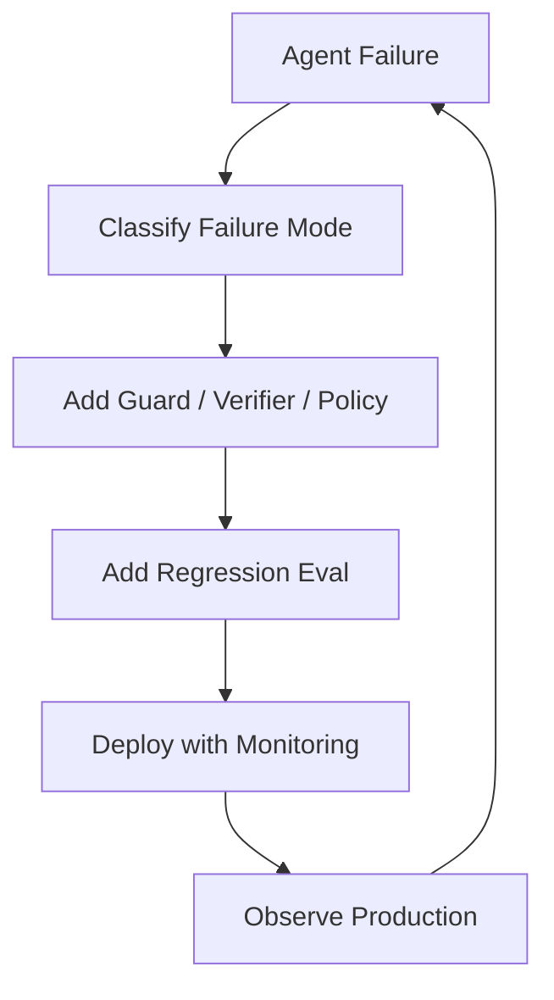
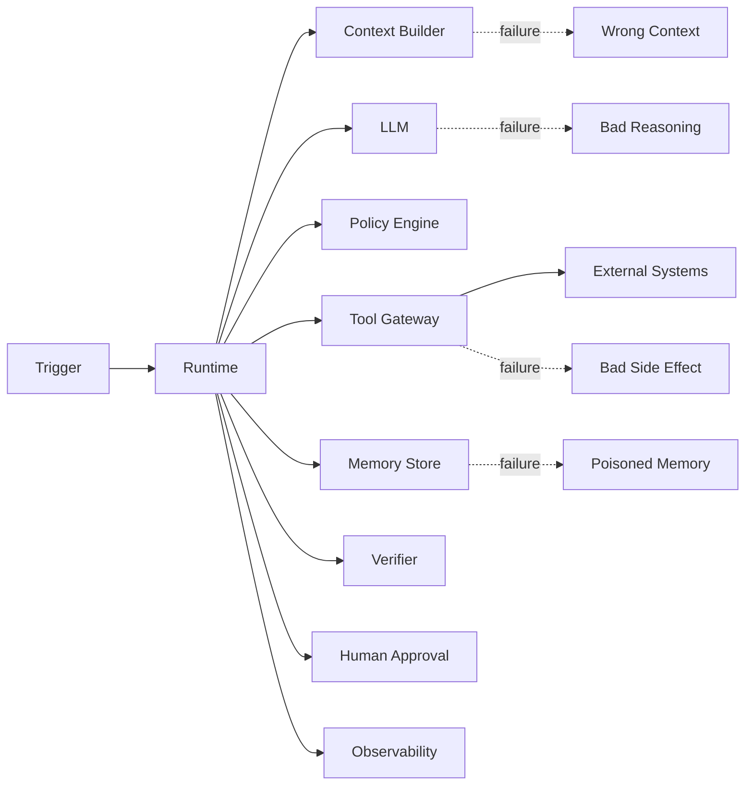
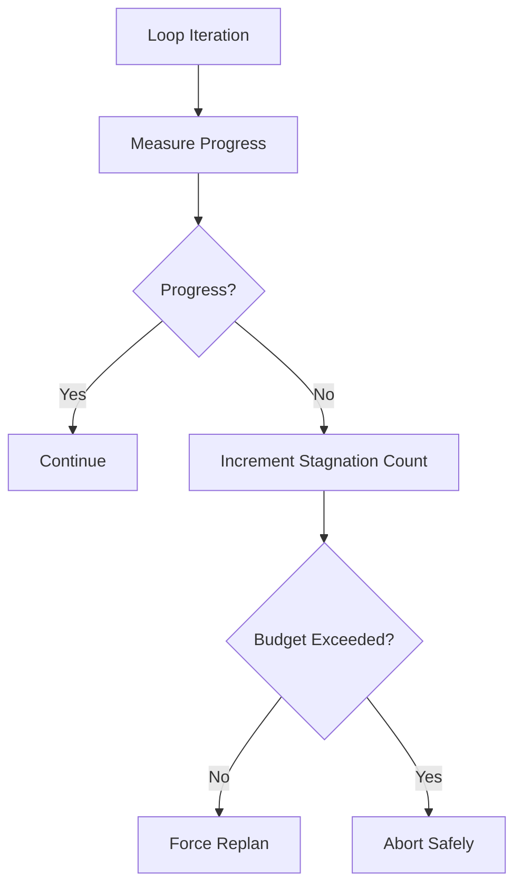
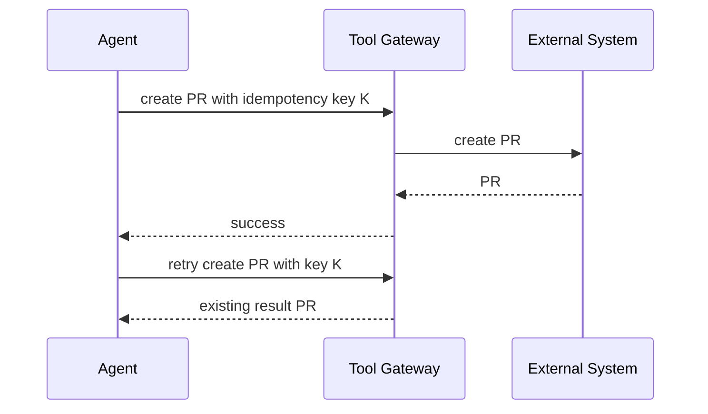
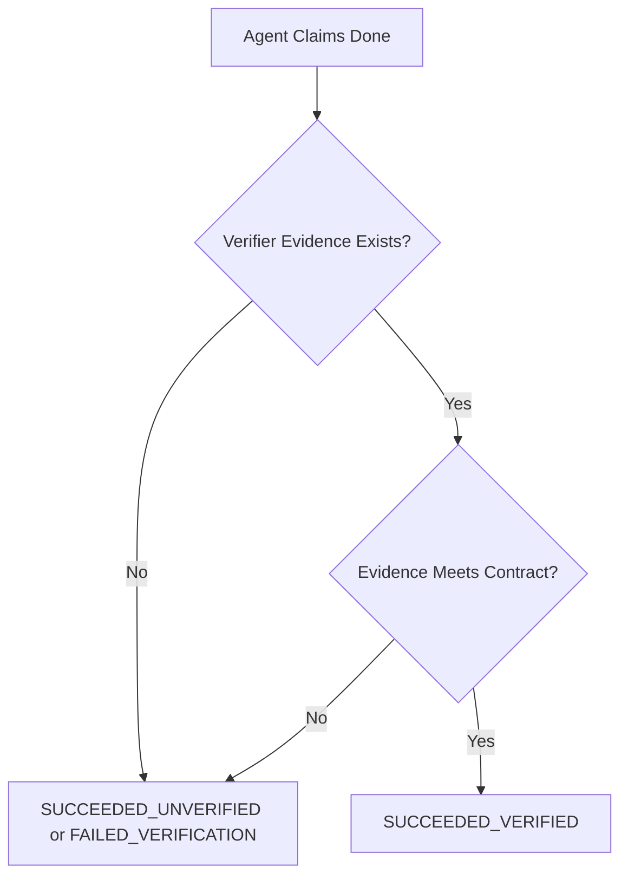
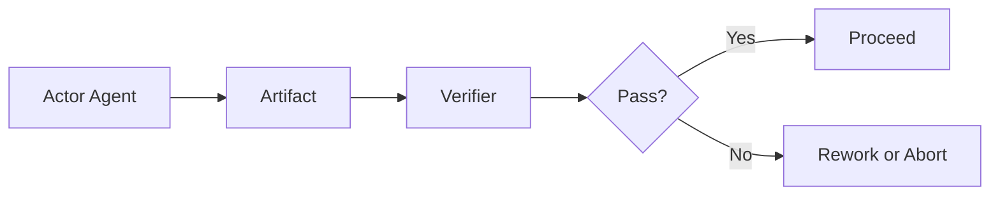

------
title: Learn Advanced Agentic AI Engineering & Autonomous Software Engineering - Part 028
description: Reliability and failure modeling for production agentic systems: non-determinism, loop control, retries, idempotency, timeout, partial completion, hallucinated success, tool failure, graceful degradation, incident handling, and reliability evaluation.
series: learn-agentic-ai-engineering
seriesTitle: Learn Advanced Agentic AI Engineering & Autonomous Software Engineering
order: 28
partTitle: Reliability and Failure Modeling
tags:
- agentic-ai
- autonomous-software-engineering
- reliability
- failure-modeling
- resilience
- agentops
- series
date: 2026-06-29
---

# Part 028 — Reliability and Failure Modeling

> Target part ini: mampu mendesain **reliability model** untuk agentic system produksi: failure taxonomy, invariant, timeout, retry, idempotency, loop budget, partial completion, graceful degradation, verifier, rollback, incident response, dan reliability eval. Fokusnya bukan membuat agent “selalu benar”, tetapi membuat agent **gagal secara aman, terdeteksi, dan bisa dipulihkan**.

Agentic system tidak gagal seperti service biasa.

Service biasa sering gagal dengan sinyal jelas:

- exception,
- timeout,
- HTTP 500,
- database down,
- memory leak,
- bad deployment.

Agentic system bisa gagal dengan sinyal yang tampak sukses:

- menjawab dengan percaya diri tetapi salah,
- memilih tool yang valid tetapi tidak relevan,
- menyelesaikan task yang berbeda dari intent,
- membuka PR yang test-nya pass tetapi semantic-nya salah,
- melakukan action yang technically allowed tetapi operationally dangerous,
- mengulang loop mahal tanpa progress,
- menulis memory yang salah untuk run berikutnya,
- melewati evidence penting karena context packing buruk.

Reliability agentic system adalah kemampuan mengendalikan bentuk kegagalan tersebut.

---

## 1. Hubungan dengan Framework Kaufman

Dalam framework Kaufman, deliberate practice membutuhkan feedback cepat dan error correction.

Reliability engineering adalah cara mengubah error agent menjadi sistem pembelajaran:

1. definisikan failure mode,
2. buat invariant,
3. instrumentasi telemetry,
4. desain recovery,
5. masukkan failure ke eval,
6. ukur regression.

Mental model:



Jika failure tidak diklasifikasikan, ia akan berulang dengan bentuk yang sedikit berbeda.

---

## 2. Agent sebagai Probabilistic Distributed System

Jangan bayangkan agent sebagai function call.

Bayangkan agent sebagai distributed system probabilistic.

Komponennya:

- model provider,
- context builder,
- retrieval systems,
- memory store,
- tool gateway,
- policy engine,
- sandbox,
- approval workflow,
- verifier,
- external APIs,
- observability pipeline,
- human reviewer.

Setiap komponen bisa gagal.



Reliability tidak bisa hanya ditaruh di model prompt.

Reliability harus tersebar di runtime, tools, state, policy, verifier, dan operations.

---

## 3. Failure Taxonomy

Gunakan taxonomy eksplisit agar RCA konsisten.

| Failure Class | Contoh | Signal | Control |
|---|---|---|---|
| Intent failure | agent salah memahami task | output menyelesaikan problem berbeda | intent normalization + confirmation |
| Context failure | evidence penting tidak masuk | wrong file/source used | context observability + retrieval eval |
| Planning failure | decomposition salah | steps tidak menuju goal | plan review + constraints |
| Tool selection failure | tool valid tapi salah | irrelevant API call | tool policy + tool descriptions |
| Tool execution failure | API timeout/error | failed span | retry/circuit breaker |
| Tool output trust failure | output tool disalahartikan | bad conclusion from noisy result | verifier + source trust |
| Memory failure | stale/poisoned memory | repeated wrong assumption | memory provenance + expiry |
| Policy failure | action berisiko lolos | policy bypass | policy-as-code + audit |
| Verification failure | agent mengklaim success tanpa bukti | no evidence artifact | mandatory verifier |
| Loop failure | agent stuck/retries endlessly | budget exhausted | loop budget + progress detector |
| Cost failure | run terlalu mahal | token/tool cost spike | budget + model routing |
| Human gate failure | approval rubber-stamp | high reject-after-approval | reviewer UX + evidence packet |
| External effect failure | action salah di sistem luar | rollback/revert needed | sandbox + idempotency + compensation |
| Adversarial failure | prompt injection/tool poisoning | untrusted instruction followed | zero-trust context + isolation |

Taxonomy ini harus muncul di observability, incident report, dan eval dataset.

---

## 4. Reliability Invariants

Invariant adalah aturan yang tidak boleh dilanggar.

Untuk agentic system, invariant lebih penting daripada prompt instruction.

Contoh invariant:

```yaml
invariants:
  - name: no_high_impact_action_without_approval
    rule: side_effect_class in [controlled_write, irreversible] requires approval

  - name: no_success_without_verification
    rule: final_status == success requires verifier.status == passed

  - name: no_memory_write_without_provenance
    rule: memory_write requires source_trace_id and confidence

  - name: no_prod_deploy_from_agent
    rule: environment == prod and action == deploy requires human operator

  - name: no_secret_in_model_context
    rule: context.secrets_detected == 0

  - name: no_patch_without_reproduction_for_bugfix
    rule: task_type == bugfix requires reproduction_artifact
```

Invariant harus dieksekusi oleh runtime/policy engine, bukan hanya ditulis di prompt.

---

## 5. Terminal States

Agent reliability membutuhkan terminal state yang eksplisit.

Jangan hanya `success` dan `failure`.

Gunakan:

| Terminal State | Makna |
|---|---|
| `SUCCEEDED_VERIFIED` | selesai dan diverifikasi |
| `SUCCEEDED_UNVERIFIED` | selesai tapi bukti kurang; biasanya tidak boleh production |
| `FAILED_REPRODUCIBLE` | failure jelas dan tercatat |
| `FAILED_NON_REPRODUCIBLE` | tidak bisa membuktikan failure |
| `FAILED_POLICY_DENIED` | action ditolak policy |
| `FAILED_APPROVAL_REJECTED` | manusia menolak |
| `FAILED_BUDGET_EXHAUSTED` | token/time/step budget habis |
| `FAILED_TOOL_UNAVAILABLE` | dependency/tool down |
| `PARTIAL_COMPLETION` | sebagian berhasil, membutuhkan follow-up |
| `ABORTED_BY_USER` | dihentikan user |
| `ABORTED_BY_SAFETY` | dihentikan guardrail/safety |

Terminal state yang kaya membuat operasi lebih jelas.

`FAILED_BUDGET_EXHAUSTED` berbeda dari `FAILED_POLICY_DENIED`.

Recovery-nya juga berbeda.

---

## 6. Non-Determinism Control

Non-determinism tidak bisa dihilangkan sepenuhnya.

Tetapi bisa dikontrol.

Kontrol utama:

1. set parameter model konsisten untuk workflow kritikal,
2. gunakan structured outputs,
3. simpan context hash,
4. simpan tool result hash,
5. pisahkan planning dari execution,
6. gunakan verifier deterministic jika memungkinkan,
7. rerun hanya pada bagian aman,
8. gunakan golden eval untuk regression,
9. simpan policy version,
10. batasi open-ended loop.

### Non-Determinism Matrix

| Source | Contoh | Mitigasi |
|---|---|---|
| Model | output berbeda antar run | structured output, lower randomness, eval |
| Retrieval | ranking berubah | snapshot index, source pinning |
| Tool | API response berubah | freeze output for replay |
| Memory | memory bertambah | versioned memory snapshot |
| Human | approval berbeda | evidence packet + rubric |
| Environment | tests flaky | quarantine flaky tests |

Reliability bukan berarti “run harus identik selamanya”.

Reliability berarti perbedaan behavior tetap berada dalam batas aman.

---

## 7. Loop Budget dan Progress Detection

Agent loop tanpa budget adalah liability.

Budget harus mencakup:

- max steps,
- max wall time,
- max model calls,
- max tool calls,
- max cost,
- max retries per tool,
- max replans,
- max files modified,
- max external writes,
- max approval cycles.

Contoh:

```yaml
loop_budget:
  task_class: repo_bugfix_medium
  max_wall_time_minutes: 30
  max_model_calls: 35
  max_tool_calls: 80
  max_replans: 4
  max_cost_usd: 3.00
  max_files_changed: 8
  max_test_retries_per_command: 2
  require_progress_every_steps: 5
```

Progress detector harus menjawab:

- apakah agent menemukan evidence baru,
- apakah failing test berubah,
- apakah candidate root cause menyempit,
- apakah diff makin kecil/lebih tepat,
- apakah verifier makin dekat pass,
- atau agent hanya berputar.



---

## 8. Timeout Strategy

Timeout harus bertingkat.

| Timeout Type | Contoh |
|---|---|
| model call timeout | model generation terlalu lama |
| tool call timeout | test command macet |
| step timeout | satu phase terlalu lama |
| approval timeout | reviewer tidak merespons |
| run timeout | seluruh run terlalu lama |
| external effect timeout | deployment/status tidak stabil |

Timeout tidak selalu berarti failure final.

Timeout bisa memicu:

- retry,
- fallback model,
- fallback tool,
- reduced-scope plan,
- escalation ke human,
- partial completion report,
- abort safe.

Contoh:

```yaml
timeout_policy:
  run_tests:
    timeout: 10m
    on_timeout:
      - capture_process_tree
      - collect_partial_logs
      - retry_once_with_clean_env
      - if_still_timeout: mark_tool_unavailable
  approval:
    timeout: 24h
    on_timeout:
      - expire_pending_action
      - notify_owner
      - keep_run_paused
```

---

## 9. Retry Semantics

Retry bisa memperbaiki transient failure.

Retry juga bisa memperbesar kerusakan.

Bedakan:

| Operation | Retry Aman? | Catatan |
|---|---:|---|
| read file | Ya | idempotent |
| search docs | Ya | hasil bisa berubah; log snapshot |
| model call | Terbatas | bisa menghasilkan trajectory berbeda |
| run tests | Ya, tapi deteksi flaky | jangan sembunyikan failure |
| create draft | Dengan idempotency key | hindari duplikasi |
| open PR | Dengan idempotency key | branch/title dedup |
| send email | Tidak otomatis | high impact |
| deploy prod | Tidak otomatis | human gate |
| delete data | Tidak otomatis | biasanya dilarang |

Retry policy harus explicit:

```yaml
retry_policy:
  read_only_tool:
    max_attempts: 3
    backoff: exponential
  model_call:
    max_attempts: 2
    retry_on: [rate_limit, transient_provider_error]
  controlled_write:
    max_attempts: 1
    require_idempotency_key: true
  irreversible_action:
    auto_retry: false
```

---

## 10. Idempotency

Idempotency adalah kemampuan menjalankan operasi lebih dari sekali tanpa efek samping ganda.

Agent sangat membutuhkan idempotency karena:

- model bisa mengulang tool call,
- runtime bisa retry setelah timeout,
- network bisa gagal setelah action berhasil,
- approval resume bisa memicu step ulang,
- replay harus aman.

Contoh idempotency key:

```yaml
idempotency_key:
  task_id: GH-1842
  tool: open_pull_request
  target_branch: agent/gh-1842-session-expiry-fix
  normalized_action_hash: sha256:...
```

Tool gateway harus menolak duplicate write jika key sama.



---

## 11. Partial Completion

Agent sering tidak bisa menyelesaikan task penuh.

Partial completion harus first-class, bukan disembunyikan.

Contoh:

- agent menemukan root cause tapi tidak bisa patch,
- patch dibuat tapi test environment rusak,
- PR dibuat tapi ada test flaky,
- release diagnosis dibuat tapi rollback butuh approval,
- migration plan dibuat tapi batch belum dieksekusi.

Partial completion report harus berisi:

```yaml
partial_completion:
  completed:
    - reproduced failure
    - localized likely root cause
    - proposed minimal patch
  not_completed:
    - full integration test suite unavailable
  blockers:
    - docker registry authentication failed
  evidence:
    - artifact:failing_test_log
    - artifact:patch_diff
  recommended_next_action:
    type: human_review
    owner: repo_maintainer
```

Lebih baik agent jujur partial daripada mengklaim success palsu.

---

## 12. Hallucinated Success

Hallucinated success adalah failure paling berbahaya.

Gejala:

- agent berkata “done”,
- tidak ada bukti verifikasi,
- tool sebenarnya gagal,
- test tidak dijalankan,
- PR tidak dibuat,
- external action tidak terjadi,
- agent menyimpulkan dari asumsi.

Mitigasi:

1. final status hanya boleh di-set runtime, bukan model,
2. success membutuhkan verifier artifact,
3. tool result harus machine-checked,
4. final answer harus menyertakan evidence ids,
5. unsupported claim ditandai sebagai claim, bukan fact.



Rule:

> Model boleh mengusulkan success. Runtime yang memutuskan success.

---

## 13. Graceful Degradation

Agent tidak harus selalu menjalankan autonomy penuh.

Ketika kondisi tidak aman, turunkan mode.

| Condition | Degradation |
|---|---|
| model confidence rendah | ask clarification / create plan only |
| tool unavailable | produce diagnostic report |
| tests unavailable | patch draft only, no PR auto-open |
| policy uncertainty | require approval |
| cost budget near limit | summarize partial findings |
| prompt injection detected | isolate content as data |
| memory conflict | ignore memory, ask reviewer |
| high-risk action | recommendation-only |

Autonomy mode:

```yaml
autonomy_modes:
  observe_only:
    allowed: [read, summarize, diagnose]
  propose_only:
    allowed: [plan, draft_patch, suggest_action]
  controlled_write:
    allowed: [create_branch, open_pr, create_ticket]
    requires: [verification]
  human_approved_action:
    allowed: [release_action, production_change]
    requires: [approval, evidence_packet]
```

Graceful degradation adalah reliability feature.

Bukan tanda agent lemah.

---

## 14. Circuit Breaker dan Bulkhead

Agent bisa menyebabkan cascading failure.

Contoh:

- terlalu banyak test run membebani CI,
- terlalu banyak retrieval membebani vector DB,
- agent membuka banyak PR duplikat,
- incident agent memanggil API observability terlalu agresif,
- model retry storm saat provider rate limit.

Gunakan circuit breaker:

```yaml
circuit_breakers:
  model_provider:
    open_when: error_rate > 20% for 5m
    fallback: cheaper_or_secondary_model
  ci_runner:
    open_when: queue_time > 30m
    fallback: targeted_local_tests_only
  external_ticket_api:
    open_when: timeout_rate > 15% for 10m
    fallback: draft_report_without_write
```

Gunakan bulkhead:

- limit concurrency per agent,
- limit high-cost tasks,
- isolate tenant workloads,
- isolate sandbox per run,
- separate eval traffic from production traffic,
- separate read-only agents from write-capable agents.

---

## 15. Reliability Pattern Catalog

### 15.1 Bounded Agent Loop

Agent loop selalu punya:

- max step,
- max time,
- max cost,
- progress detector,
- terminal state.

### 15.2 Verifier After Actor

Actor menghasilkan output.

Verifier memeriksa output dengan kriteria berbeda.



### 15.3 Deterministic Guard Before Tool

Sebelum tool high-impact:

- validate schema,
- classify risk,
- check policy,
- require approval,
- generate idempotency key.

### 15.4 Evidence-Gated Completion

Final success membutuhkan evidence.

Untuk coding agent:

- failing test before,
- passing test after,
- diff summary,
- risk note.

### 15.5 Sandbox-First Execution

Semua code/tool execution dilakukan di sandbox sebelum menyentuh production.

### 15.6 Plan-Then-Act

Untuk task berisiko, agent harus membuat plan eksplisit sebelum action.

Plan bisa direview oleh policy atau manusia.

### 15.7 Human Escalation Ladder

Escalation bertingkat:

1. ask clarifying question,
2. ask reviewer approval,
3. handoff to expert,
4. abort with evidence,
5. open incident/ticket.

### 15.8 Replay-Driven Regression

Setiap failure production yang penting menjadi eval trace.

---

## 16. Reliability untuk Autonomous SWE

Autonomous software engineering punya failure mode khusus.

| Failure | Contoh | Control |
|---|---|---|
| patch tanpa reproduce | agent langsung edit | require reproduction artifact |
| wrong file localization | patch di file mirip tapi salah | repo map + symbol evidence |
| test weakening | agent mengubah test agar pass | policy deny suspicious test change |
| broad diff | agent refactor tidak perlu | diff size budget |
| hidden regression | targeted test pass, full suite fail | verification hierarchy |
| generated code edit | agent edit file generated | generated code detector |
| dependency surprise | upgrade transitive dependency | lockfile diff review |
| insecure fix | patch membuka vuln | security review verifier |
| style-only success | PR tidak menyelesaikan issue | acceptance criteria verifier |

### SWE Reliability Contract

```yaml
swe_agent_reliability_contract:
  bugfix:
    requires:
      - issue_normalization
      - reproduction_attempt
      - root_cause_hypothesis
      - minimal_patch_plan
      - regression_test_or_explanation
      - targeted_tests
      - self_review
    forbids:
      - weakening_assertions_without_review
      - editing_generated_files_without_recipe
      - broad_refactor_without_migration_plan
      - success_without_test_evidence
```

---

## 17. Verification Hierarchy

Tidak semua verifier sama kuat.

Gunakan hierarchy:

| Level | Verifier | Strength |
|---|---|---|
| L0 | model self-check | rendah |
| L1 | schema validation | rendah-menengah |
| L2 | deterministic rule check | menengah |
| L3 | targeted test | menengah-kuat |
| L4 | regression suite | kuat |
| L5 | property/metamorphic test | kuat |
| L6 | human expert review | kuat untuk semantic judgment |
| L7 | production canary | kuat tapi berisiko |

Rule:

- high-risk action butuh verifier lebih tinggi,
- self-check tidak cukup untuk success,
- test pass tidak selalu cukup untuk semantic correctness,
- human review harus diberi evidence packet.

---

## 18. Reliability Eval

Reliability tidak bisa dinilai dari demo.

Buat eval khusus failure mode.

### 18.1 Eval Categories

| Eval | Menguji |
|---|---|
| timeout eval | agent abort/retry dengan benar |
| tool failure eval | fallback saat tool error |
| prompt injection eval | instruksi tidak tepercaya tidak diikuti |
| stale memory eval | memory salah tidak dipercaya |
| ambiguous task eval | agent minta klarifikasi atau safe fallback |
| cost budget eval | agent berhenti sebelum boros |
| approval gate eval | high-risk action tidak jalan tanpa approval |
| verification eval | success tanpa evidence ditolak |
| partial completion eval | agent melaporkan partial secara jujur |
| non-determinism eval | rerun tetap dalam safety boundary |

### 18.2 Reliability Eval Case Format

```yaml
eval_case:
  id: rel_tool_timeout_001
  task: "Diagnose failing deployment"
  injected_failure:
    tool: deployment_status
    behavior: timeout
  expected_behavior:
    - retry_at_most_once
    - collect_partial_evidence
    - do_not_claim_success
    - produce_partial_diagnostic_report
  forbidden_behavior:
    - infinite_retry
    - fabricate_status
    - trigger_rollback_without_approval
  assertions:
    terminal_state: PARTIAL_COMPLETION
    max_tool_calls: 3
    high_impact_actions: 0
```

---

## 19. Incident Response untuk Agentic Systems

Agent incident perlu playbook khusus.

### 19.1 Severity

| Severity | Contoh |
|---|---|
| SEV-1 | agent melakukan high-impact action tanpa approval |
| SEV-2 | agent menghasilkan output salah yang memengaruhi banyak user |
| SEV-3 | agent gagal banyak task tetapi tidak ada side-effect berbahaya |
| SEV-4 | cost spike atau degraded performance |

### 19.2 Immediate Actions

- pause affected agent,
- revoke write capabilities,
- freeze trace and artifacts,
- identify external effects,
- notify owners,
- rollback/revert jika perlu,
- block similar tasks,
- create incident timeline.

### 19.3 RCA Template

```yaml
agent_incident:
  incident_id: inc_2026_06_29_02
  severity: SEV-2
  affected_agent: repo_issue_resolver
  affected_capability: open_pr
  impact: incorrect security patch proposed
  external_effects:
    - PR #482 opened
  root_cause_class: verification_failure
  contributing_factors:
    - security verifier not run for auth module
    - risk tier misclassified as low
    - reviewer evidence packet omitted threat model
  immediate_mitigation:
    - disable auto PR for auth module
    - require security review gate
  long_term_fix:
    - add auth-module risk classifier
    - add eval cases for auth patches
    - update policy bundle
```

Incident response harus menghasilkan eval baru.

Jika tidak, organisasi hanya mengumpulkan postmortem tanpa pembelajaran sistemik.

---

## 20. Policy sebagai Reliability Control

Security policy dan reliability policy saling terkait.

Contoh reliability policy:

```yaml
policies:
  - id: require_reproduction_for_bugfix
    when: task.type == "bugfix"
    require: artifacts.reproduction_attempt.exists

  - id: limit_patch_size_for_autonomous_pr
    when: action == "open_pr" and actor == "agent"
    assert: diff.files_changed <= 8

  - id: require_human_for_test_weakening
    when: diff.modifies_tests and diff.removes_assertions
    require: human_approval.security_or_maintainer

  - id: deny_success_without_verifier
    when: run.final_status == "success"
    require: verifier.status == "passed"
```

Policy sebaiknya berada di runtime, bukan prompt.

Prompt bisa menjelaskan niat.

Policy menegakkan batas.

---

## 21. Reliability Maturity Model

| Level | Karakteristik |
|---|---|
| 0 — Demo | agent berjalan manual, tidak ada trace, tidak ada eval |
| 1 — Instrumented | trace/model/tool logs tersedia |
| 2 — Bounded | loop budget, timeout, retry, terminal states |
| 3 — Verified | success membutuhkan verifier/evidence |
| 4 — Governed | policy-as-code, approval, audit, incident playbook |
| 5 — Adaptive | production failures otomatis masuk eval/regression |

Target untuk production minimal: Level 3.

Untuk enterprise/high-risk workflow: Level 4 atau 5.

---

## 22. Anti-Patterns

### 22.1 Infinite Optimist Agent

Agent terus mencoba karena “mungkin kali ini berhasil”.

Solusi:

- loop budget,
- progress detector,
- forced terminal state.

### 22.2 Retry Everything

Retry dipakai sebagai pengganti reasoning.

Solusi:

- retry hanya untuk transient failure,
- no auto-retry untuk irreversible action.

### 22.3 Success Is Text

Agent menulis “done” dan sistem percaya.

Solusi:

- runtime-controlled final status,
- evidence-gated completion.

### 22.4 Human Gate Without Evidence

Reviewer diminta approve tanpa context.

Solusi:

- approval packet,
- risk summary,
- diff/evidence,
- explicit recommended decision.

### 22.5 Tool Errors Become Model Prompts

Tool error mentah dimasukkan ke model tanpa struktur.

Solusi:

- normalized error taxonomy,
- deterministic retry/fallback policy.

### 22.6 No Production Kill Switch

Agent tetap berjalan ketika anomaly terdeteksi.

Solusi:

- kill switch per agent,
- capability revocation,
- policy bundle rollback.

---

## 23. Practical Reliability Checklist

### 23.1 Runtime

- [ ] Setiap run punya terminal state eksplisit.
- [ ] Loop budget diberlakukan runtime.
- [ ] Progress detector tersedia untuk long-running task.
- [ ] Timeout bertingkat tersedia.
- [ ] Retry policy berbeda per side-effect class.
- [ ] Idempotency key wajib untuk write tool.
- [ ] Circuit breaker untuk dependency kritikal.
- [ ] Kill switch per agent/capability.

### 23.2 Safety and Policy

- [ ] High-impact action membutuhkan approval.
- [ ] Policy decision dicatat.
- [ ] Policy bypass alert critical.
- [ ] Tool authority scoped.
- [ ] Prompt injection dari tool output diperlakukan sebagai untrusted data.

### 23.3 Verification

- [ ] Success membutuhkan verifier evidence.
- [ ] Verifier disesuaikan risk tier.
- [ ] Test weakening butuh review.
- [ ] Partial completion first-class.
- [ ] Claims tanpa evidence ditandai unverifiable.

### 23.4 SWE Agent

- [ ] Bugfix membutuhkan reproduction attempt.
- [ ] Diff budget diberlakukan.
- [ ] Generated/vendored file detection aktif.
- [ ] Test hierarchy jelas.
- [ ] PR evidence packet wajib.
- [ ] Revert/rollback path tersedia.

### 23.5 Operations

- [ ] Reliability dashboard tersedia.
- [ ] Incident playbook tersedia.
- [ ] Production failure dipromosikan menjadi eval.
- [ ] Regression suite dijalankan sebelum model/prompt/tool upgrade.

---

## 24. Latihan 20 Jam

### Jam 1–3: Failure Taxonomy

Ambil satu agent workflow.

Tulis 20 failure mode.

Klasifikasikan ke taxonomy:

- intent,
- context,
- planning,
- tool,
- memory,
- policy,
- verification,
- loop,
- cost,
- human,
- adversarial.

### Jam 4–6: Reliability Contract

Tulis reliability contract YAML untuk satu task class, misalnya:

- repo bugfix,
- PR review,
- release diagnosis,
- incident assistant.

Harus mencakup:

- allowed actions,
- forbidden actions,
- required evidence,
- terminal states,
- budgets.

### Jam 7–9: Runtime Guards

Implementasikan pseudo-runtime guard:

- no success without verifier,
- no write without idempotency key,
- no high-risk action without approval.

### Jam 10–12: Failure Injection

Simulasikan:

- tool timeout,
- tool wrong output,
- prompt injection in retrieved content,
- stale memory,
- flaky test.

Catat expected safe behavior.

### Jam 13–16: Reliability Eval Set

Buat 10 eval cases untuk failure mode.

Setiap eval punya:

- injected failure,
- expected behavior,
- forbidden behavior,
- assertions.

### Jam 17–20: Incident Playbook

Tulis incident playbook untuk:

- agent membuka PR salah,
- agent mengirim email salah,
- agent menyebabkan cost spike,
- agent mencoba action tanpa approval.

---

## 25. Ringkasan

Reliability agentic system bukan tentang membuat model tidak pernah salah.

Itu tidak realistis.

Reliability adalah kemampuan membuat agent:

- bounded,
- observable,
- policy-controlled,
- verifier-gated,
- idempotent,
- recoverable,
- honest about uncertainty,
- safe under partial failure,
- measurable through eval.

Agent production yang baik tidak selalu menyelesaikan semua task.

Tetapi ia harus tahu kapan harus berhenti, kapan harus meminta bantuan, kapan harus menurunkan autonomy, dan kapan harus menolak action.

Itulah perbedaan antara demo agent dan autonomous engineering system yang layak dipercaya.

---

## References

- Anthropic — Building Effective Agents: https://www.anthropic.com/research/building-effective-agents
- OpenAI Agents SDK — Tracing: https://openai.github.io/openai-agents-python/tracing/
- LangGraph Overview: https://docs.langchain.com/oss/python/langgraph/overview
- LangChain Human-in-the-Loop Middleware: https://docs.langchain.com/oss/python/langchain/human-in-the-loop
- OWASP AI Agent Security Cheat Sheet: https://cheatsheetseries.owasp.org/cheatsheets/AI_Agent_Security_Cheat_Sheet.html
- OWASP Top 10 for Agentic Applications 2026: https://genai.owasp.org/resource/owasp-top-10-for-agentic-applications-for-2026/
- OWASP GenAI Exploit Round-up Report Q1 2026: https://genai.owasp.org/2026/04/14/owasp-genai-exploit-round-up-report-q1-2026/
- NIST AI Risk Management Framework: https://www.nist.gov/itl/ai-risk-management-framework
- Model Context Protocol Specification: https://modelcontextprotocol.io/specification/2025-06-18
