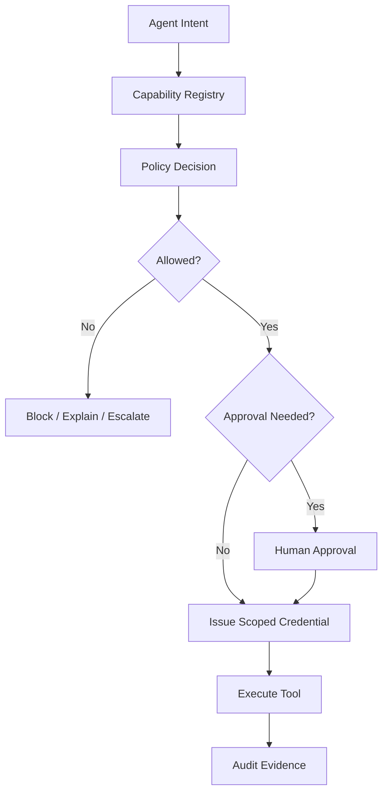
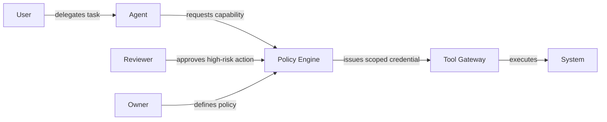
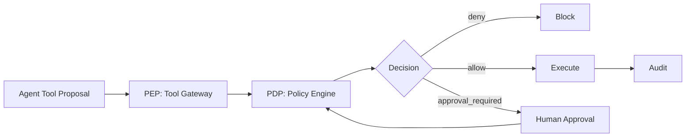
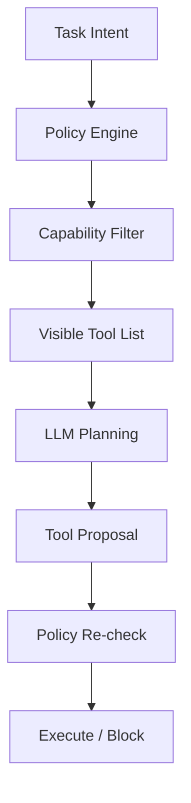
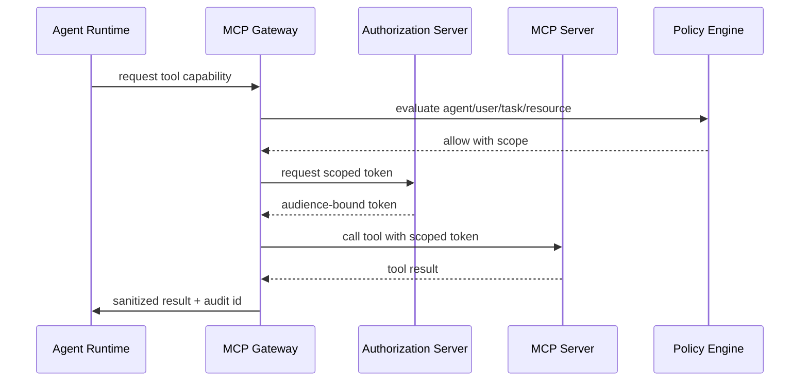
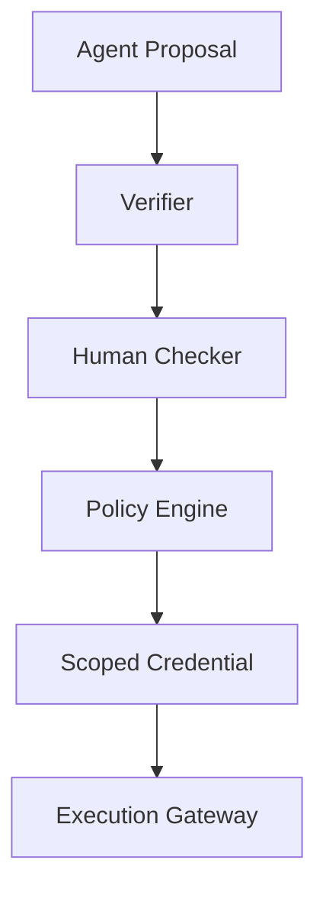
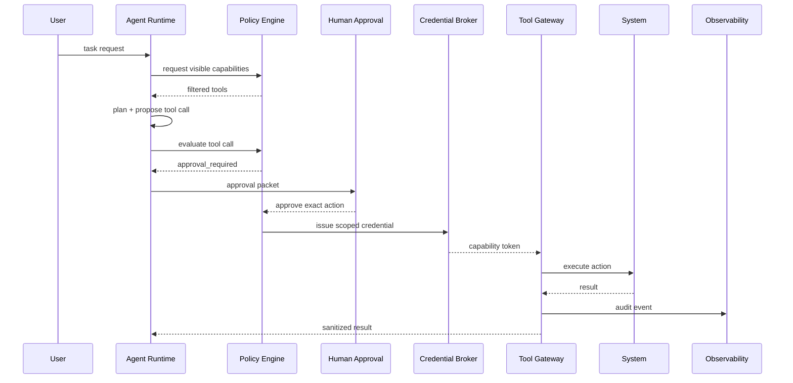
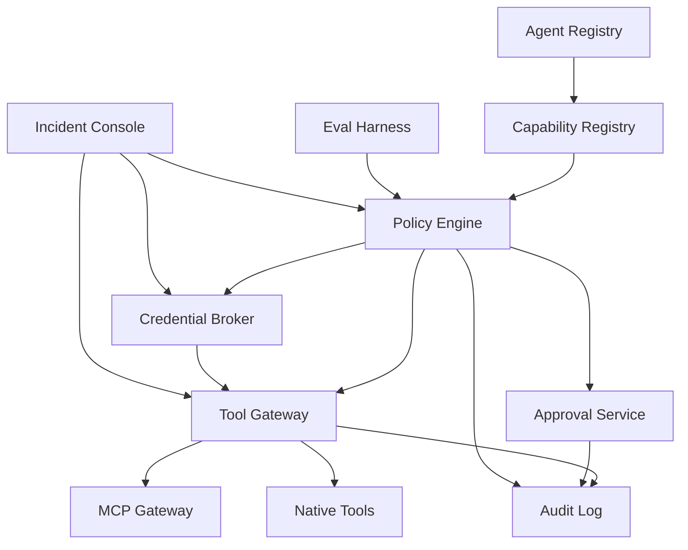

------
title: Learn Advanced Agentic AI Engineering & Autonomous Software Engineering - Part 030
description: Policy, permission, and identity architecture for production agents: agent identity, least privilege, scoped credentials, capability registry, policy-as-code, MCP authorization, approval gates, audit, kill switch, and enterprise control plane.
series: learn-agentic-ai-engineering
seriesTitle: Learn Advanced Agentic AI Engineering & Autonomous Software Engineering
order: 30
partTitle: Policy, Permission, and Identity
tags:
- agentic-ai
- autonomous-software-engineering
- identity
- authorization
- policy-as-code
- mcp
- security
- governance
- series
date: 2026-06-29
---

# Part 030 — Policy, Permission, and Identity

> Target part ini: mampu mendesain **control plane** untuk agentic system: agent identity, user delegation, permission scope, capability registry, policy-as-code, scoped credentials, approval gates, audit trail, MCP authorization, kill switch, dan break-glass. Fokusnya adalah membatasi apa yang agent **boleh lakukan**, bukan hanya mengatur apa yang agent **boleh katakan**.

Security threat modeling di Part 029 memberi kita daftar risiko.

Part ini menjawab pertanyaan berikutnya:

> Bagaimana membuat risiko itu tidak bergantung pada niat baik model?

Jawabannya: policy, permission, and identity.

Agentic system yang matang tidak menaruh semua aturan di prompt.

Ia punya control plane.

Control plane menentukan:

- siapa agent itu,
- atas nama siapa ia bertindak,
- tool apa yang boleh terlihat,
- action apa yang boleh dieksekusi,
- data apa yang boleh dibaca,
- kondisi apa yang membutuhkan approval,
- token apa yang diberikan,
- berapa lama authority berlaku,
- bagaimana action diaudit,
- bagaimana authority dicabut.

Tanpa control plane, agent hanyalah LLM dengan akses terlalu luas.

---

## 1. Hubungan dengan Framework Kaufman

Dalam kerangka Kaufman, kita ingin skill yang bisa dipraktikkan cepat dengan feedback jelas.

Policy/permission/identity bisa dipecah menjadi subskill:

1. mendefinisikan actor dan principal,
2. memetakan authority,
3. mendesain capability registry,
4. menulis policy decision model,
5. menghubungkan policy ke tool gateway,
6. membuat approval matrix,
7. mendesain scoped credentials,
8. membuat audit dan revocation path,
9. menguji policy dengan abuse cases.

Mental model:



Latihan utamanya bukan membuat agent lebih pintar.

Latihan utamanya adalah membuat agent lebih terkendali.

---

## 2. Core Principle: Prompt Is Not Permission

Prompt boleh memberi instruksi.

Prompt tidak boleh memberi authority.

Contoh prompt:

```text
You are a helpful deployment assistant. You may rollback a service if production error rate is high.
```

Kalimat ini tidak boleh cukup untuk memberi permission rollback.

Rollback harus diputuskan oleh policy engine berdasarkan:

- agent identity,
- user identity,
- environment,
- service ownership,
- incident severity,
- approval status,
- change freeze,
- risk tier,
- rollback safety,
- time window,
- audit completeness.

Invariant:

> The model can request authority; the platform grants authority.

Aturan ini mencegah prompt injection menjadi privilege escalation.

---

## 3. Identity Model

Agentic system punya beberapa identity sekaligus.

| Identity | Meaning |
|---|---|
| Human user | orang yang memicu atau menerima hasil agent |
| Agent identity | workload identity dari agent runtime |
| Tool identity | identity tool/server yang dipanggil |
| Session identity | run-specific identity untuk satu execution |
| Delegated identity | authority user yang didelegasikan ke agent |
| Approval identity | reviewer yang menyetujui action |
| Service identity | backend service account untuk platform |
| Tenant identity | organisasi/team/project boundary |

Kesalahan umum adalah mencampur semuanya.

Contoh buruk:

```text
Agent uses one service account for every user and every action.
```

Dampak:

- audit tidak tahu action atas nama siapa,
- permission terlalu luas,
- revocation sulit,
- cross-tenant risk meningkat,
- approval tidak terikat ke action.

Better:

```text
User U requests task T.
Agent A creates run R.
Policy P evaluates requested capability C.
If allowed, platform issues short-lived token S scoped to C, R, U, tenant, and expiry.
Tool call includes run_id, actor, delegation context, and policy_decision_id.
```

---

## 4. Actor, Principal, and Subject

Gunakan istilah secara konsisten.

- **Actor**: entitas yang melakukan tindakan secara operational.
- **Principal**: entitas yang dikenali sistem identity.
- **Subject**: entitas yang menjadi target evaluasi policy.

Dalam agent run:

```yaml
actor:
  type: agent
  id: coding_agent_v3
principal:
  type: workload_identity
  id: agent-runtime-prod
on_behalf_of:
  type: user
  id: engineer_123
subject:
  repository: payments-service
  branch: agent/fix-issue-42
action:
  name: github.pull_request.create
```

Policy harus bisa membedakan:

- agent bertindak sebagai dirinya sendiri,
- agent bertindak atas nama user,
- agent bertindak dengan approval reviewer,
- agent bertindak sebagai service automation.

Jika tidak dibedakan, accountability rusak.

---

## 5. Authority Graph

Authority graph menunjukkan siapa bisa melakukan apa lewat jalur mana.



Untuk setiap edge, tanyakan:

- apa authority yang berpindah?
- apakah authority itu eksplisit?
- apakah bisa dibatasi?
- apakah bisa dicabut?
- apakah ada expiry?
- apakah ada audit?
- apakah ada approval?
- apakah ada risiko delegation laundering?

Agentic security sering gagal bukan karena tidak ada auth.

Ia gagal karena authority graph tidak pernah digambar.

---

## 6. Capability-Based Design

Jangan mulai dari “role”.

Mulai dari capability.

Capability adalah action spesifik yang bisa dikontrol.

Contoh capability:

- `github.issue.read`,
- `github.branch.create`,
- `github.file.modify`,
- `github.pull_request.create`,
- `github.pull_request.merge`,
- `ci.job.read`,
- `ci.job.rerun`,
- `prod.logs.read`,
- `k8s.deployment.restart`,
- `email.draft.create`,
- `email.send`,
- `case.status.propose`,
- `case.status.update`.

Capability harus punya metadata.

```yaml
capability: github.pull_request.create
risk_tier: medium
side_effect: repository_write
reversible: true
requires_user_delegation: true
requires_human_approval: false
allowed_agents:
  - coding_agent
  - migration_agent
required_context:
  - repository_id
  - branch_name
  - issue_id
forbidden_if:
  - branch_is_protected
  - repository_has_security_freeze
observability:
  required:
    - run_id
    - diff_hash
    - policy_decision_id
```

Benefit:

- tool visibility bisa difilter,
- policy bisa dievaluasi spesifik,
- audit lebih jelas,
- permission tidak over-broad,
- testing lebih mudah.

---

## 7. Capability Registry

Capability registry adalah katalog resmi apa yang agent bisa minta.

Ia bukan hanya dokumentasi.

Ia adalah source of truth untuk policy, tool gateway, approval, observability, dan eval.

Registry fields:

```yaml
id: string
name: string
description: string
action_type: read | propose | write | execute | approve | admin
risk_tier: low | medium | high | critical
side_effect: none | reversible | compensatable | irreversible
data_classification: public | internal | confidential | restricted
required_principal: user | agent | service | reviewer
required_scopes: list
approval_policy: string
allowed_environments: list
allowed_tools: list
required_evidence: list
rollback_strategy: string
audit_schema: string
owner: string
```

Registry harus versioned.

Jika capability berubah, agent eval harus dijalankan ulang.

Contoh:

```yaml
version: 12
changes:
  - capability github.workflow.modify moved from high to critical
  - requires security_owner approval
  - forbidden for autonomous agents
```

---

## 8. Permission Models

### 8.1 RBAC

Role-Based Access Control cocok untuk baseline.

Contoh:

- `read_only_agent`,
- `coding_agent`,
- `release_advisor_agent`,
- `incident_assist_agent`.

Problem: role sering terlalu kasar.

### 8.2 ABAC

Attribute-Based Access Control lebih cocok untuk agent.

Policy dapat memakai:

- user role,
- agent type,
- tenant,
- repository owner,
- environment,
- risk tier,
- data classification,
- time window,
- approval status,
- model confidence,
- eval result,
- run budget.

### 8.3 ReBAC

Relationship-Based Access Control berguna untuk ownership.

Contoh:

- user adalah maintainer repo,
- reviewer adalah code owner,
- team memiliki service,
- agent terdaftar untuk tenant tertentu.

### 8.4 Capability-Based Access

Capability-based access cocok untuk tool execution.

Agent menerima token kecil untuk satu capability dalam satu run.

Praktik terbaik sering menggabungkan semuanya:

```text
RBAC for baseline role.
ABAC for runtime conditions.
ReBAC for ownership.
Capability token for execution.
```

---

## 9. Policy Decision Point and Enforcement Point

Pisahkan dua komponen:

- **PDP — Policy Decision Point**: memutuskan allow/deny/approve/escalate.
- **PEP — Policy Enforcement Point**: menerapkan keputusan itu di runtime/tool gateway.



Jangan biarkan agent melewati PEP.

Tool harus hanya bisa dipanggil melalui gateway.

Jika agent punya direct credential ke external system, policy engine menjadi dekorasi saja.

---

## 10. Policy Decision Shape

Policy decision harus lebih kaya dari boolean.

```json
{
  "decision_id": "pd_9f2",
  "result": "approval_required",
  "risk_tier": "high",
  "reason_codes": [
    "production_environment",
    "irreversible_side_effect",
    "outside_business_hours"
  ],
  "required_approver_role": "service_owner",
  "allowed_after_approval": true,
  "credential_scope": {
    "capability": "deployment.rollback",
    "service": "payments-api",
    "environment": "prod",
    "expires_in_seconds": 600
  },
  "audit_requirements": [
    "incident_id",
    "rollback_plan",
    "pre_rollback_metrics",
    "approval_id"
  ]
}
```

Reason codes penting untuk:

- explainability,
- reviewer UX,
- audit,
- debugging,
- policy regression tests.

---

## 11. Policy-as-Code

Policy yang hanya tertulis di dokumen tidak cukup.

Policy harus executable.

Policy-as-code berarti aturan authority bisa:

- direview sebagai code,
- diuji otomatis,
- diberi versi,
- di-deploy dengan change control,
- diaudit,
- digunakan konsisten di runtime.

OPA/Rego-style pseudo-policy:

```rego
package agent.authz

default allow := false
default approval_required := false

allow if {
  input.agent.type == "coding_agent"
  input.action == "github.pull_request.create"
  input.repository.id == input.task.repository_id
  input.branch.protected == false
  input.diff.risk_tier != "critical"
}

approval_required if {
  input.action == "github.workflow.modify"
}

approval_required if {
  input.action == "deployment.rollback"
  input.environment == "prod"
}
```

Policy tests:

```yaml
- name: coding agent can create PR on non-protected branch
  input:
    agent.type: coding_agent
    action: github.pull_request.create
    branch.protected: false
    diff.risk_tier: medium
  expected:
    allow: true

- name: coding agent cannot modify CI workflow without approval
  input:
    agent.type: coding_agent
    action: github.workflow.modify
  expected:
    approval_required: true
```

Policy tanpa tests akan membusuk.

---

## 12. Tool Visibility Filtering

Agent tidak boleh melihat semua tool.

Tool yang terlihat akan memengaruhi planning.

Jika model melihat `delete_customer_account`, ia bisa mempertimbangkannya walaupun akhirnya diblokir.

Better:

- filter tool by task,
- filter tool by agent identity,
- filter tool by user permission,
- filter tool by environment,
- filter tool by risk tier,
- filter tool by approval status,
- filter tool by data classification.

Runtime flow:



Tool visibility is a security control.

It is also a quality control because it reduces irrelevant choices.

---

## 13. Scoped Credentials

Never give long-lived broad credentials to agent runtime.

Use scoped credentials.

Credential should be bound to:

- run id,
- agent id,
- user/delegation context,
- capability,
- resource,
- environment,
- expiry,
- approval id,
- policy decision id,
- network boundary.

Example:

```json
{
  "token_type": "capability_token",
  "agent_id": "coding_agent_v3",
  "run_id": "run_123",
  "on_behalf_of": "user_456",
  "capability": "github.file.modify",
  "repository": "payments-service",
  "branch": "agent/fix-issue-42",
  "forbidden_paths": [".github/workflows/**", "secrets/**"],
  "expires_at": "2026-06-29T12:00:00Z",
  "policy_decision_id": "pd_9f2"
}
```

Credential should not be reusable outside its context.

If leaked, blast radius stays small.

---

## 14. On-Behalf-Of Delegation

Agent often acts on behalf of a user.

This must be explicit.

Bad audit:

```text
service-account-agent created refund
```

Good audit:

```text
refund_agent created refund proposal on behalf of alice@example.com, approved by bob@example.com, policy decision pd_123, case C-991.
```

Delegation rules:

- user must be authenticated,
- user must have permission to delegate,
- delegated scope must be narrower or equal to user authority,
- agent identity must be recorded,
- approval cannot be implied from user request for high-risk action,
- delegation expires,
- delegation can be revoked.

Delegation is not impersonation.

Agent should not become the user invisibly.

It should act with a traceable delegated authority.

---

## 15. MCP Authorization

MCP introduces a standardized way to connect AI applications with tools and data.

For remote MCP servers, authorization must be treated as a first-class system design topic.

Production guidance:

- use an authorization server,
- bind tokens to resource/server audience,
- avoid bearer tokens that work everywhere,
- use dynamic client registration only if governed,
- validate MCP server identity,
- restrict exposed tools/resources/prompts,
- log MCP server version and tool schema version,
- route through MCP gateway for enterprise policy,
- revoke server access independently.

MCP authorization architecture:



Agent should not hold arbitrary MCP credentials directly.

Gateway-mediated auth is easier to observe, revoke, and test.

---

## 16. Approval Policy

Approval should be policy-driven.

Not vibe-driven.

Approval matrix:

| Action | Risk | Approval |
|---|---:|---|
| read public docs | low | none |
| read internal docs | medium | user delegation |
| create draft PR | medium | none or owner review later |
| modify CI workflow | high | repo owner approval |
| access production logs | high | service owner or incident context |
| rollback production | critical | incident commander approval |
| send external email | medium/high | user approval |
| delete data | critical | forbidden or dual approval |

Approval should be tied to:

- exact tool call,
- exact parameters,
- policy decision,
- risk tier,
- expiry,
- reviewer role,
- evidence packet.

Approval should not be reusable for different action.

Bad:

```text
User approved "help with deployment".
```

Good:

```text
User approved rollback of payments-api from v42 to v41 in prod, valid for 10 minutes, after reviewing metric snapshot and rollback plan.
```

---

## 17. Maker-Checker for Agents

For high-risk domains, use maker-checker.

- Maker: agent proposes action.
- Checker: human or independent verifier approves.
- Executor: platform executes after policy validates approval.

Do not let the same agent propose, approve, and execute high-risk action.



For autonomous SWE:

- coding agent proposes patch,
- test/verifier agent evaluates,
- human reviewer approves merge,
- CI enforces checks,
- branch protection executes policy.

---

## 18. Policy for Memory

Memory needs authorization too.

Actions:

- read memory,
- write memory,
- update memory,
- delete memory,
- share memory across agent,
- use memory for task,
- promote memory from session to long-term.

Policy examples:

```yaml
memory_policy:
  write_procedural_memory:
    allowed_sources:
      - internal_policy_doc
      - approved_runbook
    requires_review: true
  write_user_preference:
    allowed_sources:
      - explicit_user_statement
    ttl_days: 365
  write_secret:
    allowed: false
  use_cross_tenant_memory:
    allowed: false
```

Memory access decision should consider:

- source trust,
- data classification,
- tenant,
- task relevance,
- TTL,
- user consent,
- review status,
- poisoning risk.

---

## 19. Policy for Context

Context is a permissioned resource.

Agent should not receive all available data.

Context policy decides:

- which sources can be retrieved,
- how many documents,
- which fields,
- whether raw or summarized,
- whether PII is masked,
- whether source is fresh,
- whether source is trusted,
- whether data can be sent to selected model/provider.

Context decision example:

```json
{
  "source": "customer_profile",
  "data_classification": "restricted",
  "task": "refund_case_triage",
  "allowed_fields": ["customer_id", "account_status", "refund_history_summary"],
  "masked_fields": ["full_card_number", "government_id"],
  "model_allowed": true,
  "retention": "no_memory_write"
}
```

Least privilege applies to context too.

Least context is the data version of least privilege.

---

## 20. Policy for Autonomous SWE Agents

Permission profile example:

```yaml
agent: autonomous_coding_agent
allowed:
  - github.issue.read
  - github.repository.read
  - github.branch.create
  - github.file.modify:on_agent_branch
  - test.run:workspace
  - github.pull_request.create:draft
blocked:
  - github.pull_request.merge
  - github.secret.read
  - github.workflow.modify
  - production.deploy
  - external_network.unrestricted
approval_required:
  - dependency.add
  - ci_config.modify
  - security_sensitive_file.modify
  - license_file.modify
  - generated_code_mass_update
sandbox:
  network: deny_by_default
  secrets: none
  filesystem: repository_workspace_only
  max_runtime_minutes: 30
```

Diff policy:

```yaml
forbidden_changes:
  - pattern: ".github/workflows/**"
    unless_approved_by: repo_owner
  - pattern: "**/*Test*"
    condition: "removes_assertion_or_skips_test"
    unless_approved_by: human_reviewer
  - pattern: "pom.xml|package.json|requirements.txt|go.mod"
    condition: "adds_dependency"
    requires: dependency_review
```

Autonomous coding agent should optimize within allowed boundaries, not negotiate boundaries at runtime.

---

## 21. Policy for Release Agents

Release agents operate near production.

Use tighter controls.

Allowed without approval:

- read deployment status,
- read logs within service scope,
- summarize incident evidence,
- propose rollback,
- generate release notes,
- compare metrics.

Approval required:

- trigger deployment,
- rollback production,
- change feature flag globally,
- change traffic weight,
- restart production service,
- modify alert thresholds.

Forbidden:

- disable monitoring without approval,
- delete logs,
- read secrets,
- bypass change freeze,
- deploy unreviewed artifact.

Release policy should bind to:

- service ownership,
- environment,
- incident id,
- change window,
- deployment strategy,
- health signal,
- rollback plan.

---

## 22. Secrets Management

Agent should not see secrets unless absolutely necessary.

Most agents do not need raw secrets.

They need capabilities.

Bad:

```text
Agent receives AWS_ACCESS_KEY_ID and AWS_SECRET_ACCESS_KEY.
```

Better:

```text
Agent asks gateway to perform cloud.read.logs for service X. Gateway uses backend credentials. Agent receives filtered result.
```

Controls:

- secret zero in context,
- no secrets in sandbox env,
- no secrets in logs/traces,
- secret scanning on agent output,
- short-lived credentials,
- brokered tool execution,
- token redaction,
- rotation on suspected leak.

Rule:

> Prefer brokered action over exposing credential.

---

## 23. Kill Switch and Revocation

Every production agent needs revocation.

Kill switch levels:

1. disable one run,
2. disable one user/session,
3. disable one agent,
4. disable one tool/capability,
5. disable one MCP server,
6. disable all high-risk actions,
7. revoke all active scoped tokens,
8. quarantine memory,
9. force human approval for all actions.

Kill switch must be tested.

Not just documented.

Revocation event:

```json
{
  "event": "agent_capability_revoked",
  "agent_id": "release_agent",
  "capability": "deployment.rollback",
  "scope": "prod",
  "reason": "suspected_prompt_injection_incident",
  "revoked_by": "security_oncall",
  "effective_at": "2026-06-29T10:03:00Z"
}
```

---

## 24. Audit Model

Every meaningful action needs audit.

Audit record should include:

- run id,
- agent id,
- model id/version,
- prompt version,
- tool version,
- policy version,
- capability id,
- user/delegation identity,
- approval id,
- input hash,
- context hash,
- memory ids,
- tool parameters,
- result summary,
- side effects,
- timestamps,
- trace link.

Audit event example:

```json
{
  "event_type": "agent_tool_executed",
  "run_id": "run_abc",
  "agent_id": "coding_agent_v3",
  "on_behalf_of": "engineer_123",
  "capability": "github.pull_request.create",
  "policy_decision_id": "pd_789",
  "approval_id": null,
  "resource": "repo/payments-service",
  "tool": "github_create_pr",
  "tool_version": "2.1.0",
  "input_hash": "sha256:...",
  "context_hash": "sha256:...",
  "diff_hash": "sha256:...",
  "result": "success",
  "timestamp": "2026-06-29T09:00:00Z"
}
```

Audit harus bisa menjawab “why was this allowed?”

Bukan hanya “what happened?”

---

## 25. Multi-Tenant Permission Boundary

Jika platform agent dipakai banyak team/tenant, isolasi wajib.

Controls:

- tenant-scoped memory,
- tenant-scoped tool registry,
- tenant-scoped vector index,
- tenant-scoped credentials,
- tenant-scoped audit logs,
- tenant-scoped eval datasets,
- no cross-tenant context reuse,
- no global memory without governance.

Cross-tenant leak sering terjadi melalui:

- shared memory,
- shared prompt examples,
- shared cache,
- shared embeddings,
- shared logs,
- shared MCP server,
- shared model fine-tuning dataset,
- support/debug tooling.

Invariant:

> Tenant boundary applies to context, memory, tool execution, logs, evals, and human review.

---

## 26. Policy Drift

Policy drift terjadi ketika perilaku runtime tidak lagi cocok dengan policy yang disetujui.

Causes:

- tool baru ditambahkan,
- prompt berubah,
- model berubah,
- MCP server upgrade,
- memory schema berubah,
- business rule berubah,
- exception menjadi permanen,
- approval matrix tidak diperbarui,
- role mapping berubah.

Detection:

- policy regression tests,
- capability registry diff,
- runtime decision sampling,
- blocked-call review,
- allow-call review,
- version drift dashboard,
- periodic access recertification.

Control:

```text
No new capability visible to production agent until:
1. registry entry exists,
2. owner assigned,
3. risk tier assigned,
4. policy tests pass,
5. observability schema exists,
6. rollback/kill switch exists.
```

---

## 27. Policy Regression Testing

Policy tests are mandatory.

Test types:

- allow expected low-risk action,
- deny forbidden action,
- approval required for high-risk action,
- deny cross-tenant access,
- deny stale approval,
- deny token reuse,
- deny untrusted context escalation,
- deny capability outside time window,
- deny action after kill switch,
- deny action when evidence missing.

Example matrix:

| Test | Expected |
|---|---|
| coding agent creates draft PR | allow |
| coding agent merges PR | deny |
| coding agent modifies CI | approval_required |
| release agent reads prod logs during incident | allow |
| release agent rollback without approval | approval_required/deny |
| support agent exports all customers | deny |
| agent uses stale approval | deny |
| agent calls disabled MCP server | deny |

Policy tests should run in CI for platform changes.

---

## 28. Runtime Enforcement Sequence

A safe tool execution sequence:



Important: policy is checked twice.

1. Before planning: decide visible capabilities.
2. Before execution: validate proposed exact action.

---

## 29. Enterprise Operating Model

Policy/permission/identity needs owners.

| Component | Owner |
|---|---|
| Agent identity registry | platform/security |
| Capability registry | platform + domain owner |
| Policy rules | security + domain owner |
| Approval matrix | risk/compliance + domain owner |
| Tool gateway | platform |
| Credential broker | security/platform |
| Audit schema | platform/compliance |
| Eval suite | platform + product team |
| Incident response | security/SRE |
| Access review | security/governance |

Without ownership, agent permissions become shadow automation.

---

## 30. Maturity Model

### Level 0: Prompt-Only Control

- policy in prompt,
- broad credentials,
- no tool registry,
- weak audit.

Not production-ready.

### Level 1: Manual Guardrails

- manual review,
- some tool allowlist,
- basic logs,
- static credentials.

Useful for prototype.

### Level 2: Capability Registry

- tools mapped to capabilities,
- risk tier assigned,
- approval matrix exists,
- scoped logging.

Minimum for internal production.

### Level 3: Policy-as-Code

- executable policy,
- policy tests,
- scoped credentials,
- gateway enforcement,
- audit trace.

Good production baseline.

### Level 4: Continuous Assurance

- runtime monitoring,
- policy regression,
- anomaly detection,
- access recertification,
- automated kill switch,
- evidence-driven governance.

Enterprise-grade.

### Level 5: Adaptive Governance

- policy informed by evals/incidents,
- risk-based autonomy adjustment,
- dynamic capability visibility,
- formal verification for critical policies,
- cross-agent ecosystem governance.

Advanced.

---

## 31. Design Review Questions

Use these questions before production launch:

1. Does every agent have a unique identity?
2. Can we tell whether action was autonomous, delegated, or approved?
3. Is every tool mapped to a capability?
4. Does every capability have risk tier and owner?
5. Are high-risk capabilities invisible unless needed?
6. Are tool calls checked by policy before execution?
7. Are credentials short-lived and scoped?
8. Can approval be tied to exact action parameters?
9. Can we revoke one tool without disabling whole platform?
10. Can we reconstruct why policy allowed an action?
11. Can untrusted context ever increase authority?
12. Can one agent delegate privilege to another?
13. Is memory access policy-controlled?
14. Are MCP servers governed by registry?
15. Do policy tests cover known abuse cases?
16. Is there a kill switch tested in staging?
17. Is cross-tenant isolation enforced in logs, memory, and context?
18. Does audit preserve enough evidence for compliance?

---

## 32. Common Anti-Patterns

### Anti-Pattern 1: Agent as Superuser

Agent gets admin credential because “it needs flexibility”.

Better: scoped capability token per action.

### Anti-Pattern 2: Human Identity Disappears

All actions logged under service account.

Better: preserve on-behalf-of and approval identity.

### Anti-Pattern 3: Tool Policy in Tool Description

Tool description says “only use for safe cases”.

Better: executable policy at tool gateway.

### Anti-Pattern 4: Approval Without Parameter Binding

User approves broad intent.

Better: approve exact tool call and side effect.

### Anti-Pattern 5: Global Memory

All agents share memory.

Better: scoped, classified, reviewed memory.

### Anti-Pattern 6: No Capability Owner

Tool exists but nobody owns risk.

Better: every capability has domain/security owner.

### Anti-Pattern 7: Permanent Exception

Temporary policy bypass becomes default.

Better: expiring exception with review.

---

## 33. Implementation Blueprint

Minimal production control plane:



Minimal APIs:

```http
POST /policy/evaluate
POST /capabilities/visible
POST /approvals/request
POST /credentials/issue
POST /tools/execute
POST /audit/events
POST /kill-switches
```

Never expose raw tool endpoints to agent runtime without policy enforcement.

---

## 34. Latihan 20 Jam

### Jam 1–3: Agent Identity Inventory

Buat daftar agent:

- agent name,
- owner,
- use case,
- users,
- environments,
- data access,
- tool access.

### Jam 4–6: Capability Registry

Ambil satu agent dan tulis 15 capability.

Untuk setiap capability, isi:

- risk tier,
- side effect,
- owner,
- required scope,
- approval requirement.

### Jam 7–10: Policy Rules

Tulis minimal 10 policy rules.

Pastikan mencakup:

- allow,
- deny,
- approval required,
- cross-tenant deny,
- kill-switch deny.

### Jam 11–13: Scoped Credential Design

Desain token claim untuk 3 action:

- read-only,
- reversible write,
- high-risk write.

### Jam 14–16: Approval Packet

Desain approval packet untuk high-risk action.

Wajib ada:

- exact action,
- parameters,
- side effect,
- evidence,
- negative evidence,
- rollback.

### Jam 17–18: Audit Schema

Buat audit event schema untuk tool execution.

### Jam 19–20: Policy Regression Tests

Tulis 12 policy test cases dari abuse cases Part 029.

---

## 35. Ringkasan

Agentic system yang aman membutuhkan authority architecture.

Prompt bukan permission.

Model bukan policy engine.

Tool description bukan access control.

Approval bukan formalitas.

Identity, policy, permission, and audit harus menjadi bagian dari runtime.

Prinsip inti:

- agent punya identity,
- user delegation eksplisit,
- capability terdaftar,
- tool visibility difilter,
- policy dievaluasi sebelum execution,
- credential scoped dan short-lived,
- high-risk action butuh approval terikat parameter,
- semua side effect diaudit,
- authority bisa dicabut,
- policy diuji seperti code.

Jika Part 029 adalah “apa yang bisa salah”, Part 030 adalah “bagaimana membatasi authority agar kesalahan tidak menjadi insiden besar”.

---

## References

- OpenAI Agents SDK — Agents: https://openai.github.io/openai-agents-python/agents/
- OpenAI Agents SDK — Guardrails: https://openai.github.io/openai-agents-python/guardrails/
- OpenAI Agents SDK — Tracing: https://openai.github.io/openai-agents-python/tracing/
- Model Context Protocol Authorization: https://modelcontextprotocol.io/specification/2025-06-18/basic/authorization
- Model Context Protocol Specification: https://modelcontextprotocol.io/specification/2025-06-18
- Open Policy Agent Documentation: https://openpolicyagent.org/docs
- Open Policy Agent Policy Language: https://openpolicyagent.org/docs/policy-language
- NIST AI Risk Management Framework: https://www.nist.gov/itl/ai-risk-management-framework
- NIST AI RMF — AI Risks and Trustworthiness: https://airc.nist.gov/airmf-resources/airmf/3-sec-characteristics/
- OWASP Securing Agentic Applications Guide 1.0: https://genai.owasp.org/resource/securing-agentic-applications-guide-1-0/
- OWASP Top 10 for Agentic Applications 2026: https://genai.owasp.org/resource/owasp-top-10-for-agentic-applications-for-2026/
