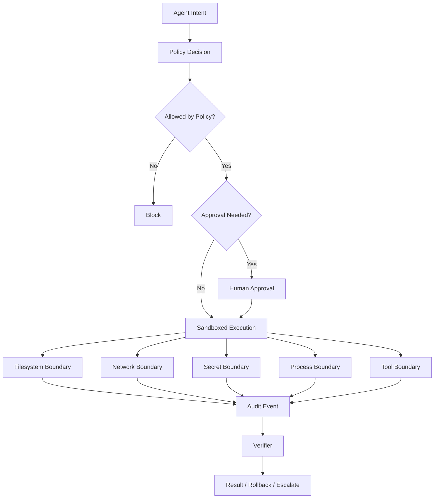
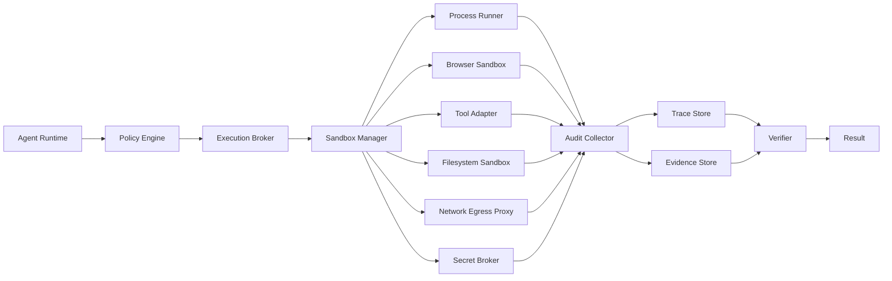
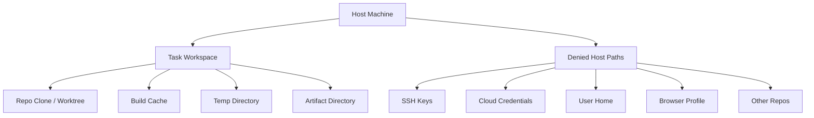
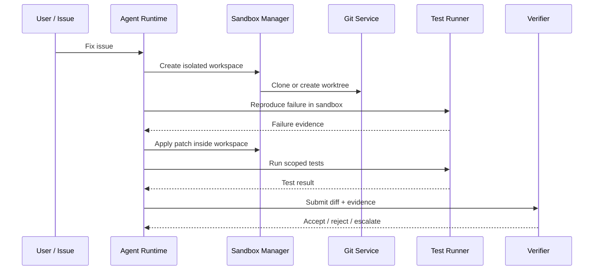
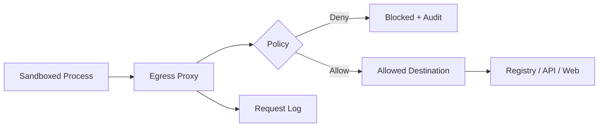
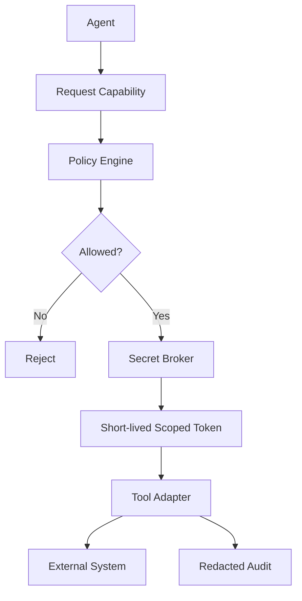
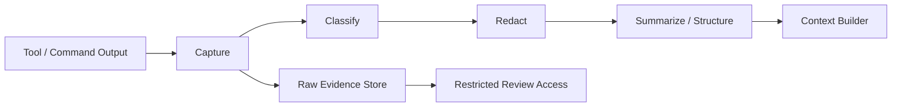
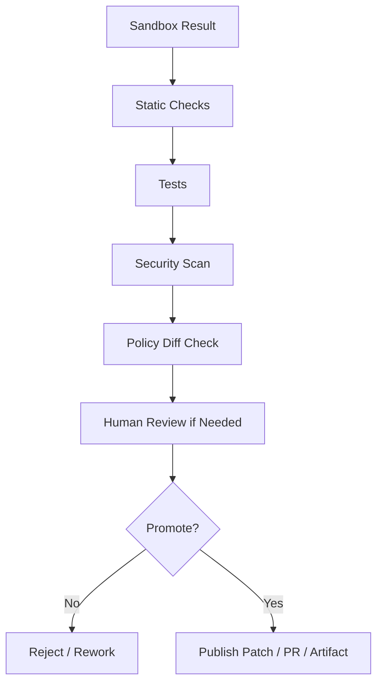

------
title: Learn Advanced Agentic AI Engineering & Autonomous Software Engineering - Part 031
description: Sandboxing and safe execution architecture for production agents: filesystem, network, process, browser, code execution, secrets, package managers, scoped credentials, approval policy, audit, and autonomous SWE isolation.
series: learn-agentic-ai-engineering
seriesTitle: Learn Advanced Agentic AI Engineering & Autonomous Software Engineering
order: 31
partTitle: Sandboxing and Safe Execution
tags:
- agentic-ai
- autonomous-software-engineering
- sandboxing
- safe-execution
- security
- isolation
- policy
- governance
- series
date: 2026-06-29
---

# Part 031 — Sandboxing and Safe Execution

> Target part ini: mampu mendesain **safe execution environment** untuk agentic system yang dapat menjalankan shell command, membaca/menulis file, memakai browser, memanggil API, menjalankan test/build, dan mengakses tool eksternal tanpa memberi agent akses tidak terbatas ke mesin, data, jaringan, credential, atau production system.

Part 029 membahas threat model.

Part 030 membahas policy, permission, dan identity.

Part ini membahas pertanyaan berikutnya:

> Setelah policy mengatakan action boleh dilakukan, di mana dan bagaimana action itu dieksekusi dengan aman?

Jawabannya bukan hanya “pakai container”.

Sandboxing adalah **execution boundary**. Approval adalah **decision boundary**. Policy adalah **rule boundary**. Identity adalah **authority boundary**. Observability adalah **evidence boundary**.

Sistem agentic yang aman membutuhkan semua boundary ini bekerja bersama.

OpenAI Codex, misalnya, mendeskripsikan sandbox sebagai boundary yang memungkinkan coding agent bertindak autonomous tanpa akses tak terbatas ke mesin; sandbox membatasi file yang dapat dimodifikasi, apakah command bisa memakai network, dan kapan agent harus kembali ke approval flow. Referensi ini penting karena memperlihatkan sandbox bukan sekadar runtime detail, melainkan trust model untuk agentic work.  
Reference: https://developers.openai.com/codex/concepts/sandboxing

OWASP Agentic AI Threats and Mitigations juga menekankan bahwa agentic AI memperluas risiko karena sistem dapat merencanakan, memakai tool, dan mengeksekusi multi-step action dengan tingkat autonomy yang lebih tinggi.  
Reference: https://genai.owasp.org/resource/agentic-ai-threats-and-mitigations/

---

## 1. Hubungan dengan Framework Kaufman

Dalam pendekatan Kaufman, kita pecah skill menjadi subskill kecil yang bisa dipraktikkan.

Sandboxing agentic system dapat dipecah menjadi:

1. mengenali execution surface,
2. memisahkan sandbox, approval, policy, dan identity,
3. mendesain filesystem boundary,
4. mendesain network egress boundary,
5. mendesain secret boundary,
6. mendesain process/resource boundary,
7. mendesain browser/computer-use sandbox,
8. mendesain package manager safety,
9. mendesain safe command contract,
10. mendesain audit dan replay,
11. menguji sandbox dengan abuse cases.

Skill ini harus dilatih dengan kasus nyata.

Bukan dengan membaca daftar best practice.

Contoh deliberate practice:

- agent diminta memperbaiki bug di repository,
- agent perlu menjalankan test,
- agent mencoba package install,
- dependency script mencoba network access,
- test membaca environment variable,
- malicious markdown mencoba menyuruh agent membaca secret,
- tool output mencoba memicu command destruktif,
- sandbox harus mencegah escalation tanpa mengandalkan model.

Mental model:



---

## 2. Core Principle: Agent Tidak Boleh Menjadi Root User

Agentic system sering gagal karena agent diberi akses seperti developer manusia senior, tetapi tanpa judgement manusia senior.

Ini salah.

Agent bukan manusia.

Agent adalah probabilistic planner yang dapat:

- salah memahami task,
- salah membaca tool output,
- mengikuti instruksi berbahaya dari dokumen,
- melakukan action terlalu luas,
- menganggap completion berhasil padahal belum,
- mengulangi command berbahaya,
- mengirim data ke tempat salah,
- memodifikasi file di luar scope,
- memakai credential yang tidak seharusnya terlihat.

Karena itu, agent tidak boleh diberi authority berdasarkan “kepercayaan terhadap model”.

Authority harus diberikan berdasarkan:

- task,
- user,
- environment,
- risk tier,
- tool,
- data sensitivity,
- reversibility,
- approval state,
- auditability,
- sandbox mode.

Rule praktis:

> Agent boleh melakukan hanya action yang tetap aman jika model salah.

Kalau action tidak aman ketika model salah, action butuh sandbox lebih kuat, approval, simulation, atau harus dilakukan manusia.

---

## 3. Sandboxing vs Approval vs Policy vs Authorization

Banyak tim mencampur empat konsep ini.

Itu membuat desain agent rapuh.

| Control | Pertanyaan | Contoh |
|---|---|---|
| Policy | Apakah action ini boleh menurut aturan? | Agent boleh menjalankan test, tetapi tidak boleh deploy production. |
| Authorization | Dengan identity/token apa action dilakukan? | Agent mendapat token read-only untuk repo tertentu selama 30 menit. |
| Approval | Apakah manusia harus menyetujui sebelum action lanjut? | Menghapus file, push branch, atau membuka PR butuh approval. |
| Sandbox | Apa yang secara teknis mungkin dilakukan di runtime? | Command tidak bisa membaca `/home/user/.ssh`, tidak bisa akses network selain registry allowlist. |

Sandbox adalah lapisan yang tetap bekerja ketika:

- model salah,
- prompt injection berhasil mempengaruhi model,
- tool output malicious,
- approval policy salah konfigurasi,
- developer lupa menambah guardrail di prompt,
- dependency post-install script mencoba keluar boundary,
- test runner mengeksekusi kode yang tidak dipercaya.

Sandbox yang baik adalah **mechanical control**.

Ia tidak perlu percaya model.

---

## 4. Execution Surface Agentic System

Sebelum mendesain sandbox, kita harus tahu apa yang dieksekusi agent.

Execution surface umum:

1. **File operations**
   - read file,
   - write file,
   - delete file,
   - rename file,
   - generate artifact,
   - apply patch.

2. **Shell commands**
   - `git`,
   - compiler,
   - test runner,
   - package manager,
   - formatter,
   - linter,
   - migration script.

3. **Code execution**
   - Python script,
   - Java tests,
   - Node scripts,
   - build plugin,
   - generated code,
   - notebook execution.

4. **Package managers**
   - npm,
   - pip,
   - Maven,
   - Gradle,
   - Go modules,
   - Docker build.

5. **Network calls**
   - package registry,
   - API service,
   - internal service,
   - public web,
   - model provider,
   - webhook.

6. **Browser/computer use**
   - navigate web app,
   - click UI,
   - fill form,
   - download file,
   - upload artifact,
   - interact with authenticated session.

7. **Repository operations**
   - branch creation,
   - commit,
   - push,
   - PR creation,
   - review comment,
   - merge.

8. **Cloud/platform operations**
   - deploy,
   - scale service,
   - rotate secret,
   - modify IAM,
   - create infrastructure,
   - rollback.

9. **Database operations**
   - read data,
   - run migration,
   - update records,
   - export data,
   - create index.

10. **Communication operations**
    - send email,
    - post Slack message,
    - create ticket,
    - notify customer,
    - open incident.

Setiap surface butuh boundary berbeda.

Jangan memakai satu sandbox concept untuk semua.

---

## 5. Safe Execution Invariant

Sebelum bicara teknologi, tetapkan invariant.

Invariant minimal:

1. Agent tidak bisa membaca secret yang tidak eksplisit diberikan.
2. Agent tidak bisa menulis di luar workspace yang ditentukan.
3. Agent tidak bisa mengakses network kecuali melalui egress policy.
4. Agent tidak bisa memakai credential long-lived.
5. Agent tidak bisa menjalankan privileged command.
6. Agent tidak bisa memodifikasi production tanpa approval kuat.
7. Agent tidak bisa menyembunyikan action dari audit trail.
8. Agent tidak bisa menghapus evidence sebelum diverifikasi.
9. Agent tidak bisa keluar dari resource budget.
10. Agent tidak bisa mempromosikan dirinya sendiri ke permission lebih tinggi.

Versi ringkas:

> Semua action agent harus bounded, observable, reversible jika memungkinkan, dan attributable.

---

## 6. Sandbox Mode Taxonomy

Tidak semua task butuh sandbox yang sama.

Gunakan mode.

| Mode | File Access | Network | Secrets | Use Case |
|---|---|---|---|---|
| `read_only` | read workspace | denied | none | repo understanding, analysis |
| `workspace_write` | read/write scoped workspace | denied | none | refactor, patch local files |
| `test_runner` | read/write build artifacts | limited | synthetic only | run unit/integration tests |
| `dependency_install` | workspace + cache | registry allowlist | none | install deps in isolated cache |
| `browser_untrusted` | download sandbox only | egress allowlist | no user session | public web research |
| `browser_authenticated` | isolated browser profile | domain allowlist | scoped session | operate SaaS UI with approval |
| `cloud_read_only` | no local secrets | provider API read-only | short-lived token | inspect infra/logs |
| `cloud_change_gated` | controlled | provider API scoped | short-lived token | approved rollback/scale/change |
| `production_blocked` | none | none | none | default for high-risk ops |

Mode harus menjadi konfigurasi runtime, bukan instruksi prompt.

Contoh buruk:

```text
Please do not access the network unless necessary.
```

Contoh baik:

```yaml
sandbox:
  filesystem:
    root: /workspace/task-123
    write_allowlist:
      - /workspace/task-123/src
      - /workspace/task-123/tests
    read_denylist:
      - /workspace/task-123/.env
      - /workspace/task-123/secrets
  network:
    default: deny
    allowlist:
      - registry.npmjs.org
      - repo.maven.apache.org
  process:
    timeout_seconds: 900
    max_processes: 64
    max_memory_mb: 4096
  secrets:
    mode: none
```

---

## 7. Reference Architecture: Safe Execution Plane

Produksi agent butuh execution plane yang jelas.



Komponen:

| Komponen | Tanggung Jawab |
|---|---|
| Policy Engine | Menentukan action allowed/blocked/approval-required. |
| Execution Broker | Satu pintu untuk semua command/tool execution. |
| Sandbox Manager | Membuat runtime isolated per task/run. |
| Filesystem Sandbox | Membatasi read/write/delete. |
| Network Egress Proxy | Mengatur domain/IP/protocol/volume. |
| Secret Broker | Mengeluarkan scoped secret tanpa mengekspos raw secret ke model. |
| Process Runner | Menjalankan command dengan timeout/resource limit. |
| Browser Sandbox | Mengisolasi browser profile, downloads, cookies, dan session. |
| Tool Adapter | Menormalisasi tool invocation, output, error, dan side effect. |
| Audit Collector | Merekam command, env redacted, file diff, network request, status. |
| Evidence Store | Menyimpan artifact untuk review/replay. |
| Verifier | Mengecek hasil sebelum action dianggap selesai. |

Pattern penting:

> Agent tidak langsung menjalankan command. Agent meminta execution broker menjalankan action dengan contract.

---

## 8. Safe Command Contract

Setiap command harus punya contract.

Tanpa contract, command menjadi “string berbahaya yang dipercaya”.

Contoh contract:

```yaml
command_request:
  id: cmd-20260629-001
  task_id: task-8841
  requester: agent:coding-fixer
  purpose: reproduce failing test
  command:
    argv: ["./gradlew", "test", "--tests", "com.acme.InvoiceServiceTest"]
    shell: false
  working_directory: /workspace/task-8841
  sandbox_mode: test_runner
  expected_outputs:
    - junit_xml
    - console_log
  side_effects:
    filesystem_write:
      - build/
      - .gradle/
    network: none
  timeout_seconds: 600
  retry:
    max_attempts: 1
  approval:
    required: false
  verification:
    success_condition: command_exit_zero_and_tests_pass
```

Contract harus menghindari shell injection.

Prefer:

```yaml
argv: ["git", "diff", "--", "src/main/java/Foo.java"]
shell: false
```

Hindari:

```yaml
command: "git diff src/main/java/Foo.java && cat $SECRET"
shell: true
```

Shell mode harus default-deny.

Kalau shell dibutuhkan, gunakan:

- command allowlist,
- argument validation,
- output redaction,
- working directory fixed,
- no inherited env by default,
- timeout,
- audit.

---

## 9. Filesystem Sandbox

Filesystem adalah boundary pertama coding agent.

Risiko:

- agent membaca `~/.ssh/id_rsa`,
- agent membaca `.env`,
- agent menghapus file di luar repo,
- agent menulis malicious hook,
- agent mengubah file generated/vendor tanpa sadar,
- agent membuat hidden file yang mempengaruhi build,
- test malicious membaca host filesystem.

Desain minimal:



Rules:

1. Buat workspace per run.
2. Jangan mount home directory.
3. Jangan mount global credential directory.
4. Jangan inherit `.env` host.
5. Jangan beri write access ke seluruh filesystem.
6. Pisahkan source, cache, temp, dan artifact.
7. Deny symlink escape.
8. Canonicalize path sebelum read/write.
9. Audit semua write/delete.
10. Hasil akhir berupa diff, bukan mutable state tersembunyi.

Path traversal harus dicegah.

Contoh validasi:

```pseudo
function resolveSandboxPath(root, requestedPath): Path {
  resolved = canonicalize(join(root, requestedPath))
  if !resolved.startsWith(canonicalize(root)):
    throw SandboxEscapeError
  if matchesDenylist(resolved):
    throw DeniedPathError
  return resolved
}
```

Jangan percaya path dari model.

Jangan percaya path dari tool output.

Jangan percaya path dari repository.

Repository bisa berisi symlink atau script malicious.

---

## 10. Workspace Strategy untuk Autonomous SWE

Untuk coding agent, gunakan isolated worktree.

Flow:



Recommended:

- satu workspace per task,
- satu branch per task,
- no write to default branch,
- no direct push without approval,
- no merge permission for agent by default,
- no access to unrelated repos,
- no access to developer host secrets,
- output final sebagai patch + evidence packet.

Diff gate:

```yaml
diff_policy:
  max_files_changed: 20
  allowed_paths:
    - src/**
    - tests/**
    - docs/**
  denied_paths:
    - .github/workflows/**
    - scripts/deploy/**
    - infra/prod/**
    - .env
    - secrets/**
  require_human_review_if:
    - build_config_changed
    - auth_code_changed
    - migration_added
    - dependency_added
    - generated_code_modified
```

Agent boleh menulis patch.

Agent tidak boleh diam-diam mengubah trust boundary.

---

## 11. Network Sandbox

Network access adalah sumber risiko besar.

Risiko:

- data exfiltration,
- package supply-chain attack,
- calling malicious URL from prompt injection,
- downloading unknown binary,
- contacting internal service,
- SSRF-like behavior melalui tool,
- accidental production API call,
- cost explosion,
- privacy leak,
- license/IP exposure.

Default yang aman:

```yaml
network:
  default: deny
```

Namun beberapa task butuh network.

Gunakan egress proxy.



Policy network harus mempertimbangkan:

- domain allowlist,
- IP/CIDR denylist,
- protocol,
- method,
- request size,
- response size,
- rate limit,
- auth requirement,
- content type,
- data classification,
- task purpose,
- approval state.

Contoh:

```yaml
network_policy:
  default: deny
  allow:
    - name: maven-central
      host: repo.maven.apache.org
      port: 443
      methods: [GET]
      max_response_mb: 500
    - name: npm-registry
      host: registry.npmjs.org
      port: 443
      methods: [GET]
      max_response_mb: 500
  deny:
    - cidr: 10.0.0.0/8
    - cidr: 172.16.0.0/12
    - cidr: 192.168.0.0/16
    - host_pattern: "*.internal"
```

Untuk enterprise, lebih aman memakai:

- internal package mirror,
- dependency cache,
- artifact proxy,
- SBOM scanning,
- license policy,
- vulnerability scanning,
- deterministic lockfile.

Jangan beri agent bebas internet hanya karena package install gagal.

Failure package install harus menjadi event yang bisa di-review.

---

## 12. Secret Boundary

Secrets tidak boleh masuk context model.

Ini invariant keras.

Agent tidak butuh melihat raw secret untuk memakai capability.

Ia butuh broker yang mengeksekusi action dengan scoped credential.

Bad design:

```text
Here is the production API token. Use it carefully.
```

Good design:



Secret design rules:

1. No long-lived token in agent prompt.
2. No raw secret in LLM context.
3. No inherited host environment by default.
4. Use short-lived credentials.
5. Scope token by task, tool, resource, and time.
6. Redact secret from logs.
7. Detect secret-like output.
8. Rotate on suspicious execution.
9. Revoke at run completion.
10. Separate read token from write token.

Example scoped credential:

```yaml
credential_grant:
  principal: agent:release-assistant
  delegated_by: user:alice
  capability: github.create_pull_request
  repository: acme/billing-service
  branch_pattern: agent/*
  expires_in_seconds: 1800
  allowed_methods:
    - create_branch
    - push_branch
    - open_pr
  denied_methods:
    - merge_pr
    - delete_repository
    - modify_secrets
```

Secret broker harus menyimpan audit:

- siapa meminta,
- atas task apa,
- approval mana,
- token scope apa,
- kapan issued,
- kapan revoked,
- tool mana memakai,
- hasil action apa.

---

## 13. Process and Resource Boundary

Agent bisa menyebabkan resource exhaustion.

Bukan hanya malicious.

Kadang agent menjalankan command salah:

- full test suite terlalu besar,
- infinite loop,
- recursive grep di folder build,
- dependency install tanpa batas,
- generated file raksasa,
- browser download besar,
- runaway container build.

Resource boundary:

```yaml
process_policy:
  max_runtime_seconds: 900
  max_cpu_cores: 4
  max_memory_mb: 4096
  max_disk_mb: 20480
  max_processes: 128
  max_open_files: 4096
  max_output_mb: 100
  kill_on_timeout: true
  preserve_artifacts_on_kill: true
```

Operationally important:

- output limit,
- log truncation with artifact storage,
- process tree kill,
- zombie process cleanup,
- cache quota,
- workspace TTL,
- retry budget,
- cost budget.

Do not let agent decide retry forever.

Retry is policy.

---

## 14. Browser and Computer-Use Sandbox

Browser agents are high risk because browser sessions often contain authority.

Risk:

- authenticated session reuse,
- CSRF-like actions,
- downloading malicious files,
- uploading sensitive files,
- reading private pages,
- submitting forms,
- clicking destructive UI,
- leaking data via search/query,
- obeying web-page prompt injection.

Browser sandbox requirements:

1. Dedicated browser profile per task.
2. No access to user personal browser profile.
3. Download folder scoped to sandbox.
4. Upload allowlist.
5. Domain allowlist.
6. Cookie/session isolation.
7. Screenshot/log capture with redaction.
8. Action classification for clicks/forms.
9. Human approval for irreversible actions.
10. No arbitrary file picker access.

Browser action contract:

```yaml
browser_action:
  url: https://github.com/acme/billing-service/pulls
  purpose: open pull request from prepared branch
  allowed_domains:
    - github.com
  forbidden_actions:
    - merge_pull_request
    - delete_repository
    - modify_org_settings
    - expose_secret
  require_approval_for:
    - submit_form
    - post_comment
    - download_file
    - upload_file
```

Treat web page content as untrusted.

A web page can contain prompt injection.

The browser agent must distinguish:

- task instruction from user/system,
- page content as data,
- UI affordance as possible action,
- action policy as external control.

---

## 15. Package Manager and Build Script Safety

Package managers are not passive download tools.

They can run scripts.

Examples:

- npm lifecycle scripts,
- Maven/Gradle plugins,
- pip setup hooks,
- Docker build steps,
- Makefile targets,
- code generation plugins.

Risks:

- malicious dependency,
- install script exfiltrates env,
- build plugin reads host files,
- dependency confusion,
- lockfile modification,
- transitive vulnerable package,
- external binary download.

Controls:

1. Run dependency install in sandbox.
2. Network allowlist registry only.
3. Use internal mirrors where possible.
4. Disable lifecycle scripts unless needed.
5. Require approval for new dependency.
6. Compare lockfile diff.
7. Generate SBOM for changed dependencies.
8. Scan dependency vulnerabilities.
9. Block unknown binary execution.
10. Cache dependencies separately per trust level.

Example policy:

```yaml
dependency_policy:
  allow_install_existing_lockfile: true
  allow_modify_lockfile: approval_required
  allow_new_dependency: approval_required
  allow_lifecycle_scripts: false
  registry_allowlist:
    - repo.maven.apache.org
    - registry.npmjs.org
    - pypi.org
  require_scan_if:
    - dependency_added
    - lockfile_changed
    - build_plugin_changed
```

Autonomous SWE agents should not quietly add dependencies to make a patch easier.

New dependency is an architectural decision.

---

## 16. Database Safe Execution

Database access is often more dangerous than file access.

A coding agent may need to:

- inspect schema,
- run migration locally,
- generate SQL,
- test migration,
- analyze data issue,
- propose repair script.

Default rule:

> Agent may use disposable or masked data by default. Production write requires strong approval and usually human execution.

Database sandbox layers:

| Layer | Control |
|---|---|
| Environment | ephemeral DB container, snapshot, masked data |
| Credential | read-only or migration-only scoped token |
| Query | statement allowlist, timeout, row limit |
| Data | masking, minimization, no raw PII in model context |
| Migration | dry-run, rollback plan, checksum, approval |
| Audit | query log, affected rows, schema diff |

SQL execution contract:

```yaml
sql_execution:
  environment: ephemeral_test_db
  access: read_write_sandbox_only
  max_rows_returned: 100
  timeout_seconds: 30
  forbidden:
    - production_host
    - unmasked_pii_export
    - drop_database
    - truncate_without_approval
  required_artifacts:
    - migration_diff
    - rollback_script
    - test_result
```

For production data issues, agent should produce:

- diagnosis,
- proposed query,
- expected affected rows,
- risk analysis,
- rollback strategy,
- verification query,
- approval packet.

Not execute blindly.

---

## 17. Cloud and Production Safe Execution

Cloud agents can be useful.

They can also be catastrophic.

Cloud operations include:

- inspect logs,
- restart service,
- change config,
- scale deployment,
- rollback release,
- rotate secret,
- modify IAM,
- create infrastructure,
- delete resource.

Risk tiers:

| Tier | Example | Default Agent Mode |
|---|---|---|
| Low | read logs, list deployments | read-only scoped token |
| Medium | restart non-prod service | approval required |
| High | production rollback | approval + runbook + evidence |
| Critical | IAM/secrets/network perimeter | human-only or break-glass |

Cloud safe execution requires:

1. separate cloud account/project per environment,
2. scoped service account,
3. no broad admin role,
4. action allowlist,
5. dry-run where possible,
6. change ticket reference,
7. approval gate,
8. blast radius calculation,
9. rollback plan,
10. post-action verification.

Example:

```yaml
cloud_action_policy:
  action: kubernetes.rollout_restart
  environment: production
  service: billing-api
  allowed: true
  approval_required: true
  required_context:
    - incident_id
    - current_error_rate
    - last_deployment_sha
    - rollback_plan
    - expected_customer_impact
  forbidden_if:
    - no_oncall_acknowledgement
    - active_data_migration
    - missing_observability_link
```

Agent should not be allowed to “try things” in production.

Production action must be runbook-driven.

---

## 18. Approval and Sandbox Interaction

Sandbox and approval should work together.

A common bad design:

> Ask user approval for every command.

This causes approval fatigue.

A better design:

- low-risk command inside sandbox runs automatically,
- boundary-crossing command pauses for approval,
- approval explains delta from current sandbox mode,
- approved capability is scoped and temporary.

Example approval prompt content:

```yaml
approval_request:
  action: enable_network_access
  reason: install dependencies from Maven Central
  current_mode: workspace_write_network_denied
  requested_mode: dependency_install_network_allowlisted
  destination:
    - repo.maven.apache.org
  duration_seconds: 600
  data_exposure: dependency metadata only
  alternatives:
    - use cached dependencies
    - ask user to provide artifact
  risk: medium
```

Human should not approve blind command strings.

Human approves capability transition.

---

## 19. Output Handling and Exfiltration Defense

Safe execution is not only about input.

Outputs can be dangerous.

Examples:

- command output contains secret,
- test log contains customer data,
- browser screenshot contains token,
- generated file contains malicious script,
- tool output contains prompt injection,
- agent summary includes sensitive content.

Controls:

1. output redaction,
2. secret scanning,
3. PII detection,
4. max output size,
5. artifact classification,
6. output quarantine,
7. safe rendering,
8. no raw HTML execution,
9. structured result extraction,
10. evidence retention policy.

Treat tool output as untrusted.

Do not place arbitrary output into next prompt without filtering.

Pipeline:



Raw evidence can be stored securely.

Model context should receive minimized, redacted, task-relevant output.

---

## 20. Audit and Forensics

If agent execution cannot be reconstructed, it is not production-ready.

Minimum audit fields:

```yaml
audit_event:
  event_id: evt-001
  run_id: run-abc
  task_id: task-123
  principal: agent:coding-fixer
  delegated_by: user:alice
  sandbox_mode: test_runner
  action_type: command_execution
  command_hash: sha256:...
  argv_redacted: ["./gradlew", "test"]
  working_directory: /workspace/task-123
  policy_decision: allowed
  approval_id: null
  started_at: 2026-06-29T10:15:00+07:00
  ended_at: 2026-06-29T10:17:31+07:00
  exit_code: 0
  filesystem_writes:
    - build/test-results/test/TEST-*.xml
  network_destinations: []
  artifact_refs:
    - artifact://run-abc/test-log
```

Audit must include:

- decision input,
- policy version,
- sandbox mode,
- command/tool call,
- file diff,
- network calls,
- credential grant,
- approval id,
- output artifact,
- verifier result.

For high-risk agents, audit log should be append-only.

Do not let agent edit its own audit trail.

---

## 21. Replayability

Replayability is essential for debugging and compliance.

A run is replayable when you can reconstruct:

- initial task,
- model version,
- prompt/context summary,
- tool schema version,
- policy version,
- sandbox mode,
- command sequence,
- file state/diff,
- outputs,
- approvals,
- final result.

Full deterministic replay may be impossible with LLM nondeterminism.

But operational replay should still answer:

> What did the agent see, decide, execute, modify, and verify?

For autonomous SWE:

- keep base commit SHA,
- keep patch diff,
- keep test commands,
- keep test output,
- keep dependency state,
- keep environment metadata,
- keep PR evidence packet.

---

## 22. Verification Before Release from Sandbox

Sandbox output should not automatically become trusted output.

Use release gate.



For code patch:

- diff path allowed,
- no secret added,
- no suspicious binary,
- no dependency added without approval,
- tests pass,
- lint pass,
- formatter pass,
- security-sensitive files reviewed,
- generated code policy satisfied,
- PR summary includes evidence.

For artifact:

- provenance known,
- checksum recorded,
- license acceptable,
- malware scan,
- SBOM if needed.

For cloud action:

- dry-run output,
- blast radius known,
- approval id,
- rollback available,
- post-action metric verified.

---

## 23. Sandboxing Anti-Patterns

### Anti-Pattern 1: Prompt-Only Sandbox

```text
Do not read private files.
```

This is not sandboxing.

It is a wish.

### Anti-Pattern 2: Full Host Mount

Mounting host home directory into agent container gives agent too much power.

### Anti-Pattern 3: Network Open by Default

Open network turns every prompt injection into possible exfiltration.

### Anti-Pattern 4: Long-Lived Token in Environment

If every command inherits production token, any build/test script can leak it.

### Anti-Pattern 5: Approval Fatigue

Asking approval for every harmless command trains humans to click yes.

### Anti-Pattern 6: No Artifact Retention

If logs/diffs disappear, incident analysis becomes guesswork.

### Anti-Pattern 7: Sandbox Escape via Symlink

Path allowlist without canonicalization is not enough.

### Anti-Pattern 8: Trusting Package Scripts

Dependency install can execute code.

### Anti-Pattern 9: Browser Session Reuse

Letting agent use personal authenticated browser session is dangerous.

### Anti-Pattern 10: Agent Self-Approval

Agent must not approve its own boundary escalation.

---

## 24. Testing the Sandbox

Sandbox must be tested like a security-critical subsystem.

Test categories:

| Test | Example |
|---|---|
| Filesystem escape | Try `../../.ssh/id_rsa`, symlink escape, absolute path read. |
| Network egress | Try curl to denied domain, internal IP, metadata endpoint. |
| Secret exposure | Put fake secret in env and verify command cannot read/log it. |
| Resource exhaustion | Infinite loop, huge output, fork bomb simulation. |
| Package script | Dependency postinstall tries network/secret read. |
| Browser injection | Web page tells agent to reveal data or click destructive button. |
| Approval bypass | Tool tries to encode destructive action as harmless action. |
| Audit tampering | Agent tries to delete or edit logs. |
| Workspace boundary | Patch attempts denied path. |
| Credential scope | Token cannot call forbidden API. |

Example test:

```pseudo
test "agent cannot read host ssh key" {
  sandbox = createSandbox(mode = workspace_write)
  result = sandbox.run(["cat", "/home/user/.ssh/id_rsa"])
  assert result.exit_code != 0
  assert result.error contains "denied"
  assert audit.containsDeniedAccess("/home/user/.ssh/id_rsa")
}
```

Do not deploy sandbox without abuse tests.

---

## 25. Safe Execution Maturity Model

| Level | Characteristics |
|---|---|
| 0 — No Isolation | Agent runs on host with user credentials. Not acceptable for production. |
| 1 — Basic Workspace | Isolated folder, limited file write, but network/secrets weak. |
| 2 — Containerized | Process isolation, resource limits, workspace mount, basic audit. |
| 3 — Policy-Aware Sandbox | Mode-based filesystem/network/secret policy, approval escalation. |
| 4 — Enterprise Execution Plane | Egress proxy, secret broker, audit, replay, artifact store, per-task identity. |
| 5 — Regulated-Grade | Formal risk tiering, tamper-evident audit, continuous eval, incident playbook, compliance mapping. |

Target untuk serious autonomous SWE platform minimal Level 3.

Target untuk enterprise agent platform minimal Level 4.

Target untuk regulated/high-impact domain Level 5.

---

## 26. Production Readiness Checklist

Gunakan checklist ini sebelum memberi agent execution authority.

### Filesystem

- [ ] Workspace per task.
- [ ] No host home mount.
- [ ] Write allowlist.
- [ ] Read denylist.
- [ ] Symlink escape blocked.
- [ ] File diff captured.
- [ ] Secret scan on output diff.

### Network

- [ ] Default deny.
- [ ] Egress allowlist.
- [ ] Internal network blocked by default.
- [ ] Metadata endpoints blocked.
- [ ] Request/response size limit.
- [ ] Network calls audited.

### Secrets

- [ ] No raw secret in prompt.
- [ ] No inherited host env.
- [ ] Short-lived scoped token.
- [ ] Token revoked after run.
- [ ] Secret redaction in logs.
- [ ] Secret leak detection.

### Process

- [ ] Timeout.
- [ ] Memory limit.
- [ ] Disk quota.
- [ ] Process count limit.
- [ ] Output limit.
- [ ] Cleanup after run.

### Approval

- [ ] Boundary crossing requires approval.
- [ ] Approval packet explains risk.
- [ ] Approval grants scoped capability.
- [ ] Approval expires.
- [ ] Agent cannot self-approve.

### Audit

- [ ] Every action logged.
- [ ] Policy version logged.
- [ ] Sandbox mode logged.
- [ ] Credential grant logged.
- [ ] Artifact references stored.
- [ ] Audit cannot be modified by agent.

---

## 27. Practice: Design a Sandbox for a Coding Agent

Scenario:

A coding agent must fix a bug in `billing-service`.

It needs to:

- read repository,
- run failing tests,
- edit source and test files,
- run Gradle,
- possibly download dependencies,
- open a PR.

Design sandbox policy.

Expected answer should include:

```yaml
sandbox_profile:
  name: coding-agent-standard
  filesystem:
    root: /workspace/runs/{run_id}
    read_allowlist:
      - repo/**
    write_allowlist:
      - repo/src/**
      - repo/tests/**
      - repo/build/**
      - repo/.gradle/**
    read_denylist:
      - repo/.env
      - repo/secrets/**
      - /home/**
    denied_paths:
      - repo/.github/workflows/**
      - repo/infra/prod/**
  network:
    default: deny
    allow_after_approval:
      - repo.maven.apache.org
  secrets:
    mode: none_for_build
    github_token:
      issue: only_for_open_pr
      scope:
        - create_branch
        - push_branch
        - open_pr
      expires_in_seconds: 1800
  process:
    timeout_seconds: 900
    memory_mb: 4096
    disk_mb: 20480
  approval_required_for:
    - new_dependency
    - network_enablement
    - workflow_change
    - infra_change
    - open_pull_request
```

Then explain:

- why network is initially denied,
- why secrets are not inherited,
- why workflow/infra paths are gated,
- why PR creation uses separate scoped token,
- what evidence must be captured.

---

## 28. Part Summary

Sandboxing is the execution boundary for agentic systems.

The key lesson:

> Do not ask the model to be safe. Build an execution environment where unsafe action is mechanically blocked, scoped, audited, and escalated.

A production-grade safe execution design includes:

- filesystem isolation,
- network egress control,
- secret broker,
- scoped credentials,
- process/resource limits,
- browser session isolation,
- package manager safety,
- approval for boundary escalation,
- tamper-resistant audit,
- output redaction,
- verification before promotion.

This is especially important for autonomous software engineering because coding agents execute untrusted repository code, build scripts, tests, package managers, and generated artifacts.

If the sandbox is weak, the agent platform is weak.

---

## 29. References

- OpenAI Codex — Sandbox: https://developers.openai.com/codex/concepts/sandboxing
- OWASP — Agentic AI Threats and Mitigations: https://genai.owasp.org/resource/agentic-ai-threats-and-mitigations/
- OWASP Top 10 for LLM Applications: https://owasp.org/www-project-top-10-for-large-language-model-applications/
- Model Context Protocol Specification: https://modelcontextprotocol.io/specification
- OpenAI Agents SDK — Guardrails and tools: https://openai.github.io/openai-agents-python/
- NIST AI Risk Management Framework: https://www.nist.gov/itl/ai-risk-management-framework

---

## 30. Next Part

Part berikutnya membahas **Governance, Risk, and Compliance**.

Kita akan naik dari technical sandbox ke organizational control system: agent registry, risk tiering, model/system cards, auditability, compliance mapping, human oversight, lifecycle governance, and regulatory defensibility.
