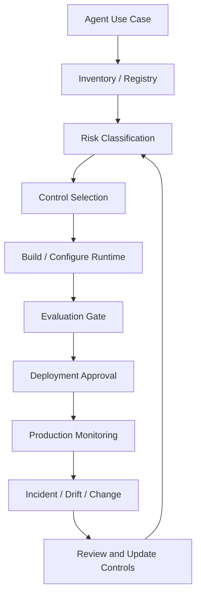
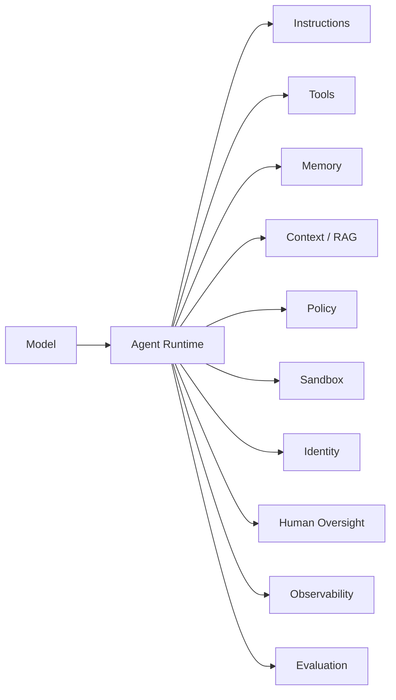
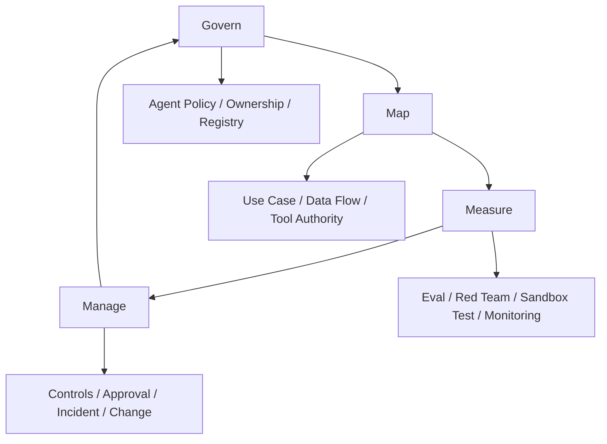
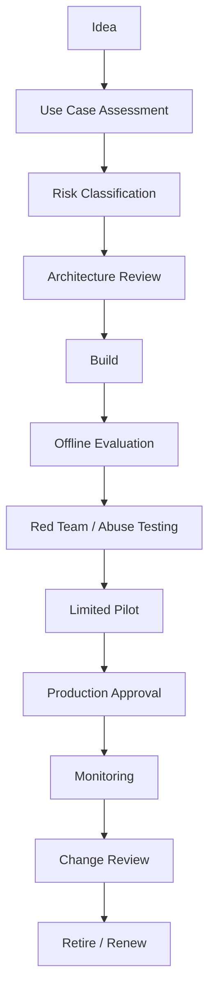
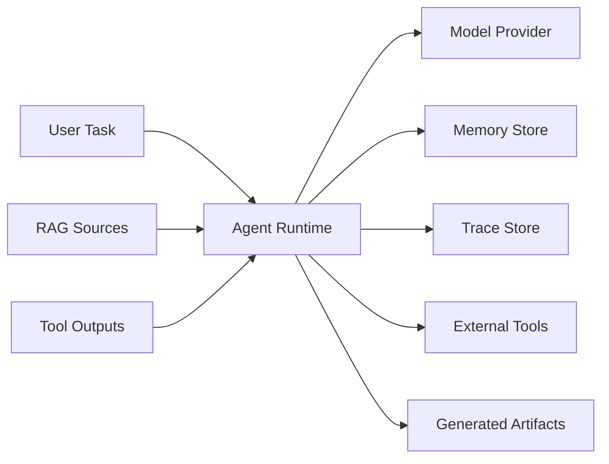
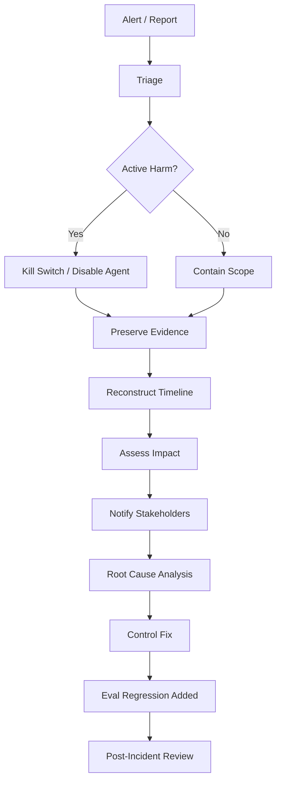

------
title: Learn Advanced Agentic AI Engineering & Autonomous Software Engineering - Part 032
description: Governance, risk, and compliance architecture for agentic AI systems: NIST-style lifecycle governance, EU AI Act risk framing, agent registry, risk tiering, auditability, accountability, data governance, human oversight, post-deployment monitoring, and regulatory defensibility.
series: learn-agentic-ai-engineering
seriesTitle: Learn Advanced Agentic AI Engineering & Autonomous Software Engineering
order: 32
partTitle: Governance, Risk, and Compliance
tags:
- agentic-ai
- autonomous-software-engineering
- governance
- risk-management
- compliance
- nist-ai-rmf
- eu-ai-act
- auditability
- series
date: 2026-06-29
---

# Part 032 — Governance, Risk, and Compliance

> Target part ini: mampu mendesain **governance operating system** untuk agentic AI: agent registry, risk classification, ownership, accountability, data governance, audit evidence, human oversight, post-deployment monitoring, change management, incident response, and regulatory defensibility.

Part 031 membahas sandboxing dan safe execution.

Sekarang kita naik satu level.

Pertanyaan utama:

> Bagaimana organisasi membuktikan bahwa agentic system dirancang, dijalankan, diawasi, dan diubah secara bertanggung jawab?

Jawaban teknis saja tidak cukup.

Agent bisa punya sandbox bagus, tetapi tetap gagal governance jika:

- tidak ada owner,
- tidak ada inventory,
- tidak ada risk tier,
- tidak ada approval record,
- tidak ada data classification,
- tidak ada incident process,
- tidak ada eval regression,
- tidak ada audit trail,
- tidak ada dokumentasi perubahan,
- tidak ada batas tanggung jawab antara model provider, platform team, app team, dan business owner.

Governance bukan dokumen setelah sistem selesai.

Governance adalah **control system** yang hidup bersama agent runtime.

NIST AI RMF menyatakan framework-nya dimaksudkan untuk meningkatkan kemampuan organisasi memasukkan pertimbangan trustworthiness ke design, development, use, dan evaluation AI systems. NIST juga merilis Generative AI Profile pada 26 Juli 2024 untuk membantu organisasi mengidentifikasi risiko unik generative AI dan memilih tindakan risk management yang sesuai.  
Reference: https://www.nist.gov/itl/ai-risk-management-framework

EU AI Act menggunakan pendekatan risk-based untuk AI developers dan deployers, mencakup level risiko seperti unacceptable, high-risk, transparency risk, dan minimal/no risk. Untuk high-risk systems, halaman resmi European Commission menekankan requirement seperti risk assessment/mitigation, dataset quality, logging, documentation, information to deployer, human oversight, robustness, cybersecurity, dan accuracy.  
Reference: https://digital-strategy.ec.europa.eu/en/policies/regulatory-framework-ai

Catatan: materi ini bukan nasihat hukum. Tujuannya adalah membangun mental model engineering agar sistem agentic punya evidence, control, dan defensibility yang dapat didiskusikan dengan legal, compliance, security, audit, dan risk teams.

---

## 1. Hubungan dengan Framework Kaufman

Dalam kerangka Kaufman, governance tampak besar dan abstrak.

Kita pecah menjadi subskill:

1. membuat inventory agent,
2. mengklasifikasi risk tier,
3. mendefinisikan owner dan accountability,
4. memetakan data flow,
5. memetakan tool/action authority,
6. membuat agent card/system card,
7. mendesain approval dan human oversight,
8. mendesain audit evidence,
9. mendesain lifecycle gate,
10. membuat eval dan monitoring,
11. membuat incident playbook,
12. melakukan compliance crosswalk.

Kaufman-style practice:

- pilih satu agent use case,
- buat registry entry,
- buat risk assessment,
- tentukan controls,
- jalankan tabletop failure scenario,
- evaluasi apakah evidence cukup untuk menjelaskan apa yang terjadi.

Mental model:



Governance adalah loop.

Bukan checklist satu kali.

---

## 2. Why Agentic Governance Is Harder Than Normal AI Governance

Traditional ML governance biasanya fokus pada:

- model purpose,
- dataset,
- training/evaluation,
- bias/fairness,
- model performance,
- deployment monitoring,
- model version.

Agentic governance menambah dimensi baru:

1. **Action authority**
   - agent tidak hanya memprediksi,
   - agent bisa menjalankan action.

2. **Tool ecosystem**
   - risk tidak hanya dari model,
   - risk juga dari tools, APIs, browser, plugins, MCP servers, repo scripts.

3. **State and memory**
   - behavior dipengaruhi oleh memory lintas sesi.

4. **Runtime autonomy**
   - agent bisa mengambil langkah intermediate yang tidak ditentukan eksplisit oleh developer.

5. **Dynamic context**
   - input agent berasal dari dokumen, retrieval, tool output, web page, logs, tickets.

6. **Multi-party delegation**
   - agent dapat bertindak atas nama user, team, service account, atau organization.

7. **Non-determinism**
   - trajectory berbeda walau task mirip.

8. **Evaluation complexity**
   - outcome akhir saja tidak cukup,
   - trajectory dan tool calls juga harus dievaluasi.

9. **Audit challenge**
   - auditor perlu tahu bukan hanya output,
   - tetapi apa yang agent lihat, putuskan, panggil, ubah, dan verifikasi.

10. **Regulatory trigger ambiguity**
    - agent yang awalnya “internal productivity tool” bisa menjadi high-impact jika dipakai untuk HR, credit, healthcare, legal, enforcement, public services, or critical infrastructure.

Agentic governance harus mengelola **system behavior**, bukan hanya model behavior.

---

## 3. Governance Scope: What Must Be Governed?

Governance tidak boleh hanya mencatat model name.

Agentic system terdiri dari banyak komponen.



Governance scope minimal:

| Area | Questions |
|---|---|
| Purpose | Untuk apa agent dibuat? Apa yang tidak boleh dilakukan? |
| Owner | Siapa business owner, technical owner, risk owner? |
| Model | Model apa, version apa, provider apa, fallback apa? |
| Instructions | Siapa boleh mengubah instruction? Bagaimana versioning? |
| Tools | Tool apa yang tersedia? Side effect apa? Authority apa? |
| Data | Data apa yang dibaca/ditulis? Sensitivity apa? Retention berapa lama? |
| Memory | Memory apa yang disimpan? Siapa bisa menghapus? Bagaimana poisoning dicegah? |
| Identity | Agent bertindak sebagai siapa? Delegated by siapa? |
| Policy | Rule apa yang membatasi action? Bagaimana diuji? |
| Sandbox | Boundary teknis apa yang enforce action? |
| Human Oversight | Kapan manusia harus review/approve? |
| Evaluation | Bagaimana capability, safety, dan regression diukur? |
| Monitoring | Metrics, incidents, drift, misuse, cost, and failure modes. |
| Audit | Evidence apa yang tersedia untuk rekonstruksi? |
| Change | Bagaimana update model/tool/prompt/policy dirilis? |

---

## 4. NIST-Style Governance Loop

NIST AI RMF populer karena memberikan struktur lifecycle.

Untuk agentic system, kita bisa adaptasi empat fungsi utama:

1. **Govern**
   - roles,
   - policies,
   - accountability,
   - culture,
   - documentation,
   - risk appetite.

2. **Map**
   - context,
   - intended use,
   - stakeholders,
   - data flow,
   - impact,
   - legal/regulatory environment.

3. **Measure**
   - evaluation,
   - testing,
   - monitoring,
   - robustness,
   - safety,
   - security,
   - fairness where relevant.

4. **Manage**
   - prioritize risk,
   - implement controls,
   - monitor residual risk,
   - incident response,
   - decommission.

Agentic adaptation:



The important shift:

> For agents, Map must include external actions, tools, memory, data flows, and affected persons.

Without that, risk classification is shallow.

---

## 5. Agent Registry

Agent registry is the inventory of deployed and proposed agents.

No registry means no governance.

Minimum entry:

```yaml
agent_registry_entry:
  id: agent-ase-pr-reviewer
  name: Autonomous PR Review Agent
  status: production
  owner:
    business: Engineering Productivity
    technical: AI Platform Team
    risk: Security Architecture
  purpose: review pull requests for correctness, maintainability, and security risk
  prohibited_uses:
    - auto_merge_without_human_review
    - modify_repository_settings
    - review_private_customer_data_without_approval
  users:
    - internal_engineers
  affected_parties:
    - developers
    - service_owners
  model:
    provider: approved_model_provider
    model_family: frontier-coding-model
    version_policy: pinned_with_evaluation_gate
  runtime:
    framework: internal-agent-runtime
    sandbox_profile: read_only_plus_diff_analysis
    policy_profile: pr_review_agent_policy_v3
  tools:
    - github.read_pr
    - github.read_diff
    - code_search
    - static_analysis
    - vulnerability_database_read
  data:
    reads:
      - source_code
      - pull_request_metadata
      - ci_results
    writes:
      - pr_review_comment
    sensitivity: internal_confidential
  memory:
    enabled: true
    type: procedural_and_team_preferences
    retention_days: 180
  autonomy:
    level: advisory_only
    irreversible_actions: none
  human_oversight:
    required_for:
      - posting_blocking_review
      - security_sensitive_findings
  evaluation:
    eval_suite: pr-review-eval-v5
    last_passed: 2026-06-20
  monitoring:
    dashboard: agent-observability/pr-reviewer
  audit:
    trace_retention_days: 365
```

Registry should be queryable.

You should be able to ask:

- Which agents can write to GitHub?
- Which agents have memory enabled?
- Which agents touch customer data?
- Which agents use browser automation?
- Which agents can trigger production changes?
- Which agents use a deprecated model?
- Which agents lack recent eval results?
- Which agents have high-risk classification?

---

## 6. Risk Classification

A practical risk tiering model:

| Tier | Description | Examples | Required Controls |
|---|---|---|---|
| Tier 0 | No action, no sensitive data | public FAQ summarizer | basic logging |
| Tier 1 | Internal read-only assistance | repo summarizer, docs assistant | registry, eval, access control |
| Tier 2 | Writes low-impact artifacts | draft PR comment, generate test | review gate, audit, sandbox |
| Tier 3 | Executes reversible actions | open PR, create ticket, run non-prod job | approval policy, scoped credentials, monitoring |
| Tier 4 | Affects production/business process | rollback suggestion, customer email draft, compliance triage | strong HITL, risk assessment, incident playbook |
| Tier 5 | Irreversible/high-impact decisions | approve credit, deny benefit, terminate employee, autonomous enforcement | usually human decision authority, legal review, high-risk controls |

Risk factors:

```yaml
risk_factors:
  data_sensitivity:
    - public
    - internal
    - confidential
    - regulated
    - personal_data
    - special_category
  action_impact:
    - read_only
    - draft_only
    - reversible_write
    - external_communication
    - production_change
    - legal_or_financial_effect
  autonomy_level:
    - advisory
    - assistive
    - gated_action
    - bounded_autonomous
    - open_ended_autonomous
  reversibility:
    - fully_reversible
    - compensatable
    - difficult_to_reverse
    - irreversible
  affected_parties:
    - internal_staff
    - customers
    - public
    - vulnerable_groups
  environment:
    - local
    - non_prod
    - production
  auditability:
    - full_trace
    - partial_trace
    - weak_trace
```

Risk classification should be conservative.

If uncertain, increase tier until evidence supports downgrade.

---

## 7. Agent Impact Assessment

Before production deployment, complete an impact assessment.

Questions:

### Purpose and Context

- What problem does the agent solve?
- Why is agentic autonomy needed?
- What would a deterministic workflow do instead?
- What is out of scope?
- What is the expected business benefit?

### Stakeholders

- Who uses it?
- Who is affected by its output/action?
- Who can override it?
- Who is accountable for failure?

### Data

- What data is accessed?
- Is personal data involved?
- Is confidential code involved?
- Is regulated data involved?
- Is data sent to third-party providers?
- What is retained?
- How can data be deleted?

### Tools and Actions

- What tools can the agent call?
- Which tools have side effects?
- Which actions are irreversible?
- Which actions require approval?
- What credentials are used?
- What sandbox applies?

### Failure Modes

- What happens if the model is wrong?
- What happens if context is poisoned?
- What happens if tool output is malicious?
- What happens if memory is stale?
- What happens if agent loops?
- What happens if approval is wrong?

### Controls

- What policies apply?
- What eval gates exist?
- What monitoring exists?
- What incident playbook exists?
- What kill switch exists?

### Residual Risk

- What risk remains after controls?
- Who accepted it?
- When will it be reviewed again?

---

## 8. Agent Card / System Card

A model card is not enough.

Agentic system needs agent card.

Template:

```md
# Agent Card: <Agent Name>

## Summary
- Purpose:
- Owner:
- Status:
- Risk Tier:
- Deployment Environment:

## Intended Use
- Supported tasks:
- Unsupported tasks:
- Prohibited uses:

## Autonomy and Authority
- Autonomy level:
- Tools:
- Side-effecting actions:
- Approval requirements:
- Scoped credentials:

## Data and Memory
- Data sources:
- Data sensitivity:
- Data sent to model provider:
- Memory enabled:
- Retention:
- Deletion mechanism:

## Runtime Controls
- Sandbox profile:
- Policy profile:
- Guardrails:
- Rate/cost limits:
- Kill switch:

## Evaluation
- Offline eval suite:
- Red-team scenarios:
- Last evaluation date:
- Known limitations:

## Monitoring
- Key metrics:
- Alert thresholds:
- Incident owner:

## Change Management
- Model update process:
- Prompt/tool/policy update process:
- Rollback process:

## Audit Evidence
- Trace retention:
- Approval retention:
- Artifact retention:
```

Agent card should be versioned with code/config.

Do not keep it as stale wiki text.

---

## 9. Governance Gates Across Lifecycle

Agent lifecycle:



Gate requirements:

| Gate | Required Evidence |
|---|---|
| Use Case Assessment | purpose, scope, alternatives, affected users |
| Risk Classification | risk tier, data sensitivity, action impact |
| Architecture Review | runtime, tools, sandbox, identity, policy |
| Offline Evaluation | eval results, regression baseline |
| Red Team | prompt injection, tool abuse, data exfiltration, autonomy abuse |
| Pilot | limited users, limited data, telemetry, feedback |
| Production Approval | owner sign-off, residual risk acceptance, incident playbook |
| Change Review | model/prompt/tool/policy diff, eval re-run, rollback plan |
| Retirement | data deletion, token revocation, registry update |

A mature organization does not ask:

> Is the model good enough?

It asks:

> Is the system controlled enough for this use case?

---

## 10. Data Governance for Agentic Systems

Agentic data governance must cover:

1. input data,
2. retrieved context,
3. tool output,
4. memory,
5. logs/traces,
6. generated artifacts,
7. external transmissions,
8. human feedback,
9. training/eval reuse.

Data flow map:



Questions:

- What data leaves the organization boundary?
- What data enters model context?
- What data is stored in memory?
- What data is stored in logs?
- What is redacted?
- What is retained?
- What is used for eval/training?
- Who can access trace evidence?
- How can user request deletion?
- How is data separated by tenant/customer?

Controls:

```yaml
data_governance_policy:
  classification_required: true
  model_context:
    allow_personal_data: conditional
    allow_secrets: false
    allow_customer_regulated_data: approval_required
  memory:
    default: disabled
    enable_requires:
      - purpose
      - retention_period
      - deletion_process
      - poisoning_mitigation
  traces:
    redact_secrets: true
    redact_personal_data: conditional
    retention_days_by_tier:
      tier_1: 30
      tier_2: 90
      tier_3: 180
      tier_4: 365
      tier_5: legal_policy
  external_transmission:
    require_vendor_approval: true
    require_data_processing_terms: true
```

Do not let memory become shadow database.

Do not let traces become ungoverned data lake.

---

## 11. Human Oversight as Governance Control

Human oversight is not the same as “human can look if they want”.

It must be explicit:

- when required,
- who reviews,
- what they review,
- what evidence they see,
- how approval is recorded,
- how override works,
- how conflict is handled.

Oversight model:

| Oversight Type | Use Case |
|---|---|
| Human review of output | PR review comments, customer email draft |
| Human approval before action | opening PR, posting public comment, non-prod deployment |
| Human decision authority | legal/financial/employment/enforcement decisions |
| Human escalation | low confidence, policy uncertainty, conflict, high-risk data |
| Human audit sampling | periodic review of agent actions |

Approval packet should include:

- proposed action,
- reason,
- evidence,
- alternatives,
- risk tier,
- blast radius,
- reversibility,
- policy decision,
- credential scope,
- expiration,
- expected verification.

Bad approval:

```text
Agent wants to continue. Approve?
```

Good approval:

```yaml
approval_request:
  action: post_pr_review_comment
  repository: acme/billing-service
  risk: medium
  finding: possible missing authorization check
  evidence:
    - file: src/main/java/BillingController.java
    - line_range: 88-116
    - test_gap: no negative authorization test found
  proposed_comment: "..."
  alternatives:
    - save draft only
    - request security reviewer
  expiration: 15 minutes
```

---

## 12. Auditability and Evidence

Auditability answers:

> Can we reconstruct why the agent did what it did?

Minimum evidence:

1. task/request,
2. user/delegator,
3. agent version,
4. model version,
5. instruction version,
6. tool schema version,
7. policy version,
8. context sources,
9. memory reads/writes,
10. tool calls,
11. sandbox mode,
12. credential grants,
13. approvals,
14. generated outputs,
15. verification results,
16. final action.

Audit event model:

```yaml
audit_record:
  run_id: run-20260629-xyz
  agent_id: agent-ase-pr-reviewer
  agent_version: 3.4.1
  model: approved-coding-model-v5
  instruction_version: sha256:...
  policy_version: pr-review-policy-v3
  task:
    type: pull_request_review
    source: github
    repository: acme/billing-service
    pull_request: 1842
  data_access:
    files_read:
      - src/main/java/BillingController.java
    memory_reads:
      - team-style-guide:v2
  tool_calls:
    - github.read_diff
    - code_search.search_symbol
    - static_analysis.run
  decisions:
    - risk_score: medium
    - approval_required: false
  output:
    type: review_comment
    status: posted
  verification:
    policy_check: passed
    secret_scan: passed
  timestamps:
    started_at: 2026-06-29T11:00:00+07:00
    ended_at: 2026-06-29T11:03:41+07:00
```

High-risk systems need stronger audit:

- append-only logs,
- tamper evidence,
- access control,
- retention policy,
- legal hold support,
- audit sampling,
- independent review.

---

## 13. Change Management

Agent behavior can change when any of these changes:

- model,
- system prompt,
- tool schema,
- tool implementation,
- policy,
- sandbox profile,
- memory retrieval logic,
- RAG corpus,
- eval threshold,
- dependency,
- external API behavior.

Treat agent as a versioned system.

Change request should include:

```yaml
agent_change_request:
  agent_id: agent-ase-coding-fixer
  change_type:
    - model_upgrade
    - tool_schema_change
  reason: improve localization accuracy
  risk_tier: 3
  affected_controls:
    - eval_suite
    - policy_profile
    - sandbox_profile
  required_evidence:
    - regression_eval_results
    - safety_eval_results
    - cost_impact
    - rollback_plan
  rollout:
    mode: canary
    initial_percentage: 5
    success_metrics:
      - task_success_rate
      - unsafe_tool_call_rate
      - human_rejection_rate
```

Do not silently upgrade model for high-risk agents.

Model upgrade is behavior change.

Prompt change is behavior change.

Tool change is behavior change.

Policy change is authority change.

---

## 14. Evaluation as Governance Evidence

Evaluation is not only ML quality measurement.

It is governance evidence.

For each agent, maintain eval categories:

| Eval Type | Measures |
|---|---|
| Capability eval | Can agent complete intended tasks? |
| Safety eval | Does agent avoid forbidden actions? |
| Tool-call eval | Does agent call correct tools with valid args? |
| Trajectory eval | Does agent follow acceptable process? |
| Security eval | Prompt injection, exfiltration, tool abuse. |
| Policy eval | Does policy block/allow correctly? |
| Sandbox eval | Can agent escape boundary? |
| Human oversight eval | Are approval packets clear and correct? |
| Regression eval | Did new version degrade behavior? |
| Production eval | Are live metrics within thresholds? |

Eval evidence should be attached to deployment approval.

Example:

```yaml
deployment_gate:
  required_evals:
    - name: coding-agent-issue-fix-eval
      min_pass_rate: 0.72
    - name: unsafe-tool-call-eval
      max_failure_rate: 0.01
    - name: prompt-injection-eval
      max_bypass_rate: 0.00
    - name: sandbox-escape-eval
      max_escape_rate: 0.00
  block_if_missing_eval: true
```

For autonomous SWE agents, governance should track:

- patch acceptance rate,
- test pass rate,
- human rejection rate,
- rollback rate,
- bug re-open rate,
- security finding rate,
- excessive diff rate,
- unauthorized file change rate,
- hallucinated completion rate,
- cost per accepted patch.

---

## 15. Incident Response

Agent incidents are different from normal app bugs.

Incident categories:

1. data exposure,
2. unauthorized action,
3. harmful output,
4. excessive agency,
5. security bypass,
6. prompt injection success,
7. memory poisoning,
8. model/provider outage,
9. cost runaway,
10. production change failure,
11. user trust failure,
12. regulatory reportable event.

Incident playbook:



Must-have controls:

- kill switch,
- token revocation,
- memory quarantine,
- tool disablement,
- model fallback disablement,
- trace preservation,
- affected output search,
- user notification workflow,
- regulator/customer notification process if applicable.

Incident RCA should ask:

- Was the model wrong?
- Was context poisoned?
- Was policy insufficient?
- Was sandbox weak?
- Was approval packet misleading?
- Was eval missing?
- Was monitoring too late?
- Was ownership unclear?

Do not blame “AI hallucination” and stop.

Translate incident into control improvement.

---

## 16. Compliance Crosswalk

Compliance crosswalk maps controls to external/internal requirements.

Example crosswalk:

| Control | NIST-style Function | EU AI Act-style Concern | Agentic Implementation |
|---|---|---|---|
| Agent registry | Govern/Map | documentation, accountability | registry entry per agent |
| Risk tiering | Map/Manage | risk-based approach | tier based on data/action/autonomy |
| Eval suite | Measure | accuracy/robustness | offline + regression eval |
| Audit trail | Govern/Measure | logging/traceability | run trace, tool calls, approvals |
| Human oversight | Manage | human oversight | approval gates, override |
| Data governance | Map/Manage | dataset/data governance | data flow map, retention, redaction |
| Cybersecurity | Measure/Manage | robustness/cybersecurity | threat model, sandbox, red team |
| Documentation | Govern | technical documentation | agent card/system card |
| Post-deployment monitoring | Manage | post-market monitoring | metrics, incidents, drift review |

The point is not to force every internal agent into high-risk legal category.

The point is to design a reusable evidence model.

When legal/compliance asks “how do we know this is controlled?”, engineering should already have artifacts.

---

## 17. Regulatory Trigger Thinking

Do not assume an agent is low-risk just because it is internal.

Agent risk increases when it affects:

- employment,
- credit,
- insurance,
- healthcare,
- education,
- public benefits,
- law enforcement,
- migration/asylum,
- legal decisions,
- critical infrastructure,
- safety-critical products,
- vulnerable persons,
- fundamental rights,
- external customers.

Agent risk also increases when it can:

- make or recommend decisions,
- execute actions automatically,
- communicate externally,
- change records,
- trigger enforcement/escalation,
- use personal data,
- profile individuals,
- deny access,
- materially affect obligations or opportunities.

Practical rule:

> If an agent can affect a person’s rights, obligations, money, employment, access, safety, or legal position, treat it as high-impact until proven otherwise.

This does not mean every such agent is prohibited.

It means governance must be stronger.

---

## 18. Governance for Autonomous Software Engineering Agents

Autonomous SWE agents deserve specific governance because they can modify systems that later affect production.

Control areas:

1. **Repository scope**
   - which repos allowed,
   - which paths allowed,
   - which owners required.

2. **Change type**
   - docs,
   - tests,
   - bug fix,
   - refactor,
   - dependency upgrade,
   - security-sensitive code,
   - infra,
   - migration.

3. **Autonomy level**
   - suggest patch,
   - create branch,
   - open PR,
   - respond to review,
   - never merge by default.

4. **Review policy**
   - CODEOWNERS,
   - security review,
   - architecture review,
   - data migration review,
   - test evidence.

5. **CI/CD boundary**
   - agent can run tests,
   - agent cannot bypass CI,
   - agent cannot change required checks without approval,
   - agent cannot approve own PR.

6. **Supply chain**
   - dependency additions require review,
   - lockfile diff scanned,
   - build scripts gated.

7. **Audit**
   - issue/task input,
   - repo context,
   - patch diff,
   - test evidence,
   - review comments,
   - approvals.

Policy example:

```yaml
autonomous_swe_governance:
  allowed_repos:
    - acme/billing-service
    - acme/customer-portal
  default_autonomy: open_pr_only
  never_allowed:
    - merge_own_pr
    - disable_ci
    - modify_branch_protection
    - edit_prod_secrets
    - push_to_main
  approval_required_for:
    - dependency_added
    - authz_code_changed
    - migration_added
    - ci_workflow_changed
    - infra_changed
    - public_api_contract_changed
  required_evidence:
    - issue_summary
    - reproduction_steps
    - patch_summary
    - tests_run
    - risk_assessment
```

---

## 19. Ownership and Accountability

Every production agent needs owners.

Roles:

| Role | Responsibility |
|---|---|
| Business Owner | Use case value, acceptable risk, user impact. |
| Technical Owner | Architecture, runtime, reliability, change management. |
| Data Owner | Data classification, retention, access constraints. |
| Security Owner | Threat model, controls, red team, incident response. |
| Risk/Compliance Owner | Regulatory mapping, policy alignment, evidence review. |
| Model/Platform Owner | Model provider, runtime platform, shared tooling. |
| Human Reviewer | Reviews/approves specific actions. |
| Incident Commander | Coordinates incidents. |

Avoid orphan agents.

If no one owns it, disable it.

Ownership should be in registry, not tribal knowledge.

---

## 20. Vendor and Third-Party Risk

Agentic systems often depend on third parties:

- model provider,
- embedding provider,
- vector DB,
- observability vendor,
- MCP server,
- SaaS APIs,
- browser automation service,
- code execution environment,
- package registry,
- plugin marketplace.

Governance questions:

- What data is sent to provider?
- Is data used for training?
- Where is data processed?
- What retention applies?
- What security certifications exist?
- What uptime/SLA applies?
- What happens if provider model changes?
- Can provider see tool outputs?
- How are incidents reported?
- How are sub-processors handled?
- Can we delete data?
- Can we export audit evidence?

For MCP/tool ecosystems:

- who maintains server,
- what tools exposed,
- what auth model,
- what data access,
- what output trust level,
- what version,
- what approval process,
- what monitoring.

Treat tools as supply chain.

---

## 21. Governance Metrics and KRIs

Governance without metrics becomes ceremony.

Useful metrics:

### Inventory

- number of agents by risk tier,
- agents without owner,
- agents without recent eval,
- agents with memory enabled,
- agents with side-effecting tools.

### Safety

- blocked unsafe tool calls,
- prompt injection attempts detected,
- policy violations,
- sandbox denials,
- secret redaction events,
- human rejection rate.

### Reliability

- task success rate,
- retry rate,
- timeout rate,
- loop termination rate,
- hallucinated completion rate,
- rollback rate.

### Compliance

- missing agent cards,
- expired approvals,
- overdue risk review,
- audit trace completeness,
- incident closure time.

### Cost

- cost per successful task,
- runaway task count,
- token budget violation,
- tool cost by agent.

### Autonomous SWE

- PR acceptance rate,
- CI pass rate,
- review rework rate,
- bug re-open rate,
- dependency change approval rate,
- security-sensitive diff rate.

Dashboard should show risk, not vanity.

---

## 22. Governance Anti-Patterns

### Anti-Pattern 1: Model-Only Governance

Only approving model provider while ignoring tools, memory, sandbox, and data flow.

### Anti-Pattern 2: Static PDF Governance

A governance document exists but runtime does not enforce it.

### Anti-Pattern 3: No Agent Inventory

Teams deploy agents independently with no registry.

### Anti-Pattern 4: Risk Tier by Team Reputation

Risk classification based on who built it, not what it can do.

### Anti-Pattern 5: Eval Theater

One happy-path demo is treated as evaluation.

### Anti-Pattern 6: Human-in-the-Loop Theater

Human approval exists, but reviewer lacks evidence or authority.

### Anti-Pattern 7: Trace Everything, Protect Nothing

Telemetry captures sensitive data without retention/redaction/access policy.

### Anti-Pattern 8: Silent Model Upgrade

Provider/model version changes without regression evaluation.

### Anti-Pattern 9: Compliance After Production

Legal/security asked to approve after architecture is already fixed.

### Anti-Pattern 10: No Decommission Path

Agent remains active after owner leaves or use case expires.

---

## 23. Minimal Governance Operating Model

Small team version:

1. Maintain YAML registry.
2. Assign owner for each agent.
3. Classify risk tier.
4. Require agent card for Tier 2+.
5. Require eval for every release.
6. Require approval gates for side-effecting actions.
7. Store traces for Tier 2+.
8. Review high-risk agents monthly.
9. Have kill switch.
10. Run basic red-team scenarios.

Enterprise version:

1. Central agent registry service.
2. Risk workflow integrated with GRC system.
3. Policy-as-code integrated with runtime.
4. Central tool/capability registry.
5. Standard sandbox profiles.
6. Eval platform and regression gates.
7. Security red team program.
8. Data governance integration.
9. Incident response and legal notification workflow.
10. Audit evidence export.
11. Vendor risk management.
12. Lifecycle review board for high-risk agents.

Regulated/high-impact version:

1. Formal impact assessment.
2. Independent validation.
3. Strong human oversight.
4. Tamper-evident audit.
5. Model/system documentation.
6. Post-deployment monitoring.
7. Periodic control testing.
8. Legal/regulatory mapping.
9. Change approval board.
10. Incident reporting process.

---

## 24. Practice: Govern an Autonomous PR Review Agent

Scenario:

You are deploying a PR review agent that can:

- read repository code,
- analyze diffs,
- read CI output,
- write PR comments,
- request changes,
- remember team style preferences.

Create governance package.

Expected output:

1. registry entry,
2. risk tier,
3. data flow map,
4. tool list,
5. approval policy,
6. memory policy,
7. eval plan,
8. audit requirements,
9. incident playbook,
10. agent card.

Example risk classification:

```yaml
risk_classification:
  agent: pr-review-agent
  tier: 2
  rationale:
    - reads internal confidential source code
    - writes review comments
    - cannot merge or modify code
    - can affect developer workflow but not production directly
  controls:
    - repository allowlist
    - no merge permission
    - no branch protection modification
    - review comment quality eval
    - security false-positive monitoring
    - memory retention 180 days
    - human override available
```

Now stress test:

- What if it posts incorrect blocking review?
- What if it leaks source code in external call?
- What if memory stores sensitive reviewer comment?
- What if model update increases false positives?
- What if it misses auth vulnerability?
- What if prompt injection in code comment tells it to ignore policy?

Governance must answer these.

---

## 25. Practice: Govern a Release Assistant Agent

Scenario:

Release assistant can:

- inspect CI/CD status,
- summarize release readiness,
- draft release notes,
- recommend rollback,
- trigger non-prod deployment after approval,
- never deploy production automatically.

Risk tier likely Tier 3 or Tier 4 depending environment.

Controls:

```yaml
release_agent_controls:
  autonomy: gated_action
  allowed_actions:
    - read_ci_status
    - read_deployment_history
    - draft_release_notes
    - recommend_rollback
    - trigger_non_prod_deploy_after_approval
  forbidden_actions:
    - production_deploy
    - production_rollback_without_human
    - modify_secrets
    - modify_iam
  required_approval_for:
    - non_prod_deploy
    - external_release_note_publish
  required_evidence:
    - commit_range
    - test_status
    - known_incidents
    - risk_summary
    - rollback_plan
  monitoring:
    - incorrect_readiness_rate
    - human_rejection_rate
    - missed_failed_check_rate
```

Governance is not blocking innovation.

It makes safe autonomy scalable.

---

## 26. Part Summary

Governance, risk, and compliance for agentic AI is about proving control over system behavior.

A production-ready governance system includes:

- agent registry,
- owner/accountability model,
- risk classification,
- impact assessment,
- agent card/system card,
- data governance,
- tool/action authority map,
- human oversight,
- audit evidence,
- evaluation gates,
- change management,
- incident response,
- compliance crosswalk,
- vendor/tool supply-chain governance,
- monitoring and periodic review.

The most important principle:

> Govern the agent as an action-taking system, not as a text-generating model.

If an agent can affect systems, people, data, money, legal position, production, or external communications, its governance must match that impact.

---

## 27. References

- NIST AI Risk Management Framework: https://www.nist.gov/itl/ai-risk-management-framework
- NIST AI RMF Generative AI Profile: https://www.nist.gov/publications/artificial-intelligence-risk-management-framework-generative-artificial-intelligence
- European Commission — AI Act risk-based regulatory framework: https://digital-strategy.ec.europa.eu/en/policies/regulatory-framework-ai
- OWASP — Agentic AI Threats and Mitigations: https://genai.owasp.org/resource/agentic-ai-threats-and-mitigations/
- OWASP Top 10 for LLM Applications: https://owasp.org/www-project-top-10-for-large-language-model-applications/
- Model Context Protocol Specification: https://modelcontextprotocol.io/specification
- OpenAI Agents SDK: https://openai.github.io/openai-agents-python/

---

## 28. Next Part

Part berikutnya membahas **Agent Platform Architecture**.

Kita akan menyatukan seluruh layer sebelumnya menjadi platform: orchestration service, tool gateway, memory service, eval service, policy service, trace store, sandbox execution plane, model gateway, human approval console, and control plane.
