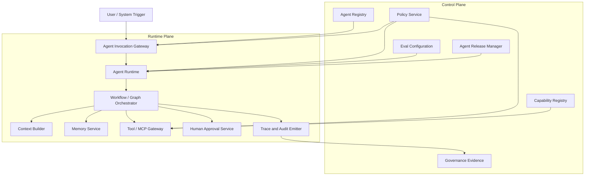
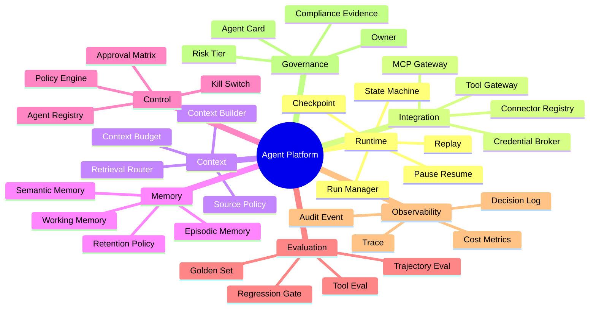
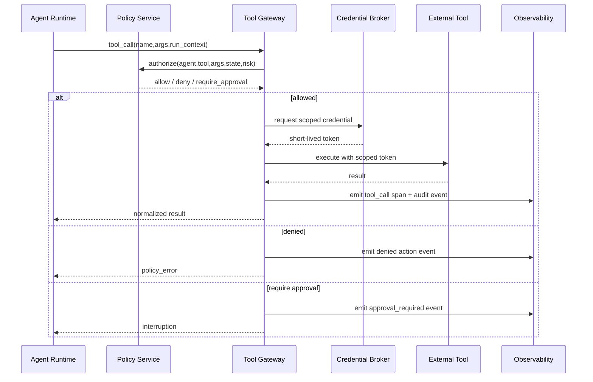
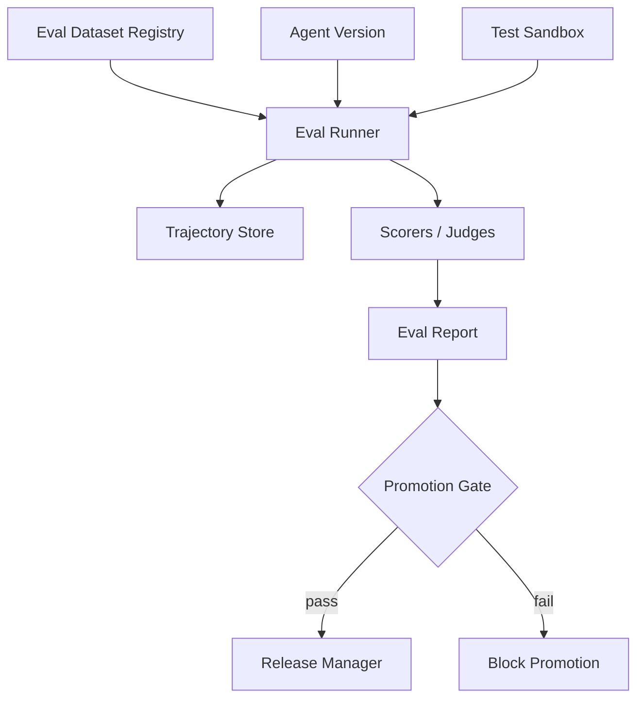
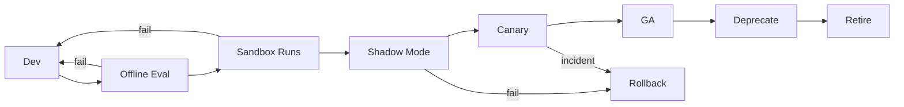
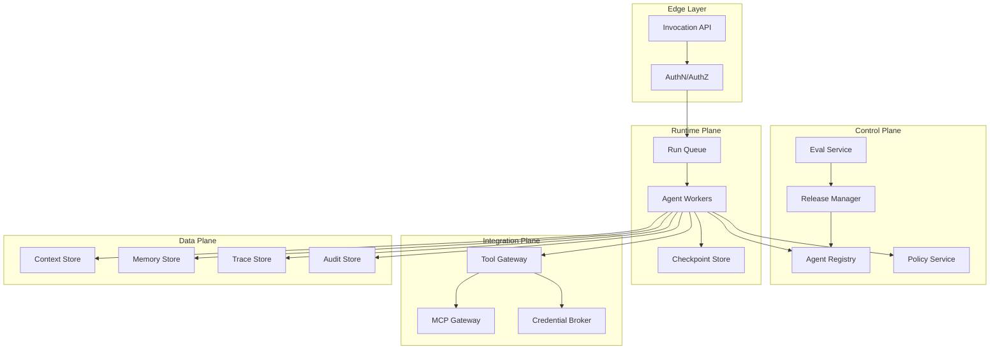
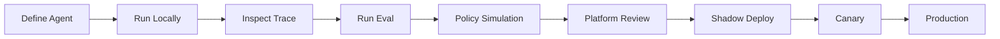

------
title: Learn Advanced Agentic AI Engineering & Autonomous Software Engineering - Part 033
description: Agent platform architecture for production-grade agentic AI systems: control plane, data plane, runtime orchestration, tool gateway, MCP gateway, memory service, eval service, policy service, observability, tenant isolation, and platform operating boundaries.
series: learn-agentic-ai-engineering
seriesTitle: Learn Advanced Agentic AI Engineering & Autonomous Software Engineering
order: 33
partTitle: Agent Platform Architecture
tags:
- agentic-ai
- autonomous-software-engineering
- platform-architecture
- agent-runtime
- control-plane
- mcp
- observability
- governance
- series
date: 2026-06-29
---

# Part 033 — Agent Platform Architecture

> Target part ini: mampu mendesain **agent platform** untuk organisasi engineering nyata: multi-tenant, policy-controlled, observable, evaluable, secure, and operable. Fokusnya bukan membuat satu agent demo, tetapi membangun platform tempat banyak agent dapat dibuat, dijalankan, diawasi, dibatasi, dan ditingkatkan secara sistematis.

Part 032 membahas governance, risk, dan compliance.

Sekarang kita masuk ke bentuk konkret dari governance dan runtime dalam arsitektur platform.

Pertanyaan utamanya:

> Jika organisasi memiliki puluhan atau ratusan agent, bagaimana semua agent itu dijalankan tanpa berubah menjadi kumpulan bot liar yang sulit diaudit?

Jawaban engineering-nya adalah **agent platform**.

Agent platform bukan sekadar wrapper API ke model.

Agent platform adalah **control plane + runtime plane + integration plane + evidence plane** untuk agentic systems.

OpenAI Agents SDK mendeskripsikan agent sebagai aplikasi yang bisa plan, call tools, collaborate across specialists, dan menyimpan state yang cukup untuk menyelesaikan multi-step work. SDK-nya juga menyediakan konsep tools, handoffs, guardrails, sessions, dan tracing.  
Reference: https://developers.openai.com/api/docs/guides/agents

LangGraph menekankan durable execution, persistence, human-in-the-loop, dan kemampuan agent untuk resume dari failure.  
Reference: https://docs.langchain.com/oss/python/langgraph/overview

MCP specification mendefinisikan cara standard agar aplikasi AI terhubung ke tools/data/context melalui resources, prompts, tools, dan capabilities.  
Reference: https://modelcontextprotocol.io/specification/2025-03-26

Gabungan ketiganya memberi mental model penting:

- **agent runtime** mengeksekusi task,
- **orchestrator** mengelola state dan transisi,
- **tool/MCP gateway** menghubungkan agent ke dunia luar,
- **policy engine** menentukan apa yang boleh dilakukan,
- **memory/context service** menentukan apa yang diketahui agent,
- **eval service** menentukan apakah agent masih layak dipercaya,
- **observability service** merekonstruksi apa yang terjadi,
- **governance service** membuktikan siapa bertanggung jawab atas apa.

---

## 1. Hubungan dengan Framework Kaufman

Dalam kerangka Kaufman, kita tidak belajar platform architecture dengan menghafal vendor/framework.

Kita pecah skill menjadi subskill operasional:

1. membedakan agent app vs agent platform,
2. memisahkan control plane dan data plane,
3. mendesain runtime execution boundary,
4. mendesain agent registry,
5. mendesain tool gateway dan MCP gateway,
6. mendesain policy enforcement point,
7. mendesain memory/context service,
8. mendesain eval service,
9. mendesain observability dan audit event,
10. mendesain tenant isolation,
11. mendesain deployment topology,
12. mendesain rollout dan kill switch,
13. mendesain developer experience,
14. membuat maturity model platform.

Target 20 jam pertama untuk part ini bukan membangun platform lengkap.

Target realistis:

> Dalam 20 jam, Anda mampu menggambar blueprint agent platform, menjelaskan batas setiap service, mendefinisikan minimal viable platform, dan mengidentifikasi failure mode utama sebelum menulis banyak kode.

---

## 2. Agent App vs Agent Platform

Banyak tim mulai dari agent app.

Agent app biasanya memiliki bentuk:

- satu prompt besar,
- beberapa tools,
- satu model provider,
- sedikit logging,
- konfigurasi hardcoded,
- permission berbasis environment variable,
- evaluasi manual,
- approval informal,
- deployment seperti service biasa.

Itu cukup untuk eksperimen.

Tidak cukup untuk production portfolio.

Agent platform berbeda.

| Dimensi | Agent App | Agent Platform |
|---|---|---|
| Scope | Satu use case | Banyak use case |
| Ownership | Tim aplikasi | Platform + app owner + risk owner |
| Runtime | Embedded loop | Standardized runtime/orchestrator |
| Tools | Langsung dipanggil agent | Lewat gateway/policy |
| Memory | Local/ad-hoc | Managed memory service |
| Evaluation | Manual/prompt test | Eval harness + regression gate |
| Observability | Logs umum | Trace, decision log, tool-call telemetry, audit trail |
| Governance | Dokumen manual | Registry, risk tier, owner, approval matrix |
| Security | API keys per service | Scoped credentials, identity, least privilege |
| Operability | Debug manual | Replay, pause/resume, kill switch, SLO |

Mental model penting:

> Agent app menjawab “bisakah agent melakukan task?” Agent platform menjawab “bisakah organisasi menjalankan banyak agent secara aman, terukur, dan bertanggung jawab?”

---

## 3. Core Architecture: Control Plane and Runtime Plane

Arsitektur production-grade perlu memisahkan dua hal:

1. **Control plane**: konfigurasi, registry, policy, deployment, governance, eval rules.
2. **Runtime/data plane**: execution run, tool call, context retrieval, memory access, trace emission.



Prinsipnya:

- runtime tidak boleh menentukan sendiri authority-nya,
- tool gateway tidak boleh percaya request hanya karena berasal dari agent,
- context builder tidak boleh mengambil semua data yang tersedia,
- memory service tidak boleh menulis fakta baru tanpa provenance,
- eval service tidak boleh menjadi dekorasi CI saja,
- audit trail harus dihasilkan dari event runtime, bukan disusun manual setelah insiden.

---

## 4. Platform Capability Map

Agent platform minimal harus memiliki capability berikut.



Jangan membangun semuanya sekaligus.

Tetapi jangan juga membangun agent tanpa tahu di mana capability tersebut akan tinggal.

---

## 5. Agent Registry

Agent registry adalah inventory resmi semua agent.

Tanpa registry, organisasi tidak tahu:

- agent apa saja yang hidup,
- siapa owner-nya,
- model apa yang dipakai,
- tools apa yang bisa dipanggil,
- data apa yang bisa diakses,
- risk tier-nya apa,
- apakah masih dievaluasi,
- apakah punya approval gate,
- apakah punya incident history,
- apakah masih aktif atau sudah deprecated.

Minimal schema:

```yaml
agent_id: swe.issue_resolver.v1
name: SWE Issue Resolver
owner_team: engineering-platform
business_owner: head-of-engineering
risk_tier: high
status: active
runtime_profile: bounded_agent_loop
model_policy:
  allowed_models:
    - gpt-5.5-thinking
    - claude-sonnet-family
  fallback_model: none
capabilities:
  - repo.read
  - branch.write
  - test.run
  - pr.create
forbidden_capabilities:
  - main.merge
  - prod.deploy
  - secret.read.raw
data_classes:
  - internal_code
  - ci_logs
approval_policy:
  pr_create: optional
  dependency_change: required
  security_sensitive_file: required
  production_change: forbidden
eval_suite:
  - swe_regression_localization
  - patch_minimality
  - tool_policy_compliance
observability:
  trace_required: true
  content_logging: redacted
  audit_retention_days: 365
```

Registry harus menjadi sumber kebenaran bagi runtime.

Jika agent tidak terdaftar, runtime menolak eksekusi.

Jika capability tidak terdaftar, tool gateway menolak call.

Jika risk tier berubah, approval dan eval gate ikut berubah.

---

## 6. Agent Definition Contract

Platform butuh format deklaratif untuk mendefinisikan agent.

Contoh:

```yaml
apiVersion: agents.platform/v1
kind: Agent
metadata:
  id: pr-reviewer.security.v2
  name: Security PR Reviewer
  owner: appsec
spec:
  purpose: Review pull requests for security-sensitive changes and produce actionable findings.
  autonomy:
    level: advisory
    max_iterations: 8
    max_wall_clock_minutes: 15
  instructions_ref: prompts/security-pr-reviewer@2.3.1
  runtime:
    type: graph
    graph_ref: graphs/pr-review@1.8.0
  tools:
    allowed:
      - github.pr.read
      - github.diff.read
      - repo.symbol_search
      - semgrep.run
      - dependency_advisory.search
    denied:
      - github.pr.merge
      - github.branch.write
  context:
    max_input_tokens: 80000
    required_sources:
      - pr_diff
      - changed_files
      - security_policy
    optional_sources:
      - ownership
      - recent_incidents
  memory:
    read_scopes:
      - org.security_guidelines
      - appsec.review_patterns
    write_scopes:
      - appsec.finding_feedback
  guardrails:
    output_schema: schemas/pr_security_review@1
    min_evidence_for_finding: 2
    block_on_secret_exposure: true
  evaluation:
    suite: evals/security_pr_review@latest
    min_score: 0.82
```

Kontrak ini membuat agent dapat:

- direview sebelum deploy,
- dipromote antar environment,
- dibandingkan antar versi,
- dirollback,
- dievaluasi otomatis,
- diaudit.

Tanpa agent definition contract, platform akan menjadi kumpulan konfigurasi tersembunyi di kode aplikasi.

---

## 7. Runtime Service

Runtime service bertanggung jawab menjalankan agent.

Tugas utamanya:

1. menerima run request,
2. memvalidasi agent registration,
3. membuat run id dan correlation id,
4. memuat policy dan capability,
5. membuat initial state,
6. membangun context awal,
7. memanggil model,
8. memproses structured decision,
9. memanggil tool gateway jika perlu,
10. checkpoint setelah step penting,
11. pause saat butuh approval,
12. terminate saat sukses/gagal/timeout,
13. emit trace dan audit event.

State minimal:

```json
{
  "run_id": "run_01JZ...",
  "agent_id": "swe.issue_resolver.v1",
  "tenant_id": "engineering",
  "user_id": "u_123",
  "status": "RUNNING",
  "goal": "Fix issue #8421",
  "risk_tier": "high",
  "iteration": 4,
  "budget": {
    "max_iterations": 20,
    "max_tool_calls": 50,
    "max_cost_usd": 5.0,
    "deadline": "2026-06-29T07:30:00+07:00"
  },
  "current_state": "VERIFY_PATCH",
  "pending_approval": null,
  "last_checkpoint_id": "chk_abc",
  "terminal_reason": null
}
```

Runtime invariant:

> No model output becomes action until runtime validates it against schema, policy, state, and capability.

---

## 8. Orchestration Layer

Tidak semua agent perlu orchestration graph.

Tetapi production agent biasanya butuh setidaknya explicit state transition.

Pilihan orchestration:

| Type | Kapan Dipakai | Risiko |
|---|---|---|
| Simple function call | One-shot extraction/classification | Tidak cocok untuk multi-step |
| Prompt chain | Deterministic sequential reasoning | Brittle jika branching kompleks |
| Workflow engine | Business process predictable | Kurang fleksibel untuk exploration |
| Graph runtime | State, loop, branch, HITL | Butuh discipline state modeling |
| Open agent loop | Exploratory task | Risk tinggi, butuh budget dan guardrail |

Untuk platform, gunakan interface umum:

```text
RunInput -> State -> StepDecision -> ToolAction/Handoff/Respond/Pause -> State -> ... -> TerminalState
```

Jangan biarkan setiap tim menulis loop sendiri tanpa standard.

Standard loop memungkinkan:

- shared tracing,
- shared policy enforcement,
- shared retry handling,
- shared checkpointing,
- shared eval replay,
- shared incident diagnosis.

---

## 9. Tool Gateway

Tool gateway adalah enforcement point antara agent dan external systems.

Agent tidak boleh langsung memanggil GitHub, Jira, Slack, database, cloud API, atau internal service.

Tool gateway melakukan:

- schema validation,
- capability check,
- policy evaluation,
- credential injection,
- rate limiting,
- idempotency enforcement,
- argument normalization,
- output redaction,
- audit logging,
- approval trigger,
- sandbox routing,
- retry/timeout control.



Tool gateway principle:

> Tools are not functions. Tools are authority-bearing operations.

Karena itu desain tool harus mengikuti Part 007.

---

## 10. MCP Gateway

MCP membuat integrasi agent lebih reusable.

Tetapi enterprise tidak boleh membiarkan setiap agent langsung connect ke MCP server apa pun.

Bentuk yang lebih aman adalah **MCP gateway**.

MCP gateway berfungsi sebagai:

- registry MCP server,
- compatibility layer,
- allowlist/denylist,
- auth mediator,
- schema inspector,
- transport hardening,
- policy enforcement point,
- logging/audit layer,
- version pinning,
- server health monitor.

```mermaid
flowchart LR
    Agent[Agent Runtime] --> PlatformGW[Platform Tool Gateway]
    PlatformGW --> MCPGW[MCP Gateway]
    MCPGW --> S1[MCP Server: GitHub]
    MCPGW --> S2[MCP Server: Docs]
    MCPGW --> S3[MCP Server: DB Readonly]
    MCPGW --> S4[MCP Server: CI]

    Policy[Policy Service] --> PlatformGW
    Policy --> MCPGW
    Registry[MCP Server Registry] --> MCPGW
    Cred[Credential Broker] --> MCPGW
    Audit[Audit Log] <-- MCPGW
```

Risiko yang harus dikontrol:

- server palsu atau tidak terpercaya,
- prompt injection dari tool/resource description,
- schema yang terlalu luas,
- command execution via local transport,
- credential leakage,
- tool name collision,
- version drift,
- excessive tool exposure,
- output injection dari result.

MCP harus meningkatkan interoperability.

MCP tidak boleh menghapus trust boundary.

---

## 11. Context Service

Context service membangun input ke model.

Di platform besar, context builder harus menjadi service terpisah karena context adalah sumber risiko dan biaya.

Tanggung jawab:

- resolve task intent,
- retrieve relevant evidence,
- enforce data access policy,
- enforce context budget,
- rank sources,
- remove stale/low-trust context,
- redact secrets,
- include policy/instruction block,
- attach provenance,
- emit context trace.

Context packet harus eksplisit:

```json
{
  "context_packet_id": "ctx_123",
  "run_id": "run_456",
  "sources": [
    {
      "source_type": "github_pr_diff",
      "source_id": "pr_98.diff",
      "trust_level": "authoritative",
      "freshness": "2026-06-29T05:00:00+07:00",
      "tokens": 14230
    },
    {
      "source_type": "security_policy",
      "source_id": "policy/appsec-pr-review-v4",
      "trust_level": "policy",
      "freshness": "2026-06-01T00:00:00+07:00",
      "tokens": 3200
    }
  ],
  "excluded_sources": [
    {
      "source_id": "old_arch_doc_2019",
      "reason": "stale_superseded"
    }
  ]
}
```

Invariant:

> Agent answer must be reconstructable from context packet, tool results, memory reads, and model output.

---

## 12. Memory Service

Memory service mengelola state lintas run.

Jangan gabungkan semua memory ke vector database tunggal.

Pisahkan:

- **working memory**: state run saat ini,
- **episodic memory**: pengalaman run sebelumnya,
- **semantic memory**: fakta/domain knowledge,
- **procedural memory**: pattern/procedure yang dipelajari,
- **preference memory**: preferensi user/team,
- **audit memory**: immutable evidence.

Memory service harus menyediakan:

- namespace per tenant/agent/user,
- read/write policy,
- provenance,
- confidence,
- expiry/retention,
- deletion workflow,
- poisoning detection,
- review queue untuk high-impact memory,
- memory eval.

Contoh memory write contract:

```json
{
  "memory_type": "procedural",
  "namespace": "engineering-platform/swe-agent",
  "claim": "For service X, integration tests require local postgres profile before running mvn verify.",
  "evidence": [
    "run_abc/tool/test_output_7",
    "repo/service-x/README.md#local-testing"
  ],
  "confidence": 0.86,
  "created_by": "swe.issue_resolver.v1",
  "review_status": "pending",
  "retention_days": 180
}
```

Do not allow agent to silently write durable memory from a single unverified run.

---

## 13. Policy Service

Policy service menjawab pertanyaan:

> Given this agent, this user, this tenant, this task, this state, this tool, and this argument, is this action allowed?

Policy input:

- agent id,
- agent version,
- user identity,
- tenant,
- risk tier,
- task type,
- state,
- tool name,
- tool arguments,
- data classification,
- current environment,
- approval history,
- eval status,
- incident status.

Policy output:

```json
{
  "decision": "require_approval",
  "reason": "Dependency file changed in high-risk repository",
  "approval_role": "repo_owner",
  "constraints": {
    "max_scope": "this_branch_only",
    "additional_evidence_required": ["test_report", "dependency_diff"]
  }
}
```

Policy sebaiknya tidak hanya hardcoded if-else di agent.

Gunakan policy-as-code jika aturan kompleks dan perlu direview.

Policy service bukan hanya security layer.

Policy service adalah **organizational authority compiler**.

---

## 14. Credential Broker

Agent tidak boleh memegang long-lived credentials.

Credential broker memberikan short-lived, scoped credentials berdasarkan policy decision.

Contoh:

- token read-only GitHub untuk repo tertentu,
- token branch-write hanya untuk branch agent,
- database read-only dengan row-level scope,
- cloud role dengan permission terbatas,
- temporary CI log access,
- signing permission hanya setelah approval.

Credential broker harus:

- tidak mengirim secret ke model,
- tidak menaruh secret di context,
- tidak menyimpan secret di memory,
- tidak log secret di trace,
- rotate automatically,
- support revocation,
- emit audit event.

Jika agent butuh secret untuk memanggil tool, tool gateway yang memakai secret, bukan model.

---

## 15. Evaluation Service

Evaluation service mengubah agent platform dari demo menjadi engineering system.

Tugasnya:

- menyimpan eval dataset,
- menjalankan offline eval,
- menjalankan trajectory eval,
- menjalankan tool-call eval,
- mengevaluasi output schema,
- mengevaluasi safety/policy compliance,
- mengevaluasi cost/latency,
- melakukan regression comparison antar versi agent,
- menjadi gate sebelum promote.

Eval architecture:



Jenis eval minimal:

| Eval Type | Pertanyaan |
|---|---|
| Task success eval | Apakah goal selesai? |
| Trajectory eval | Apakah langkahnya masuk akal dan efisien? |
| Tool-call eval | Apakah tool yang dipakai tepat dan aman? |
| Policy eval | Apakah agent mematuhi policy? |
| Context eval | Apakah context cukup, relevan, dan tidak bocor? |
| Safety eval | Apakah agent menolak instruksi berbahaya? |
| Regression eval | Apakah versi baru lebih buruk dari versi lama? |
| Cost eval | Apakah performa sebanding dengan biaya? |

Promotion rule contoh:

```yaml
promotion_gate:
  required:
    task_success_rate: ">= 0.82"
    policy_violation_rate: "== 0"
    critical_security_failure: "== 0"
    median_cost_usd: "<= 0.80"
    p95_latency_seconds: "<= 90"
  manual_review_required_if:
    - tool_set_changed
    - autonomy_level_increased
    - memory_write_enabled
    - production_tool_added
```

---

## 16. Observability and Evidence Plane

Agent observability harus bisa menjawab:

- apa goal run ini,
- siapa memicu,
- agent versi berapa,
- model apa,
- context apa,
- memory apa yang dibaca/ditulis,
- tool apa dipanggil,
- policy apa yang mengizinkan/menolak,
- approval siapa,
- output apa,
- terminal state apa,
- berapa biaya,
- apakah ada exception,
- apakah output diverifikasi,
- bagaimana mereplay run.

Trace hierarchy:

```text
agent.run
  agent.context.build
  agent.model.call
  agent.decision.parse
  agent.policy.evaluate
  agent.tool.call
  agent.memory.read
  agent.memory.write
  agent.approval.wait
  agent.verification.run
  agent.response.emit
```

Audit event berbeda dari trace.

Trace untuk debugging.

Audit event untuk evidence.

Audit event harus lebih stabil, terstruktur, dan immutable.

Contoh audit event:

```json
{
  "event_type": "TOOL_CALL_APPROVED",
  "event_time": "2026-06-29T05:45:00+07:00",
  "run_id": "run_123",
  "agent_id": "release.advisor.v1",
  "tool": "deployment.rollback.suggest",
  "risk_tier": "critical",
  "approved_by": "sre_lead@example.com",
  "policy_rule": "prod_change_requires_sre_approval",
  "evidence_refs": ["trace_span_88", "approval_packet_12"]
}
```

---

## 17. Release Manager for Agents

Agent adalah software artifact.

Agent perlu release lifecycle.

Artifact yang harus versioned:

- instructions/prompt,
- tool set,
- policy binding,
- graph/workflow definition,
- model config,
- context recipe,
- memory scopes,
- output schema,
- eval suite,
- safety rules,
- fallback behavior.

Release stages:

1. local development,
2. offline eval,
3. sandbox run,
4. shadow mode,
5. limited beta,
6. canary,
7. general availability,
8. deprecation,
9. retirement.



Never deploy a new agent version only because prompt output “looks better”.

Promote based on measured behavior.

---

## 18. Agent Invocation Gateway

Invocation gateway is the front door.

Responsibilities:

- authenticate caller,
- authorize agent invocation,
- enforce quota,
- attach tenant/user context,
- validate request schema,
- classify task risk,
- route to runtime cluster,
- create run id,
- apply rate limit,
- detect abuse,
- return run handle.

Request example:

```json
{
  "agent_id": "swe.issue_resolver.v1",
  "task": {
    "type": "github_issue",
    "repo": "org/service-a",
    "issue_number": 8421
  },
  "mode": "propose_patch",
  "requested_by": "dev@example.com",
  "constraints": {
    "no_dependency_upgrade": true,
    "max_files_changed": 5
  }
}
```

Gateway should reject:

- unknown agent,
- inactive agent,
- unauthorized user,
- task type outside agent scope,
- missing risk classification,
- agent version failing required eval,
- tenant exceeding quota,
- active incident lockdown.

---

## 19. Tenant Isolation

Multi-tenant platform membutuhkan isolation.

Tenant bisa berarti:

- business unit,
- product group,
- customer environment,
- regulated domain,
- repository namespace,
- data classification domain.

Isolation dimensions:

| Dimension | Control |
|---|---|
| Identity | tenant-scoped principals |
| Data | row/document/resource-level policy |
| Memory | namespace isolation |
| Tools | tenant-specific tool allowlist |
| Credentials | tenant-scoped secrets and roles |
| Logs | redaction + access control |
| Eval data | tenant-aware datasets |
| Runtime | resource quotas and scheduling |
| Cost | budget attribution |

Dangerous failure:

> Agent in tenant A retrieves memory, logs, tool result, or credential intended for tenant B.

This is not just a bug.

This is a governance incident.

---

## 20. Deployment Topology

Common topology:



Architectural decision:

- Keep runtime workers stateless where possible.
- Persist state in checkpoint store.
- Never rely on in-memory loop for long-running tasks.
- Separate audit store from application log store.
- Make policy decisions explicit and logged.
- Make tool calls brokered, not direct.

---

## 21. Storage Architecture

Agent platform needs several stores.

| Store | Purpose | Requirements |
|---|---|---|
| Agent registry store | agent definitions/versioning | strong consistency preferred |
| Checkpoint store | run state | durable, replayable |
| Trace store | debugging/observability | high volume, searchable |
| Audit store | compliance evidence | immutable/worm-like, retention |
| Context store | context packets | provenance, redaction |
| Memory store | durable memory | namespace, TTL, review |
| Eval store | datasets/results | versioned, comparable |
| Artifact store | patches/reports/outputs | content-addressed useful |
| Secret store | credentials | external managed secret system |

Do not overload vector database as universal persistence.

Vector DB is retrieval infrastructure.

It is not audit log, state machine store, policy database, or source of truth.

---

## 22. Platform API Surface

A usable platform needs APIs for humans, services, and automation.

Minimal API groups:

```text
POST   /agents/{agent_id}/runs
GET    /runs/{run_id}
POST   /runs/{run_id}/cancel
POST   /runs/{run_id}/resume
POST   /runs/{run_id}/approve
GET    /runs/{run_id}/trace
GET    /runs/{run_id}/audit
GET    /agents
POST   /agents
PUT    /agents/{agent_id}/versions/{version}
POST   /agents/{agent_id}/versions/{version}/promote
POST   /evals/run
GET    /evals/{eval_run_id}
GET    /tools
POST   /tools/register
GET    /policy/decisions/{decision_id}
```

API design principle:

> Every high-impact runtime event should have a stable read API for debugging, review, and audit.

---

## 23. Developer Experience

A platform ignored by developers will be bypassed.

Good DX includes:

- local agent runner,
- sandbox tools,
- typed tool schema generator,
- prompt/instruction versioning,
- test harness,
- eval runner,
- trace viewer,
- replay viewer,
- policy simulator,
- approval simulator,
- context inspector,
- cost estimator,
- deployment checklist,
- templates for common agent types.

Developer workflow:



Platform team should reduce friction for safe behavior.

If unsafe shortcut is easier than safe path, unsafe path will win.

---

## 24. Agent Templates

Useful platform templates:

1. **Advisory agent**: reads context and gives recommendation.
2. **Reviewer agent**: evaluates artifact and produces findings.
3. **Operator agent**: proposes operational action with approval.
4. **Coding agent**: creates patch in sandbox branch.
5. **Migration agent**: transforms code with recipe + LLM assistance.
6. **Triage agent**: classifies and routes tasks.
7. **Research agent**: gathers and summarizes evidence.
8. **Monitoring agent**: watches condition and alerts.

Each template should predefine:

- default runtime loop,
- allowed autonomy level,
- default tools,
- default evals,
- default policy gates,
- default observability,
- default output schema.

This reduces design drift.

---

## 25. Cost and Capacity Model

Agent platform must treat cost as first-class.

Cost sources:

- model input tokens,
- model output tokens,
- reasoning/compute tokens if applicable,
- retrieval calls,
- tool calls,
- sandbox compute,
- browser sessions,
- trace storage,
- eval runs,
- human review time,
- failed/retried runs.

Budget controls:

```yaml
budget_policy:
  per_run:
    max_usd: 3.00
    max_model_calls: 20
    max_tool_calls: 40
    max_wall_clock_minutes: 20
  per_agent_daily:
    max_usd: 500
  per_tenant_daily:
    max_usd: 2000
  require_approval_if:
    estimated_cost_usd: "> 10"
```

Metrics:

- cost per successful task,
- cost per avoided human hour,
- cost per reviewed PR,
- cost per resolved issue,
- cost per false positive avoided,
- retry cost,
- eval cost,
- incident cost.

Cheap wrong automation is expensive.

Expensive reliable automation may still be valuable.

---

## 26. Model Routing and Provider Abstraction

Platform should abstract model provider, but not hide model behavior.

Model router can consider:

- task type,
- latency requirement,
- cost budget,
- context length,
- tool-use capability,
- structured output reliability,
- security requirement,
- data residency,
- eval performance,
- fallback rules.

Bad abstraction:

```text
callLLM(prompt) -> string
```

Better abstraction:

```text
model.generate(
  task_type,
  messages,
  tools,
  output_schema,
  reasoning_budget,
  safety_profile,
  trace_context
) -> ModelDecision
```

Do not assume all models are interchangeable.

Evaluate agent behavior per model.

---

## 27. Runtime Safety Invariants

Platform-level invariants:

1. Unknown agent cannot run.
2. Inactive agent cannot run.
3. Agent cannot call unregistered tool.
4. Agent cannot receive raw secret.
5. Agent cannot write durable memory without policy.
6. Agent cannot execute irreversible action without approval if policy requires it.
7. Agent cannot exceed loop budget.
8. Agent cannot continue after kill switch.
9. Tool output must be treated as untrusted input.
10. Every high-impact action must emit audit event.
11. Every production agent version must have eval baseline.
12. Every run must have terminal state.

These invariants should be tested.

Not documented only.

---

## 28. Reference Architecture for Autonomous SWE Platform

```mermaid
flowchart TD
    Issue[GitHub Issue / Jira Ticket] --> Intake[Intake Agent]
    Intake --> Risk[Risk Classifier]
    Risk --> RepoMap[Repository Mapper]
    RepoMap --> Plan[Patch Planner]
    Plan --> Sandbox[Sandboxed Coding Worker]
    Sandbox --> Test[Test Runner]
    Test --> Verify[Verifier]
    Verify --> Review[PR Review Agent]
    Review --> Evidence[Evidence Packet]
    Evidence --> PR[Create Draft PR]

    Policy[Policy Service] --> Risk
    Policy --> Sandbox
    Policy --> PR
    ToolGW[Tool Gateway] --> RepoMap
    ToolGW --> Sandbox
    ToolGW --> Test
    Memory[Memory Service] --> RepoMap
    Trace[Trace Store] <-- Intake
    Trace <-- Sandbox
    Audit[Audit Store] <-- PR
```

Important boundary:

- issue resolver may create draft PR,
- reviewer may comment,
- release agent may recommend deploy,
- no agent merges to main without explicit policy and approval,
- no agent deploys production without deployment gate.

---

## 29. Minimal Viable Agent Platform

Untuk organisasi yang baru mulai, MVP platform dapat berisi:

1. agent registry,
2. invocation gateway,
3. shared runtime loop,
4. tool gateway,
5. basic policy engine,
6. trace storage,
7. audit events untuk high-impact actions,
8. eval runner sederhana,
9. approval service,
10. sandbox execution profile.

Do not start with:

- huge multi-agent framework,
- dozens of MCP servers,
- universal memory,
- autonomous production deployment,
- self-improving agent,
- unrestricted browser/computer use.

Start with high-control, high-learning, low-blast-radius use cases:

- PR summarizer,
- test failure triage,
- release note drafter,
- read-only incident assistant,
- draft PR reviewer,
- issue classifier,
- repo map generator.

---

## 30. Platform Maturity Model

| Level | Description | Typical Capability |
|---|---|---|
| 0 | Ad-hoc agent scripts | no registry, no eval, no policy |
| 1 | Standard wrappers | shared SDK, basic logging |
| 2 | Managed runtime | registry, tool gateway, trace |
| 3 | Governed platform | policy, approval, audit, eval gates |
| 4 | Scaled platform | multi-tenant, cost control, templates, canary |
| 5 | Continuous assurance | online eval, drift detection, automated rollback, governance evidence |

Most organizations should aim for Level 3 before enabling high-autonomy agents.

---

## 31. Common Platform Failure Modes

### 31.1 Platform as thin LLM proxy

Symptom:

- many teams call same gateway,
- but gateway only forwards prompts to model.

Failure:

- no policy,
- no tool control,
- no eval,
- no replay,
- no governance.

Fix:

- make platform responsible for runs, tools, trace, policy, and eval.

### 31.2 Tool gateway bypass

Symptom:

- app teams pass credentials directly into agent code.

Failure:

- no central audit,
- inconsistent permissions,
- secret leakage risk.

Fix:

- block direct tool credentials; route through gateway.

### 31.3 Universal agent template

Symptom:

- one generic agent handles everything.

Failure:

- unclear authority,
- weak eval,
- broad tools,
- high risk.

Fix:

- specialize agents by task and risk profile.

### 31.4 Observability afterthought

Symptom:

- only final answer is logged.

Failure:

- cannot reconstruct bad decision.

Fix:

- trace every decision/tool/policy/context event.

### 31.5 Eval theater

Symptom:

- eval exists but does not gate release.

Failure:

- regressions reach production.

Fix:

- make eval required for promotion.

---

## 32. Engineering Review Checklist

Sebelum agent platform dianggap production-ready, jawab pertanyaan ini:

### Registry

- Apakah semua agent terdaftar?
- Apakah setiap agent punya owner?
- Apakah setiap agent punya risk tier?
- Apakah versi agent immutable?

### Runtime

- Apakah run punya durable state?
- Apakah setiap run punya terminal state?
- Apakah ada loop budget?
- Apakah run bisa dicancel?
- Apakah run bisa direplay?

### Tools

- Apakah semua tool dipanggil lewat gateway?
- Apakah tool punya schema?
- Apakah tool punya idempotency key untuk write action?
- Apakah tool result diperlakukan sebagai untrusted?

### Policy

- Apakah policy dievaluasi sebelum action?
- Apakah policy decision dilog?
- Apakah approval gate bisa pause/resume?
- Apakah ada kill switch?

### Context and Memory

- Apakah context packet punya provenance?
- Apakah data access policy ditegakkan?
- Apakah memory write direview sesuai risiko?
- Apakah memory punya retention?

### Evaluation

- Apakah agent punya baseline eval?
- Apakah eval gate mencegah regression?
- Apakah eval meliputi tool/policy/safety?

### Observability

- Apakah trace cukup untuk debugging?
- Apakah audit event cukup untuk compliance?
- Apakah sensitive data direduksi?

---

## 33. Deliberate Practice

Latihan 1 — Platform decomposition:

Ambil satu agent yang sudah pernah Anda bayangkan, misalnya PR reviewer atau issue resolver.

Pisahkan komponennya menjadi:

- runtime,
- tools,
- policy,
- context,
- memory,
- eval,
- observability,
- governance.

Latihan 2 — Agent definition:

Tulis `Agent` YAML untuk agent tersebut.

Wajib memiliki:

- purpose,
- autonomy,
- allowed tools,
- denied tools,
- context sources,
- memory scopes,
- approval policy,
- eval suite,
- trace policy.

Latihan 3 — Runtime invariant test:

Pilih 5 invariant dari bagian 27.

Tulis test scenario:

- input,
- expected platform decision,
- audit event,
- failure behavior.

Latihan 4 — MVP platform:

Desain MVP platform 90 hari untuk organisasi Anda.

Batasi hanya 3 use case pertama.

Definisikan:

- scope,
- excluded scope,
- platform components,
- team ownership,
- risk gate,
- success metric.

---

## 34. Ringkasan Mental Model

Agent platform adalah jawaban terhadap masalah skala dan tanggung jawab.

Tanpa platform, agent menjadi script.

Dengan platform yang buruk, agent menjadi risiko tersembunyi.

Dengan platform yang baik, agent menjadi capability organisasi yang bisa:

- diulang,
- diukur,
- dikontrol,
- diaudit,
- ditingkatkan,
- dihentikan bila perlu.

Formula praktis:

```text
Agent Platform
= Agent Registry
+ Runtime Orchestration
+ Tool/MCP Gateway
+ Context/Memory Service
+ Policy/Identity
+ Eval Harness
+ Observability/Audit
+ Release Governance
+ Developer Experience
```

Prinsip final:

> The platform should make safe agent development easier than unsafe agent development.

Part berikutnya akan membahas operating model enterprise: bagaimana organisasi mengadopsi agentic engineering tanpa menciptakan chaos proses, ownership, compliance, dan ekspektasi yang tidak realistis.

---

## References

- OpenAI Agents SDK: https://developers.openai.com/api/docs/guides/agents
- OpenAI Agents SDK Tracing: https://openai.github.io/openai-agents-python/tracing/
- OpenAI Agents SDK Handoffs: https://openai.github.io/openai-agents-python/handoffs/
- LangGraph Overview: https://docs.langchain.com/oss/python/langgraph/overview
- LangGraph Durable Execution: https://docs.langchain.com/oss/python/langgraph/durable-execution
- Model Context Protocol Specification: https://modelcontextprotocol.io/specification/2025-03-26
- NIST AI Risk Management Framework: https://www.nist.gov/itl/ai-risk-management-framework
- OWASP Top 10 for LLM Applications: https://owasp.org/www-project-top-10-for-large-language-model-applications/
