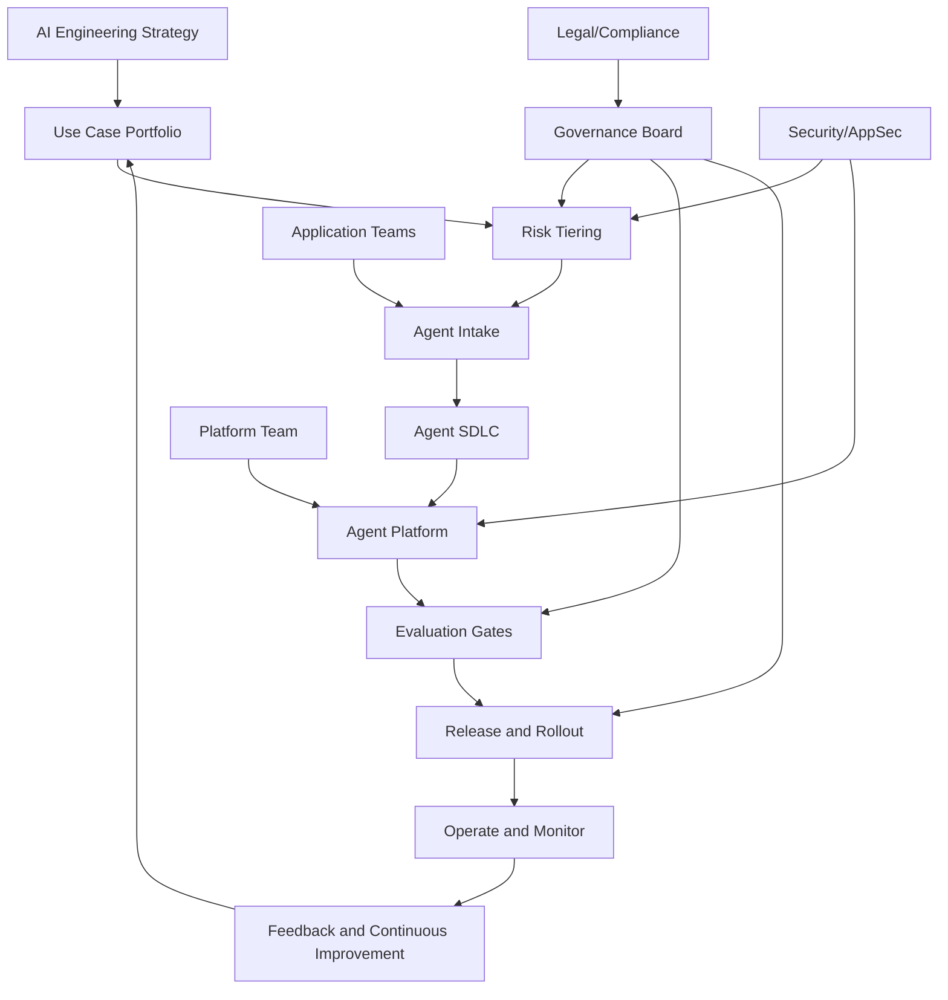
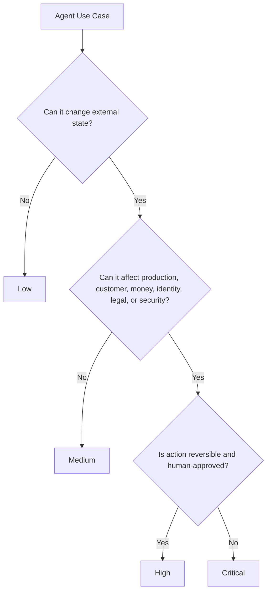
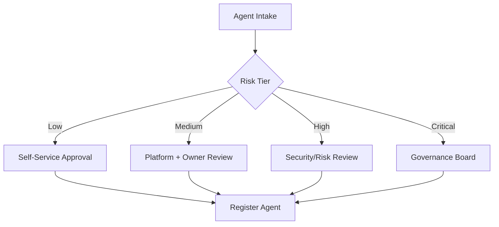
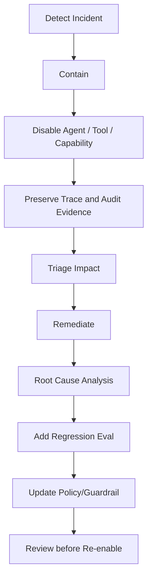
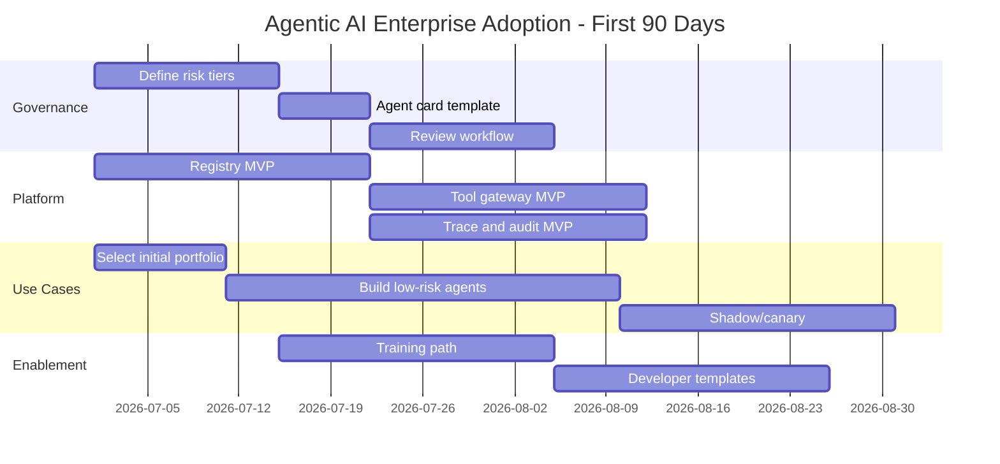

------
title: Learn Advanced Agentic AI Engineering & Autonomous Software Engineering - Part 034
description: Enterprise adoption and operating model for agentic AI engineering: agent SDLC, ownership, center of excellence, governance board, adoption roadmap, platform team responsibilities, risk tiering, enablement, rollout strategy, metrics, funding, and organizational change.
series: learn-agentic-ai-engineering
seriesTitle: Learn Advanced Agentic AI Engineering & Autonomous Software Engineering
order: 34
partTitle: Enterprise Adoption and Operating Model
tags:
- agentic-ai
- autonomous-software-engineering
- enterprise-architecture
- operating-model
- ai-governance
- agent-sdlc
- platform-engineering
- adoption
- series
date: 2026-06-29
---

# Part 034 — Enterprise Adoption and Operating Model

> Target part ini: mampu mendesain **operating model enterprise** untuk agentic AI engineering: siapa owner-nya, bagaimana agent masuk SDLC, kapan agent boleh dipakai, siapa yang approve, bagaimana risk diklasifikasi, bagaimana platform team bekerja, bagaimana adoption diukur, dan bagaimana mencegah agentic AI menjadi kumpulan eksperimen tanpa accountability.

Part 033 membahas agent platform architecture.

Platform tanpa operating model akan gagal secara sosial, proses, dan governance.

Operating model tanpa platform akan menjadi dokumen yang sulit ditegakkan.

Keduanya harus berjalan bersama.

Pertanyaan utama:

> Bagaimana organisasi mengadopsi agentic AI engineering secara cepat, tetapi tetap aman, terukur, dan defensible?

Jawaban singkat:

> Jangan mulai dari “semua orang pakai agent untuk semua hal”. Mulai dari controlled adoption: use-case portfolio, risk tiering, platform guardrails, agent SDLC, eval gates, ownership, enablement, dan continuous assurance.

NIST AI RMF menekankan trustworthiness considerations sepanjang design, development, use, dan evaluation AI systems.  
Reference: https://www.nist.gov/itl/ai-risk-management-framework

OWASP Top 10 for LLM Applications dan OWASP Agentic AI guidance membantu memetakan risiko teknis seperti prompt injection, sensitive information disclosure, excessive agency, insecure plugin/tool design, dan unbounded consumption.  
Reference: https://owasp.org/www-project-top-10-for-large-language-model-applications/

Anthropic menyarankan membangun agent secara sederhana dan komposable, serta membedakan workflow yang predictable dari agent yang lebih dynamic.  
Reference: https://www.anthropic.com/research/building-effective-agents

Prinsip operating model:

> Scale autonomy only after scaling control, evaluation, and ownership.

---

## 1. Hubungan dengan Framework Kaufman

Dalam kerangka Kaufman, enterprise adoption terlalu besar jika dipelajari sebagai “transformasi AI”.

Kita pecah menjadi subskill:

1. mengidentifikasi use case agentic yang layak,
2. membuat risk-tier model,
3. mendefinisikan agent SDLC,
4. mendefinisikan ownership dan RACI,
5. membentuk platform team dan enablement model,
6. membentuk review/governance board yang tidak lambat,
7. membuat intake process,
8. membuat approval and release gate,
9. membuat metrics adoption,
10. membuat incident and rollback process,
11. mengelola vendor/model/tool risk,
12. membuat training path untuk engineer,
13. membangun maturity roadmap 30/60/90/180 hari.

Target 20 jam pertama:

> Anda mampu membuat operating model proposal untuk organisasi engineering: use-case portfolio awal, risk classification, agent SDLC, platform ownership, review gate, metrics, dan roadmap 90 hari.

---

## 2. Why Enterprise Agent Adoption Fails

Adoption agentic AI sering gagal bukan karena model kurang pintar.

Sering gagal karena organisasi mengabaikan sistem di sekitarnya.

Failure modes:

1. **Tool-first adoption**: membeli framework/tool sebelum use case dan risk model jelas.
2. **Prompt anarchy**: setiap tim punya prompt dan tool sendiri tanpa registry.
3. **No owner**: agent berjalan, tetapi tidak ada owner yang accountable.
4. **No eval**: keberhasilan dinilai dari demo, bukan regression suite.
5. **No permission model**: agent diberi credential seperti human admin.
6. **No audit**: organisasi tidak bisa menjelaskan apa yang agent lakukan.
7. **No adoption metrics**: tidak tahu apakah agent menghasilkan value atau noise.
8. **No change management**: engineer menolak atau salah pakai karena tidak percaya.
9. **No incident model**: ketika agent salah, tidak ada playbook.
10. **Over-autonomy too early**: agent diberi write/prod access sebelum read-only use case matang.

Rule:

> Agentic AI adoption is not an AI rollout. It is a new software delivery and operational capability.

---

## 3. Enterprise Agent Operating System

Operating model dapat dibayangkan sebagai sistem berikut.



Komponen utama:

- strategy,
- portfolio,
- risk model,
- SDLC,
- platform,
- governance,
- enablement,
- operations,
- metrics,
- funding.

---

## 4. Use Case Portfolio

Jangan mulai dari “apa yang bisa dilakukan LLM?”

Mulai dari:

- pekerjaan berulang,
- evidence-rich,
- bounded outcome,
- low-to-medium blast radius,
- measurable success,
- tersedia feedback cepat,
- dapat dilakukan dalam sandbox,
- punya human review path.

### 4.1 Good early use cases

| Use Case | Why Good |
|---|---|
| PR summarization | read-only, low risk, high frequency |
| PR review draft | advisory, reviewer tetap manusia |
| test failure triage | evidence-rich, bounded |
| incident log summarization | useful under pressure, read-only |
| release note drafting | low blast radius |
| issue classification | measurable routing outcome |
| dependency upgrade proposal | can be sandboxed and reviewed |
| repo documentation generation | useful, reversible |

### 4.2 Riskier later use cases

| Use Case | Why Riskier |
|---|---|
| auto-merge PR | irreversible repository impact |
| production rollback | operational impact |
| database migration execution | data integrity risk |
| access provisioning | identity/security risk |
| customer communication | reputational/compliance risk |
| autonomous incident remediation | production safety risk |

The roadmap should move from advisory/read-only to write-with-review, then bounded autonomous action, then high-impact autonomy only if governance maturity supports it.

---

## 5. Risk Tiering Model

Agent risk tier determines required controls.



Example tier model:

| Tier | Description | Example | Required Controls |
|---|---|---|---|
| Low | read-only/advisory | PR summary | logging, basic eval |
| Medium | writes draft/non-prod artifact | draft PR, create ticket | tool gateway, trace, eval, owner |
| High | impacts code/release/security decision | dependency migration PR | approval, sandbox, audit, risk review |
| Critical | production/customer/legal/security action | prod rollback, access change | strict HITL, governance approval, incident playbook, continuous monitoring |

Risk tier should be attached to:

- agent,
- tool,
- task,
- data class,
- environment,
- user role.

Do not classify risk only once at project start.

Runtime can reclassify when task context changes.

---

## 6. Agent SDLC

Agent SDLC extends normal software SDLC.

```mermaid
flowchart LR
    Idea[Use Case Idea] --> Intake[Intake]
    Intake --> Risk[Risk Assessment]
    Risk --> Design[Agent Design]
    Design --> Build[Build]
    Build --> Eval[Offline Eval]
    Eval --> Security[Security Review]
    Security --> Shadow[Shadow Mode]
    Shadow --> Canary[Canary]
    Canary --> GA[Production]
    GA --> Monitor[Monitoring]
    Monitor --> Improve[Improve / Retire]
```



Each phase has artifacts.

| Phase | Required Artifact |
|---|---|
| Intake | use-case brief |
| Risk | risk classification |
| Design | agent card, architecture, tools, data flow |
| Build | agent definition, prompt/instructions, tool schema |
| Eval | eval report, regression comparison |
| Security | threat model, permission review |
| Shadow | shadow-run report |
| Canary | rollout metrics |
| GA | runbook, owner, SLO, incident path |
| Monitor | telemetry, drift, feedback |
| Retire | deprecation record |

Agent SDLC should integrate with existing SDLC, not replace it.

---

## 7. Agent Card

Agent card is the standard documentation artifact.

It should be short enough to maintain, complete enough to audit.

Template:

```yaml
agent_card:
  agent_id: pr-reviewer.security.v2
  owner_team: appsec
  business_owner: head-of-security
  purpose: Detect security-relevant risks in pull requests.
  users:
    - software_engineers
    - security_reviewers
  risk_tier: high
  autonomy_level: advisory
  allowed_actions:
    - read_pr
    - read_diff
    - run_static_analysis
    - write_review_comment_draft
  forbidden_actions:
    - approve_pr
    - merge_pr
    - change_branch
  data_access:
    - source_code_internal
    - security_policy_internal
  tools:
    - github.pr.read
    - repo.search
    - semgrep.run
  human_oversight:
    required_for:
      - posting_blocking_review
      - reporting_secret_exposure
  evals:
    baseline_suite: security_pr_review_v4
    last_eval_score: 0.87
  monitoring:
    trace_required: true
    feedback_required: true
  failure_modes:
    - false_positive_noise
    - missed_vulnerability
    - prompt_injection_from_diff
  escalation:
    primary: appsec-oncall
```

Agent card should be versioned with the agent.

---

## 8. Ownership Model

Agent ownership must be explicit.

RACI example:

| Activity | App Team | Platform Team | Security | Risk/Compliance | Business Owner |
|---|---|---|---|---|---|
| Use case proposal | R | C | C | C | A |
| Agent design | R | C | C | C | A |
| Platform runtime | C | R/A | C | C | I |
| Tool registration | C | R | A for sensitive tools | C | I |
| Risk tiering | R | C | C | A | A |
| Eval design | R | C | C | C | A |
| Production approval | R | C | C | A for regulated | A |
| Incident response | R | R | R | C | A |
| Retirement | R | C | C | C | A |

Definitions:

- **R**: Responsible, does the work.
- **A**: Accountable, owns final decision.
- **C**: Consulted.
- **I**: Informed.

Do not let platform team become owner of every agent’s business behavior.

Platform team owns platform controls.

App/business owner owns agent purpose and outcome.

Security/risk owns control adequacy.

---

## 9. Governance Board That Does Not Become a Bottleneck

A governance board is useful only if it is tiered and fast.

Bad governance:

- every agent needs monthly committee approval,
- unclear criteria,
- subjective debate,
- no templates,
- no SLA,
- no delegated authority.

Good governance:

- pre-approved patterns,
- risk-tiered review,
- clear checklist,
- delegated approval for low/medium risk,
- board review only for high/critical risk,
- evidence-based decisions,
- timeboxed review.

Review routing:



Board should define policies and exceptions, not micromanage every prompt.

---

## 10. Platform Team Responsibilities

Agent platform team owns reusable foundations.

Responsibilities:

- agent runtime,
- agent registry,
- tool gateway,
- MCP gateway,
- policy service integration,
- approval service,
- eval harness,
- trace/audit pipeline,
- sandbox profiles,
- templates,
- SDKs,
- developer portal,
- cost attribution,
- reliability of platform services.

Platform team should not own:

- all prompts,
- all business logic,
- all use case prioritization,
- all agent outputs,
- all compliance decisions,
- all adoption change management.

Platform team enables teams.

It does not become an AI ticket factory.

---

## 11. Center of Excellence vs Platform Team

Many enterprises create an AI Center of Excellence.

It can help or hurt.

Use separation:

| Function | Platform Team | AI/Agent CoE |
|---|---|---|
| Runtime and tools | owns | advises |
| Standards/templates | co-owns | co-owns |
| Use-case discovery | supports | leads |
| Training | supports | leads |
| Governance process | implements controls | coordinates |
| Model evaluation methods | implements harness | defines methodology |
| Community practice | participates | leads |
| Production operation | owns platform | not sole owner |

CoE should not become a centralized team that writes every agent.

Better model:

- CoE sets practice,
- platform team provides paved road,
- product teams build domain agents,
- risk/security validate controls.

---

## 12. Intake Process

Use-case intake should be lightweight but structured.

Intake questions:

1. What task will the agent perform?
2. Who is the user?
3. What decision/action does it influence?
4. What data does it need?
5. What tools/actions does it need?
6. Is output advisory or actioning?
7. What is the blast radius if wrong?
8. Is the action reversible?
9. Is there human review?
10. How will success be measured?
11. What baseline human process exists?
12. What eval data can be built?

Use-case brief:

```yaml
use_case:
  name: CI Failure Triage Agent
  sponsor: Engineering Productivity
  user_group: backend engineers
  problem: Engineers spend time reading CI logs and identifying likely cause.
  proposed_agent_behavior: Read failed checks, summarize root cause, suggest owner and next action.
  autonomy_level: advisory
  data_needed:
    - ci_logs
    - recent_commits
    - test_history
  tools_needed:
    - github.checks.read
    - ci.logs.read
    - repo.search
  output:
    - triage_summary
    - suspected_failure_category
    - suggested_owner
  success_metric:
    - reduced_time_to_triage
    - engineer_feedback_score
  initial_risk_tier: low
```

---

## 13. Adoption Roadmap

### 13.1 First 30 days

Goal: create control and learning loop.

Deliverables:

- define risk tier model,
- define agent card template,
- create initial registry,
- pick 3 low-risk use cases,
- create minimal eval harness,
- create trace requirement,
- define tool gateway MVP,
- define approval policy for write actions.

Do not enable high-autonomy production agents.

### 13.2 Days 31–60

Goal: prove repeatability.

Deliverables:

- launch read-only/advisory agents,
- collect user feedback,
- run offline evals,
- introduce sandboxed write actions,
- create developer templates,
- onboard first product teams,
- create governance review path,
- define incident playbook.

### 13.3 Days 61–90

Goal: move from experiments to managed platform.

Deliverables:

- canary one medium-risk coding/review agent,
- implement policy decision logs,
- implement approval service,
- add cost attribution,
- publish agent development guide,
- create community of practice,
- define deprecation process,
- prepare executive metrics.

### 13.4 90–180 days

Goal: scale with assurance.

Deliverables:

- production agent platform Level 3 maturity,
- multiple teams onboarded,
- eval gates required for promotion,
- online monitoring,
- rollback process,
- vendor/model risk process,
- high-risk agent review board,
- autonomous SWE pilot with draft PR only,
- continuous improvement loop.

---

## 14. Paved Road Strategy

Enterprise adoption succeeds when safe path is easy.

Paved road includes:

- approved agent templates,
- approved tool profiles,
- approved MCP servers,
- standard registry process,
- standard eval harness,
- default trace/audit setup,
- default sandbox,
- default approval flow,
- SDK with secure defaults,
- example agents,
- docs and training.

Unpaved road still exists for exceptions.

But exceptions require review.

Policy:

> Teams can move fast on the paved road. Teams can deviate, but deviation must be explicit and justified.

---

## 15. Metrics and Value Measurement

Measure both capability and risk.

### 15.1 Value metrics

- engineer hours saved,
- cycle time reduction,
- PR review latency reduction,
- mean time to triage reduction,
- incident summary time reduction,
- documentation freshness,
- successful issue resolution rate,
- reduced toil,
- adoption rate by team,
- user satisfaction.

### 15.2 Quality metrics

- task success rate,
- false positive rate,
- false negative rate,
- accepted suggestions,
- reverted agent changes,
- review override rate,
- hallucinated citation rate,
- invalid tool-call rate,
- flaky outcome rate.

### 15.3 Risk metrics

- policy violations,
- denied tool calls,
- approval escalations,
- secret exposure attempts,
- prompt injection detections,
- memory write rejection rate,
- sandbox escape attempts,
- high-risk incidents.

### 15.4 Cost metrics

- cost per successful task,
- cost per team,
- cost per agent,
- failed-run cost,
- eval cost,
- human-review cost,
- tool/sandbox compute cost.

Do not report only “number of agents launched”.

That rewards proliferation, not value.

---

## 16. Funding Model

Agent platform requires sustainable funding.

Possible models:

1. central platform funding,
2. chargeback/showback by usage,
3. strategic initiative funding,
4. hybrid base platform + team-specific usage,
5. product-aligned funding for high-value agents.

Recommended early model:

- central funding for core platform,
- showback for usage and cost transparency,
- business case required for high-cost/high-autonomy agents.

Avoid early chargeback that discourages experimentation before value model is clear.

But do not ignore cost.

---

## 17. Training Path for Engineers

Agentic AI training should not only teach prompt writing.

Training levels:

### Level 1 — User

- how to use approved agents,
- how to interpret output,
- how to give feedback,
- when not to trust agent,
- how to report incident.

### Level 2 — Agent Builder

- agent definition,
- tool schema,
- context design,
- eval design,
- trace debugging,
- risk tiering,
- approval pattern.

### Level 3 — Platform Engineer

- runtime architecture,
- tool gateway,
- policy engine,
- sandboxing,
- observability,
- multi-tenant isolation,
- cost control,
- incident response.

### Level 4 — Agent Architect

- portfolio design,
- multi-agent architecture,
- autonomous SWE workflow,
- enterprise governance,
- evaluation strategy,
- organizational rollout.

This series targets Level 3–4.

---

## 18. Change Management

Engineers may resist agents for good reasons.

Concerns:

- output quality,
- accountability,
- code ownership,
- job threat,
- review noise,
- security risk,
- workflow disruption,
- tool fatigue,
- unclear escalation.

Adoption pattern:

1. start with assistive/advisory agents,
2. let engineers inspect trace/evidence,
3. make feedback easy,
4. show accepted/rejected suggestions,
5. keep humans accountable,
6. avoid forced automation,
7. publish failure stories and fixes,
8. reward safe usage, not blind usage.

Trust is earned by behavior, not promised by slide decks.

---

## 19. Human Role Redesign

Agentic AI changes work distribution.

Human role moves from doing every step to:

- defining goal,
- setting constraints,
- reviewing evidence,
- approving high-impact actions,
- handling exceptions,
- improving evals,
- maintaining policy,
- designing better workflows.

For software engineering:

| Old Focus | New Focus |
|---|---|
| write every line | define intent and constraints |
| manually inspect all logs | review agent triage evidence |
| create repetitive boilerplate | verify semantic correctness |
| manually search repo | inspect repo map and risk surface |
| reactive review | design review rubric and evals |

This does not remove engineering judgment.

It raises the leverage of engineering judgment.

---

## 20. Incident Response for Agents

Agent incident categories:

- wrong output,
- unsafe tool call,
- unauthorized access,
- data leakage,
- excessive cost,
- infinite loop,
- bad memory write,
- prompt injection success,
- wrong code patch,
- wrong review approval,
- production action error.

Incident playbook:



Containment tools:

- kill switch,
- disable agent version,
- disable tool,
- revoke credentials,
- freeze memory writes,
- block tenant,
- force approval mode,
- rollback model config,
- reduce autonomy level.

Post-incident action must include eval update.

Otherwise the same failure can return.

---

## 21. Vendor and Model Risk Management

Enterprise operating model must manage provider risk.

Questions:

- Which model providers are approved?
- Which data can be sent to which provider?
- Is data used for training?
- What retention policy applies?
- What regions are supported?
- What happens if provider is down?
- How are model upgrades handled?
- How are regressions detected?
- What contractual/security requirements apply?
- What audit logs are available?

Model version changes are production changes.

Treat model upgrades like dependency upgrades:

- run eval,
- compare behavior,
- canary,
- monitor,
- rollback if degraded.

---

## 22. Tool and MCP Governance

Tool ecosystem risk grows faster than model risk.

Governance requirements:

- tool registry,
- tool owner,
- schema review,
- risk tier per tool,
- capability mapping,
- auth method,
- data classification,
- idempotency semantics,
- approval trigger,
- output handling,
- versioning,
- deprecation.

MCP server onboarding checklist:

- source trusted?
- transport secure?
- tool descriptions reviewed?
- resources classified?
- auth model clear?
- command execution controlled?
- server version pinned?
- logs/audit available?
- data egress understood?
- prompt injection risk mitigated?

Tool governance rule:

> A weak tool boundary can turn a safe model into an unsafe system.

---

## 23. Autonomous SWE Adoption Model

Autonomous SWE should be introduced gradually.

Stages:

| Stage | Capability | Human Control |
|---|---|---|
| 1 | explain code / summarize issue | full human action |
| 2 | suggest localization | human edits |
| 3 | draft patch in sandbox | human reviews patch |
| 4 | create draft PR | human reviews/merges |
| 5 | respond to review comments | human approves changes |
| 6 | low-risk automated PR updates | policy + human oversight |
| 7 | autonomous merge for narrow cases | strict policy, strong eval, rollback |

Do not jump to Stage 7.

Stage 3–4 already provides substantial value.

Autonomous SWE maturity requires:

- repo understanding,
- reproducible tests,
- sandbox,
- eval dataset,
- PR evidence packet,
- review agent,
- ownership mapping,
- rollback process,
- no direct production authority.

---

## 24. Agent Registry as Organizational Control

Registry is not just platform config.

It is organizational memory.

Registry should answer:

- which agents exist,
- who owns each,
- which are active,
- which are deprecated,
- which tools they can call,
- which data they access,
- which risk tier,
- which eval score,
- which incidents,
- which approvals,
- which cost,
- which business value.

Dashboard categories:

```text
Agents by status
Agents by risk tier
Agents by owner
Agents by tool exposure
Agents by data classification
Agents by eval health
Agents by incident count
Agents by cost
Agents by adoption
Agents pending review
```

No registry, no scale.

---

## 25. Communication Plan

Enterprise rollout needs clear communication.

Message to engineers:

- what agents are approved,
- what they can/cannot do,
- how to inspect output,
- how to report problems,
- how to build new agents,
- what policies apply,
- how feedback improves agents.

Message to leadership:

- value metrics,
- risk controls,
- adoption progress,
- cost transparency,
- incident posture,
- roadmap.

Message to risk/legal/security:

- governance artifacts,
- audit evidence,
- risk classification,
- human oversight,
- data handling,
- incident response.

Avoid hype language.

Use capability, control, and evidence language.

---

## 26. Decision Matrix: Build vs Buy

| Question | Prefer Build | Prefer Buy |
|---|---|---|
| Need deep internal workflow integration? | Yes | Maybe |
| Need regulated audit/evidence customization? | Often | Maybe enterprise vendor |
| Need fast commodity assistant? | No | Yes |
| Need autonomous SWE over private monorepo? | Often hybrid | Possibly |
| Need standard support/compliance package? | Maybe | Yes |
| Need full control over tool permission? | Yes | Depends |
| Team has platform capability? | Yes | If not, buy/partner |

Realistic answer is often hybrid:

- buy model/provider/coding assistant where useful,
- build governance/platform integration around it,
- standardize internal tools, policy, eval, trace, and approval.

---

## 27. Policy Exceptions

Exceptions will happen.

Handle them explicitly.

Exception record:

```yaml
exception:
  id: ex-2026-018
  agent_id: release.advisor.v1
  requested_by: release-engineering
  policy_exception: allow production deployment recommendation without second reviewer during maintenance window
  reason: low traffic internal service migration
  start_time: 2026-07-01T00:00:00+07:00
  end_time: 2026-07-01T03:00:00+07:00
  compensating_controls:
    - sre_oncall_present
    - rollback_plan_preapproved
    - agent_action_advisory_only
  approved_by:
    - sre_manager
    - risk_owner
```

Never encode exception silently into prompt.

Exceptions belong in policy system and audit trail.

---

## 28. Organizational Anti-Patterns

### 28.1 AI theater

Lots of demos, no production value.

Fix:

- tie agents to measurable workflow outcomes.

### 28.2 Governance theater

Lots of documents, no runtime enforcement.

Fix:

- connect policy to platform enforcement.

### 28.3 Centralized bottleneck

One AI team builds everything.

Fix:

- platform + templates + domain ownership.

### 28.4 Tool sprawl

Every team connects random tools.

Fix:

- tool registry and gateway.

### 28.5 Autonomy inflation

Agents marketed as autonomous but humans silently clean up.

Fix:

- measure true task completion and human intervention.

### 28.6 No retirement

Old agents keep running with stale prompts/models/tools.

Fix:

- lifecycle status and review cadence.

---

## 29. Review Cadence

Suggested cadence:

| Review | Frequency | Scope |
|---|---|---|
| Agent health | weekly | failures, cost, adoption, feedback |
| Platform risk | biweekly | policy violations, tool changes |
| Eval baseline | per release | regression gate |
| Governance review | monthly | high/critical agents |
| Portfolio review | quarterly | value, retirement, roadmap |
| Vendor/model review | quarterly or on major change | provider/model risk |

High-risk agents may need more frequent review.

Do not review everything at same depth.

---

## 30. Enterprise Readiness Checklist

### Strategy

- Is there a clear agentic AI strategy?
- Are use cases prioritized by value and risk?
- Is there executive sponsorship?

### Governance

- Is risk tiering defined?
- Is governance board scope clear?
- Are agent cards required?
- Are exceptions tracked?

### Platform

- Is there an agent registry?
- Is there a runtime standard?
- Is there tool gateway?
- Is there policy enforcement?
- Is there trace/audit?

### Security

- Are tools threat-modeled?
- Are credentials scoped?
- Are secrets protected from model context?
- Is sandboxing available?
- Is incident response defined?

### Evaluation

- Are evals required before production?
- Are model upgrades evaluated?
- Are regressions blocked?
- Are online failures fed back into evals?

### Operations

- Is there owner/on-call path?
- Are SLOs defined?
- Is cost monitored?
- Is kill switch available?
- Is retirement process defined?

### People

- Are engineers trained?
- Is feedback easy?
- Are responsibilities clear?
- Is adoption measured honestly?

---

## 31. 90-Day Operating Model Blueprint



Do not copy dates literally.

Use the sequence.

---

## 32. What Good Looks Like

After 6 months, a healthy enterprise agentic AI program looks like this:

- every production agent is registered,
- every agent has owner and risk tier,
- all high-impact tools go through gateway,
- all write actions have policy decision logs,
- high-risk actions require approval,
- every production version has eval baseline,
- model upgrades run regression eval,
- trace/audit can reconstruct incidents,
- engineers have templates and training,
- adoption metrics include value and risk,
- bad agents are retired,
- successful patterns are standardized,
- leadership sees honest ROI and risk posture.

What bad looks like:

- dozens of hidden agents,
- credentials in scripts,
- prompts in personal notebooks,
- no owner,
- no eval,
- no incident process,
- no registry,
- no kill switch,
- no memory policy,
- no cost attribution,
- no trust.

---

## 33. Deliberate Practice

Latihan 1 — Use case portfolio:

Buat daftar 10 possible agent use case di organisasi Anda.

Untuk masing-masing:

- user,
- current workflow,
- agent action,
- data needed,
- tool needed,
- risk tier,
- success metric,
- first safe version.

Latihan 2 — Agent SDLC:

Ambil satu use case medium-risk.

Tulis artifacts untuk:

- intake brief,
- risk classification,
- agent card,
- tool list,
- eval plan,
- rollout plan,
- incident playbook.

Latihan 3 — RACI:

Buat RACI untuk agent autonomous SWE draft PR.

Pisahkan:

- app team,
- platform team,
- security,
- compliance/risk,
- engineering manager,
- developer user.

Latihan 4 — Operating review:

Simulasikan governance review 30 menit.

Pertanyaan wajib:

- what can this agent do?
- what can it never do?
- what evidence proves it works?
- what happens when it fails?
- who owns it?
- how do we stop it?

---

## 34. Ringkasan Mental Model

Enterprise adoption bukan masalah “memasang AI tools”.

Enterprise adoption adalah perubahan operating system engineering.

Formula:

```text
Sustainable Agentic Adoption
= Use Case Portfolio
+ Risk Tiering
+ Agent SDLC
+ Platform Guardrails
+ Evaluation Gates
+ Ownership Model
+ Governance Board
+ Training
+ Incident Response
+ Value Metrics
```

Prinsip final:

> Move fast by standardizing the safe path, not by ignoring risk.

Part berikutnya adalah capstone terakhir: kita akan merancang end-to-end autonomous engineering system yang menggabungkan semua part sebelumnya menjadi blueprint lengkap.

---

## References

- NIST AI Risk Management Framework: https://www.nist.gov/itl/ai-risk-management-framework
- NIST AI RMF Generative AI Profile: https://www.nist.gov/publications/artificial-intelligence-risk-management-framework-generative-artificial-intelligence
- OWASP Top 10 for LLM Applications: https://owasp.org/www-project-top-10-for-large-language-model-applications/
- Anthropic Building Effective Agents: https://www.anthropic.com/research/building-effective-agents
- OpenAI Agents SDK: https://developers.openai.com/api/docs/guides/agents
- LangGraph Overview: https://docs.langchain.com/oss/python/langgraph/overview
- Model Context Protocol Specification: https://modelcontextprotocol.io/specification/2025-03-26
