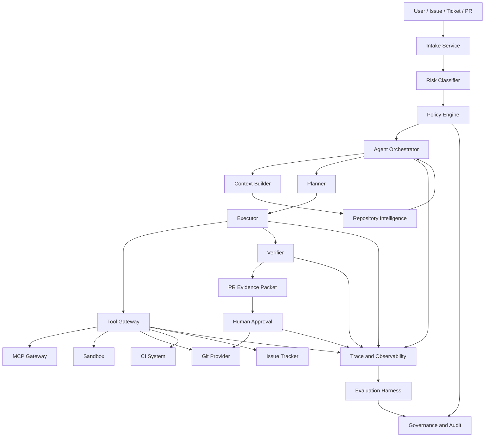
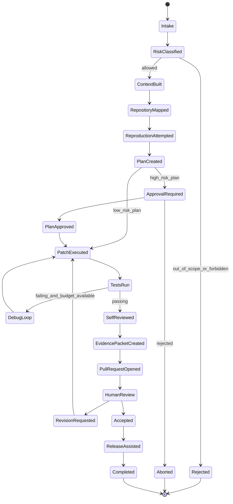
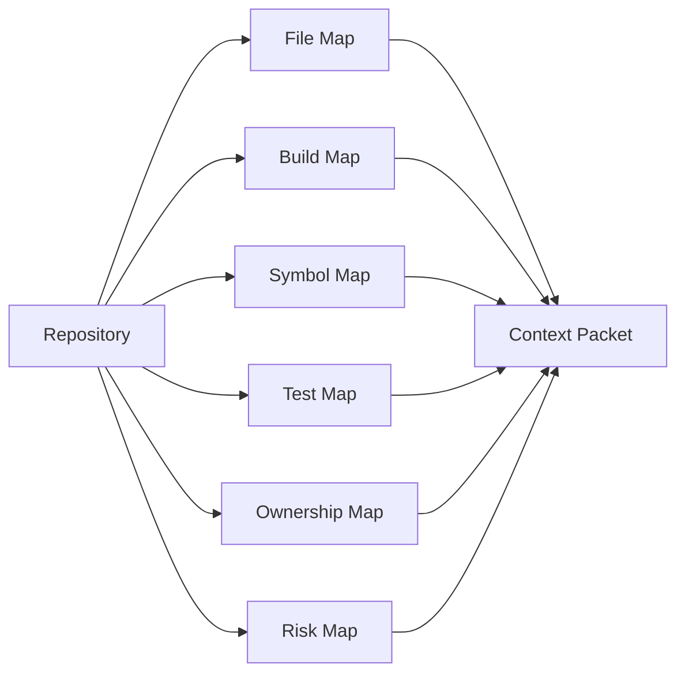
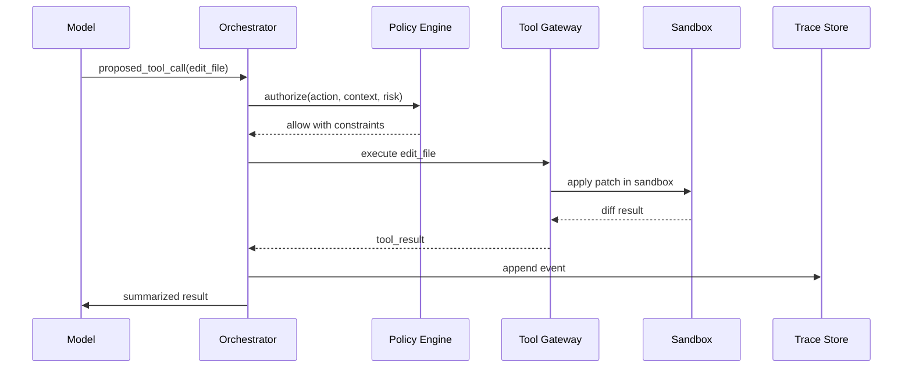
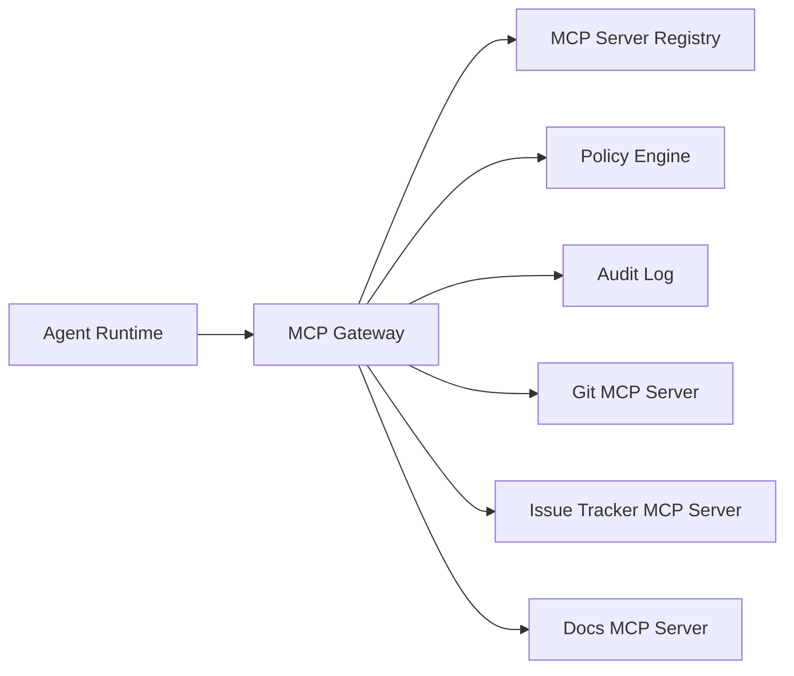
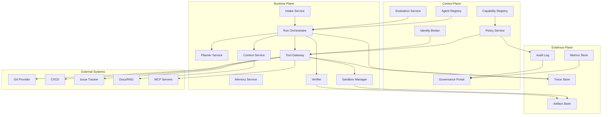
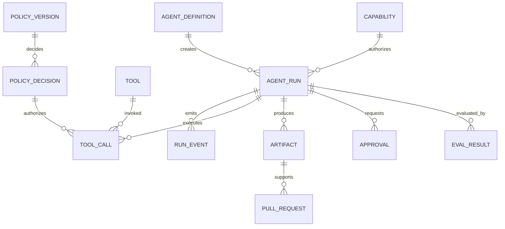
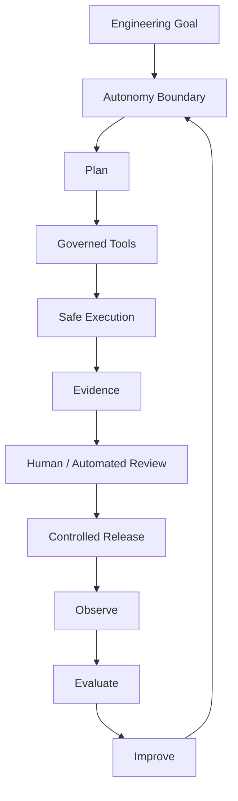

------
title: Learn Advanced Agentic AI Engineering & Autonomous Software Engineering - Part 035
description: Capstone blueprint for an autonomous engineering system: issue intake, repository understanding, planning, coding, testing, PR review, release assistance, policy, sandboxing, observability, evaluation, governance, rollout, and production readiness.
series: learn-agentic-ai-engineering
seriesTitle: Learn Advanced Agentic AI Engineering & Autonomous Software Engineering
order: 35
partTitle: Capstone: Autonomous Engineering System
tags:
- agentic-ai
- autonomous-software-engineering
- capstone
- ai-engineering
- coding-agents
- agent-platform
- governance
- observability
- evaluation
- series
- final
status: final
seriesStatus: completed
date: 2026-06-29
---

# Part 035 — Capstone: Autonomous Engineering System

> Target part ini: mampu mendesain blueprint end-to-end untuk **Autonomous Engineering System** yang dapat menerima issue, memahami repository, membuat rencana, menjalankan perubahan di sandbox, menulis/menjalankan test, membuat PR evidence packet, meminta approval, membantu release, dan tetap bisa diaudit, dievaluasi, diamankan, serta dioperasikan sebagai platform production.

Ini adalah bagian terakhir dari seri.

Part 001 sampai Part 034 membangun komponen-komponen terpisah:

- skill map,
- first principles,
- autonomy boundary,
- runtime architecture,
- workflow vs agent loop,
- planning,
- tool calling,
- MCP,
- context,
- memory,
- RAG,
- state machine,
- human approval,
- multi-agent,
- protocol,
- design pattern,
- anti-pattern,
- autonomous SWE lifecycle,
- repository understanding,
- coding loop,
- debugging,
- test generation,
- PR review,
- refactoring/migration,
- DevOps/release agents,
- evaluation,
- observability,
- reliability,
- security,
- policy/permission/identity,
- sandboxing,
- governance,
- platform architecture,
- enterprise operating model.

Part ini menyatukannya menjadi satu sistem.

Pertanyaan utama:

> Jika kita harus membangun autonomous engineering platform yang benar-benar layak untuk enterprise engineering, bentuk sistemnya seperti apa?

Jawaban singkat:

> Bukan satu agent super pintar. Bangun **controlled autonomous engineering system**: orchestrator yang stateful, tool gateway yang aman, sandbox yang terisolasi, repository intelligence, planning/execution/verifier loop, PR/release workflow, policy engine, human approval, trace/eval pipeline, dan governance layer.

OpenAI Agents SDK mendeskripsikan agent sebagai aplikasi yang dapat plan, call tools, collaborate across specialists, dan keep enough state untuk multi-step work.  
Reference: https://developers.openai.com/api/docs/guides/agents

Anthropic menekankan bahwa agentic system yang efektif sering kali lebih baik dibangun dari pola sederhana dan komposable, dengan distinction jelas antara workflow yang predictable dan agent yang lebih dynamic.  
Reference: https://www.anthropic.com/research/building-effective-agents

LangGraph diposisikan sebagai low-level orchestration framework untuk long-running, stateful agents dengan durable execution, persistence, human-in-the-loop, memory, dan streaming.  
Reference: https://pypi.org/project/langgraph/

MCP menyediakan protokol terbuka untuk menghubungkan AI applications dengan tools, resources, dan prompts melalui model host/client/server.  
Reference: https://modelcontextprotocol.io/specification/2025-11-25

SWE-bench mengevaluasi sistem AI pada real-world GitHub issues: diberikan codebase dan issue, sistem harus menghasilkan patch yang menyelesaikan problem.  
Reference: https://github.com/swe-bench/SWE-bench

OWASP Top 10 for LLM Applications dan OWASP agentic guidance memberi vocabulary risiko: prompt injection, insecure output handling, sensitive information disclosure, excessive agency, insecure plugin/tool design, supply chain, memory/context poisoning, dan unbounded consumption.  
Reference: https://owasp.org/www-project-top-10-for-large-language-model-applications/

NIST AI RMF dan Generative AI Profile memberi kerangka governance untuk memasukkan trustworthiness considerations ke design, development, use, dan evaluation AI systems.  
Reference: https://www.nist.gov/itl/ai-risk-management-framework

Prinsip capstone:

> Autonomy is not the architecture. Autonomy is a capability granted by architecture, policy, evaluation, and trust.

---

## 1. Hubungan dengan Framework Kaufman

Dalam kerangka Kaufman, skill ini terlalu besar jika dipelajari sebagai “membangun AI engineer otomatis”.

Kita pecah menjadi subskill operasional:

1. mendefinisikan target performa agent,
2. membuat autonomy boundary,
3. membuat state machine agent,
4. membangun repository understanding pipeline,
5. membangun planning loop,
6. membangun tool gateway,
7. membangun sandbox execution,
8. membangun verification hierarchy,
9. membangun PR evidence packet,
10. membangun approval gate,
11. membangun release-assist workflow,
12. membangun observability pipeline,
13. membangun eval harness,
14. membangun policy/identity/permission model,
15. membangun governance artefact,
16. menjalankan rollout bertahap.

Target 20 jam pertama untuk capstone:

> Anda mampu membuat design blueprint dan prototype kecil autonomous issue resolver yang hanya boleh mengerjakan low-risk issue, berjalan di sandbox, menghasilkan patch + test + evidence packet, dan tidak boleh merge/deploy tanpa human approval.

Target top 1% bukan “agent bisa coding”.

Target top 1% adalah:

> Anda bisa membangun sistem yang memungkinkan agent berkontribusi ke software delivery tanpa menghancurkan correctness, security, auditability, ownership, dan engineering culture.

---

## 2. Definisi Sistem

Autonomous Engineering System adalah platform yang membantu pekerjaan software engineering dengan kemampuan:

1. memahami permintaan engineering,
2. memahami repository,
3. menyusun rencana perubahan,
4. menjalankan eksperimen,
5. mengubah kode,
6. membuat/memperbaiki test,
7. memverifikasi hasil,
8. membuat PR,
9. menjelaskan evidence,
10. meminta approval,
11. membantu review,
12. membantu release,
13. membantu incident diagnosis,
14. belajar dari telemetry dan eval.

Namun sistem ini **bukan**:

- pengganti ownership engineer,
- bypass code review,
- bypass security review,
- auto-merge engine untuk semua perubahan,
- executor dengan secret unrestricted,
- chatbot dengan akses repository,
- CI bot yang kebetulan memakai LLM,
- kumpulan prompt tanpa runtime state.

Definisi yang lebih presisi:

> Autonomous Engineering System adalah **agentic SDLC control system** yang mengorkestrasi model, tools, state, policy, sandbox, evaluation, observability, dan human approval untuk menjalankan pekerjaan engineering dengan batas otonomi yang eksplisit.

---

## 3. North Star Capability

North star bukan “mengganti engineer”.

North star yang lebih sehat:

> Menurunkan cost dan lead time pekerjaan engineering yang repetitive/routine, sambil meningkatkan traceability, review quality, regression coverage, dan operational discipline.

Contoh pekerjaan yang layak:

| Kategori | Cocok Untuk Agent | Tidak Cocok Untuk Full Autonomy |
|---|---|---|
| Bug fix kecil | Reproduce, localize, patch, test | Ambiguous root cause across critical system |
| Test improvement | Add missing regression test | Menentukan strategi test enterprise-wide sendiri |
| Dependency upgrade | Minor/patch upgrade dengan recipe | Major migration berisiko tinggi tanpa human architect |
| Documentation | Update docs from code/PR | Menulis policy organisasi tanpa review |
| Refactoring | Mechanical rename/extract/migrate | Redesign domain model critical |
| PR review | Risk scan + actionable comments | Reject/approve PR sebagai authority tunggal |
| CI diagnosis | Explain failure + suggest fix | Push rollback ke production tanpa approval |
| Release assist | Readiness checklist + risk summary | Deploy high-impact change tanpa gate |

North star metrics:

| Metric | Arti |
|---|---|
| Lead time reduction | Waktu dari issue accepted ke PR ready berkurang |
| Review load reduction | Reviewer lebih sedikit membuang waktu di hal mekanis |
| Regression coverage increase | Bug fix disertai test relevan |
| Patch acceptance rate | Patch agent diterima setelah review manusia |
| Rework rate | Patch agent tidak sering harus diulang total |
| Incident contribution rate | Agent tidak menaikkan risiko incident |
| Evidence completeness | PR selalu punya bukti reproduksi/verifikasi |
| Policy violation rate | Tool/action agent tidak melanggar boundary |
| Evaluation pass rate | Agent tidak regresi di benchmark internal |

---

## 4. Architecture Overview

Sistem capstone terdiri dari tiga plane:

1. **Control Plane**  
   Mengelola registry, policy, identity, approval, evaluation, audit, governance, dan rollout.

2. **Execution Plane**  
   Menjalankan agent loop, planner, tool calls, sandbox, repository operations, tests, and verification.

3. **Evidence Plane**  
   Menyimpan trace, logs, decision records, tool results, eval results, PR evidence, approval records, dan audit events.



Key idea:

> Agent tidak langsung menyentuh dunia. Agent menyentuh **runtime**, runtime menyentuh **policy**, policy mengizinkan **tool gateway**, tool gateway menjalankan **sandboxed tools**, semua menghasilkan **evidence**.

---

## 5. Capability Model

Sistem sebaiknya tidak dimulai dari “agent bisa apa saja”.

Mulai dari capability yang jelas.

```yaml
capability:
  id: autonomous_issue_resolver.low_risk_bugfix
  owner: platform-engineering
  description: Resolve low-risk bug issues with reproduction and PR evidence.
  allowed_inputs:
    - github_issue
    - jira_ticket
  allowed_repositories:
    - service-catalog-tag: low-risk-enabled
  allowed_actions:
    - clone_repository
    - inspect_code
    - run_tests
    - edit_files
    - create_branch
    - open_pull_request
    - comment_on_issue
  forbidden_actions:
    - merge_pull_request
    - deploy_to_production
    - read_production_secrets
    - modify_iam_policy
    - write_to_production_database
  required_evidence:
    - reproduction_attempt
    - root_cause_summary
    - patch_summary
    - tests_run
    - risk_assessment
    - rollback_notes
  approval:
    open_pr: automatic
    merge_pr: human_required
    production_deploy: human_required
```

Capability bukan hanya nama fitur.

Capability adalah kontrak:

- siapa owner,
- input apa yang valid,
- tool apa yang boleh dipakai,
- credential apa yang boleh digunakan,
- evidence apa yang wajib,
- approval mana yang wajib,
- terminal state apa yang sah,
- evaluasi apa yang harus lulus.

---

## 6. Autonomy Tiering

Autonomy harus bertingkat.

| Tier | Nama | Agent Boleh | Agent Tidak Boleh |
|---:|---|---|---|
| 0 | Advisory | membaca, merangkum, memberi saran | menulis file, membuat branch, mengubah sistem |
| 1 | Assisted Edit | membuat patch lokal di sandbox | membuat PR tanpa approval eksplisit |
| 2 | PR Automation | membuat branch dan PR | merge/deploy |
| 3 | Bounded Maintenance | menjalankan perubahan rutin terdaftar | menyentuh high-risk file/system |
| 4 | Release Assist | membuat readiness packet, rollback suggestion | deploy/rollback sendiri |
| 5 | Conditional Operations | execute action dengan pre-approved runbook | improvisasi di production |

Rule praktis:

> Semakin dekat action ke production, customer data, security boundary, money movement, legal exposure, atau irreversible operation, semakin rendah otonomi agent.

Contoh mapping:

```yaml
autonomy_policy:
  low_risk_doc_update:
    max_tier: 2
    required_approval: reviewer
  low_risk_unit_test_patch:
    max_tier: 2
    required_approval: reviewer
  dependency_patch_upgrade:
    max_tier: 2
    required_approval: code_owner
  auth_logic_change:
    max_tier: 1
    required_approval: security_owner
  payment_logic_change:
    max_tier: 1
    required_approval: domain_owner_and_security
  production_rollback:
    max_tier: 4
    required_approval: incident_commander
```

---

## 7. End-to-End Lifecycle

Lifecycle capstone:



Core invariant:

> No terminal success without evidence.

Terminal success harus menjawab:

1. Issue apa yang dikerjakan?
2. Scope apa yang disetujui?
3. File apa yang berubah?
4. Kenapa perubahan itu benar?
5. Test apa yang membuktikan?
6. Risiko apa yang tersisa?
7. Siapa yang approve?
8. Apa yang tidak dilakukan?
9. Bagaimana rollback?
10. Trace execution-nya di mana?

---

## 8. Intake Layer

Intake layer menerima permintaan dari:

- GitHub issue,
- Jira ticket,
- Slack command,
- PR comment,
- scheduled maintenance job,
- CI failure,
- dependency alert,
- incident timeline.

Intake tidak boleh langsung menjalankan agent.

Intake harus melakukan normalization.

```yaml
engineering_request:
  id: REQ-2026-000123
  source: github_issue
  source_url: https://github.com/acme/billing/issues/812
  repository: acme/billing-service
  requester: alice@example.com
  requested_capability: autonomous_issue_resolver.low_risk_bugfix
  title: "Invoice total is wrong when discount is zero"
  description: "..."
  acceptance_criteria:
    - "zero discount must not change total"
    - "existing discount calculation tests must pass"
  constraints:
    - "do not change public API"
    - "do not modify migration files"
  deadline: null
  attachments: []
```

Good intake contains:

- explicit repository,
- problem statement,
- acceptance criteria,
- constraints,
- risk hints,
- expected output,
- owner/reviewer,
- source provenance.

Bad intake:

- “fix bug”,
- “make it better”,
- “optimize everything”,
- “update service”,
- “make tests green” without context.

Agent boleh meminta clarification jika acceptance criteria tidak cukup.

Namun untuk automation, lebih baik intake layer menolak request ambiguous daripada membiarkan agent berimprovisasi.

---

## 9. Risk Classifier

Risk classifier menentukan apakah request boleh dikerjakan agent dan pada autonomy tier berapa.

Risk signal:

| Signal | Contoh |
|---|---|
| Domain criticality | billing, auth, KYC, AML, enforcement decision |
| File sensitivity | IAM, crypto, migration, payment, policy, compliance |
| Runtime impact | production path, background job, customer-facing API |
| Data impact | PII, secrets, financial data, regulated data |
| Change scope | number of files, public API, schema, dependency graph |
| Reversibility | doc/test change vs data migration |
| Test confidence | high coverage vs unknown coverage |
| Ownership clarity | code owner exists vs unclear owner |
| Incident linkage | current incident vs routine maintenance |

Example classifier output:

```yaml
risk_assessment:
  risk_tier: medium
  reasons:
    - modifies_billing_domain
    - touches_calculation_logic
    - no_schema_change
    - unit_tests_available
  max_autonomy_tier: 1
  required_approvals:
    - billing_code_owner
  forbidden_actions:
    - open_pr_without_plan_approval
    - modify_public_api
    - modify_database_schema
```

Important:

> Risk classifier is not a vibe check. It is a policy decision that must be explainable and reviewable.

---

## 10. Repository Intelligence Layer

Repository intelligence layer membuat map repository.

Ia tidak hanya membaca file.

Ia membangun beberapa representation:

| Map | Fungsi |
|---|---|
| File map | struktur folder, generated files, test files |
| Build map | build tool, modules, tasks, dependencies |
| Symbol map | class/function/interface/type relationships |
| Dependency map | internal/external dependency graph |
| Test map | test file to production file relationships |
| Ownership map | CODEOWNERS, maintainers, teams |
| Runtime map | entrypoints, deployment units, config |
| Risk map | sensitive files/domains |
| Convention map | naming, layering, patterns, lint rules |



Repository intelligence output:

```yaml
repo_context_packet:
  repository: acme/billing-service
  commit: 5a7c91f
  language_stack:
    - java
    - spring_boot
    - gradle
  modules:
    - billing-core
    - billing-api
  likely_files:
    production:
      - billing-core/src/main/java/com/acme/billing/InvoiceCalculator.java
      - billing-core/src/main/java/com/acme/billing/DiscountPolicy.java
    tests:
      - billing-core/src/test/java/com/acme/billing/InvoiceCalculatorTest.java
  build_commands:
    unit: ./gradlew :billing-core:test
    full: ./gradlew test
  owners:
    - team-billing-platform
  risk_notes:
    - billing_domain
    - no_database_schema_detected
    - no_auth_file_detected
```

Repository map harus versioned.

Jangan memakai repo map stale untuk commit baru tanpa invalidation.

---

## 11. Context Builder

Context builder membuat context yang dikirim ke model.

Ia harus mengikuti prinsip:

> Send enough to reason, not enough to leak, confuse, or exceed budget.

Context layers:

1. system instruction,
2. capability policy,
3. request packet,
4. repo context packet,
5. relevant files/snippets,
6. previous attempts,
7. tool results,
8. reviewer feedback,
9. verification evidence,
10. constraints.

Context builder harus menandai provenance:

```yaml
context_item:
  id: ctx-00042
  type: source_file_snippet
  source: repository
  repository: acme/billing-service
  path: billing-core/src/main/java/com/acme/billing/InvoiceCalculator.java
  commit: 5a7c91f
  line_range: "42-91"
  trust_level: trusted_repo_content
  freshness: current_commit
  content_hash: sha256:...
```

Agent harus bisa membedakan:

- user instruction,
- repository content,
- tool output,
- untrusted issue content,
- retrieved documentation,
- policy instruction.

Ini penting untuk prompt injection.

Issue body dan README dari repository adalah untrusted content.

Policy dan system instruction adalah trusted control content.

---

## 12. Planner

Planner membuat rencana kerja.

Plan harus berbentuk artifact, bukan reasoning bebas yang hilang.

```yaml
plan:
  id: PLAN-2026-000123
  objective: Fix invoice total when discount is zero.
  assumptions:
    - zero discount should behave as no discount
  constraints:
    - do not change public API
    - do not modify database schema
  steps:
    - id: S1
      action: inspect
      target: InvoiceCalculator and related tests
      expected_evidence: relevant calculation path identified
    - id: S2
      action: reproduce
      target: existing or new focused unit test
      expected_evidence: failing test or documented non-reproduction
    - id: S3
      action: patch
      target: minimal calculation logic change
      expected_evidence: diff limited to billing-core
    - id: S4
      action: verify
      target: ./gradlew :billing-core:test
      expected_evidence: test report
  forbidden:
    - modify public API
    - modify database schema
    - change unrelated formatting
  risk:
    tier: medium
    requires_plan_approval: true
```

Plan quality checklist:

- objective jelas,
- scope terbatas,
- assumptions eksplisit,
- constraints eksplisit,
- step observable,
- setiap step punya expected evidence,
- verification command jelas,
- forbidden action jelas,
- risk tier jelas,
- approval requirement jelas.

Poor plan:

> I will inspect the code, make changes, and test it.

Good plan:

> I will inspect `InvoiceCalculator` and `DiscountPolicy`, reproduce the zero-discount case with a focused unit test, patch only calculation logic if reproduction confirms the issue, run module-level tests, and create a PR with the failing-before/passing-after evidence.

---

## 13. Executor

Executor menjalankan plan melalui state machine.

Executor tidak boleh langsung mengikuti setiap model output.

Executor harus memvalidasi:

- apakah action valid untuk current state,
- apakah action diizinkan policy,
- apakah tool schema valid,
- apakah credential tersedia,
- apakah resource budget tersedia,
- apakah approval diperlukan,
- apakah output memenuhi contract.



Executor invariant:

> Model proposes. Runtime disposes.

Runtime harus bisa berkata:

- reject,
- require approval,
- require clarification,
- retry,
- fallback,
- abort,
- continue.

---

## 14. Tool Gateway

Tool gateway adalah choke point.

Semua tool call harus melewatinya.

Tool gateway responsibilities:

1. schema validation,
2. authorization,
3. credential scoping,
4. sandbox routing,
5. rate limiting,
6. timeout,
7. idempotency key,
8. output sanitization,
9. event logging,
10. secret redaction,
11. egress control,
12. policy enforcement,
13. tool versioning.

Example tool contract:

```yaml
tool:
  name: run_tests
  version: 1.2.0
  description: Run tests in the sandboxed repository checkout.
  side_effect: sandbox_only
  input_schema:
    command: string
    timeout_seconds: integer
    working_directory: string
  policy:
    allowed_commands:
      - "./gradlew :billing-core:test"
      - "./gradlew test"
    forbidden_patterns:
      - "curl"
      - "wget"
      - "nc"
      - "rm -rf /"
  output_schema:
    exit_code: integer
    stdout_excerpt: string
    stderr_excerpt: string
    test_report_path: string
    duration_ms: integer
```

Tool gateway rule:

> Tools are not helper functions. Tools are capabilities with authority.

---

## 15. MCP Gateway

MCP servers can expose tools, resources, and prompts.

In enterprise architecture, agent should not connect directly to arbitrary MCP servers.

Use MCP gateway:



MCP gateway enforces:

- server allowlist,
- tool allowlist,
- prompt/resource visibility,
- identity propagation,
- tenant isolation,
- tool metadata validation,
- output classification,
- version pinning,
- provenance tagging,
- audit events.

Never treat MCP server description as trusted security boundary.

MCP is integration protocol.

Security still needs policy, sandbox, identity, network control, and audit.

---

## 16. Sandbox Execution

Sandbox is mandatory for autonomous SWE.

Minimum sandbox controls:

| Control | Purpose |
|---|---|
| Isolated filesystem | prevent host mutation |
| Ephemeral checkout | clean run per task |
| Network default deny | prevent exfiltration and uncontrolled downloads |
| Scoped package cache | control supply chain surface |
| No production secrets | prevent credential leakage |
| Resource limits | prevent runaway cost/DoS |
| Time budget | prevent infinite loops |
| Process isolation | contain executed code |
| Artifact capture | preserve diff, logs, reports |
| Egress approval | allow controlled external access |

Example sandbox profile:

```yaml
sandbox_profile:
  id: java-low-risk-bugfix
  filesystem:
    mode: ephemeral
    writable_paths:
      - /workspace/repo
      - /workspace/tmp
    read_only_paths:
      - /workspace/policy
  network:
    default: deny
    allowlist:
      - internal-artifact-cache.acme.local
  secrets:
    allowed: []
  resources:
    cpu: 4
    memory: 8Gi
    timeout_minutes: 30
  package_management:
    allow_download: false
    use_locked_cache: true
  artifact_capture:
    - git_diff
    - test_reports
    - terminal_logs
```

Sandbox rule:

> If the agent can execute code, assume the code may be malicious, broken, expensive, or exfiltrating.

---

## 17. Verification Hierarchy

Do not rely on model self-review.

Verification hierarchy:

1. static checks,
2. formatting/lint,
3. type checking/compilation,
4. focused unit tests,
5. regression tests,
6. integration tests,
7. contract tests,
8. security checks,
9. mutation/property checks if relevant,
10. human review,
11. staged rollout signals.

For low-risk bugfix:

```yaml
verification_plan:
  required:
    - compile
    - focused_test
    - affected_module_test
    - diff_review
  optional:
    - full_test_suite
    - mutation_test
    - security_scan
  forbidden_shortcuts:
    - delete_failing_test
    - weaken_assertion_without_justification
    - skip_test_without_approval
```

Agent must produce verification evidence:

```yaml
verification_evidence:
  reproduction:
    status: reproduced
    command: ./gradlew :billing-core:test --tests InvoiceCalculatorTest.zeroDiscount
    before_patch_result: failed
  after_patch:
    focused_test: passed
    module_test: passed
    full_test: not_run
    not_run_reason: exceeds low-risk budget
  changed_tests:
    - InvoiceCalculatorTest.zeroDiscountDoesNotChangeTotal
  risk_remaining:
    - full suite not run in agent sandbox; CI will run on PR
```

Verification principle:

> Passing tests are evidence, not proof. But no evidence is not acceptable.

---

## 18. PR Evidence Packet

PR opened by agent must not look like a human guessed.

It should include evidence packet.

```md
## Summary
Fixes zero-discount invoice total calculation by treating zero discount as no discount.

## Scope
- Modified `InvoiceCalculator`
- Added regression test for zero discount
- No API/schema/config changes

## Reproduction
Before patch:
- `./gradlew :billing-core:test --tests InvoiceCalculatorTest.zeroDiscountDoesNotChangeTotal`
- Failed with expected total 100.00 but got 0.00

## Verification
After patch:
- Focused test: passed
- Module tests: passed
- Full test suite: not run in sandbox; CI will run

## Risk
Medium: billing calculation logic.
Mitigation: minimal diff, focused regression test, billing code owner review required.

## Constraints Honored
- Did not change public API
- Did not modify database schema
- Did not modify unrelated files

## Rollback
Revert this PR. No migration or data transformation involved.

## Agent Trace
Trace ID: trc_2026_000123
```

Evidence packet reduces review cost.

It also gives auditability.

Bad PR description:

> Fixed bug.

Good PR description:

> Here is the reproduction, patch scope, verification result, residual risk, rollback path, and trace ID.

---

## 19. Review Agent

Review agent should not replace human code owner.

It should improve review quality.

Review agent roles:

- summarize diff,
- identify risky files,
- compare PR against requirements,
- detect missing tests,
- detect security concern,
- detect inconsistent pattern,
- propose focused questions,
- verify PR evidence completeness,
- create review checklist.

Review output should be ranked:

| Severity | Meaning |
|---|---|
| Blocker | likely correctness/security issue |
| Major | important maintainability/design issue |
| Minor | local improvement |
| Nit | style only |
| Question | uncertainty requiring human context |

Review agent anti-pattern:

> Dump 50 comments with low confidence.

Better:

> 3 high-confidence findings, each tied to diff line, invariant, consequence, and suggested action.

Finding format:

```yaml
finding:
  severity: major
  confidence: high
  file: InvoiceCalculator.java
  lines: "82-91"
  invariant: zero discount must behave as no discount
  issue: branch treats zero as missing discount and resets total
  consequence: invoice total becomes incorrect for valid zero-discount case
  suggestion: compare discount presence separately from discount value
  evidence:
    - failing test InvoiceCalculatorTest.zeroDiscountDoesNotChangeTotal
```

---

## 20. Release Assist

Agent should assist release, not own it blindly.

Release assist tasks:

- summarize changes since last release,
- classify release risk,
- check CI status,
- check required approvals,
- check open incidents,
- check feature flag state,
- generate release notes,
- generate rollback notes,
- monitor canary signals,
- explain deployment failure,
- suggest rollback/roll-forward options.

Release readiness packet:

```yaml
release_readiness:
  version: 2026.06.29-rc1
  services:
    - billing-service
  changes:
    - PR-812 zero-discount invoice fix
  ci_status: passed
  approvals:
    code_owner: approved
    security: not_required
  risk_tier: medium
  rollout_plan:
    - deploy_to_staging
    - canary_5_percent
    - canary_25_percent
    - full_rollout
  monitors:
    - invoice_calculation_error_rate
    - billing_api_5xx
    - discount_policy_exception_count
  rollback:
    method: revert_deployment
    data_migration: none
```

Release agent forbidden actions by default:

- deploy production without approval,
- rollback production without incident commander approval,
- disable monitors,
- change alert thresholds,
- rotate secrets,
- modify IAM,
- bypass change window.

---

## 21. Observability and Evidence Plane

Agent observability differs from normal service observability.

You need to reconstruct **why** something happened.

Minimum trace events:

| Event | Required Fields |
|---|---|
| request_received | request ID, source, user, repo |
| risk_classified | tier, reasons, policy version |
| context_built | context items, hashes, token count |
| plan_created | plan ID, steps, constraints |
| tool_call_requested | tool, args hash, state |
| tool_call_authorized | policy decision, credential scope |
| tool_call_executed | duration, output hash, exit code |
| file_changed | path, diff hash, risk tag |
| test_run | command, result, report path |
| approval_requested | approver, reason, evidence packet |
| approval_decision | approver, decision, timestamp |
| pr_opened | PR URL, branch, evidence hash |
| run_completed | terminal state, summary |

Trace event example:

```json
{
  "event_type": "tool_call_executed",
  "trace_id": "trc_2026_000123",
  "run_id": "run_456",
  "state": "TestsRun",
  "tool": "run_tests",
  "tool_version": "1.2.0",
  "args_hash": "sha256:...",
  "policy_decision_id": "poldec_789",
  "sandbox_id": "sbx_abc",
  "exit_code": 0,
  "duration_ms": 42391,
  "output_hash": "sha256:...",
  "timestamp": "2026-06-29T05:40:00Z"
}
```

Do not log secrets.

Do not log full prompts blindly if they contain sensitive data.

Use redaction and content classification.

---

## 22. Evaluation Harness

A capstone system must have offline and online eval.

Offline eval types:

| Eval | Purpose |
|---|---|
| Task eval | Can agent solve known tasks? |
| Trajectory eval | Did agent follow safe path? |
| Tool-call eval | Did agent choose legal tools? |
| Patch eval | Does patch pass tests? |
| Review eval | Are findings useful and accurate? |
| Security eval | Does agent resist injection/tool abuse? |
| Cost eval | Token/tool/runtime budget |
| Regression eval | Did new model/prompt/tool version worsen behavior? |

Online eval types:

| Eval | Purpose |
|---|---|
| Human acceptance | Was PR accepted? |
| Rework rate | How much human correction needed? |
| Incident linkage | Did agent-caused change fail? |
| Policy violation | Did agent attempt forbidden actions? |
| Evidence completeness | Did PR include required evidence? |
| Latency/cost | Is runtime sustainable? |

Eval record:

```yaml
eval_result:
  eval_id: agent_low_risk_bugfix_regression_v17
  agent_version: 2026.06.29
  model: model-x
  policy_version: pol-42
  tool_versions:
    run_tests: 1.2.0
    edit_file: 1.4.1
  dataset: internal-low-risk-bugfix-2026q2
  results:
    task_success_rate: 0.62
    evidence_complete_rate: 0.94
    policy_violation_rate: 0.00
    average_cost_usd: 1.42
    p95_duration_minutes: 18
  decision: pass_with_monitoring
```

Do not only measure final success.

Measure path quality.

A dangerous agent can pass tasks by violating policy.

---

## 23. Security Model

Threat model the whole system.

Attack surfaces:

1. issue body prompt injection,
2. README/documentation injection,
3. malicious test output,
4. malicious dependency script,
5. compromised MCP server,
6. tool description injection,
7. credential exfiltration,
8. branch/PR manipulation,
9. reviewer approval manipulation,
10. memory poisoning,
11. context poisoning,
12. eval dataset contamination,
13. supply-chain attack,
14. runaway cost,
15. confused deputy via delegated permissions.

Security controls:

| Threat | Control |
|---|---|
| Prompt injection | instruction hierarchy, context labeling, output validation |
| Tool abuse | tool gateway, allowlist, policy engine |
| Excessive agency | autonomy tier, approval gate, capability registry |
| Secret leakage | secret broker, redaction, no secrets in sandbox by default |
| Data exfiltration | network deny, egress allowlist, output scanning |
| Malicious dependency | locked cache, no arbitrary install, SBOM/signature checks |
| MCP compromise | registry, version pinning, gateway, audit |
| Memory poisoning | provenance, confidence, retention policy, reviewable memory writes |
| Policy bypass | PEP/PDP separation, immutable audit, policy regression tests |
| Supply chain | pinned tools, signed images, artifact verification |

Security principle:

> The model is not the trust boundary. The runtime is.

---

## 24. Policy and Identity Model

Every agent action must have identity.

Identity layers:

| Identity | Meaning |
|---|---|
| Human requester | who requested work |
| Agent definition | which agent/capability acted |
| Runtime instance | which run/session acted |
| Tool identity | which tool/service was invoked |
| Credential subject | which scoped credential was used |
| Approver | who authorized gated action |

Audit question:

> Who caused this change?

Correct answer should be:

> Human Alice requested REQ-123. Agent `autonomous_issue_resolver` version 2026.06.29 executed run `run_456` under capability policy `pol-42`, used sandbox credential `cred-789`, opened PR-812, approved by Bob as billing code owner.

Policy rule example:

```rego
package agent.policy

default allow := false

allow if {
  input.action == "open_pull_request"
  input.capability == "autonomous_issue_resolver.low_risk_bugfix"
  input.risk_tier in ["low", "medium"]
  input.evidence.reproduction.status in ["reproduced", "not_reproduced_with_reason"]
  input.evidence.tests_run.count > 0
  not input.diff.touches_forbidden_files
}

requires_approval if {
  input.domain in ["billing", "auth", "compliance"]
}
```

The exact policy language can vary.

The invariant matters:

> Policy must be executable, versioned, testable, and auditable.

---

## 25. Governance Artefacts

For enterprise use, create governance artefacts.

Minimum artifacts:

1. Agent Card,
2. Capability Contract,
3. Risk Assessment,
4. Tool Registry Entry,
5. Data Handling Statement,
6. Evaluation Report,
7. Approval Matrix,
8. Incident Playbook,
9. Rollback Procedure,
10. Change Log,
11. Audit Evidence Schema,
12. Model/Provider Risk Record.

Agent Card example:

```yaml
agent_card:
  name: Autonomous Issue Resolver
  version: 2026.06.29
  owner: platform-engineering
  business_owner: engineering-productivity
  purpose: Resolve low-risk software issues by opening PRs with evidence.
  allowed_users:
    - engineering
  allowed_repos:
    - opted_in_repositories
  max_autonomy_tier: 2
  allowed_actions:
    - inspect_repo
    - run_tests_in_sandbox
    - edit_files
    - open_pr
  forbidden_actions:
    - merge_pr
    - deploy_production
    - read_production_secrets
  data_access:
    code: yes
    tickets: yes
    production_data: no
    secrets: no
  evals:
    required_before_release:
      - low_risk_bugfix_regression
      - prompt_injection_suite
      - tool_policy_suite
  monitoring:
    dashboards:
      - agent_success
      - policy_violations
      - cost_latency
  incident_owner: platform-oncall
```

Governance should not be theater.

It should map to runtime enforcement.

---

## 26. Minimal Viable Capstone

Do not start by building all capabilities.

Build a minimal viable capstone:

> A low-risk bugfix PR agent for one repository, one language stack, one build tool, sandboxed execution, no production secrets, no merge permission, mandatory evidence packet, and evaluation harness.

Scope:

```yaml
mvc_scope:
  repositories: 1
  languages:
    - java
  build_tool:
    - gradle
  capabilities:
    - issue_intake
    - repo_map
    - focused_test_run
    - edit_file
    - open_pr
  forbidden:
    - merge
    - deploy
    - production_credentials
    - database_write
    - internet_egress
  required:
    - trace
    - evidence_packet
    - human_review
    - offline_eval_before_release
```

Success criteria:

- 20 curated low-risk tasks,
- 0 policy violations,
- 80% evidence completeness,
- 30% useful PR rate in pilot,
- no merge without human,
- no secrets exposure,
- every run replayable from event log,
- every PR has trace ID.

This is enough to learn.

Do not prematurely build multi-agent swarm, enterprise MCP marketplace, or autonomous release system.

---

## 27. Reference Implementation Blueprint

A practical service decomposition:



Possible implementation components:

| Component | Possible Technology |
|---|---|
| Orchestration | LangGraph-like state graph, Temporal-like workflow, custom state machine |
| Model/tool runtime | OpenAI Agents SDK-style abstraction, custom runner |
| Tool integration | MCP gateway + first-party tools |
| Policy | OPA/Rego or custom policy service |
| Sandbox | container/firecracker/kata/ephemeral VM depending risk |
| Trace | OpenTelemetry-compatible traces + custom event schema |
| Eval | custom eval harness + golden task suite |
| Artifact store | object storage with hash-addressed artifacts |
| Registry | internal developer portal/catalog |

Do not overfit to one framework.

The architecture should survive framework changes.

---

## 28. API Sketch

Example create run API:

```http
POST /agent-runs
Content-Type: application/json

{
  "capability": "autonomous_issue_resolver.low_risk_bugfix",
  "source": {
    "type": "github_issue",
    "url": "https://github.com/acme/billing/issues/812"
  },
  "repository": "acme/billing-service",
  "constraints": [
    "do not change public API",
    "do not modify database schema"
  ],
  "requested_by": "alice@example.com"
}
```

Response:

```json
{
  "run_id": "run_456",
  "trace_id": "trc_2026_000123",
  "status": "risk_classification_pending"
}
```

Run event:

```json
{
  "run_id": "run_456",
  "state": "ApprovalRequired",
  "approval_request": {
    "reason": "medium risk billing logic change",
    "plan_id": "PLAN-2026-000123",
    "evidence_preview": {
      "files_likely_touched": [
        "InvoiceCalculator.java",
        "InvoiceCalculatorTest.java"
      ],
      "forbidden_changes": [
        "public API",
        "database schema"
      ]
    }
  }
}
```

PR creation event:

```json
{
  "run_id": "run_456",
  "state": "PullRequestOpened",
  "pull_request": {
    "url": "https://github.com/acme/billing-service/pull/812",
    "branch": "agent/run-456-zero-discount-fix",
    "evidence_packet_hash": "sha256:..."
  }
}
```

---

## 29. Data Model

Core entities:



Important tables/documents:

| Entity | Purpose |
|---|---|
| AgentDefinition | versioned config: model, instructions, policies, tools |
| Capability | allowed use case and boundaries |
| AgentRun | one execution instance |
| RunEvent | event-sourced trace |
| ToolCall | structured tool invocation record |
| Artifact | diff, logs, reports, evidence packet |
| Approval | human decision record |
| PolicyDecision | authorization result |
| EvalResult | offline/online eval result |
| PullRequestLink | link between run and PR |
| IncidentLink | link between run and incident if any |

Use content hashes for artifacts.

Do not rely only on mutable URLs.

---

## 30. Failure Modes and Mitigations

| Failure Mode | Symptom | Mitigation |
|---|---|---|
| Patch-before-reproduce | agent edits without proving failure | require reproduction attempt state |
| Hallucinated success | claims test passed without evidence | test result artifact required |
| Context poisoning | README/issue instructs agent to leak secrets | source trust labeling, instruction hierarchy |
| Tool abuse | agent runs forbidden command | tool gateway + policy |
| Scope creep | unrelated files changed | diff scope checker |
| Infinite debug loop | repeated edit/test cycles | budget + max iteration + abort reason |
| Weak test | test asserts implementation detail or always passes | test quality verifier |
| Approval fatigue | too many low-value approval requests | risk tiering + approval packet quality |
| Low-signal PR review | agent leaves many vague comments | review finding rubric |
| Eval gaming | agent overfits benchmark | fresh internal tasks + online metrics |
| Credential leak | secrets in logs/context | secret broker + redaction + sandbox no secrets |
| MCP drift | tool behavior changes unexpectedly | version pinning + registry review |
| Hidden state | cannot reproduce decision | event-sourced trace |
| Cost explosion | too many model/tool calls | budget, cost SLO, circuit breaker |

---

## 31. Rollout Plan

Use phased rollout.

### Phase 0 — Design Review

Deliverables:

- capability contract,
- threat model,
- sandbox profile,
- policy matrix,
- eval design,
- observability schema,
- governance owner.

Exit criteria:

- security approves architecture,
- platform owner assigned,
- pilot repository selected,
- rollback/disable plan exists.

### Phase 1 — Offline Prototype

Agent runs on cloned tasks only.

No PR creation.

Exit criteria:

- can run curated task set,
- produces evidence packet,
- no policy violations,
- traces complete.

### Phase 2 — PR Draft Pilot

Agent may open draft PR.

No merge authority.

Exit criteria:

- accepted PR rate acceptable,
- reviewer satisfaction acceptable,
- no secrets exposure,
- no high-risk scope escape.

### Phase 3 — Low-Risk Production Use

Agent can operate on opted-in repositories.

Still no merge/deploy authority.

Exit criteria:

- stable metrics,
- incident playbook tested,
- eval gate integrated with release.

### Phase 4 — Expanded Capabilities

Add dependency upgrade, PR review, CI diagnosis, release assist.

Exit criteria:

- each capability has separate eval,
- separate policy,
- separate owners,
- clear SLO.

### Phase 5 — Conditional Operations

Only for tightly constrained runbooks.

Example:

- restart non-critical job in staging,
- re-run failed CI,
- rollback preview environment,
- create release candidate branch.

Production operations remain human-approved unless extremely mature and low-risk.

---

## 32. Production Readiness Checklist

### Architecture

- [ ] Agent runtime is stateful and replayable.
- [ ] All tool calls go through tool gateway.
- [ ] Policy engine is external to model.
- [ ] Sandbox exists for code execution.
- [ ] Network egress is controlled.
- [ ] Secrets are scoped and redacted.
- [ ] MCP servers are registry-controlled.
- [ ] Context items have provenance.
- [ ] Memory writes are governed.

### Autonomy

- [ ] Capability contract exists.
- [ ] Autonomy tier is defined.
- [ ] Forbidden actions are explicit.
- [ ] Approval gates are implemented.
- [ ] Kill switch exists.
- [ ] Human owner is assigned.

### Verification

- [ ] Reproduction attempt required.
- [ ] Test evidence required.
- [ ] Diff scope checker exists.
- [ ] Evidence packet generated.
- [ ] CI integration exists.
- [ ] PR review workflow exists.

### Observability

- [ ] Trace ID per run.
- [ ] Tool-call logs stored.
- [ ] Policy decisions stored.
- [ ] Artifacts are content-hashed.
- [ ] Dashboards exist.
- [ ] Alerts exist for policy violations and cost spikes.

### Evaluation

- [ ] Offline eval suite exists.
- [ ] Security eval exists.
- [ ] Tool policy eval exists.
- [ ] Regression gate exists for agent changes.
- [ ] Online metrics are monitored.
- [ ] Human review feedback is captured.

### Governance

- [ ] Agent card exists.
- [ ] Risk assessment exists.
- [ ] Data handling statement exists.
- [ ] Incident playbook exists.
- [ ] Change management process exists.
- [ ] Vendor/model risk review exists.
- [ ] Audit export exists.

---

## 33. Internal Engineering Standard

A good internal standard might say:

> Any autonomous engineering agent that can read repository code and produce code changes must run under a registered capability, use sandboxed execution, emit traceable tool-call events, enforce policy through a non-model policy engine, generate evidence for every PR, and require human approval for merge, deployment, credential access, production data access, or high-risk domain changes.

Minimum rules:

1. No unregistered agent in production repositories.
2. No direct tool execution bypassing gateway.
3. No production secrets in agent context.
4. No merge/deploy authority by default.
5. No success status without evidence packet.
6. No model/prompt/tool upgrade without eval regression.
7. No MCP server without registry review.
8. No memory write without provenance and retention policy.
9. No high-risk domain change without code owner approval.
10. No incident action without incident commander approval.

---

## 34. Example End-to-End Scenario

Scenario:

> A customer reports invoice total is wrong when discount is zero.

### 34.1 Intake

Request normalized:

```yaml
request:
  repository: acme/billing-service
  issue: invoice total wrong when discount is zero
  constraints:
    - no public API change
    - no schema change
  expected_output: draft PR with evidence
```

### 34.2 Risk Classification

Risk output:

```yaml
risk:
  tier: medium
  domain: billing
  max_autonomy: assisted_pr
  approval_required:
    - billing_code_owner
```

### 34.3 Repo Understanding

Repo map finds:

```yaml
likely_files:
  - InvoiceCalculator.java
  - DiscountPolicy.java
  - InvoiceCalculatorTest.java
commands:
  focused: ./gradlew :billing-core:test --tests InvoiceCalculatorTest
```

### 34.4 Planning

Plan says:

- inspect calculator,
- add failing test,
- patch minimal logic,
- run focused test,
- run module test,
- open draft PR.

### 34.5 Execution

Agent edits only allowed files.

Tool gateway rejects any unrelated command.

Sandbox captures diff and logs.

### 34.6 Verification

Evidence:

```yaml
before:
  focused_test: failed
after:
  focused_test: passed
  module_test: passed
```

### 34.7 PR

PR includes:

- summary,
- reproduction,
- verification,
- risk,
- constraints,
- rollback,
- trace ID.

### 34.8 Review

Review agent produces:

- 0 blockers,
- 1 question about rounding behavior,
- confirms no schema/API change.

Human code owner approves or requests revision.

### 34.9 Release Assist

After merge, release agent produces readiness packet.

Human release owner deploys.

### 34.10 Audit

Audit can reconstruct:

- who requested,
- agent version,
- policy version,
- tool calls,
- diff,
- test evidence,
- approval,
- PR,
- release notes.

---

## 35. What Makes This “Top 1%” Engineering?

Many engineers can wire an LLM to a repository.

Fewer can design the control system around it.

Top-level competence appears in these decisions:

1. **Explicit autonomy boundary** instead of vague trust.
2. **State machine** instead of uncontrolled chat loop.
3. **Tool gateway** instead of direct tool access.
4. **Sandbox-first execution** instead of local machine mutation.
5. **Evidence packet** instead of narrative confidence.
6. **Evaluation harness** instead of demo-based validation.
7. **Policy engine** instead of prompt-only guardrail.
8. **Human approval as runtime state** instead of manual side process.
9. **MCP gateway** instead of arbitrary connector sprawl.
10. **Observability for decisions** instead of logs only.
11. **Governance mapped to enforcement** instead of paperwork.
12. **Capability-based rollout** instead of universal agent access.

The mental model:

> Autonomous engineering is not a model capability problem alone. It is a socio-technical control problem across software delivery, security, evaluation, operations, and governance.

---

## 36. Deliberate Practice

### Exercise 1 — Capability Contract

Choose one repository.

Write a capability contract for low-risk bugfix PR agent:

- allowed actions,
- forbidden actions,
- evidence requirements,
- approval gates,
- sandbox profile,
- risk rules.

### Exercise 2 — State Machine

Draw state machine for:

- intake,
- risk classification,
- repo map,
- reproduction,
- planning,
- patch,
- verification,
- PR,
- review,
- completion.

Define terminal failure states.

### Exercise 3 — Tool Gateway

Define schemas for:

- `search_code`,
- `read_file`,
- `edit_file`,
- `run_tests`,
- `create_branch`,
- `open_pr`.

For each, define:

- side effect,
- policy requirement,
- timeout,
- idempotency,
- output schema,
- logging fields.

### Exercise 4 — Evidence Packet

Take a real PR.

Rewrite its description as agent evidence packet:

- reproduction,
- patch summary,
- verification,
- risk,
- rollback,
- constraints.

### Exercise 5 — Eval Suite

Create 10 internal tasks:

- 5 low-risk bugfix,
- 2 test improvement,
- 2 dependency patch upgrade,
- 1 negative task that must be rejected.

Define pass/fail criteria.

### Exercise 6 — Threat Model

Threat model the agent using these attacker inputs:

- malicious issue body,
- malicious README,
- malicious test output,
- malicious MCP tool description,
- malicious dependency install script.

For each, define control.

---

## 37. Common Interview/Architecture Questions

### 37.1 Why not just let the coding agent open and merge PRs?

Because merge is not just a code operation.

It transfers risk into shared codebase and eventually production.

Without human approval, eval gate, ownership, and rollback discipline, the organization loses accountability.

### 37.2 Why is sandbox required if repository code is trusted?

Repository code may include arbitrary scripts, test hooks, dependency install steps, generated commands, or compromised dependencies.

Agent also may execute commands based on untrusted context.

Sandbox protects host, secrets, network, and neighboring systems.

### 37.3 Why do we need policy engine if prompt says “do not do X”?

Because prompt is instruction, not enforcement.

Policy engine can reject actual tool calls regardless of what the model says.

### 37.4 Why is evidence packet mandatory?

Because software engineering requires reviewable proof of work.

Evidence packet reduces reviewer burden and gives auditability.

### 37.5 Why not start with multi-agent architecture?

Multi-agent increases coordination complexity, cost, non-determinism, and security surface.

Start single-agent plus verifier/reviewer roles, then split only when specialization creates measurable value.

### 37.6 What is the most dangerous hidden assumption?

That agent success in a demo transfers directly to production.

Production needs repeatability, policy, evaluation, failure recovery, ownership, and observability.

---

## 38. Final Mental Model

A mature autonomous engineering platform has this shape:



Loop principle:

> The agent improves only through evidence, evaluation, and controlled rollout. Not through optimism.

---

## 39. Final Checklist for the Whole Series

You have completed the series if you can explain and design:

- [ ] why workflow and agent are different,
- [ ] how autonomy boundary is defined,
- [ ] how agent runtime state machine works,
- [ ] how tool calling becomes capability control,
- [ ] why MCP needs gateway governance,
- [ ] how context engineering prevents confusion and injection,
- [ ] how memory is governed,
- [ ] how RAG becomes evidence control plane,
- [ ] how HITL is represented as runtime state,
- [ ] when multi-agent is justified,
- [ ] how agent communication protocol should look,
- [ ] which design patterns matter,
- [ ] which anti-patterns fail in production,
- [ ] how autonomous SWE lifecycle works,
- [ ] how repo understanding agents build context,
- [ ] how coding agent execution loop should be controlled,
- [ ] how debugging agent proves failure before patching,
- [ ] how test-generation agent designs useful verification,
- [ ] how PR review agent reduces risk,
- [ ] how refactoring/migration agent preserves semantics,
- [ ] how DevOps/release agent assists production safely,
- [ ] how agent eval harness is built,
- [ ] how agent observability reconstructs decisions,
- [ ] how reliability failure modes are modeled,
- [ ] how security threat model changes for agents,
- [ ] how policy/permission/identity is enforced,
- [ ] how sandboxing contains execution,
- [ ] how governance maps to runtime controls,
- [ ] how agent platform architecture is decomposed,
- [ ] how enterprise operating model enables adoption,
- [ ] how all pieces combine into autonomous engineering system.

---

## 40. Series Completion

Seri **Learn Advanced Agentic AI Engineering & Autonomous Software Engineering** selesai di Part 035.

Jumlah part: **35**.

Bagian terakhir ini adalah capstone yang menggabungkan semua materi sebelumnya menjadi blueprint autonomous engineering platform yang production-minded, auditable, governable, secure, and evaluable.

Final principle:

> The best autonomous engineering system is not the one that acts the most. It is the one that acts within the clearest boundaries, produces the strongest evidence, fails safely, and improves under measurement.

