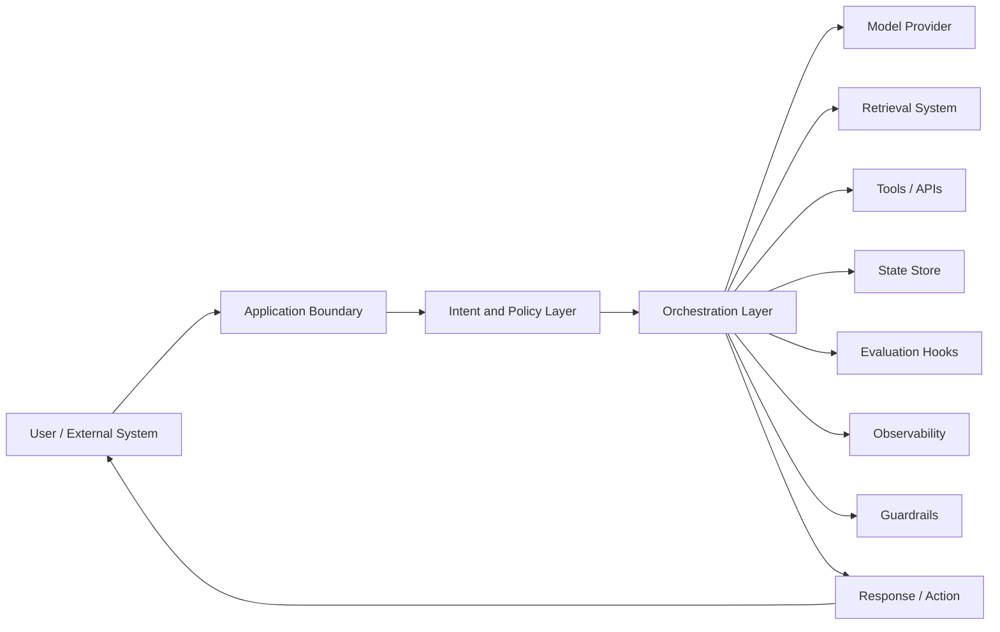
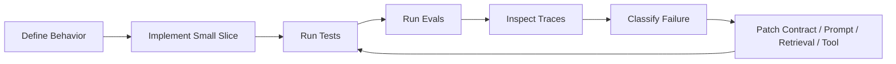
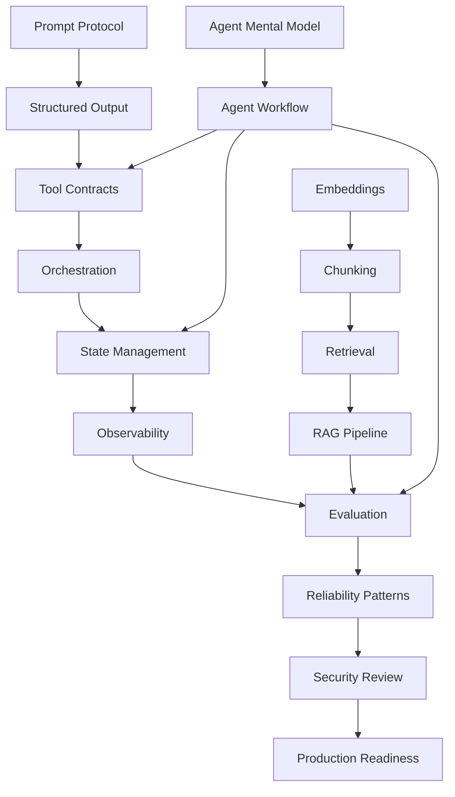

# Part 001 — Kaufman Skill Map

## 1. Tujuan Part Ini

Part ini bukan materi coding pertama. Part ini adalah **peta kendali belajar** untuk seluruh seri `learn-python-ai-application-engineer`.

Targetnya sederhana tapi berat:

> Setelah menyelesaikan seri ini, kamu tidak hanya bisa membuat chatbot, tetapi mampu merancang, membangun, mengevaluasi, mengamankan, dan mengoperasikan AI application yang layak masuk production environment.

Kita akan memakai kerangka Josh Kaufman dari *The First 20 Hours* sebagai struktur belajar:

1. tentukan target performance yang spesifik,
2. pecah skill menjadi subskill,
3. pelajari cukup teori untuk bisa berlatih dan mengoreksi diri,
4. hilangkan hambatan latihan,
5. lakukan deliberate practice dengan feedback loop.

Untuk engineer senior, nilai utama kerangka ini bukan klaim “jadi ahli dalam 20 jam”. Nilai sebenarnya adalah **menghindari pembelajaran kabur**. AI application engineering terlalu luas. Tanpa skill map, mudah terseret ke tutorial framework, benchmark model, prompt trick, atau hype agent tanpa mengembangkan judgment engineering.

---

## 2. Definisi Target: Python AI Application Engineer

Dalam seri ini, **Python AI Application Engineer** berarti engineer yang bisa membangun sistem aplikasi berbasis AI/LLM dengan karakteristik berikut:

- menerima input user atau sistem,
- memahami intent dan constraint,
- memanggil model AI secara terkendali,
- mengambil knowledge dari sumber eksternal ketika dibutuhkan,
- memanggil tools/API internal secara aman,
- menghasilkan output yang bisa dipakai manusia atau sistem lain,
- punya evaluasi kualitas,
- punya observability,
- bisa di-debug,
- bisa dioperasikan dengan kontrol biaya, latency, dan risiko.

Bukan fokus utama seri ini:

- training foundation model dari nol,
- riset arsitektur transformer,
- hyperparameter tuning model skala besar,
- data science eksploratif,
- generic Python basics,
- generic web API basics,
- generic DSA/design pattern yang sudah kamu pelajari di seri sebelumnya.

Mental model inti:



Di sistem enterprise, model bukan pusat segalanya. Model adalah **komponen probabilistik** di dalam sistem deterministik yang lebih besar. Engineering yang matang terjadi di boundary, contracts, state, tools, eval, dan operations.

---

## 3. “Top 1%” dalam Konteks Ini

Kita perlu mendefinisikan “top 1%” secara operasional. Bukan berarti selalu tahu library terbaru atau prompt paling trendi. Untuk AI application engineer, standar tinggi terlihat dari kemampuan mengambil keputusan saat sistem ambigu, probabilistik, mahal, dan berisiko.

### 3.1 Engineer rata-rata

Engineer rata-rata biasanya bisa:

- membuat chat endpoint,
- memanggil API LLM,
- membuat prompt,
- menambahkan vector database,
- memakai framework agent,
- mengirim response ke UI.

Itu cukup untuk demo, belum cukup untuk production.

### 3.2 Engineer kuat

Engineer kuat bisa:

- membuat abstraction layer untuk model provider,
- memisahkan prompt, tool, retrieval, state, dan policy,
- membuat structured output,
- membuat test dan eval sederhana,
- mengamati token usage dan latency,
- menambahkan fallback ketika model gagal.

Ini sudah usable untuk internal tools.

### 3.3 Engineer top-tier

Engineer top-tier bisa:

- mendefinisikan target behavior sebelum coding,
- membangun eval dataset sebelum scale-up,
- memahami failure mode RAG dan agent secara spesifik,
- membatasi authority model terhadap tools,
- membuat workflow yang auditable,
- memisahkan deterministic control flow dari probabilistic reasoning,
- mengukur cost per successful task,
- melakukan incident analysis ketika output salah,
- menjelaskan trade-off antara recall, precision, latency, dan risk,
- mendesain human approval untuk aksi berisiko,
- membuat release gate berbasis eval regression,
- menjaga compliance, privacy, dan audit trail.

Seri ini diarahkan ke level ketiga.

---

## 4. Target Performance untuk 20 Jam Pertama

Target 20 jam pertama bukan “menguasai semua AI”. Targetnya harus spesifik, demonstrable, dan cukup kecil untuk dicapai.

Target performance kita:

> Dalam 20 jam practice pertama, kamu mampu membangun Python AI assistant kecil yang menerima request terstruktur, memanggil LLM melalui provider abstraction, menghasilkan structured output tervalidasi, memakai satu tool internal, menyimpan trace minimal, dan memiliki eval set sederhana untuk mengecek regression.

Batas scope 20 jam pertama:

- satu model provider,
- satu endpoint FastAPI atau CLI,
- satu prompt contract,
- satu schema output,
- satu tool function,
- satu eval dataset kecil,
- satu observability log sederhana,
- belum masuk RAG kompleks,
- belum masuk multi-agent,
- belum masuk distributed deployment.

Kita sengaja memotong scope agar practice loop cepat.

### 4.1 Outcome konkret

Setelah 20 jam pertama, kamu harus punya folder seperti ini:

```txt
ai-case-assistant/
  app/
    main.py
    config.py
    models/
      provider.py
      openai_provider.py
    prompts/
      triage_prompt.md
    schemas/
      triage.py
    tools/
      case_policy_lookup.py
    orchestration/
      triage_flow.py
    observability/
      tracing.py
  evals/
    triage_cases.jsonl
    run_eval.py
  tests/
    test_triage_schema.py
    test_tool_contract.py
  README.md
```

Ini belum production. Tapi ini sudah cukup untuk melatih pondasi yang benar.

---

## 5. Skill Deconstruction

AI application engineering adalah bundle dari banyak subskill. Jika dipelajari secara acak, hasilnya dangkal. Kita pecah menjadi lapisan.

```mermaid id="skill-deconstruction-ai-app"
flowchart TD
    A[Python AI Application Engineer] --> B[Application Architecture]
    A --> C[Model Interaction]
    A --> D[Context and State]
    A --> E[Retrieval and Knowledge]
    A --> F[Tool and Agent Execution]
    A --> G[Evaluation and Testing]
    A --> H[Observability and Debugging]
    A --> I[Reliability and Performance]
    A --> J[Security and Governance]
    A --> K[Deployment and Operations]

    B --> B1[Boundaries]
    B --> B2[Contracts]
    B --> B3[Layering]

    C --> C1[Prompt Protocol]
    C --> C2[Structured Output]
    C --> C3[Provider Abstraction]

    E --> E1[Ingestion]
    E --> E2[Chunking]
    E --> E3[Retrieval]
    E --> E4[Reranking]

    F --> F1[Tool Contracts]
    F --> F2[State Machines]
    F --> F3[Human Approval]

    G --> G1[Golden Dataset]
    G --> G2[Rubrics]
    G --> G3[Regression Gates]
```



---

## 6. Subskill Matrix

Gunakan matrix ini sebagai peta seluruh seri.

| Layer | Subskill | Pertanyaan yang Harus Bisa Dijawab | Bukti Kompetensi |
|---|---|---|---|
| Problem framing | AI suitability | Apakah masalah ini cocok untuk AI, rules, search, workflow, atau hybrid? | Decision note yang menolak AI ketika tidak perlu. |
| Product boundary | Human vs system role | Bagian mana yang dibantu AI, bagian mana yang tetap deterministic/human? | User journey dan authority matrix. |
| Model interaction | Prompt protocol | Apa instruksi, input, output, policy, dan refusal rule? | Prompt contract versioned. |
| Model interaction | Structured output | Bagaimana memastikan output bisa diproses sistem? | JSON schema/Pydantic model + validation. |
| Provider abstraction | Model portability | Apa yang berubah jika provider/model diganti? | Interface stabil, adapter terpisah. |
| Context | Context budgeting | Apa yang masuk prompt, apa yang disimpan, apa yang diringkas? | Context assembly function + tests. |
| Retrieval | Knowledge selection | Dokumen mana yang perlu diambil, dengan query apa, dan kenapa? | Retrieval trace dan citation. |
| Tools | Tool safety | Tool apa yang boleh dipanggil, dengan parameter apa, dan otoritas apa? | Tool schema + permission check. |
| Agents | Orchestration | Kapan workflow perlu loop agentic, kapan cukup deterministic chain? | State graph / sequence diagram. |
| Evaluation | Quality measurement | Bagaimana tahu versi baru lebih baik atau lebih buruk? | Eval dataset + scoring report. |
| Observability | Debuggability | Ketika output salah, apa yang bisa dilihat? | Trace per request. |
| Reliability | Failure handling | Apa fallback ketika model, retrieval, atau tool gagal? | Timeout, retry, fallback, degraded response. |
| Security | Threat modeling | Bagaimana sistem menahan prompt injection dan data exfiltration? | Threat model + mitigations. |
| Governance | Auditability | Siapa melakukan apa, berdasarkan input apa, dengan output apa? | Audit log dan provenance. |
| Operations | Release readiness | Apa gate sebelum deploy? | Checklist + canary + rollback. |

---

## 7. Mengubah Skill Map Menjadi Practice Loop

Kaufman menekankan latihan terarah. Dalam AI application engineering, latihan yang baik bukan membaca dokumentasi berjam-jam. Latihan yang baik adalah membuat perubahan kecil, menjalankan eval, melihat failure, lalu memperbaiki desain.

Practice loop yang akan kita gunakan:



Setiap part harus punya minimal satu dari empat bentuk latihan:

1. **Design exercise** — membuat boundary, diagram, contract, atau ADR.
2. **Implementation exercise** — menulis code kecil yang bisa dijalankan.
3. **Evaluation exercise** — membuat dataset, rubric, atau scoring script.
4. **Failure exercise** — sengaja membuat kasus gagal lalu mendiagnosisnya.

---

## 8. Prinsip “Learn Enough to Self-Correct”

Kesalahan umum engineer senior saat masuk AI app adalah over-learning teori atau over-copy framework. Keduanya tampak produktif tapi sering memperlambat judgment.

Yang perlu dipelajari lebih awal bukan semua hal, melainkan cukup untuk tahu:

- apa yang sedang diuji,
- apa asumsi sistem,
- apa failure mode yang mungkin,
- sinyal apa yang harus diamati,
- perbaikan mana yang masuk akal.

Contoh:

| Topik | Jangan mulai dari | Mulai dari |
|---|---|---|
| Prompting | 100 prompt trick | instruction hierarchy, input/output contract, refusal behavior |
| RAG | install vector DB | retrieval failure taxonomy, chunking, metadata, eval |
| Agents | framework agent | state, tool authority, loop termination, human approval |
| Eval | leaderboard | golden tasks, expected behavior, rubric, regression |
| Observability | dashboard cantik | trace yang menjawab “kenapa output ini muncul?” |
| Security | generic checklist | asset, attacker, tool permission, data flow |

---

## 9. Learning Barriers yang Harus Dihilangkan

Kaufman menyebut friction sebagai penghambat practice. Dalam AI engineering, friction sering teknis dan konseptual.

### 9.1 Barrier teknis

- API key belum siap.
- Environment Python tidak stabil.
- Terlalu banyak framework dipilih di awal.
- Tidak ada project skeleton.
- Tidak ada eval runner.
- Tidak ada sample cases.
- Output model tidak deterministic sehingga sulit dites.

Solusi:

- gunakan satu package manager secara konsisten,
- simpan config di `.env`,
- buat CLI kecil sebelum UI,
- mulai dari satu provider,
- pakai schema validation sejak awal,
- buat eval dataset minimal 10 kasus,
- log input/output mentah untuk debugging.

### 9.2 Barrier konseptual

- Menganggap AI app sama dengan prompt.
- Menganggap RAG selalu butuh vector database.
- Menganggap agent selalu lebih advanced daripada workflow deterministic.
- Menganggap hallucination bisa “diselesaikan” hanya dengan prompt.
- Menganggap eval bisa ditunda setelah aplikasi jadi.

Solusi:

- pikirkan AI app sebagai distributed system dengan komponen probabilistik,
- pisahkan inference dari orchestration,
- pisahkan retrieval dari generation,
- pisahkan authority model dari authority aplikasi,
- buat eval sejak prototype pertama.

---

## 10. Roadmap 20 Jam Pertama

Ini bukan keseluruhan seri. Ini adalah ramp awal agar kamu cepat punya sistem kecil yang bisa diutak-atik.

| Jam | Fokus | Output |
|---:|---|---|
| 1 | Problem framing | Tentukan use case: triage kasus regulasi sederhana. |
| 2 | Behavior contract | Tulis expected behavior, refusal rule, dan output schema. |
| 3 | Project skeleton | Buat struktur folder dan config. |
| 4 | Provider abstraction | Buat interface `ModelClient`. |
| 5 | First model call | Buat call sederhana ke provider. |
| 6 | Prompt protocol | Tulis prompt dengan role, task, constraints, output rule. |
| 7 | Structured output | Buat Pydantic schema dan validation. |
| 8 | Repair path | Tangani invalid JSON atau schema mismatch. |
| 9 | Tool contract | Buat satu tool lookup policy lokal. |
| 10 | Tool orchestration | Hubungkan model decision dengan tool call. |
| 11 | State model | Simpan request id, input, output, trace metadata. |
| 12 | Basic tests | Test schema dan tool contract. |
| 13 | Eval dataset | Buat 10-20 case dalam JSONL. |
| 14 | Eval runner | Jalankan semua case dan simpan hasil. |
| 15 | Failure taxonomy | Klasifikasikan error: schema, reasoning, missing policy, unsafe. |
| 16 | Prompt iteration | Perbaiki prompt berdasarkan failure, bukan feeling. |
| 17 | Observability | Tambahkan log per stage: prompt, model, tool, output. |
| 18 | Latency/cost notes | Catat token, waktu, dan model choice. |
| 19 | Readiness review | Buat checklist: behavior, eval, trace, fallback. |
| 20 | Retrospective | Tulis apa yang stabil, rapuh, dan perlu masuk backlog. |

Prinsipnya: jangan menunggu sampai “arsitektur sempurna”. Kita ingin sebuah slice kecil yang bisa gagal dengan jelas.

---

## 11. Minimal Capstone untuk 20 Jam Pertama

Use case kecil:

> AI assistant membantu melakukan triage awal terhadap laporan kasus regulasi internal. Assistant harus mengklasifikasikan kategori kasus, tingkat urgensi, alasan ringkas, policy reference, dan rekomendasi next action. Assistant tidak boleh mengambil keputusan enforcement final.

### 11.1 Input contoh

```json
{
  "case_id": "CASE-2026-001",
  "report_text": "A licensed entity failed to submit mandatory monthly transaction reports for two consecutive periods and ignored one reminder.",
  "jurisdiction": "internal-demo",
  "submitted_by": "operations"
}
```

### 11.2 Output target

```json
{
  "case_id": "CASE-2026-001",
  "category": "reporting_non_compliance",
  "urgency": "medium",
  "confidence": 0.78,
  "rationale": "The report describes repeated missed mandatory reporting deadlines and a failed reminder response.",
  "policy_references": ["POLICY-REPORTING-001"],
  "recommended_next_action": "Open preliminary review and send final compliance notice.",
  "requires_human_review": true
}
```

### 11.3 Kenapa use case ini bagus?

Karena memaksa kita melatih banyak subskill sekaligus:

- classification,
- structured output,
- policy lookup,
- confidence handling,
- human review boundary,
- refusal terhadap keputusan final,
- auditability.

Use case ini juga dekat dengan sistem regulasi/case management sehingga bisa berkembang menjadi capstone Part 034.

---

## 12. Design Constraint Awal

Kita tetapkan constraint agar latihan tidak melebar:

| Area | Constraint |
|---|---|
| Runtime | Python service atau CLI sederhana. |
| Framework | Minimal; framework dipilih setelah kontrak jelas. |
| Model | Satu provider dulu. |
| Output | Wajib structured output. |
| Tool | Satu local deterministic tool. |
| Retrieval | Belum vector DB; policy lookup lokal dulu. |
| Eval | JSONL dataset kecil. |
| Observability | Log berbasis request id. |
| Security | Tidak ada autonomous write action. |
| Human review | Semua rekomendasi enforcement wajib human review. |

Constraint ini melatih disiplin. Banyak AI prototype gagal karena terlalu cepat menambahkan fitur sebelum memiliki baseline behavior.

---

## 13. Skill Dependency Graph

Beberapa topik harus dipahami sebelum topik lain agar seri tidak terasa acak.



Catatan penting: evaluation tidak diletakkan di akhir sebagai formalitas. Ia menjadi loop yang mempengaruhi prompt, tool, retrieval, dan orchestration.

---

## 14. Taxonomy Subskill: Dari Beginner ke Advanced

### 14.1 Prompting

| Level | Ciri |
|---|---|
| Basic | Menulis instruksi natural language. |
| Intermediate | Memisahkan role, task, constraints, examples. |
| Advanced | Prompt menjadi protocol versioned dengan input/output contract, refusal policy, dan test cases. |
| Expert | Prompt diperlakukan sebagai artifact yang dievaluasi, di-review, di-versioning, dan di-observe di production. |

### 14.2 Structured output

| Level | Ciri |
|---|---|
| Basic | Meminta model mengembalikan JSON. |
| Intermediate | Memvalidasi JSON dengan schema. |
| Advanced | Menangani invalid output, partial failure, repair, fallback, dan confidence. |
| Expert | Schema menjadi boundary antar-service, masuk contract tests, compatibility policy, dan migration strategy. |

### 14.3 RAG

| Level | Ciri |
|---|---|
| Basic | Simpan dokumen ke vector DB dan query. |
| Intermediate | Chunking, metadata, filtering, similarity threshold. |
| Advanced | Hybrid retrieval, reranking, citation, query rewrite, freshness, permission filtering. |
| Expert | Retrieval dievaluasi sebagai subsystem dengan recall/precision, failure taxonomy, lineage, governance, dan operational SLO. |

### 14.4 Agents

| Level | Ciri |
|---|---|
| Basic | Model bisa memanggil tool. |
| Intermediate | Ada planner dan executor. |
| Advanced | Workflow berbasis state graph, checkpoint, interrupt, human approval, dan tool permission. |
| Expert | Agent diperlakukan sebagai controlled workflow engine dengan auditability, rollback, idempotency, dan blast-radius control. |

---

## 15. Invariants Seri

Invariants adalah aturan yang tidak boleh berubah sepanjang seri.

### 15.1 Model tidak boleh menjadi source of authority tunggal

Model boleh membantu reasoning, summarization, classification, drafting, dan recommendation. Tapi otoritas final harus berasal dari:

- data resmi,
- policy resmi,
- business rule,
- tool deterministic,
- human approval,
- system-level constraint.

### 15.2 Output model harus dianggap untrusted

Output model harus divalidasi, disanitasi, dikaitkan dengan provenance, dan tidak boleh langsung mengeksekusi aksi berisiko.

### 15.3 Evaluation adalah bagian dari development, bukan QA akhir

Setiap perubahan prompt, model, retrieval, atau tool harus bisa diuji terhadap expected behavior.

### 15.4 Observability harus menjawab “kenapa”

Log yang hanya menyimpan status `success` tidak cukup. Trace harus bisa menunjukkan:

- input yang diterima,
- prompt yang dibangun,
- model yang dipakai,
- tools yang dipanggil,
- dokumen yang diambil,
- output yang divalidasi,
- error/fallback yang terjadi.

### 15.5 Security harus dimodelkan sebagai data-flow problem

Prompt injection bukan masalah prompt saja. Ia adalah masalah authority, context mixing, tool access, dan data boundary.

---

## 16. Engineering Artifacts yang Akan Dibuat Selama Seri

Seri ini tidak hanya menghasilkan catatan teori. Setiap kelompok part akan menghasilkan artifact.

| Artifact | Fungsi |
|---|---|
| Skill map | Menentukan learning target dan subskill. |
| Architecture decision record | Menjelaskan pilihan model, framework, retrieval, eval, deployment. |
| Prompt contract | Mendefinisikan task, constraints, output, refusal. |
| Schema contract | Menjamin output bisa diproses sistem. |
| Tool registry | Mengontrol tool apa yang boleh dipanggil model. |
| Eval dataset | Mengukur kualitas dan regression. |
| Trace model | Mempermudah debugging dan incident review. |
| Failure taxonomy | Mengklasifikasikan error agar perbaikan tepat. |
| Threat model | Mengidentifikasi risiko prompt injection, data leakage, unsafe action. |
| Readiness checklist | Menentukan apakah fitur siap release. |
| Runbook | Panduan operasi saat incident. |

---

## 17. Minimal Artifact Template: AI Feature Brief

Sebelum menulis code AI, isi brief ini.

```md
# AI Feature Brief

## 1. Problem
Apa masalah user atau sistem yang ingin diselesaikan?

## 2. Why AI?
Kenapa rule/search/workflow biasa tidak cukup?

## 3. User Journey
Di titik mana AI muncul?

## 4. Authority Boundary
Apa yang boleh AI putuskan?
Apa yang hanya boleh direkomendasikan?
Apa yang wajib human approval?

## 5. Inputs
Data apa yang digunakan?
Apakah ada PII/sensitive data?

## 6. Outputs
Format output apa yang diharapkan?
Siapa consumer output-nya?

## 7. Failure Modes
Apa dampak jika output salah?
Apa fallback-nya?

## 8. Evaluation
Bagaimana kualitas diukur?
Dataset apa yang tersedia?

## 9. Observability
Apa yang harus bisa dilihat ketika debugging?

## 10. Release Gate
Apa syarat minimal sebelum production?
```

Template sederhana ini akan mencegah masalah klasik: coding dulu, baru bingung mengukur benar/salahnya.

---

## 18. Failure-First Thinking

AI apps sering tampak bagus dalam happy path. Kualitas sebenarnya terlihat saat gagal.

### 18.1 Failure classes

| Failure Class | Contoh | Perbaikan yang Mungkin |
|---|---|---|
| Input ambiguity | User request terlalu kabur. | Clarification strategy, structured intake. |
| Prompt violation | Model tidak mengikuti instruksi. | Prompt contract, schema, stronger validation. |
| Schema failure | Output tidak sesuai field/type. | Structured output, parser, repair, fallback. |
| Retrieval miss | Dokumen relevan tidak terambil. | Query rewrite, chunking, hybrid search. |
| Retrieval noise | Dokumen tidak relevan masuk context. | Reranking, filters, threshold. |
| Hallucinated citation | Model mengutip sumber yang tidak ada. | Citation binding, context-only answer. |
| Unsafe tool call | Tool dipanggil dengan parameter berbahaya. | Permission, validation, approval gate. |
| Looping agent | Agent terus berpikir tanpa selesai. | Step limit, termination condition. |
| Cost explosion | Token/context terlalu besar. | Budgeting, caching, model routing. |
| Latency spike | Response terlalu lambat. | Streaming, parallel retrieval, fallback. |
| Data leak | Sensitive context muncul di output. | Redaction, policy, access control. |
| Audit gap | Tidak bisa menjelaskan output. | Trace, provenance, immutable audit log. |

### 18.2 Debugging order

Ketika output salah, jangan langsung ganti model. Urutan diagnosis:

1. Apakah input cukup jelas?
2. Apakah prompt contract jelas?
3. Apakah schema memaksa output yang benar?
4. Apakah context yang diberikan benar?
5. Apakah tool mengembalikan data benar?
6. Apakah model salah reasoning?
7. Apakah fallback/human approval seharusnya aktif?
8. Apakah eval dataset sudah mencakup kasus ini?

Ganti model biasanya bukan langkah pertama. Ia hanya salah satu control surface.

---

## 19. Anti-Pattern Belajar AI Application Engineering

### 19.1 Tutorial stacking

Membaca 20 tutorial framework tanpa pernah membuat eval. Akibatnya kamu tahu banyak API, tapi tidak bisa menjawab apakah sistem membaik atau memburuk.

### 19.2 Prompt mysticism

Menganggap kualitas sistem terutama ditentukan oleh wording prompt. Padahal sistem production lebih sering bergantung pada data boundary, context assembly, schema, tool contract, eval, dan observability.

### 19.3 Agent-first thinking

Memakai agent untuk semua masalah. Banyak workflow lebih aman dan murah jika deterministic dengan satu atau dua model call.

### 19.4 Vector DB cargo cult

Menganggap RAG = embeddings + vector database. RAG yang baik adalah knowledge selection system, bukan sekadar similarity search.

### 19.5 Eval after demo

Menunda eval sampai prototype terlihat bagus. Ini berbahaya karena prompt/model/retrieval iteration menjadi subjektif.

### 19.6 No authority boundary

Membiarkan AI membuat keputusan yang seharusnya milik policy engine, workflow engine, atau human reviewer.

---

## 20. What to Memorize vs What to Internalize

Tidak semua hal perlu dihafal.

### 20.1 Hafalkan

- istilah utama: prompt, context, embedding, retrieval, reranking, tool call, agent, eval, trace,
- failure classes,
- lifecycle AI feature,
- minimum release checklist,
- struktur project dasar,
- schema validation pattern.

### 20.2 Internalisasi

- model adalah probabilistic collaborator,
- aplikasi adalah authority boundary,
- retrieval adalah knowledge selection,
- eval adalah executable specification,
- observability adalah debugging memory,
- security adalah data-flow and permission problem,
- agent adalah stateful control loop, bukan magic intelligence.

---

## 21. Practice: Skill Baseline Assessment

Isi assessment ini sebelum lanjut ke Part 002.

Berikan skor 1-5:

| Subskill | Skor | Bukti Saat Ini | Gap |
|---|---:|---|---|
| Prompt contract design | | | |
| Structured output validation | | | |
| Provider abstraction | | | |
| Tool calling design | | | |
| Context management | | | |
| Embedding mental model | | | |
| RAG design | | | |
| Agent workflow design | | | |
| Eval dataset design | | | |
| LLM-as-judge calibration | | | |
| Observability/tracing | | | |
| Cost/latency control | | | |
| Prompt injection mitigation | | | |
| Privacy/governance | | | |
| Deployment/readiness | | | |

Interpretasi:

- skor 1: pernah dengar,
- skor 2: pernah mencoba tutorial,
- skor 3: bisa membuat prototype,
- skor 4: bisa membuat versi production internal,
- skor 5: bisa mereview desain orang lain dan menemukan failure mode.

Target seri ini bukan semua skor 5. Target realistis adalah banyak area naik ke 4, dan area penting naik ke 5 dalam konteks review/design judgment.

---

## 22. Practice: Define Your First AI Feature

Gunakan format ini untuk capstone kecil 20 jam pertama.

```md
# First AI Feature

## Feature Name
Regulatory Case Triage Assistant

## User
Case intake analyst

## Job To Be Done
Membantu mengklasifikasikan laporan awal dan menyarankan next action awal tanpa membuat keputusan final.

## Input
Case report text, jurisdiction, source channel, submitted date.

## Output
Category, urgency, rationale, policy references, next action, human review flag.

## Non-Goals
Tidak membuat enforcement decision final.
Tidak mengirim notifikasi eksternal otomatis.
Tidak mengubah status kasus tanpa approval.

## Main Risk
Salah klasifikasi sehingga kasus urgent tertunda atau kasus low-risk dieskalasi berlebihan.

## Evaluation Idea
20 sample cases dengan expected category, urgency, and required human review flag.
```

---

## 23. Practice: First 10 Eval Cases

Sebelum model dipakai, buat dataset kecil.

```jsonl
{"case_id":"EVAL-001","report_text":"Entity missed two mandatory monthly reports and ignored reminder.","expected_category":"reporting_non_compliance","expected_urgency":"medium","expected_requires_human_review":true}
{"case_id":"EVAL-002","report_text":"Anonymous complaint alleges client fund misuse but provides no evidence.","expected_category":"financial_misconduct_allegation","expected_urgency":"high","expected_requires_human_review":true}
{"case_id":"EVAL-003","report_text":"Entity submitted report one day late due to declared public holiday.","expected_category":"minor_reporting_delay","expected_urgency":"low","expected_requires_human_review":false}
```

Tambahkan minimal 7 kasus lagi sebelum coding serius.

Rule penting: eval cases harus mencakup happy path, ambiguous path, high-risk path, dan refusal path.

---

## 24. Practice: Definition of Done Part 001

Sebelum lanjut, kamu harus bisa menjawab:

1. Apa target performance 20 jam pertama?
2. Subskill apa yang paling penting untuk AI application engineering?
3. Kenapa model tidak boleh menjadi source of authority tunggal?
4. Apa bedanya prompt trick dan prompt protocol?
5. Kenapa eval harus dibuat sejak awal?
6. Apa minimal artifact sebelum coding AI feature?
7. Apa failure class paling berbahaya untuk use case regulasi?
8. Apa bukti bahwa kamu benar-benar belajar, bukan hanya membaca?

Jika jawabanmu masih abstrak, ulangi bagian skill map dan isi assessment.

---

## 25. Key Takeaways

- AI application engineering adalah pekerjaan sistem, bukan sekadar prompt engineering.
- Kerangka Kaufman membantu memotong skill besar menjadi practice loop yang bisa dikuasai bertahap.
- Target 20 jam pertama harus spesifik: satu app kecil dengan provider abstraction, structured output, satu tool, trace, dan eval.
- Top-tier judgment terlihat dari kemampuan mendesain boundary, failure mode, eval, dan operational control.
- Jangan mulai dari framework. Mulai dari behavior, contracts, failure modes, dan evaluation.

---

## 26. References

- Josh Kaufman, *The First 20 Hours: How to Learn Anything... Fast*.
- Josh Kaufman TEDx talk, “The First 20 Hours — How to Learn Anything”.
- OpenAI API documentation: Responses API, Agents, tool/function calling, structured outputs.
- LangGraph documentation: stateful workflows, durable execution, human-in-the-loop patterns.
- OpenTelemetry documentation for tracing concepts.
- OWASP guidance for LLM application risks.

---

## 27. Next Part

Lanjut ke:

`learn-python-ai-application-engineer-part-002-ai-application-engineer-mental-model.mdx`

Part berikutnya akan memperjelas peran AI Application Engineer, boundary dengan ML Engineer/Data Scientist/Platform Engineer, dan mental model sistem probabilistik di dalam enterprise software.
