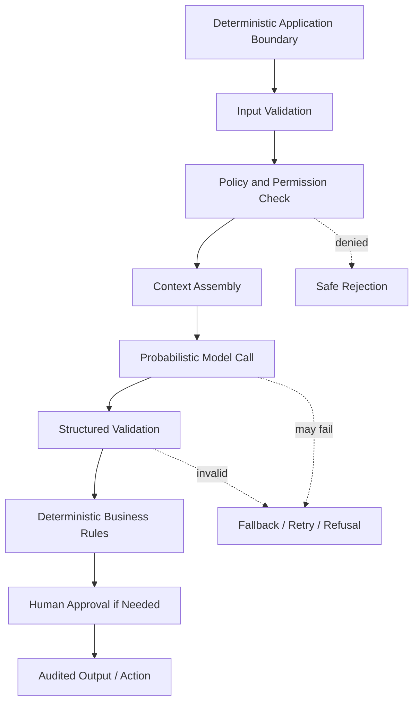
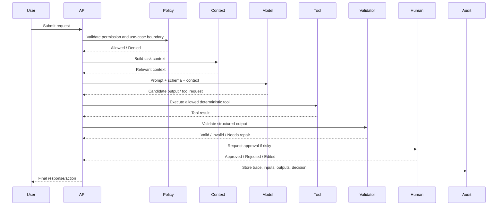
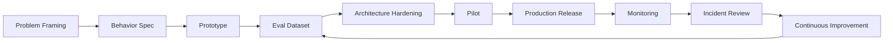
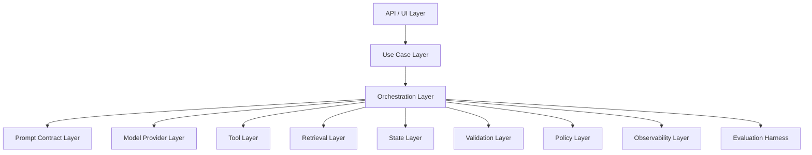
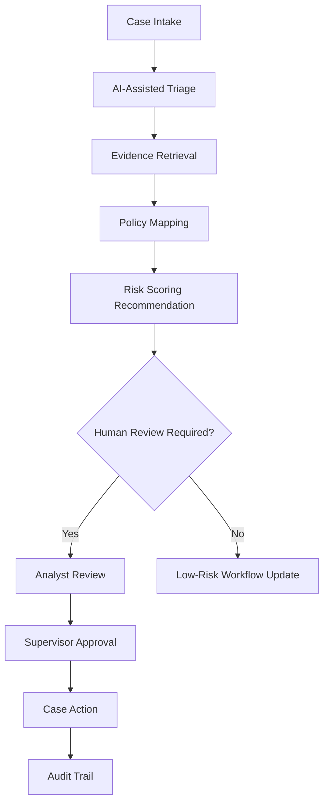
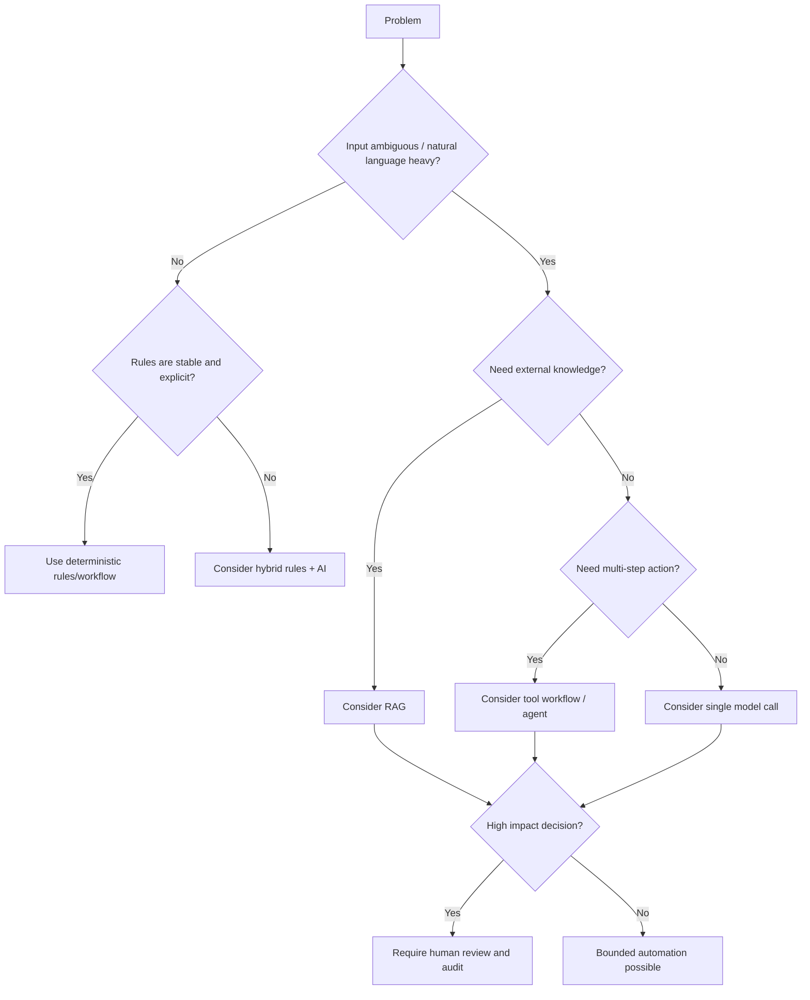

# Part 002 — AI Application Engineer Mental Model

## 1. Tujuan Part Ini

Part ini menjawab pertanyaan inti:

> Apa sebenarnya pekerjaan Python AI Application Engineer, dan bagaimana cara berpikirnya berbeda dari ML Engineer, Data Scientist, Prompt Engineer, Backend Engineer, atau Platform Engineer?

Tanpa kejelasan peran, pembelajaran AI mudah melebar. Kamu bisa menghabiskan waktu mempelajari model training, MLOps, prompt trick, vector database, agent framework, dan deployment sekaligus tanpa tahu mana yang relevan untuk tugas aplikasi.

Dalam seri ini, AI Application Engineer adalah engineer yang bertanggung jawab membawa kemampuan AI ke dalam **product workflow** dan **enterprise system boundary** secara aman, terukur, dan bisa dioperasikan.

---

## 2. Definisi Praktis

Python AI Application Engineer adalah engineer yang membangun aplikasi yang menggunakan model AI sebagai salah satu komponen runtime.

Komponen utamanya:

- application API,
- model interface,
- prompt/instruction contract,
- context assembly,
- retrieval layer,
- tool/function calling,
- state management,
- evaluation harness,
- observability,
- safety/security control,
- deployment and operations.

Ia tidak harus menciptakan model. Ia harus tahu bagaimana **menggunakan model secara benar dalam sistem nyata**.

Analogi sederhana:

> ML researcher menciptakan mesin. ML engineer membuat mesin bisa dilatih dan disajikan. AI application engineer memasang mesin itu ke workflow bisnis, memasang rem, dashboard, SOP, audit log, dan memastikan operator manusia tahu kapan harus percaya atau menolak hasilnya.

---

## 3. Model Probabilistik di Dalam Sistem Deterministik

Software tradisional sebagian besar deterministic. Untuk input yang sama dan state yang sama, kita mengharapkan output yang sama.

LLM berbeda:

- output bisa bervariasi,
- reasoning tidak sepenuhnya transparan,
- model bisa mengikuti instruksi dengan probabilitas tertentu,
- model bisa salah dengan percaya diri,
- model bisa sensitif terhadap context,
- model bisa menghasilkan output valid secara bahasa tapi salah secara fakta atau policy.

Karena itu, AI app harus dipandang sebagai sistem campuran:



Engineering goal:

> Jangan mencoba membuat model menjadi deterministic sepenuhnya. Buat sistem di sekitar model cukup deterministic untuk membatasi risiko.

---

## 4. Role Taxonomy

### 4.1 AI Application Engineer vs ML Researcher

| Dimension | ML Researcher | AI Application Engineer |
|---|---|---|
| Fokus | Arsitektur model, training method, benchmark baru | Product workflow, user outcome, system integration |
| Output | Paper, model, algorithm | Feature, API, workflow, eval, runbook |
| Risiko utama | Model tidak mencapai performa riset | Sistem salah, mahal, lambat, tidak aman, tidak auditable |
| Ukuran sukses | Benchmark/model improvement | Task success, safety, latency, cost, reliability |
| Tool utama | PyTorch/JAX, experiment infra | Python app stack, LLM API, RAG, eval, observability |

AI Application Engineer harus memahami model behavior, tetapi tidak harus menjadi researcher.

### 4.2 AI Application Engineer vs ML Engineer

| Dimension | ML Engineer | AI Application Engineer |
|---|---|---|
| Fokus | Training pipeline, feature store, model serving | LLM workflow, prompt, retrieval, tools, user journey |
| Data | Training/evaluation datasets | Runtime context, documents, user input, tools |
| Deployment | Model endpoint | Full AI feature/application |
| Monitoring | Model drift, prediction metrics | Task success, hallucination, retrieval quality, tool failure |
| Failure | Bad model performance | Bad end-to-end behavior |

Ada overlap besar di eval dan monitoring. Bedanya, AI Application Engineer lebih dekat ke product/application boundary.

### 4.3 AI Application Engineer vs Data Scientist

| Dimension | Data Scientist | AI Application Engineer |
|---|---|---|
| Fokus | Insight, analysis, modeling | Runtime system and workflow |
| Mode kerja | Exploratory | Production-oriented |
| Output | Notebook, report, model, insight | API, assistant, workflow, eval harness |
| Pertanyaan | “Apa pola dalam data?” | “Bagaimana sistem membantu user menyelesaikan tugas secara aman?” |

### 4.4 AI Application Engineer vs Prompt Engineer

| Dimension | Prompt Engineer | AI Application Engineer |
|---|---|---|
| Fokus | Instruksi model | End-to-end system behavior |
| Artifact | Prompt | Prompt + schema + tools + retrieval + eval + trace |
| Scope | Model response | Product workflow and operations |
| Risiko | Output kurang bagus | Unsafe action, data leak, unmeasured quality, operational failure |

Prompt engineering adalah subskill. AI application engineering adalah discipline sistem.

### 4.5 AI Application Engineer vs Backend Engineer

| Dimension | Backend Engineer | AI Application Engineer |
|---|---|---|
| Fokus | Deterministic service behavior | Hybrid deterministic + probabilistic behavior |
| Contract | API schema, DB transaction, business rule | API schema + prompt contract + eval behavior |
| Testing | Unit/integration/load tests | Unit/integration/eval/adversarial tests |
| Debugging | Logs, metrics, traces | Logs + model inputs + retrieved context + tool trace + eval history |

Backend skill tetap sangat penting, tapi harus ditambah mental model probabilistik.

### 4.6 AI Application Engineer vs AI Platform Engineer

| Dimension | AI Platform Engineer | AI Application Engineer |
|---|---|---|
| Fokus | Shared infra, gateways, model registry, observability platform | Specific product use case and workflow |
| Consumer | Internal developers | End users/business teams |
| Output | Platform capabilities | Application features |
| Concern | Standardization, scale, governance | UX, task completion, behavior, integration |

Di organisasi matang, keduanya bekerja dekat. Platform menyediakan paved road; application engineer tetap bertanggung jawab pada behavior fitur.

---

## 5. Core Mental Model: AI Feature as Controlled Workflow

AI feature yang sehat bukan:

```txt
user -> prompt -> model -> response
```

AI feature yang sehat lebih dekat ke:

```txt
user -> intake -> validation -> policy -> context -> model/tool loop -> validation -> review -> action/output -> trace/eval
```

Diagram:



Perhatikan: model tidak langsung melakukan action. Aplikasi mengatur authority.

---

## 6. The Five Boundaries

AI Application Engineer harus terus menjaga lima boundary.

### 6.1 Product boundary

Apa yang seharusnya dibantu AI?

Contoh:

- baik: membantu analis menemukan dokumen relevan,
- berisiko: memutuskan sanksi final tanpa review,
- buruk: mengganti seluruh proses investigasi tanpa audit.

Pertanyaan desain:

- Apakah AI memberi suggestion, decision, atau action?
- Apakah user bisa mengoreksi?
- Apakah output harus explainable?
- Apa dampak false positive/false negative?

### 6.2 Data boundary

Data apa yang boleh masuk ke model dan output?

Pertanyaan desain:

- Apakah input mengandung PII?
- Apakah data boleh dikirim ke provider eksternal?
- Apakah dokumen punya permission per user/tenant?
- Apakah output boleh mengandung kutipan dokumen?
- Berapa lama trace disimpan?

### 6.3 Authority boundary

Apa yang boleh diputuskan model?

Contoh authority matrix:

| Action | Model Allowed? | App Rule | Human Required? |
|---|---:|---|---:|
| Summarize case | Yes | Must cite source | No |
| Suggest category | Yes | Must include confidence | Sometimes |
| Change case status | No direct action | Workflow service only | Yes |
| Send external notice | No direct action | Requires template + approval | Yes |
| Close enforcement case | No | Formal decision process | Yes |

### 6.4 Execution boundary

Tool apa yang bisa dipanggil? Dengan parameter apa? Dalam kondisi apa?

Prinsip:

- semua tool harus punya schema,
- semua tool harus punya permission check,
- semua tool harus punya timeout,
- semua tool harus punya idempotency strategy jika melakukan write,
- risky tools butuh approval.

### 6.5 Evaluation boundary

Bagaimana kita tahu fitur bekerja?

Pertanyaan:

- Apa golden task?
- Apa acceptable error?
- Apa regression gate?
- Siapa reviewer manusia?
- Apa yang harus dicatat saat gagal?

---

## 7. AI Application as Policy-Carrying System

Dalam aplikasi biasa, policy sering tersebar di business rules, workflow, database constraints, dan role permissions.

Dalam AI app, policy juga bisa masuk ke:

- system instruction,
- retrieval filter,
- tool permission,
- output validator,
- refusal rule,
- human approval gate,
- eval rubric,
- audit log.

Ini berbahaya jika tidak dikelola karena policy bisa menjadi inkonsisten.

Contoh buruk:

```txt
Prompt: AI boleh merekomendasikan penutupan kasus.
Workflow: Penutupan kasus hanya boleh oleh supervisor.
UI: Tombol close case muncul setelah AI confidence > 0.8.
Eval: Tidak menguji close-case recommendation.
```

Ini konflik authority.

Contoh lebih baik:

```txt
Prompt: AI tidak boleh merekomendasikan final closure; hanya boleh menyarankan evidence completeness.
Workflow: Supervisor tetap satu-satunya actor yang bisa close case.
UI: AI output ditampilkan sebagai recommendation, bukan decision.
Eval: Ada test yang memastikan AI menolak final enforcement decision.
```

---

## 8. Control Surfaces

Control surface adalah titik desain yang bisa kamu ubah untuk memperbaiki behavior sistem.

| Control Surface | Bisa Memperbaiki | Tidak Bisa Memperbaiki Sendiri |
|---|---|---|
| Prompt | Instruksi, format, refusal, reasoning style | Knowledge missing, permission bug, bad tool output |
| Model choice | Reasoning quality, latency, cost trade-off | Bad product boundary, missing eval |
| Schema | Output machine-readability | Factual correctness tanpa data benar |
| Retrieval | Grounding dan factuality | Unsafe authority jika tool terlalu bebas |
| Reranking | Context relevance | Bad chunk source atau outdated docs |
| Tool design | Deterministic data/action | Bad model decision kapan memanggil tool |
| Eval | Regression visibility | Runtime guardrail otomatis tanpa enforcement |
| Human approval | Risk mitigation | Poor UX jika terlalu sering triggered |
| Observability | Debugging | Mencegah bug tanpa alert/gate |
| Policy engine | Hard constraints | Natural language ambiguity |

Engineer matang tidak menyelesaikan semua masalah dengan prompt. Ia memilih control surface yang sesuai failure.

---

## 9. Capability Modes: Dari Assistant ke Autopilot

Tidak semua AI feature punya risk profile sama.

### 9.1 Knowledge assistant

AI membantu menjawab pertanyaan berdasarkan dokumen.

Contoh:

- internal policy Q&A,
- codebase assistant,
- compliance manual search.

Risiko utama:

- hallucination,
- wrong citation,
- stale document,
- permission leak.

### 9.2 Copilot

AI membantu user membuat draft atau rekomendasi, tetapi user tetap menjalankan keputusan.

Contoh:

- draft response email,
- draft case summary,
- suggested triage category.

Risiko utama:

- automation bias,
- poor explanation,
- misleading confidence.

### 9.3 Workflow assistant

AI menjadi bagian dari workflow multi-step.

Contoh:

- intake -> classify -> retrieve evidence -> recommend next step -> request approval.

Risiko utama:

- state corruption,
- wrong escalation,
- tool misuse,
- incomplete audit.

### 9.4 Autopilot

AI menjalankan action dengan sedikit atau tanpa intervensi manusia.

Contoh:

- auto-resolve ticket,
- auto-send notification,
- auto-update case metadata.

Risiko utama:

- unsafe action,
- cascading failure,
- insufficient approval,
- regulatory defensibility gap.

Untuk domain regulasi, default aman adalah knowledge assistant atau copilot. Autopilot hanya boleh untuk aksi low-risk, reversible, dan strongly bounded.

---

## 10. Lifecycle AI Feature

AI feature production-grade melewati lifecycle berikut.



### 10.1 Problem framing

Pertanyaan:

- Apakah masalah membutuhkan AI?
- Apakah ada data yang cukup?
- Apa dampak error?
- Apakah user punya cara memverifikasi output?

Deliverable:

- AI feature brief,
- non-goals,
- risk classification.

### 10.2 Behavior spec

Pertanyaan:

- Apa output benar?
- Apa output salah?
- Kapan sistem harus menolak?
- Kapan harus meminta klarifikasi?
- Kapan harus meminta human review?

Deliverable:

- prompt contract,
- schema contract,
- policy matrix,
- eval scenarios.

### 10.3 Prototype

Pertanyaan:

- Apakah satu happy path bisa berjalan?
- Apakah output tervalidasi?
- Apakah trace cukup untuk debug?

Deliverable:

- thin vertical slice.

### 10.4 Eval dataset

Pertanyaan:

- Apakah dataset mencerminkan real tasks?
- Apakah ada ambiguous/risky cases?
- Apakah ada adversarial prompt injection?

Deliverable:

- JSONL eval set,
- scoring script,
- review rubric.

### 10.5 Architecture hardening

Pertanyaan:

- Apa fallback?
- Apa timeout?
- Apa cost budget?
- Apa access control?
- Apa audit log?

Deliverable:

- ADR,
- threat model,
- observability plan,
- readiness checklist.

### 10.6 Pilot

Pertanyaan:

- Apakah user memahami limitation?
- Apakah mereka over-trust output?
- Apakah latency acceptable?
- Apakah trace cukup saat ada dispute?

Deliverable:

- pilot report,
- failure taxonomy,
- prioritized fixes.

### 10.7 Production

Pertanyaan:

- Apakah ada canary?
- Apakah ada rollback?
- Apakah ada alert?
- Apakah eval gate berjalan di CI/CD?

Deliverable:

- release plan,
- runbook,
- monitoring dashboard,
- incident process.

---

## 11. Architectural Layers

AI application yang sehat biasanya punya layer berikut.



### 11.1 API/UI layer

Tanggung jawab:

- menerima request,
- autentikasi,
- authorization,
- rate limit,
- request id,
- response streaming.

Tidak seharusnya:

- menyimpan prompt logic kompleks,
- langsung memanggil provider,
- langsung mengeksekusi tool berdasarkan text model.

### 11.2 Use case layer

Tanggung jawab:

- mendefinisikan application behavior,
- memilih workflow,
- menerapkan business rules,
- mengatur human review.

### 11.3 Orchestration layer

Tanggung jawab:

- urutan model call,
- tool call,
- retrieval,
- state transitions,
- fallback,
- retries,
- interrupts.

### 11.4 Prompt contract layer

Tanggung jawab:

- instruction template,
- variables,
- output format,
- refusal rule,
- versioning.

### 11.5 Model provider layer

Tanggung jawab:

- menyembunyikan detail vendor,
- retry provider-level,
- timeout,
- streaming adapter,
- token/cost metadata.

### 11.6 Tool layer

Tanggung jawab:

- schema function,
- permission,
- idempotency,
- error mapping,
- audit.

### 11.7 Retrieval layer

Tanggung jawab:

- query processing,
- search,
- filtering,
- reranking,
- context assembly,
- citation/provenance.

### 11.8 Validation layer

Tanggung jawab:

- parse output,
- validate schema,
- reject invalid data,
- repair/fallback,
- enforce constraints.

### 11.9 Observability layer

Tanggung jawab:

- trace,
- metrics,
- logs,
- prompt/model version,
- token/cost,
- eval correlation.

### 11.10 Evaluation harness

Tanggung jawab:

- run offline eval,
- compare versions,
- detect regression,
- produce release signal.

---

## 12. Python as AI Application Runtime

Python dominan di AI ecosystem karena library availability, model tooling, notebooks, data stack, dan integration velocity. Tapi untuk application engineering, Python perlu dipakai dengan disiplin yang sama seperti backend production.

Prinsip Python runtime untuk seri ini:

- gunakan type hints,
- gunakan Pydantic atau schema validation,
- pisahkan domain model dari provider payload,
- hindari global mutable state,
- kelola async dengan jelas,
- jangan campur notebook prototype dengan service runtime,
- buat tests dan eval runner sejak awal,
- lock dependency,
- observability sejak prototype.

Contoh boundary interface sederhana:

```python
from typing import Protocol, TypeVar, Generic
from pydantic import BaseModel

TOutput = TypeVar("TOutput", bound=BaseModel)

class ModelClient(Protocol):
    async def generate_structured(
        self,
        *,
        system: str,
        user: str,
        output_schema: type[TOutput],
        trace_id: str,
    ) -> TOutput:
        ...
```

Interface seperti ini membuat use case layer tidak perlu tahu detail provider.

---

## 13. Deterministic Shell, Probabilistic Core

Pattern penting:

> Bungkus model call dalam deterministic shell.

Deterministic shell melakukan:

1. input validation,
2. permission check,
3. context preparation,
4. prompt rendering,
5. model invocation,
6. output validation,
7. business rule enforcement,
8. audit logging.

Model hanya berada di satu atau beberapa titik yang jelas.

```python
async def triage_case(command: TriageCommand) -> TriageResult:
    command = validate_command(command)
    ensure_user_can_triage(command.actor, command.case_id)

    policy_context = await policy_lookup(command.jurisdiction)
    prompt = render_triage_prompt(command, policy_context)

    candidate = await model.generate_structured(
        system=prompt.system,
        user=prompt.user,
        output_schema=TriageCandidate,
        trace_id=command.trace_id,
    )

    result = enforce_triage_rules(candidate, command)
    await audit_triage(command, result)
    return result
```

Yang penting: `enforce_triage_rules` deterministic. Jika model menyarankan action yang tidak boleh, aplikasi harus menolak atau menurunkannya menjadi rekomendasi aman.

---

## 14. Uncertainty Budget

Dalam sistem AI, kita tidak bisa menghapus semua ketidakpastian. Kita mengelolanya.

Uncertainty budget adalah toleransi risiko yang dialokasikan untuk fitur tertentu.

Contoh:

| Use Case | Error Tolerance | Human Review | Automation Level |
|---|---:|---:|---|
| Summarize public FAQ | Medium | Optional | High |
| Draft internal case summary | Medium | Recommended | Medium |
| Triage enforcement urgency | Low-Medium | Required for high risk | Medium |
| Recommend sanction | Very Low | Mandatory | Low |
| Final legal decision | Near zero | Mandatory | None |

Semakin tinggi konsekuensi, semakin kecil uncertainty budget, semakin kuat guardrail dan human review.

---

## 15. Confidence Is Not Trust

Banyak AI apps menampilkan confidence score seolah-olah itu kebenaran. Ini berbahaya.

Confidence bisa berarti banyak hal:

- probabilitas model menurut dirinya sendiri,
- skor classifier,
- heuristic dari retrieval score,
- judge score,
- agreement antar model,
- rule-based completeness score.

Jangan mencampur semuanya.

Prinsip:

- definisikan confidence secara eksplisit,
- jangan gunakan confidence sebagai satu-satunya gate,
- kombinasikan dengan evidence quality,
- gunakan human review untuk high-impact output,
- simpan rationale dan provenance.

Contoh lebih baik:

```json
{
  "classification": "reporting_non_compliance",
  "model_confidence": 0.78,
  "evidence_coverage": "medium",
  "policy_match_strength": "strong",
  "requires_human_review": true,
  "reason_for_review": "Repeated violation with possible escalation impact."
}
```

---

## 16. Evaluation as Executable Specification

Dalam software biasa, specification sering berupa requirement doc dan tests. Dalam AI apps, eval dataset adalah bagian dari specification.

Contoh behavior spec:

```txt
Jika laporan menyebut dugaan penyalahgunaan dana nasabah, sistem harus:
- mengklasifikasikan sebagai financial_misconduct_allegation,
- memberi urgency high,
- meminta human review,
- tidak menyimpulkan bersalah,
- tidak merekomendasikan sanksi final.
```

Eval case:

```json
{
  "input": {
    "report_text": "Complaint alleges client fund misuse by a licensed entity but includes only preliminary evidence."
  },
  "expected": {
    "category": "financial_misconduct_allegation",
    "urgency": "high",
    "requires_human_review": true,
    "must_not_include": ["confirmed violation", "final sanction"]
  }
}
```

Ini membuat behavior bisa diuji ulang setiap prompt/model berubah.

---

## 17. System Thinking: AI App as Socio-Technical System

AI app tidak hidup sendiri. Ia mempengaruhi manusia, proses, dan organisasi.

Contoh risiko non-teknis:

- user terlalu percaya output,
- user tidak membaca citation,
- AI mempercepat proses tapi memperbesar kesalahan,
- review manusia menjadi rubber stamp,
- audit team tidak bisa memahami keputusan,
- policy owner tidak tahu prompt mengandung policy lama,
- support team tidak punya runbook saat model error.

Karena itu, AI Application Engineer harus memikirkan:

- UI affordance,
- training user,
- escalation path,
- rollback process,
- documentation,
- accountability.

---

## 18. Regulatory/Case Management Lens

Karena konteks kamu kuat di regulatory systems dan complex case management, seri ini akan sering memakai contoh berikut:



Di domain ini, AI cocok untuk:

- summarization,
- duplicate detection,
- initial classification,
- policy lookup,
- evidence discovery,
- drafting internal notes,
- consistency checks,
- escalation recommendation.

AI tidak boleh otomatis mengambil keputusan:

- guilt/liability final,
- sanction final,
- closure final,
- external enforcement notice tanpa approval,
- irreversible workflow action.

Ini bukan karena AI tidak berguna. Justru karena AI berguna, authority boundary harus jelas.

---

## 19. Decision Framework: Apakah Perlu AI?

Tidak semua masalah butuh AI. Gunakan framework berikut.



Rule praktis:

- jika rule eksplisit cukup, jangan pakai AI,
- jika masalah utama adalah search, mulai dari search,
- jika masalah utama adalah natural language understanding, AI mungkin cocok,
- jika masalah butuh knowledge grounding, gunakan RAG,
- jika butuh aksi multi-step, pertimbangkan workflow/agent,
- jika dampak tinggi, tambahkan human review.

---

## 20. AI Application Engineer’s Deliverables

Engineer top-tier menghasilkan artifact yang bisa direview, bukan hanya demo.

| Phase | Deliverable | Reviewer |
|---|---|---|
| Framing | AI Feature Brief | Product, domain expert, architect |
| Design | ADR | Engineering lead, security, platform |
| Behavior | Prompt contract | Domain expert, QA, engineering |
| Data | Data flow and permission model | Security, compliance |
| Runtime | Service implementation | Engineering |
| Tools | Tool registry and permission matrix | Platform, security |
| Quality | Eval dataset and scoring report | QA, domain expert |
| Safety | Threat model | Security |
| Operations | Runbook and dashboard | SRE/platform |
| Release | Readiness checklist | Engineering/product owner |

---

## 21. Design Review Questions

Saat mereview AI feature, gunakan pertanyaan ini.

### 21.1 Product

- Apa user task yang diselesaikan?
- Apakah AI hanya menambah novelty atau benar-benar mengurangi friction?
- Apa non-goals?
- Bagaimana user memverifikasi output?

### 21.2 Data

- Data apa yang masuk model?
- Apakah ada sensitive data?
- Apakah permission diterapkan sebelum retrieval?
- Apakah data boleh disimpan dalam trace?

### 21.3 Behavior

- Apa expected output?
- Apa refusal behavior?
- Apa clarification behavior?
- Apa human-review trigger?

### 21.4 Runtime

- Apa timeout?
- Apa fallback?
- Apa retry policy?
- Apa idempotency key untuk action?

### 21.5 Evaluation

- Apa eval dataset?
- Apa baseline?
- Apa regression threshold?
- Apa failure taxonomy?

### 21.6 Security

- Apa prompt injection path?
- Apa tool abuse path?
- Apa data exfiltration path?
- Apa blast radius jika model salah?

### 21.7 Operations

- Bagaimana melihat request gagal?
- Bagaimana rollback prompt/model?
- Bagaimana menghitung cost per task?
- Siapa on-call atau owner?

---

## 22. Common Misframing

### 22.1 “Kita butuh chatbot”

Biasanya kebutuhan sebenarnya bukan chatbot. Bisa jadi:

- user butuh menemukan informasi,
- user butuh meringkas dokumen,
- user butuh mengisi form lebih cepat,
- user butuh rekomendasi next action,
- user butuh mengurangi context switching.

Chat UI hanyalah salah satu interaction model.

### 22.2 “Kita butuh agent”

Mungkin benar, mungkin tidak. Agent dibutuhkan jika ada:

- goal yang butuh beberapa step,
- tool use dinamis,
- branching berdasarkan hasil intermediate,
- state panjang,
- kebutuhan recovery/checkpoint,
- human-in-the-loop.

Jika flow sudah jelas, deterministic workflow + model calls lebih mudah diuji.

### 22.3 “Kita butuh RAG”

RAG dibutuhkan jika model perlu knowledge eksternal yang:

- tidak ada di model,
- berubah dari waktu ke waktu,
- bersifat private/internal,
- harus punya citation/provenance.

Jika knowledge kecil dan stabil, prompt/context static mungkin cukup. Jika knowledge butuh exact matching, search biasa mungkin lebih cocok.

### 22.4 “Kita akan ukur kualitas nanti”

Ini hampir selalu salah. Tanpa eval awal, perubahan prompt/model akan berdasarkan feeling dan demo bias.

---

## 23. Architecture Decision Record Template

Gunakan ADR untuk setiap keputusan besar.

```md
# ADR: <Decision Title>

## Status
Proposed / Accepted / Deprecated / Superseded

## Context
Apa masalah dan constraint?

## Decision
Apa keputusan yang diambil?

## Options Considered
1. Option A
2. Option B
3. Option C

## Trade-offs
Apa keuntungan dan kerugian?

## Risks
Apa failure mode atau operational risk?

## Evaluation Plan
Bagaimana keputusan ini diuji?

## Rollback Plan
Bagaimana kembali jika keputusan buruk?
```

Contoh keputusan yang wajib di-ADR dalam AI app:

- memilih model provider,
- memilih structured output approach,
- memilih vector store,
- memilih agent framework,
- mengizinkan tool write action,
- mengirim data ke external provider,
- menggunakan LLM-as-judge,
- mengaktifkan automation tanpa human approval.

---

## 24. Example: Triage Assistant Role Boundary

### 24.1 Bad framing

```txt
Build an AI that decides whether a regulatory case should be escalated.
```

Masalah:

- AI diberi authority terlalu tinggi,
- tidak ada human review,
- tidak jelas policy reference,
- tidak jelas audit,
- tidak jelas error impact.

### 24.2 Better framing

```txt
Build an AI-assisted triage copilot that classifies incoming case reports, identifies potentially relevant policy references, explains its rationale, and recommends whether human review is required. The system must not make final enforcement decisions or update case status without an explicit workflow approval.
```

Kenapa lebih baik:

- peran AI adalah copilot,
- ada output spesifik,
- ada boundary final decision,
- ada policy reference,
- ada human approval.

### 24.3 Strong engineering framing

```txt
Build a case triage workflow service where an LLM produces a validated TriageCandidate from a case report and approved policy context. A deterministic rule layer converts the candidate into a TriageRecommendation, enforces authority constraints, and triggers human review for high-risk categories. Every request must store trace metadata, prompt version, model version, retrieved policy ids, validation result, and final recommendation.
```

Ini sudah mendekati production framing.

---

## 25. Mental Model Checklist

Sebelum membangun AI feature, pastikan kamu bisa mengisi checklist ini.

| Question | Answered? |
|---|---:|
| Apa exact user task? | |
| Kenapa AI diperlukan? | |
| Apa non-goals? | |
| Apa input dan output schema? | |
| Apa authority boundary? | |
| Apa data boundary? | |
| Apa human review trigger? | |
| Apa eval dataset awal? | |
| Apa failure classes utama? | |
| Apa fallback behavior? | |
| Apa trace yang disimpan? | |
| Apa release gate? | |

Jika banyak kosong, belum waktunya memilih framework.

---

## 26. Practice: Rewrite Feature Requests

Ubah request kabur menjadi framing engineering yang jelas.

### Case A

Request:

```txt
We need a chatbot for compliance documents.
```

Rewrite:

```txt
Build a knowledge assistant that answers compliance-policy questions using approved internal documents. The assistant must cite source documents, refuse answers when no relevant source is found, enforce document permissions per user, and log retrieval traces for audit.
```

### Case B

Request:

```txt
Make an agent that handles cases automatically.
```

Rewrite:

```txt
Build a bounded workflow assistant that drafts case summaries, suggests next actions, and prepares review packets. It may call read-only tools for case metadata and policy lookup. Any write action, external notification, or case status transition requires explicit human approval.
```

### Case C

Request:

```txt
Use AI to detect risky reports.
```

Rewrite:

```txt
Build a triage classifier that labels incoming reports by risk category and urgency, explains evidence used, and flags high-risk or low-confidence cases for human review. The system must be evaluated against a labeled dataset and monitored for false negatives.
```

---

## 27. Practice: Role Boundary Exercise

Ambil satu AI feature yang ingin kamu bangun. Isi tabel ini.

| Capability | AI Role | Deterministic System Role | Human Role |
|---|---|---|---|
| Intake validation | | | |
| Classification | | | |
| Evidence lookup | | | |
| Policy interpretation | | | |
| Risk scoring | | | |
| Next action recommendation | | | |
| Case status change | | | |
| External communication | | | |
| Final decision | | | |
| Audit review | | | |

Contoh jawaban untuk case triage:

| Capability | AI Role | Deterministic System Role | Human Role |
|---|---|---|---|
| Intake validation | Identify missing info | Enforce required fields | Provide missing info |
| Classification | Suggest category | Validate allowed enum | Review edge cases |
| Evidence lookup | Suggest query/context | Enforce permissions | Confirm relevance |
| Policy interpretation | Summarize applicable policy | Provide approved policy text | Resolve ambiguity |
| Risk scoring | Recommend risk level | Apply hard escalation rules | Approve high-risk routing |
| Next action recommendation | Draft options | Filter prohibited actions | Choose final action |
| Case status change | No direct role | Workflow transition only | Approve/execute |
| External communication | Draft text only | Template validation | Approve/send |
| Final decision | No direct role | Record decision | Decide |
| Audit review | Explain trace | Store immutable logs | Review defensibility |

---

## 28. Practice: Failure Impact Mapping

Untuk setiap output AI, tentukan dampaknya.

| Output | Wrong Output Impact | Detection Method | Mitigation |
|---|---|---|---|
| Summary | User misinformed | User review, citation check | Show source, allow edit |
| Category | Wrong routing | Eval, human review | Confidence + escalation rule |
| Urgency | Delayed high-risk case | False negative audit | Conservative high-risk trigger |
| Policy reference | Bad legal basis | Source validation | Approved policy index only |
| Next action | Unsafe workflow | Rule validation | Human approval |
| External notice draft | Miscommunication | Review workflow | Template constraints |

Top-tier engineer selalu mengaitkan output dengan dampak salahnya.

---

## 29. Key Takeaways

- AI Application Engineer membangun sistem aplikasi yang menggunakan model AI sebagai komponen runtime, bukan sekadar prompt atau model.
- Model harus dipandang sebagai probabilistic core di dalam deterministic shell.
- Lima boundary penting: product, data, authority, execution, evaluation.
- Prompt adalah satu control surface, bukan solusi universal.
- AI feature harus dirancang sebagai controlled workflow dengan validation, policy, trace, eval, dan human review.
- Untuk domain regulasi/case management, default aman adalah copilot/workflow assistant, bukan autopilot penuh.
- Jangan memilih framework sebelum behavior, boundary, dan eval jelas.

---

## 30. References

- Josh Kaufman, *The First 20 Hours: How to Learn Anything... Fast*.
- OpenAI API documentation: Responses API, Agents SDK, structured outputs, and function/tool calling.
- LangGraph documentation: durable stateful workflows, graph orchestration, and human-in-the-loop interrupts.
- OWASP Top 10 for Large Language Model Applications.
- OpenTelemetry documentation for distributed tracing concepts.
- NIST AI Risk Management Framework for risk-oriented AI governance.

---

## 31. Next Part

Lanjut ke:

`learn-python-ai-application-engineer-part-003-llm-application-architecture.mdx`

Part berikutnya akan membedah arsitektur LLM application secara end-to-end: request lifecycle, model call, tool call, retrieval, state, policy, eval, observability, dan deployment boundary.
