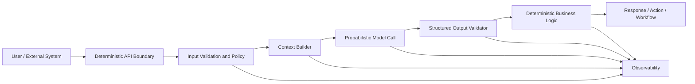
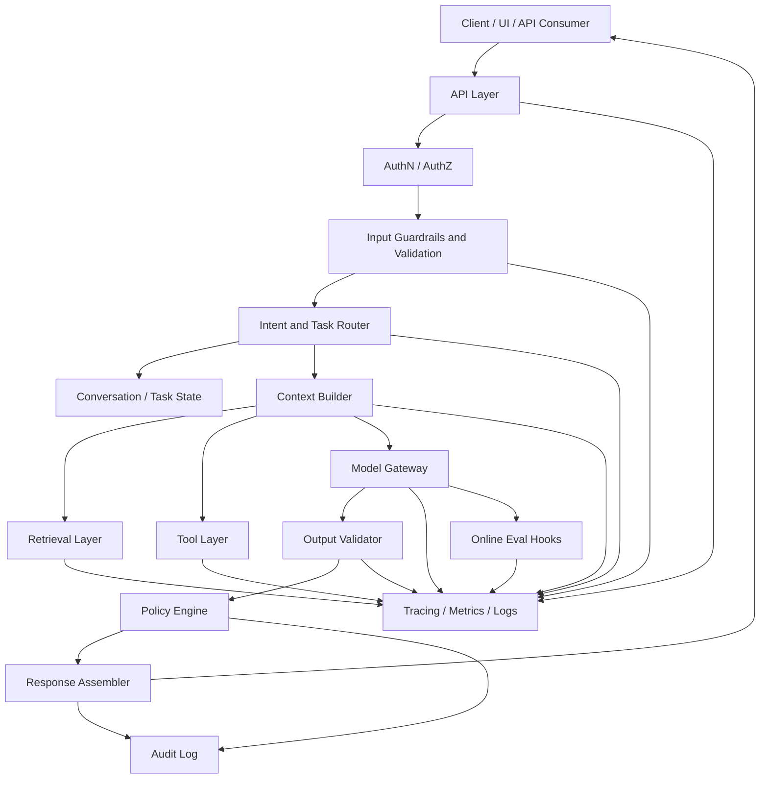
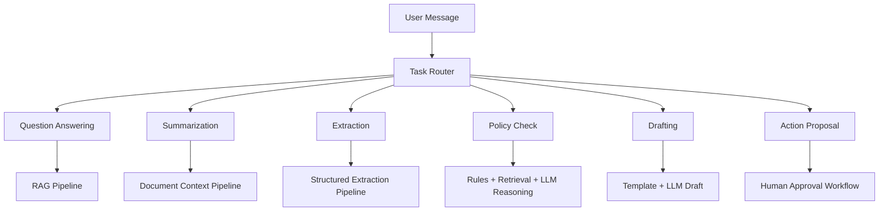
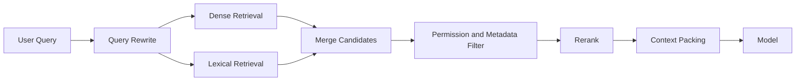
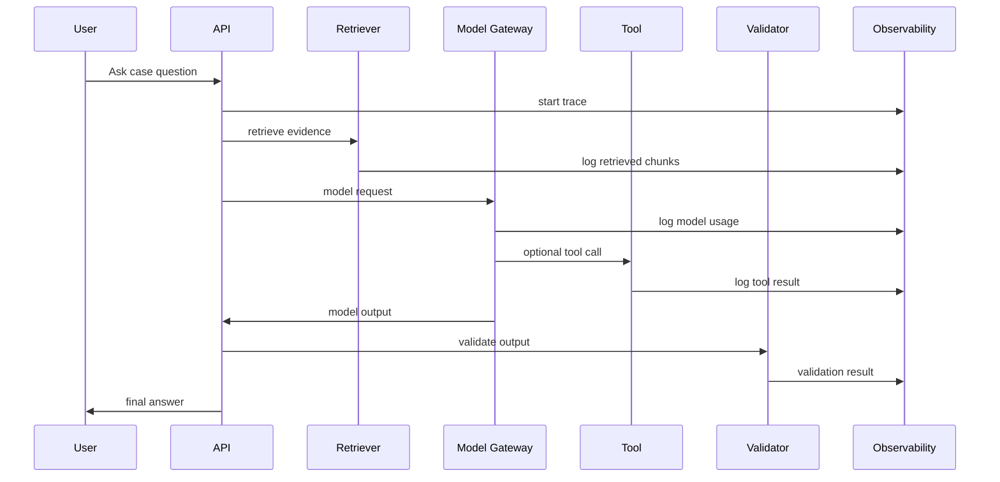
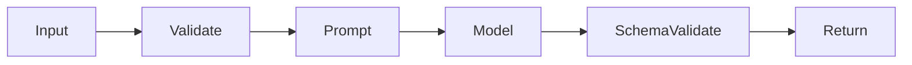
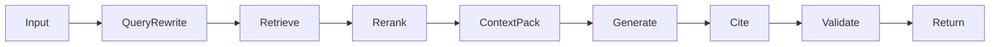
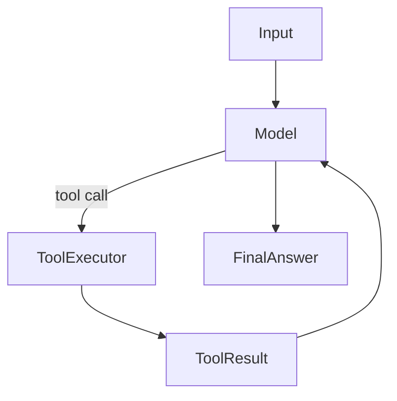
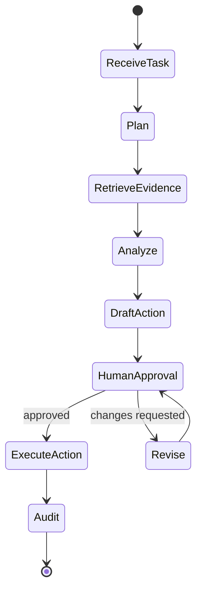
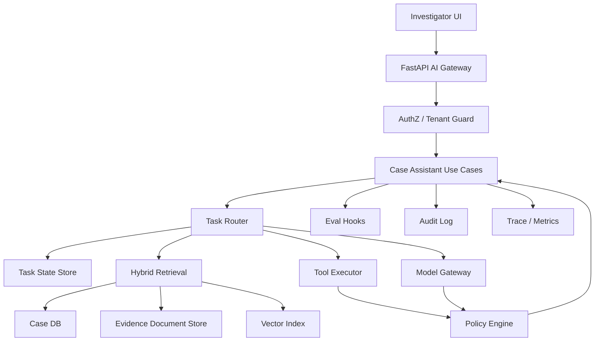

# Part 003 — LLM Application Architecture

## 1. Target Pembelajaran

Setelah menyelesaikan bagian ini, kita tidak hanya bisa membuat endpoint yang memanggil model. Kita harus bisa menjawab pertanyaan arsitektural berikut dengan presisi:

1. **Di mana deterministic code berhenti dan probabilistic model mulai bekerja?**
2. **Kontrak apa yang harus ada di setiap boundary agar sistem tetap bisa dites, diaudit, dan diperbaiki?**
3. **Bagaimana request user berubah menjadi prompt, context, tool calls, output terstruktur, audit log, dan response final?**
4. **Di mana failure paling sering terjadi: input, retrieval, model, tool, orchestration, policy, atau output assembly?**
5. **Bagaimana membangun AI app yang bisa dievaluasi, bukan hanya “terlihat pintar saat demo”?**

Ini adalah fondasi sebelum kita masuk ke prompt, structured output, tool calling, RAG, agents, eval, dan deployment.

> Prinsip Kaufman untuk bagian ini: kita melakukan **deconstruction** terhadap skill “membangun AI application” menjadi komponen-komponen yang bisa dilatih secara terpisah. Tujuannya bukan menghafal framework, tetapi membangun peta mental yang membuat kita bisa self-correct ketika sistem gagal.

---

## 2. Mental Model Utama: Probabilistic Core Inside Deterministic System

Kesalahan paling umum engineer saat mulai membangun LLM app adalah memperlakukan model sebagai function biasa:

```python
answer = llm(prompt)
```

Model seperti itu terlalu sederhana. Dalam sistem produksi, LLM adalah **probabilistic reasoning component** yang harus dikelilingi oleh deterministic control plane.



**LLM app yang baik bukan aplikasi yang “percaya model”.**

LLM app yang baik adalah sistem yang:

- membatasi input;
- membentuk context secara eksplisit;
- memanggil model dengan kontrak yang jelas;
- memvalidasi output;
- mengontrol tool/action;
- mencatat trace;
- mengevaluasi kualitas;
- punya fallback ketika model tidak yakin atau sistem tidak punya bukti cukup.

### 2.1 Deterministic Plane vs Probabilistic Plane

| Area | Deterministic Plane | Probabilistic Plane |
|---|---|---|
| Tugas | Validasi, routing, policy, authorization, storage, retries, orchestration | Reasoning, summarization, extraction, classification, generation |
| Output | Harus predictable | Bisa bervariasi dalam batas kontrak |
| Testing | Unit/integration/contract tests | Eval, golden set, judge, human review |
| Failure | Exception, timeout, inconsistent state | Hallucination, drift, wrong reasoning, poor retrieval usage |
| Ownership | Software engineer | AI app engineer + domain reviewer |

**Invariant:** jangan menyerahkan state mutation, authorization, irreversible action, atau policy enforcement murni kepada model.

Model boleh menyarankan. Sistem yang memutuskan.

---

## 3. Anatomy of a Production LLM Application

Aplikasi LLM production-grade biasanya terdiri dari beberapa boundary. Tidak semua produk butuh semua komponen sejak hari pertama, tetapi engineer harus tahu kapan komponen tersebut diperlukan.



Mari kita bedah komponennya.

---

## 4. Component 1 — API Boundary

API boundary adalah tempat sistem menerima permintaan dari UI, service lain, job queue, webhook, atau batch process.

Untuk AI app, API boundary harus lebih eksplisit dibanding API CRUD biasa karena request sering membawa natural language yang ambiguous.

### 4.1 Tanggung Jawab API Boundary

- Menerima request.
- Memvalidasi format dasar.
- Menentukan user/session/tenant.
- Menetapkan correlation id/request id.
- Menerapkan rate limit.
- Mengarahkan request ke use case yang benar.
- Tidak langsung membangun prompt.

### 4.2 Anti-Pattern

```python
@app.post("/ask")
async def ask(request: Request):
    body = await request.json()
    prompt = body["message"]
    return {"answer": client.responses.create(input=prompt)}
```

Masalah:

- tidak ada schema request;
- tidak ada tenant boundary;
- tidak ada authorization;
- tidak ada task type;
- tidak ada trace metadata;
- tidak ada validation;
- tidak ada output contract;
- tidak ada eval hook;
- tidak bisa direplay dengan aman.

### 4.3 Better Boundary Shape

```python
from pydantic import BaseModel, Field
from typing import Literal

class AskCaseAssistantRequest(BaseModel):
    tenant_id: str
    case_id: str
    user_message: str = Field(min_length=1, max_length=8000)
    mode: Literal["explain", "summarize", "check_policy", "draft_next_action"]
    require_citations: bool = True

class AskCaseAssistantResponse(BaseModel):
    answer: str
    confidence: Literal["low", "medium", "high"]
    citations: list[str]
    warnings: list[str]
    trace_id: str
```

Kita tidak mengirim “text bebas” ke sistem. Kita mengirim **task request**.

---

## 5. Component 2 — Input Validation and Input Policy

Natural language input bisa membawa:

- instruksi user yang sah;
- prompt injection;
- data sensitif;
- instruksi yang melanggar policy;
- usaha untuk bypass authorization;
- query yang terlalu luas;
- ambiguity yang butuh clarification.

Input validation bukan hanya `len(text) > 0`.

### 5.1 Layer Validasi

| Layer | Contoh Validasi | Tujuan |
|---|---|---|
| Shape validation | field wajib, tipe data, panjang input | mencegah request invalid |
| Identity validation | user, tenant, role | memastikan konteks legal |
| Task validation | mode yang didukung | menghindari behavior tidak terkendali |
| Safety validation | PII, harmful request, exfiltration attempt | melindungi data dan sistem |
| Business validation | case status, permission, lifecycle stage | menjaga invariants domain |

### 5.2 Input Policy Example

```python
class InputPolicyDecision(BaseModel):
    allowed: bool
    reason: str | None = None
    requires_clarification: bool = False
    clarification_question: str | None = None
```

Input policy sebaiknya dapat direpresentasikan sebagai data. Dengan begitu, keputusan bisa:

- dites;
- di-log;
- diaudit;
- direview;
- dievaluasi ulang saat policy berubah.

---

## 6. Component 3 — Intent and Task Router

Task router menentukan jenis workflow yang dibutuhkan.

Satu endpoint `/ask` bisa menerima banyak intent:

- menjawab pertanyaan umum tentang case;
- meringkas evidence;
- mengecek policy;
- membuat draft email;
- membuat rekomendasi escalation;
- mengekstrak field;
- membandingkan dokumen;
- memulai tool/action.

Tidak semua intent harus diproses dengan pipeline yang sama.



### 6.1 Router Implementation Choices

| Router Type | Kapan Dipakai | Risiko |
|---|---|---|
| Rule-based | sedikit mode, input sudah eksplisit | kurang fleksibel |
| Model-based classifier | natural language intent banyak variasi | salah klasifikasi |
| Hybrid | production systems | kompleksitas lebih tinggi |
| User-selected mode | enterprise UX yang jelas | user bisa salah pilih |

Untuk sistem enterprise, router terbaik sering bukan full AI. Lebih baik kombinasi:

1. mode eksplisit dari UI;
2. rule deterministic;
3. model classifier untuk ambiguity;
4. fallback clarification.

---

## 7. Component 4 — Context Builder

Context builder adalah salah satu komponen paling penting dalam AI app.

Model hanya bisa menjawab berdasarkan:

- instruksi sistem;
- pesan user;
- conversation state;
- retrieved knowledge;
- tool results;
- memory;
- policy;
- schema output.

Context builder menentukan apa yang boleh masuk ke model.

### 7.1 Context Is Not Just More Text

Kesalahan umum: memasukkan sebanyak mungkin data ke prompt.

Masalahnya:

- token cost naik;
- latency naik;
- signal-to-noise ratio turun;
- model bisa fokus pada konteks salah;
- confidential data bisa ikut terkirim;
- stale knowledge bercampur dengan data baru;
- trace sulit dibaca.

**Context engineering adalah proses memilih evidence yang paling relevan, aman, dan cukup.**

### 7.2 Context Budget

Setiap request harus punya budget:

```python
class ContextBudget(BaseModel):
    max_input_tokens: int
    max_system_tokens: int
    max_history_tokens: int
    max_retrieval_tokens: int
    max_tool_result_tokens: int
    max_output_tokens: int
```

Tanpa budget, context akan tumbuh sampai sistem mahal, lambat, dan sulit diprediksi.

### 7.3 Context Assembly Order

Urutan context memengaruhi behavior model.

Struktur umum:

1. system instruction;
2. policy constraints;
3. task-specific instruction;
4. output schema instruction;
5. relevant conversation state;
6. retrieved evidence;
7. tool results;
8. user request.

Untuk sistem regulasi, evidence dan policy harus diberi metadata:

```text
[Evidence]
source_id: doc-2026-014
source_type: enforcement_policy
version: 2026-05-12
access_scope: tenant:alpha / role:investigator
excerpt:
...
```

Kita tidak ingin model melihat potongan text tanpa provenance.

---

## 8. Component 5 — Retrieval Layer

RAG bukan fitur tambahan. Untuk enterprise AI, retrieval sering menjadi pusat correctness.

Retrieval layer bertanggung jawab mengambil knowledge yang relevan dari:

- vector store;
- keyword search;
- relational database;
- graph database;
- document store;
- case file;
- policy repository;
- audit records;
- event timeline.

### 8.1 Retrieval Is a Pipeline



### 8.2 Retrieval Boundary

Retrieval harus mengembalikan object, bukan raw string.

```python
class RetrievedChunk(BaseModel):
    chunk_id: str
    document_id: str
    title: str
    text: str
    score: float
    source_uri: str | None = None
    version: str | None = None
    metadata: dict[str, str]
```

Mengapa?

Karena output final butuh citation, audit trail, dan diagnostics.

Jika retrieval hanya mengembalikan text, kita kehilangan:

- provenance;
- version;
- permission scope;
- ranking score;
- source lineage;
- repeatability.

---

## 9. Component 6 — Tool Layer

Tool adalah kemampuan eksternal yang dapat digunakan model atau workflow.

Contoh:

- `search_cases`
- `get_case_timeline`
- `retrieve_policy`
- `calculate_penalty_range`
- `draft_notice_letter`
- `create_follow_up_task`
- `request_human_approval`

### 9.1 Tool Is Not Just a Python Function

Tool production-grade harus punya:

- schema input;
- schema output;
- authorization;
- idempotency;
- timeout;
- retry policy;
- audit log;
- side-effect classification;
- approval requirement;
- error taxonomy.

```python
class ToolRiskProfile(BaseModel):
    name: str
    side_effect: Literal["none", "read", "write", "external_write"]
    requires_human_approval: bool
    allowed_roles: list[str]
    timeout_ms: int
    idempotency_required: bool
```

### 9.2 Tool Boundary Categories

| Category | Example | Model boleh langsung? | Catatan |
|---|---|---:|---|
| Pure calculation | compute date range | Ya | deterministic, no side effect |
| Read-only internal | get case status | Ya, jika authorized | harus tenant-aware |
| Read sensitive | read evidence | Mungkin | perlu access control dan audit |
| Draft-only | draft email | Ya | belum mengirim |
| Internal write | create task | Tergantung | idealnya approval untuk critical workflow |
| External write | send email, file report | Tidak langsung | human approval wajib |

**Invariant:** semakin besar side effect, semakin kecil otonomi model.

---

## 10. Component 7 — Model Gateway

Model gateway adalah abstraction layer antara aplikasi dan provider model.

Tanpa gateway, kode bisnis akan penuh dengan detail provider:

- parameter model;
- retry provider-specific;
- tool calling format;
- structured output format;
- streaming event format;
- token counting;
- error codes;
- rate limit behavior;
- telemetry.

### 10.1 Gateway Responsibilities

- Menyediakan interface internal yang stabil.
- Menyembunyikan provider-specific API.
- Menangani retry dan timeout.
- Menangani streaming normalization.
- Menyimpan prompt/model/version metadata.
- Menyediakan token/cost accounting.
- Menyediakan trace span.
- Menyediakan fallback/routing model.

```python
class ModelRequest(BaseModel):
    task_name: str
    system: str
    messages: list[dict]
    output_schema: dict | None = None
    tools: list[dict] = []
    temperature: float = 0.0
    max_output_tokens: int = 1000
    metadata: dict[str, str] = {}

class ModelResponse(BaseModel):
    text: str | None = None
    structured: dict | None = None
    tool_calls: list[dict] = []
    usage: dict[str, int] = {}
    model: str
    provider: str
    finish_reason: str
```

### 10.2 Why Gateway Matters

Model gateway membuat sistem bisa:

- mengganti model tanpa rewrite use case;
- menjalankan A/B eval;
- menurunkan model untuk task murah;
- memakai fallback saat provider error;
- membandingkan cost/performance;
- men-standard-kan observability.

---

## 11. Component 8 — Output Validator

Output dari model tidak boleh langsung dipakai.

Untuk jawaban natural language, kita tetap perlu memvalidasi:

- apakah ada citation jika diwajibkan;
- apakah format sesuai;
- apakah warning ada saat confidence rendah;
- apakah tidak ada forbidden content;
- apakah tidak mengklaim melakukan action yang tidak dilakukan.

Untuk structured output, validator wajib.

```python
class PolicyCheckResult(BaseModel):
    decision: Literal["compliant", "non_compliant", "insufficient_information"]
    reasoning_summary: str
    cited_policy_sections: list[str]
    required_next_actions: list[str]
    confidence: Literal["low", "medium", "high"]
```

Jika output gagal validasi, sistem punya pilihan:

1. repair prompt;
2. re-run dengan instruksi lebih ketat;
3. fallback ke model lain;
4. return safe error;
5. escalate ke human review.

### 11.1 Jangan Repair Tanpa Batas

Repair loop harus punya limit.

```python
MAX_REPAIR_ATTEMPTS = 2
```

Jika tidak, sistem bisa:

- menghabiskan cost;
- membuat latency buruk;
- memperburuk output;
- menyembunyikan masalah prompt/schema.

---

## 12. Component 9 — Policy Engine

Policy engine menentukan apakah output/action boleh dikembalikan atau dieksekusi.

Dalam regulated system, policy engine bisa mencakup:

- user permission;
- data classification;
- case lifecycle status;
- escalation threshold;
- legal hold;
- retention rule;
- required human approval;
- confidence threshold;
- evidence sufficiency.

Policy engine tidak harus full rules engine di awal. Tapi logic policy harus dipisahkan dari prompt.

### 12.1 Example

```python
class ActionProposal(BaseModel):
    action_type: Literal["create_task", "send_notice", "escalate_case"]
    payload: dict
    confidence: Literal["low", "medium", "high"]
    evidence_ids: list[str]

class PolicyDecision(BaseModel):
    allowed: bool
    requires_approval: bool
    reason: str
```

```python
def evaluate_action_policy(proposal: ActionProposal, user_role: str) -> PolicyDecision:
    if proposal.action_type == "send_notice":
        return PolicyDecision(
            allowed=False,
            requires_approval=True,
            reason="External communication requires human approval.",
        )
    if proposal.confidence == "low":
        return PolicyDecision(
            allowed=False,
            requires_approval=True,
            reason="Low confidence output cannot trigger workflow action.",
        )
    return PolicyDecision(allowed=True, requires_approval=False, reason="Allowed.")
```

The model should not be the final policy authority.

---

## 13. Component 10 — State and Memory

Ada tiga konsep yang sering dicampur:

| Concept | Meaning | Example |
|---|---|---|
| Conversation history | pesan dalam sesi | user bertanya follow-up |
| Task state | progress workflow | sudah retrieve, sudah draft, menunggu approval |
| Long-term memory | preference/fact yang disimpan lintas sesi | user prefers terse answers |

Jangan menyimpan semuanya sebagai chat history.

### 13.1 State Shape for AI Workflow

```python
class CaseAssistantState(BaseModel):
    trace_id: str
    tenant_id: str
    user_id: str
    case_id: str
    task_type: str
    conversation_summary: str | None = None
    retrieved_chunk_ids: list[str] = []
    tool_results: dict[str, dict] = {}
    draft_outputs: dict[str, str] = {}
    pending_approval_id: str | None = None
```

Task state harus bisa:

- disimpan;
- direplay;
- diaudit;
- dilanjutkan;
- dibatalkan;
- diobservasi.

Inilah alasan graph/state-machine mindset penting untuk agentic systems.

---

## 14. Component 11 — Observability

AI app tanpa observability seperti distributed system tanpa logs.

Yang perlu dilihat bukan hanya error rate.

### 14.1 Trace Minimal

Setiap request harus mencatat:

- request id / trace id;
- user/tenant metadata aman;
- task type;
- prompt template version;
- model/provider/version;
- input token, output token;
- latency model;
- retrieval query;
- retrieved document ids;
- tool calls;
- tool latency;
- output validation result;
- safety/policy decision;
- final status.



### 14.2 Debugging Questions

Saat output buruk, engineer harus bisa bertanya:

1. Apakah input user ambiguous?
2. Apakah router memilih task salah?
3. Apakah retrieval mengambil dokumen salah?
4. Apakah context packing membuang evidence penting?
5. Apakah prompt terlalu lemah?
6. Apakah model gagal mengikuti schema?
7. Apakah output validator terlalu longgar?
8. Apakah policy engine membiarkan response berisiko?
9. Apakah model/provider berubah?
10. Apakah ada regression dari prompt version baru?

Tanpa trace, semua jawaban hanya tebakan.

---

## 15. Component 12 — Evaluation Hooks

Evaluation bukan fase setelah aplikasi selesai. Evaluation adalah bagian dari arsitektur.

### 15.1 Eval Surface

| Surface | Apa yang Dievaluasi | Contoh Metric |
|---|---|---|
| Router | intent benar | classification accuracy |
| Retrieval | evidence benar ditemukan | recall@k, precision@k |
| Reranker | evidence penting naik | MRR, nDCG |
| Generator | jawaban grounded | faithfulness, citation support |
| Tool use | tool benar dipanggil | tool selection accuracy |
| Workflow | task selesai benar | task completion rate |
| Safety | tidak bocor data | policy violation rate |
| UX | berguna bagi user | thumbs up/down, review score |

### 15.2 Golden Dataset from Day One

Golden dataset minimal:

```yaml
- id: case_policy_001
  input:
    mode: check_policy
    case_id: CASE-123
    user_message: "Apakah case ini sudah memenuhi syarat untuk escalation?"
  expected:
    decision: insufficient_information
    must_cite:
      - policy-escalation-v3
    must_not_claim:
      - "case has been escalated"
```

Golden dataset tidak harus besar di awal. Yang penting mewakili failure mode utama.

---

## 16. Architecture Pattern Catalogue

### 16.1 Pattern A — Single-Turn Structured Task

Cocok untuk:

- classification;
- extraction;
- rewriting;
- simple drafting;
- summarization kecil.



Kelebihan:

- sederhana;
- latency rendah;
- mudah dites.

Kekurangan:

- tidak cocok untuk data external besar;
- tidak cocok untuk multi-step actions.

### 16.2 Pattern B — RAG Question Answering

Cocok untuk:

- policy QA;
- enterprise knowledge assistant;
- case evidence exploration.



Kelebihan:

- bisa grounded pada dokumen;
- bisa memberikan citation;
- knowledge bisa diperbarui tanpa training model.

Kekurangan:

- retrieval failure sering tersembunyi;
- chunking dan metadata sangat menentukan;
- permission filtering wajib.

### 16.3 Pattern C — Tool-Using Assistant

Cocok untuk:

- sistem yang perlu membaca data live;
- kalkulasi;
- database query;
- integrasi internal.



Kelebihan:

- model tidak perlu mengarang data;
- bisa memakai data real-time;
- bisa menggabungkan reasoning dan computation.

Kekurangan:

- tool security risk;
- loop control perlu ketat;
- error tool harus dihandle.

### 16.4 Pattern D — Agentic Workflow

Cocok untuk:

- pekerjaan multi-step;
- research;
- case review;
- workflow dengan approval;
- task yang perlu checkpoint.



Kelebihan:

- cocok untuk long-running tasks;
- state eksplisit;
- bisa ada human-in-the-loop.

Kekurangan:

- kompleksitas tinggi;
- observability wajib;
- perlu failure recovery.

### 16.5 Pattern E — Batch AI Pipeline

Cocok untuk:

- document enrichment;
- case triage batch;
- nightly quality review;
- large-scale extraction.


Kelebihan:

- murah jika batch API tersedia;
- cocok untuk workload besar;
- bisa retry/idempotent.

Kekurangan:

- hasil tidak real-time;
- observability dan deduplication penting.

---

## 17. Architecture Decision: Build vs Framework

Framework seperti LangGraph, LlamaIndex, Pydantic AI, Semantic Kernel, atau provider SDK bisa membantu. Tetapi jangan mulai dari framework.

Mulai dari pertanyaan:

1. Apakah task single-step atau multi-step?
2. Apakah membutuhkan retrieval?
3. Apakah membutuhkan tool/action?
4. Apakah action punya side effect?
5. Apakah butuh human approval?
6. Apakah perlu long-running state?
7. Apakah butuh citation?
8. Apakah data multi-tenant?
9. Apakah perlu eval gate?
10. Apakah request harus streaming?

Baru setelah itu pilih tooling.

### 17.1 Decision Table

| Need | Minimal Choice | When to Upgrade |
|---|---|---|
| Simple structured extraction | provider SDK + Pydantic | banyak schema, eval, retry, tracing |
| Simple RAG | custom pipeline + vector DB | banyak source, rerank, permission, freshness |
| Multi-step workflow | explicit state machine | branch/loop/human approval makin kompleks |
| Agent with tools | provider SDK/tool calling | perlu durable execution dan checkpoint |
| Enterprise orchestration | graph/workflow runtime | perlu audit, resume, interrupt, rollback |

**Rule:** framework tidak menggantikan architecture. Framework hanya mengurangi boilerplate setelah boundary jelas.

---

## 18. Reference Architecture — Regulatory Case Assistant

Sebagai konteks yang relevan untuk complex case management, kita gunakan target architecture berikut sepanjang seri.

### 18.1 Capability

Assistant bisa:

- menjawab pertanyaan tentang case;
- meringkas evidence;
- membuat timeline;
- mengecek policy escalation;
- menyarankan next action;
- membuat draft komunikasi;
- meminta human approval sebelum action;
- menyimpan audit trail.

### 18.2 Architecture



### 18.3 Critical Invariants

1. Assistant tidak boleh membaca case lintas tenant.
2. Assistant tidak boleh mengklaim evidence yang tidak diretrieve.
3. Assistant tidak boleh membuat legal conclusion tanpa policy citation.
4. Assistant tidak boleh mengeksekusi external action tanpa approval.
5. Assistant harus mencatat source document dan version.
6. Assistant harus mengembalikan `insufficient_information` jika evidence tidak cukup.
7. Assistant harus bisa direplay untuk audit.
8. Assistant harus punya eval dataset untuk setiap task penting.

---

## 19. Failure Model

Top 1% AI application engineer tidak hanya mendesain happy path. Ia mendesain sistem agar failure bisa dikenali.

| Failure | Penyebab | Detection | Mitigation |
|---|---|---|---|
| Wrong answer | model reasoning salah | eval, user feedback, judge | better prompt, model, schema, human review |
| Hallucinated citation | context lemah/output unchecked | citation validator | citation-grounded generation |
| Missing evidence | retrieval recall rendah | retrieval eval | query rewrite, hybrid search, rerank |
| Data leakage | permission filter salah | audit, access tests | pre-retrieval auth filter |
| Tool misuse | tool schema/permission lemah | tool trace | tool risk policy, approval |
| Cost spike | context terlalu besar/retry loop | usage metrics | budget, caching, routing |
| Latency spike | slow retrieval/model/tool | traces p95 | timeout, streaming, async, fallback |
| Irreversible wrong action | model diberi write authority | audit incident | human approval, side-effect gates |
| Regression | prompt/model berubah | eval CI | versioning, canary, rollback |

---

## 20. Practice Loop

### 20.1 Exercise A — Draw Your First AI App Boundary

Ambil use case: “assistant menjawab pertanyaan investigator tentang case”.

Buat diagram dengan komponen:

- API boundary;
- auth;
- input policy;
- context builder;
- retrieval;
- model gateway;
- output validator;
- audit log;
- observability.

Tulis 5 invariants.

### 20.2 Exercise B — Classify Your Task Pattern

Untuk masing-masing task berikut, pilih pattern architecture:

1. extract case deadline from uploaded notice;
2. summarize 50-page evidence pack;
3. answer policy question with citation;
4. draft warning letter;
5. create follow-up task in case system;
6. review all open cases nightly and flag escalation candidates.

Jawab dengan format:

```text
Task:
Pattern:
Needs retrieval:
Needs tool:
Needs human approval:
Primary failure mode:
Minimum eval:
```

### 20.3 Exercise C — Build a Failure Table

Pilih satu AI feature yang ingin dibangun. Tulis minimal 10 failure mode dengan kolom:

- failure;
- user impact;
- detection;
- mitigation;
- owner;
- severity.

---

## 21. Checklist Architecture Review

Gunakan checklist ini sebelum menulis kode.

### Boundary

- [ ] Request dan response punya schema.
- [ ] Tenant/user/role jelas.
- [ ] Task type eksplisit.
- [ ] Input length dan content policy jelas.

### Context

- [ ] Context budget ditentukan.
- [ ] Evidence punya provenance.
- [ ] Permission filter dilakukan sebelum retrieval result masuk prompt.
- [ ] Conversation history tidak tumbuh tanpa kontrol.

### Model

- [ ] Model gateway dipisahkan dari business logic.
- [ ] Prompt version dicatat.
- [ ] Model/provider/version dicatat.
- [ ] Token/cost dicatat.

### Tools

- [ ] Tool punya input/output schema.
- [ ] Tool punya risk profile.
- [ ] Tool authorization eksplisit.
- [ ] Write/external action butuh approval.

### Output

- [ ] Output divalidasi.
- [ ] Citation dicek jika diwajibkan.
- [ ] Low confidence punya fallback.
- [ ] System tidak mengklaim action yang belum terjadi.

### Quality

- [ ] Ada golden dataset minimal.
- [ ] Ada trace per request.
- [ ] Ada eval untuk failure utama.
- [ ] Ada rollback strategy untuk prompt/model change.

---

## 22. Key Takeaways

1. AI application architecture adalah soal **kontrol deterministic terhadap komponen probabilistic**.
2. Prompt bukan boundary yang cukup. Boundary harus berupa schema, policy, validator, trace, dan eval.
3. RAG, tools, dan agents adalah pola arsitektur berbeda. Jangan memakai agent ketika state machine sederhana cukup.
4. Context builder adalah pusat kualitas. Garbage context menghasilkan garbage reasoning.
5. Production AI app harus bisa di-debug dari trace, bukan dari feeling.
6. Setiap model call harus dianggap sebagai operation yang punya cost, latency, risk, dan quality profile.
7. Untuk sistem enterprise/regulasi, auditability bukan fitur tambahan. Ia adalah invariant arsitektural.

---

## 23. References

- OpenAI API documentation — Responses API, structured outputs, and tool use.
- LangGraph documentation — stateful, long-running agent orchestration.
- Pydantic documentation — validation, structured data contracts, and Pydantic AI.
- FastAPI documentation — Python API framework based on type hints.
- OWASP guidance for LLM application security, especially prompt injection and insecure tool use.
