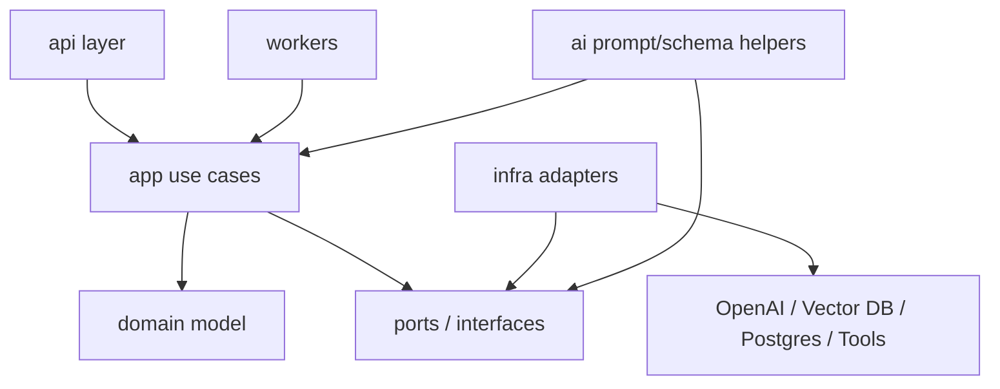
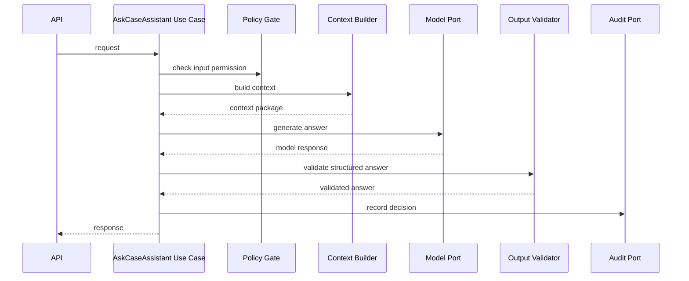
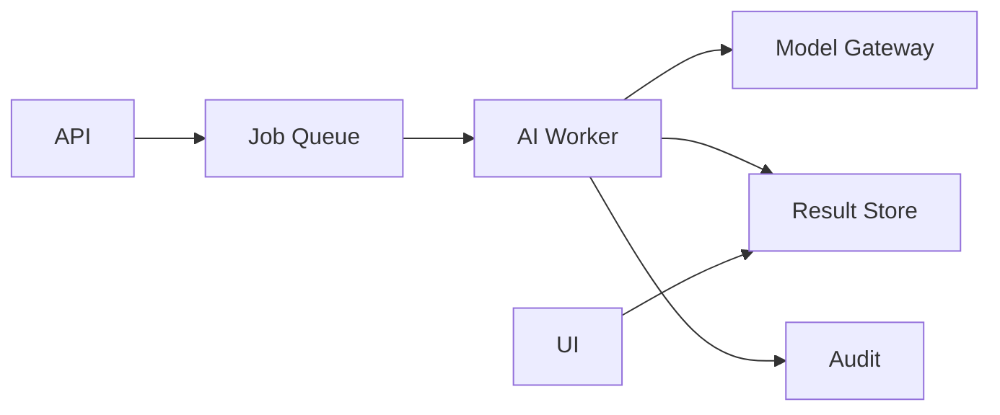
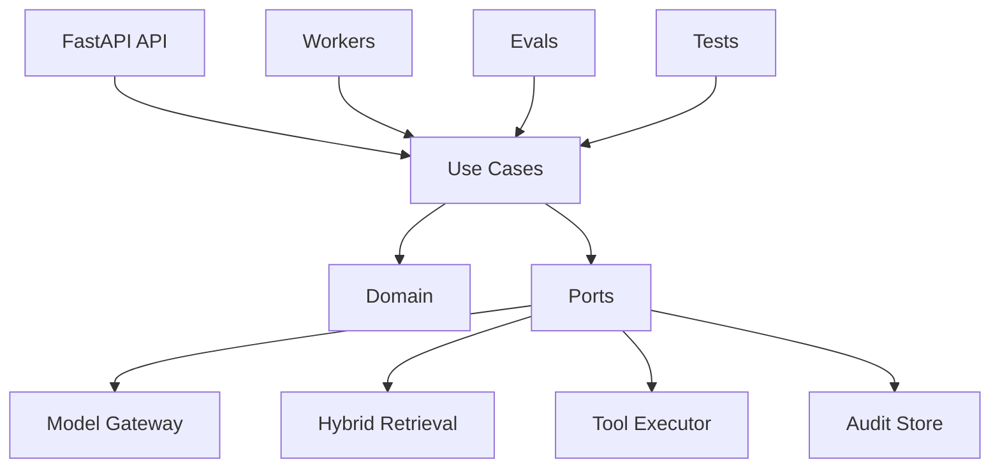

# Part 004 — Python AI Project Architecture

## 1. Target Pembelajaran

Pada bagian sebelumnya kita membuat peta arsitektur LLM application. Bagian ini turun satu level: bagaimana struktur project Python-nya agar tidak berubah menjadi folder `app.py` raksasa berisi prompt, API call, retrieval, parsing, dan business logic bercampur.

Setelah bagian ini, kita harus bisa:

1. Mendesain struktur folder AI app yang tahan tumbuh.
2. Memisahkan domain logic dari provider SDK.
3. Membuat model gateway, tool registry, prompt registry, dan eval harness sebagai first-class component.
4. Menulis kode yang bisa dites tanpa selalu memanggil LLM sungguhan.
5. Menjaga dependency direction agar project tetap maintainable.
6. Menyiapkan layout untuk API, workers, evals, observability, dan deployment.

> Prinsip Kaufman untuk bagian ini: kita menghapus friction. Struktur project yang buruk membuat latihan lambat karena setiap eksperimen prompt/model/retrieval merusak kode produksi. Struktur yang baik membuat feedback loop cepat.

---

## 2. Masalah yang Sering Terjadi di Project AI Python

Banyak AI app dimulai seperti ini:

```text
ai-demo/
  app.py
  prompts.py
  utils.py
  requirements.txt
```

Ini cukup untuk demo. Tetapi ketika masuk production, kebutuhan bertambah:

- multi-provider model;
- structured output;
- streaming;
- RAG;
- tool calling;
- eval dataset;
- prompt versioning;
- tenant-aware retrieval;
- audit log;
- async workers;
- tracing;
- CI eval gate;
- human approval;
- data governance.

Project demo biasanya gagal bukan karena Python tidak mampu, tetapi karena boundary tidak pernah dibuat.

---

## 3. Design Goal

Kita ingin project architecture dengan karakteristik berikut:

| Goal | Meaning |
|---|---|
| Testable | use case bisa dites tanpa network call ke LLM |
| Replaceable | provider/model/vector DB bisa diganti melalui adapter |
| Observable | setiap model/retrieval/tool call punya trace |
| Eval-first | eval dataset dan runner berada dalam repo, bukan spreadsheet terpisah |
| Secure | secret, tenant, permission, dan tool side-effect dipisah jelas |
| Evolvable | prompt/schema/version bisa berubah tanpa merusak semua layer |
| Production-ready | API, workers, config, migrations, deployment, dan CI punya tempat jelas |

---

## 4. High-Level Project Layout

Berikut layout opinionated untuk AI application production-grade.

```text
learn_ai_case_assistant/
  pyproject.toml
  README.md
  .env.example
  docker-compose.yml
  Dockerfile

  src/
    case_ai/
      __init__.py

      api/
        __init__.py
        main.py
        dependencies.py
        routes/
          __init__.py
          assistant_routes.py
          health_routes.py

      app/
        __init__.py
        use_cases/
          ask_case_assistant.py
          check_policy_compliance.py
          draft_next_action.py
        services/
          context_builder.py
          task_router.py
          output_validator.py
          policy_gate.py
        ports/
          model_port.py
          retrieval_port.py
          tool_port.py
          audit_port.py
          state_port.py

      domain/
        __init__.py
        case.py
        evidence.py
        policy.py
        assistant.py
        decisions.py
        errors.py

      ai/
        __init__.py
        prompts/
          case_assistant.system.md
          policy_check.system.md
          draft_next_action.system.md
        prompt_registry.py
        schemas.py
        model_gateway.py
        tool_registry.py
        token_budget.py

      infra/
        __init__.py
        config.py
        logging.py
        observability.py
        model_providers/
          openai_provider.py
          fake_provider.py
        retrieval/
          vector_retriever.py
          keyword_retriever.py
          hybrid_retriever.py
        persistence/
          postgres_state_store.py
          audit_repository.py
        tools/
          case_tools.py
          workflow_tools.py

      workers/
        __init__.py
        ingestion_worker.py
        eval_worker.py
        batch_triage_worker.py

  evals/
    datasets/
      policy_check_golden.yaml
      rag_case_qa_golden.yaml
      tool_use_golden.yaml
    rubrics/
      grounded_answer_rubric.md
      policy_check_rubric.md
    runners/
      run_policy_eval.py
      run_rag_eval.py
      run_tool_eval.py

  tests/
    unit/
      test_task_router.py
      test_context_builder.py
      test_output_validator.py
      test_policy_gate.py
    integration/
      test_case_assistant_api.py
      test_hybrid_retrieval.py
    contract/
      test_model_port_contract.py
      test_tool_contracts.py

  scripts/
    ingest_documents.py
    rebuild_index.py
    run_local_eval.py
```

Tidak semua folder harus dibuat sejak hari pertama. Tetapi layout ini memberi tempat yang benar untuk setiap jenis perubahan.

---

## 5. Dependency Direction

Aturan paling penting: **domain dan use case tidak boleh bergantung pada provider SDK**.



Dalam Clean Architecture terms:

- `domain` adalah business language dan invariant;
- `app` adalah orchestration/use case;
- `ports` adalah interface yang dibutuhkan use case;
- `infra` adalah adapter ke dunia luar;
- `api` adalah delivery mechanism;
- `evals` adalah quality harness;
- `workers` adalah asynchronous delivery mechanism.

### 5.1 Forbidden Dependencies

| Dari | Tidak boleh langsung bergantung ke | Kenapa |
|---|---|---|
| `domain` | OpenAI SDK, FastAPI, vector DB, Pydantic AI framework | domain harus stabil |
| `app/use_cases` | provider-specific SDK | sulit dites dan diganti |
| `api/routes` | prompt template detail | API bukan prompt orchestrator |
| `infra/model_providers` | business policy | adapter tidak boleh memutuskan domain |
| `prompts` | database schema | prompt harus diberi context, bukan akses DB |

### 5.2 Allowed Dependencies

| Layer | Boleh Bergantung ke |
|---|---|
| `api` | `app`, request/response schema, auth dependency |
| `app` | `domain`, `ports`, application services |
| `domain` | Python standard library, domain value objects |
| `infra` | `ports`, provider SDK, database drivers |
| `evals` | app facade, fixtures, datasets, fake/real providers |

---

## 6. Domain Layer

Domain layer berisi konsep yang tetap benar meskipun provider model diganti.

Contoh untuk case-management AI:

```python
# src/case_ai/domain/assistant.py

from dataclasses import dataclass
from enum import StrEnum

class AssistantTaskType(StrEnum):
    EXPLAIN = "explain"
    SUMMARIZE = "summarize"
    CHECK_POLICY = "check_policy"
    DRAFT_NEXT_ACTION = "draft_next_action"

class Confidence(StrEnum):
    LOW = "low"
    MEDIUM = "medium"
    HIGH = "high"

@dataclass(frozen=True)
class Citation:
    source_id: str
    title: str
    version: str | None
    excerpt: str

@dataclass(frozen=True)
class AssistantAnswer:
    answer: str
    confidence: Confidence
    citations: tuple[Citation, ...]
    warnings: tuple[str, ...]
```

Domain object harus menjawab:

- konsep apa yang ada di business;
- apa invariant-nya;
- state apa yang valid;
- keputusan apa yang harus eksplisit.

### 6.1 Domain Error Taxonomy

Jangan lempar `Exception` generik untuk semua hal.

```python
# src/case_ai/domain/errors.py

class CaseAiError(Exception):
    pass

class AccessDeniedError(CaseAiError):
    pass

class InsufficientEvidenceError(CaseAiError):
    pass

class OutputValidationError(CaseAiError):
    pass

class ToolExecutionDeniedError(CaseAiError):
    pass
```

Error taxonomy membantu:

- API mapping;
- retry decision;
- observability;
- eval failure classification;
- incident response.

---

## 7. App Layer: Use Cases

Use case adalah tempat orchestration deterministic berada.

Contoh: `AskCaseAssistant`.



### 7.1 Use Case Skeleton

```python
# src/case_ai/app/use_cases/ask_case_assistant.py

from dataclasses import dataclass

from case_ai.app.ports.model_port import ModelPort
from case_ai.app.ports.audit_port import AuditPort
from case_ai.app.services.context_builder import ContextBuilder
from case_ai.app.services.output_validator import OutputValidator
from case_ai.app.services.policy_gate import PolicyGate
from case_ai.domain.assistant import AssistantAnswer

@dataclass
class AskCaseAssistantCommand:
    tenant_id: str
    user_id: str
    case_id: str
    task_type: str
    message: str
    require_citations: bool = True

class AskCaseAssistant:
    def __init__(
        self,
        model: ModelPort,
        context_builder: ContextBuilder,
        output_validator: OutputValidator,
        policy_gate: PolicyGate,
        audit: AuditPort,
    ) -> None:
        self._model = model
        self._context_builder = context_builder
        self._output_validator = output_validator
        self._policy_gate = policy_gate
        self._audit = audit

    async def execute(self, command: AskCaseAssistantCommand) -> AssistantAnswer:
        self._policy_gate.check_input(command)

        context = await self._context_builder.build(command)

        raw_response = await self._model.generate(
            task_name="ask_case_assistant",
            context=context,
        )

        answer = self._output_validator.validate_assistant_answer(
            raw_response=raw_response,
            require_citations=command.require_citations,
        )

        self._policy_gate.check_output(command, answer)

        await self._audit.record_assistant_answer(command, answer)

        return answer
```

Perhatikan: use case tidak tahu apakah model-nya OpenAI, Anthropic, local model, mock, atau replay fixture.

---

## 8. Ports: Interface untuk Dunia Luar

Ports adalah kontrak yang dibutuhkan app layer.

### 8.1 Model Port

```python
# src/case_ai/app/ports/model_port.py

from typing import Protocol, Any
from pydantic import BaseModel

class ModelUsage(BaseModel):
    input_tokens: int = 0
    output_tokens: int = 0
    total_tokens: int = 0

class ModelCallResult(BaseModel):
    text: str | None = None
    structured: dict[str, Any] | None = None
    tool_calls: list[dict[str, Any]] = []
    usage: ModelUsage = ModelUsage()
    provider: str
    model: str
    finish_reason: str

class ModelPort(Protocol):
    async def generate(self, task_name: str, context: dict[str, Any]) -> ModelCallResult:
        ...
```

### 8.2 Retrieval Port

```python
# src/case_ai/app/ports/retrieval_port.py

from typing import Protocol
from pydantic import BaseModel

class RetrievalQuery(BaseModel):
    tenant_id: str
    user_id: str
    case_id: str | None = None
    query: str
    top_k: int = 10
    filters: dict[str, str] = {}

class RetrievedChunk(BaseModel):
    chunk_id: str
    document_id: str
    title: str
    text: str
    score: float
    version: str | None = None
    metadata: dict[str, str] = {}

class RetrievalPort(Protocol):
    async def retrieve(self, query: RetrievalQuery) -> list[RetrievedChunk]:
        ...
```

### 8.3 Audit Port

```python
# src/case_ai/app/ports/audit_port.py

from typing import Protocol, Any

class AuditPort(Protocol):
    async def record_event(self, event_type: str, payload: dict[str, Any]) -> None:
        ...
```

Ports membuat use case bisa dites dengan fake implementation.

---

## 9. Infra Layer: Adapters

Infra layer mengimplementasikan ports.

Contoh provider OpenAI:

```python
# src/case_ai/infra/model_providers/openai_provider.py

from typing import Any

from case_ai.app.ports.model_port import ModelCallResult, ModelPort, ModelUsage

class OpenAiModelProvider(ModelPort):
    def __init__(self, client: Any, model: str) -> None:
        self._client = client
        self._model = model

    async def generate(self, task_name: str, context: dict[str, Any]) -> ModelCallResult:
        # Provider-specific mapping belongs here, not inside use case.
        response = await self._client.responses.create(
            model=self._model,
            input=context["messages"],
            text=context.get("text_format"),
            tools=context.get("tools", []),
            metadata={"task_name": task_name},
        )

        return ModelCallResult(
            text=getattr(response, "output_text", None),
            structured=None,
            tool_calls=[],
            usage=ModelUsage(
                input_tokens=getattr(response.usage, "input_tokens", 0),
                output_tokens=getattr(response.usage, "output_tokens", 0),
                total_tokens=getattr(response.usage, "total_tokens", 0),
            ),
            provider="openai",
            model=self._model,
            finish_reason="unknown",
        )
```

Kode di atas sengaja minimal. Detail akan kita dalami pada Part 005.

### 9.1 Fake Provider untuk Tests

```python
# src/case_ai/infra/model_providers/fake_provider.py

from typing import Any
from case_ai.app.ports.model_port import ModelCallResult, ModelPort

class FakeModelProvider(ModelPort):
    def __init__(self, responses: dict[str, ModelCallResult]) -> None:
        self._responses = responses

    async def generate(self, task_name: str, context: dict[str, Any]) -> ModelCallResult:
        return self._responses[task_name]
```

Dengan fake provider, unit test tidak memanggil API eksternal.

---

## 10. AI Folder: Prompt, Schema, Gateway Helpers

Folder `ai/` berisi hal yang spesifik terhadap AI behavior, tetapi tidak provider-specific sebanyak `infra/model_providers`.

### 10.1 Prompt as Artifact

Prompt sebaiknya tidak selalu ditulis sebagai string inline.

```text
src/case_ai/ai/prompts/
  case_assistant.system.md
  policy_check.system.md
  draft_next_action.system.md
```

Contoh:

```md
# Role
You are a case management assistant for regulatory enforcement workflows.

# Rules
- Answer only from provided evidence.
- If evidence is insufficient, say `insufficient_information`.
- Cite source ids for every factual claim.
- Never claim an action was executed unless a tool result confirms it.

# Output
Return a JSON object matching the required schema.
```

### 10.2 Prompt Registry

```python
# src/case_ai/ai/prompt_registry.py

from pathlib import Path

class PromptRegistry:
    def __init__(self, base_dir: Path) -> None:
        self._base_dir = base_dir

    def load(self, name: str) -> str:
        path = self._base_dir / f"{name}.system.md"
        if not path.exists():
            raise FileNotFoundError(f"Prompt not found: {name}")
        return path.read_text(encoding="utf-8")
```

Prompt registry memungkinkan:

- prompt versioning;
- snapshot tests;
- review di pull request;
- prompt reuse;
- eval per prompt version.

### 10.3 AI Schemas

```python
# src/case_ai/ai/schemas.py

from typing import Literal
from pydantic import BaseModel, Field

class CitationSchema(BaseModel):
    source_id: str
    quote: str = Field(max_length=1000)

class AssistantAnswerSchema(BaseModel):
    answer: str
    confidence: Literal["low", "medium", "high"]
    citations: list[CitationSchema]
    warnings: list[str] = []
```

Kenapa schema di `ai/`, bukan `domain/`?

Karena schema ini adalah kontrak output model. Domain object bisa berbeda. Kadang model output perlu field tambahan untuk validation/debug yang tidak masuk domain final.

---

## 11. Context Builder

Context builder menghubungkan command dengan data yang dibutuhkan model.

```python
# src/case_ai/app/services/context_builder.py

from case_ai.app.ports.retrieval_port import RetrievalPort, RetrievalQuery
from case_ai.ai.prompt_registry import PromptRegistry

class ContextBuilder:
    def __init__(self, retriever: RetrievalPort, prompts: PromptRegistry) -> None:
        self._retriever = retriever
        self._prompts = prompts

    async def build(self, command) -> dict:
        system_prompt = self._prompts.load("case_assistant")

        chunks = await self._retriever.retrieve(
            RetrievalQuery(
                tenant_id=command.tenant_id,
                user_id=command.user_id,
                case_id=command.case_id,
                query=command.message,
                top_k=8,
            )
        )

        evidence_block = self._format_evidence(chunks)

        return {
            "messages": [
                {"role": "system", "content": system_prompt},
                {"role": "developer", "content": evidence_block},
                {"role": "user", "content": command.message},
            ],
            "evidence_ids": [chunk.chunk_id for chunk in chunks],
        }

    def _format_evidence(self, chunks) -> str:
        lines: list[str] = ["# Evidence"]
        for chunk in chunks:
            lines.append(
                f"""
[source_id: {chunk.chunk_id}]
title: {chunk.title}
version: {chunk.version}
score: {chunk.score}
text:
{chunk.text}
""".strip()
            )
        return "\n\n".join(lines)
```

### 11.1 Context Builder Rules

- Jangan query database langsung dari prompt.
- Jangan memasukkan raw object tanpa metadata.
- Jangan memasukkan semua history tanpa summarization.
- Jangan memasukkan data yang belum difilter permission.
- Jangan kehilangan source id.
- Jangan membuat context yang tidak bisa direplay.

---

## 12. API Layer

API layer harus tipis.

```python
# src/case_ai/api/routes/assistant_routes.py

from fastapi import APIRouter, Depends
from pydantic import BaseModel, Field

from case_ai.app.use_cases.ask_case_assistant import (
    AskCaseAssistant,
    AskCaseAssistantCommand,
)
from case_ai.domain.assistant import AssistantAnswer

router = APIRouter(prefix="/assistant", tags=["assistant"])

class AskCaseRequest(BaseModel):
    tenant_id: str
    case_id: str
    message: str = Field(min_length=1, max_length=8000)
    task_type: str
    require_citations: bool = True

class AskCaseResponse(BaseModel):
    answer: str
    confidence: str
    citations: list[dict]
    warnings: list[str]

@router.post("/case", response_model=AskCaseResponse)
async def ask_case(
    request: AskCaseRequest,
    use_case: AskCaseAssistant = Depends(),
) -> AskCaseResponse:
    result: AssistantAnswer = await use_case.execute(
        AskCaseAssistantCommand(
            tenant_id=request.tenant_id,
            user_id="current-user-from-auth",  # normally injected from auth context
            case_id=request.case_id,
            task_type=request.task_type,
            message=request.message,
            require_citations=request.require_citations,
        )
    )

    return AskCaseResponse(
        answer=result.answer,
        confidence=result.confidence.value,
        citations=[citation.__dict__ for citation in result.citations],
        warnings=list(result.warnings),
    )
```

API layer tidak tahu:

- prompt detail;
- retrieval implementation;
- model provider;
- output repair;
- eval logic.

Itu semua berada di layer lain.

---

## 13. Dependency Injection Composition

Kita perlu tempat untuk menyusun concrete implementation.

```python
# src/case_ai/api/dependencies.py

from pathlib import Path

from case_ai.ai.prompt_registry import PromptRegistry
from case_ai.app.services.context_builder import ContextBuilder
from case_ai.app.services.output_validator import OutputValidator
from case_ai.app.services.policy_gate import PolicyGate
from case_ai.app.use_cases.ask_case_assistant import AskCaseAssistant
from case_ai.infra.model_providers.openai_provider import OpenAiModelProvider
from case_ai.infra.retrieval.hybrid_retriever import HybridRetriever
from case_ai.infra.persistence.audit_repository import AuditRepository

async def get_ask_case_assistant() -> AskCaseAssistant:
    prompts = PromptRegistry(Path("src/case_ai/ai/prompts"))
    retriever = HybridRetriever()
    model = OpenAiModelProvider(client=..., model="gpt-5.5")
    audit = AuditRepository()

    return AskCaseAssistant(
        model=model,
        context_builder=ContextBuilder(retriever=retriever, prompts=prompts),
        output_validator=OutputValidator(),
        policy_gate=PolicyGate(),
        audit=audit,
    )
```

Dalam production, dependency injection perlu mempertimbangkan:

- lifecycle client;
- connection pool;
- async cleanup;
- config;
- test override;
- tenant-specific dependency;
- secrets.

---

## 14. Configuration and Secrets

AI app memiliki config lebih banyak dari API biasa.

Contoh:

- model provider;
- model name;
- temperature;
- max tokens;
- vector DB connection;
- reranker model;
- eval mode;
- tracing endpoint;
- cost budget;
- feature flags;
- prompt version;
- tool enablement.

Gunakan typed settings.

```python
# src/case_ai/infra/config.py

from pydantic_settings import BaseSettings, SettingsConfigDict

class Settings(BaseSettings):
    model_config = SettingsConfigDict(env_file=".env", extra="ignore")

    app_env: str = "local"
    openai_api_key: str
    default_model: str = "gpt-5.5"
    max_input_tokens: int = 32_000
    max_output_tokens: int = 2_000
    vector_db_url: str
    tracing_enabled: bool = True
    eval_mode: bool = False
```

### 14.1 Config Anti-Patterns

- hardcode API key di source code;
- temperature tersebar di banyak file;
- prompt version tidak tercatat;
- local config tidak sama shape-nya dengan production;
- test menggunakan production provider tanpa sengaja;
- feature flag AI tidak bisa dimatikan cepat.

---

## 15. Eval as First-Class Folder

AI app harus punya folder `evals/` dari awal.

```text
evals/
  datasets/
    policy_check_golden.yaml
  rubrics/
    policy_check_rubric.md
  runners/
    run_policy_eval.py
```

### 15.1 Golden Dataset Example

```yaml
- id: policy_check_escalation_001
  task_type: check_policy
  input:
    tenant_id: test-tenant
    case_id: CASE-001
    message: "Apakah case ini memenuhi syarat escalation?"
  expected:
    decision: insufficient_information
    must_cite:
      - escalation-policy-v3
    must_not_contain:
      - "sudah dieskalasi"
```

### 15.2 Eval Runner Shape

```python
# evals/runners/run_policy_eval.py

import asyncio
import yaml

async def run() -> None:
    dataset = yaml.safe_load(open("evals/datasets/policy_check_golden.yaml"))
    failures = []

    for case in dataset:
        # Build command, run use case, evaluate output.
        # In early phase, this can use fake retrieval fixtures.
        pass

    if failures:
        raise SystemExit(f"Eval failed: {len(failures)} cases")

if __name__ == "__main__":
    asyncio.run(run())
```

Eval bukan hanya notebook. Eval harus bisa masuk CI.

---

## 16. Testing Strategy

AI app membutuhkan beberapa jenis test.

| Test Type | Target | Provider Real? | Example |
|---|---|---:|---|
| Unit test | deterministic services | Tidak | task router, policy gate |
| Contract test | ports/adapters | Bisa fake | model port response shape |
| Integration test | API + use case + fake infra | Tidak | `/assistant/case` returns schema |
| Retrieval test | search quality | Bisa fixture | expected doc in top k |
| Eval test | behavior quality | Kadang | golden dataset |
| Smoke test | production config | Ya terbatas | model gateway works |
| Adversarial test | safety | Bisa | prompt injection does not exfiltrate |

### 16.1 Unit Test Example

```python
# tests/unit/test_policy_gate.py

import pytest
from case_ai.app.services.policy_gate import PolicyGate
from case_ai.domain.errors import ToolExecutionDeniedError


def test_external_action_requires_approval():
    gate = PolicyGate()

    with pytest.raises(ToolExecutionDeniedError):
        gate.check_tool_action(
            action_type="send_notice",
            confidence="high",
            approved=False,
        )
```

### 16.2 Contract Test Example

```python
# tests/contract/test_model_port_contract.py

import pytest
from case_ai.infra.model_providers.fake_provider import FakeModelProvider
from case_ai.app.ports.model_port import ModelCallResult

@pytest.mark.asyncio
async def test_model_port_returns_model_call_result():
    provider = FakeModelProvider(
        responses={
            "ask_case_assistant": ModelCallResult(
                text="ok",
                provider="fake",
                model="fake-model",
                finish_reason="stop",
            )
        }
    )

    result = await provider.generate("ask_case_assistant", context={})

    assert result.text == "ok"
    assert result.provider == "fake"
```

---

## 17. Observability Placement

Observability tidak boleh ditambahkan belakangan sebagai logging random.

Buat module khusus:

```text
src/case_ai/infra/observability.py
```

Minimal helper:

```python
from contextlib import asynccontextmanager
from time import perf_counter

@asynccontextmanager
async def trace_span(name: str, attributes: dict | None = None):
    start = perf_counter()
    try:
        yield
    finally:
        duration_ms = (perf_counter() - start) * 1000
        # Replace with OpenTelemetry/logfire/vendor-specific trace emitter.
        print({
            "span": name,
            "duration_ms": duration_ms,
            "attributes": attributes or {},
        })
```

Use case bisa menggunakannya tanpa tahu vendor observability.

```python
async with trace_span("case_ai.context_builder", {"case_id": command.case_id}):
    context = await self._context_builder.build(command)
```

### 17.1 Trace Attributes

Untuk AI app, attributes penting:

- `task_name`
- `tenant_id_hash`
- `case_id_hash`
- `prompt_version`
- `model_provider`
- `model_name`
- `input_tokens`
- `output_tokens`
- `retrieved_chunk_count`
- `tool_call_count`
- `validation_status`
- `policy_decision`

Jangan log raw PII sembarangan.

---

## 18. Workers and Background Jobs

Tidak semua AI workload cocok di request-response API.

Gunakan worker untuk:

- document ingestion;
- embedding generation;
- index rebuild;
- batch triage;
- scheduled eval;
- async long-running agent;
- report generation.



### 18.1 Worker Rules

- Job harus idempotent.
- Job harus punya correlation id.
- Job harus punya retry policy.
- Job harus menyimpan intermediate state jika long-running.
- Job harus bisa dibatalkan.
- Job harus mencatat cost/token usage.

---

## 19. Tool Registry Placement

Tool registry berada di `ai/tool_registry.py` atau `app/services/tool_registry.py`, tergantung seberapa domain-specific tool tersebut.

```python
# src/case_ai/ai/tool_registry.py

from pydantic import BaseModel
from typing import Callable, Literal

class ToolSpec(BaseModel):
    name: str
    description: str
    input_schema: dict
    side_effect: Literal["none", "read", "write", "external_write"]
    requires_approval: bool

class ToolRegistry:
    def __init__(self) -> None:
        self._tools: dict[str, ToolSpec] = {}
        self._handlers: dict[str, Callable] = {}

    def register(self, spec: ToolSpec, handler: Callable) -> None:
        self._tools[spec.name] = spec
        self._handlers[spec.name] = handler

    def specs_for_model(self) -> list[ToolSpec]:
        return list(self._tools.values())

    async def execute(self, name: str, payload: dict):
        spec = self._tools[name]
        if spec.requires_approval:
            raise PermissionError(f"Tool requires approval: {name}")
        return await self._handlers[name](payload)
```

Production version perlu:

- role-based tool exposure;
- tenant-aware execution;
- audit logging;
- timeout;
- retry;
- idempotency key;
- redaction;
- error taxonomy.

---

## 20. Prompt Versioning

Prompt adalah production artifact.

Minimal metadata:

```yaml
name: case_assistant
version: 2026-06-28.001
owner: enforcement-platform
intended_tasks:
  - explain
  - summarize
  - check_policy
requires_citations: true
schema: AssistantAnswerSchema
```

Prompt version harus muncul di trace dan audit.

### 20.1 Suggested File Shape

```text
src/case_ai/ai/prompts/
  case_assistant/
    metadata.yaml
    system.md
    changelog.md
```

Untuk tahap awal, satu file `.md` cukup. Tetapi saat sistem tumbuh, metadata perlu dipisah.

---

## 21. Data and Artifact Boundaries

AI app biasanya punya beberapa jenis data:

| Data | Storage | Notes |
|---|---|---|
| Source documents | object/document store | immutable version recommended |
| Parsed chunks | database/document store | include parser version |
| Embeddings | vector DB | include embedding model version |
| Eval datasets | git repo or eval store | versioned |
| Prompt templates | git repo | reviewed via PR |
| Model traces | observability backend | redact sensitive content |
| Audit events | append-only store | durable and queryable |
| Generated drafts | database | user-visible and reviewable |
| Tool results | state store | needed for replay |

**Important:** vector index bukan source of truth. Source of truth tetap dokumen asli + metadata + parsing output versioned.

---

## 22. Runtime Entry Points

Project AI production biasanya punya beberapa entry point.

```text
case-ai-api        # FastAPI HTTP server
case-ai-worker     # background worker
case-ai-eval       # eval runner
case-ai-ingest     # ingestion CLI
case-ai-reindex    # rebuild index CLI
```

Dengan `pyproject.toml`:

```toml
[project.scripts]
case-ai-eval = "case_ai.cli.eval:main"
case-ai-ingest = "case_ai.cli.ingest:main"
case-ai-reindex = "case_ai.cli.reindex:main"
```

Entry point yang jelas memudahkan:

- local development;
- CI;
- Docker command;
- Kubernetes job;
- scheduled task;
- debugging.

---

## 23. Anti-Pattern Catalogue

| Anti-Pattern | Why It Hurts | Better |
|---|---|---|
| Prompt inline di route | sulit versioning/test | prompt registry |
| Provider SDK di use case | lock-in dan sulit mock | model port |
| Raw string retrieval context | hilang provenance | retrieved chunk object |
| Semua hal di `utils.py` | tidak ada ownership | service/module jelas |
| Eval hanya manual | regression tidak terdeteksi | eval runner di repo |
| Tool tanpa risk profile | unsafe action | tool spec + policy gate |
| Log raw prompt penuh PII | privacy risk | redaction + structured metadata |
| Chat history sebagai database | state tidak jelas | task state store |
| Framework-first folder | app mengikuti tool, bukan domain | domain/use-case-first architecture |
| Tidak ada fake model | tests mahal/lambat/flaky | fake provider fixtures |

---

## 24. Minimal Production Skeleton

Jika ingin mulai kecil, gunakan skeleton berikut:

```text
src/case_ai/
  api/
    main.py
    routes/assistant_routes.py
  app/
    use_cases/ask_case_assistant.py
    services/context_builder.py
    services/output_validator.py
    ports/model_port.py
    ports/retrieval_port.py
  domain/
    assistant.py
    errors.py
  ai/
    prompts/case_assistant.system.md
    prompt_registry.py
    schemas.py
  infra/
    config.py
    model_providers/openai_provider.py
    model_providers/fake_provider.py
    retrieval/fake_retriever.py

evals/
  datasets/case_qa_golden.yaml
  runners/run_case_qa_eval.py

tests/
  unit/
  integration/
```

Jangan mulai dengan 50 file jika belum perlu. Tapi jangan mulai dengan `app.py` tunggal untuk sistem yang akan menjadi production feature.

---

## 25. Capstone Direction Preview

Struktur project ini akan berkembang sepanjang seri menjadi:



Pada Part 034, kita akan menggunakan struktur ini untuk capstone:

**Enterprise Regulatory Case Management AI Assistant**

Dengan fitur:

- RAG policy QA;
- evidence summarization;
- escalation recommendation;
- next-action draft;
- human approval;
- audit trail;
- eval gate;
- observability.

---

## 26. Practice Loop

### 26.1 Exercise A — Create Your Project Skeleton

Buat folder sesuai minimal skeleton.

Target:

```text
python -m pytest
```

harus berjalan meskipun belum ada model sungguhan.

### 26.2 Exercise B — Define Ports First

Sebelum menulis provider, definisikan:

- `ModelPort`
- `RetrievalPort`
- `AuditPort`
- `StatePort`
- `ToolPort`

Untuk setiap port, tulis:

```text
Purpose:
Input schema:
Output schema:
Failure modes:
Timeout expectation:
Observability attributes:
```

### 26.3 Exercise C — Write Fake Infrastructure

Buat:

- `FakeModelProvider`
- `FakeRetriever`
- `InMemoryAuditRepository`

Lalu tulis unit test untuk `AskCaseAssistant` tanpa network call.

### 26.4 Exercise D — Prompt Review

Buat prompt file:

```text
src/case_ai/ai/prompts/case_assistant.system.md
```

Review dengan checklist:

- apakah task jelas;
- apakah evidence requirement jelas;
- apakah refusal condition jelas;
- apakah citation rule jelas;
- apakah action boundary jelas;
- apakah output schema disebut.

---

## 27. Architecture Checklist

### Project Layout

- [ ] Ada `src/` layout.
- [ ] Ada pemisahan `api`, `app`, `domain`, `ai`, `infra`, `workers`.
- [ ] Ada folder `evals/`.
- [ ] Ada folder `tests/` dengan unit/integration/contract separation.

### Dependency

- [ ] Domain tidak bergantung pada provider SDK.
- [ ] Use case bergantung pada ports, bukan adapters.
- [ ] Provider adapter hanya berada di infra.
- [ ] API route tipis.

### AI Artifacts

- [ ] Prompt disimpan sebagai artifact.
- [ ] Output schema eksplisit.
- [ ] Prompt version bisa dicatat.
- [ ] Eval dataset ada sejak awal.

### Testability

- [ ] Ada fake model provider.
- [ ] Ada fake retriever.
- [ ] Use case bisa dites tanpa API eksternal.
- [ ] Output validator punya unit test.

### Production Readiness

- [ ] Settings typed.
- [ ] Secrets tidak hardcoded.
- [ ] Trace hook tersedia.
- [ ] Audit port tersedia.
- [ ] Tool/action boundary tersedia.

---

## 28. Key Takeaways

1. Struktur project AI harus memisahkan **domain, orchestration, AI artifacts, provider adapters, evals, dan delivery mechanism**.
2. Jangan biarkan provider SDK masuk ke use case. Gunakan port/interface.
3. Prompt, schema, eval dataset, dan tool specs adalah production artifacts, bukan catatan eksperimen.
4. Fake model dan fake retriever adalah syarat feedback loop cepat.
5. `evals/` harus ada dari awal karena AI quality tidak bisa dijamin hanya dengan unit test.
6. Context builder adalah application service, bukan potongan string di route.
7. Project architecture yang benar membuat kita bisa mengganti model, memperbaiki retrieval, dan menambah eval tanpa rewrite besar.

---

## 29. References

- FastAPI documentation — API framework built around Python type hints and production API ergonomics.
- Pydantic documentation — typed validation, settings, schema generation, and structured data contracts.
- OpenAI API documentation — Responses API, structured outputs, tool use, and model interaction concepts.
- LangGraph documentation — low-level orchestration for long-running, stateful agents.
- OpenTelemetry documentation — traces, spans, metrics, and distributed observability concepts.
