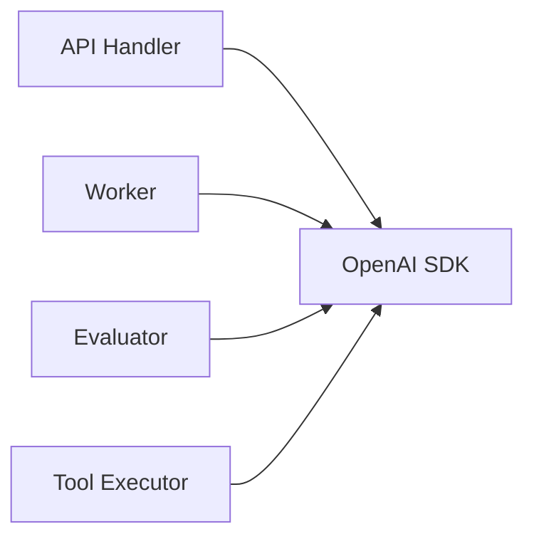
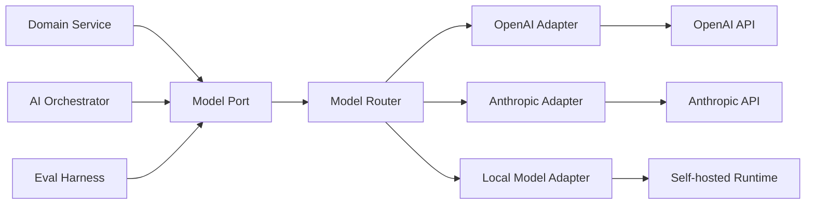
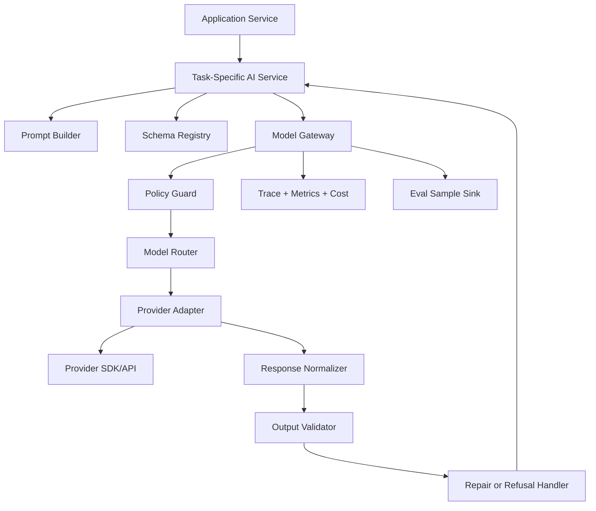
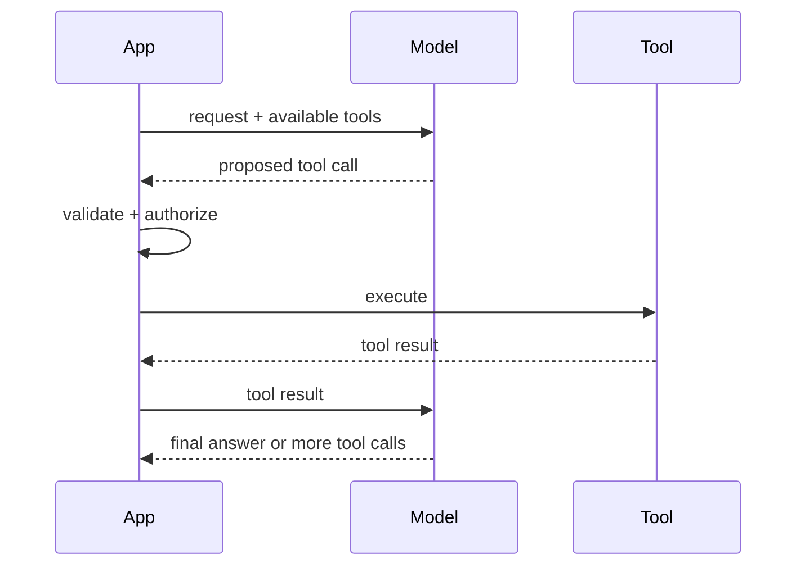
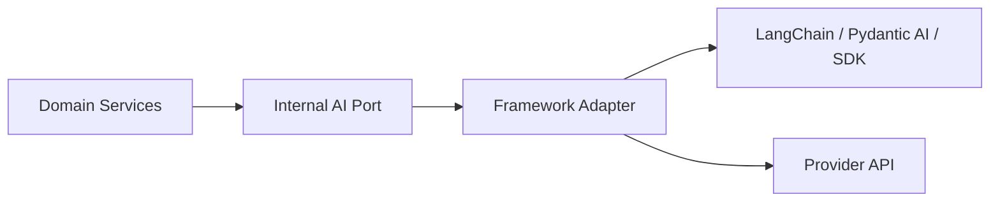
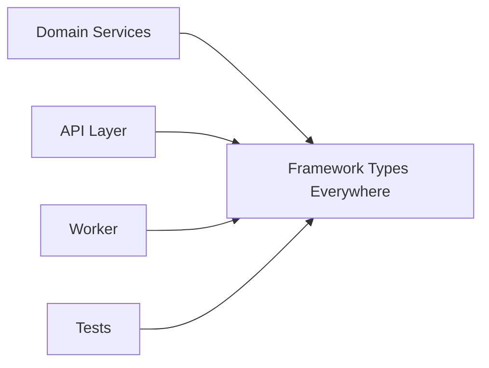
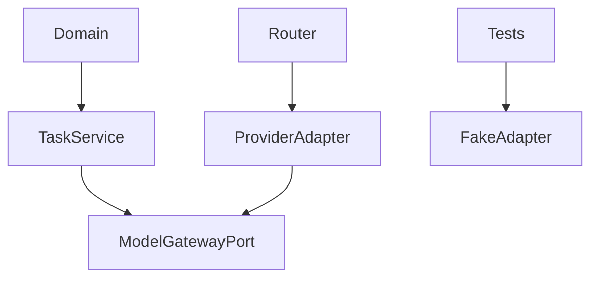

# Part 005 — Model Interface and Provider Abstraction

Pada bagian sebelumnya kita sudah membangun bentuk sistem: API boundary, orchestration layer, domain layer, AI layer, infra layer, eval, dan observability. Bagian ini masuk ke salah satu keputusan paling mahal dalam AI application engineering: **bagaimana aplikasi berbicara dengan model**.

Kesalahan umum di tahap ini adalah langsung menyebarkan SDK provider ke semua tempat:

```python
from openai import OpenAI
client = OpenAI()

response = client.responses.create(...)
```

Kode seperti ini terlihat cepat, tetapi secara arsitektur ia mencampur:

- business intent,
- model selection,
- prompt format,
- provider-specific API,
- retry policy,
- token/cost tracking,
- output parsing,
- safety policy,
- dan observability.

Pada production system, model provider adalah **external dependency with probabilistic behavior**. Ia harus diperlakukan seperti database, payment gateway, search engine, atau message broker: ada contract, adapter, capability boundary, retry, timeout, versioning, observability, dan test double.

Target bagian ini: kamu mampu membuat **model interface** yang cukup fleksibel untuk multi-provider, tetapi tidak over-engineered; cukup typed untuk reliable, tetapi tidak mematikan eksperimen.

---

## 1. Mental Model: Model Provider Bukan Domain Dependency

AI application tidak boleh berpikir seperti ini:



Itu membuat seluruh codebase bergantung pada satu bentuk API. Perubahan kecil seperti pindah dari chat-completions ke responses API, dari satu model ke model lain, dari provider A ke provider B, atau dari text output ke structured output akan menyebar ke banyak modul.

Bentuk yang lebih sehat:



Domain tidak tahu:

- model ID vendor,
- endpoint vendor,
- SDK object,
- streaming event format vendor,
- token accounting detail vendor,
- retry behavior vendor,
- tool-call representation vendor.

Domain hanya tahu: “saya butuh model menjalankan **task contract** ini.”

---

## 2. Prinsip Desain Interface

Ada empat prinsip inti.

### 2.1 Abstract Berdasarkan Intent, Bukan Berdasarkan SDK

Interface buruk:

```python
class LlmClient:
    def chat_completions_create(self, messages, model, temperature): ...
```

Itu hanya menyalin SDK provider. Abstraction seperti ini tidak memberi manfaat; ia hanya membuat wrapper tipis yang tetap bocor.

Interface lebih baik:

```python
class ModelGateway(Protocol):
    async def generate(self, request: ModelRequest) -> ModelResponse: ...
```

Lebih kuat lagi, untuk application-level use case:

```python
class CaseSummaryModel(Protocol):
    async def summarize_case(self, request: CaseSummaryRequest) -> CaseSummaryResult: ...
```

Ada dua level abstraction yang sering dibutuhkan:

| Level | Tujuan | Contoh |
|---|---|---|
| Generic model port | Mengabstraksi provider/model mechanics | `generate()`, `stream()`, `embed()` |
| Task-specific AI service | Mengabstraksi business capability | `classify_case()`, `extract_obligations()`, `draft_response()` |

Rule of thumb:

- gunakan **generic port** untuk infra AI layer;
- gunakan **task-specific service** untuk domain/application layer;
- jangan biarkan domain memanggil provider SDK langsung.

---

### 2.2 Capability-Aware, Bukan Provider-Agnostic Palsu

“Provider agnostic” sering disalahpahami sebagai “semua model dianggap sama”. Itu berbahaya.

Model dan provider berbeda dalam:

- context window,
- structured output support,
- tool calling semantics,
- streaming events,
- multimodal input,
- built-in tools,
- MCP support,
- reasoning controls,
- latency profile,
- pricing,
- rate limits,
- safety behavior,
- data retention controls,
- regional availability.

Jangan sembunyikan perbedaan itu sampai hilang. Yang benar adalah membuat abstraction yang **capability-aware**.

```python
from dataclasses import dataclass

@dataclass(frozen=True)
class ModelCapabilities:
    supports_structured_output: bool
    supports_tool_calling: bool
    supports_parallel_tool_calls: bool
    supports_streaming: bool
    supports_multimodal_input: bool
    max_context_tokens: int
    max_output_tokens: int
```

Kemudian selection logic bisa eksplisit:

```python
def require_structured_output(model: ModelCapabilities) -> None:
    if not model.supports_structured_output:
        raise ModelCapabilityError("This task requires structured output support")
```

Top engineer tidak membuat abstraction yang berpura-pura semua hal sama. Mereka membuat boundary yang membuat perbedaan menjadi **terlihat, typed, dan bisa diuji**.

---

### 2.3 Normalize Hanya yang Stabil

Tidak semua field vendor perlu dinormalisasi.

Yang layak dinormalisasi:

- input messages,
- model task name,
- temperature atau randomness intent,
- max output budget,
- structured schema,
- tool definitions,
- trace metadata,
- token usage,
- cost estimate,
- finish reason,
- safety/refusal indicator,
- latency,
- provider response ID.

Yang sebaiknya tetap menjadi provider-specific metadata:

- raw event type,
- vendor-only reasoning parameters,
- experimental flags,
- model-specific sampling knobs,
- provider-specific moderation fields,
- beta feature handles.

Gunakan struktur seperti ini:

```python
from dataclasses import dataclass, field
from typing import Any

@dataclass(frozen=True)
class ModelResponse:
    text: str | None
    structured: dict[str, Any] | None
    tool_calls: list["ToolCall"]
    usage: "TokenUsage"
    finish_reason: str
    provider: str
    model: str
    provider_response_id: str | None = None
    raw_metadata: dict[str, Any] = field(default_factory=dict)
```

Ini menjaga portability tanpa membuang informasi penting.

---

### 2.4 Treat Model Calls as Distributed Calls

Model call adalah network call ke external system yang:

- bisa timeout,
- bisa rate-limited,
- bisa return partial response,
- bisa return malformed structured output,
- bisa berubah perilaku saat model update,
- bisa mahal,
- bisa lambat,
- bisa gagal secara semantik walau HTTP 200.

Maka model gateway harus punya:

- timeout,
- retry policy,
- idempotency key,
- circuit breaker,
- budget limit,
- tracing,
- logging redaction,
- metrics,
- semantic validation,
- eval hooks.

Jika kamu memperlakukan model call seperti function call biasa, sistem akan rapuh.

---

## 3. Reference Architecture



Komponen-komponennya:

| Komponen | Tanggung Jawab |
|---|---|
| Task-specific AI service | Menyediakan capability bisnis: classify, summarize, extract, decide. |
| Prompt builder | Menghasilkan messages/instructions dari template + variables + context. |
| Schema registry | Menyimpan output schema dan version. |
| Model gateway | Contract utama untuk request/response model. |
| Policy guard | Mengecek data policy, model policy, tenant policy, budget policy. |
| Model router | Memilih model/provider berdasarkan task, cost, latency, capability. |
| Provider adapter | Menerjemahkan request normal menjadi API vendor. |
| Response normalizer | Mengubah response vendor menjadi response internal. |
| Output validator | Memvalidasi schema, invariants, dan semantic constraints. |
| Eval sample sink | Menyimpan sample untuk offline evaluation/regression. |

---

## 4. Designing the Core Types

Kita mulai dari tipe minimal yang cukup production-friendly.

### 4.1 Message

```python
from dataclasses import dataclass
from typing import Literal

Role = Literal["system", "developer", "user", "assistant", "tool"]

@dataclass(frozen=True)
class Message:
    role: Role
    content: str
    name: str | None = None
```

Catatan:

- `system` dan `developer` instruction harus dipisahkan jika provider mendukung distinction itu.
- Jika provider tidak mendukung, adapter boleh melakukan flattening secara eksplisit.
- Jangan mencampur policy instruction dengan user input.

---

### 4.2 Model Request

```python
from dataclasses import dataclass, field
from typing import Any, Literal

RandomnessProfile = Literal["deterministic", "balanced", "creative"]

@dataclass(frozen=True)
class ModelRequest:
    task_name: str
    messages: list[Message]
    output_schema: dict[str, Any] | None = None
    tools: list["ToolSpec"] = field(default_factory=list)
    randomness: RandomnessProfile = "deterministic"
    max_output_tokens: int | None = None
    stream: bool = False
    metadata: dict[str, str] = field(default_factory=dict)
```

Kenapa `task_name` penting?

Karena production AI system perlu mengukur:

- task mana yang mahal,
- task mana yang sering gagal,
- task mana yang hallucinate,
- task mana yang butuh model lebih kuat,
- task mana yang bisa dipindah ke model murah,
- task mana yang perlu eval dataset lebih baik.

Tanpa `task_name`, observability hanya menjadi kumpulan call anonim.

---

### 4.3 Token Usage

```python
from dataclasses import dataclass

@dataclass(frozen=True)
class TokenUsage:
    input_tokens: int
    output_tokens: int
    total_tokens: int
    cached_input_tokens: int = 0
```

Jangan hanya log total tokens. Input/output ratio membantu diagnosis:

| Gejala | Kemungkinan Masalah |
|---|---|
| Input token tinggi, output rendah | Context terlalu besar, retrieval boros, prompt verbose. |
| Input rendah, output tinggi | Output tidak terkendali, schema kurang ketat. |
| Token naik mendadak | Regression di prompt/context builder. |
| Cached token rendah | Prompt/context tidak stabil, cache tidak efektif. |

---

### 4.4 Tool Spec

```python
@dataclass(frozen=True)
class ToolSpec:
    name: str
    description: str
    input_schema: dict[str, object]
    risk_level: str
    requires_approval: bool = False
```

Tool definition adalah security boundary. Minimal harus ada:

- name yang stabil,
- description yang tidak ambigu,
- input schema,
- risk level,
- approval requirement,
- permission scope,
- audit metadata.

---

### 4.5 Tool Call

```python
@dataclass(frozen=True)
class ToolCall:
    id: str
    name: str
    arguments: dict[str, object]
```

Tool call harus dianggap sebagai **proposal dari model**, bukan command yang otomatis benar.

App wajib melakukan:

- schema validation,
- permission check,
- tenant check,
- business invariant check,
- idempotency check,
- approval check jika action berisiko.

---

## 5. Provider Adapter Pattern

Provider adapter bertanggung jawab menerjemahkan internal contract ke provider contract.

```python
from typing import Protocol

class ProviderAdapter(Protocol):
    provider_name: str

    async def generate(self, request: ModelRequest) -> ModelResponse:
        ...

    def capabilities(self, model: str) -> ModelCapabilities:
        ...
```

Contoh skeleton adapter:

```python
class OpenAIResponsesAdapter:
    provider_name = "openai"

    def __init__(self, client, model: str):
        self._client = client
        self._model = model

    async def generate(self, request: ModelRequest) -> ModelResponse:
        payload = self._to_provider_payload(request)
        raw = await self._client.responses.create(**payload)
        return self._normalize(raw)

    def _to_provider_payload(self, request: ModelRequest) -> dict:
        payload = {
            "model": self._model,
            "input": [self._map_message(m) for m in request.messages],
            "metadata": request.metadata,
        }

        if request.output_schema:
            payload["text"] = {
                "format": {
                    "type": "json_schema",
                    "name": f"{request.task_name}_output",
                    "schema": request.output_schema,
                    "strict": True,
                }
            }

        if request.tools:
            payload["tools"] = [self._map_tool(t) for t in request.tools]

        return payload
```

Provider adapter boleh kompleks. Domain layer tidak boleh.

---

## 6. Model Router

Model router memilih provider/model berdasarkan policy.

```python
@dataclass(frozen=True)
class ModelRoute:
    provider: str
    model: str
    max_cost_usd: float | None
    timeout_seconds: float
    fallback_routes: list[str]
```

Contoh mapping:

```yaml
tasks:
  case_triage:
    primary: fast_structured
    fallback: strong_structured
  evidence_synthesis:
    primary: strong_long_context
    fallback: strong_rag_optimized
  user_chat:
    primary: low_latency_chat
    fallback: safe_general

routes:
  fast_structured:
    provider: openai
    model: gpt-5.4-mini
    timeout_seconds: 8
  strong_structured:
    provider: openai
    model: gpt-5.4
    timeout_seconds: 20
  strong_long_context:
    provider: anthropic
    model: claude-opus-4.6
    timeout_seconds: 30
```

Nama route sebaiknya berbasis **capability intent**, bukan model ID langsung.

Buruk:

```python
model="gpt-5.4-mini"
```

Lebih baik:

```python
route="fast_structured"
```

Dengan begitu ketika model berubah, business code tidak berubah.

---

## 7. Randomness as Product Policy

`temperature=0.7` adalah detail provider. Di level aplikasi, yang dibutuhkan adalah policy:

| Profile | Use Case | Behavior |
|---|---|---|
| deterministic | extraction, classification, policy decision | repeatable, conservative |
| balanced | summarization, assistant answer | natural but controlled |
| creative | brainstorming, content ideation | divergent |

Jangan biarkan setiap developer memilih angka sampling sembarangan.

```python
def randomness_to_provider_params(profile: RandomnessProfile) -> dict:
    match profile:
        case "deterministic":
            return {"temperature": 0.0}
        case "balanced":
            return {"temperature": 0.3}
        case "creative":
            return {"temperature": 0.8}
```

Catatan: tidak semua provider/model menafsirkan parameter sampling dengan cara identik. Karena itu mapping harus berada di adapter/router, bukan domain.

---

## 8. Structured Output Boundary

Structured output bukan sekadar “minta JSON”. Ia adalah contract.

Contoh Pydantic model:

```python
from pydantic import BaseModel, Field
from typing import Literal

class CaseTriageResult(BaseModel):
    severity: Literal["low", "medium", "high", "critical"]
    category: str
    rationale: str = Field(min_length=20, max_length=1000)
    requires_human_review: bool
    confidence: float = Field(ge=0.0, le=1.0)
```

Schema generation:

```python
schema = CaseTriageResult.model_json_schema()
```

Validation:

```python
result = CaseTriageResult.model_validate(response.structured)
```

Namun structured output tidak otomatis benar secara bisnis. Ia hanya benar secara bentuk.

Tambahkan invariant check:

```python
def validate_case_triage_business_rules(result: CaseTriageResult) -> None:
    if result.severity == "critical" and not result.requires_human_review:
        raise BusinessInvariantViolation(
            "Critical severity must require human review"
        )
```

Ada tiga lapis validasi:

| Layer | Pertanyaan |
|---|---|
| Syntax validation | Apakah JSON valid? |
| Schema validation | Apakah field dan type sesuai? |
| Semantic/business validation | Apakah keputusan masuk akal dan defensible? |

Top engineer tidak berhenti di schema.

---

## 9. Tool Calling Boundary

Tool calling modern biasanya mengikuti pola multi-step:



Application selalu menjadi executor. Model tidak boleh langsung menyentuh database, payment, email, calendar, atau case workflow.

Contoh eksekusi aman:

```python
async def execute_tool_call(call: ToolCall, registry: ToolRegistry, actor: ActorContext):
    tool = registry.get(call.name)

    validated_args = tool.input_model.model_validate(call.arguments)

    if not tool.policy.is_allowed(actor, validated_args):
        raise ToolAuthorizationError(call.name)

    if tool.requires_approval:
        return await create_pending_approval(call, validated_args, actor)

    return await tool.execute(validated_args, actor)
```

Tool call adalah untrusted input.

---

## 10. Streaming Interface

Streaming tidak boleh bocor sebagai event vendor mentah ke UI.

Buat event internal:

```python
from dataclasses import dataclass
from typing import Literal

StreamEventType = Literal[
    "text_delta",
    "tool_call_started",
    "tool_call_delta",
    "tool_call_completed",
    "usage",
    "error",
    "completed",
]

@dataclass(frozen=True)
class ModelStreamEvent:
    type: StreamEventType
    data: dict
```

Kenapa?

Karena UI membutuhkan semantic event, bukan provider event.

UI peduli:

- ada teks baru,
- model ingin memanggil tool,
- tool sedang berjalan,
- tool selesai,
- response selesai,
- error recoverable/non-recoverable.

UI tidak perlu tahu event name vendor.

---

## 11. Error Taxonomy

Jangan hanya membuat `Exception`.

```python
class ModelError(Exception):
    pass

class ModelTimeoutError(ModelError):
    pass

class ModelRateLimitError(ModelError):
    pass

class ModelProviderUnavailableError(ModelError):
    pass

class ModelCapabilityError(ModelError):
    pass

class ModelOutputValidationError(ModelError):
    pass

class ModelRefusalError(ModelError):
    pass

class ModelSemanticFailure(ModelError):
    pass
```

Kategori error menentukan tindakan:

| Error | Retry? | Fallback? | Human Review? |
|---|---:|---:|---:|
| timeout | yes | yes | maybe |
| rate limit | yes with backoff | yes | no |
| unavailable | yes | yes | no |
| unsupported capability | no | route change | no |
| output validation | maybe repair once | maybe | yes for critical |
| refusal | no | maybe policy check | yes if business-critical |
| semantic failure | no blind retry | maybe stronger model | yes |

Blind retry pada semantic failure sering hanya membakar token.

---

## 12. Retry, Fallback, and Repair

Ada tiga mekanisme yang sering dicampur, padahal beda.

| Mekanisme | Dipakai Saat | Tujuan |
|---|---|---|
| Retry | transient infrastructure failure | mencoba ulang call yang sama |
| Fallback | provider/model tidak memenuhi SLA | pindah route |
| Repair | output malformed/invalid | memperbaiki response dengan konteks error |

Contoh controlled repair:

```python
async def generate_with_schema_repair(
    gateway: ModelGateway,
    request: ModelRequest,
    output_model: type[BaseModel],
):
    response = await gateway.generate(request)

    try:
        return output_model.model_validate(response.structured)
    except ValidationError as error:
        repair_request = build_repair_request(
            original_request=request,
            invalid_output=response.structured,
            validation_error=str(error),
            schema=output_model.model_json_schema(),
        )
        repaired = await gateway.generate(repair_request)
        return output_model.model_validate(repaired.structured)
```

Batasi repair loop. Satu kali biasanya cukup. Lebih dari itu perlu diagnosis, bukan harapan.

---

## 13. Observability Contract

Setiap model call minimal harus menghasilkan trace metadata:

```python
@dataclass(frozen=True)
class ModelTrace:
    trace_id: str
    task_name: str
    provider: str
    model: str
    route: str
    input_tokens: int
    output_tokens: int
    latency_ms: int
    cost_usd_estimate: float | None
    finish_reason: str
    output_valid: bool
    retry_count: int
    fallback_used: bool
```

Metrics yang wajib:

- request count by task/model/provider,
- p50/p95/p99 latency,
- input/output tokens,
- estimated cost,
- validation failure rate,
- refusal rate,
- timeout rate,
- fallback rate,
- tool call count,
- tool failure rate,
- user correction rate,
- eval regression rate.

AI app tanpa trace adalah sistem yang tidak bisa dipelihara.

---

## 14. Cost Boundary

Model gateway harus bisa menolak call sebelum terjadi.

```python
@dataclass(frozen=True)
class BudgetPolicy:
    max_input_tokens: int
    max_output_tokens: int
    max_estimated_cost_usd: float
```

Contoh:

```python
def enforce_budget(request: ModelRequest, estimate: CostEstimate, policy: BudgetPolicy):
    if estimate.input_tokens > policy.max_input_tokens:
        raise BudgetExceeded("input token budget exceeded")
    if request.max_output_tokens and request.max_output_tokens > policy.max_output_tokens:
        raise BudgetExceeded("output token budget exceeded")
    if estimate.estimated_cost_usd > policy.max_estimated_cost_usd:
        raise BudgetExceeded("cost budget exceeded")
```

Cost optimization bukan tahap akhir. Ia harus masuk ke design.

---

## 15. Testing Strategy

### 15.1 Unit Test dengan Fake Provider

```python
class FakeModelGateway:
    def __init__(self, responses: list[ModelResponse]):
        self.responses = responses
        self.requests: list[ModelRequest] = []

    async def generate(self, request: ModelRequest) -> ModelResponse:
        self.requests.append(request)
        if not self.responses:
            raise AssertionError("No fake response configured")
        return self.responses.pop(0)
```

Test application service tanpa API call:

```python
async def test_case_triage_requires_human_review_for_critical_case():
    gateway = FakeModelGateway([
        ModelResponse(
            text=None,
            structured={
                "severity": "critical",
                "category": "fraud",
                "rationale": "Evidence indicates severe regulatory breach.",
                "requires_human_review": True,
                "confidence": 0.91,
            },
            tool_calls=[],
            usage=TokenUsage(100, 50, 150),
            finish_reason="stop",
            provider="fake",
            model="fake-model",
        )
    ])

    service = CaseTriageService(gateway)
    result = await service.triage(case_id="CASE-001")

    assert result.requires_human_review is True
    assert gateway.requests[0].task_name == "case_triage"
```

---

### 15.2 Contract Test untuk Adapter

Contract test memastikan adapter mengembalikan normalized response sesuai interface.

```python
async def assert_provider_contract(adapter: ProviderAdapter):
    response = await adapter.generate(
        ModelRequest(
            task_name="contract_test_echo",
            messages=[Message(role="user", content="Return the word pong.")],
            randomness="deterministic",
            max_output_tokens=20,
        )
    )

    assert response.provider
    assert response.model
    assert response.finish_reason
    assert response.usage.total_tokens >= 0
```

Contract test sebaiknya jalan di CI terjadwal atau pre-release, bukan setiap unit test run.

---

### 15.3 Snapshot Test untuk Payload Mapping

Adapter mapping bisa diuji tanpa memanggil provider.

```python
def test_openai_payload_mapping_for_structured_output(snapshot):
    adapter = OpenAIResponsesAdapter(client=None, model="example-model")
    request = ModelRequest(
        task_name="case_triage",
        messages=[Message(role="user", content="Classify this case")],
        output_schema=CaseTriageResult.model_json_schema(),
    )

    payload = adapter._to_provider_payload(request)
    snapshot.assert_match(payload)
```

Ini menangkap accidental changes di prompt, schema, atau provider payload.

---

## 16. Configuration Strategy

Gunakan config deklaratif untuk route, model, budget, dan policy.

```yaml
model_gateway:
  default_timeout_seconds: 15
  default_randomness: deterministic

  providers:
    openai:
      api_key_env: OPENAI_API_KEY
    anthropic:
      api_key_env: ANTHROPIC_API_KEY

  routes:
    fast_structured:
      provider: openai
      model: gpt-5.4-mini
      timeout_seconds: 8
      max_estimated_cost_usd: 0.01

    strong_reasoning:
      provider: openai
      model: gpt-5.4
      timeout_seconds: 30
      max_estimated_cost_usd: 0.20

  tasks:
    case_triage:
      route: fast_structured
      fallback_route: strong_reasoning
      output_schema: CaseTriageResult
```

Jangan menyebarkan model IDs di source code.

---

## 17. What Not to Abstract Yet

Jangan buru-buru membuat mega-framework internal.

Hindari abstraction untuk:

- semua provider feature yang belum dipakai,
- semua possible tool event,
- semua multimodal type,
- semua sampling parameter,
- semua agent runtime,
- semua vector database,
- semua observability backend.

Abstract ketika ada minimal salah satu alasan:

1. domain code mulai bergantung pada provider detail;
2. testing menjadi sulit;
3. switching/experimentation butuh perubahan besar;
4. observability tidak konsisten;
5. policy/security tidak bisa ditegakkan terpusat.

Abstraction yang baik menurunkan risk. Abstraction yang buruk hanya menambah vocabulary.

---

## 18. Provider Abstraction and Frameworks

Framework seperti LangChain, LlamaIndex, atau Pydantic AI dapat membantu, tetapi jangan jadikan framework sebagai domain boundary.

Bentuk sehat:



Bentuk berisiko:



Framework bisa diganti. Domain model seharusnya tidak.

---

## 19. Security Considerations

Provider abstraction adalah security control point.

Di gateway, kamu bisa menerapkan:

- redaction sebelum request keluar,
- tenant boundary,
- data classification policy,
- prompt injection defense hooks,
- output policy check,
- tool call permission,
- audit logging,
- model allowlist,
- region/provider restriction,
- no-training/no-retention configuration jika tersedia,
- secrets isolation.

Jangan menaruh security hanya di prompt. Prompt adalah control, tetapi bukan satu-satunya control.

---

## 20. Anti-Patterns

| Anti-Pattern | Dampak |
|---|---|
| SDK dipakai langsung di domain service | Vendor lock-in, sulit test, sulit migrate. |
| Model ID tersebar di codebase | Rollout dan rollback sulit. |
| Prompt string inline di handler | Tidak bisa versioning/eval dengan baik. |
| “Minta JSON” tanpa schema validation | Output rapuh. |
| Semua error dianggap retryable | Cost naik, incident makin buruk. |
| Tool call langsung dieksekusi | Security breach. |
| Tidak mencatat task_name | Observability tidak actionable. |
| Framework type bocor ke domain | Framework lock-in. |
| Provider abstraction terlalu generic | Capability penting hilang. |
| Tidak ada fake provider | Test lambat dan mahal. |

---

## 21. Minimal Implementation Blueprint

Struktur file:

```text
src/
  ai/
    model_gateway/
      __init__.py
      types.py
      gateway.py
      router.py
      errors.py
      cost.py
      tracing.py
      providers/
        openai_adapter.py
        anthropic_adapter.py
        fake_adapter.py
    tasks/
      case_triage.py
      evidence_summary.py
  domain/
    cases.py
  app/
    services/
      triage_service.py
  tests/
    unit/
    contract/
```

Dependency direction:



Domain boleh bergantung pada task-specific AI service interface. Provider adapter tidak boleh masuk domain.

---

## 22. Practice: Build a Minimal Model Gateway

Latihan 90 menit.

### Goal

Bangun model gateway kecil dengan:

- `ModelRequest`,
- `ModelResponse`,
- `TokenUsage`,
- `ModelCapabilities`,
- `ProviderAdapter` protocol,
- `FakeModelAdapter`,
- `TaskRouter`,
- satu task service: `CaseTriageService`.

### Constraints

- Tidak boleh import provider SDK di domain/application service.
- Semua model call harus punya `task_name`.
- Output harus divalidasi dengan Pydantic.
- Unit test tidak boleh memanggil API eksternal.

### Acceptance Criteria

- Bisa mengganti fake adapter ke real adapter tanpa mengubah `CaseTriageService`.
- Bisa menjalankan test semantic invariant: critical case wajib human review.
- Bisa mencatat minimal task_name, provider, model, latency, token usage.

---

## 23. Review Checklist

Gunakan checklist ini saat code review.

### Boundary

- [ ] Apakah provider SDK hanya muncul di adapter?
- [ ] Apakah domain bebas dari model ID vendor?
- [ ] Apakah task-specific service tidak menerima raw prompt string dari controller?
- [ ] Apakah framework-specific types tidak bocor ke domain?

### Contract

- [ ] Apakah request/response typed?
- [ ] Apakah structured output punya schema?
- [ ] Apakah output divalidasi secara schema dan business invariant?
- [ ] Apakah tool call divalidasi sebelum eksekusi?

### Reliability

- [ ] Apakah timeout eksplisit?
- [ ] Apakah retry hanya untuk transient error?
- [ ] Apakah fallback route dikontrol policy?
- [ ] Apakah repair loop dibatasi?

### Observability

- [ ] Apakah setiap call punya task_name?
- [ ] Apakah latency dan token usage dicatat?
- [ ] Apakah validation failure dicatat?
- [ ] Apakah fallback dan retry terlihat di trace?

### Security

- [ ] Apakah sensitive input direduksi/redacted sebelum dikirim?
- [ ] Apakah tenant boundary dicek?
- [ ] Apakah risky tool membutuhkan approval?
- [ ] Apakah raw provider response tidak bocor ke user/log tidak aman?

---

## 24. What Top 1% Engineers Do Differently

Engineer biasa bertanya:

> “Model apa yang paling bagus?”

Engineer kuat bertanya:

> “Untuk task ini, capability apa yang dibutuhkan, failure apa yang acceptable, budget-nya berapa, latency SLA-nya berapa, dan bagaimana kita membuktikan hasilnya benar?”

Perbedaannya bukan pada hafalan SDK. Perbedaannya pada judgment:

- model selection berdasarkan task,
- abstraction berdasarkan instability,
- validation berdasarkan risk,
- observability berdasarkan diagnosis,
- security berdasarkan authority boundary,
- eval berdasarkan behavior regression.

Provider abstraction bukan supaya kamu bisa berpindah vendor setiap minggu. Ia dibuat supaya sistem tetap bisa berubah tanpa merusak domain, test, audit, dan operasi.

---

## 25. Summary

Model interface adalah boundary paling penting di AI application architecture.

Prinsip utama:

1. Jangan biarkan provider SDK masuk domain.
2. Abstract berdasarkan intent dan capability, bukan menyalin SDK.
3. Normalize field yang stabil; simpan provider-specific detail sebagai metadata.
4. Treat model call sebagai distributed call.
5. Structured output tetap butuh schema dan semantic validation.
6. Tool call adalah proposal yang wajib divalidasi dan diautorisasi.
7. Streaming perlu internal event contract.
8. Observability wajib dimulai dari `task_name`.
9. Framework boleh dipakai, tetapi jangan menjadi domain model.
10. Abstraction yang baik membuat perubahan murah dan failure terlihat.

Pada Part 006 kita akan masuk ke **Prompting as Protocol Design**: prompt bukan magic text, melainkan kontrak instruksi yang harus modular, versioned, testable, auditable, dan tahan terhadap injection.

---

## References

- OpenAI API Docs — Structured Outputs: https://developers.openai.com/api/docs/guides/structured-outputs
- OpenAI API Docs — Function Calling: https://developers.openai.com/api/docs/guides/function-calling
- OpenAI API Docs — Tools: https://developers.openai.com/api/docs/guides/tools
- Anthropic Claude Docs — Tool Reference: https://platform.claude.com/docs/en/agents-and-tools/tool-use/tool-reference
- LangChain Docs — Chat Model Integrations: https://docs.langchain.com/oss/python/integrations/chat
- LangChain Docs — Models: https://docs.langchain.com/oss/python/langchain/models
- Pydantic Docs — Validation: https://pydantic.dev/docs/validation/latest/get-started/
- Pydantic AI Docs — Overview: https://pydantic.dev/docs/ai/overview/
- Model Context Protocol Specification: https://modelcontextprotocol.io/specification/2025-11-25
