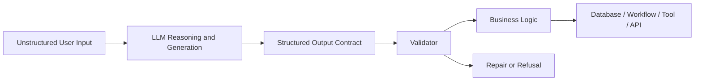
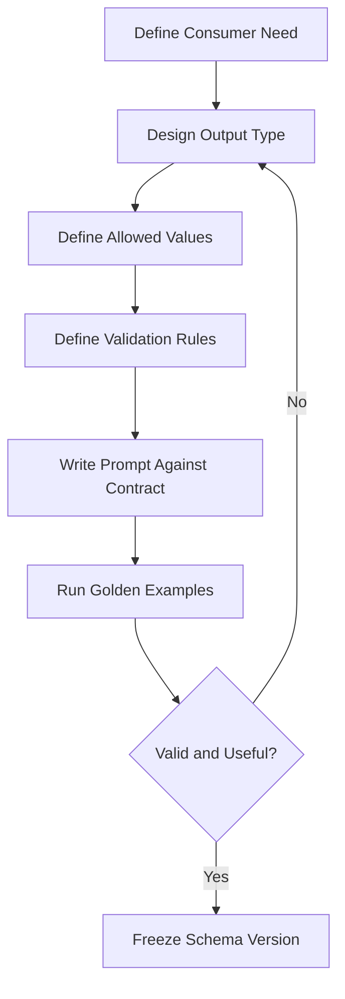
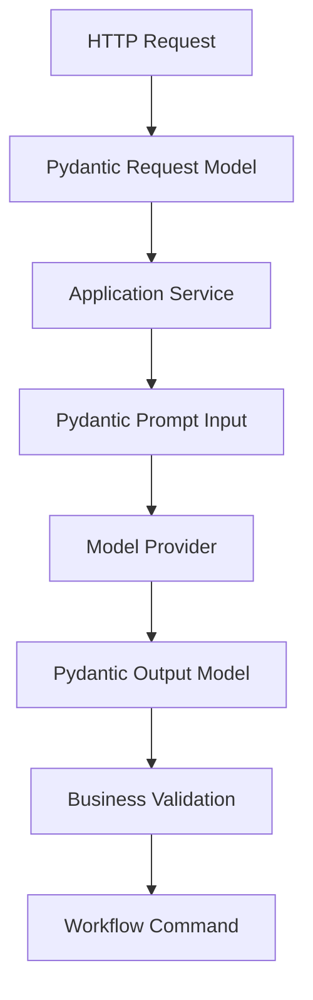
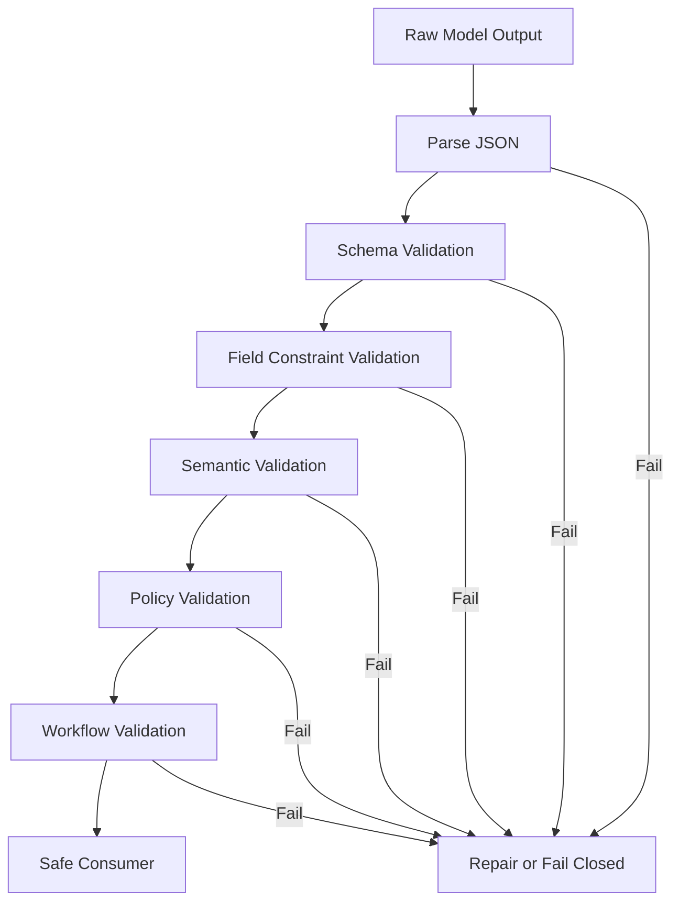
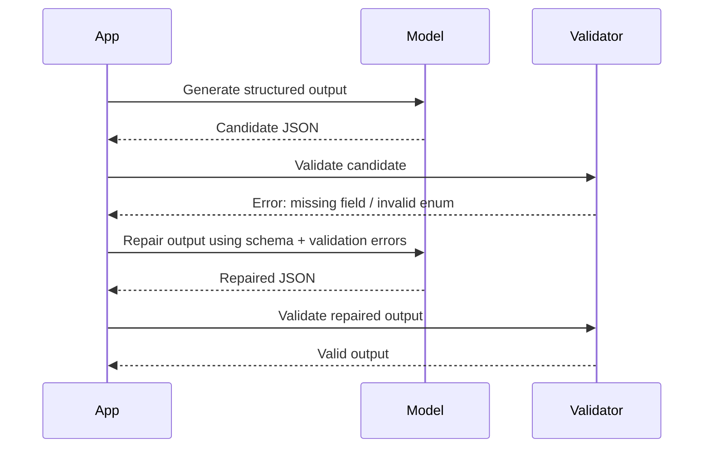
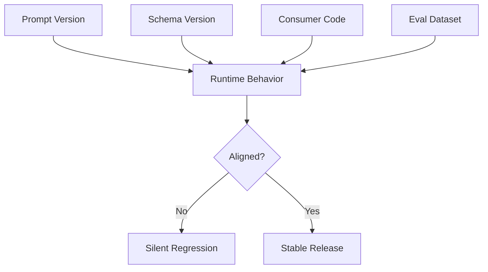
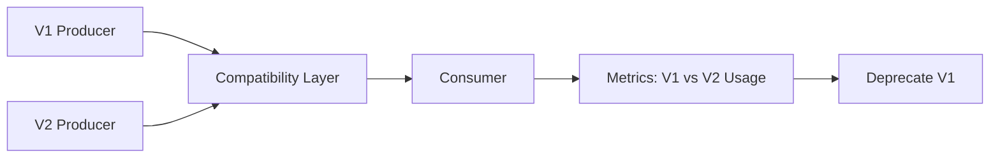
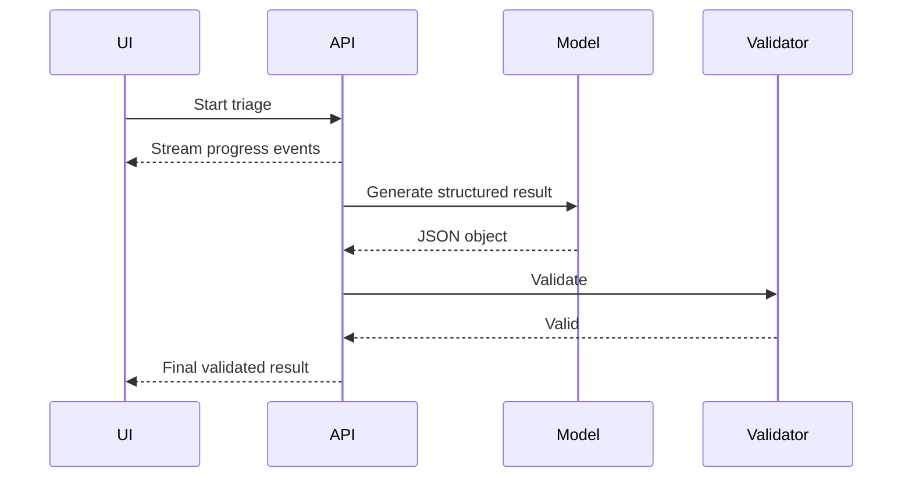

# Part 007 — Structured Output, Schema, and Validation

AI application engineering becomes serious when model output is no longer treated as prose.

In a prototype, a model can answer with paragraphs. In production, downstream systems usually need a typed object:

- a classification decision,
- a routing instruction,
- a policy match,
- a case triage result,
- a risk score explanation,
- an extracted entity set,
- a query plan,
- a tool argument object,
- an audit-safe recommendation,
- or a deterministic next-state transition.

The hard part is not asking the model to “return JSON”. The hard part is designing a contract that is valid, minimal, versioned, repairable, observable, and safe to consume.

This part teaches structured output as an engineering discipline.

---

## 1. Kaufman Framing

Josh Kaufman's method starts by deconstructing a target skill into smaller subskills, then practicing the highest-leverage pieces first.

For structured output, the target skill is:

> Given an uncertain natural-language input and an imperfect model, design a typed output contract that downstream code can safely consume, validate, repair, test, and audit.

This decomposes into six subskills.

| Subskill | Meaning | Failure If Ignored |
|---|---|---|
| Contract design | Decide what the output must represent | Schema becomes vague, bloated, or unusable |
| Schema expression | Encode the contract in JSON Schema/Pydantic | Model produces shape mismatch or ambiguous fields |
| Runtime validation | Validate model output before consumption | Bad output leaks into business logic |
| Repair strategy | Recover from fixable errors | User sees failures that could be automatically corrected |
| Semantic validation | Check meaning, not only shape | JSON is valid but wrong, unsafe, or unsupported |
| Versioning and observability | Track schema/prompt/model relationship | Regressions become impossible to diagnose |

The first 20 hours should not be spent memorizing every JSON Schema keyword. They should be spent repeatedly converting fuzzy tasks into small, typed, enforceable contracts.

---

## 2. Why Structured Output Exists

LLMs are probabilistic text generators. Software systems are stateful rule-followers.

Structured output is the bridge.



Without structured output, every downstream consumer must parse language. That creates hidden coupling:

```python
# fragile anti-pattern
if "high risk" in model_response.lower():
    escalate_case(case_id)
```

A production system should consume explicit fields:

```json
{
  "risk_level": "HIGH",
  "recommended_action": "ESCALATE",
  "reasons": [
    "Customer submitted inconsistent evidence",
    "Case involves regulated disclosure deadline"
  ],
  "confidence": 0.74
}
```

Now code can validate, route, audit, and test the result.

---

## 3. JSON Mode Is Not Enough

A common early mistake is to assume that “valid JSON” equals “valid application output”.

It does not.

Valid JSON only means the output can be parsed. It says nothing about whether:

- required fields are present,
- enum values are allowed,
- numbers are in range,
- nested objects are well-formed,
- the decision is semantically supported,
- the answer is safe to execute,
- the output matches the current schema version,
- or downstream state transition is legal.

Compare the difference.

### JSON-only output

```json
{
  "risk": "seems kind of high",
  "action": "maybe escalate or review",
  "confidence": "pretty sure"
}
```

This is syntactically valid JSON but operationally poor.

### Schema-constrained output

```json
{
  "schema_version": "case_triage.v1",
  "risk_level": "HIGH",
  "recommended_action": "ESCALATE_TO_SUPERVISOR",
  "confidence": 0.81,
  "reasons": [
    {
      "code": "EVIDENCE_CONFLICT",
      "summary": "Submitted evidence conflicts with previously recorded case data."
    }
  ]
}
```

This is closer to a usable software contract.

---

## 4. The Contract-First Mindset

Do not start with the prompt. Start with the output contract.

A good workflow is:



Structured output is not primarily a model feature. It is an application design decision.

Ask these questions before writing the schema:

1. Who consumes this output?
2. What decision does the consumer make from it?
3. Which fields are required for that decision?
4. Which fields are explanatory only?
5. What must never be inferred?
6. What is the fallback if the model is uncertain?
7. Which values should be enums instead of free text?
8. Which fields need provenance or evidence references?
9. Which fields affect external side effects?
10. Which fields are audit-critical?

---

## 5. Output Contract Taxonomy

Different AI app tasks require different output shapes.

### 5.1 Classification Output

Use when the model selects one label from a controlled set.

```json
{
  "category": "COMPLAINT",
  "confidence": 0.88,
  "reason": "The user reports harm and asks for resolution."
}
```

Best for:

- ticket classification,
- intent routing,
- risk level selection,
- document type identification,
- policy category matching.

Key design rule: use enums.

```python
from enum import StrEnum
from pydantic import BaseModel, Field

class CaseCategory(StrEnum):
    COMPLAINT = "COMPLAINT"
    INQUIRY = "INQUIRY"
    APPEAL = "APPEAL"
    INFORMATION_UPDATE = "INFORMATION_UPDATE"
    UNKNOWN = "UNKNOWN"

class ClassificationResult(BaseModel):
    category: CaseCategory
    confidence: float = Field(ge=0.0, le=1.0)
    reason: str = Field(min_length=1, max_length=600)
```

Avoid open-ended category strings unless a human is expected to normalize them later.

---

### 5.2 Extraction Output

Use when the model extracts structured facts from source text.

```python
from datetime import date
from pydantic import BaseModel, Field

class Party(BaseModel):
    name: str
    role: str
    identifier: str | None = None

class ExtractedDeadline(BaseModel):
    label: str
    due_date: date
    source_quote: str = Field(max_length=500)

class CaseExtraction(BaseModel):
    parties: list[Party]
    deadlines: list[ExtractedDeadline]
    missing_information: list[str]
```

Key design rule: require provenance for high-stakes extracted facts.

Without provenance, extraction output becomes hard to verify.

---

### 5.3 Decision Output

Use when the model recommends a business decision.

```python
from enum import StrEnum
from pydantic import BaseModel, Field

class Decision(StrEnum):
    APPROVE = "APPROVE"
    REJECT = "REJECT"
    ESCALATE = "ESCALATE"
    NEED_MORE_INFORMATION = "NEED_MORE_INFORMATION"

class DecisionResult(BaseModel):
    decision: Decision
    confidence: float = Field(ge=0, le=1)
    rationale: list[str] = Field(min_length=1, max_length=5)
    required_human_review: bool
```

Key design rule: separate recommendation from authority.

The model can recommend. The workflow decides whether it is allowed to act.

---

### 5.4 Plan Output

Use when the model decomposes a task into steps.

```python
class PlanStep(BaseModel):
    id: str
    description: str
    depends_on: list[str] = []
    tool_required: str | None = None
    requires_approval: bool = False

class TaskPlan(BaseModel):
    goal: str
    steps: list[PlanStep]
    risks: list[str]
```

Key design rule: plans are not execution.

A plan must be validated before execution.

---

### 5.5 Tool Argument Output

Use when the model produces arguments for a tool call.

```python
class SearchCaseToolInput(BaseModel):
    query: str = Field(min_length=3, max_length=300)
    case_status: str | None = None
    max_results: int = Field(default=10, ge=1, le=50)
```

Key design rule: tool arguments require stricter validation than ordinary answers because they can trigger side effects or data access.

---

### 5.6 State Transition Output

Use when the model suggests a workflow transition.

```python
class CaseStateTransition(BaseModel):
    current_state: str
    proposed_state: str
    reason_code: str
    explanation: str
    requires_human_approval: bool = True
```

Key design rule: validate against the authoritative state machine, not only the schema.

A JSON object can be valid while proposing an illegal transition.

---

## 6. Pydantic as Application Boundary

In Python AI apps, Pydantic is commonly used to define and validate structured data using type hints.

Use it at system boundaries:

- incoming API request,
- model output,
- tool arguments,
- tool results,
- event payloads,
- configuration,
- eval datasets,
- audit records.



Pydantic should not be treated as a magical correctness layer. It validates structure and configured constraints. It does not automatically prove truth, safety, business correctness, or regulatory defensibility.

---

## 7. Example: Case Triage Schema

Assume we are building an AI assistant for regulatory case management.

The system receives a case note and must produce triage metadata.

### 7.1 Bad Contract

```python
class BadTriage(BaseModel):
    result: str
```

This is too vague. Every downstream consumer now has to parse `result`.

### 7.2 Better Contract

```python
from enum import StrEnum
from pydantic import BaseModel, Field

class RiskLevel(StrEnum):
    LOW = "LOW"
    MEDIUM = "MEDIUM"
    HIGH = "HIGH"
    CRITICAL = "CRITICAL"
    UNKNOWN = "UNKNOWN"

class RecommendedAction(StrEnum):
    CONTINUE_STANDARD_PROCESSING = "CONTINUE_STANDARD_PROCESSING"
    REQUEST_MORE_INFORMATION = "REQUEST_MORE_INFORMATION"
    ESCALATE_TO_SUPERVISOR = "ESCALATE_TO_SUPERVISOR"
    ESCALATE_TO_LEGAL = "ESCALATE_TO_LEGAL"
    PAUSE_FOR_HUMAN_REVIEW = "PAUSE_FOR_HUMAN_REVIEW"

class TriageReason(BaseModel):
    code: str = Field(min_length=2, max_length=80)
    explanation: str = Field(min_length=1, max_length=600)
    evidence_reference: str | None = Field(
        default=None,
        description="Reference to source document, note, paragraph, or event id."
    )

class CaseTriageResult(BaseModel):
    schema_version: str = "case_triage.v1"
    risk_level: RiskLevel
    recommended_action: RecommendedAction
    confidence: float = Field(ge=0.0, le=1.0)
    reasons: list[TriageReason] = Field(min_length=1, max_length=5)
    missing_information: list[str] = Field(default_factory=list, max_length=10)
    requires_human_review: bool
```

This contract is better because it creates clear control points:

- `risk_level` drives prioritization,
- `recommended_action` drives workflow routing,
- `confidence` supports thresholding,
- `reasons` support auditability,
- `missing_information` supports user follow-up,
- `requires_human_review` prevents silent automation.

---

## 8. Schema Design Rules

### Rule 1: Prefer enums for operational fields

Operational fields affect control flow.

Use enums for:

- status,
- intent,
- action,
- risk level,
- decision,
- state transition,
- tool name,
- reason code.

Avoid:

```python
action: str
```

Prefer:

```python
class Action(StrEnum):
    ESCALATE = "ESCALATE"
    REQUEST_MORE_INFORMATION = "REQUEST_MORE_INFORMATION"
    NO_ACTION = "NO_ACTION"
```

---

### Rule 2: Separate machine fields from explanation fields

Do not mix control flow with prose.

Bad:

```json
{
  "decision": "Escalate because this seems serious"
}
```

Better:

```json
{
  "decision": "ESCALATE",
  "explanation": "The case involves unresolved evidence conflict and deadline risk."
}
```

Machine fields should be stable and constrained. Explanation fields can be natural language.

---

### Rule 3: Put uncertainty into explicit fields

Do not hide uncertainty inside wording.

Bad:

```json
{
  "risk_level": "HIGH-ish"
}
```

Better:

```json
{
  "risk_level": "HIGH",
  "confidence": 0.63,
  "requires_human_review": true,
  "missing_information": ["No verified deadline source found"]
}
```

---

### Rule 4: Use arrays only when order matters or multiplicity matters

Every array should have clear semantics.

```python
reasons: list[TriageReason] = Field(min_length=1, max_length=5)
```

Set a maximum length. Otherwise the model may produce verbose objects that increase cost and noise.

---

### Rule 5: Use nullable fields deliberately

`None` should mean something.

Bad:

```python
deadline: date | None
```

Better:

```python
class DeadlineStatus(StrEnum):
    FOUND = "FOUND"
    NOT_FOUND = "NOT_FOUND"
    AMBIGUOUS = "AMBIGUOUS"

class DeadlineResult(BaseModel):
    status: DeadlineStatus
    due_date: date | None = None
    explanation: str
```

This makes absence explicit.

---

### Rule 6: Avoid over-nesting

Deep schemas are harder for models to fill correctly and harder for humans to review.

Bad:

```json
{
  "case": {
    "triage": {
      "risk": {
        "level": {
          "value": "HIGH"
        }
      }
    }
  }
}
```

Better:

```json
{
  "risk_level": "HIGH"
}
```

Use nesting when it expresses real domain structure, not because it feels enterprise-like.

---

### Rule 7: Keep schema smaller than the task

A schema should represent the result, not the entire reasoning process.

Do not ask for every intermediate thought. Ask for the observable artifacts needed for verification.

Good fields:

- `reason_codes`,
- `evidence_references`,
- `missing_information`,
- `confidence`,
- `requires_human_review`.

Avoid fields like:

- `chain_of_thought`,
- `hidden_reasoning`,
- `all_internal_steps`.

For production, you need traceable justification, not private reasoning transcript.

---

## 9. Validation Layers

Validation has layers. Pydantic model validation is only the first one.



### 9.1 Parse validation

Can the output be parsed as JSON?

Failure examples:

- trailing explanation outside JSON,
- invalid quotes,
- markdown fences,
- partial streamed object,
- truncated response.

### 9.2 Schema validation

Does the object match expected shape?

Failure examples:

- missing required field,
- wrong field type,
- unknown enum value,
- nested object mismatch.

### 9.3 Constraint validation

Are values within allowed limits?

Failure examples:

- `confidence` is 1.7,
- list has 200 reasons,
- string exceeds maximum length,
- date is not ISO-compatible.

### 9.4 Semantic validation

Does the meaning make sense?

Failure examples:

- `risk_level` is `LOW` but action is `ESCALATE_TO_LEGAL`,
- `requires_human_review` is false for a critical case,
- evidence reference points to a document that was not retrieved,
- extracted deadline is earlier than document creation date.

### 9.5 Policy validation

Is the output allowed by system policy?

Failure examples:

- model recommends disclosure of confidential data,
- model produces legal conclusion when only triage is allowed,
- output contains personal data in an unauthorized field,
- action violates human-approval rules.

### 9.6 Workflow validation

Can the output be applied to the current workflow state?

Failure examples:

- tries to close a case that is still under investigation,
- escalates to a team without jurisdiction,
- updates a locked record,
- changes state without required approval.

---

## 10. Implementation Pattern: Validate Before Use

Never let raw model output leak into business logic.

```python
import json
from pydantic import BaseModel, ValidationError

class StructuredOutputError(Exception):
    pass

def parse_model_json(raw: str) -> dict:
    try:
        return json.loads(raw)
    except json.JSONDecodeError as exc:
        raise StructuredOutputError(f"Model returned invalid JSON: {exc}") from exc

def validate_output[T: BaseModel](raw: str, model_type: type[T]) -> T:
    payload = parse_model_json(raw)
    try:
        return model_type.model_validate(payload)
    except ValidationError as exc:
        raise StructuredOutputError(f"Model output failed schema validation: {exc}") from exc
```

This is the minimum baseline. A production system should also include logging, redaction, retry policy, repair policy, and metrics.

---

## 11. Repair Loops

Even with constrained decoding or structured output support, you still need a repair strategy for:

- provider errors,
- schema evolution mismatch,
- partial output,
- model uncertainty,
- business rule failure,
- tool result mismatch,
- stream interruption.

A repair loop asks the model to correct output against validation feedback.



### 11.1 Repair prompt pattern

```text
You produced output that failed validation.

Task:
Return only a corrected JSON object that satisfies the schema.

Validation errors:
{validation_errors}

Original invalid output:
{invalid_output}

Schema summary:
{schema_summary}
```

Important rules:

- cap repair attempts,
- do not repair policy violations silently,
- do not repair illegal workflow transitions automatically,
- record repair attempts in traces,
- include original and repaired output in debug storage with redaction.

---

## 12. Fail-Closed vs Fail-Open

A structured output failure should not always mean the same thing.

| Context | Recommended Failure Mode |
|---|---|
| User-facing summary | Fail soft with apology or retry |
| Internal classification | Retry, then send to fallback label |
| Case escalation | Fail closed into human review |
| External API call | Do not call tool; return controlled error |
| Payment/refund/regulatory action | Fail closed; require human approval |
| Low-risk recommendation | Degrade gracefully |

Production systems should explicitly encode failure mode.

```python
class OutputFailureMode(StrEnum):
    RETRY = "RETRY"
    REPAIR = "REPAIR"
    FALLBACK = "FALLBACK"
    HUMAN_REVIEW = "HUMAN_REVIEW"
    FAIL_CLOSED = "FAIL_CLOSED"
```

A useful default:

> If the output can affect data access, money, legal status, user rights, regulatory state, or external side effects, fail closed.

---

## 13. Semantic Validators

Pydantic validators can encode cross-field rules.

```python
from pydantic import BaseModel, Field, model_validator

class CaseTriageResult(BaseModel):
    risk_level: RiskLevel
    recommended_action: RecommendedAction
    confidence: float = Field(ge=0, le=1)
    reasons: list[TriageReason] = Field(min_length=1, max_length=5)
    requires_human_review: bool

    @model_validator(mode="after")
    def critical_cases_require_human_review(self):
        if self.risk_level == RiskLevel.CRITICAL and not self.requires_human_review:
            raise ValueError("Critical cases must require human review")
        return self

    @model_validator(mode="after")
    def low_confidence_cases_require_review(self):
        if self.confidence < 0.6 and not self.requires_human_review:
            raise ValueError("Low-confidence cases must require human review")
        return self
```

This is better than hoping the prompt always remembers policy.

---

## 14. Business Validators Outside Pydantic

Do not put every rule into Pydantic. Some validation needs external context.

Example: checking whether an evidence reference exists.

```python
class EvidenceReferenceValidator:
    def __init__(self, allowed_reference_ids: set[str]) -> None:
        self.allowed_reference_ids = allowed_reference_ids

    def validate(self, result: CaseTriageResult) -> list[str]:
        errors: list[str] = []
        for reason in result.reasons:
            ref = reason.evidence_reference
            if ref is not None and ref not in self.allowed_reference_ids:
                errors.append(f"Unknown evidence reference: {ref}")
        return errors
```

This keeps domain validation close to domain data.

Use Pydantic for object shape. Use domain validators for business truth.

---

## 15. Typed Output Adapter

A clean architecture usually wraps model calls in a typed adapter.

```python
from typing import Protocol, TypeVar
from pydantic import BaseModel

T = TypeVar("T", bound=BaseModel)

class ModelClient(Protocol):
    async def complete_structured(
        self,
        *,
        prompt: str,
        output_type: type[T],
        metadata: dict[str, str],
    ) -> T:
        ...
```

Then application services consume typed results only.

```python
class CaseTriageService:
    def __init__(self, model_client: ModelClient):
        self.model_client = model_client

    async def triage(self, case_note: str) -> CaseTriageResult:
        prompt = build_case_triage_prompt(case_note)
        result = await self.model_client.complete_structured(
            prompt=prompt,
            output_type=CaseTriageResult,
            metadata={"use_case": "case_triage", "schema": "case_triage.v1"},
        )
        return result
```

The service does not parse JSON. It receives a validated domain object.

---

## 16. Avoid Schema Drift

Schema drift happens when prompt, schema, consumer code, and eval expectations change independently.



Prevent drift by versioning together:

- prompt id,
- prompt version,
- schema id,
- schema version,
- model name,
- model settings,
- eval dataset version,
- consumer code version.

Example metadata:

```json
{
  "use_case": "case_triage",
  "prompt_id": "case_triage_prompt",
  "prompt_version": "1.3.0",
  "schema_id": "case_triage",
  "schema_version": "1.1.0",
  "model": "gpt-4.1",
  "eval_dataset": "case_triage_goldens_2026_06"
}
```

---

## 17. Schema Evolution

Schemas change. Production systems must handle this intentionally.

### 17.1 Additive change

Adding optional field:

```python
class CaseTriageResultV2(BaseModel):
    # existing fields
    policy_area: str | None = None
```

Usually safe.

### 17.2 Breaking change

Renaming or removing field:

```python
# risk_level renamed to severity
severity: RiskLevel
```

Dangerous because consumers may still expect `risk_level`.

### 17.3 Enum expansion

Adding enum value:

```python
class RiskLevel(StrEnum):
    LOW = "LOW"
    MEDIUM = "MEDIUM"
    HIGH = "HIGH"
    CRITICAL = "CRITICAL"
    UNKNOWN = "UNKNOWN"
    EMERGENCY = "EMERGENCY"
```

This can break consumers that assume exhaustive matching.

### 17.4 Recommended migration pattern



Keep compatibility code until old outputs are no longer present in storage or replay logs.

---

## 18. Confidence Is Not Truth

A model-generated `confidence` field is not calibrated probability unless you explicitly calibrate it.

It is still useful when treated as a heuristic signal.

Do not write:

```python
if result.confidence > 0.8:
    auto_approve()
```

Prefer:

```python
if (
    result.confidence >= 0.85
    and result.risk_level in {RiskLevel.LOW, RiskLevel.MEDIUM}
    and not result.missing_information
    and domain_policy.allows_auto_processing(result)
):
    continue_standard_processing()
else:
    send_to_human_review()
```

Confidence should be one signal among several.

---

## 19. Structured Output and Auditability

In regulated or enterprise systems, the output must support later review.

Useful audit fields:

- schema version,
- prompt version,
- model name,
- input hash,
- retrieved document ids,
- evidence references,
- decision enum,
- reason codes,
- human override status,
- validator result,
- repair attempts,
- final applied action.

Example audit envelope:

```python
from datetime import datetime, timezone
from pydantic import BaseModel

class AIOutputAuditEnvelope[T: BaseModel](BaseModel):
    output: T
    generated_at: datetime
    use_case: str
    schema_version: str
    prompt_version: str
    model_name: str
    input_hash: str
    validation_status: str
    repair_attempts: int
    trace_id: str
```

Do not store more sensitive input than necessary. Use hashes and references when possible.

---

## 20. Streaming and Structured Output

Streaming prose is simple. Streaming structured output is harder.

Problems:

- partial JSON is invalid until complete,
- user may disconnect mid-generation,
- object may exceed token budget,
- downstream code cannot consume until validation succeeds,
- repair is hard on incomplete output.

Practical pattern:

1. Stream user-facing progress separately.
2. Generate final structured object internally.
3. Validate object.
4. Persist object.
5. Render final answer from validated object.



Avoid letting the browser incrementally parse an object that has not been validated.

---

## 21. Common Anti-Patterns

### Anti-pattern 1: “Return JSON” prompt only

```text
Return JSON with your answer.
```

This is not enough. It lacks schema, constraints, enum values, and failure behavior.

---

### Anti-pattern 2: Giant universal schema

One schema for every use case becomes vague and unstable.

Prefer small schemas per task.

---

### Anti-pattern 3: Putting business policy only in prompt

Prompts are not enforcement boundaries.

Use validators and workflow guards.

---

### Anti-pattern 4: Treating structured output as automatically correct

Schema-valid output can still be semantically wrong.

Always test with adversarial and edge cases.

---

### Anti-pattern 5: Allowing free-text actions

Bad:

```json
{"action": "do what seems appropriate"}
```

Good:

```json
{"action": "PAUSE_FOR_HUMAN_REVIEW"}
```

---

### Anti-pattern 6: Not saving invalid outputs

Invalid outputs are valuable debugging evidence.

Save redacted invalid output, validation errors, prompt version, and model metadata.

---

## 22. Evaluation Dataset for Structured Output

A structured output use case needs golden cases.

Example dataset row:

```json
{
  "id": "case_triage_001",
  "input": "Customer alleges unauthorized disclosure and mentions legal deadline tomorrow.",
  "expected": {
    "risk_level": "CRITICAL",
    "recommended_action": "ESCALATE_TO_LEGAL",
    "requires_human_review": true
  },
  "assertions": [
    "risk_level == CRITICAL",
    "recommended_action == ESCALATE_TO_LEGAL",
    "requires_human_review == true",
    "confidence >= 0.5"
  ]
}
```

Do not require exact match for every explanation sentence. Assert operational fields strictly and explanation quality separately.

---

## 23. Testing Pattern

```python
import pytest

@pytest.mark.asyncio
async def test_critical_legal_deadline_requires_legal_escalation(model_client):
    result = await model_client.complete_structured(
        prompt="Case note: unauthorized disclosure alleged; statutory deadline tomorrow.",
        output_type=CaseTriageResult,
        metadata={"test_case": "critical_legal_deadline"},
    )

    assert result.risk_level == RiskLevel.CRITICAL
    assert result.recommended_action == RecommendedAction.ESCALATE_TO_LEGAL
    assert result.requires_human_review is True
    assert result.reasons
```

For CI, you usually need two categories:

- deterministic tests using fake providers,
- eval tests using real model calls on a controlled dataset.

---

## 24. Practical Exercise

Build a structured output contract for `PolicyQuestionClassification`.

The AI receives a user question and must classify it before retrieval.

Required output:

- question type,
- policy domain,
- whether retrieval is required,
- whether the user asks for legal advice,
- missing context,
- safe response mode.

Suggested schema:

```python
class QuestionType(StrEnum):
    FACTUAL_POLICY_LOOKUP = "FACTUAL_POLICY_LOOKUP"
    CASE_SPECIFIC_INTERPRETATION = "CASE_SPECIFIC_INTERPRETATION"
    PROCEDURAL_GUIDANCE = "PROCEDURAL_GUIDANCE"
    LEGAL_ADVICE_REQUEST = "LEGAL_ADVICE_REQUEST"
    OUT_OF_SCOPE = "OUT_OF_SCOPE"

class SafeResponseMode(StrEnum):
    ANSWER_WITH_CITATION = "ANSWER_WITH_CITATION"
    ASK_CLARIFYING_QUESTION = "ASK_CLARIFYING_QUESTION"
    REFUSE_OR_REDIRECT = "REFUSE_OR_REDIRECT"
    HUMAN_REVIEW = "HUMAN_REVIEW"

class PolicyQuestionClassification(BaseModel):
    question_type: QuestionType
    policy_domain: str | None
    retrieval_required: bool
    asks_for_legal_advice: bool
    missing_context: list[str] = Field(default_factory=list, max_length=5)
    safe_response_mode: SafeResponseMode
    confidence: float = Field(ge=0, le=1)
```

Add semantic rules:

- legal advice request must not use `ANSWER_WITH_CITATION` directly,
- low confidence must ask clarification or human review,
- out-of-scope questions must not trigger enterprise retrieval.

---

## 25. Review Checklist

Before shipping a structured output flow, ask:

- Is the output schema small and task-specific?
- Are control fields enums?
- Are explanation fields separated from machine fields?
- Are nullable fields meaningful?
- Are list lengths bounded?
- Are field constraints encoded?
- Are semantic validators implemented?
- Are policy validators implemented outside the prompt?
- Are schema version and prompt version recorded?
- Are invalid outputs captured with redaction?
- Is there a repair limit?
- Does failure mode match business risk?
- Are golden eval cases defined?
- Are high-risk actions gated by human approval?
- Can the output be replayed and audited later?

---

## 26. Mental Model Summary

Structured output is not about making an LLM look like an API.

It is about creating a safety boundary between probabilistic generation and deterministic software.

The invariant is:

> No model output should affect application state, data access, workflow transitions, or external side effects until it has passed parsing, schema validation, semantic validation, policy validation, and workflow validation appropriate to its risk level.

This is one of the dividing lines between demo-level AI apps and production-grade AI systems.

---

## 27. What Comes Next

Structured output defines what the model may return.

The next part covers what the model may ask the system to do.

That is tool calling.

Tool calling is more dangerous because it crosses from text generation into action. Once the model can search data, update state, call APIs, send messages, or trigger workflow transitions, schema validation alone is insufficient.

Part 008 will focus on function contracts, tool registries, authorization, idempotency, side effects, approval gates, and audit trails.

