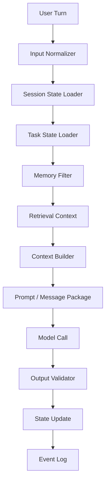
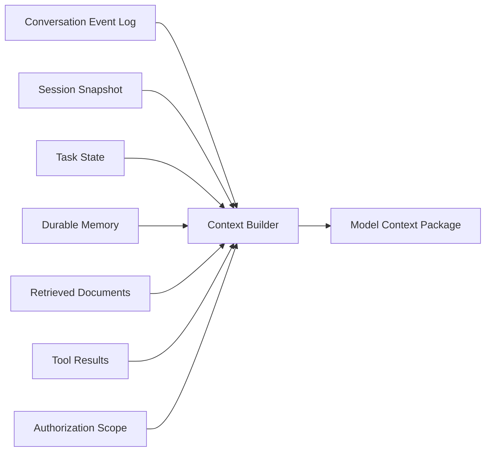
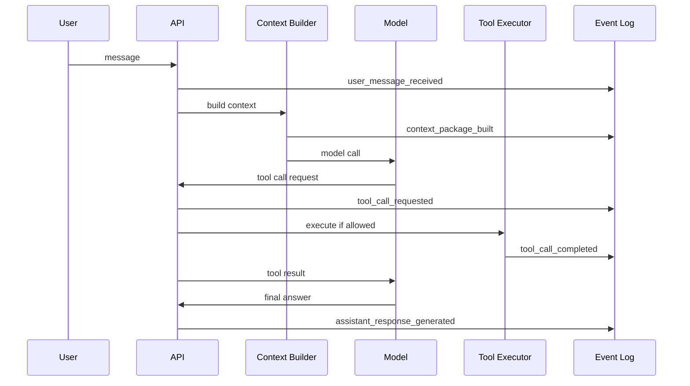
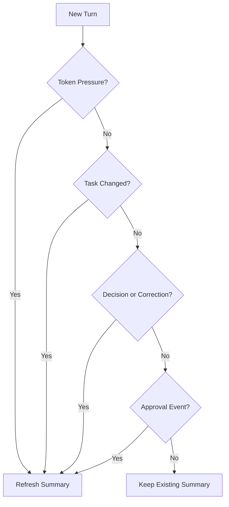
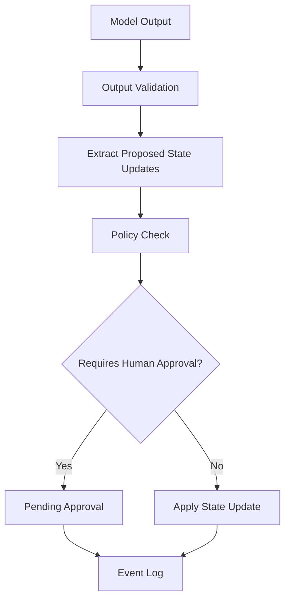

# Part 009 — Conversation State and Context Management

A production AI application rarely fails because the model cannot write fluent text.

It fails because the application gave the model the wrong context, too much context, stale context, unauthorized context, or no clear state boundary.

Conversation state is not "a list of chat messages". That is only one possible source of state.

In a serious AI application, state includes:

- current user intent,
- active task,
- conversation history,
- extracted durable facts,
- temporary working memory,
- retrieval results,
- tool outputs,
- policy decisions,
- authorization scope,
- output contract,
- unresolved decisions,
- human approvals,
- and audit metadata.

This part teaches how to design conversation state as an explicit engineering boundary, not as accidental prompt accumulation.

---

## 1. Kaufman Framing

The target skill:

> Given a multi-turn AI application, preserve enough state for the model to behave correctly while preventing context bloat, privacy leakage, stale assumptions, and hidden non-determinism.

Decompose it into subskills.

| Subskill | Meaning | Failure If Ignored |
|---|---|---|
| State taxonomy | Classify what kind of state exists | Everything becomes "chat history" |
| Session modeling | Represent conversation turns and active task | Model forgets what workflow it is in |
| Context assembly | Decide what to include in the model call | Wrong or excessive context enters prompt |
| Token budgeting | Pack limited context window intentionally | Important facts get truncated |
| Summarization | Compress history without losing invariants | Summary lies or drops decisions |
| Memory boundary | Separate durable memory from temporary state | Private/stale facts leak across sessions |
| Auditability | Record what context was shown to the model | Failures cannot be reproduced |
| Privacy control | Enforce tenant/user/data boundaries | Unauthorized context exposure |

The first practice goal is simple:

> Build a context builder that accepts structured state and returns a deterministic, budgeted, auditable context package.

---

## 2. Core Mental Model

Treat the model call as a pure-ish function over an explicit context package.



The important rule:

> The model should never receive "whatever happened before". It should receive a deliberate context package built from typed state sources.

A good context package answers these questions:

1. Who is the user and what authority do they have?
2. What is the current task?
3. What has already been decided?
4. What facts are relevant now?
5. What facts are unsafe, stale, or out of scope?
6. What output contract must be followed?
7. What should the model not assume?

---

## 3. State Is Not Context

State is the source of truth stored by your system.

Context is the selected, transformed, ordered subset shown to the model.



Never make the model context your only state store.

If you do, these problems appear quickly:

- You cannot reproduce failures.
- You cannot inspect what was persisted versus inferred.
- You cannot expire or redact sensitive data reliably.
- You cannot distinguish model-generated summary from user-confirmed fact.
- You cannot recover long-running tasks after process restart.
- You cannot enforce tenant isolation confidently.

---

## 4. State Taxonomy

A useful state taxonomy for AI apps:

| State Type | Lifetime | Source | Example | Should Enter Prompt? |
|---|---:|---|---|---|
| Request state | One call | API request | current message, locale, request id | Yes |
| Session state | One conversation/thread | event log + snapshot | active workflow, recent decisions | Usually |
| Task state | Until task completion | workflow engine | investigation case id, current step | Yes |
| Tool state | One tool execution | tool executor | API response, status, error | Sometimes |
| Retrieval context | One model call | retriever | top chunks, citations | Yes, budgeted |
| Durable memory | Across sessions | user/system memory store | user preference, known project | Only if relevant and allowed |
| Policy state | Varies | policy engine | role permissions, data classification | Yes, often compact |
| Audit state | Permanent/retained | trace/event store | prompt version, model id, context ids | No, but logged |

A strong engineering habit:

> Every state field must have an owner, lifetime, source, trust level, and deletion policy.

---

## 5. Conversation Event Log

The event log is the canonical history of what happened.

It should be append-only where possible.

Example events:

- `user_message_received`
- `assistant_response_generated`
- `tool_call_requested`
- `tool_call_authorized`
- `tool_call_rejected`
- `tool_call_completed`
- `context_package_built`
- `summary_generated`
- `human_approval_requested`
- `human_approval_granted`
- `task_state_changed`



The event log is not always what you send to the model. It is what you use to reconstruct what happened.

---

## 6. Session Snapshot

A snapshot is a compact materialized view derived from the event log.

It exists so your application does not need to replay the full history for every request.

A session snapshot may contain:

- active task name,
- current workflow step,
- unresolved user asks,
- confirmed facts,
- rejected assumptions,
- latest summary,
- relevant entity ids,
- active constraints,
- last model response id,
- last tool results,
- pending approval ids.

Important distinction:

| Event Log | Snapshot |
|---|---|
| Canonical history | Current derived state |
| Append-only | Mutable/materialized |
| Useful for audit/replay | Useful for runtime speed |
| Verbose | Compact |
| Harder to query quickly | Easy to load per request |

Do not put everything into the snapshot. Put only what the runtime needs frequently.

---

## 7. Minimal Python State Model

Use explicit types.

```python
from __future__ import annotations

from datetime import datetime, timezone
from enum import Enum
from typing import Any, Literal
from uuid import UUID, uuid4

from pydantic import BaseModel, Field


class Actor(str, Enum):
    USER = "user"
    ASSISTANT = "assistant"
    TOOL = "tool"
    SYSTEM = "system"


class TrustLevel(str, Enum):
    USER_CLAIMED = "user_claimed"
    SYSTEM_VERIFIED = "system_verified"
    MODEL_INFERRED = "model_inferred"
    TOOL_OBSERVED = "tool_observed"


class ConversationTurn(BaseModel):
    id: UUID = Field(default_factory=uuid4)
    session_id: UUID
    actor: Actor
    content: str
    created_at: datetime = Field(default_factory=lambda: datetime.now(timezone.utc))
    metadata: dict[str, Any] = Field(default_factory=dict)


class ConfirmedFact(BaseModel):
    key: str
    value: str
    source_turn_id: UUID | None = None
    trust_level: TrustLevel
    created_at: datetime = Field(default_factory=lambda: datetime.now(timezone.utc))
    expires_at: datetime | None = None


class TaskState(BaseModel):
    task_name: str
    current_step: str
    entity_ids: dict[str, str] = Field(default_factory=dict)
    pending_questions: list[str] = Field(default_factory=list)
    pending_approvals: list[str] = Field(default_factory=list)


class SessionSnapshot(BaseModel):
    session_id: UUID
    user_id: str
    tenant_id: str
    active_task: TaskState | None = None
    confirmed_facts: list[ConfirmedFact] = Field(default_factory=list)
    rejected_assumptions: list[str] = Field(default_factory=list)
    running_summary: str | None = None
    updated_at: datetime = Field(default_factory=lambda: datetime.now(timezone.utc))
```

Notice the explicit `trust_level`.

A fact extracted by a model is not the same as a fact verified by a backend system.

---

## 8. Context Items

Do not concatenate strings too early.

Represent context items as structured objects until the last possible moment.

```python
from enum import IntEnum


class ContextPriority(IntEnum):
    CRITICAL = 100
    HIGH = 80
    MEDIUM = 50
    LOW = 20


class ContextItem(BaseModel):
    id: str
    kind: Literal[
        "system_instruction",
        "task_state",
        "recent_turn",
        "summary",
        "confirmed_fact",
        "retrieved_document",
        "tool_result",
        "policy",
        "output_contract",
    ]
    content: str
    priority: ContextPriority
    estimated_tokens: int
    source: str
    trust_level: TrustLevel | None = None
    metadata: dict[str, Any] = Field(default_factory=dict)
```

This lets you:

- sort by priority,
- filter by authorization,
- log source ids,
- cap token usage,
- inspect what was included,
- and write deterministic tests.

---

## 9. Context Package

A context package is the final model input envelope.

```python
class ContextPackage(BaseModel):
    session_id: UUID
    user_id: str
    tenant_id: str
    model_profile: str
    prompt_version: str
    items: list[ContextItem]
    total_estimated_tokens: int
    excluded_items: list[ContextItem] = Field(default_factory=list)

    def render_messages(self) -> list[dict[str, str]]:
        system_parts: list[str] = []
        user_parts: list[str] = []

        for item in self.items:
            block = f"[{item.kind}:{item.id}]\n{item.content}"
            if item.kind in {"system_instruction", "policy", "output_contract"}:
                system_parts.append(block)
            else:
                user_parts.append(block)

        return [
            {"role": "system", "content": "\n\n".join(system_parts)},
            {"role": "user", "content": "\n\n".join(user_parts)},
        ]
```

In real implementations, rendering may target different provider message formats. The principle remains: context is built first, rendered second.

---

## 10. Context Budgeting

A model has a finite context window. Even when the window is large, attention, latency, and cost remain finite.

Context budgeting is not just about avoiding token overflow. It is about preserving decision quality.

A practical budget split:

| Context Segment | Example Budget | Why |
|---|---:|---|
| System/developer instructions | 10-15% | Stable behavior |
| Current user request | 5-10% | Immediate intent |
| Task state | 10-20% | Workflow continuity |
| Relevant recent turns | 10-20% | Conversational continuity |
| Retrieved evidence | 30-50% | Grounding |
| Tool results | 5-15% | External facts |
| Output contract | 5-10% | Machine-readable result |

This is not a universal formula. It is a starting point.

For RAG-heavy tasks, retrieved evidence may dominate. For workflow tasks, task state and tool results may dominate. For customer support chat, recent turns may matter more.

---

## 11. Deterministic Context Packing

A simple context packer:

```python
class ContextBudgetExceeded(Exception):
    pass


class ContextPacker:
    def __init__(self, max_tokens: int):
        self.max_tokens = max_tokens

    def pack(self, items: list[ContextItem]) -> tuple[list[ContextItem], list[ContextItem]]:
        ordered = sorted(
            items,
            key=lambda item: (-int(item.priority), item.kind, item.id),
        )

        included: list[ContextItem] = []
        excluded: list[ContextItem] = []
        used = 0

        for item in ordered:
            if used + item.estimated_tokens <= self.max_tokens:
                included.append(item)
                used += item.estimated_tokens
            else:
                excluded.append(item)

        critical_excluded = [
            item for item in excluded
            if item.priority == ContextPriority.CRITICAL
        ]
        if critical_excluded:
            raise ContextBudgetExceeded(
                f"Critical context did not fit: {[item.id for item in critical_excluded]}"
            )

        return included, excluded
```

This is intentionally boring. Boring is good for infrastructure.

Improve it later with:

- reserved budgets per category,
- recency scoring,
- retrieval relevance score,
- semantic compression,
- citation preservation,
- and adaptive packing by task type.

---

## 12. Context Builder

A context builder should be explicit about inputs.

```python
class BuildContextCommand(BaseModel):
    session_id: UUID
    user_id: str
    tenant_id: str
    current_user_message: str
    model_profile: str
    token_budget: int


class ContextBuilder:
    def __init__(
        self,
        session_store: "SessionStore",
        memory_store: "MemoryStore",
        retrieval_service: "RetrievalService",
        policy_service: "PolicyService",
        token_estimator: "TokenEstimator",
    ) -> None:
        self.session_store = session_store
        self.memory_store = memory_store
        self.retrieval_service = retrieval_service
        self.policy_service = policy_service
        self.token_estimator = token_estimator

    async def build(self, command: BuildContextCommand) -> ContextPackage:
        snapshot = await self.session_store.load_snapshot(command.session_id)
        authorization = await self.policy_service.scope_for_user(
            user_id=command.user_id,
            tenant_id=command.tenant_id,
        )

        recent_turns = await self.session_store.load_recent_turns(
            session_id=command.session_id,
            limit=12,
        )

        memories = await self.memory_store.search_relevant_memories(
            user_id=command.user_id,
            query=command.current_user_message,
            authorization=authorization,
            limit=5,
        )

        retrieved_docs = await self.retrieval_service.retrieve(
            tenant_id=command.tenant_id,
            query=command.current_user_message,
            authorization=authorization,
            limit=8,
        )

        candidate_items = self._to_context_items(
            snapshot=snapshot,
            recent_turns=recent_turns,
            memories=memories,
            retrieved_docs=retrieved_docs,
            current_user_message=command.current_user_message,
            authorization=authorization,
        )

        packer = ContextPacker(max_tokens=command.token_budget)
        included, excluded = packer.pack(candidate_items)

        return ContextPackage(
            session_id=command.session_id,
            user_id=command.user_id,
            tenant_id=command.tenant_id,
            model_profile=command.model_profile,
            prompt_version="conversation-v3",
            items=included,
            excluded_items=excluded,
            total_estimated_tokens=sum(item.estimated_tokens for item in included),
        )
```

The builder is the policy enforcement point for context.

It should not be bypassed by ad hoc prompt construction in feature code.

---

## 13. Recent Turns Strategy

Naive strategy:

> Always include the last N messages.

Better strategy:

- Always include the current user message.
- Include recent turns only up to a budget.
- Include turns related to active unresolved questions.
- Include decisions and corrections even if older.
- Exclude chit-chat if irrelevant.
- Exclude tool trace noise unless needed.
- Include human approvals and denials.

A recent turn is more valuable when it contains:

- a constraint,
- a correction,
- a decision,
- an entity reference,
- a refusal boundary,
- an unresolved task,
- or a preference relevant to the current request.

---

## 14. Summarization Strategy

Summarization is dangerous when treated as compression only.

A summary becomes part of state. If it is wrong, the model may repeatedly act on wrong state.

Use structured summaries.

```python
class SessionSummary(BaseModel):
    user_goal: str | None = None
    active_task: str | None = None
    confirmed_decisions: list[str] = Field(default_factory=list)
    open_questions: list[str] = Field(default_factory=list)
    rejected_assumptions: list[str] = Field(default_factory=list)
    important_entities: dict[str, str] = Field(default_factory=dict)
    risk_notes: list[str] = Field(default_factory=list)
    last_updated_turn_id: UUID
```

Bad summary:

> The user wants help with a case.

Good summary:

> Active task: draft enforcement escalation analysis for Case C-1042. Confirmed: user wants regulatory defensibility and audit trail. Rejected assumption: do not assume violation intent. Open question: whether inspection evidence has been verified. Important entity: licensee ACME-77.

A good summary preserves state invariants, not prose style.

---

## 15. Summary Refresh Policy

Do not summarize every turn blindly.

Trigger summary refresh when:

- conversation exceeds a turn threshold,
- token budget pressure occurs,
- active task changes,
- a major decision is made,
- human approval/rejection occurs,
- model detects unresolved references,
- or the user corrects prior state.



The summary generator itself should have an output schema and eval tests.

---

## 16. Memory Boundary

Memory is not the same as history.

History answers:

> What happened in this conversation?

Memory answers:

> What durable fact should be available in future conversations?

Most facts should not become durable memory.

A durable memory candidate must pass checks:

| Check | Question |
|---|---|
| Relevance | Will this be useful later? |
| Stability | Is it likely to remain true? |
| Consent | Is it appropriate to store? |
| Sensitivity | Does it contain private or regulated data? |
| Source | Was it user-confirmed or model-inferred? |
| Expiry | Should it expire? |
| Scope | User-level, tenant-level, team-level, or case-level? |

Never store model speculation as durable memory without clear labeling and review.

---

## 17. Working Memory vs Long-Term Memory

| Type | Lifetime | Example | Storage |
|---|---:|---|---|
| Working memory | Current call/workflow | intermediate plan, candidate tool route | in-process/task state |
| Session memory | Current thread | summary, active task, unresolved questions | session store |
| Long-term memory | Across threads | stable user preference, project context | memory store |
| Domain memory | System knowledge | policy documents, cases, procedures | knowledge base/RAG |

Common mistake:

> Saving domain knowledge into user memory.

If a rule belongs to the organization, put it in the knowledge base. If a fact belongs to a case, put it in the case store. If a preference belongs to the user, put it in user memory.

---

## 18. Context Freshness

State has age.

A model should be told when information may be stale.

Examples:

- "The last retrieved policy version is from 2026-04-15."
- "The case status in session summary may be stale; verify before action."
- "This tool result was observed 2 minutes ago."
- "This user preference was stored 9 months ago."

A practical pattern:

```python
class Freshness(BaseModel):
    observed_at: datetime
    expires_at: datetime | None = None
    stale_after_seconds: int | None = None

    def is_stale(self, now: datetime) -> bool:
        if self.expires_at and now >= self.expires_at:
            return True
        if self.stale_after_seconds is None:
            return False
        age = (now - self.observed_at).total_seconds()
        return age > self.stale_after_seconds
```

For high-stakes workflows, stale context should trigger verification before action.

---

## 19. Cross-Turn Reference Resolution

Users say:

- "do that again"
- "use the second one"
- "same as before"
- "continue"
- "remove it"

These are not directly executable commands. They require reference resolution.

A reference resolver should use:

- recent turns,
- active task state,
- visible UI selection,
- entity ids,
- tool results,
- and disambiguation policy.

Do not let the model guess silently when multiple candidates exist.

```python
class ResolvedReference(BaseModel):
    phrase: str
    entity_type: str
    entity_id: str | None
    confidence: float
    requires_clarification: bool
    reason: str
```

For regulated systems, ambiguous references should often become clarification questions rather than actions.

---

## 20. Context Ordering

Ordering affects model behavior.

A stable ordering pattern:

1. Role and non-negotiable policies.
2. User authority and data scope.
3. Current task state.
4. Current user request.
5. Relevant confirmed facts.
6. Retrieved evidence.
7. Tool results.
8. Recent conversation turns.
9. Output contract.

Why current request before old turns?

Because old turns can create anchoring bias. The current user request should dominate unless a prior decision is explicitly still active.

Why output contract last?

Because the final visible instruction often strongly influences format. In some provider formats, structured output schema is passed separately; when rendered into prompt text, putting format constraints near the end can help reduce drift.

---

## 21. State Update After Model Output

A model output should not mutate durable state directly.

Use a state update pipeline.



Examples of safe automatic updates:

- update session summary,
- record assistant response,
- store tool result in trace,
- update active step after successful deterministic tool execution.

Examples requiring caution:

- storing new durable memory,
- changing case status,
- assigning violation category,
- sending notification,
- deleting records,
- escalating enforcement stage.

---

## 22. State Invariants

Define invariants early.

Examples:

1. A session belongs to exactly one tenant.
2. A context package may only include documents authorized for the current user.
3. Durable memory must not be created from model-inferred facts without explicit policy allowance.
4. A tool result may be included only if its source tool execution succeeded and matches the current session/task.
5. A stale case status cannot be used for irreversible actions.
6. A summary must reference the last turn id it covers.
7. A rejected assumption must not reappear as a confirmed fact without new evidence.
8. A context package must be logged before model invocation.

These invariants are testable.

---

## 23. Testing Context Builders

A context builder is infrastructure. Test it like infrastructure.

Test cases:

| Test | Expected Result |
|---|---|
| Critical policy always included | Context contains policy item |
| Unauthorized document filtered | Document absent from package |
| Token pressure excludes low priority items | Low priority items excluded |
| Critical item too large | Builder fails closed |
| Stale memory excluded | Memory absent or labeled stale |
| Summary references last covered turn | Summary metadata valid |
| Cross-tenant memory not included | No leakage |
| Same input creates same package | Deterministic output |

Example unit test:

```python
def test_context_packer_excludes_low_priority_items() -> None:
    items = [
        ContextItem(
            id="policy",
            kind="policy",
            content="Never expose unauthorized records.",
            priority=ContextPriority.CRITICAL,
            estimated_tokens=20,
            source="policy:v1",
        ),
        ContextItem(
            id="smalltalk",
            kind="recent_turn",
            content="The user said hello.",
            priority=ContextPriority.LOW,
            estimated_tokens=100,
            source="turn:1",
        ),
    ]

    packer = ContextPacker(max_tokens=40)
    included, excluded = packer.pack(items)

    assert [item.id for item in included] == ["policy"]
    assert [item.id for item in excluded] == ["smalltalk"]
```

---

## 24. Eval for Conversation State

State bugs often appear only after multiple turns.

Create multi-turn eval scenarios.

Example scenario:

```yaml
name: user_corrects_prior_assumption
turns:
  - user: "Case C-1042 is not urgent. Just summarize the evidence."
  - assistant_should: "acknowledge non-urgent summary task"
  - user: "Actually, new evidence makes it urgent. Escalate the risk analysis only, don't change the case status."
  - assistant_should:
      - "treat urgency as updated"
      - "not change official case status"
      - "ask for approval before any irreversible workflow mutation"
```

Evaluate:

- Was the old state superseded?
- Did the new constraint persist?
- Did the assistant avoid unauthorized action?
- Did the context include the correction?
- Did the summary update correctly?

---

## 25. Conversation State Failure Modes

| Failure Mode | Symptom | Root Cause | Mitigation |
|---|---|---|---|
| Context bloat | High latency, worse answer | Too many raw turns | Budgeting + summaries |
| Lost decision | Assistant repeats old question | Decision not captured in state | Decision extraction |
| Stale memory | Assistant uses old preference | No freshness policy | Expiry + relevance check |
| Cross-tenant leakage | Wrong customer data appears | Authorization skipped | Context builder as policy gate |
| Summary drift | Summary invents/changes facts | Unvalidated model summary | Structured summary + eval |
| Ambiguous reference | Wrong item modified | Resolver guessed silently | clarification threshold |
| Hidden prompt mutation | Behavior changes unexpectedly | Unversioned context/prompt | prompt/context versioning |
| Irreproducible bug | Cannot replay issue | Context not logged | context package audit log |

---

## 26. Observability

Log enough to debug without leaking sensitive content unnecessarily.

Recommended trace fields:

- `session_id`
- `tenant_id`
- `request_id`
- `context_package_id`
- `prompt_version`
- `model_profile`
- `included_context_item_ids`
- `excluded_context_item_ids`
- `token_budget`
- `estimated_tokens`
- `retrieval_query_id`
- `summary_version`
- `state_snapshot_version`
- `policy_scope_hash`

For sensitive systems, store redacted content in general traces and full content only in restricted audit storage.

---

## 27. Privacy and Retention

Conversation state can contain sensitive data.

Design for deletion and minimization.

Questions to answer before production:

1. What state is retained?
2. For how long?
3. Who can access it?
4. Is it encrypted?
5. Can a user request deletion?
6. Are model prompts stored?
7. Are retrieved documents copied into traces?
8. Are tool results retained?
9. Is PII redacted before analytics?
10. Are summaries considered derived personal data?

A summary may still contain sensitive information. Do not treat it as safe just because it is shorter.

---

## 28. Regulated Case-Management Example

Imagine an AI assistant for enforcement case triage.

Bad context:

```text
Here is the whole conversation and all case notes. Help the officer decide.
```

Good context:

```text
Task: Draft a non-binding preliminary risk assessment.
Authority: User may view case C-1042 but may not change status.
Case status: Open, verified by case-service at 2026-06-28T04:17Z.
Relevant evidence: inspection report IR-77, complaint CP-12.
Rejected assumption: Do not infer intentional misconduct.
Required output: risk categories, evidence references, missing information, no final enforcement recommendation.
Policy: Escalation requires human approval.
```

The second context is not just shorter. It is safer, more auditable, and more actionable.

---

## 29. Implementation Checklist

Before shipping conversation state:

- [ ] There is a typed session model.
- [ ] Event log and snapshot are separate.
- [ ] Context builder is the only path to model context.
- [ ] Context package is logged or reproducible.
- [ ] Authorization filtering happens before context packing.
- [ ] Token budget is explicit.
- [ ] Critical context fails closed if it cannot fit.
- [ ] Summary has structured schema.
- [ ] Durable memory has consent/scope/freshness policy.
- [ ] Cross-turn references have resolver logic.
- [ ] State updates after model output are validated.
- [ ] Multi-turn eval scenarios exist.
- [ ] Sensitive state has retention/redaction rules.

---

## 30. Practice Exercise

Build a small context management module.

Requirements:

1. Define `ConversationTurn`, `SessionSnapshot`, `ContextItem`, and `ContextPackage`.
2. Implement `ContextPacker` with deterministic priority order.
3. Implement a fake `ContextBuilder` that combines:
   - current user message,
   - session summary,
   - recent turns,
   - confirmed facts,
   - fake retrieved documents,
   - output contract.
4. Add tests for:
   - unauthorized item exclusion,
   - token pressure,
   - deterministic ordering,
   - critical item fail-closed,
   - stale memory exclusion.
5. Log `included_context_item_ids` and `excluded_context_item_ids`.

Stretch goal:

Create a multi-turn eval where the user corrects a prior assumption. Verify that the final context includes the correction and excludes the superseded assumption.

---

## 31. Key Takeaways

- Conversation state is an application-level responsibility, not a model feature.
- State and context are different.
- The context package should be deliberate, typed, budgeted, authorized, and auditable.
- Summaries are state transformations and must be validated.
- Memory needs scope, lifetime, trust level, and deletion policy.
- Multi-turn AI quality depends less on "chat history" and more on state invariants.

---

## 32. References

- OpenAI API docs: Conversation state — https://developers.openai.com/api/docs/guides/conversation-state
- OpenAI API docs: Prompting — https://developers.openai.com/api/docs/guides/prompting
- LangChain docs: Memory overview — https://docs.langchain.com/oss/python/concepts/memory
- LangGraph docs: Persistence — https://docs.langchain.com/oss/python/langgraph/persistence
- LangGraph docs: Interrupts — https://docs.langchain.com/oss/python/langgraph/interrupts

---

## Next Part

Part 010 moves from state to runtime behavior: async execution, streaming, cancellation, timeout, queues, and backpressure.
