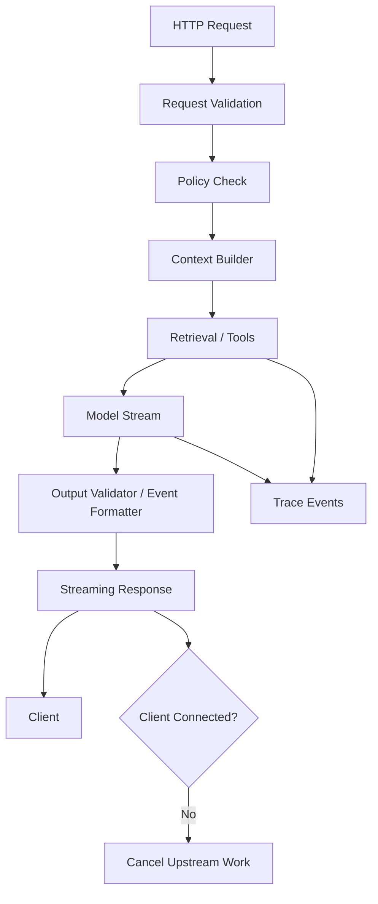
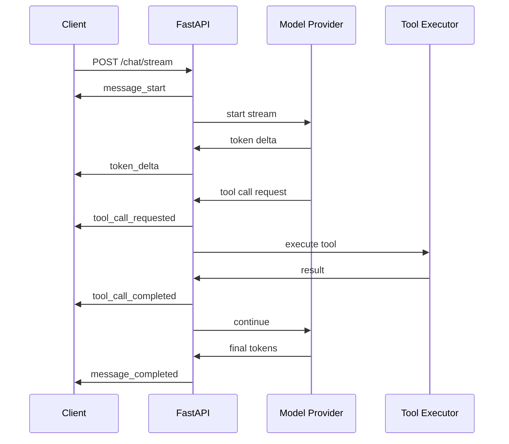
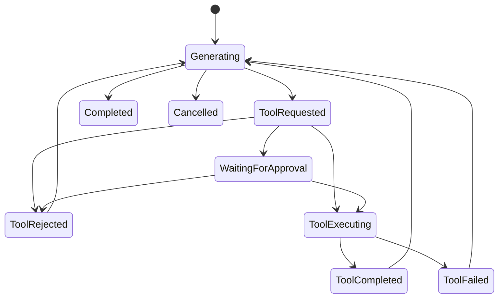
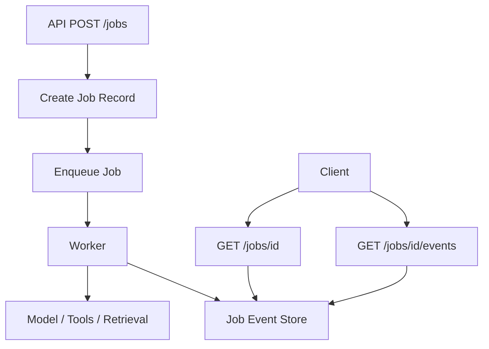

# Part 010 — Async, Streaming, and Backpressure

An AI application is not a normal request-response CRUD endpoint.

A single user request may trigger:

- input validation,
- policy checks,
- retrieval,
- reranking,
- model calls,
- streaming token events,
- tool calls,
- database writes,
- tracing,
- evaluation hooks,
- and cancellation cleanup.

Some steps are fast. Some are slow. Some are remote. Some may fail. Some may continue after the client disconnects unless you stop them deliberately.

This part teaches how to design Python AI runtimes using async execution, streaming, timeouts, cancellation, bounded queues, and backpressure.

---

## 1. Kaufman Framing

The target skill:

> Given an AI endpoint with remote model calls, streaming output, retrieval, and tool execution, build a runtime that remains responsive, cancellable, bounded, observable, and safe under load.

Decompose it into subskills.

| Subskill | Meaning | Failure If Ignored |
|---|---|---|
| Async mental model | Understand cooperative concurrency | Blocking calls freeze event loop |
| Streaming design | Emit partial results safely | User waits too long or receives broken stream |
| Timeout budgeting | Bound every remote operation | Requests hang indefinitely |
| Cancellation | Stop work when client/session stops | Waste cost and mutate state after disconnect |
| Backpressure | Prevent producers from overwhelming consumers | Memory growth, queue collapse, degraded latency |
| Rate limiting | Control provider and tenant usage | Provider throttling or runaway cost |
| Worker offloading | Move long tasks out of request path | API threads become unavailable |
| Observability | Trace each async phase | Runtime bugs become invisible |

The first practice goal:

> Build a streaming AI endpoint with cancellation-aware async generator and bounded queue.

---

## 2. Runtime Mental Model

A production AI request is a pipeline, not a function call.



The runtime must answer:

1. What can run concurrently?
2. What must run sequentially?
3. What is the total timeout budget?
4. What is the per-step timeout budget?
5. What happens if the client disconnects?
6. What happens if the model streams faster than the client consumes?
7. What happens if retrieval is slow?
8. What happens if a tool call is irreversible?

---

## 3. Why Async Matters in AI Apps

AI apps spend much of their time waiting on network I/O:

- model provider API,
- vector database,
- object storage,
- relational database,
- authorization service,
- tool APIs,
- tracing collector.

Async Python lets one process handle many waiting tasks without dedicating one OS thread per request.

But async is not magic.

It helps when work is I/O-bound. It does not make CPU-heavy parsing, OCR, embedding batch generation, or reranking automatically cheap. CPU-heavy work should be moved to worker pools or separate services.

---

## 4. Event Loop Invariant

The core invariant:

> Do not block the event loop.

Bad:

```python
import time

async def handler() -> dict[str, str]:
    time.sleep(5)  # blocks the event loop
    return {"status": "done"}
```

Better:

```python
import asyncio

async def handler() -> dict[str, str]:
    await asyncio.sleep(5)  # yields control
    return {"status": "done"}
```

Also avoid synchronous network clients inside async handlers unless explicitly isolated.

Bad pattern:

```python
async def call_model() -> str:
    return requests.post("https://provider.example.com", json={}).text
```

Use async clients or run blocking code outside the event loop.

---

## 5. Request Timeout Budget

A timeout should be designed as a budget, not sprinkled randomly.

Example budget for interactive AI chat:

| Phase | Budget |
|---|---:|
| Input validation + policy | 200 ms |
| Context load | 300 ms |
| Retrieval | 1,500 ms |
| Model first token | 3,000 ms |
| Full generation | 20,000 ms |
| Final validation/write | 500 ms |

The whole request may have 25 seconds, but each phase has its own limit.

```python
from dataclasses import dataclass


@dataclass(frozen=True)
class TimeoutBudget:
    total_seconds: float
    policy_seconds: float
    context_seconds: float
    retrieval_seconds: float
    first_token_seconds: float
    generation_seconds: float
    finalization_seconds: float
```

A model timeout is not the same as a retrieval timeout. Keep them distinct.

---

## 6. Cancellation Semantics

In `asyncio`, cancellation is cooperative. A task receives `asyncio.CancelledError` at an await point.

A cancellation-aware coroutine should:

1. clean up resources,
2. stop upstream streams,
3. release semaphores/locks,
4. avoid writing final state as if the task succeeded,
5. re-raise `CancelledError` after cleanup.

```python
import asyncio


async def stream_model_response() -> None:
    try:
        async for event in remote_model_stream():
            await emit(event)
    except asyncio.CancelledError:
        await close_remote_stream_if_needed()
        raise
    finally:
        await release_request_resources()
```

Do not swallow cancellation silently.

Bad:

```python
try:
    await do_work()
except Exception:
    pass
```

`CancelledError` is special, and cancellation should generally propagate after cleanup.

---

## 7. Streaming Response Mental Model

Streaming changes the endpoint contract.

Instead of:

```text
request -> wait -> full JSON response
```

You now have:

```text
request -> event -> event -> event -> final event
```

Each event should be meaningful.

Common event types:

- `message_start`
- `token_delta`
- `tool_call_requested`
- `tool_call_started`
- `tool_call_completed`
- `retrieval_completed`
- `warning`
- `error`
- `message_completed`



---

## 8. SSE Format

Server-Sent Events are often a good fit for one-way AI streaming.

An SSE event is text:

```text
event: token_delta
data: {"text":"hello"}

```

A helper:

```python
import json
from typing import Any


def sse(event: str, data: dict[str, Any]) -> str:
    return f"event: {event}\ndata: {json.dumps(data, ensure_ascii=False)}\n\n"
```

Use small, typed events rather than arbitrary text chunks.

---

## 9. FastAPI Streaming Skeleton

```python
from collections.abc import AsyncIterator

from fastapi import FastAPI, Request
from fastapi.responses import StreamingResponse
from pydantic import BaseModel

app = FastAPI()


class ChatRequest(BaseModel):
    session_id: str
    message: str


@app.post("/chat/stream")
async def chat_stream(request: Request, body: ChatRequest) -> StreamingResponse:
    async def event_stream() -> AsyncIterator[str]:
        yield sse("message_start", {"session_id": body.session_id})

        async for event in run_ai_stream(request=request, body=body):
            yield sse(event.type, event.payload)

        yield sse("message_completed", {"session_id": body.session_id})

    return StreamingResponse(
        event_stream(),
        media_type="text/event-stream",
    )
```

The simple version is not enough for production. We still need cancellation, backpressure, and timeouts.

---

## 10. Detecting Client Disconnect

A streaming endpoint should stop expensive upstream work when the client disconnects.

```python
async def event_stream() -> AsyncIterator[str]:
    try:
        yield sse("message_start", {"session_id": body.session_id})

        async for event in run_ai_stream(request=request, body=body):
            if await request.is_disconnected():
                raise asyncio.CancelledError()
            yield sse(event.type, event.payload)

        yield sse("message_completed", {"session_id": body.session_id})
    except asyncio.CancelledError:
        # optional: log cancellation as non-error operational event
        raise
```

Important:

- Do not continue model generation after the client disappears unless the user explicitly requested a background task.
- Do not mark the assistant message as completed if the stream was cancelled halfway.
- Do not run irreversible tool calls after disconnect unless already authorized and intentionally detached.

---

## 11. Producer-Consumer Streaming

Model providers may produce events faster or slower than your client consumes them.

Use a bounded queue between producer and response stream.

```python
import asyncio
from dataclasses import dataclass
from typing import Any


@dataclass(frozen=True)
class StreamEvent:
    type: str
    payload: dict[str, Any]


async def produce_events(queue: asyncio.Queue[StreamEvent]) -> None:
    async for delta in remote_model_stream():
        await queue.put(StreamEvent(type="token_delta", payload={"text": delta}))

    await queue.put(StreamEvent(type="done", payload={}))


async def consume_events(queue: asyncio.Queue[StreamEvent]) -> AsyncIterator[StreamEvent]:
    while True:
        event = await queue.get()
        try:
            if event.type == "done":
                break
            yield event
        finally:
            queue.task_done()
```

Make the queue bounded:

```python
queue: asyncio.Queue[StreamEvent] = asyncio.Queue(maxsize=100)
```

When the queue is full, `await queue.put(...)` pauses the producer. That is backpressure.

---

## 12. Cancellation-Aware Queue Pipeline

```python
async def run_stream_pipeline() -> AsyncIterator[StreamEvent]:
    queue: asyncio.Queue[StreamEvent] = asyncio.Queue(maxsize=100)
    producer = asyncio.create_task(produce_events(queue))

    try:
        async for event in consume_events(queue):
            yield event
    except asyncio.CancelledError:
        producer.cancel()
        try:
            await producer
        except asyncio.CancelledError:
            pass
        raise
    finally:
        if not producer.done():
            producer.cancel()
```

This pattern prevents orphaned producer tasks.

In production, also handle producer exceptions and surface a structured error event if possible.

---

## 13. Handling Producer Errors

If the model provider fails mid-stream, the client should receive a controlled error event.

```python
async def produce_events(queue: asyncio.Queue[StreamEvent]) -> None:
    try:
        async for delta in remote_model_stream():
            await queue.put(StreamEvent("token_delta", {"text": delta}))
    except Exception as exc:
        await queue.put(StreamEvent("error", {"code": "model_stream_failed"}))
    finally:
        await queue.put(StreamEvent("done", {}))
```

Do not leak raw provider exception text to end users. Put details in traces.

---

## 14. Semaphores for Concurrency Limits

Bound concurrency by resource.

```python
model_call_semaphore = asyncio.Semaphore(50)
retrieval_semaphore = asyncio.Semaphore(100)


async def call_model_with_limit() -> str:
    async with model_call_semaphore:
        return await call_model()
```

You may need different semaphores for:

- model provider calls,
- embedding calls,
- vector DB queries,
- reranker calls,
- tool executions,
- tenant-specific workloads.

Global concurrency limit alone is too coarse.

---

## 15. Tenant-Level Backpressure

In enterprise systems, one tenant should not starve others.

```python
class TenantLimiter:
    def __init__(self, default_limit: int):
        self.default_limit = default_limit
        self._semaphores: dict[str, asyncio.Semaphore] = {}

    def semaphore_for(self, tenant_id: str) -> asyncio.Semaphore:
        if tenant_id not in self._semaphores:
            self._semaphores[tenant_id] = asyncio.Semaphore(self.default_limit)
        return self._semaphores[tenant_id]


tenant_limiter = TenantLimiter(default_limit=5)


async def run_for_tenant(tenant_id: str) -> str:
    async with tenant_limiter.semaphore_for(tenant_id):
        return await call_model()
```

This is not a complete distributed rate limiter. It is a process-local starting point. For multi-instance deployments, use Redis or a gateway-level limiter.

---

## 16. Timeout with `asyncio.timeout`

```python
import asyncio


async def retrieve_with_timeout(query: str) -> list[str]:
    try:
        async with asyncio.timeout(1.5):
            return await retrieve_documents(query)
    except TimeoutError:
        return []
```

Failing open versus failing closed depends on the operation.

| Operation | Timeout Strategy |
|---|---|
| Optional suggestions | fail open with degraded response |
| Required authorization | fail closed |
| Evidence retrieval for grounded answer | fail closed or ask retry |
| Non-critical telemetry | drop/defer |
| Payment/action execution | fail closed with idempotency check |

For regulated workflows, missing evidence should not be hidden as if retrieval succeeded.

---

## 17. Parallel Retrieval and Policy Checks

Some work can run concurrently.

```python
async def prepare_context(user_id: str, tenant_id: str, query: str):
    async with asyncio.TaskGroup() as tg:
        policy_task = tg.create_task(load_policy_scope(user_id, tenant_id))
        session_task = tg.create_task(load_session_snapshot(user_id))

    policy_scope = policy_task.result()
    session_snapshot = session_task.result()

    # Retrieval depends on policy scope, so it runs after policy.
    docs = await retrieve_documents(query=query, policy_scope=policy_scope)

    return session_snapshot, docs
```

Do not parallelize steps that have security dependencies. Retrieval must happen after authorization scope is known.

---

## 18. Streaming Validation Boundary

Structured output validation is easier when the full response is complete. Streaming creates partial states.

Two strategies:

| Strategy | Description | Use When |
|---|---|---|
| Text streaming + final validation | Stream text deltas, validate final output afterward | Conversational UX |
| Event streaming | Stream typed events only | Tools/workflows/status UI |
| Buffered structured output | Do not expose final object until valid | Automation/high-stakes systems |

For high-stakes actions, do not execute based on partial streamed text.

---

## 19. Tool Calls During Streaming

If the model can call tools mid-stream, treat tool events as state transitions.



A tool call event should include:

- tool name,
- call id,
- sanitized arguments,
- authorization status,
- approval requirement,
- execution status,
- duration,
- error code if any.

---

## 20. Idempotency in Async Runtime

Retries and disconnects create duplicate execution risk.

Any side-effecting tool should require an idempotency key.

```python
class ToolExecutionCommand(BaseModel):
    call_id: str
    tool_name: str
    idempotency_key: str
    arguments: dict[str, object]
    user_id: str
    tenant_id: str
```

Example key:

```text
session:{session_id}:assistant-message:{message_id}:tool-call:{call_id}
```

If the same command is retried, the executor should return the prior result rather than executing the side effect again.

---

## 21. Long-Running Tasks

Do not keep HTTP streaming open for everything.

Some AI jobs are better modeled as asynchronous jobs:

- batch document ingestion,
- large report generation,
- multi-document analysis,
- long-running agent workflow,
- expensive eval run,
- human approval workflow.

Pattern:

```text
POST /jobs -> job_id
GET /jobs/{job_id} -> status
GET /jobs/{job_id}/events -> stream events
POST /jobs/{job_id}/cancel -> cancel
```

This separates job lifecycle from one HTTP request.

---

## 22. Queue-Based Worker Model



For long jobs, persist state frequently.

A worker should be able to:

- resume from checkpoint,
- stop on cancellation,
- handle duplicate delivery,
- record partial progress,
- and fail with a useful error code.

---

## 23. Backpressure Strategies

| Layer | Backpressure Mechanism |
|---|---|
| HTTP ingress | rate limit, request size limit, auth quotas |
| Per tenant | semaphore, token budget, queue limit |
| Model provider | concurrency limit, retry-after handling |
| Stream output | bounded queue |
| Worker queue | max queue depth, priority queue |
| Vector DB | query concurrency limit |
| Tool execution | per-tool concurrency and approval gates |
| Cost | budget cap, model routing |

Backpressure should produce explicit responses:

- `429 Too Many Requests`,
- `503 Service Unavailable`,
- stream `warning` event,
- degraded mode,
- queued job status,
- or a retry-after hint.

Silent degradation is dangerous.

---

## 24. Retry Boundaries

Retries are not universally safe.

Safe to retry:

- read-only retrieval,
- idempotent provider call before any side effect,
- transient telemetry write,
- status polling.

Unsafe without idempotency:

- sending email,
- changing case status,
- creating enforcement action,
- charging money,
- submitting external form.

Retry policy should include:

- max attempts,
- exponential backoff,
- jitter,
- retryable error codes,
- timeout budget awareness,
- idempotency key for side effects.

---

## 25. Graceful Degradation

When a non-critical dependency fails, degrade deliberately.

Examples:

| Dependency Failure | Possible Degradation |
|---|---|
| Suggestions retriever down | Answer without suggestions |
| Reranker timeout | Use first-stage retrieval with warning |
| Analytics collector down | Continue request, buffer/drop telemetry |
| Expensive model unavailable | Route to smaller model if eval-approved |
| Citation service down | Refuse grounded answer or ask retry |

Do not degrade high-stakes safety checks.

Authorization failure is not a degradation opportunity.

---

## 26. Observability for Async AI Runtime

Trace phases separately.

Recommended spans:

- `http.request`
- `input.validation`
- `policy.check`
- `context.load`
- `retrieval.query`
- `rerank`
- `model.stream`
- `stream.emit`
- `tool.call`
- `state.persist`
- `finalize`

Recommended metrics:

- time to first token,
- total stream duration,
- generated tokens,
- queue depth,
- cancellation count,
- timeout count by phase,
- model concurrency in use,
- tenant concurrency in use,
- stream error rate,
- provider retry count,
- client disconnect rate.

A high disconnect rate may indicate slow first token, bad UX, mobile network issues, or frontend timeout mismatch.

---

## 27. Testing Async Streaming

Test the runtime with fake providers.

```python
class FakeStreamingModel:
    def __init__(self, chunks: list[str], delay_seconds: float = 0.0):
        self.chunks = chunks
        self.delay_seconds = delay_seconds

    async def stream(self):
        for chunk in self.chunks:
            if self.delay_seconds:
                await asyncio.sleep(self.delay_seconds)
            yield chunk
```

Test cases:

| Test | Expected Result |
|---|---|
| normal stream | emits start, deltas, completed |
| provider error | emits structured error, closes stream |
| client cancellation | producer task is cancelled |
| slow consumer | bounded queue prevents memory growth |
| timeout | operation stops within budget |
| side-effect retry | idempotency prevents duplicate execution |

---

## 28. Example Streaming Use Case

Regulatory case assistant request:

> "Summarize case C-1042 and identify whether escalation review is needed."

Runtime sequence:

1. Validate user/session.
2. Load authorization scope.
3. Load case task state.
4. Retrieve evidence documents.
5. Start stream: `message_start`.
6. Emit status: `retrieval_completed`.
7. Stream summary tokens.
8. Model requests escalation policy lookup.
9. Tool executor checks policy and reads policy document.
10. Emit `tool_call_completed`.
11. Continue answer.
12. Validate final response: no unauthorized status mutation.
13. Persist assistant message and trace.
14. Emit `message_completed`.

If the client disconnects at step 7:

- model stream should be cancelled,
- no final assistant message should be marked complete,
- no escalation action should be taken,
- trace should record cancellation.

---

## 29. Anti-Patterns

| Anti-Pattern | Why It Fails |
|---|---|
| Synchronous provider client inside async endpoint | Blocks event loop |
| No timeout around model stream | Requests hang indefinitely |
| Swallowing `CancelledError` | Orphan work and cost leakage |
| Unbounded queue | Memory grows under slow clients |
| Streaming raw provider payload | Leaks provider details and unstable schema |
| Retrying side effects blindly | Duplicate external actions |
| One global semaphore only | Tenant/resource unfairness |
| Doing document ingestion in request handler | API becomes slow/unavailable |
| Marking partial stream as complete | Corrupts conversation state |

---

## 30. Implementation Checklist

Before shipping async/streaming AI endpoints:

- [ ] All remote calls have timeouts.
- [ ] Blocking calls are not executed on the event loop.
- [ ] Streaming uses typed events.
- [ ] Client disconnect cancels upstream work.
- [ ] `CancelledError` is not swallowed silently.
- [ ] Producer/consumer queue is bounded.
- [ ] Model calls have concurrency limits.
- [ ] Tenant-level limits exist.
- [ ] Side-effecting tools use idempotency keys.
- [ ] Long-running tasks use job/worker model.
- [ ] Partial streams are not persisted as completed messages.
- [ ] Observability captures time to first token and cancellation.
- [ ] Tests cover provider error, timeout, and cancellation.

---

## 31. Practice Exercise

Build a streaming AI endpoint with fake components.

Requirements:

1. Create a FastAPI `/chat/stream` endpoint.
2. Use SSE event format.
3. Implement fake model streaming chunks with delay.
4. Use a bounded `asyncio.Queue` between producer and consumer.
5. Cancel producer on client disconnect or generator cancellation.
6. Add timeout around fake retrieval.
7. Add semaphore around fake model call.
8. Emit structured events:
   - `message_start`,
   - `retrieval_completed`,
   - `token_delta`,
   - `error`,
   - `message_completed`.
9. Add tests for:
   - normal stream,
   - provider error,
   - timeout,
   - cancellation,
   - bounded queue behavior.

Stretch goal:

Add a fake side-effecting tool with idempotency key. Prove duplicate retry does not duplicate the side effect.

---

## 32. Key Takeaways

- AI runtime is a distributed async pipeline, not a single function call.
- Streaming improves UX but increases state and cancellation complexity.
- Cancellation must propagate upstream or cost and side effects leak.
- Bounded queues are the simplest backpressure primitive.
- Timeouts should be phase budgets, not random constants.
- Long-running AI workflows should become jobs with checkpoints.
- Production AI apps need runtime invariants as much as prompt quality.

---

## 33. References

- Python docs: `asyncio` — https://docs.python.org/3/library/asyncio.html
- Python docs: Coroutines and Tasks — https://docs.python.org/3/library/asyncio-task.html
- Python docs: `asyncio` Exceptions — https://docs.python.org/3/library/asyncio-exceptions.html
- FastAPI docs: StreamingResponse / custom responses — https://fastapi.tiangolo.com/advanced/custom-response/
- FastAPI docs: Stream data — https://fastapi.tiangolo.com/advanced/stream-data/
- FastAPI docs: Server-Sent Events — https://fastapi.tiangolo.com/tutorial/server-sent-events/
- LangGraph docs: Persistence — https://docs.langchain.com/oss/python/langgraph/persistence
- LangGraph docs: Interrupts — https://docs.langchain.com/oss/python/langgraph/interrupts

---

## Next Part

Part 011 starts the RAG layer: embeddings and semantic representation.
