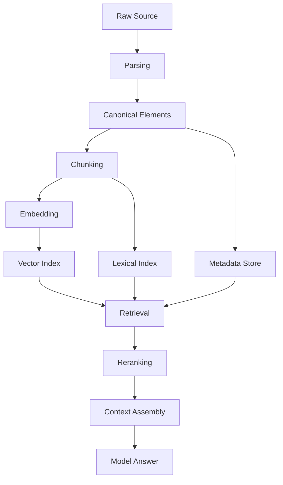
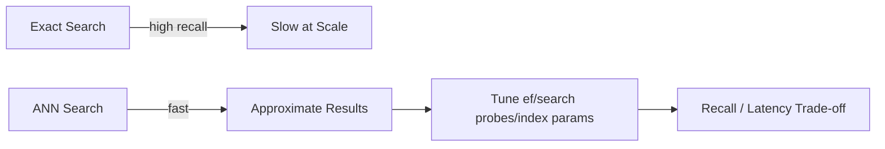
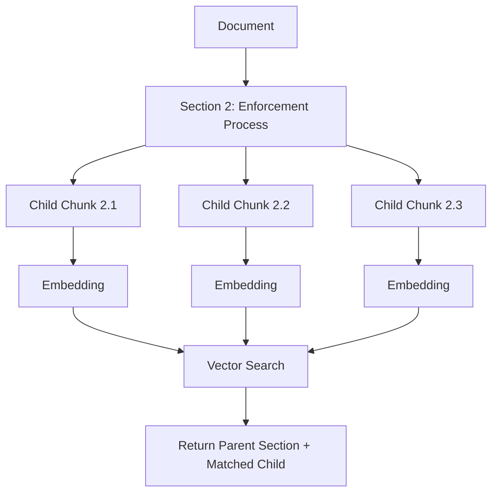
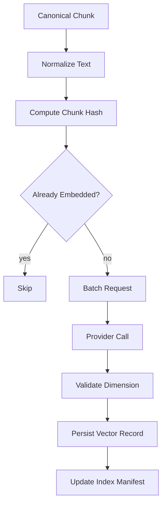
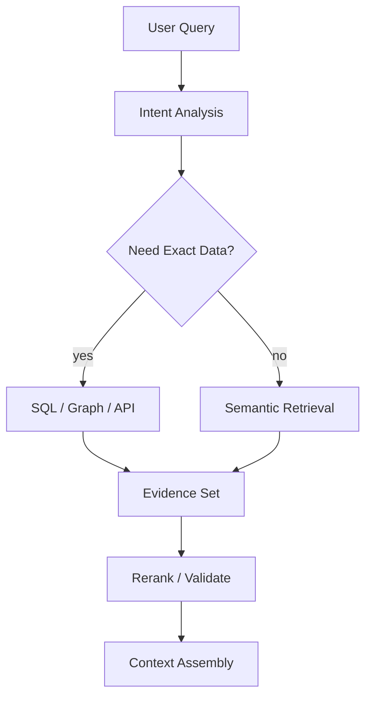
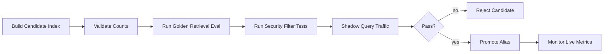

# Part 011 — Embeddings and Semantic Representation

A RAG system fails long before the answer is generated.

It often fails when the application converts domain knowledge into a representation that loses the relationships users actually care about.

Embeddings are not magic. They are lossy numeric representations of text, documents, queries, images, or other inputs. They make approximate similarity search possible, but they also introduce engineering choices: model selection, dimensionality, normalization, chunk granularity, metadata, index versioning, drift, and evaluation.

This part teaches embeddings as a production representation layer, not as a copy-paste vector database tutorial.

---

## 1. Kaufman Framing

The target skill:

> Given a corpus and a user query class, choose and operate an embedding representation that retrieves the right evidence reliably, cheaply, and measurably.

Decompose it into subskills.

| Subskill | Meaning | Failure If Ignored |
|---|---|---|
| Representation thinking | Understand what embeddings preserve and lose | You treat vector similarity as truth |
| Similarity mechanics | Know cosine, dot product, distance, normalization | Search ranking behaves unpredictably |
| Granularity control | Embed the right unit of meaning | Retrieval returns fragments too small or too broad |
| Metadata design | Carry source, ACL, tenant, version, and provenance | Retrieval cannot be filtered or audited |
| Index versioning | Separate vector model/version from business data | Reindexing becomes risky and inconsistent |
| Embedding pipeline | Batch, cache, retry, and monitor embedding creation | Cost spikes and partial indexes appear |
| Quality diagnostics | Measure recall, precision, and neighbor sanity | You cannot explain retrieval failures |
| Operational boundaries | Know when embeddings are insufficient | Semantic search masks missing structure |

The first practice goal:

> Build a small embedding pipeline that converts domain documents into versioned vector records, validates nearest-neighbor behavior, and detects representation failure.

---

## 2. What an Embedding Is

An embedding maps an input into a vector.

```text
"customer complaint about delayed license renewal" -> [0.021, -0.174, 0.883, ...]
```

The vector is not a summary. It is not a database key. It is not an explanation.

It is a position in a learned coordinate space where semantically similar inputs tend to be near each other.


A useful mental model:

> Embeddings are compression for similarity, not storage for meaning.

The original source still matters. The chunk text, metadata, provenance, permissions, timestamps, and document structure must be preserved outside the vector.

---

## 3. What Embeddings Preserve

Embeddings usually preserve fuzzy semantic proximity:

- topics,
- entities,
- intent,
- paraphrases,
- nearby concepts,
- domain vocabulary,
- language patterns,
- and sometimes task-specific signals.

Example:

| Input A | Input B | Expected Relationship |
|---|---|---|
| `late payment penalty` | `fee for overdue payment` | close |
| `renew license` | `extend permit validity` | close in regulatory domain |
| `appeal decision` | `challenge enforcement outcome` | close if model understands legal/process terms |
| `case closed` | `case reopened` | dangerously close unless negation/state is handled |
| `approved` | `not approved` | may be too close semantically despite opposite meaning |

That last row is important. Embeddings often capture topical similarity better than logical polarity.

A retrieval system must not rely on embeddings alone for exact truth, negation, permissions, workflow state, or legal interpretation.

---

## 4. What Embeddings Lose

Embeddings are lossy. Common losses include:

| Lost Signal | Example | Engineering Mitigation |
|---|---|---|
| Exact wording | Clause says `must`, query says `may` | lexical search, citation, answer grounding |
| Negation | `eligible` vs `not eligible` | reranking, structured metadata, validation |
| Numeric precision | `30 days` vs `90 days` | metadata extraction, exact filters, regex checks |
| Document hierarchy | appendix vs policy body | structure-aware chunking |
| Source authority | draft vs official policy | metadata ranking |
| Freshness | old version vs latest version | version filters, temporal metadata |
| Permission | public vs restricted | ACL pre-filtering |
| Causality | violation caused sanction | graph/relational representation |

Production rule:

> If the distinction is legally, financially, or operationally material, do not leave it only inside an embedding.

Promote it into metadata, structured fields, relation tables, or explicit validation logic.

---

## 5. Embedding Is Not Retrieval

Many engineers collapse these into one concept:

```text
embedding = vector search = RAG
```

That is wrong.

A production retrieval system contains separate layers.



Embedding is only one representation. Retrieval is the process of finding useful evidence. RAG is the larger pattern of grounding generation on retrieved evidence.

Top-tier AI application engineers keep these layers separate so each can be tested and replaced.

---

## 6. Similarity Metrics

A vector database ranks vectors using a distance or similarity function.

The common choices are:

| Metric | Meaning | Typical Use |
|---|---|---|
| Cosine similarity | Angle between vectors | semantic similarity with normalized vectors |
| Dot product | magnitude-aware similarity | some embedding/index configurations |
| Euclidean distance | geometric distance | less common for text semantic search |

Cosine similarity cares about direction, not magnitude.

```python
from math import sqrt


def cosine_similarity(a: list[float], b: list[float]) -> float:
    if len(a) != len(b):
        raise ValueError("vectors must have the same dimension")

    dot = sum(x * y for x, y in zip(a, b))
    norm_a = sqrt(sum(x * x for x in a))
    norm_b = sqrt(sum(y * y for y in b))

    if norm_a == 0 or norm_b == 0:
        return 0.0

    return dot / (norm_a * norm_b)
```

Do not compare scores across different embedding models, dimensions, normalization strategies, index configurations, or corpora as if they were globally meaningful.

A score of `0.82` may be good in one corpus and weak in another.

---

## 7. Approximate Nearest Neighbor Search

For small datasets, exact similarity search is simple: compare query vector to every document vector.

For large datasets, that becomes expensive. Vector databases use approximate nearest neighbor indexes to trade exactness for speed.



Engineering implication:

> A vector database can miss the best chunk even when the embedding model is good.

That means retrieval quality depends on:

- embedding model,
- chunking,
- metadata filtering,
- vector index algorithm,
- ANN parameters,
- query rewriting,
- hybrid search,
- reranking,
- and context assembly.

When debugging retrieval, never blame the model first. Trace the entire retrieval path.

---

## 8. Embedding Record Design

A vector without metadata is operational debt.

A production embedding record should carry enough information to answer:

- What source produced this vector?
- Which version of the document?
- Which chunk?
- Which embedding model?
- Which tenant?
- Which permissions apply?
- When was it embedded?
- Can it be re-created deterministically?
- Can it be deleted for retention/privacy reasons?

Example model:

```python
from datetime import datetime
from typing import Any, Literal
from pydantic import BaseModel, Field


class EmbeddingRecord(BaseModel):
    id: str
    tenant_id: str
    source_document_id: str
    source_document_version: str
    chunk_id: str
    chunk_hash: str
    chunk_text: str
    content_type: Literal["policy", "procedure", "case_note", "email", "evidence", "faq"]
    language: str = "en"
    acl_groups: list[str] = Field(default_factory=list)
    effective_from: datetime | None = None
    effective_to: datetime | None = None
    embedding_model: str
    embedding_dimension: int
    embedding_version: str
    vector: list[float]
    metadata: dict[str, Any] = Field(default_factory=dict)
    created_at: datetime
```

The `chunk_hash` matters. It lets you skip re-embedding unchanged chunks.

The `embedding_model` and `embedding_version` matter. They let you reindex safely when changing models.

The `acl_groups` matter. They prevent retrieval from leaking restricted content.

---

## 9. Do Not Mix Embedding Spaces

A critical invariant:

> Vectors from different embedding models must not be mixed in the same similarity space unless the provider explicitly guarantees compatibility.

Bad design:

```text
index: enterprise_knowledge
- chunks embedded with model A
- chunks embedded with model B
- chunks embedded with model C
```

Better design:

```text
index: enterprise_knowledge_v1_model_a
index: enterprise_knowledge_v2_model_b
```

Or:

```text
collection: enterprise_knowledge
partition: embedding_model = text-embedding-X
partition: embedding_version = 2026-06-28
```

A model migration is a data migration.

Treat it with the same care as a database schema migration.

---

## 10. Query Embeddings vs Document Embeddings

Some systems use the same embedding model for queries and documents. Others use asymmetric retrieval models where query and document encoding are optimized differently.

The operational rule:

> Use the embedding model according to its documented contract, and evaluate it on your task.

For AI applications, the user query is often not the same shape as the document chunk.

Example:

```text
User query:
"Can we reopen the case after an appeal deadline passed?"

Document chunk:
"A case may be reopened when new material evidence is received, unless final appeal rights have expired under section 14."
```

The query is an information need. The chunk is evidence. Good retrieval must bridge that gap.

Practical query-side techniques:

- query normalization,
- intent extraction,
- entity extraction,
- query expansion,
- hypothetical answer generation,
- policy section prediction,
- hybrid lexical terms,
- and reranking.

Do not start with advanced tricks. First build a traceable baseline.

---

## 11. Granularity: What Should You Embed?

Embedding a whole document is usually too coarse.

Embedding a sentence is often too fine.

The unit should match retrieval intent.

| Unit | Benefit | Risk | Useful For |
|---|---|---|---|
| Whole document | simple | poor precision | document recommendation |
| Section | preserves context | may be long | policies, procedures |
| Paragraph | good default | loses table/list context | general RAG |
| Sentence | high precision | insufficient evidence | fact lookup |
| Table row | structured retrieval | loses surrounding definition | fees, schedules |
| Parent-child chunk | precision + context | more pipeline complexity | enterprise RAG |

A strong default for enterprise text:

- embed child chunks for retrieval,
- return parent section for context,
- preserve document path and page/section markers,
- include metadata filters before vector search,
- use reranking before final context assembly.



---

## 12. Embedding Pipeline

A production embedding pipeline must be repeatable.



Key invariants:

- identical chunk + identical model version should not be re-embedded unnecessarily,
- vector dimension must match index configuration,
- partial failures must be retryable,
- embedding writes must be idempotent,
- source lineage must be preserved,
- index readiness must be explicit.

---

## 13. Minimal Provider Abstraction

Do not call an embedding provider directly from random application code.

Create a port.

```python
from dataclasses import dataclass
from typing import Protocol


@dataclass(frozen=True)
class EmbeddingRequest:
    texts: list[str]
    model: str


@dataclass(frozen=True)
class EmbeddingResponse:
    vectors: list[list[float]]
    model: str
    dimension: int
    token_count: int | None = None


class EmbeddingProvider(Protocol):
    async def embed(self, request: EmbeddingRequest) -> EmbeddingResponse:
        ...
```

Then the ingestion pipeline depends on `EmbeddingProvider`, not a vendor SDK.

```python
class EmbedChunksUseCase:
    def __init__(self, provider: EmbeddingProvider, repository: "EmbeddingRepository"):
        self.provider = provider
        self.repository = repository

    async def execute(self, chunks: list["Chunk"]):
        new_chunks = [chunk for chunk in chunks if not await self.repository.exists(chunk.embedding_key)]

        if not new_chunks:
            return

        response = await self.provider.embed(
            EmbeddingRequest(
                texts=[chunk.text for chunk in new_chunks],
                model="configured-embedding-model",
            )
        )

        if len(response.vectors) != len(new_chunks):
            raise RuntimeError("embedding provider returned unexpected vector count")

        for chunk, vector in zip(new_chunks, response.vectors):
            await self.repository.save(chunk.to_embedding_record(vector, response))
```

The fake implementation is mandatory for tests.

```python
class FakeEmbeddingProvider:
    async def embed(self, request: EmbeddingRequest) -> EmbeddingResponse:
        vectors = []
        for text in request.texts:
            seed = sum(ord(char) for char in text)
            vectors.append([float((seed + i) % 17) / 17.0 for i in range(8)])

        return EmbeddingResponse(
            vectors=vectors,
            model=request.model,
            dimension=8,
            token_count=None,
        )
```

The fake does not need semantic quality. It needs deterministic behavior for pipeline tests.

---

## 14. Caching and Fingerprinting

Embedding is expensive enough that you should cache aggressively, but not blindly.

A robust embedding key includes:

```text
tenant_id
source_document_id
source_document_version
chunk_id
chunk_hash
embedding_model
embedding_dimension
normalization_version
```

Example:

```python
import hashlib


def sha256_text(value: str) -> str:
    return hashlib.sha256(value.encode("utf-8")).hexdigest()


def embedding_key(
    *,
    tenant_id: str,
    chunk_hash: str,
    embedding_model: str,
    embedding_dimension: int,
    normalization_version: str,
) -> str:
    raw = "|".join(
        [
            tenant_id,
            chunk_hash,
            embedding_model,
            str(embedding_dimension),
            normalization_version,
        ]
    )
    return sha256_text(raw)
```

Never use only the text as cache key. The same text embedded with different models is not the same representation.

---

## 15. Normalization Before Embedding

Normalization should reduce noise without destroying meaning.

Good normalization:

- normalize whitespace,
- remove repeated headers/footers when safe,
- preserve section titles,
- preserve list markers when they carry meaning,
- preserve table labels,
- normalize Unicode,
- remove boilerplate navigation text from HTML,
- preserve page/section references as metadata.

Dangerous normalization:

- lowercasing legal terms where case matters,
- stripping `not`, `unless`, `except`, or `shall`,
- flattening tables into unreadable text,
- removing headings,
- removing dates,
- merging unrelated sections,
- deleting source identifiers.

For regulatory/case systems, normalization is not cosmetic. It changes evidence.

---

## 16. Metadata Is Part of Retrieval

Embedding similarity is not enough.

Example query:

```text
"What is the escalation rule for a high-risk licensing case?"
```

A vector search may return chunks from:

- old policy,
- draft policy,
- another jurisdiction,
- another tenant,
- low-risk workflow,
- public FAQ,
- or training examples.

The retrieval must filter before ranking.

```python
@dataclass(frozen=True)
class RetrievalFilter:
    tenant_id: str
    user_acl_groups: list[str]
    document_status: str = "approved"
    jurisdiction: str | None = None
    effective_on: str | None = None
    content_types: list[str] | None = None
```

Production rule:

> Permission and tenant filters must run before vector similarity, not after answer generation.

Post-hoc filtering can leak through model context, logs, traces, or citations.

---

## 17. Quality Diagnostics

You cannot improve embeddings by staring at vectors.

You improve them through retrieval diagnostics.

Start with a small golden set.

```python
from dataclasses import dataclass


@dataclass(frozen=True)
class RetrievalExample:
    query: str
    expected_chunk_ids: set[str]
    filters: dict[str, str]
```

Measure:

| Metric | Meaning | Why It Matters |
|---|---|---|
| Recall@k | whether expected chunk appears in top k | retrieval coverage |
| Precision@k | how many returned chunks are useful | context cleanliness |
| MRR | how early the first relevant chunk appears | ranking quality |
| nDCG | ranking quality with graded relevance | nuanced retrieval |
| Coverage by document type | performance per source class | hidden weak corpus |
| Empty-result rate | how often search finds nothing | query/corpus mismatch |
| Wrong-authority rate | draft/old/wrong tenant results | governance failure |

Minimal recall calculation:

```python
def recall_at_k(expected: set[str], retrieved: list[str], k: int) -> float:
    if not expected:
        return 1.0
    top_k = set(retrieved[:k])
    return len(expected & top_k) / len(expected)
```

Do not use one aggregate score only. Retrieval failures cluster by document type, query style, language, and domain concept.

---

## 18. Nearest Neighbor Sanity Tests

Before building RAG, inspect nearest neighbors manually.

Create test anchors:

```text
Anchor: "appeal deadline"
Expected neighbors:
- appeal period
- deadline to challenge decision
- late appeal request

Dangerous neighbors:
- application deadline
- payment deadline
- document submission deadline
```

Create a table:

| Anchor Query | Top Neighbor | Verdict | Diagnosis |
|---|---|---|---|
| appeal deadline | appeal period rule | good | semantic match |
| appeal deadline | application submission due date | weak | generic deadline dominance |
| revoke license | license renewal | bad | license topic too broad |
| high-risk case escalation | risk scoring definition | partial | needs workflow metadata |

This is not a replacement for eval. It is a fast way to catch representation failure.

---

## 19. When Embeddings Are Not Enough

Use embeddings for semantic candidate generation.

Do not use embeddings as the only mechanism when the query requires:

- exact ID lookup,
- date range filtering,
- numeric thresholds,
- permission enforcement,
- state machine transitions,
- causal reasoning,
- graph traversal,
- aggregation,
- latest-version selection,
- legal clause precedence,
- or audit proof.

Better architecture:



Embeddings are often the first retrieval stage, not the final authority.

---

## 20. Embedding Drift

Embedding drift happens when representation behavior changes.

Causes:

- changing embedding model,
- changing text normalization,
- changing chunking,
- changing corpus composition,
- adding many duplicate documents,
- adding noisy low-quality documents,
- language mix shift,
- domain vocabulary shift.

Symptoms:

- previously good queries degrade,
- irrelevant chunks dominate top results,
- short chunks outrank authoritative sections,
- duplicate chunks crowd the top k,
- one document type overdominates retrieval,
- citations become less stable.

Operational mitigation:

- version every embedding pipeline stage,
- maintain golden retrieval sets,
- run eval before index promotion,
- shadow-test new indexes,
- record distribution metrics,
- keep rollback path to previous index.

---

## 21. Index Promotion Workflow

Do not overwrite a production vector index casually.

Use promotion stages.



A safe index promotion requires:

- document count parity,
- chunk count parity or explained diff,
- embedding dimension validation,
- metadata completeness,
- ACL filter tests,
- golden eval pass,
- latency budget pass,
- rollback alias.

Treat the vector index like production infrastructure, not disposable cache.

---

## 22. Cost and Throughput

Embedding cost grows with:

- number of documents,
- chunk count,
- chunk length,
- reprocessing frequency,
- language duplication,
- version churn,
- and retry behavior.

Control levers:

| Lever | Impact | Trade-off |
|---|---|---|
| Deduplication | reduces cost | needs robust hashing |
| Incremental indexing | avoids full rebuilds | more lifecycle complexity |
| Batch embedding | improves throughput | batch failure handling needed |
| Smaller chunks | better precision | more vectors and cost |
| Larger chunks | fewer vectors | lower precision |
| Model routing | cheaper default model | possible quality loss |
| Index pruning | reduces noise/cost | deletion governance needed |

A top-tier engineer asks:

> What is the cost per successful retrieval-backed answer, not just cost per embedding token?

---

## 23. Embedding Observability

Trace embedding operations.

Capture:

- provider,
- model,
- dimension,
- batch size,
- input token count,
- latency,
- retry count,
- error code,
- chunk ids,
- index name,
- cache hit/miss,
- skipped unchanged chunks,
- and resulting vector count.

Example event:

```json
{
  "event": "embedding.batch.completed",
  "tenant_id": "tenant-001",
  "embedding_model": "embedding-model-x",
  "embedding_version": "2026-06-28",
  "batch_size": 64,
  "dimension": 1536,
  "cache_hits": 51,
  "embedded_count": 13,
  "latency_ms": 842,
  "retry_count": 0,
  "index": "kb_v4_candidate"
}
```

Do not log raw sensitive content by default. Use ids, hashes, and safe excerpts only when approved.

---

## 24. Failure Modes

| Failure | Symptom | Root Cause | Fix |
|---|---|---|---|
| Wrong chunk retrieved | answer cites irrelevant source | chunking too broad/poor metadata | improve chunking/filter/rerank |
| No result | answer says unknown despite source existing | query-document vocabulary gap | query expansion/hybrid search |
| Old policy retrieved | answer cites stale rule | missing effective date filter | metadata and version filter |
| Restricted content appears | user sees unauthorized evidence | ACL applied after retrieval | pre-filter by permissions |
| Duplicate chunks dominate | top k contains same text | duplicate source versions | dedup and diversity selection |
| Neighbor scores unstable | ranking changes unexpectedly | mixed embedding versions | separate indexes by version |
| High latency | retrieval slow at p95 | index params/top_k/filter design | tune ANN and filters |
| High embedding cost | ingestion expensive | full re-embedding | hash and incremental indexing |

---

## 25. Practice: Build a Local Embedding Harness

Build a small harness even before choosing a production vector database.

Required files:

```text
rag_lab/
  corpus/
    policy_001.md
    procedure_001.md
  evals/
    retrieval_golden.jsonl
  src/
    embeddings.py
    chunk_store.py
    retrieval_eval.py
```

Golden examples:

```jsonl
{"query":"When can a case be escalated as high risk?","expected_chunk_ids":["policy_001#sec-3#chunk-2"]}
{"query":"Who approves reopening after appeal deadline?","expected_chunk_ids":["procedure_001#sec-5#chunk-1"]}
```

Evaluation output:

```text
Recall@3: 0.82
MRR:      0.71
Failures:
- query: "Who approves reopening after appeal deadline?"
  expected: procedure_001#sec-5#chunk-1
  actual_top_1: policy_001#sec-2#chunk-4
  diagnosis: generic appeal chunk outranked approval authority chunk
```

The goal is not to get perfect scores. The goal is to create a feedback loop.

---

## 26. Engineering Checklist

Before using embeddings in production, verify:

- [ ] every vector is tied to a source document and chunk id,
- [ ] every vector records embedding model and dimension,
- [ ] vectors from incompatible models are not mixed,
- [ ] chunk text is recoverable from source lineage,
- [ ] tenant and ACL filters run before retrieval result exposure,
- [ ] stale/draft documents can be filtered,
- [ ] embeddings are cached by chunk hash and model version,
- [ ] index build is idempotent,
- [ ] golden retrieval eval exists,
- [ ] index promotion has rollback,
- [ ] retrieval traces include query, filters, candidates, scores, and selected context,
- [ ] sensitive content is not logged accidentally.

---

## 27. Top 1% Judgment

A beginner says:

> We use embeddings, so search is semantic.

A competent engineer says:

> We embed chunks and store them in a vector database.

A strong AI application engineer says:

> We operate a versioned semantic representation layer with explicit source lineage, permission filters, query diagnostics, index promotion, and retrieval evals.

The difference is not vocabulary. It is operational control.

Embeddings are useful because they give AI applications a flexible retrieval primitive. They are dangerous when treated as invisible magic.

Your job is to make the representation layer explicit, measurable, replaceable, and safe.

---

## 28. References

- OpenAI API Documentation — Vector embeddings.
- AWS Documentation — Amazon Bedrock Knowledge Bases and chunking.
- Unstructured Documentation — Partitioning and chunking concepts.
- LlamaIndex Documentation — Data ingestion, indexing, retrievers, and query engines.
