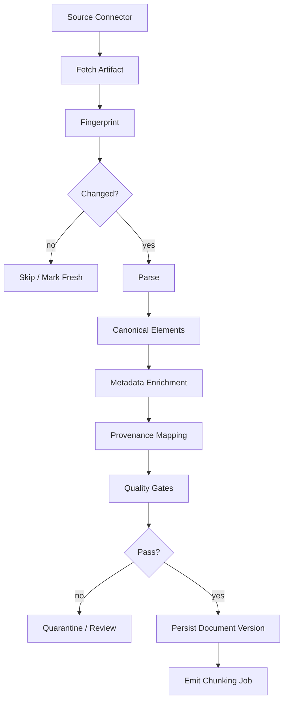
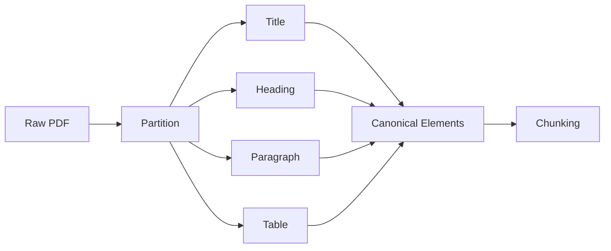
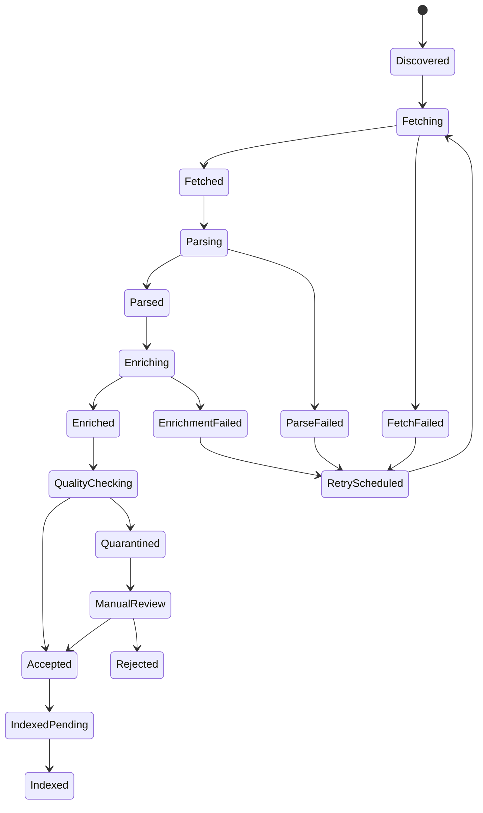
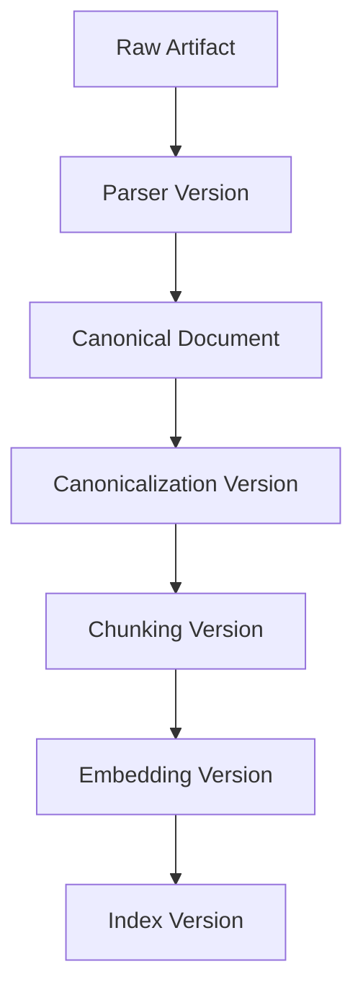

# Part 012 — Document Ingestion and Parsing Pipelines

Bad RAG often starts with bad ingestion.

The model may be strong. The vector database may be fast. The prompt may be careful. But if the ingestion pipeline loses headings, merges unrelated pages, drops tables, strips dates, ignores permissions, or overwrites source versions, the application will retrieve weak evidence and generate weak answers.

Document ingestion is not “upload file then chunk text”.

It is a production data pipeline that transforms raw source artifacts into canonical, traceable, permission-aware, versioned knowledge elements.

---

## 1. Kaufman Framing

The target skill:

> Given heterogeneous enterprise documents, build an ingestion pipeline that produces clean, structured, traceable, and reprocessable knowledge units for downstream retrieval and generation.

Decompose it into subskills.

| Subskill | Meaning | Failure If Ignored |
|---|---|---|
| Source modeling | Know where documents come from and who owns them | stale or unauthorized data enters the corpus |
| Artifact fingerprinting | Detect unchanged, changed, duplicate, and deleted sources | full reprocessing and inconsistent indexes |
| Parsing | Convert raw files into structured elements | text loss, table loss, broken citations |
| Canonicalization | Normalize documents without destroying meaning | retrieval noise or evidence distortion |
| Metadata extraction | Capture tenant, ACL, type, date, status, jurisdiction | retrieval cannot filter correctly |
| Provenance | Preserve page, section, line, source version, and hash | answers cannot be audited |
| Quality gates | Detect parse loss and malformed output | bad data silently enters index |
| Reprocessing | Rebuild chunks/indexes after pipeline changes | knowledge base cannot evolve safely |

The first practice goal:

> Build an ingestion pipeline that takes raw documents, creates canonical document elements with provenance, and emits a manifest suitable for chunking and embedding.

---

## 2. Ingestion Is a Pipeline, Not a Function

A production ingestion pipeline has stages.



Each stage should be independently observable and retryable.

If a parser fails, you should not lose the fetched artifact. If metadata extraction fails, you should not silently index the document as public. If chunking changes, you should not refetch every source artifact unnecessarily.

---

## 3. Source Artifact vs Canonical Document

Separate the raw artifact from the parsed/canonical representation.

| Concept | Meaning | Example |
|---|---|---|
| Source artifact | raw file or source record | PDF, DOCX, HTML page, email, scanned image |
| Source metadata | metadata from origin system | URL, owner, updated_at, ACL, case id |
| Artifact version | immutable fetched snapshot | hash + timestamp + storage URI |
| Canonical document | normalized representation | title, sections, elements, tables |
| Document element | typed piece of content | heading, paragraph, list item, table, figure |
| Chunk candidate | retrieval-oriented unit | section group, paragraph group, table summary |

Do not overwrite raw artifacts. Store immutable versions.

A raw artifact is evidence. A canonical document is your interpretation of that evidence.

---

## 4. Data Model

A useful ingestion model starts with explicit document versions.

```python
from datetime import datetime
from enum import StrEnum
from typing import Any
from pydantic import BaseModel, Field


class ElementType(StrEnum):
    TITLE = "title"
    HEADING = "heading"
    PARAGRAPH = "paragraph"
    LIST_ITEM = "list_item"
    TABLE = "table"
    IMAGE = "image"
    FOOTNOTE = "footnote"
    HEADER = "header"
    FOOTER = "footer"


class SourceArtifact(BaseModel):
    artifact_id: str
    tenant_id: str
    source_system: str
    source_uri: str
    source_updated_at: datetime | None = None
    content_type: str
    binary_sha256: str
    storage_uri: str
    fetched_at: datetime
    metadata: dict[str, Any] = Field(default_factory=dict)


class DocumentElement(BaseModel):
    element_id: str
    document_id: str
    document_version: str
    element_type: ElementType
    text: str
    order: int
    page_number: int | None = None
    section_path: list[str] = Field(default_factory=list)
    parent_element_id: str | None = None
    metadata: dict[str, Any] = Field(default_factory=dict)
    source_offsets: dict[str, Any] = Field(default_factory=dict)


class CanonicalDocument(BaseModel):
    document_id: str
    document_version: str
    tenant_id: str
    title: str | None = None
    source_artifact_id: str
    parser_name: str
    parser_version: str
    canonicalization_version: str
    elements: list[DocumentElement]
    metadata: dict[str, Any] = Field(default_factory=dict)
    created_at: datetime
```

The key idea: downstream retrieval should operate on canonical elements, while audit can trace back to immutable source artifacts.

---

## 5. Provenance Is Not Optional

Provenance answers:

- Which file did this text come from?
- Which version of the file?
- Which page or section?
- Which parser produced it?
- Was OCR used?
- Was the text normalized?
- Was a table summarized or preserved?
- Can we show the user the source?
- Can we reproduce this chunk later?

For regulated systems, provenance is part of defensibility.

Example provenance envelope:

```json
{
  "document_id": "policy-appeals",
  "document_version": "2026-03-17T10:22:18Z:sha256:abc123",
  "source_system": "policy-repository",
  "source_uri": "s3://raw/policies/appeals.pdf",
  "page_number": 14,
  "section_path": ["Appeals", "Late Appeal", "Exceptional Reopening"],
  "parser_name": "pdf-structure-parser",
  "parser_version": "2.4.1",
  "canonicalization_version": "2026-06-28",
  "element_ids": ["el-991", "el-992", "el-993"]
}
```

A chunk without provenance is just text. It is not reliable evidence.

---

## 6. Parsing Strategy by Source Type

Different document types fail differently.

| Source Type | Common Failure | Strategy |
|---|---|---|
| Markdown | usually clean, but links/frontmatter matter | parse headings and metadata directly |
| HTML | nav/footer noise, hidden text, scripts | boilerplate removal and DOM-aware extraction |
| PDF text | broken reading order, headers/footers | layout-aware parsing and page mapping |
| Scanned PDF | OCR errors, missing tables | OCR + confidence scoring + review queue |
| DOCX | styles, comments, tables | structure-aware parser |
| Email | quoted replies, signatures, attachments | thread-aware extraction |
| Spreadsheet | cells lack narrative context | table model and sheet metadata |
| Image/chart | text absent or visual-only | OCR, captioning, or manual curation |

No single parser is universally correct.

A strong pipeline supports parser selection by source type and quality requirements.

---

## 7. Partitioning Before Chunking

The ingestion pipeline should first partition raw content into meaningful elements.

Then chunking can combine elements for retrieval.



Why this matters:

- chunking raw text loses structure,
- headings may be separated from paragraphs,
- tables may be flattened incorrectly,
- page numbers may be lost,
- citations become weak,
- and retrieval becomes harder to debug.

Production rule:

> Parse into elements first. Chunk later.

---

## 8. Canonicalization

Canonicalization turns parser output into a consistent internal format.

Good canonicalization:

- normalizes whitespace,
- removes known repeated page headers/footers when safe,
- preserves heading hierarchy,
- preserves list structure,
- preserves table boundaries,
- extracts document title,
- records language,
- records parser confidence,
- and records all transformations.

Bad canonicalization:

- concatenates every page into one blob,
- deletes headings,
- removes page numbers without mapping,
- flattens tables into ambiguous lines,
- strips dates and section labels,
- merges unrelated appendices,
- or makes irreversible changes without storing raw artifact.

Canonicalization must be versioned.

```python
CANONICALIZATION_VERSION = "2026-06-28.v1"
```

If canonicalization logic changes, affected documents should be eligible for reprocessing.

---

## 9. Metadata Enrichment

Metadata is not decoration. It controls retrieval behavior.

Important metadata categories:

| Category | Examples | Used For |
|---|---|---|
| Access | tenant, ACL groups, classification | security filtering |
| Authority | draft, approved, archived | ranking/filtering |
| Time | effective_from, effective_to, updated_at | freshness and legal validity |
| Domain | case type, jurisdiction, product, process | query routing |
| Structure | section path, page, heading level | context assembly |
| Quality | parser confidence, OCR confidence | review/quarantine |
| Lineage | source system, artifact hash, parser version | audit and reprocessing |

For enterprise AI, most retrieval bugs are metadata bugs disguised as model bugs.

---

## 10. Idempotency and Fingerprinting

Ingestion jobs will retry.

That means they must be idempotent.

Fingerprint the raw artifact.

```python
import hashlib
from pathlib import Path


def file_sha256(path: Path) -> str:
    digest = hashlib.sha256()
    with path.open("rb") as file:
        for block in iter(lambda: file.read(1024 * 1024), b""):
            digest.update(block)
    return digest.hexdigest()
```

Fingerprint the canonical output too.

```python
import json


def canonical_hash(elements: list[dict]) -> str:
    stable = json.dumps(elements, sort_keys=True, ensure_ascii=False, separators=(",", ":"))
    return hashlib.sha256(stable.encode("utf-8")).hexdigest()
```

Use fingerprints to detect:

- unchanged files,
- duplicate files,
- parser output changes,
- metadata changes,
- and reprocessing requirements.

---

## 11. Ingestion Job State Machine

Do not model ingestion as one boolean flag.

Use explicit states.



Benefits:

- retry behavior is explicit,
- partial progress is visible,
- quarantine is first-class,
- manual review is possible,
- indexing depends on accepted canonical data only.

---

## 12. Minimal Pipeline Skeleton

A simple pipeline can still have production boundaries.

```python
from dataclasses import dataclass
from typing import Protocol


@dataclass(frozen=True)
class FetchResult:
    artifact: SourceArtifact
    local_path: str


class SourceConnector(Protocol):
    async def discover(self) -> list[str]:
        ...

    async def fetch(self, source_id: str) -> FetchResult:
        ...


class DocumentParser(Protocol):
    async def parse(self, artifact: SourceArtifact, local_path: str) -> CanonicalDocument:
        ...


class QualityGate(Protocol):
    async def check(self, document: CanonicalDocument) -> list[str]:
        ...


class IngestionRepository(Protocol):
    async def has_artifact_hash(self, tenant_id: str, sha256: str) -> bool:
        ...

    async def save_document(self, document: CanonicalDocument) -> None:
        ...

    async def quarantine(self, artifact: SourceArtifact, reasons: list[str]) -> None:
        ...
```

Use case:

```python
class IngestDocumentUseCase:
    def __init__(
        self,
        connector: SourceConnector,
        parser: DocumentParser,
        quality_gate: QualityGate,
        repository: IngestionRepository,
    ):
        self.connector = connector
        self.parser = parser
        self.quality_gate = quality_gate
        self.repository = repository

    async def ingest_one(self, source_id: str) -> None:
        fetched = await self.connector.fetch(source_id)

        if await self.repository.has_artifact_hash(
            fetched.artifact.tenant_id,
            fetched.artifact.binary_sha256,
        ):
            return

        document = await self.parser.parse(fetched.artifact, fetched.local_path)
        violations = await self.quality_gate.check(document)

        if violations:
            await self.repository.quarantine(fetched.artifact, violations)
            return

        await self.repository.save_document(document)
```

This is intentionally not tied to a specific parser library. Parser choice is an adapter detail.

---

## 13. Quality Gates

Quality gates prevent garbage from entering the knowledge base.

Examples:

| Gate | Check | Failure Action |
|---|---|---|
| Empty extraction | document has no meaningful text | quarantine |
| Low OCR confidence | confidence below threshold | manual review |
| Missing title | cannot identify title | warn or enrich |
| Missing ACL | source has no access metadata | quarantine |
| Huge element | one element exceeds size budget | reparse or split |
| Table loss | table pages extracted as empty text | specialized parser |
| Language mismatch | expected Indonesian but detected English | route review |
| Version conflict | same source older than current active version | archive or reject |
| Duplicate content | same hash already indexed | skip or link duplicate |

Gate implementation:

```python
class BasicQualityGate:
    async def check(self, document: CanonicalDocument) -> list[str]:
        violations: list[str] = []

        text = "\n".join(element.text for element in document.elements).strip()

        if len(text) < 100:
            violations.append("document_text_too_short")

        if "acl_groups" not in document.metadata:
            violations.append("missing_acl_groups")

        if not any(element.element_type == ElementType.HEADING for element in document.elements):
            violations.append("missing_headings")

        large_elements = [element.element_id for element in document.elements if len(element.text) > 10_000]
        if large_elements:
            violations.append(f"oversized_elements:{','.join(large_elements[:5])}")

        return violations
```

Do not make every violation fatal. Some are warnings. Some require quarantine. Some require manual enrichment.

---

## 14. Quarantine Is a Feature

A bad ingestion pipeline silently indexes bad content.

A strong pipeline quarantines uncertain content.

Quarantine reasons:

- parser crashed,
- OCR confidence low,
- ACL missing,
- document type unknown,
- extracted text too short,
- table extraction failed,
- duplicate conflict,
- source version is older than active version,
- malware scan failed,
- PII classification required,
- manual approval required.

Quarantine record:

```json
{
  "artifact_id": "artifact-883",
  "source_uri": "policy_repo://appeals/late-appeals.pdf",
  "tenant_id": "tenant-001",
  "reasons": ["missing_acl_groups", "table_extraction_low_confidence"],
  "stage": "quality_check",
  "created_at": "2026-06-28T08:00:00Z",
  "retryable": true
}
```

Do not let the chunking/indexing pipeline consume quarantined documents.

---

## 15. Handling Tables

Tables are a major RAG failure source.

Naive text extraction often turns a table into unreadable fragments.

Example source table:

| Risk Level | Escalation Deadline | Approver |
|---|---:|---|
| Low | 10 business days | Team Lead |
| High | 2 business days | Director |

Bad flattening:

```text
Risk Level Escalation Deadline Approver Low 10 business days Team Lead High 2 business days Director
```

Better canonical representation:

```text
Table: Escalation deadlines by risk level
Columns: Risk Level, Escalation Deadline, Approver
Row 1: Risk Level = Low; Escalation Deadline = 10 business days; Approver = Team Lead
Row 2: Risk Level = High; Escalation Deadline = 2 business days; Approver = Director
```

Best representation often stores both:

- original structured table,
- retrieval-friendly textual rendering,
- table caption/title,
- page and section path,
- and optional row-level chunks.

Do not summarize tables with an LLM during ingestion unless you preserve the original table and mark the summary as derived content.

---

## 16. Handling Scanned Documents

Scanned documents require OCR.

OCR introduces uncertainty.

Track:

- OCR engine,
- OCR version,
- confidence score,
- page-level confidence,
- detected language,
- page image reference,
- manual correction status,
- and whether text is machine-generated or human-reviewed.

For critical regulatory evidence, low-confidence OCR should not be treated as authoritative without review.

A retrieval answer should be able to say:

```text
Source text was extracted from OCR with low confidence on page 7.
```

That does not mean exposing internals to every end user. It means the system must know.

---

## 17. Access Control During Ingestion

Access metadata must be captured before indexing.

Bad pattern:

```text
1. ingest all documents
2. embed all text
3. let app filter answers later
```

Better pattern:

```text
1. fetch source ACL
2. attach ACL to canonical document and elements
3. write ACL-aware chunks
4. pre-filter retrieval by user permissions
```

Access metadata can come from:

- source repository permissions,
- case permissions,
- document classification,
- tenant boundary,
- user role,
- jurisdiction,
- data domain,
- retention/legal hold policy.

If permissions cannot be resolved, quarantine the document.

---

## 18. Deletion and Retention

Ingestion is not complete unless it handles deletion.

Cases:

| Event | Required Behavior |
|---|---|
| Source document deleted | remove or tombstone canonical document and vectors |
| Source document archived | exclude from default retrieval |
| Retention expired | delete according to policy |
| Legal hold applied | prevent deletion |
| ACL revoked | update metadata and rebuild affected index entries |
| Document superseded | retain old version but default to latest effective version |

Vector stores are often treated as append-only caches. That is dangerous.

A knowledge base must support tombstones and reindexing.

---

## 19. Incremental Reprocessing

You will change parsers, normalization, metadata extraction, chunking, and embedding models.

Design for reprocessing from day one.



When a stage changes, only downstream stages need rebuild.

| Change | Re-fetch? | Re-parse? | Re-chunk? | Re-embed? |
|---|---:|---:|---:|---:|
| source file changed | yes | yes | yes | yes |
| parser version changed | no | yes | yes | yes |
| metadata enrichment changed | no | maybe | maybe | maybe |
| chunking changed | no | no | yes | yes |
| embedding model changed | no | no | no | yes |
| vector index params changed | no | no | no | maybe reindex |

This dependency graph prevents expensive and risky full rebuilds.

---

## 20. Observability

Capture ingestion metrics.

Important metrics:

- discovered source count,
- fetched count,
- skipped unchanged count,
- parse success rate,
- parse failure rate by source type,
- quarantine count by reason,
- average elements per document,
- extracted character count,
- table count,
- OCR page count,
- ACL missing count,
- pipeline latency by stage,
- reprocessing count,
- index emission count.

Trace one document across stages.

```json
{
  "trace_id": "tr-ingest-883",
  "artifact_id": "artifact-883",
  "document_id": "policy-appeals",
  "stage": "quality_check",
  "parser": "pdf-layout-parser",
  "parser_version": "2.4.1",
  "element_count": 184,
  "table_count": 6,
  "page_count": 27,
  "violations": [],
  "duration_ms": 4120
}
```

If you cannot trace a bad answer back to its ingestion path, debugging RAG becomes guesswork.

---

## 21. Ingestion Failure Modes

| Failure | Symptom | Root Cause | Fix |
|---|---|---|---|
| Heading loss | retrieved chunk lacks context | parser flattened structure | structure-aware parsing |
| Table loss | answer misses threshold/deadline | table extraction failed | table-specific extraction |
| Stale content | old rule retrieved | version metadata missing | effective-date filters |
| Unauthorized retrieval | restricted text appears | ACL not captured | quarantine missing ACL |
| Duplicate crowding | top results repeat same doc | duplicate versions indexed | dedup/tombstones |
| OCR hallucination | wrong entity/date extracted | low OCR confidence | confidence gates/review |
| Broken citations | source page unavailable | provenance not stored | page/section mapping |
| Silent parse errors | low retrieval quality | no quality gates | quarantine and metrics |
| Rebuild chaos | index inconsistent | no stage versioning | dependency-based reprocessing |

---

## 22. Practice: Build an Ingestion Manifest

Create a manifest file after parsing.

```json
{
  "document_id": "policy-appeals",
  "document_version": "sha256:abc123",
  "tenant_id": "tenant-001",
  "source_artifact_id": "artifact-883",
  "parser": {
    "name": "markdown-parser",
    "version": "1.0.0"
  },
  "canonicalization_version": "2026-06-28.v1",
  "metadata": {
    "status": "approved",
    "jurisdiction": "national",
    "acl_groups": ["appeals-team", "case-supervisors"]
  },
  "elements": [
    {
      "element_id": "el-001",
      "type": "heading",
      "text": "Late Appeals",
      "order": 1,
      "section_path": ["Appeals", "Late Appeals"]
    },
    {
      "element_id": "el-002",
      "type": "paragraph",
      "text": "A late appeal may be accepted only when...",
      "order": 2,
      "section_path": ["Appeals", "Late Appeals"]
    }
  ]
}
```

Then write checks:

- manifest has tenant,
- manifest has ACL,
- every element has order,
- every element has type,
- every element can be traced to document version,
- headings exist,
- text length is above threshold,
- and status is not `draft` unless explicitly allowed.

---

## 23. Baeldung-Style Implementation Roadmap

Build in this order:

1. Start with Markdown files.
2. Parse headings and paragraphs.
3. Add source artifact hashing.
4. Add canonical document model.
5. Add manifest output.
6. Add quality gates.
7. Add quarantine store.
8. Add metadata extraction.
9. Add PDF parser adapter.
10. Add table handling.
11. Add OCR handling only when needed.
12. Add reprocessing/versioning.
13. Add chunking job emission.
14. Add observability.

Do not begin with the hardest PDF/OCR case. Start with a clean source type and build pipeline invariants.

---

## 24. Engineering Checklist

Before sending ingested documents to chunking/embedding, verify:

- [ ] raw artifact is stored immutably,
- [ ] artifact hash is recorded,
- [ ] source metadata is captured,
- [ ] tenant is known,
- [ ] ACL/classification is known,
- [ ] parser name/version is recorded,
- [ ] canonicalization version is recorded,
- [ ] document version is immutable,
- [ ] elements have stable ids,
- [ ] elements have order,
- [ ] headings/section paths are preserved where possible,
- [ ] tables are preserved or explicitly transformed,
- [ ] page/section provenance exists,
- [ ] quality gates run,
- [ ] failed documents are quarantined,
- [ ] deletion and supersession are handled,
- [ ] reprocessing is possible without refetching unchanged artifacts,
- [ ] ingestion traces can debug downstream retrieval failures.

---

## 25. Top 1% Judgment

A beginner says:

> I loaded PDFs into a vector database.

A competent engineer says:

> I parsed documents, chunked them, embedded them, and built search.

A strong AI application engineer says:

> I operate a versioned ingestion pipeline that preserves source evidence, structure, permissions, provenance, quality gates, reprocessing semantics, and auditability before retrieval ever runs.

That distinction matters.

In production AI systems, ingestion quality creates the ceiling for RAG quality.

A model cannot reliably cite evidence that your pipeline lost. A retriever cannot respect permissions that your ingestion layer did not capture. An audit trail cannot prove a source that was overwritten.

Build ingestion like infrastructure.

---

## 26. References

- Unstructured Documentation — Partitioning and chunking.
- AWS Documentation — Amazon Bedrock Knowledge Bases ingestion and chunking.
- LlamaIndex Documentation — Data connectors, ingestion pipelines, indexes, retrievers, and query engines.
- OpenAI Documentation — Embeddings and retrieval-oriented AI application patterns.
