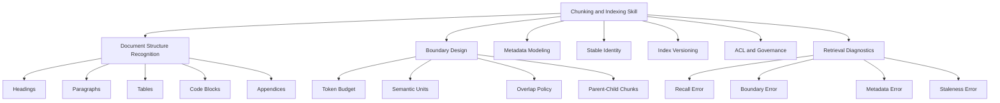
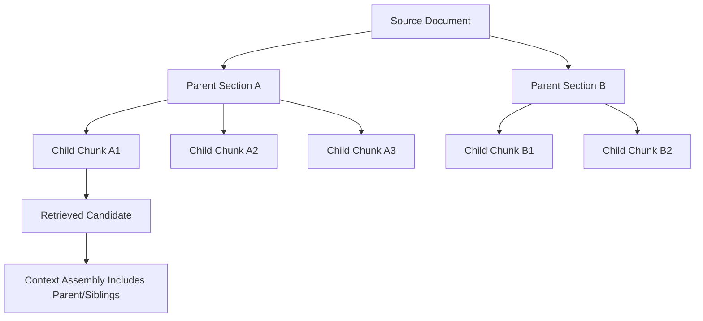
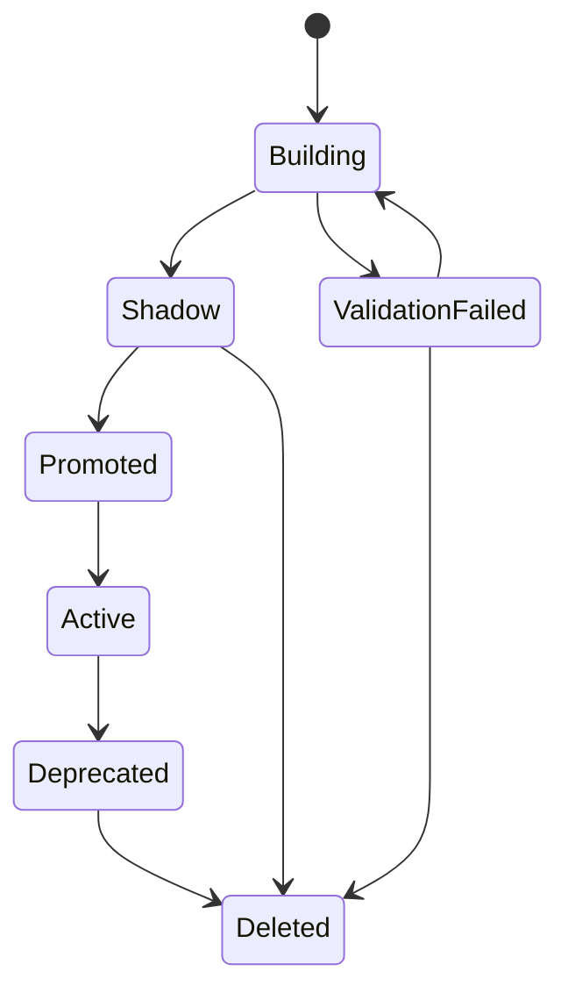
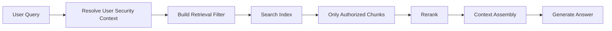
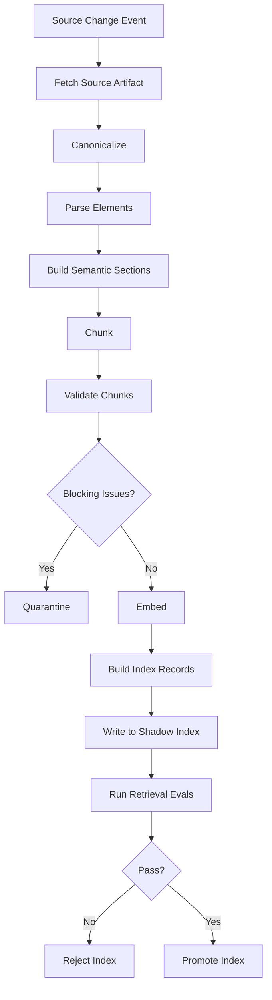

# Part 013 — Chunking, Indexing, and Knowledge Modeling

## 1. Why This Part Matters

RAG quality is usually blamed on the model.

In production, the model is often not the real culprit.

Most bad RAG systems fail earlier:

1. the document was parsed incorrectly,
2. the chunk cut across a semantic boundary,
3. the metadata was too poor to filter correctly,
4. the chunk had no stable provenance,
5. the index mixed incompatible embedding versions,
6. ACL filtering was applied too late,
7. stale chunks were never deleted,
8. generated answers cited text that could not be traced back to a source artifact.

This part treats chunking and indexing as **knowledge modeling**, not as text splitting.

A top-tier AI application engineer should be able to look at a failed RAG answer and ask:

> Did the model fail, or did the knowledge representation make the correct answer unreachable?

That distinction matters.

The model can only reason over what the retrieval layer gives it. If the retrieval layer returns fragments with weak boundaries, poor metadata, missing lineage, or mixed index versions, the model becomes a guessing machine.

---

## 2. Target Skill

After this part, you should be able to design a chunking and indexing system with the following properties:

- chunks are semantically coherent;
- chunk IDs are stable and reproducible;
- every chunk has source provenance;
- every chunk has ACL and tenant metadata;
- every index has an embedding model version;
- every re-indexing job is auditable;
- deletion and retention are explicit;
- retrieval can filter by source, type, section, policy, tenant, and freshness;
- bad chunks can be diagnosed and fixed without rewriting the whole app;
- chunking decisions are evaluated empirically, not guessed.

---

## 3. Mental Model: From Document to Retrieval Unit

A document is not the same as a retrieval unit.

A source document may be a PDF, HTML page, markdown file, email thread, policy manual, transcript, regulation, code file, spreadsheet, or case note.

The retrieval system needs a smaller unit:

- big enough to preserve meaning;
- small enough to fit into a prompt;
- structured enough to filter;
- traceable enough to cite;
- stable enough to reprocess;
- permission-aware enough to avoid leakage.

That unit is usually called a **chunk**, **node**, **passage**, **segment**, or **retrieval document**.

In this series we will use the term **chunk**.


The key mistake is jumping directly from source artifact to chunks.

That creates brittle RAG.

A better pipeline separates:

1. **source artifact** — original file or record;
2. **canonical document** — normalized representation;
3. **parsed elements** — headings, paragraphs, tables, images, code blocks;
4. **semantic sections** — meaningful groups;
5. **chunks** — retrieval-optimized units;
6. **embedding records** — model-specific vector records;
7. **index entries** — storage-specific records.

Each layer has a different responsibility.

---

## 4. The Chunking Problem

Chunking is not "split every 800 tokens with 100 overlap".

That is a baseline, not a design.

Chunking is the act of converting source knowledge into **retrievable evidence units**.

A chunk must optimize multiple competing goals.

| Goal | Why It Matters | Failure When Ignored |
|---|---|---|
| Semantic coherence | The chunk should contain one meaningful idea or section. | Retrieved text is noisy or incomplete. |
| Answer sufficiency | The chunk should include enough context to answer likely questions. | The model sees fragments and guesses. |
| Small prompt footprint | The chunk should not waste context budget. | Too few relevant chunks fit into context. |
| Stable citation | The chunk should map back to a source location. | Generated citations are not defensible. |
| Filterability | Metadata should support precise retrieval. | Search returns wrong tenant/source/version. |
| Re-indexability | The same source should produce predictable chunk IDs. | Updates create duplicate or orphan chunks. |
| Access control | Chunk visibility must match source visibility. | Sensitive data leaks across users or tenants. |

A chunk is therefore both:

- a **semantic object**, and
- an **operational object**.

---

## 5. Kaufman Deconstruction

Following Kaufman's skill acquisition model, we deconstruct chunking/indexing into trainable subskills.



The fastest way to improve is to practice diagnosing bad retrieval examples.

Do not start by tuning chunk size.

Start by asking:

- Was the answer present in the corpus?
- Was it parsed?
- Was it chunked into a retrievable unit?
- Was it embedded with the active embedding model?
- Was it indexed into the active index version?
- Was it visible under the user's permissions?
- Was it retrieved?
- Was it reranked high enough?
- Was it included in context?
- Was it cited?

If the answer is "no" at any layer, the model did not really have a chance.

---

## 6. Anti-Pattern: Text Splitter Driven Architecture

A common beginner architecture:

```python
docs = load_documents("policies/")
chunks = text_splitter.split_documents(docs)
vectorstore.add_documents(chunks)
```

This looks clean.

It is not enough for production.

Problems:

1. no stable source identity;
2. no parser quality metadata;
3. no versioned chunking policy;
4. no document lifecycle;
5. no source provenance;
6. no parent-child relationship;
7. no ACL propagation;
8. no deletion semantics;
9. no evaluation harness;
10. no index promotion workflow.

The production-grade question is not:

> Which text splitter should I use?

The better question is:

> What retrieval units must exist so that future user questions can be answered with grounded, permission-safe, traceable evidence?

---

## 7. Knowledge Modeling Layers

A strong RAG system models knowledge explicitly.

### 7.1 Source Artifact

The source artifact is the original object.

Examples:

- PDF uploaded by a compliance officer;
- HTML documentation page;
- case note in database;
- email thread;
- regulation extract;
- internal policy manual;
- markdown ADR;
- call transcript;
- spreadsheet export;
- image with OCR text.

The source artifact record should include:

```python
from datetime import datetime
from typing import Literal
from pydantic import BaseModel, Field


class SourceArtifact(BaseModel):
    source_id: str
    tenant_id: str
    source_type: Literal[
        "pdf",
        "html",
        "markdown",
        "email",
        "database_record",
        "transcript",
        "spreadsheet",
        "image",
    ]

    uri: str
    content_hash: str
    created_at: datetime
    updated_at: datetime | None = None

    owner_id: str | None = None
    acl_policy_id: str
    retention_policy_id: str | None = None

    ingestion_batch_id: str
    ingestion_status: Literal["pending", "parsed", "indexed", "quarantined", "deleted"]
```

The important invariant:

> The source artifact is the authority for lineage, ownership, and lifecycle.

Chunks should never become orphaned free-floating text.

---

### 7.2 Canonical Document

A canonical document is a normalized representation of the source.

The source could be HTML, PDF, DOCX, or a database row. The canonical document gives the rest of the pipeline a consistent shape.

```python
class CanonicalDocument(BaseModel):
    document_id: str
    source_id: str
    tenant_id: str

    title: str | None = None
    language: str | None = None
    document_type: str | None = None

    text: str
    content_hash: str

    parser_name: str
    parser_version: str
    parser_quality_score: float | None = Field(default=None, ge=0.0, le=1.0)

    metadata: dict[str, str | int | float | bool | None] = {}
```

Canonicalization avoids coupling retrieval to the accidental format of the source.

For example:

- a PDF page header should not be treated as meaningful content in every chunk;
- an HTML nav menu should not pollute retrieval;
- table rows may need separate extraction;
- code blocks should preserve indentation;
- page number and section number should be captured as metadata.

---

### 7.3 Parsed Elements

Parsed elements represent document structure.

```python
class ParsedElement(BaseModel):
    element_id: str
    document_id: str

    element_type: str
    text: str

    heading_path: list[str] = []
    page_start: int | None = None
    page_end: int | None = None

    char_start: int
    char_end: int

    order: int
    metadata: dict[str, str | int | float | bool | None] = {}
```

Examples of `element_type`:

- `title`
- `heading`
- `paragraph`
- `table`
- `table_row`
- `list_item`
- `code_block`
- `quote`
- `footnote`
- `caption`
- `ocr_text`
- `appendix`

This layer makes chunking smarter because boundaries can respect the document structure.

---

### 7.4 Semantic Sections

A semantic section groups parsed elements into meaningful regions.

Examples:

- "Eligibility Criteria"
- "Escalation Process"
- "Sanction Matrix"
- "Appeal Rights"
- "Data Retention"
- "Known Limitations"
- "Implementation Notes"

A section is not necessarily the same as a heading. Sometimes a heading contains multiple retrieval topics. Sometimes a topic spans multiple headings.

```python
class SemanticSection(BaseModel):
    section_id: str
    document_id: str
    heading_path: list[str]
    title: str | None

    element_ids: list[str]
    text: str

    token_count: int
    metadata: dict[str, str | int | float | bool | None] = {}
```

This step can be deterministic, model-assisted, or hybrid.

For regulated systems, prefer deterministic first:

1. parse headings;
2. group paragraphs under headings;
3. preserve table boundaries;
4. only use model-assisted segmentation where deterministic rules fail;
5. log the segmentation decision.

---

### 7.5 Chunk

A chunk is the retrieval unit.

```python
class ChunkRecord(BaseModel):
    chunk_id: str
    document_id: str
    source_id: str
    tenant_id: str

    text: str
    normalized_text_hash: str

    chunk_type: str
    chunk_index: int

    heading_path: list[str] = []
    section_id: str | None = None

    page_start: int | None = None
    page_end: int | None = None
    char_start: int | None = None
    char_end: int | None = None

    token_count: int
    metadata: dict[str, str | int | float | bool | None] = {}

    acl_policy_id: str
    retention_policy_id: str | None = None

    chunking_policy_id: str
    created_at: str
```

The important invariant:

> A chunk must be traceable back to a source artifact and reproducible from a chunking policy.

---

### 7.6 Embedding Record

An embedding record is model-specific.

The same chunk can have multiple embeddings over time.

```python
class EmbeddingRecord(BaseModel):
    embedding_id: str
    chunk_id: str
    tenant_id: str

    embedding_model: str
    embedding_model_version: str | None = None
    embedding_dimensions: int

    vector: list[float]

    embedded_text_hash: str
    embedding_policy_id: str
    created_at: str
```

Do not overwrite embeddings in place without tracking model version.

An embedding vector is not just "data"; it is the result of a model and policy. If the model changes, similarity behavior changes.

---

### 7.7 Index Entry

The index entry is storage-specific.

```python
class SearchIndexEntry(BaseModel):
    index_id: str
    index_version: str
    chunk_id: str
    embedding_id: str

    text: str
    vector: list[float]
    metadata: dict[str, str | int | float | bool | None]

    searchable_text: str
    filterable_fields: dict[str, str | int | bool]
```

The important invariant:

> Search index entries are projections. They are not the source of truth.

You should be able to rebuild them from source artifact, canonical document, chunks, embeddings, and index manifest.

---

## 8. Chunking Strategies

There is no universal best chunking strategy.

The right strategy depends on the source, query type, model context window, retrieval system, and answer style.

### 8.1 Fixed-Size Token Chunking

Fixed-size chunking splits text every N tokens with overlap.

Example:

- chunk size: 800 tokens;
- overlap: 100 tokens.

Advantages:

- simple;
- predictable;
- fast;
- works as a baseline;
- easy to evaluate.

Disadvantages:

- ignores document structure;
- can cut tables, code blocks, clauses, or procedures;
- may mix unrelated topics;
- can repeat irrelevant overlap;
- weak for citations.

Use it when:

- documents are plain prose;
- structure is unknown;
- you need a fast baseline;
- retrieval is exploratory.

Avoid it as the only strategy for regulated knowledge.

---

### 8.2 Recursive Character / Token Chunking

Recursive chunking tries large boundaries first, then smaller ones.

Typical boundary order:

1. section break;
2. paragraph break;
3. sentence break;
4. word boundary;
5. character boundary.

This is better than naive fixed-size splitting.

Still, it remains text-centric.

It does not understand source semantics unless you feed it structured elements.

---

### 8.3 Heading-Aware Chunking

Heading-aware chunking preserves document hierarchy.

A chunk carries its heading path:

```text
Policy Manual > Enforcement Lifecycle > Escalation Criteria
```

This metadata is extremely useful.

It helps:

- retrieval filtering;
- context assembly;
- answer citation;
- reranker relevance;
- prompt grounding;
- human review.

A chunk text may include a heading prefix:

```text
Section: Enforcement Lifecycle > Escalation Criteria

A case must be escalated when...
```

This improves retrieval because short chunks often need their section context.

---

### 8.4 Semantic Chunking

Semantic chunking groups text by meaning rather than fixed size.

The chunker may use:

- paragraph similarity;
- embedding distance;
- topic shift detection;
- model-assisted segmentation;
- section boundaries;
- discourse markers.

Advantages:

- better coherence;
- less arbitrary boundary cutting;
- strong for policy/manual content.

Risks:

- nondeterminism;
- hard-to-reproduce boundaries;
- higher cost;
- harder auditability;
- drift when model changes.

Production rule:

> If semantic chunking uses a model, persist the model version, prompt version, output, and confidence.

---

### 8.5 Parent-Child Chunking

Parent-child chunking stores different granularities.

Example:

- parent section: 2,500 tokens;
- child chunks: 400 tokens;
- retrieval uses child chunks;
- context assembly may include parent or sibling context.



This works well when:

- short child chunks retrieve accurately;
- parent section provides answer context;
- citation must point to a precise passage;
- answer synthesis needs surrounding procedure.

Failure mode:

- context assembly becomes too broad and adds noise.

Guardrail:

- retrieve child chunks;
- include parent only when score/confidence passes threshold;
- include sibling chunks only when adjacent and same section;
- cap total tokens per source.

---

### 8.6 Sliding Window Chunking

Sliding windows create overlapping chunks across text.

Useful for:

- transcripts;
- logs;
- long narratives;
- meeting notes;
- legal narratives;
- timeline reconstruction.

Risk:

- many near-duplicate chunks;
- higher index size;
- retrieval diversity loss;
- citations become repetitive.

Use MMR or diversity filtering later if you use heavy overlap.

---

### 8.7 Table-Aware Chunking

Tables are not normal text.

Bad table chunking is a major RAG failure source.

A table may need multiple representations:

1. original markdown table;
2. row-level records;
3. natural language summary;
4. schema metadata;
5. parent section context.

Example chunk forms:

```text
Table: Sanction Matrix
Columns: Violation Type, Severity, Recommended Action, Escalation Required

Row:
Violation Type = Repeat non-compliance
Severity = High
Recommended Action = Formal enforcement notice
Escalation Required = Yes
```

This is often more retrievable than raw table text.

Rule:

> Convert tables into query-friendly evidence, but preserve source coordinates for audit.

---

### 8.8 Code-Aware Chunking

For code/documentation RAG, chunking must respect:

- functions;
- classes;
- modules;
- comments;
- docstrings;
- imports;
- related tests;
- API route boundaries;
- configuration files.

Never split code purely by token count unless there is no alternative.

A better unit is:

- function definition;
- class definition;
- endpoint handler;
- migration;
- config block;
- test case;
- README section.

---

### 8.9 Policy/Regulation-Aware Chunking

For regulatory, compliance, or case-management systems, chunk by legally meaningful units:

- article;
- section;
- clause;
- requirement;
- exception;
- definition;
- procedure step;
- decision criterion;
- evidence requirement;
- escalation trigger;
- appeal provision.

This allows answers like:

> The case should be escalated because clause 4.2 requires escalation when repeat non-compliance occurs within 90 days.

That answer requires more than semantic similarity. It requires chunk units aligned to rule semantics.

---

## 9. Chunk Size Is a Trade-Off, Not a Constant

Chunk size affects recall, precision, cost, latency, citation quality, and answer synthesis.

| Smaller Chunks | Larger Chunks |
|---|---|
| Better precision | More context per hit |
| Better citation granularity | Lower risk of missing surrounding context |
| More index entries | Fewer index entries |
| More candidates to rerank | Less reranking overhead |
| Can lose meaning | Can include noise |
| Useful for facts | Useful for procedures and reasoning |

A practical starting point:

| Corpus Type | Starting Chunk Policy |
|---|---|
| FAQ / short docs | heading-aware, 200-500 tokens |
| Policies / manuals | section-aware, 400-900 tokens |
| Long regulations | clause-aware + parent-child |
| Transcripts | sliding window, 300-700 tokens |
| Tables | row-aware + table summary |
| Code | AST/function-aware |
| Emails | thread/message-aware + quoted text cleanup |
| Case notes | event-aware + timeline metadata |

Do not cargo-cult chunk size.

Measure retrieval quality.

---

## 10. Overlap Policy

Overlap exists to prevent losing meaning at boundaries.

It is not free.

Too much overlap causes:

- index bloat;
- duplicate candidates;
- citation duplication;
- reranker confusion;
- context waste.

Use overlap only when boundary cutting is unavoidable.

Better alternatives:

- preserve headings;
- add section title to chunk text;
- use parent-child retrieval;
- include previous/next chunk during context assembly;
- chunk by parsed elements instead of raw text.

Overlap is a compensation mechanism, not a first-class knowledge model.

---

## 11. Metadata Modeling

Metadata is the difference between a demo RAG system and a production RAG system.

Good metadata lets you answer:

- Which tenant can see this chunk?
- Which policy version does it belong to?
- Which source artifact created it?
- Which parser version produced it?
- Which section and page does it come from?
- Is it active, expired, draft, or superseded?
- Is this evidence legally authoritative?
- Should it be preferred over older versions?
- Can it be cited to a user?
- Can it be used for automated decision support?

### 11.1 Metadata Categories

| Category | Examples |
|---|---|
| Identity | `source_id`, `document_id`, `chunk_id` |
| Ownership | `tenant_id`, `owner_id`, `department` |
| Security | `acl_policy_id`, `classification`, `allowed_roles` |
| Lineage | `ingestion_batch_id`, `parser_version`, `chunking_policy_id` |
| Source location | `page_start`, `page_end`, `char_start`, `heading_path` |
| Domain | `case_type`, `regulation`, `policy_area`, `jurisdiction` |
| Lifecycle | `status`, `valid_from`, `valid_to`, `supersedes` |
| Quality | `parser_quality_score`, `ocr_confidence`, `chunk_quality_score` |
| Retrieval | `boost_level`, `authority_rank`, `freshness_rank` |

### 11.2 Metadata Design Rule

Metadata should be:

- filterable where needed;
- stable across re-indexing;
- normalized where possible;
- not too high cardinality for search engine limitations;
- not trusted unless derived from authoritative source;
- included in audit trails.

Avoid dumping arbitrary metadata and hoping it works.

Search systems have different support for filtering, faceting, payload size, and indexing. Design metadata with the chosen retrieval backend in mind.

---

## 12. Stable Chunk Identity

Chunk IDs must be stable.

If the same source and same chunking policy produce the same chunk, the ID should be the same.

A simple strategy:

```python
import hashlib


def stable_chunk_id(
    *,
    tenant_id: str,
    source_id: str,
    document_hash: str,
    chunking_policy_id: str,
    section_path: str,
    chunk_index: int,
    normalized_text: str,
) -> str:
    raw = "|".join(
        [
            tenant_id,
            source_id,
            document_hash,
            chunking_policy_id,
            section_path,
            str(chunk_index),
            hashlib.sha256(normalized_text.encode("utf-8")).hexdigest(),
        ]
    )
    return hashlib.sha256(raw.encode("utf-8")).hexdigest()
```

This makes reprocessing safer.

Without stable IDs, you get:

- duplicates;
- stale chunks;
- broken citations;
- orphaned embeddings;
- impossible diffing;
- noisy evaluation.

---

## 13. Chunking Policy as a Versioned Artifact

Chunking policy should be explicit.

```python
from pydantic import BaseModel


class ChunkingPolicy(BaseModel):
    policy_id: str
    name: str
    version: str

    strategy: str
    max_tokens: int
    min_tokens: int
    overlap_tokens: int

    preserve_headings: bool
    preserve_tables: bool
    include_heading_prefix: bool
    parent_child_enabled: bool

    tokenizer_name: str
    parser_compatibility: list[str]

    notes: str | None = None
```

Never hide this as random code.

Why?

Because when retrieval quality changes, you need to know whether the cause was:

- new source documents;
- new parser;
- new chunking policy;
- new embedding model;
- new index parameters;
- new retrieval query;
- new reranker;
- new generator model.

Versioned policy makes diagnosis possible.

---

## 14. Index Manifest

An index should have a manifest.

```python
class IndexManifest(BaseModel):
    index_name: str
    index_version: str

    corpus_id: str
    tenant_scope: str

    parser_version: str
    chunking_policy_id: str
    embedding_model: str
    embedding_model_version: str | None
    embedding_dimensions: int

    vector_backend: str
    distance_metric: str
    index_algorithm: str | None = None

    created_at: str
    promoted_at: str | None = None

    status: str  # building, shadow, active, deprecated, deleted
```

The manifest answers:

- What is inside this index?
- Which embedding model produced vectors?
- Which chunking policy was used?
- Is it active or shadow?
- Can we compare it against another index?
- Can we roll back?

Production systems should treat index changes like application releases.

---

## 15. Index Lifecycle

A serious RAG index has lifecycle states.



### 15.1 Building

The index is being created.

No production traffic.

### 15.2 Validation Failed

Quality gates failed.

Examples:

- missing ACL metadata;
- chunk count mismatch;
- high parser failure rate;
- embedding dimension mismatch;
- duplicate chunk IDs;
- evaluation regression.

### 15.3 Shadow

The index exists and can be queried for comparison.

Production traffic still uses the active index.

### 15.4 Promoted

The index passed validation and is approved for release.

### 15.5 Active

The index serves production retrieval.

### 15.6 Deprecated

The index is no longer primary but retained for rollback/audit.

### 15.7 Deleted

The index is removed after retention window.

---

## 16. Incremental Indexing

Rebuilding the whole index is not always acceptable.

Large enterprise corpora need incremental indexing.

Operations:

- insert new source;
- update changed source;
- soft-delete removed source;
- hard-delete expired source;
- re-embed selected chunks;
- re-chunk selected documents;
- promote new index version.

A robust incremental indexing job computes a diff:

```python
class IndexDiff(BaseModel):
    inserted_source_ids: list[str]
    updated_source_ids: list[str]
    deleted_source_ids: list[str]

    inserted_chunk_ids: list[str]
    updated_chunk_ids: list[str]
    deleted_chunk_ids: list[str]

    unchanged_chunk_ids: list[str]
```

Diffing requires stable IDs and content hashes.

Without them, incremental indexing becomes guesswork.

---

## 17. ACL Propagation

Access control must be applied before sensitive text can leak.

Do not rely only on post-generation filtering.

ACL metadata should be attached at chunk/index level.

```python
class ChunkSecurityMetadata(BaseModel):
    tenant_id: str
    acl_policy_id: str
    classification: str
    allowed_roles: list[str]
    allowed_user_ids: list[str] = []
    denied_user_ids: list[str] = []
```

Retrieval should filter by ACL before returning candidates to the model.



Important invariant:

> Unauthorized chunks must not enter model context.

If a chunk reaches the model, you should assume it can influence output.

---

## 18. Knowledge Modeling for Case Management

For complex case-management platforms, naive document chunks are often insufficient.

You may need domain objects.

Examples:

- case;
- allegation;
- party;
- evidence item;
- violation;
- policy clause;
- decision;
- escalation event;
- deadline;
- remediation action;
- appeal;
- audit note.

These objects can become metadata, graph nodes, or retrieval units.

### 18.1 Example Domain-Aware Chunk

```python
class CasePolicyChunk(BaseModel):
    chunk_id: str
    tenant_id: str
    source_id: str

    text: str

    policy_area: str
    enforcement_stage: str | None
    case_type: str | None
    jurisdiction: str | None

    decision_point: str | None
    required_evidence: list[str]
    escalation_trigger: list[str]
    allowed_actions: list[str]
    prohibited_actions: list[str]

    valid_from: str | None
    valid_to: str | None

    acl_policy_id: str
```

This makes retrieval more precise.

A query like:

> Should this case escalate after a second breach within 90 days?

can filter or boost chunks with:

- `policy_area = enforcement`
- `decision_point = escalation`
- `escalation_trigger contains repeat breach`
- `valid_from <= today`
- `valid_to is null or valid_to >= today`

This is more powerful than semantic search alone.

---

## 19. Chunk Quality Checks

You should validate chunks before indexing.

### 19.1 Structural Checks

- non-empty text;
- token count within bounds;
- valid source ID;
- valid document ID;
- valid tenant ID;
- valid ACL;
- valid chunking policy ID;
- page/char offsets present where possible;
- no duplicate chunk IDs.

### 19.2 Content Checks

- text is not mostly boilerplate;
- text is not mostly navigation/menu/footer;
- OCR confidence above threshold;
- table text is readable;
- heading path is plausible;
- language detected;
- no obvious parser corruption.

### 19.3 Security Checks

- classification exists;
- restricted source has restricted chunk;
- tenant ID matches source;
- ACL was propagated;
- PII handling policy applied.

### 19.4 Retrieval Checks

- expected known query retrieves expected chunk;
- authoritative documents rank above stale documents;
- duplicates are not dominating top-k;
- chunk metadata supports filters.

---

## 20. Chunk Quality Gate Example

```python
from dataclasses import dataclass


@dataclass(frozen=True)
class ChunkQualityIssue:
    severity: str
    code: str
    message: str


def validate_chunk(chunk: ChunkRecord) -> list[ChunkQualityIssue]:
    issues: list[ChunkQualityIssue] = []

    if not chunk.text.strip():
        issues.append(ChunkQualityIssue("error", "empty_text", "Chunk text is empty."))

    if chunk.token_count < 20:
        issues.append(ChunkQualityIssue("warning", "too_short", "Chunk may be too short."))

    if chunk.token_count > 1_200:
        issues.append(ChunkQualityIssue("error", "too_large", "Chunk exceeds max retrieval size."))

    if not chunk.tenant_id:
        issues.append(ChunkQualityIssue("error", "missing_tenant", "Chunk has no tenant_id."))

    if not chunk.acl_policy_id:
        issues.append(ChunkQualityIssue("error", "missing_acl", "Chunk has no ACL policy."))

    if not chunk.chunking_policy_id:
        issues.append(ChunkQualityIssue("error", "missing_policy", "Chunk has no chunking policy id."))

    if not chunk.source_id or not chunk.document_id:
        issues.append(ChunkQualityIssue("error", "missing_lineage", "Chunk lineage is incomplete."))

    return issues
```

A production ingestion job should fail or quarantine chunks with blocking issues.

---

## 21. Boundary Diagnostics

When retrieval fails, inspect boundaries.

Questions:

1. Is the answer split across two chunks?
2. Is the heading missing from the chunk?
3. Did the chunk include too much unrelated text?
4. Did overlap create duplicates?
5. Did a table get flattened badly?
6. Did a policy clause lose its exception?
7. Did the definition chunk separate from the rule chunk?
8. Did the query need a parent section rather than child passage?
9. Did the reranker prefer a chunk with matching words but wrong meaning?
10. Did ACL or freshness filtering remove the correct chunk?

This is how you avoid random tuning.

---

## 22. Practical Chunker Interface

Create a chunker as a replaceable component.

```python
from typing import Protocol


class TokenCounter(Protocol):
    def count(self, text: str) -> int:
        ...


class Chunker(Protocol):
    def chunk(
        self,
        *,
        document: CanonicalDocument,
        elements: list[ParsedElement],
        policy: ChunkingPolicy,
    ) -> list[ChunkRecord]:
        ...
```

This allows you to test multiple strategies:

- fixed token chunker;
- heading-aware chunker;
- table-aware chunker;
- parent-child chunker;
- semantic chunker;
- domain-aware chunker.

Do not bake chunking inside ingestion scripts.

---

## 23. Simple Heading-Aware Chunker

This example is intentionally simplified.

```python
from collections import defaultdict
from datetime import datetime, timezone


def normalize_text(text: str) -> str:
    return " ".join(text.split())


def chunk_by_heading(
    *,
    document: CanonicalDocument,
    elements: list[ParsedElement],
    policy: ChunkingPolicy,
    token_counter: TokenCounter,
) -> list[ChunkRecord]:
    grouped: dict[tuple[str, ...], list[ParsedElement]] = defaultdict(list)

    for element in elements:
        if element.element_type in {"paragraph", "list_item", "table", "code_block"}:
            grouped[tuple(element.heading_path)].append(element)

    chunks: list[ChunkRecord] = []
    chunk_index = 0

    for heading_path, group in grouped.items():
        current: list[ParsedElement] = []
        current_text = ""

        for element in group:
            candidate_text = "\n\n".join([current_text, element.text]).strip()
            candidate_tokens = token_counter.count(candidate_text)

            if current and candidate_tokens > policy.max_tokens:
                chunk_text = build_chunk_text(
                    heading_path=list(heading_path),
                    elements=current,
                    include_heading_prefix=policy.include_heading_prefix,
                )

                chunks.append(
                    make_chunk(
                        document=document,
                        policy=policy,
                        chunk_text=chunk_text,
                        heading_path=list(heading_path),
                        chunk_index=chunk_index,
                        token_counter=token_counter,
                    )
                )
                chunk_index += 1
                current = [element]
                current_text = element.text
            else:
                current.append(element)
                current_text = candidate_text

        if current:
            chunk_text = build_chunk_text(
                heading_path=list(heading_path),
                elements=current,
                include_heading_prefix=policy.include_heading_prefix,
            )
            chunks.append(
                make_chunk(
                    document=document,
                    policy=policy,
                    chunk_text=chunk_text,
                    heading_path=list(heading_path),
                    chunk_index=chunk_index,
                    token_counter=token_counter,
                )
            )
            chunk_index += 1

    return chunks


def build_chunk_text(
    *,
    heading_path: list[str],
    elements: list[ParsedElement],
    include_heading_prefix: bool,
) -> str:
    body = "\n\n".join(element.text.strip() for element in elements if element.text.strip())

    if include_heading_prefix and heading_path:
        return f"Section: {' > '.join(heading_path)}\n\n{body}"

    return body


def make_chunk(
    *,
    document: CanonicalDocument,
    policy: ChunkingPolicy,
    chunk_text: str,
    heading_path: list[str],
    chunk_index: int,
    token_counter: TokenCounter,
) -> ChunkRecord:
    normalized = normalize_text(chunk_text)
    chunk_id = stable_chunk_id(
        tenant_id=document.tenant_id,
        source_id=document.source_id,
        document_hash=document.content_hash,
        chunking_policy_id=policy.policy_id,
        section_path=" > ".join(heading_path),
        chunk_index=chunk_index,
        normalized_text=normalized,
    )

    return ChunkRecord(
        chunk_id=chunk_id,
        document_id=document.document_id,
        source_id=document.source_id,
        tenant_id=document.tenant_id,
        text=chunk_text,
        normalized_text_hash=hashlib.sha256(normalized.encode("utf-8")).hexdigest(),
        chunk_type="heading_aware",
        chunk_index=chunk_index,
        heading_path=heading_path,
        token_count=token_counter.count(chunk_text),
        acl_policy_id=document.metadata.get("acl_policy_id", "default"),
        retention_policy_id=document.metadata.get("retention_policy_id"),
        chunking_policy_id=policy.policy_id,
        created_at=datetime.now(timezone.utc).isoformat(),
    )
```

This chunker is not "the answer".

It demonstrates the right architecture:

- explicit policy;
- stable IDs;
- lineage;
- metadata;
- replaceable strategy.

---

## 24. Parent-Child Record Design

Parent-child retrieval requires explicit relationships.

```python
class ParentChunk(BaseModel):
    parent_chunk_id: str
    document_id: str
    source_id: str
    tenant_id: str
    text: str
    heading_path: list[str]
    child_chunk_ids: list[str]
    token_count: int
    acl_policy_id: str


class ChildChunk(BaseModel):
    chunk_id: str
    parent_chunk_id: str
    document_id: str
    source_id: str
    tenant_id: str
    text: str
    heading_path: list[str]
    token_count: int
    acl_policy_id: str
```

Retrieval behavior:

1. search over child chunks;
2. select high-scoring children;
3. optionally load parent;
4. include parent/siblings only if context budget permits;
5. cite the child chunk, not the whole parent, unless the whole section is used.

---

## 25. Indexing Pipeline

A production indexing pipeline should be explicit.



Key point:

> Indexing is a release pipeline.

Treat it with the same discipline as code deployment.

---

## 26. Embedding and Index Compatibility

You cannot freely mix embeddings from different models in the same vector space.

If you change embedding model:

- dimensions may change;
- distance distribution may change;
- similarity thresholds may change;
- retrieval ranking may change;
- eval baselines may break.

Do not silently update embedding models.

Use:

- new embedding policy;
- new index version;
- shadow evaluation;
- canary traffic;
- rollback path.

---

## 27. Deletion and Retention

Deletion must be first-class.

When a source is deleted, expired, or access-revoked, all derived objects must be handled:

- canonical document;
- parsed elements;
- semantic sections;
- chunks;
- embeddings;
- index entries;
- cached retrieval results;
- generated context snapshots where applicable;
- eval datasets if they contain sensitive text.

Soft delete may be needed for audit.

Hard delete may be required by retention policy.

Design this before production.

---

## 28. Re-Indexing Strategy

You need re-indexing when:

- parser changes;
- chunking policy changes;
- embedding model changes;
- metadata mapping changes;
- ACL policy changes;
- corpus changes;
- retrieval backend changes;
- quality issues are discovered.

Types:

| Type | Meaning |
|---|---|
| Full rebuild | Reprocess entire corpus into a new index. |
| Incremental update | Process only changed sources. |
| Selective re-embed | Keep chunks, generate new embeddings. |
| Selective re-chunk | Rebuild chunks for selected documents. |
| Metadata-only update | Update filterable metadata without re-embedding. |
| Shadow rebuild | Build new index without production traffic. |

A top-tier engineer does not ask "can we re-index?"

They ask:

> Can we re-index safely, compare quality, promote atomically, and roll back?

---

## 29. Evaluation Dataset for Chunking

Chunking should be evaluated through retrieval tasks.

Create a dataset:

```python
class RetrievalGoldExample(BaseModel):
    example_id: str
    query: str
    expected_source_ids: list[str]
    expected_chunk_ids: list[str] = []
    must_contain_terms: list[str] = []
    tenant_id: str
    user_role: str
    notes: str | None = None
```

Metrics:

- recall@k;
- MRR;
- nDCG;
- expected source hit rate;
- expected chunk hit rate;
- unauthorized chunk rate;
- duplicate rate;
- stale chunk rate;
- citation accuracy;
- context sufficiency score.

Evaluate chunking policies by running the same query set against different index versions.

---

## 30. Example: Comparing Chunking Policies

```python
class ChunkingExperimentResult(BaseModel):
    experiment_id: str
    index_version: str
    chunking_policy_id: str

    recall_at_5: float
    mrr: float
    duplicate_rate_at_10: float
    unauthorized_rate: float
    stale_rate: float
    avg_context_tokens: float
    notes: str | None = None
```

A chunking policy that improves recall but doubles context tokens may not be better.

A chunking policy that improves semantic relevance but breaks citations is not acceptable in regulated systems.

---

## 31. Common Failure Modes

### 31.1 Boundary Split

The answer is split across two chunks.

Fixes:

- use parent-child;
- increase chunk size for that document type;
- include adjacent chunks;
- improve section detection.

### 31.2 Boilerplate Pollution

Headers, footers, nav menus, cookie banners, or repeated disclaimers dominate chunks.

Fixes:

- parser cleanup;
- boilerplate removal;
- duplicate text detection;
- quality gate.

### 31.3 Metadata Blindness

The correct answer exists, but retrieval cannot filter by jurisdiction, version, tenant, or case type.

Fix:

- enrich metadata;
- normalize domain taxonomy;
- add filterable fields;
- improve source mapping.

### 31.4 Stale Knowledge

Old policy ranks above new policy.

Fixes:

- freshness metadata;
- valid-from/valid-to fields;
- authority ranking;
- supersession graph;
- retrieval boosting.

### 31.5 Chunk Duplication

Top-k results contain near-identical chunks.

Fixes:

- reduce overlap;
- deduplicate by normalized hash;
- MMR;
- source-level diversity constraints.

### 31.6 Lost Definition

A regulation uses terms defined elsewhere, but the definition is not retrieved.

Fixes:

- definition index;
- cross-reference graph;
- query expansion;
- context assembly with linked definitions.

### 31.7 ACL Leakage

A restricted chunk is retrieved for unauthorized user.

Fixes:

- pre-retrieval filter;
- index partitioning;
- security-context query builder;
- test unauthorized retrieval cases.

---

## 32. Design Review Checklist

Before accepting a chunking/indexing design, ask:

- What is the source of truth?
- What is the canonical document format?
- How are parsed elements represented?
- What chunking policies exist?
- Are chunk IDs stable?
- Are embeddings versioned?
- Are indexes versioned?
- Is ACL attached before indexing?
- How are deleted sources removed?
- How are stale policy versions handled?
- Can retrieval failures be traced to source, parser, chunk, embedding, or index?
- Can we run shadow index evaluation?
- Can we roll back?
- Can we cite source location?
- Can we reconstruct the chunk from source?
- Can we prove a user was authorized to see retrieved evidence?

---

## 33. Practice: Build a Chunking Lab

Create a small corpus:

1. one policy PDF or markdown;
2. one FAQ;
3. one table-heavy document;
4. one long transcript;
5. one versioned procedure document.

Implement three chunking policies:

1. fixed token;
2. heading-aware;
3. parent-child.

For each policy, create:

- chunk records;
- metadata;
- stable IDs;
- quality report;
- retrieval gold examples;
- recall@k comparison;
- failure notes.

The deliverable is not a chatbot.

The deliverable is a chunking report:

```text
Policy A:
- recall@5 = 0.72
- duplicate@10 = 0.31
- avg_context_tokens = 3,200
- failures: table flattening, stale policy ranking

Policy B:
- recall@5 = 0.84
- duplicate@10 = 0.12
- avg_context_tokens = 2,600
- failures: lost definitions

Policy C:
- recall@5 = 0.88
- duplicate@10 = 0.14
- avg_context_tokens = 3,100
- failures: parent context too broad
```

This is how you build judgment.

---

## 34. Engineering Heuristics

Use these heuristics until data proves otherwise:

1. Prefer structure-aware chunking over raw fixed-size chunking.
2. Preserve heading path in metadata and often in chunk text.
3. Treat tables, code, transcripts, and regulations as separate chunking families.
4. Use stable chunk IDs.
5. Version chunking policy.
6. Version embedding policy.
7. Version index manifest.
8. Apply ACL before retrieval results reach the model.
9. Evaluate chunking through retrieval tasks, not aesthetics.
10. Keep source provenance strong enough for human review.
11. Prefer parent-child when child chunks retrieve well but lack sufficient context.
12. Reduce overlap before adding rerank complexity.
13. Keep deletion and retention paths explicit.
14. Build shadow indexes before promotion.
15. Never mix embedding models in the same index without a deliberate compatibility strategy.

---

## 35. References and Further Reading

- LlamaIndex documentation: Documents and Nodes.
- LlamaIndex documentation: Node Parser Modules.
- OpenAI documentation: File Search and Vector Stores.
- Azure AI Search documentation: Hybrid Search.
- Azure AI Search documentation: Semantic Ranker.
- Pinecone documentation: Hybrid Search.
- Pinecone documentation: Reranking.
- Unstructured documentation: Chunking and partitioning concepts.
- Josh Kaufman, *The First 20 Hours*, for skill deconstruction and deliberate practice framing.

---

## 36. Summary

Chunking is knowledge modeling.

A production-grade RAG system does not merely split text and store vectors. It creates traceable, permission-aware, versioned evidence units that can be retrieved, evaluated, cited, deleted, and improved.

The core invariant:

> Every retrieved chunk must be semantically useful, operationally traceable, permission-safe, and reproducible from a known source and policy.

If you master this, your RAG systems become diagnosable.

That is the difference between a demo and an engineering system.

In the next part, we move from chunk/index design to **retrieval ranking**: vector search, lexical search, hybrid retrieval, reranking, filtering, and diversity.
