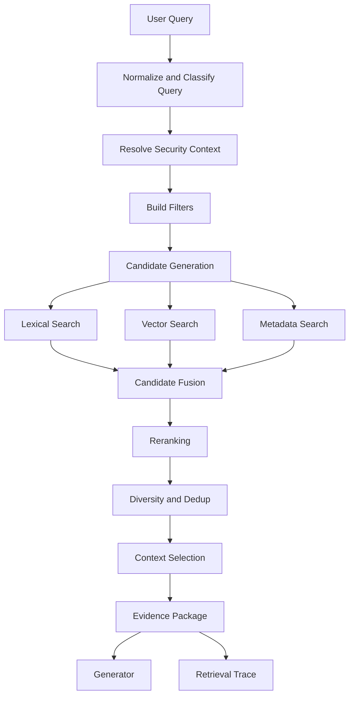
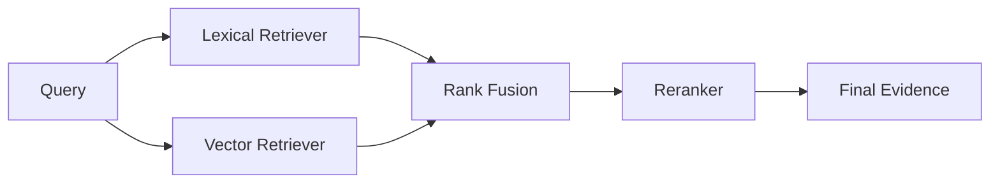
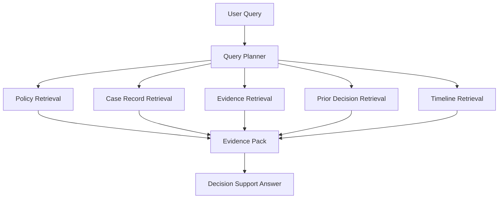

# Part 014 — Vector Search, Hybrid Search, and Reranking

## 1. Why This Part Matters

Many AI applications fail because their retrieval layer is too naive.

The common implementation:

```python
docs = vectorstore.similarity_search(query, k=5)
answer = llm.generate(query, context=docs)
```

This is a useful demo.

It is not a reliable production retrieval pipeline.

Production RAG retrieval is a ranking system.

It usually combines:

- query understanding;
- filters and authorization;
- lexical search;
- dense vector search;
- hybrid fusion;
- metadata boosts;
- reranking;
- diversity controls;
- context selection;
- citation packaging;
- trace logging;
- evaluation.

Vector search is only one stage.

A top-tier AI application engineer understands that retrieval quality is a pipeline problem, not a database feature.

---

## 2. Target Skill

After this part, you should be able to:

- explain when vector search works and when it fails;
- compare lexical, dense, hybrid, and semantic reranking approaches;
- design retrieval as a multi-stage pipeline;
- implement reciprocal rank fusion;
- choose candidate sizes for retrieval and reranking;
- apply filters safely before ranking;
- prevent unauthorized chunks from entering model context;
- control duplicate results and source diversity;
- debug retrieval misses using traces;
- evaluate retrieval using recall, MRR, nDCG, precision, and grounding quality;
- design a retrieval abstraction that can swap backends.

---

## 3. Retrieval as a Pipeline

A retrieval system answers:

> Given a user query and security context, which evidence units should the model see?

The best evidence is not always the nearest vector.

The pipeline should reason through constraints:



This architecture makes retrieval observable and replaceable.

---

## 4. Retrieval Vocabulary

| Term | Meaning |
|---|---|
| Corpus | The full collection of searchable knowledge. |
| Chunk | A retrieval unit derived from source content. |
| Embedding | Dense vector representation of text or other content. |
| Lexical search | Search based on exact or weighted terms, often BM25-style. |
| Vector search | Search by distance/similarity in embedding space. |
| Hybrid search | Combining lexical and vector retrieval. |
| Candidate generation | Broad retrieval stage that gathers possible evidence. |
| Reranking | More expensive stage that reorders candidates by relevance. |
| Context selection | Final choice of what enters the model prompt. |
| Grounding | Ensuring generated answer is supported by retrieved evidence. |
| nDCG | Ranking metric that rewards relevant documents near the top. |
| MRR | Mean reciprocal rank; rewards first correct hit. |
| Recall@k | Whether expected evidence appears within top k. |

---

## 5. Lexical Search

Lexical search matches words.

It is strong when queries contain:

- exact identifiers;
- product names;
- policy clause numbers;
- regulation article references;
- error codes;
- names;
- dates;
- domain terminology;
- rare phrases.

Examples:

```text
"Article 14(2)"
"ERR_CASE_LOCK_TIMEOUT"
"section 4.3 escalation matrix"
"Form FCA-102"
"breach within 90 days"
```

A pure vector search system can miss these because semantic similarity does not always preserve exact token identity.

Lexical search is often based on ranking functions like BM25.

You do not need to implement BM25 yourself for most apps, but you must understand its role:

> Lexical search is excellent for exact and sparse signals.

---

## 6. Dense Vector Search

Vector search maps query and chunks into embedding space.

It is strong when:

- user uses different wording from document;
- query is conceptual;
- documents are semantically related but not lexically identical;
- user asks in natural language;
- synonyms matter;
- paraphrase matching matters.

Examples:

```text
"What should we do if the same vendor violates the policy again?"
```

The document might say:

```text
Repeat non-compliance by a third-party supplier must be escalated to formal review.
```

Lexical search may miss it if terms differ.

Vector search can retrieve it.

But vector search has weaknesses.

---

## 7. Vector Search Failure Modes

### 7.1 Exact Token Miss

Query:

```text
"FCA-102 deadline"
```

Vector search may retrieve semantically similar forms but miss the exact form.

Fix:

- hybrid search;
- metadata filters;
- lexical boost;
- exact identifier extraction.

---

### 7.2 Semantic Over-Generalization

Query:

```text
"appeal deadline after enforcement notice"
```

Vector search may return general appeal procedure chunks instead of the exact deadline section.

Fix:

- reranking;
- query classification;
- metadata filters;
- section-aware boosting.

---

### 7.3 Embedding Model Mismatch

A general embedding model may perform poorly on:

- legal text;
- biomedical terms;
- code;
- financial regulation;
- multilingual documents;
- abbreviations;
- internal jargon.

Fix:

- choose embedding model carefully;
- evaluate with domain queries;
- consider domain adaptation only when justified;
- add lexical/hybrid retrieval.

---

### 7.4 Long Chunk Dilution

If a chunk contains many topics, its embedding becomes an average of them.

The query may not be close to the diluted vector.

Fix:

- better chunking;
- section-aware chunks;
- parent-child retrieval;
- smaller child chunks.

---

### 7.5 Metadata Blindness

Vector similarity alone does not know:

- tenant;
- role;
- source authority;
- policy version;
- valid date;
- jurisdiction;
- document status.

Fix:

- pre-filter;
- metadata boost;
- authority ranking;
- source freshness policy.

---

## 8. Hybrid Search

Hybrid search combines lexical and vector search.

The typical motivation:

- lexical catches exact terms;
- vector catches semantic matches;
- fusion combines them.



Hybrid search is often a stronger default than pure vector search for enterprise RAG.

Why?

Enterprise users ask mixed queries:

```text
"Does policy ENF-4.2 require escalation if the second breach happened within 90 days?"
```

This query contains:

- exact identifier: `ENF-4.2`;
- exact threshold: `90 days`;
- semantic intent: escalation requirement;
- domain frame: second breach.

A good retrieval system should use all signals.

---

## 9. Reciprocal Rank Fusion

Reciprocal Rank Fusion, or RRF, combines ranked lists without needing comparable raw scores.

Formula:

```text
score(d) = Σ 1 / (k + rank_i(d))
```

Where:

- `d` is a document/chunk;
- `rank_i(d)` is the rank of `d` in retrieval list `i`;
- `k` is a smoothing constant, often around 60.

Example implementation:

```python
from collections import defaultdict
from dataclasses import dataclass


@dataclass(frozen=True)
class RankedCandidate:
    chunk_id: str
    rank: int
    score: float
    source: str


def reciprocal_rank_fusion(
    ranked_lists: list[list[RankedCandidate]],
    *,
    k: int = 60,
) -> list[tuple[str, float]]:
    fused: dict[str, float] = defaultdict(float)

    for ranked_list in ranked_lists:
        for candidate in ranked_list:
            fused[candidate.chunk_id] += 1.0 / (k + candidate.rank)

    return sorted(fused.items(), key=lambda item: item[1], reverse=True)
```

RRF is useful because lexical and vector scores are not naturally comparable.

Do not casually add raw scores from different retrieval systems.

---

## 10. Candidate Generation vs Reranking

Retrieval usually has two phases.

### 10.1 Candidate Generation

Candidate generation is broad and fast.

Goal:

> Get the correct evidence into the candidate set.

Typical candidate sizes:

- lexical top 50;
- vector top 50;
- metadata-filtered top 20;
- fused top 50-100.

The candidate generator optimizes recall.

### 10.2 Reranking

Reranking is narrower and more expensive.

Goal:

> Put the best evidence at the top.

A reranker may be:

- cross-encoder model;
- LLM judge;
- semantic ranker;
- domain-specific scoring model;
- hand-coded scoring function;
- hybrid of model and metadata boosts.

The reranker optimizes precision and ordering.

---

## 11. Why Reranking Helps

Vector search often uses approximate similarity over precomputed embeddings.

A reranker can inspect the query and candidate text together.

This enables finer relevance judgment.

Example:

Query:

```text
"What is the deadline to appeal an enforcement notice?"
```

Candidate A:

```text
An appeal may be submitted after an enforcement notice is issued.
```

Candidate B:

```text
The respondent must file an appeal within 14 calendar days after receiving the enforcement notice.
```

Both are semantically related.

Candidate B is better.

A reranker should rank B above A.

---

## 12. Reranker Inputs

A reranker usually receives:

```python
class RerankInput(BaseModel):
    query: str
    candidates: list["RetrievalCandidate"]
    user_context: dict[str, str] = {}
    max_results: int
```

Candidate:

```python
class RetrievalCandidate(BaseModel):
    chunk_id: str
    text: str
    source_id: str
    score: float | None = None
    rank: int | None = None
    source: str

    metadata: dict[str, str | int | float | bool | None]
```

Output:

```python
class RerankResult(BaseModel):
    chunk_id: str
    relevance_score: float
    rationale: str | None = None
```

In high-throughput paths, avoid storing long natural-language rationales unless needed for debugging.

---

## 13. Retrieval Filters

Filtering is not optional.

Filters protect correctness and security.

Common filters:

- `tenant_id`
- `acl_policy_id`
- `allowed_roles`
- `document_status`
- `valid_from`
- `valid_to`
- `jurisdiction`
- `case_type`
- `source_type`
- `classification`
- `language`
- `policy_area`

Security filters should happen before candidate text is returned from the search backend whenever possible.

```python
class RetrievalFilter(BaseModel):
    tenant_id: str
    allowed_acl_policy_ids: list[str]
    allowed_roles: list[str]

    document_status: list[str] = ["active"]
    valid_at: str | None = None
    jurisdiction: str | None = None
    case_type: str | None = None
    source_type: str | None = None
```

Important invariant:

> Retrieval must not fetch unauthorized text and then hope later stages ignore it.

---

## 14. Pre-Filtering vs Post-Filtering

### 14.1 Pre-Filtering

Filter before search/ranking.

Pros:

- safer;
- less data leakage risk;
- smaller candidate set;
- lower cost.

Cons:

- may reduce recall if metadata is wrong;
- search backend must support filter efficiently;
- complex filters can hurt performance.

### 14.2 Post-Filtering

Filter after search/ranking.

Pros:

- easier to implement;
- useful for non-sensitive quality filters;
- can preserve search recall before final selection.

Cons:

- dangerous for security;
- can return too few candidates after filtering;
- unauthorized text may enter app memory/logs.

Security rule:

> Use pre-filtering for tenant, ACL, and classification. Use post-filtering only for non-sensitive ranking refinements.

---

## 15. Query Understanding

Before retrieval, classify the query.

Example query types:

| Query Type | Retrieval Strategy |
|---|---|
| Exact identifier | lexical + metadata filter |
| Conceptual | vector + rerank |
| Policy clause | lexical + vector + section boost |
| Procedure | parent-child + rerank |
| Timeline | event/time metadata + vector |
| Definition | definition index + lexical |
| Comparison | retrieve multiple source groups |
| Case-specific | case data + policy data + ACL |
| Troubleshooting | error-code lexical + semantic docs |
| Ambiguous | ask clarification or retrieve broad candidates |

A query classifier can be rules-based, model-based, or hybrid.

Start with deterministic rules.

```python
import re
from typing import Literal


QueryType = Literal[
    "exact_identifier",
    "conceptual",
    "policy_clause",
    "procedure",
    "definition",
    "comparison",
    "case_specific",
    "ambiguous",
]


def classify_query(query: str) -> QueryType:
    q = query.lower()

    if re.search(r"\b[A-Z]{2,}-\d+(\.\d+)*\b", query):
        return "exact_identifier"

    if "define" in q or "what does" in q and "mean" in q:
        return "definition"

    if "compare" in q or "difference between" in q:
        return "comparison"

    if "step" in q or "procedure" in q or "how do i" in q:
        return "procedure"

    if "policy" in q or "clause" in q or "section" in q:
        return "policy_clause"

    return "conceptual"
```

Do not overcomplicate this too early.

Even simple classification improves retrieval routing.

---

## 16. Retrieval Abstraction

Avoid coupling your app directly to one vector database API.

Use a retrieval port.

```python
from typing import Protocol


class Retriever(Protocol):
    async def retrieve(
        self,
        request: "RetrievalRequest",
    ) -> "RetrievalResponse":
        ...
```

Request:

```python
class RetrievalRequest(BaseModel):
    query: str
    tenant_id: str
    user_id: str
    user_roles: list[str]

    filters: RetrievalFilter
    top_k: int = 8
    candidate_k: int = 60

    retrieval_mode: str = "hybrid"
    include_trace: bool = True
```

Response:

```python
class RetrievalResponse(BaseModel):
    query: str
    selected: list[RetrievalCandidate]
    trace: dict[str, object] = {}
```

This abstraction lets you swap:

- Azure AI Search;
- Elasticsearch/OpenSearch;
- Postgres + pgvector;
- Pinecone;
- Weaviate;
- Milvus;
- in-memory test retriever;
- mock/fake retriever for evaluation.

---

## 17. Multi-Stage Retrieval Implementation

A simplified orchestrator:

```python
class HybridRetrievalService:
    def __init__(
        self,
        *,
        lexical_retriever: Retriever,
        vector_retriever: Retriever,
        reranker: "Reranker",
        deduper: "CandidateDeduper",
    ) -> None:
        self.lexical_retriever = lexical_retriever
        self.vector_retriever = vector_retriever
        self.reranker = reranker
        self.deduper = deduper

    async def retrieve(self, request: RetrievalRequest) -> RetrievalResponse:
        lexical_response = await self.lexical_retriever.retrieve(
            request.model_copy(update={"retrieval_mode": "lexical"})
        )

        vector_response = await self.vector_retriever.retrieve(
            request.model_copy(update={"retrieval_mode": "vector"})
        )

        fused_ids = reciprocal_rank_fusion(
            [
                to_ranked_candidates(lexical_response.selected, source="lexical"),
                to_ranked_candidates(vector_response.selected, source="vector"),
            ]
        )

        candidate_map = {
            candidate.chunk_id: candidate
            for candidate in lexical_response.selected + vector_response.selected
        }

        fused_candidates = [
            candidate_map[chunk_id]
            for chunk_id, _score in fused_ids
            if chunk_id in candidate_map
        ]

        deduped = self.deduper.dedupe(fused_candidates)

        reranked = await self.reranker.rerank(
            query=request.query,
            candidates=deduped[: request.candidate_k],
            max_results=request.top_k,
        )

        trace = {
            "lexical_count": len(lexical_response.selected),
            "vector_count": len(vector_response.selected),
            "fused_count": len(fused_candidates),
            "deduped_count": len(deduped),
            "selected_count": len(reranked),
            "retrieval_mode": "hybrid",
        }

        return RetrievalResponse(
            query=request.query,
            selected=reranked,
            trace=trace,
        )
```

This example is intentionally abstract.

The main lesson is the stage separation.

---

## 18. Score Normalization

Scores from different retrieval systems are not automatically comparable.

For example:

- cosine similarity may range roughly from -1 to 1;
- inner product depends on vector magnitude;
- BM25 scores are corpus-dependent;
- reranker scores may be probabilities, logits, or arbitrary relevance scores.

Avoid this:

```python
combined_score = bm25_score + cosine_score
```

Unless you have calibrated the scores.

Safer options:

- reciprocal rank fusion;
- learned ranking model;
- normalized percentile ranks;
- backend-provided hybrid ranking;
- reranker after candidate fusion.

---

## 19. Candidate Diversity

Top-k can be full of near-duplicates.

This happens when:

- overlap is large;
- multiple document versions exist;
- the same paragraph appears in multiple files;
- templates repeat boilerplate;
- one source dominates the corpus;
- vector search returns adjacent chunks.

Diversity controls:

- dedupe by normalized text hash;
- limit chunks per source;
- limit chunks per parent section;
- use MMR;
- include adjacent chunks only after final selection;
- prefer latest authoritative version;
- collapse duplicates before reranking.

### 19.1 Simple Source Diversity

```python
def limit_per_source(
    candidates: list[RetrievalCandidate],
    *,
    max_per_source: int,
) -> list[RetrievalCandidate]:
    counts: dict[str, int] = {}
    result: list[RetrievalCandidate] = []

    for candidate in candidates:
        count = counts.get(candidate.source_id, 0)
        if count >= max_per_source:
            continue

        result.append(candidate)
        counts[candidate.source_id] = count + 1

    return result
```

Use this carefully.

Sometimes one source really is the best source.

---

## 20. Context Selection

Retrieval returns candidates.

Context selection decides what enters the model prompt.

It should consider:

- relevance score;
- token budget;
- source diversity;
- citation requirements;
- parent-child expansion;
- adjacent chunks;
- table formatting;
- freshness;
- authority;
- user permissions;
- answer type.

```python
class EvidencePackage(BaseModel):
    query: str
    evidence: list[RetrievalCandidate]
    total_tokens: int
    omitted_candidates: list[str]
    selection_reason: str
```

Important:

> The final context should be optimized for answer generation, not merely search ranking.

A top-ranked chunk may be too short. It may need parent context.

A lower-ranked chunk may be needed as a definition.

A table row may need column headers.

A policy clause may need its exception clause.

---

## 21. Retrieval Trace

Every retrieval call should be traceable.

Example trace fields:

```python
class RetrievalTrace(BaseModel):
    trace_id: str
    query: str
    query_type: str

    tenant_id: str
    user_roles: list[str]

    filters: dict[str, object]
    retrieval_mode: str

    lexical_top_ids: list[str]
    vector_top_ids: list[str]
    fused_top_ids: list[str]
    reranked_top_ids: list[str]
    final_context_ids: list[str]

    timings_ms: dict[str, float]
    index_version: str
    embedding_model: str
    reranker_model: str | None = None
```

This is essential for debugging.

When a user says "the answer is wrong", you need to inspect:

- query transformation;
- filters;
- candidate sets;
- fusion;
- reranking;
- final context;
- generation.

Without trace, you are guessing.

---

## 22. Retrieval Evaluation

Retrieval evaluation asks:

> Did the system retrieve the right evidence?

This is separate from answer evaluation.

### 22.1 Metrics

| Metric | Meaning |
|---|---|
| Recall@k | Did expected evidence appear in top k? |
| Precision@k | How much of top k is relevant? |
| MRR | How high was the first relevant result? |
| nDCG | Did highly relevant results appear near the top? |
| Hit rate | Did any expected source appear? |
| Duplicate rate | How many top-k chunks are near duplicates? |
| Unauthorized rate | Any unauthorized chunk returned? |
| Stale rate | Any expired/superseded chunk returned? |
| Context sufficiency | Can selected evidence answer the query? |

### 22.2 Example Evaluation Record

```python
class RetrievalEvalResult(BaseModel):
    example_id: str
    query: str
    index_version: str
    retrieval_mode: str

    recall_at_5: float
    recall_at_10: float
    mrr: float
    ndcg_at_10: float

    duplicate_rate_at_10: float
    unauthorized_count: int
    stale_count: int

    retrieved_chunk_ids: list[str]
    expected_chunk_ids: list[str]
    notes: str | None = None
```

A retrieval system should have regression tests.

If a new embedding model improves average recall but breaks critical policy queries, it may not be acceptable.

---

## 23. Golden Query Set

Build a golden query set from real use cases.

Categories:

1. exact identifier queries;
2. policy interpretation queries;
3. procedural queries;
4. timeline queries;
5. version-sensitive queries;
6. jurisdiction-sensitive queries;
7. permission-sensitive queries;
8. table lookup queries;
9. definition queries;
10. adversarial or ambiguous queries.

Each example should define:

- user role;
- tenant;
- query;
- expected source;
- expected chunk;
- must-not-return chunks;
- expected answer behavior.

Example:

```python
class GoldenRetrievalExample(BaseModel):
    example_id: str
    query: str
    tenant_id: str
    user_roles: list[str]

    expected_source_ids: list[str]
    expected_chunk_ids: list[str]

    forbidden_source_ids: list[str] = []
    forbidden_chunk_ids: list[str] = []

    required_metadata: dict[str, str] = {}
    notes: str | None = None
```

---

## 24. Retrieval Modes

A mature system may support multiple modes.

| Mode | Description | Use Case |
|---|---|---|
| lexical | Keyword/full-text only | Identifiers, codes, exact clauses |
| vector | Dense semantic only | Conceptual search |
| hybrid | Lexical + vector | Enterprise default |
| hybrid_rerank | Hybrid + reranker | High-quality RAG |
| metadata | Filtered metadata lookup | Known document/source |
| graph_augmented | Retrieval plus relationships | Definitions, dependencies |
| case_augmented | Case data + knowledge base | Case-management AI |
| fallback_broad | Wider search when narrow search fails | Recovery path |

Do not expose all modes to end users.

Use them internally for routing and debugging.

---

## 25. Ranking Features

Ranking can include more than search score.

Useful ranking features:

- lexical rank;
- vector rank;
- reranker score;
- source authority;
- freshness;
- exact identifier match;
- section type;
- document status;
- user role relevance;
- citation quality;
- chunk quality score;
- source popularity;
- policy validity date;
- jurisdiction match;
- language match.

Example scoring after rerank:

```python
def apply_business_boosts(candidate: RetrievalCandidate) -> float:
    score = float(candidate.score or 0.0)

    if candidate.metadata.get("document_status") == "active":
        score += 0.05

    if candidate.metadata.get("authority") == "official_policy":
        score += 0.10

    if candidate.metadata.get("is_superseded") is True:
        score -= 0.50

    if candidate.metadata.get("chunk_quality_score", 1.0) < 0.5:
        score -= 0.20

    return score
```

Be careful.

Business boosts can improve correctness, but they can also hide retrieval bugs.

Log them.

---

## 26. Handling No Good Evidence

A good retrieval system must know when it has insufficient evidence.

Signals:

- low reranker confidence;
- no expected metadata match;
- top candidates contradict each other;
- all candidates are stale;
- only low-quality OCR chunks returned;
- query is outside corpus scope;
- retrieved evidence lacks answer-bearing text.

Behavior:

- ask clarification;
- say evidence is insufficient;
- retrieve broader set;
- route to human;
- answer with caveat;
- refuse to make unsupported claim.

Do not force the model to answer from weak evidence.

---

## 27. Contradictory Evidence

Enterprise corpora contain contradictions.

Examples:

- old policy vs new policy;
- draft vs approved document;
- regional procedure vs global procedure;
- manual vs FAQ;
- case note vs official record;
- user-uploaded document vs authoritative source.

Retrieval should not blindly pass contradictions to generation.

It should annotate candidates:

- status;
- authority;
- date;
- source type;
- confidence;
- jurisdiction;
- supersession.

The generator prompt should know how to resolve authority:

```text
When sources conflict, prefer active official policy over draft documents, and mention that a superseded source exists only if relevant.
```

But the better solution is to encode authority in metadata and ranking.

---

## 28. Query Rewriting

Query rewriting can improve retrieval.

Examples:

- expand abbreviations;
- extract identifiers;
- generate synonyms;
- rewrite conversational query into search query;
- split multi-part questions;
- translate query;
- add domain terms.

But query rewriting can also damage intent.

Original:

```text
"Can I close this case without escalation?"
```

Bad rewrite:

```text
"case closure escalation policy"
```

Lost information:

- user asks permission;
- "without escalation" is central;
- likely needs decision criteria.

Better rewrite:

```text
Retrieve policy clauses about case closure conditions, escalation requirements, and exceptions allowing closure without escalation.
```

Store both original and rewritten query in trace.

---

## 29. Multi-Query Retrieval

Multi-query retrieval generates multiple query variants.

Useful when:

- user question is broad;
- terminology may vary;
- corpus has inconsistent wording;
- answer needs multiple subtopics.

Example:

```text
Original:
"What happens after repeat non-compliance?"

Generated searches:
1. repeat non-compliance escalation
2. second breach enforcement procedure
3. recurrent violation sanction matrix
4. non-compliance recurrence formal review
```

Then fuse results.

Risk:

- more cost;
- more noise;
- harder trace;
- query drift.

Use it selectively.

---

## 30. Step-Back Retrieval

Step-back retrieval asks a more general query first.

Example:

Original:

```text
"Does the second vendor breach in Q3 require formal enforcement?"
```

Step-back:

```text
"What are the policy criteria for escalating repeat vendor breaches to formal enforcement?"
```

This can retrieve governing policy before retrieving case-specific records.

Useful for:

- reasoning-heavy questions;
- policy application;
- legal/regulatory flows;
- troubleshooting workflows.

---

## 31. Retrieval for Case-Management AI

Case-management AI often needs multiple retrieval channels.



Different channels have different ranking rules.

### 31.1 Policy Retrieval

Prioritize:

- active official policy;
- jurisdiction;
- enforcement stage;
- decision point;
- valid date;
- authority.

### 31.2 Case Record Retrieval

Prioritize:

- current case;
- active allegations;
- latest status;
- relevant parties;
- key events;
- deadlines.

### 31.3 Evidence Retrieval

Prioritize:

- admissible evidence;
- verified evidence;
- recency;
- evidence type;
- linkage to allegation.

### 31.4 Prior Decision Retrieval

Prioritize:

- same violation type;
- same jurisdiction;
- same decision point;
- similar facts;
- active precedent status.

A single vector index may not be enough.

Use multiple indexes or retrieval channels where domain semantics differ.

---

## 32. Backend Choices

Common retrieval backends:

| Backend | Strength | Watch Out |
|---|---|---|
| Azure AI Search | Hybrid search, filters, semantic ranker, enterprise integration | Service-specific query model |
| Elasticsearch/OpenSearch | Mature lexical search, filters, hybrid options | Tuning complexity |
| Postgres + pgvector | Simple operational model when data already in Postgres | Scaling and ANN tuning at large sizes |
| Pinecone | Managed vector search, hybrid/rerank capabilities | External service dependency |
| Weaviate | Vector-native, hybrid features | Operational/modeling choices |
| Milvus | Large-scale vector search | Operational complexity |
| Local FAISS | Fast local experiments | Not enough for multi-tenant production alone |

Choose based on:

- corpus size;
- latency target;
- metadata filters;
- ACL model;
- multi-tenancy;
- operational maturity;
- eval tooling;
- cost;
- team skill;
- data residency;
- integration with existing search.

---

## 33. Performance Engineering

Retrieval latency budget may include:

- query classification;
- embedding query;
- lexical search;
- vector search;
- network latency;
- reranking;
- context assembly;
- trace persistence.

Common optimizations:

- cache query embeddings;
- use async parallel retrieval;
- reduce candidate_k;
- rerank fewer candidates;
- pre-filter aggressively;
- partition by tenant;
- use smaller reranker for low-risk queries;
- skip rerank for exact identifier matches;
- use streaming generation after retrieval completes;
- precompute metadata boosts;
- use index replicas where needed.

Do not optimize blindly.

Trace stage timings.

---

## 34. Async Hybrid Retrieval

Run lexical and vector retrieval concurrently.

```python
import asyncio


class AsyncHybridRetriever:
    def __init__(self, lexical: Retriever, vector: Retriever, reranker: "Reranker") -> None:
        self.lexical = lexical
        self.vector = vector
        self.reranker = reranker

    async def retrieve(self, request: RetrievalRequest) -> RetrievalResponse:
        lexical_task = asyncio.create_task(
            self.lexical.retrieve(request.model_copy(update={"retrieval_mode": "lexical"}))
        )
        vector_task = asyncio.create_task(
            self.vector.retrieve(request.model_copy(update={"retrieval_mode": "vector"}))
        )

        lexical_response, vector_response = await asyncio.gather(
            lexical_task,
            vector_task,
        )

        fused = fuse_responses(lexical_response, vector_response)
        reranked = await self.reranker.rerank(
            query=request.query,
            candidates=fused[: request.candidate_k],
            max_results=request.top_k,
        )

        return RetrievalResponse(
            query=request.query,
            selected=reranked,
            trace={
                "mode": "hybrid",
                "lexical_count": len(lexical_response.selected),
                "vector_count": len(vector_response.selected),
                "fused_count": len(fused),
            },
        )
```

Add timeouts and partial fallback in production.

Example:

- if vector search times out, use lexical + warning trace;
- if reranker times out, use fused ranking;
- if embedding provider fails, use lexical fallback;
- if search backend fails, route to graceful degradation.

---

## 35. Failure Modes and Fixes

### 35.1 Correct Chunk Not in Candidate Set

Symptom:

- answer missing;
- reranker never saw correct chunk.

Fix:

- improve chunking;
- increase candidate_k;
- add lexical retrieval;
- improve query rewrite;
- add metadata filters;
- evaluate recall@k.

### 35.2 Correct Chunk Retrieved but Ranked Low

Symptom:

- correct chunk appears at rank 30;
- context only uses top 5.

Fix:

- rerank;
- improve fusion;
- add authority/freshness boost;
- tune query classification.

### 35.3 Correct Chunk Selected but Answer Wrong

Symptom:

- evidence in context;
- model ignores it or misreads it.

Fix:

- improve prompt;
- structure evidence package;
- add citation requirement;
- use claim-level grounding check;
- reduce noisy context.

### 35.4 Unauthorized Chunk Retrieved

Symptom:

- trace shows forbidden source.

Fix:

- pre-filter by ACL;
- partition indexes;
- improve metadata propagation;
- add security eval cases.

### 35.5 Stale Chunk Dominates

Symptom:

- old policy appears above active policy.

Fix:

- valid date filtering;
- document status filter;
- supersession graph;
- freshness boost;
- source authority ranking.

### 35.6 Duplicate Chunks Dominate

Symptom:

- top results are near-identical.

Fix:

- reduce chunk overlap;
- dedupe by text hash;
- source diversity;
- MMR;
- parent-child redesign.

---

## 36. Retrieval Testing Strategy

### 36.1 Unit Tests

Test:

- query classifier;
- filter builder;
- RRF fusion;
- deduplication;
- source diversity;
- context token budgeting.

### 36.2 Contract Tests

Test retriever interface:

- respects tenant filter;
- respects ACL filter;
- returns trace;
- handles empty results;
- handles backend timeout;
- returns stable schema.

### 36.3 Integration Tests

Test against real search backend:

- index creation;
- embedding dimension compatibility;
- metadata filters;
- hybrid query;
- rerank integration;
- deletion behavior.

### 36.4 Eval Tests

Run golden query set:

- recall@k;
- MRR;
- nDCG;
- unauthorized rate;
- stale rate;
- duplicate rate.

### 36.5 Regression Gate

A retrieval change should fail CI/CD if:

- unauthorized rate > 0;
- critical recall drops below threshold;
- MRR drops significantly;
- stale result rate increases;
- latency exceeds budget;
- selected context exceeds token budget.

---

## 37. Production Readiness Checklist

Before shipping a retrieval pipeline:

- Is query text logged safely?
- Are PII and sensitive data handled?
- Is tenant filtering mandatory?
- Is ACL filtering mandatory?
- Are index versions traceable?
- Are embedding versions traceable?
- Are retrieval modes traceable?
- Are candidate IDs logged?
- Are final context IDs logged?
- Are scores/ranks logged?
- Can retrieval be replayed?
- Can the index be rolled back?
- Are golden query evals automated?
- Are stale/superseded docs filtered?
- Are exact identifiers handled?
- Are tables handled?
- Are no-evidence cases handled?
- Are contradictions surfaced?
- Are duplicate chunks controlled?
- Is reranker timeout handled?
- Is lexical fallback available?
- Is cost measured per query?

---

## 38. Practice: Build a Retrieval Lab

Using the chunk corpus from Part 013:

1. implement lexical search;
2. implement vector search;
3. implement RRF fusion;
4. implement a simple reranker interface;
5. implement source-level deduplication;
6. implement context token selection;
7. add retrieval traces;
8. run golden query evaluation.

Compare:

- vector only;
- lexical only;
- hybrid;
- hybrid + rerank;
- hybrid + rerank + diversity.

Report:

```text
Mode: vector
- recall@5:
- MRR:
- duplicate@10:
- avg latency:
- failure notes:

Mode: hybrid_rerank
- recall@5:
- MRR:
- duplicate@10:
- avg latency:
- failure notes:
```

The goal is not to prove one method is always best.

The goal is to build engineering intuition.

---

## 39. Heuristics

Use these until your eval data proves otherwise:

1. Use hybrid retrieval as the enterprise default.
2. Do not rely on vector search alone for identifiers, clauses, codes, or dates.
3. Separate candidate generation from reranking.
4. Use RRF or another principled fusion method instead of adding raw scores.
5. Apply tenant and ACL filters before text leaves the backend.
6. Trace every retrieval stage.
7. Keep retrieval evaluation separate from answer evaluation.
8. Use reranking for high-value or ambiguous queries.
9. Avoid excessive overlap; it creates duplicate retrieval.
10. Prefer authority/freshness metadata over hoping the model picks the right source.
11. Have explicit no-evidence behavior.
12. Treat retrieval index changes as releases.
13. Keep a golden query set.
14. Measure latency by stage.
15. Never optimize retrieval without inspecting failure traces.

---

## 40. References and Further Reading

- Azure AI Search documentation: Hybrid Search Overview.
- Azure AI Search documentation: Semantic Ranking Overview.
- Pinecone documentation: Hybrid Search.
- Pinecone documentation: Rerank Results.
- OpenAI documentation: File Search and Vector Stores.
- LlamaIndex documentation: Documents, Nodes, and Node Parsers.
- Research literature on hybrid retrieval, rank fusion, and reranking for RAG.
- Josh Kaufman, *The First 20 Hours*, for deliberate practice and rapid skill deconstruction framing.

---

## 41. Summary

Retrieval is not one call to a vector database.

Retrieval is a ranking pipeline constrained by permissions, metadata, source authority, latency, cost, and answer quality.

Vector search solves semantic matching.

Lexical search solves exact signal matching.

Hybrid search combines both.

Reranking improves ordering.

Context selection decides what the model actually sees.

The core production invariant:

> The model must receive the most relevant, authorized, current, non-duplicative, citation-ready evidence that fits the task and token budget.

In the next part, we connect the retrieval pipeline to answer generation with **RAG Pipeline Design**: query planning, context assembly, answer contracts, citation behavior, refusal logic, and grounded response generation.
