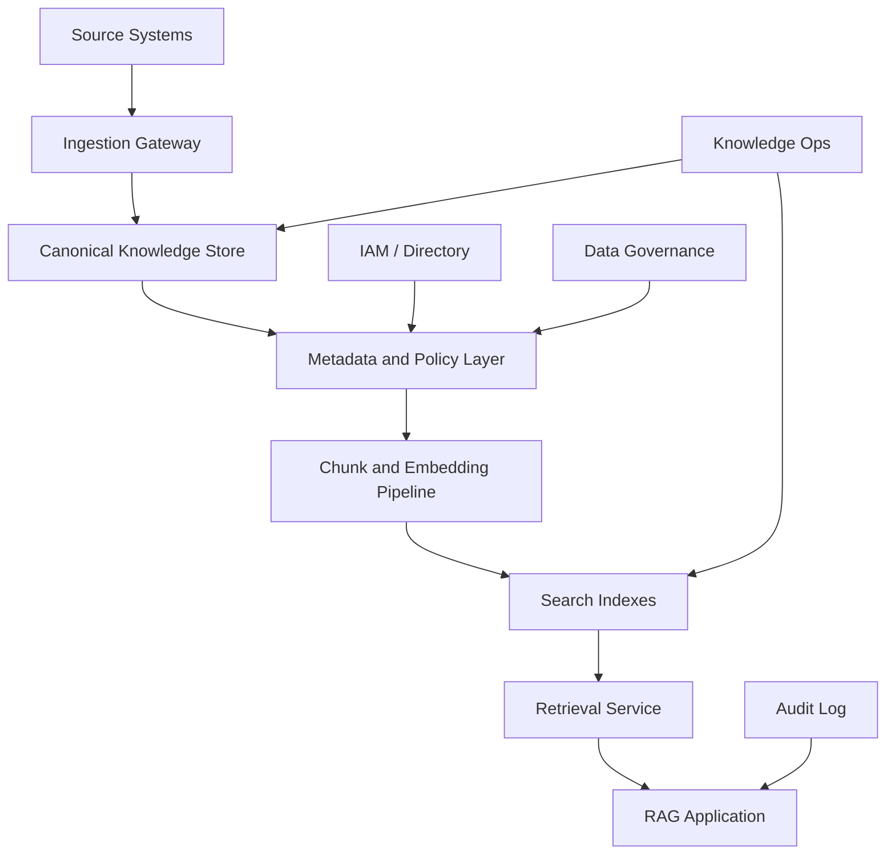
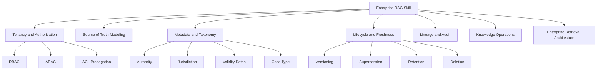
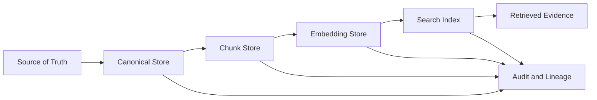
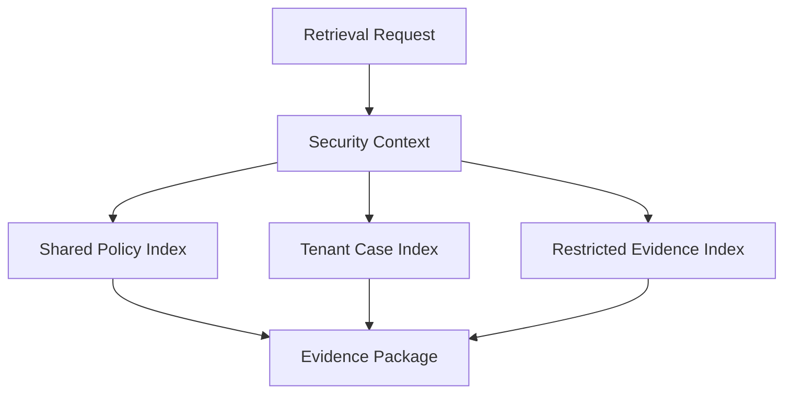
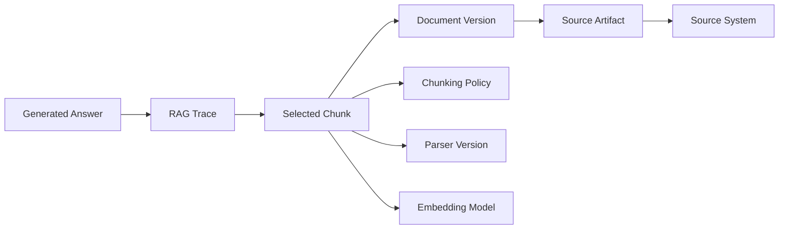
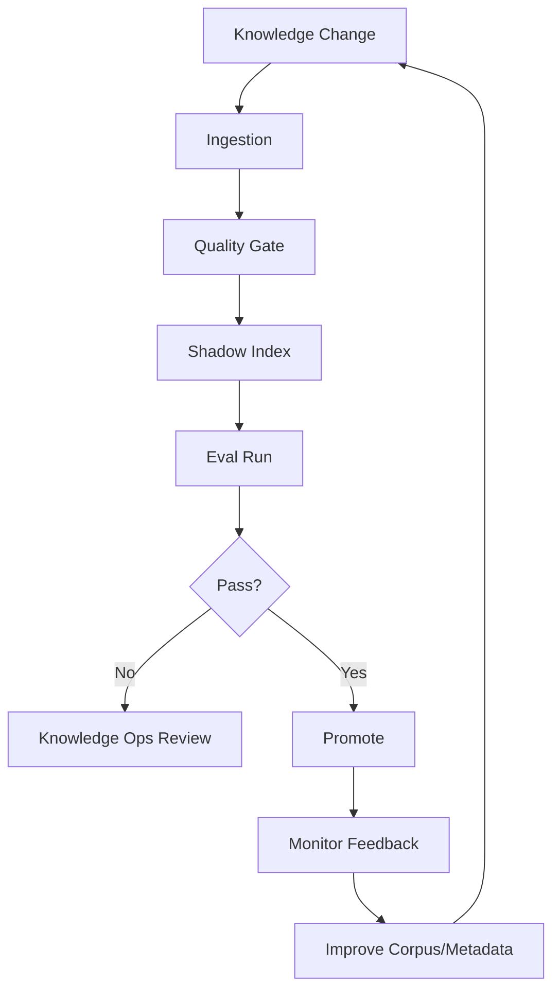
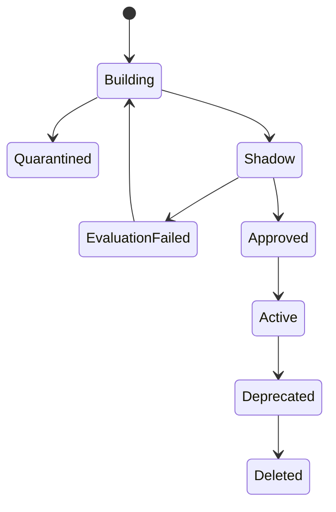
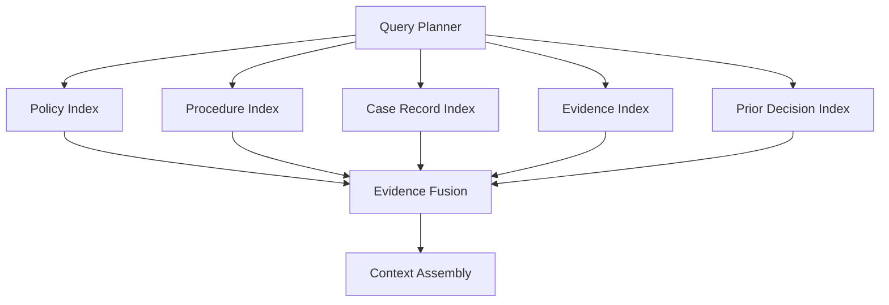
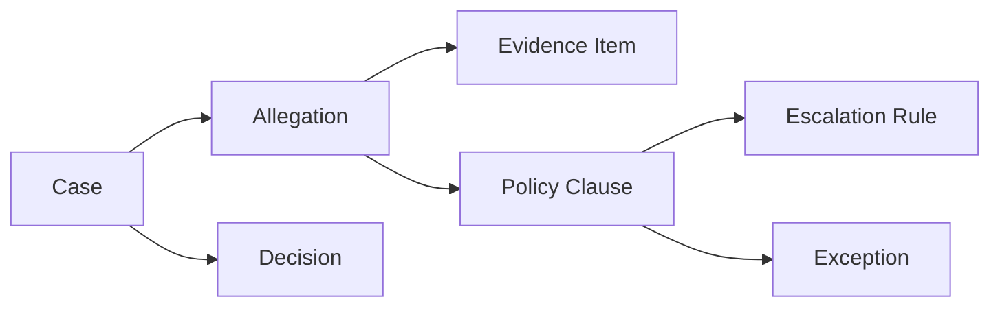
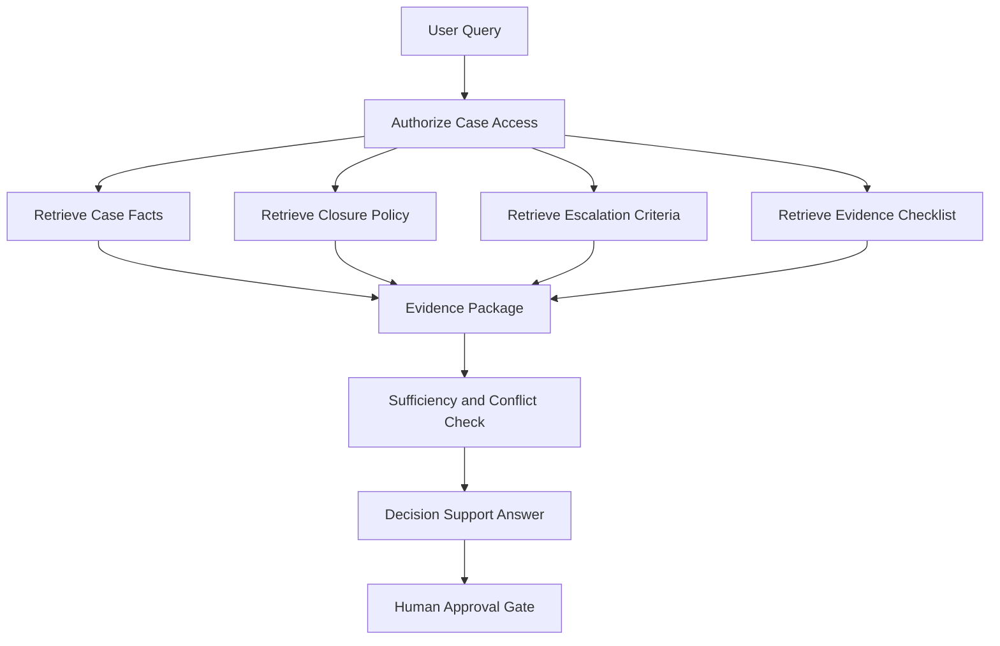

# Part 017 — RAG for Enterprise Knowledge Systems

## 1. Why This Part Matters

A personal RAG app can be simple.

An enterprise RAG system is not simple.

It must handle:

- multiple tenants;
- multiple user roles;
- confidential documents;
- stale and superseded sources;
- policy versions;
- data lineage;
- source authority;
- audit trails;
- deletion and retention;
- human review;
- operational ownership;
- production incidents;
- change management.

In enterprise environments, the hard part is often not embeddings or model calls.

The hard part is **knowledge governance**.

A production enterprise RAG system must answer not only:

> Can the model answer the question?

but also:

> Was the answer based on the correct, current, authorized, auditable source of truth?

That is the standard for serious internal engineering.

---

## 2. Target Skill

After this part, you should be able to design an enterprise knowledge system for RAG that:

- supports tenant isolation;
- enforces document permissions before retrieval;
- tracks source lineage from artifact to generated answer;
- handles stale, superseded, draft, and active documents;
- models source authority and conflict resolution;
- supports deletion, retention, and legal hold;
- exposes audit trails for answer generation;
- supports knowledge operations workflows;
- separates search indexes from source-of-truth records;
- scales across teams, departments, and regulated domains.

---

## 3. Enterprise RAG Is a Knowledge Platform

A demo RAG app treats documents as files.

An enterprise RAG system treats knowledge as governed assets.



The retrieval layer is only one projection of the knowledge platform.

The source of truth remains upstream:

- document management system;
- case management database;
- policy repository;
- evidence store;
- knowledge base;
- ticketing system;
- data warehouse;
- object storage;
- internal CMS.

The RAG index is derived.

Derived indexes must be rebuildable, explainable, and disposable.

---

## 4. Core Enterprise Invariants

Use these as non-negotiable design rules.

### 4.1 Authorization Invariant

> A chunk that a user is not authorized to read must not enter the model context.

This includes:

- retrieval candidates;
- reranker input;
- context package;
- traces;
- debug logs;
- cached responses;
- generated citations.

### 4.2 Lineage Invariant

> Every answerable claim should be traceable back to a source artifact, document version, chunk, retrieval trace, and generation event.

Without lineage, you cannot defend the answer.

### 4.3 Freshness Invariant

> The system must know whether a source is current, stale, superseded, draft, archived, or deleted.

Stale knowledge is one of the most dangerous RAG failure modes.

### 4.4 Rebuild Invariant

> Search indexes are projections and must be rebuildable from canonical records and versioned policies.

Never make the vector database your only copy of knowledge.

### 4.5 Governance Invariant

> Changes to ingestion, chunking, metadata, embeddings, retrieval, and answer policy should be reviewable and auditable.

RAG behavior changes when knowledge pipelines change.

Treat those changes like production releases.

---

## 5. Kaufman Deconstruction

Following the Kaufman method, decompose enterprise RAG into subskills.



The fastest way to improve is to design for the highest-risk failure first:

1. unauthorized data exposure;
2. stale or wrong source;
3. unsupported answer;
4. missing audit trail;
5. irreversible index corruption.

---

## 6. Source of Truth vs Search Projection

The vector index is not the source of truth.

It is a query-optimized projection.



Each layer should have a clear purpose.

| Layer | Purpose |
|---|---|
| Source system | Authoritative data owner |
| Canonical store | Normalized internal representation |
| Chunk store | Retrieval unit source of truth |
| Embedding store | Model-specific vector record |
| Search index | Query-optimized projection |
| Trace store | Evidence of runtime behavior |
| Audit store | Defensible history |

If your vector database disappears, you should be able to rebuild it.

If your source system deletes a document, derived chunks and embeddings must follow lifecycle rules.

---

## 7. Enterprise Knowledge Object Model

### 7.1 Knowledge Source

```python
from typing import Literal
from pydantic import BaseModel


class KnowledgeSource(BaseModel):
    source_id: str
    tenant_id: str

    source_system: str
    source_type: Literal[
        "policy_repository",
        "case_database",
        "document_management",
        "evidence_store",
        "ticketing_system",
        "wiki",
        "email",
        "object_storage",
    ]

    authority_level: Literal[
        "system_of_record",
        "official_policy",
        "approved_procedure",
        "case_record",
        "working_note",
        "draft",
        "user_upload",
    ]

    owner_team: str
    data_steward: str | None = None

    sync_mode: Literal["batch", "event", "manual", "api"]
    retention_policy_id: str | None = None
    legal_hold: bool = False
```

### 7.2 Knowledge Document

```python
class KnowledgeDocument(BaseModel):
    document_id: str
    source_id: str
    tenant_id: str

    title: str
    document_type: str
    version: str | None = None

    status: Literal["draft", "active", "superseded", "archived", "deleted"]
    valid_from: str | None = None
    valid_to: str | None = None

    jurisdiction: str | None = None
    business_domain: str | None = None
    case_type: str | None = None

    content_hash: str
    acl_policy_id: str
    classification: Literal["public", "internal", "confidential", "restricted"]

    created_at: str
    updated_at: str | None = None
```

### 7.3 Knowledge Chunk

```python
class EnterpriseChunk(BaseModel):
    chunk_id: str
    document_id: str
    source_id: str
    tenant_id: str

    text: str
    heading_path: list[str]
    page_start: int | None = None
    page_end: int | None = None

    status: Literal["active", "superseded", "archived", "deleted"]
    authority_level: str
    classification: str
    acl_policy_id: str

    valid_from: str | None = None
    valid_to: str | None = None
    jurisdiction: str | None = None
    business_domain: str | None = None
    case_type: str | None = None

    parser_version: str
    chunking_policy_id: str
    metadata_quality_score: float | None = None
```

This model is more verbose than a demo.

That verbosity buys operational control.

---

## 8. Tenancy Model

Enterprise RAG must decide how tenants are isolated.

### 8.1 Index-per-Tenant

Each tenant has separate indexes.

Advantages:

- strong isolation;
- simple filters;
- easier deletion;
- reduced blast radius.

Disadvantages:

- many indexes;
- operational overhead;
- harder cross-tenant analytics;
- duplicated shared knowledge.

Use when:

- tenants are legally isolated;
- data sensitivity is high;
- corpus size per tenant is manageable.

### 8.2 Shared Index with Tenant Filters

Multiple tenants share one index with mandatory tenant filters.

Advantages:

- simpler operations;
- better shared infrastructure;
- easier global search for authorized admins.

Disadvantages:

- filter bugs can leak data;
- cache keys must include tenant/security context;
- harder to prove isolation.

Use when:

- tenants are internal business units;
- authorization layer is mature;
- backend supports efficient mandatory filters.

### 8.3 Hybrid Model

Use separate indexes for restricted tenant data and shared indexes for global public/internal documents.



Hybrid is common in enterprise systems.

---

## 9. RBAC, ABAC, and ACL

### 9.1 RBAC

Role-based access control:

```text
analyst can read internal policy
supervisor can read enforcement recommendations
legal can read restricted legal advice
```

Good for coarse access.

### 9.2 ABAC

Attribute-based access control:

```text
user.department == document.owner_department
user.region == document.jurisdiction
case.assigned_user == user.id
document.classification <= user.clearance
```

Good for dynamic enterprise rules.

### 9.3 ACL

Access-control list attached to objects:

```text
document allowed_users = [u1, u2]
document allowed_groups = [g1, g2]
```

Good for document-specific permissions.

### 9.4 Practical Rule

Enterprise RAG often needs all three:

- RBAC for general capabilities;
- ABAC for policy decisions;
- ACL for source-specific restrictions.

The retrieval filter builder should consume a trusted authorization decision, not invent permissions from text.

---

## 10. Security Context to Retrieval Filter

```python
class EnterpriseSecurityContext(BaseModel):
    tenant_id: str
    user_id: str
    roles: list[str]
    groups: list[str]
    clearance: str
    department: str | None = None
    region: str | None = None
    assigned_case_ids: list[str] = []


class RetrievalFilterBuilder:
    def build(self, ctx: EnterpriseSecurityContext) -> dict[str, object]:
        return {
            "tenant_id": ctx.tenant_id,
            "status": "active",
            "classification": {"$in": allowed_classifications(ctx.clearance)},
            "acl_policy_id": {"$in": resolve_allowed_acl_policies(ctx)},
        }
```

This filter must be mandatory.

A developer should not be able to accidentally call retrieval without tenant/security filters.

---

## 11. Mandatory Filter Guard

```python
class UnsafeRetrievalRequest(Exception):
    pass


def assert_mandatory_filters(filters: dict[str, object]) -> None:
    mandatory = ["tenant_id", "acl_policy_id", "classification", "status"]
    missing = [field for field in mandatory if field not in filters]

    if missing:
        raise UnsafeRetrievalRequest(f"Missing mandatory retrieval filters: {missing}")
```

Use this guard inside the retrieval service, not only at API boundary.

Defense in depth matters.

---

## 12. Metadata Taxonomy

Enterprise retrieval depends on metadata quality.

A good taxonomy lets you filter and rank by business meaning.

Common fields:

| Field | Purpose |
|---|---|
| `tenant_id` | isolation |
| `classification` | data sensitivity |
| `acl_policy_id` | authorization |
| `source_system` | provenance |
| `authority_level` | conflict resolution |
| `document_status` | active/draft/superseded |
| `valid_from` / `valid_to` | temporal correctness |
| `jurisdiction` | legal/regional filtering |
| `business_domain` | search scope |
| `case_type` | case-specific retrieval |
| `decision_point` | workflow relevance |
| `evidence_type` | evidence retrieval |
| `owner_team` | stewardship |
| `content_hash` | change detection |
| `parser_version` | reproducibility |
| `chunking_policy_id` | reproducibility |
| `embedding_model` | vector compatibility |

Metadata should be governed like schema.

Do not allow every team to invent incompatible names for the same concept.

---

## 13. Metadata Quality Gates

Before indexing, validate:

```python
REQUIRED_ENTERPRISE_METADATA = {
    "tenant_id",
    "source_id",
    "document_id",
    "classification",
    "acl_policy_id",
    "authority_level",
    "document_status",
    "chunking_policy_id",
    "parser_version",
}


def validate_enterprise_metadata(chunk: EnterpriseChunk) -> list[str]:
    data = chunk.model_dump()
    return [
        field
        for field in REQUIRED_ENTERPRISE_METADATA
        if data.get(field) in (None, "", [])
    ]
```

Blocking issues:

- missing tenant;
- missing ACL;
- missing classification;
- missing source ID;
- missing document status;
- invalid authority level.

Non-blocking issues:

- missing owner team;
- missing jurisdiction where not applicable;
- missing page number for non-paginated sources.

---

## 14. Source Authority

Not all sources are equal.

Example conflict:

- FAQ says appeal deadline is 7 days.
- Official policy says appeal deadline is 14 days.
- Draft policy says deadline may become 21 days.

The system must know which source wins.

Authority ranking:

| Authority | Rank |
|---|---:|
| system of record | 100 |
| official policy | 90 |
| approved procedure | 80 |
| case record | 75 |
| official FAQ | 60 |
| working note | 40 |
| draft | 20 |
| user upload | 10 |

Example:

```python
AUTHORITY_RANK = {
    "system_of_record": 100,
    "official_policy": 90,
    "approved_procedure": 80,
    "case_record": 75,
    "official_faq": 60,
    "working_note": 40,
    "draft": 20,
    "user_upload": 10,
}


def authority_score(authority_level: str) -> int:
    return AUTHORITY_RANK.get(authority_level, 0)
```

Use authority as a ranking signal and conflict-resolution input.

Do not let semantic similarity alone choose between policy and draft.

---

## 15. Freshness and Supersession

Freshness is not only "latest timestamp".

A document may be:

- active;
- superseded;
- archived;
- draft;
- effective in the future;
- valid only during a period;
- applicable to one jurisdiction.

Model this explicitly.

```python
class SupersessionLink(BaseModel):
    old_document_id: str
    new_document_id: str
    superseded_at: str
    reason: str | None = None
```

Retrieval rule examples:

- For current-policy queries, filter `status = active`.
- For historical queries, filter by event date.
- For audit queries, allow superseded docs but label them.
- For future policy queries, include approved future-effective docs if requested.

Temporal correctness is especially important in regulatory workflows.

---

## 16. Temporal Retrieval Example

```python
def build_temporal_filter(
    *,
    query_date: str | None,
    default_current: bool = True,
) -> dict[str, object]:
    if query_date:
        return {
            "valid_from": {"$lte": query_date},
            "$or": [
                {"valid_to": None},
                {"valid_to": {"$gte": query_date}},
            ],
        }

    if default_current:
        return {"document_status": "active"}

    return {}
```

Do not use today's policy to explain a decision made under last year's rule unless the user asks for current policy.

---

## 17. Data Lineage

Lineage connects runtime output to source data.

Minimum lineage chain:

```text
answer_id
 -> trace_id
 -> selected_chunk_ids
 -> chunking_policy_id
 -> document_id
 -> source_id
 -> source_system
 -> source_version/content_hash
 -> ingestion_batch_id
```



Lineage lets you answer:

- What source supported this answer?
- Was the source active at the time?
- Which index version served the query?
- Which parser/chunking policy produced the evidence?
- Who was allowed to see it?
- Was the source later corrected or deleted?

---

## 18. Audit Log

Audit logging is not the same as application logging.

Application logs help debugging.

Audit logs support accountability.

Audit fields:

```python
class RagAuditEvent(BaseModel):
    audit_event_id: str
    timestamp: str

    tenant_id: str
    user_id: str
    request_id: str
    trace_id: str

    action: str
    query_hash: str

    selected_source_ids: list[str]
    selected_chunk_ids: list[str]
    cited_chunk_ids: list[str]

    answer_status: str
    confidence: str | None = None

    index_versions: list[str]
    model_versions: list[str]

    authorization_decision_id: str | None = None
    policy_version: str | None = None
```

Avoid storing full sensitive query/answer text in audit if policy forbids it. Store hashes and references where needed.

---

## 19. Knowledge Operations

Enterprise RAG needs an operating model.

Someone must own:

- source connectors;
- parser failures;
- metadata taxonomy;
- chunking policies;
- index promotion;
- eval datasets;
- stale source cleanup;
- source authority model;
- security policy mapping;
- incident response;
- user feedback triage.

This is **Knowledge Ops**.



RAG gets worse when knowledge operations are ignored.

---

## 20. Index Promotion Workflow

Treat index promotion like application deployment.

States:



Promotion gates:

- ingestion success rate;
- parser quality;
- metadata completeness;
- ACL validation;
- retrieval evals;
- stale source check;
- unauthorized retrieval test;
- latency benchmark;
- cost estimate.

Index promotion should be auditable.

---

## 21. Multi-Index Enterprise Retrieval

A single index rarely fits all knowledge.

Example architecture:



Different indexes may use different:

- chunking strategies;
- metadata;
- access policies;
- embedding models;
- freshness rules;
- rerankers.

Do not force heterogeneous knowledge into one generic vector index without a reason.

---

## 22. Knowledge Graph Augmentation

Some enterprise questions require relationships, not only passages.

Examples:

- Which policy superseded this one?
- Which cases cite this rule?
- Which evidence items support this allegation?
- Which parties are connected to this organization?
- Which procedure step depends on supervisor approval?

A knowledge graph can complement RAG.



Graph is useful for:

- relationship traversal;
- dependency reasoning;
- authorization inheritance;
- case timelines;
- citation networks;
- supersession chains.

RAG retrieves text evidence.

Graph retrieves relationships.

Enterprise systems often need both.

---

## 23. Data Residency and Deployment Model

Enterprise RAG may be constrained by:

- data residency;
- regulatory requirements;
- customer contracts;
- internal security policy;
- latency;
- cost;
- integration with existing infrastructure.

Deployment models:

| Model | Characteristics |
|---|---|
| SaaS-hosted | fastest to adopt, external data transfer considerations |
| Cloud private deployment | managed infra with enterprise controls |
| VPC/private link | stronger network isolation |
| On-premises | maximum control, higher ops burden |
| Hybrid | sensitive data local, general models/tools cloud |

Do not treat deployment as an afterthought.

It affects:

- model provider choice;
- embedding pipeline;
- vector database;
- logs/traces;
- evaluation data;
- support process.

---

## 24. Data Classification

Classification must flow into retrieval.

Example:

```python
CLASSIFICATION_ORDER = ["public", "internal", "confidential", "restricted"]


def allowed_classifications(clearance: str) -> list[str]:
    idx = CLASSIFICATION_ORDER.index(clearance)
    return CLASSIFICATION_ORDER[: idx + 1]
```

But real systems need more than a simple hierarchy.

Examples:

- restricted legal advice;
- HR confidential;
- enforcement confidential;
- case sealed;
- investigation privileged;
- customer private;
- export controlled;
- region restricted.

Classification should be owned by governance/security, not random application code.

---

## 25. Cache Safety

Caching RAG results is dangerous if keys are incomplete.

Cache keys must include:

- tenant;
- user or permission group;
- roles;
- ACL policy version;
- query normalization version;
- index version;
- retrieval mode;
- model version;
- source freshness constraints.

Unsafe cache key:

```text
hash(query)
```

Safer cache key:

```text
hash(tenant_id, security_context_hash, normalized_query, index_version, retrieval_policy_version)
```

Never serve an answer generated under a broader permission context to a narrower one.

---

## 26. Feedback Loop

Enterprise users will find knowledge gaps.

Capture feedback as structured events.

```python
class RagFeedback(BaseModel):
    feedback_id: str
    request_id: str
    trace_id: str
    user_id: str
    tenant_id: str

    rating: str
    issue_type: str
    comment: str | None = None

    expected_source_id: str | None = None
    expected_answer: str | None = None

    created_at: str
```

Issue types:

- missing source;
- wrong source;
- stale source;
- wrong citation;
- too vague;
- too much detail;
- permission issue;
- policy conflict;
- hallucination;
- slow response.

Feedback should feed Knowledge Ops and eval datasets.

---

## 27. Enterprise RAG Evaluation

Evaluate by slices.

Do not rely only on aggregate metrics.

Slices:

- tenant;
- role;
- classification;
- source type;
- document status;
- query type;
- jurisdiction;
- case type;
- language;
- index version;
- model version.

Metrics:

- recall@k;
- MRR;
- citation support rate;
- unauthorized retrieval rate;
- stale source rate;
- insufficient evidence correctness;
- contradiction handling correctness;
- latency p95;
- cost per query;
- user feedback rate.

Security metric:

> Unauthorized retrieval rate must be zero.

Not low. Zero.

---

## 28. Regulatory Case-Management Example

Question:

```text
Can we close this case without escalation?
```

Enterprise RAG plan:

1. authorize user access to the case;
2. retrieve current case facts;
3. retrieve closure criteria;
4. retrieve escalation policy;
5. retrieve prior non-compliance history;
6. retrieve missing evidence checklist;
7. resolve conflicts by source authority;
8. produce decision-support answer;
9. cite policy and case records;
10. require human approval for final action.



Important:

> RAG may recommend, explain, and cite. It should not silently perform a regulated final decision without workflow authorization.

---

## 29. Incident Response

Enterprise RAG incidents include:

- unauthorized disclosure;
- materially wrong policy answer;
- stale policy answer;
- citation fabrication;
- data deletion failure;
- source sync failure;
- high-volume hallucination regression;
- model/tool provider outage;
- runaway cost spike.

Incident checklist:

1. identify affected request IDs;
2. freeze relevant traces and index manifests;
3. identify index/model/policy versions;
4. determine affected users/tenants;
5. disable unsafe path if needed;
6. roll back index/model/prompt where possible;
7. correct source/index;
8. add regression tests;
9. notify stakeholders where required;
10. update runbook.

---

## 30. Design Review Checklist

Before approving enterprise RAG architecture:

- What are the source systems?
- Which system is authoritative for each knowledge type?
- How is tenant isolation implemented?
- How are RBAC/ABAC/ACL resolved?
- Are security filters mandatory?
- How does ACL propagate to chunks?
- How is source authority modeled?
- How is document status modeled?
- How are valid dates modeled?
- How are superseded documents handled?
- How are deletions propagated?
- How is legal hold handled?
- How are indexes versioned?
- How are indexes promoted?
- How are traces stored?
- How are audit events stored?
- What is the feedback triage process?
- Who owns metadata taxonomy?
- Who owns eval datasets?
- What is the incident response process?
- What metrics indicate regression?

---

## 31. Practice: Design an Enterprise Knowledge System

Create an architecture for a case-management AI assistant.

Required sources:

1. policy repository;
2. case database;
3. evidence store;
4. prior decision archive;
5. procedure manual;
6. audit log.

Define:

- knowledge object model;
- metadata taxonomy;
- authorization strategy;
- index strategy;
- source authority ranking;
- freshness rules;
- deletion/retention policy;
- audit trail;
- evaluation slices;
- incident runbook.

Deliverable:

```text
Enterprise RAG Architecture Review

1. Source of truth map
2. Knowledge object model
3. Metadata schema
4. Tenant/security model
5. Index topology
6. Retrieval routing
7. Freshness and supersession rules
8. Audit and lineage model
9. Knowledge Ops workflow
10. Evaluation and release gates
11. Incident response plan
```

This is the kind of artifact senior engineers review.

---

## 32. Engineering Heuristics

1. Treat enterprise RAG as a knowledge platform, not a chatbot feature.
2. Never make the vector index the source of truth.
3. Enforce authorization before retrieval results reach the model.
4. Attach ACL and classification at chunk level.
5. Version indexes, embeddings, chunking policies, and prompts.
6. Model source authority explicitly.
7. Model temporal validity explicitly.
8. Treat index promotion like software release.
9. Keep lineage from answer to source artifact.
10. Slice evals by tenant, role, source type, and query type.
11. Build Knowledge Ops ownership early.
12. Make deletion and retention first-class.
13. Treat stale policy answers as serious failures.
14. Treat unauthorized retrieval as a security incident.
15. Prefer human approval gates for regulated case actions.

---

## 33. Summary

Enterprise RAG is not primarily a vector-search problem.

It is a governed knowledge-system problem.

The core invariant:

> The answer must be grounded in authorized, current, authoritative, traceable knowledge.

If your design cannot prove that invariant, it is not enterprise-ready.

This closes the main RAG block of the series.

In the next part, we begin the agentic systems block with **Agent Mental Model**.
