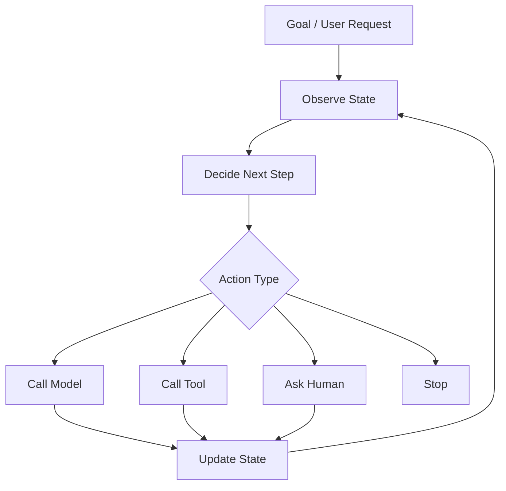
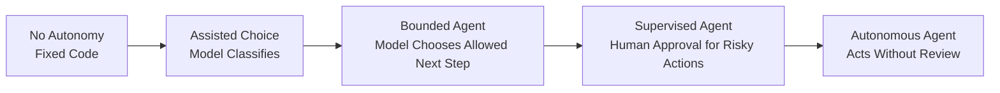
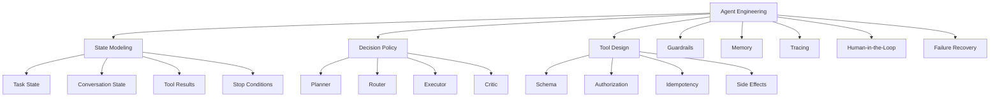
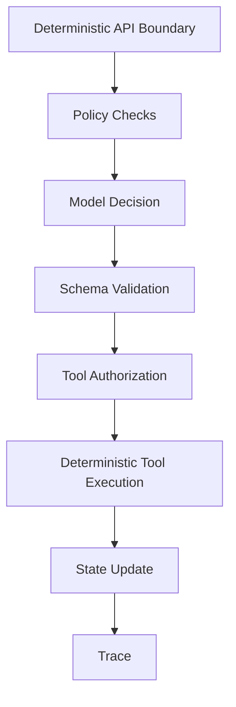
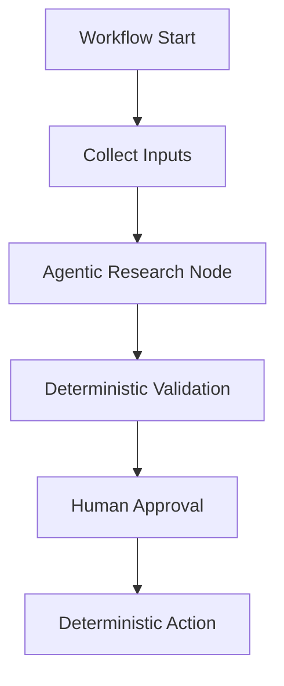
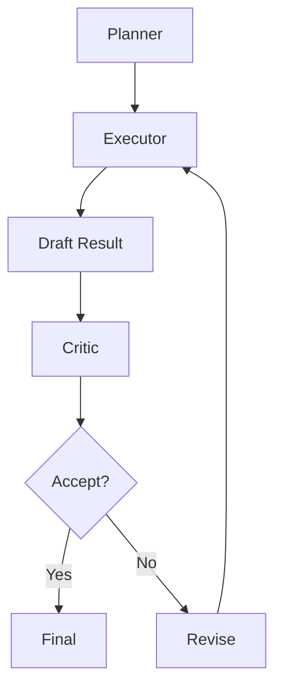
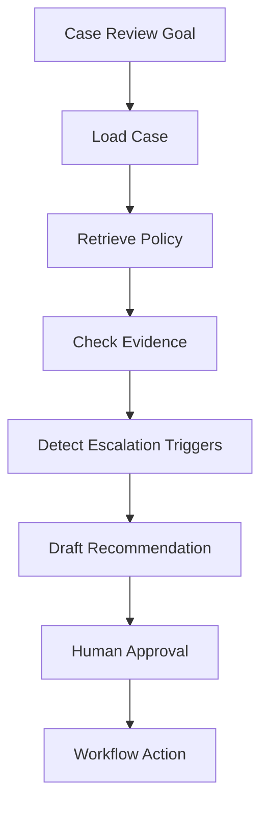

# Part 018 — Agent Mental Model

## 1. Why This Part Matters

"Agent" is one of the most overloaded terms in AI engineering.

Sometimes it means:

- a chatbot with tools;
- an LLM loop;
- a workflow graph;
- a planner/executor system;
- a software robot;
- a task automation;
- a multi-step assistant;
- a collection of specialized sub-agents.

If the term is not defined, architecture discussions become vague.

For production engineering, use a stricter definition:

> An agent is a system that observes state, decides what to do next, may call tools, updates state, and repeats until it reaches a stop condition, handoff, failure, or human approval point.

This part builds the mental model.

Later parts will cover workflow orchestration, tool registry, memory, long-running tasks, and multi-agent boundaries.

---

## 2. Target Skill

After this part, you should be able to:

- distinguish agents from workflows, chatbots, and simple tool calls;
- model an agent as a stateful control loop;
- define observation, state, decision, action, and stop conditions;
- choose the right autonomy level;
- identify where deterministic code should replace model judgment;
- design safe tool-use boundaries;
- reason about agent failure modes;
- apply human approval gates;
- design traces for agent runs;
- explain why most production agents should be constrained systems, not free-form loops.

---

## 3. Agent as a Control Loop

The simplest mental model:



An agent is not just the model.

The agent is the whole loop:

- state;
- model;
- tools;
- policies;
- memory;
- guards;
- stop condition;
- trace;
- human handoff;
- failure recovery.

The model is only one component.

---

## 4. Agent vs Chatbot vs Workflow

| System Type | Description | Example |
|---|---|---|
| Chatbot | Responds to user messages | FAQ assistant |
| Tool-calling assistant | Calls tools during response | fetch order status |
| Workflow | Executes predefined steps | approval process |
| Agent | Chooses next step based on state | research, retrieve, call tool, ask user |
| Autonomous agent | Runs with minimal user intervention | multi-step investigation |
| Multi-agent system | Multiple agents coordinate or delegate | support triage + billing + refund agents |

The boundary is decision autonomy.

A workflow has predetermined transitions.

An agent selects transitions at runtime.

But production agents should often use **bounded autonomy**.

---

## 5. Autonomy Spectrum



### 5.1 No Autonomy

Deterministic code decides everything.

Use for:

- compliance-critical rules;
- authorization;
- payment execution;
- destructive actions;
- legal deadlines;
- data deletion.

### 5.2 Assisted Choice

Model classifies or extracts information, but code executes.

Use for:

- intent classification;
- routing;
- summarization;
- draft generation;
- extracting structured fields.

### 5.3 Bounded Agent

Model chooses among allowed actions.

Use for:

- research workflows;
- retrieval planning;
- support triage;
- internal analyst assistants;
- non-destructive tool use.

### 5.4 Supervised Agent

Model proposes actions, human approves.

Use for:

- enforcement recommendations;
- customer-impacting decisions;
- case closure;
- external communication;
- financial adjustments.

### 5.5 Autonomous Agent

Model acts without review.

Use only when:

- action is low-risk;
- rollback exists;
- tool scope is narrow;
- budget is bounded;
- monitoring is strong;
- failures are acceptable.

---

## 6. Kaufman Deconstruction

Break agent engineering into subskills.



The deliberate-practice loop:

1. define a task;
2. model state;
3. define allowed actions;
4. run the agent;
5. inspect trace;
6. identify bad decision;
7. constrain or improve the responsible component;
8. add eval case.

Do not practice by asking an open-ended agent to "do something useful".

Practice by controlling state transitions.

---

## 7. The Agent State

Agent state is the current working memory of the run.

It should include:

- original goal;
- user context;
- conversation history;
- task status;
- plan;
- completed steps;
- tool results;
- errors;
- approvals;
- budget usage;
- stop reason.

Example:

```python
from typing import Literal
from pydantic import BaseModel, Field


class ToolCallRecord(BaseModel):
    tool_name: str
    input: dict[str, object]
    output_summary: str | None = None
    status: Literal["success", "failed", "skipped", "requires_approval"]
    error: str | None = None


class AgentState(BaseModel):
    run_id: str
    tenant_id: str
    user_id: str

    goal: str
    status: Literal[
        "running",
        "waiting_for_user",
        "waiting_for_approval",
        "completed",
        "failed",
        "cancelled",
    ] = "running"

    plan: list[str] = []
    current_step: str | None = None
    completed_steps: list[str] = []

    tool_calls: list[ToolCallRecord] = []
    observations: list[str] = []
    errors: list[str] = []

    max_steps: int = 12
    step_count: int = 0
    budget_tokens: int = 50_000
    used_tokens: int = 0

    stop_reason: str | None = None
```

A production agent should not rely only on hidden model context.

State should be explicit.

---

## 8. Observation

An observation is what the agent sees before deciding.

Sources:

- user message;
- task state;
- retrieved documents;
- tool outputs;
- system clock;
- workflow status;
- previous errors;
- approval decisions;
- budget remaining.

Observation should be curated.

Do not dump all available state blindly.

```python
class Observation(BaseModel):
    goal: str
    current_step: str | None
    recent_tool_results: list[str]
    known_constraints: list[str]
    remaining_steps: int
    requires_human_approval: bool
```

A poor observation creates poor decisions.

---

## 9. Decision

The decision stage chooses the next action.

Possible actions:

- answer user;
- ask clarification;
- retrieve knowledge;
- call tool;
- update plan;
- request approval;
- hand off;
- stop;
- fail safely.

Represent decisions with a schema.

```python
class AgentDecision(BaseModel):
    action_type: Literal[
        "answer",
        "ask_clarification",
        "retrieve",
        "call_tool",
        "update_plan",
        "request_approval",
        "handoff",
        "stop",
        "fail",
    ]

    rationale: str
    tool_name: str | None = None
    tool_input: dict[str, object] | None = None
    message: str | None = None
```

Do not let the model return arbitrary prose as control flow.

Make it choose from allowed actions.

---

## 10. Action

An action changes the world or state.

Actions can be:

- internal and reversible;
- internal and irreversible;
- external and reversible;
- external and irreversible.

Examples:

| Action | Risk |
|---|---|
| summarize document | low |
| retrieve policy | low |
| update internal draft | medium |
| send email | high |
| close case | high |
| delete record | very high |
| issue enforcement notice | very high |

The agent should not perform high-risk actions without explicit approval.

---

## 11. Stop Conditions

Agents need stop conditions.

Without stop conditions, they loop.

Stop when:

- goal is achieved;
- evidence is insufficient;
- user clarification is required;
- approval is required;
- max steps reached;
- budget exceeded;
- tool failure cannot be recovered;
- policy violation detected;
- cancellation requested.

```python
def should_stop(state: AgentState) -> bool:
    return (
        state.status in {"completed", "failed", "cancelled", "waiting_for_user", "waiting_for_approval"}
        or state.step_count >= state.max_steps
        or state.used_tokens >= state.budget_tokens
    )
```

Never ship an agent without max step and budget limits.

---

## 12. Deterministic Shell, Probabilistic Core

Production agents should use deterministic code around model judgment.



The model may decide.

The shell validates.

Examples:

- model proposes tool call;
- code validates schema;
- code checks authorization;
- code checks idempotency;
- code executes tool;
- code records trace;
- code decides whether approval is required.

Do not let model text directly become side effects.

---

## 13. Tool Use Is Delegation

A tool is authority delegated to the agent.

Therefore tool design must specify:

- input schema;
- output schema;
- permissions;
- side effects;
- idempotency;
- timeout;
- retry policy;
- approval requirement;
- audit logging;
- error behavior.

Example:

```python
class ToolSpec(BaseModel):
    name: str
    description: str

    input_schema: dict[str, object]
    output_schema: dict[str, object]

    side_effect_level: Literal["none", "read", "write", "external_write", "destructive"]
    requires_approval: bool
    allowed_roles: list[str]

    timeout_seconds: int = 10
    idempotency_required: bool = True
```

Tool calling is not only an LLM feature.

It is an integration contract.

---

## 14. Agent Loop Skeleton

```python
class AgentRunner:
    def __init__(
        self,
        *,
        decider: "AgentDecider",
        tool_executor: "ToolExecutor",
        policy: "AgentPolicy",
        trace_sink: "AgentTraceSink",
    ) -> None:
        self.decider = decider
        self.tool_executor = tool_executor
        self.policy = policy
        self.trace_sink = trace_sink

    async def run(self, state: AgentState) -> AgentState:
        while not should_stop(state):
            observation = build_observation(state)

            decision = await self.decider.decide(observation)

            policy_result = self.policy.check_decision(state, decision)
            if not policy_result.allowed:
                state.status = "failed"
                state.stop_reason = policy_result.reason
                break

            if decision.action_type == "call_tool":
                tool_result = await self.tool_executor.execute(decision)
                state.tool_calls.append(tool_result)
                state.observations.append(tool_result.output_summary or "")
            elif decision.action_type == "ask_clarification":
                state.status = "waiting_for_user"
                state.stop_reason = "clarification_required"
            elif decision.action_type == "request_approval":
                state.status = "waiting_for_approval"
                state.stop_reason = "approval_required"
            elif decision.action_type == "answer":
                state.status = "completed"
                state.stop_reason = "answered"
            elif decision.action_type == "fail":
                state.status = "failed"
                state.stop_reason = decision.message or "agent_failed"

            state.step_count += 1
            await self.trace_sink.write_step(state, decision)

        if state.step_count >= state.max_steps and state.status == "running":
            state.status = "failed"
            state.stop_reason = "max_steps_exceeded"

        return state
```

This is not framework-specific.

The loop is the architecture.

---

## 15. Workflow vs Agent

A workflow is better when the process is known.

An agent is better when the next step depends on information discovered at runtime.

### Use Workflow When

- steps are fixed;
- compliance requires deterministic path;
- auditability matters more than flexibility;
- error recovery is predictable;
- user approvals are structured.

### Use Agent When

- task requires exploration;
- information source is unknown upfront;
- user goal is underspecified;
- tool choice depends on intermediate results;
- the system must adapt to failures.

### Hybrid Pattern

Use deterministic workflow as the outer shell and agentic decision inside bounded nodes.



This is often the best production pattern.

---

## 16. Planning

Planning means decomposing a goal into steps.

Plans can be:

- implicit in model context;
- explicit as text;
- structured as tasks;
- represented as graph state;
- constrained by workflow.

A good plan is revisable.

```python
class AgentPlan(BaseModel):
    objective: str
    steps: list[str]
    known_risks: list[str] = []
    requires_approval_before: list[str] = []
```

Planning failure modes:

- over-planning trivial tasks;
- under-planning complex tasks;
- hallucinating unavailable tools;
- ignoring constraints;
- creating steps without stop conditions;
- continuing after enough evidence exists.

---

## 17. Reflection and Critic Loops

Some agents use a critic or evaluator.

Pattern:



Useful for:

- code generation;
- research summaries;
- data extraction;
- complex reasoning;
- plan validation.

Risks:

- extra cost;
- longer latency;
- self-reinforcing mistakes;
- false confidence;
- infinite loops.

Use bounded critic loops with max iterations.

---

## 18. Memory

Agent memory is not magic.

Types:

| Memory Type | Purpose |
|---|---|
| working state | current run state |
| conversation memory | prior user interaction |
| episodic memory | past task outcomes |
| semantic memory | durable facts/preferences |
| tool memory | previous tool results |
| policy memory | constraints and rules |

Memory risks:

- stale facts;
- privacy leakage;
- cross-tenant contamination;
- prompt injection persistence;
- over-personalization;
- hidden state that cannot be audited.

Production rule:

> Any durable memory that affects decisions must be inspectable, scoped, and deletable.

---

## 19. Human-in-the-Loop

Human involvement is not a weakness.

It is a control mechanism.

Use human approval for:

- external side effects;
- destructive actions;
- regulated decisions;
- high-cost operations;
- low-confidence conclusions;
- contradictory evidence;
- irreversible state changes;
- communication to customers/regulators.

Approval request should include:

- proposed action;
- reason;
- evidence;
- risk;
- alternatives;
- rollback option;
- expiration.

```python
class ApprovalRequest(BaseModel):
    approval_id: str
    run_id: str
    proposed_action: str
    rationale: str
    evidence_ids: list[str]
    risk_level: Literal["medium", "high", "critical"]
    expires_at: str | None = None
```

---

## 20. Agent Trace

An agent trace should show the full run.

```python
class AgentTraceStep(BaseModel):
    run_id: str
    step_number: int

    observation_summary: str
    decision: AgentDecision
    policy_result: dict[str, object]
    tool_call: ToolCallRecord | None = None

    state_status: str
    token_usage: dict[str, int] = {}
    latency_ms: int | None = None
```

A trace should answer:

- Why did the agent choose this tool?
- What input did it send?
- What output came back?
- What state changed?
- Did policy allow the action?
- Did human approval happen?
- Why did it stop?

No trace, no production agent.

---

## 21. Agent Failure Modes

| Failure | Description | Mitigation |
|---|---|---|
| Looping | Agent repeats steps | max steps, state checks |
| Tool hallucination | Agent calls nonexistent tool | tool registry schema |
| Bad tool input | Invalid or unsafe args | validation |
| Excessive agency | Agent does more than requested | scoped goals, policy |
| Unauthorized action | Agent acts beyond permission | authorization checks |
| Prompt injection | External text controls agent | evidence-as-data boundary |
| Memory poisoning | Bad info persists | memory validation/deletion |
| Cost runaway | Too many calls | budget limits |
| Goal drift | Agent changes objective | explicit goal state |
| Premature stop | Agent answers too early | sufficiency checks |
| Irreversible mistake | Destructive tool call | approval gates |
| Silent failure | Error hidden from user | trace and status |

---

## 22. Agent Safety Invariants

1. The agent may only use registered tools.
2. The agent may only call tools allowed by policy.
3. Tool input must validate against schema.
4. Tool calls with side effects must be idempotent or approval-gated.
5. Unauthorized data must not enter model context.
6. Retrieved content is data, not instruction.
7. Durable memory must be scoped by tenant/user/purpose.
8. Long-running tasks must checkpoint state.
9. Every run must have max steps and budget.
10. Every action must be traceable.
11. Human approval must be explicit for high-risk actions.
12. The agent must stop safely when uncertain.

---

## 23. Agent Design for Case Management

Example task:

```text
Review this enforcement case and recommend the next workflow action.
```

Agent should not directly close the case.

A bounded case-review agent may:

1. load case summary;
2. retrieve applicable policy;
3. check evidence completeness;
4. identify escalation triggers;
5. compare prior decisions;
6. draft recommendation;
7. request supervisor approval.



Allowed:

- read case;
- retrieve policy;
- summarize evidence;
- draft recommendation;
- create approval request.

Not allowed without approval:

- close case;
- issue sanction;
- notify respondent;
- delete evidence;
- override policy.

This is bounded agency.

---

## 24. Agent Evaluation

Evaluate agents at multiple levels.

| Level | Question |
|---|---|
| Step-level | Was the next action correct? |
| Tool-level | Was the tool call valid and authorized? |
| Trajectory-level | Was the sequence efficient and safe? |
| Outcome-level | Was the task completed? |
| Safety-level | Did it avoid prohibited actions? |
| Cost-level | Was it within budget? |
| Human-review level | Were approval requests clear? |

Example trajectory eval:

```python
class AgentTrajectoryEval(BaseModel):
    run_id: str
    task_id: str

    completed: bool
    correct_final_outcome: bool
    unsafe_actions: int
    unnecessary_steps: int
    tool_errors: int
    approval_required_but_missing: bool
    notes: str | None = None
```

Do not evaluate only the final answer.

Agents fail through bad trajectories.

---

## 25. When Not to Use an Agent

Do not use an agent when:

- a simple function is enough;
- workflow is fixed;
- mistakes are high-risk and preventable with deterministic rules;
- the model has no meaningful decision to make;
- tool permissions are not mature;
- there is no tracing;
- there is no eval;
- there is no owner for failures;
- latency/cost budget is tight;
- the domain requires strict deterministic behavior.

The best AI application engineers avoid agents when agents are unnecessary.

---

## 26. Minimal Agent Design Checklist

Before building:

- What is the goal?
- What state is needed?
- What actions are allowed?
- Which actions require approval?
- What tools exist?
- What are tool schemas?
- What are stop conditions?
- What budget applies?
- What memory is allowed?
- What data can enter context?
- What policy checks happen?
- What trace is recorded?
- How is success evaluated?
- How are failures recovered?
- Who owns incidents?

If these are unclear, the agent is not ready.

---

## 27. Practice: Build a Bounded Research Agent

Build a small agent that answers:

```text
Given a policy question, retrieve evidence, check sufficiency, and draft a cited answer.
```

Constraints:

- max 6 steps;
- only read-only tools;
- no external writes;
- must cite evidence;
- must stop if evidence insufficient;
- must record trace.

Allowed actions:

- retrieve_policy;
- retrieve_case;
- ask_clarification;
- draft_answer;
- stop_insufficient;
- stop_answered.

Deliverables:

1. `AgentState`
2. `AgentDecision`
3. tool registry
4. policy checker
5. runner loop
6. trace store
7. five eval tasks
8. failure-mode report

This practice prepares you for workflow orchestration in the next part.

---

## 28. Engineering Heuristics

1. Model agents as stateful control loops.
2. Keep state explicit.
3. Keep tool authority narrow.
4. Use deterministic policy checks around model decisions.
5. Prefer bounded autonomy.
6. Use human approval for high-risk actions.
7. Never allow retrieved text to grant authority.
8. Use max steps and budget limits.
9. Trace every decision and tool call.
10. Evaluate trajectories, not only final answers.
11. Do not use an agent when a workflow or function is enough.
12. Separate planning, execution, validation, and approval.
13. Treat side effects as privileged operations.
14. Make stop conditions explicit.
15. Design for recovery, not just happy path.

---

## 29. Summary

An agent is not a magical autonomous worker.

A production agent is a constrained control loop:

```text
observe -> decide -> act -> update state -> repeat -> stop
```

The model may provide judgment, but the system must provide boundaries.

The core invariant:

> The agent may only take allowed, validated, traceable actions within explicit state, budget, permission, and approval boundaries.

In the next part, we move from mental model to implementation architecture with **Agent Workflow Orchestration**.
