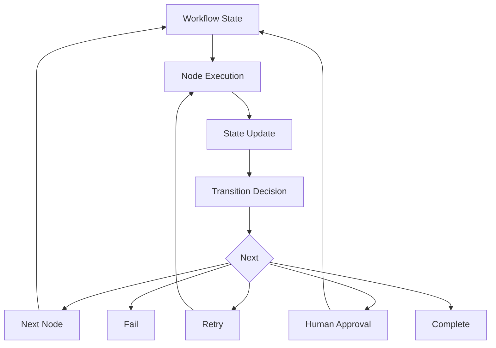
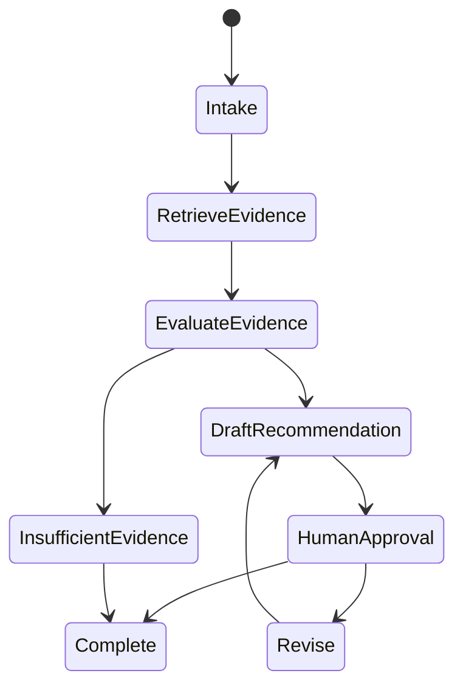
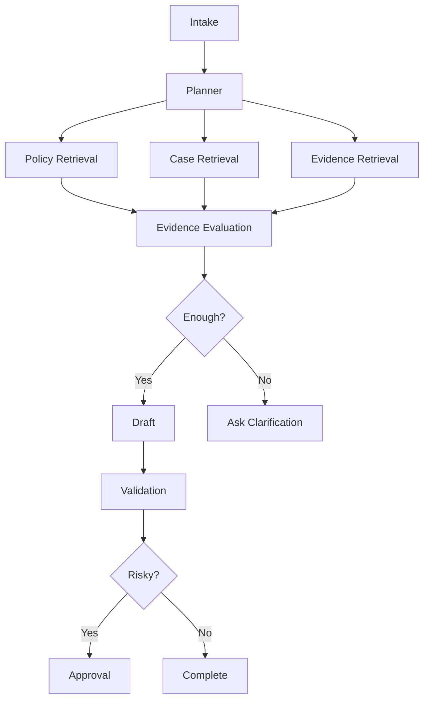
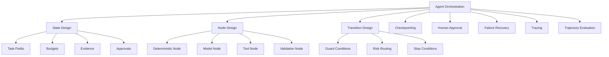
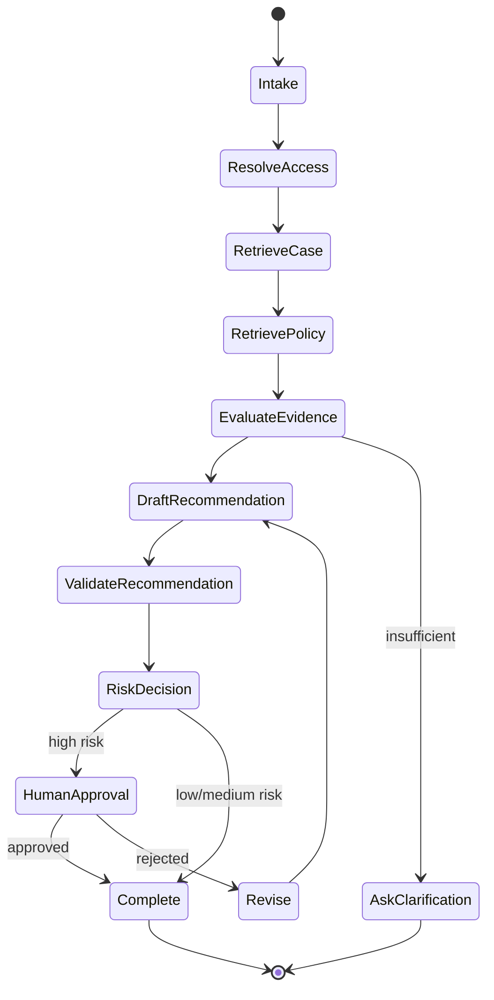
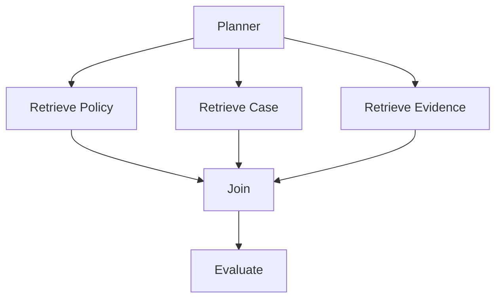
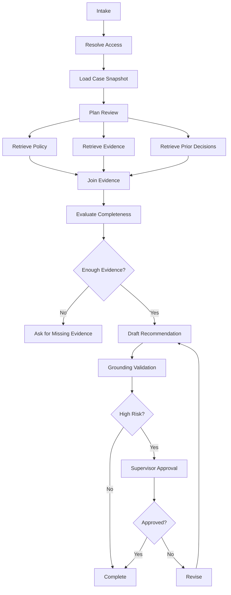

# Part 019 — Agent Workflow Orchestration

## 1. Why This Part Matters

The previous part defined an agent as a stateful control loop:

```text
observe -> decide -> act -> update state -> repeat -> stop
```

That mental model is necessary, but not sufficient.

In production, the question becomes:

> How do we execute that loop safely, repeatedly, observably, and recoverably?

This is where **workflow orchestration** matters.

A production agent should not be a hidden while-loop around an LLM. It should be an explicit workflow with:

- named states;
- typed state transitions;
- deterministic nodes;
- model decision nodes;
- tool execution nodes;
- human approval nodes;
- retry policies;
- timeout budgets;
- checkpoints;
- interrupts;
- audit trails;
- failure states.

The core shift:

> A reliable agent is usually a graph of controlled transitions, not an unbounded autonomous loop.

---

## 2. Target Skill

After this part, you should be able to:

- model an agent workflow as a state machine or graph;
- separate deterministic nodes from model decision nodes;
- define typed workflow state;
- design transition guards and stop conditions;
- add checkpointing and resume behavior;
- use human approval as a first-class workflow state;
- recover from tool and model failures;
- design retry and compensation boundaries;
- trace an agent run step by step;
- evaluate agent trajectories rather than final answers only;
- decide when a workflow should remain deterministic instead of agentic.

---

## 3. Workflow Orchestration Mental Model

A workflow orchestrator coordinates execution.

It answers:

1. What is the current state?
2. Which node should run next?
3. What input does the node need?
4. What state update does it produce?
5. Which transition is allowed?
6. Should the run pause, resume, retry, fail, or ask a human?
7. What should be persisted for audit and recovery?



The orchestrator owns flow control.

The model may help decide, but it should not own uncontrolled execution.

---

## 4. State Machine vs Graph

### 4.1 State Machine

A state machine has explicit states and transitions.



Use this when:

- states are known;
- transitions must be auditable;
- compliance matters;
- you need clear review;
- failure recovery is explicit.

### 4.2 Graph Workflow

A graph allows more flexible routing.



Use this when:

- multiple paths may run;
- routing depends on runtime state;
- tasks are exploratory;
- several tools can contribute;
- you need interrupts and resume.

Most production agents are graph/state-machine hybrids.

---

## 5. Kaufman Deconstruction

Break orchestration into trainable subskills.



The deliberate practice loop:

1. create a small workflow;
2. run it on fixed scenarios;
3. inspect the trace;
4. find bad transition or missing state;
5. fix the smallest component;
6. add regression trajectory test.

---

## 6. Typed Workflow State

The state is the shared memory of the workflow run.

It should be explicit, typed, serializable, and checkpointable.

```python
from typing import Literal
from pydantic import BaseModel, Field


class EvidenceRef(BaseModel):
    evidence_id: str
    source_id: str
    chunk_id: str | None = None
    summary: str
    authority: str | None = None
    confidence: float | None = None


class ApprovalState(BaseModel):
    approval_id: str | None = None
    required: bool = False
    status: Literal["not_required", "pending", "approved", "rejected"] = "not_required"
    approver_id: str | None = None
    reason: str | None = None


class AgentWorkflowState(BaseModel):
    run_id: str
    tenant_id: str
    user_id: str
    user_roles: list[str]

    goal: str
    current_node: str | None = None
    status: Literal[
        "running",
        "waiting_for_user",
        "waiting_for_approval",
        "completed",
        "failed",
        "cancelled",
    ] = "running"

    plan: list[str] = []
    evidence: list[EvidenceRef] = []
    draft_answer: str | None = None
    final_answer: str | None = None

    risk_level: Literal["low", "medium", "high", "critical"] = "medium"
    approval: ApprovalState = Field(default_factory=ApprovalState)

    errors: list[str] = []
    completed_nodes: list[str] = []

    step_count: int = 0
    max_steps: int = 16
    used_tokens: int = 0
    max_tokens: int = 80_000
    cost_estimate: float = 0.0

    stop_reason: str | None = None
```

State design decides what the workflow can reason about.

If risk, approvals, evidence, and budgets are not in state, they become informal.

Informal state creates production bugs.

---

## 7. Node Types

A node is a unit of work.

### 7.1 Deterministic Node

No model call. Pure application logic.

Examples:

- validate request;
- resolve user permissions;
- check max budget;
- compute deadline;
- map role to ACL;
- enforce policy.

Use deterministic nodes for rules that must be predictable.

### 7.2 Model Decision Node

The model chooses from constrained outputs.

Examples:

- classify intent;
- choose retrieval route;
- decide if evidence is sufficient;
- draft answer;
- propose next step.

Model node outputs should be structured and validated.

### 7.3 Tool Node

Executes an external function or service.

Examples:

- retrieve policy;
- load case record;
- search evidence store;
- create draft;
- query database.

Tool node must handle timeout, retry, and authorization.

### 7.4 Human Node

Pauses execution until user or approver responds.

Examples:

- ask clarification;
- request supervisor approval;
- request legal review;
- wait for missing document.

Human nodes are not exceptions. They are normal workflow states.

### 7.5 Validation Node

Checks output quality and policy.

Examples:

- claim grounding;
- citation validation;
- schema validation;
- risk classification;
- prohibited action check.

---

## 8. Node Contract

Every node should have a contract.

```python
from typing import Protocol


class WorkflowNode(Protocol):
    name: str

    async def run(self, state: AgentWorkflowState) -> AgentWorkflowState:
        ...
```

A stricter node result model:

```python
class NodeResult(BaseModel):
    state_patch: dict[str, object]
    next_node: str | None = None
    status: Literal["ok", "retryable_error", "fatal_error", "waiting", "completed"]
    error: str | None = None
    trace: dict[str, object] = {}
```

Node output should not be arbitrary.

A node either:

- updates state;
- routes to next node;
- waits;
- fails;
- completes.

---

## 9. Transition Guards

A transition guard decides whether a transition is allowed.

```python
class TransitionDenied(Exception):
    pass


def require_evidence(state: AgentWorkflowState) -> None:
    if not state.evidence:
        raise TransitionDenied("Cannot draft answer without evidence.")


def require_approval_for_high_risk(state: AgentWorkflowState) -> None:
    if state.risk_level in {"high", "critical"} and state.approval.status != "approved":
        raise TransitionDenied("High-risk action requires approval.")
```

Guards prevent accidental flow.

Do not rely on prompts to enforce workflow policy.

---

## 10. Example: Case Review Workflow

A bounded case-management agent:



Allowed actions:

- read case;
- retrieve policy;
- evaluate evidence;
- draft recommendation;
- request approval.

Disallowed without approval:

- close case;
- issue sanction;
- send external notice;
- delete evidence;
- override workflow status.

This is the right level of agency for regulated systems.

---

## 11. Minimal Orchestrator

```python
class WorkflowOrchestrator:
    def __init__(
        self,
        *,
        nodes: dict[str, WorkflowNode],
        router: "WorkflowRouter",
        checkpoint_store: "CheckpointStore",
        trace_sink: "WorkflowTraceSink",
    ) -> None:
        self.nodes = nodes
        self.router = router
        self.checkpoint_store = checkpoint_store
        self.trace_sink = trace_sink

    async def run(self, state: AgentWorkflowState) -> AgentWorkflowState:
        while state.status == "running":
            if state.step_count >= state.max_steps:
                state.status = "failed"
                state.stop_reason = "max_steps_exceeded"
                break

            if state.used_tokens >= state.max_tokens:
                state.status = "failed"
                state.stop_reason = "token_budget_exceeded"
                break

            node_name = state.current_node or "intake"
            node = self.nodes[node_name]

            await self.trace_sink.before_node(state, node_name)
            state = await node.run(state)
            state.completed_nodes.append(node_name)
            state.step_count += 1

            await self.checkpoint_store.save(state)
            await self.trace_sink.after_node(state, node_name)

            if state.status != "running":
                break

            state.current_node = self.router.next_node(state, node_name)

        await self.checkpoint_store.save(state)
        return state
```

This is intentionally simple.

Production versions add:

- retries;
- distributed locks;
- idempotency;
- cancellation;
- durable queues;
- async events;
- approval callbacks;
- resumability;
- timeouts.

---

## 12. Router Design

A router maps state to the next node.

```python
class WorkflowRouter:
    def next_node(self, state: AgentWorkflowState, previous_node: str) -> str:
        if previous_node == "intake":
            return "resolve_access"

        if previous_node == "resolve_access":
            return "retrieve_case"

        if previous_node == "retrieve_case":
            return "retrieve_policy"

        if previous_node == "retrieve_policy":
            return "evaluate_evidence"

        if previous_node == "evaluate_evidence":
            if not state.evidence:
                return "ask_clarification"
            return "draft_recommendation"

        if previous_node == "draft_recommendation":
            return "validate_recommendation"

        if previous_node == "validate_recommendation":
            if state.risk_level in {"high", "critical"}:
                return "request_approval"
            return "complete"

        if previous_node == "request_approval":
            if state.approval.status == "approved":
                return "complete"
            return "revise"

        if previous_node == "revise":
            return "draft_recommendation"

        raise RuntimeError(f"No transition defined from node: {previous_node}")
```

This is deterministic routing.

A model router can be used, but only if it returns a constrained decision and passes guards.

---

## 13. Model Router

A model router chooses among allowed next nodes.

Use it when:

- route depends on semantic interpretation;
- workflow is exploratory;
- deterministic routing would be too rigid.

But constrain it.

```python
class RouteDecision(BaseModel):
    next_node: Literal[
        "retrieve_policy",
        "retrieve_case",
        "retrieve_evidence",
        "ask_clarification",
        "draft_answer",
        "request_approval",
        "complete",
        "fail",
    ]
    rationale: str
```

Important:

> The model may propose a route; the orchestrator must validate that the route is allowed from the current state.

---

## 14. Checkpointing

Checkpointing saves state after important transitions.

Why it matters:

- tool calls fail;
- process crashes;
- human approval may take hours;
- long-running jobs need resume;
- audits require reconstruction;
- cancellation needs safe state.

```python
class CheckpointStore(Protocol):
    async def save(self, state: AgentWorkflowState) -> None:
        ...

    async def load(self, run_id: str) -> AgentWorkflowState:
        ...
```

Checkpoint after:

- model decision;
- tool result;
- approval request;
- approval response;
- external side effect;
- validation result;
- final answer.

Do not checkpoint only at the end.

---

## 15. Resume

A resumable workflow can continue after pause or crash.

```python
async def resume_run(
    *,
    run_id: str,
    checkpoint_store: CheckpointStore,
    orchestrator: WorkflowOrchestrator,
) -> AgentWorkflowState:
    state = await checkpoint_store.load(run_id)

    if state.status not in {"running", "waiting_for_user", "waiting_for_approval"}:
        return state

    if state.status in {"waiting_for_user", "waiting_for_approval"}:
        return state

    return await orchestrator.run(state)
```

Resuming requires idempotency.

If a tool call already executed, the workflow must not accidentally execute it again.

---

## 16. Interrupts

An interrupt pauses workflow intentionally.

Examples:

- wait for user clarification;
- wait for approval;
- wait for external document;
- wait for scheduled retry;
- wait for rate limit reset;
- wait for human review.

Interrupt state should include:

```python
class Interrupt(BaseModel):
    interrupt_id: str
    reason: str
    waiting_for: Literal["user", "approver", "external_system", "timer"]
    resume_node: str
    payload: dict[str, object] = {}
```

Interrupts should be visible in UI/ops tooling.

Hidden pauses create support issues.

---

## 17. Human Approval as State

Human approval should not be an email buried outside the system.

It should be a first-class state transition.

```python
class ApprovalRequest(BaseModel):
    approval_id: str
    run_id: str
    requested_by: str
    approver_role: str

    proposed_action: str
    rationale: str
    evidence_ids: list[str]
    risk_level: Literal["medium", "high", "critical"]

    status: Literal["pending", "approved", "rejected", "expired"]
    created_at: str
    expires_at: str | None = None
```

Approval response:

```python
class ApprovalResponse(BaseModel):
    approval_id: str
    approver_id: str
    decision: Literal["approved", "rejected"]
    comment: str | None = None
    decided_at: str
```

Approval must be traceable.

---

## 18. Retry Policy

Retries must be specific.

Do not retry everything.

| Failure | Retry? | Notes |
|---|---|---|
| network timeout | yes | bounded retry with backoff |
| rate limit | yes | respect retry-after |
| validation failure | no | fix input or ask model to repair |
| authorization denied | no | fail/ask permission |
| insufficient evidence | no | ask clarification or retrieve broader |
| destructive tool uncertainty | no | require human |
| model transient error | yes | bounded |
| schema parse error | maybe | one repair attempt |

Example policy:

```python
class RetryPolicy(BaseModel):
    max_attempts: int = 3
    initial_delay_ms: int = 200
    max_delay_ms: int = 2_000
    retryable_errors: list[str] = ["timeout", "rate_limit", "temporary_unavailable"]
```

Retries should be visible in trace.

---

## 19. Idempotency

Workflow retries can duplicate side effects.

Any external write should have an idempotency key.

```python
def make_idempotency_key(run_id: str, node_name: str, action_name: str) -> str:
    return f"{run_id}:{node_name}:{action_name}"
```

Examples requiring idempotency:

- create ticket;
- send email;
- create draft;
- update case note;
- request approval;
- submit workflow action.

Never assume a retry is safe.

---

## 20. Compensation

Some actions cannot be undone automatically.

For reversible actions, define compensation.

| Action | Compensation |
|---|---|
| create draft | delete draft |
| create ticket | close ticket |
| add label | remove label |
| reserve resource | release reservation |
| update case note | append correction |
| send email | no true compensation |
| issue sanction | no true compensation |

If compensation is impossible, require approval before action.

---

## 21. Timeout Budget

A workflow needs a global budget.

```python
class WorkflowBudget(BaseModel):
    max_wall_time_seconds: int
    max_model_calls: int
    max_tool_calls: int
    max_tokens: int
    max_cost_usd: float
```

Budget enforcement should be deterministic.

If budget is exhausted:

- stop safely;
- summarize partial progress;
- ask user or human for continuation;
- do not silently continue.

---

## 22. Parallel Branches

Some workflows can run independent retrieval tasks in parallel.

Example:



Use parallelism when:

- branches are independent;
- latency matters;
- failures can be isolated.

Be careful with:

- shared state conflicts;
- partial failure;
- timeout coordination;
- trace readability.

---

## 23. Join Semantics

When parallel branches join, define rules:

- all branches required;
- any branch sufficient;
- best effort;
- quorum;
- fail-fast;
- partial result allowed.

Example:

```python
class JoinPolicy(BaseModel):
    mode: Literal["all_required", "best_effort", "any_success", "quorum"]
    min_successes: int | None = None
    timeout_seconds: int
```

A case review may require case facts and policy, but evidence store may be best-effort.

That distinction should be explicit.

---

## 24. Error State

Do not represent failure as an exception only.

Represent failure in workflow state.

```python
class WorkflowError(BaseModel):
    node_name: str
    error_type: str
    message: str
    retryable: bool
    occurred_at: str
    tool_name: str | None = None
```

This supports:

- resume;
- human review;
- retry;
- incident analysis;
- user-facing explanation.

---

## 25. Trace Design

A workflow trace should contain node-level events.

```python
class WorkflowTraceEvent(BaseModel):
    trace_id: str
    run_id: str
    step_number: int
    node_name: str

    event_type: Literal[
        "node_started",
        "node_completed",
        "node_failed",
        "transition",
        "checkpoint",
        "interrupt",
        "approval_requested",
        "approval_decided",
        "retry",
    ]

    state_summary: dict[str, object]
    input_summary: dict[str, object] = {}
    output_summary: dict[str, object] = {}

    latency_ms: int | None = None
    token_usage: dict[str, int] = {}
    cost_estimate: float | None = None
```

Trace should avoid storing sensitive raw data unnecessarily.

Store references and redacted summaries when required.

---

## 26. Deterministic Validation Around Model Nodes

A model node should never directly mutate critical state without validation.

Example:

```python
class EvidenceSufficiencyDecision(BaseModel):
    status: Literal["sufficient", "insufficient", "conflicting"]
    missing_information: list[str] = []
    rationale: str


def validate_sufficiency_decision(
    decision: EvidenceSufficiencyDecision,
    state: AgentWorkflowState,
) -> None:
    if decision.status == "sufficient" and not state.evidence:
        raise ValueError("Cannot mark evidence sufficient when no evidence exists.")
```

This catches model mistakes.

---

## 27. Orchestration Anti-Patterns

| Anti-Pattern | Why It Fails |
|---|---|
| Hidden while-loop | No durable state or trace |
| Model owns all routing | Hard to constrain and debug |
| No max steps | Infinite loops and cost runaway |
| No checkpointing | Cannot resume or audit |
| No approval state | Risky actions become informal |
| Retry everything | Duplicates side effects |
| Tool results only in prompt | Lost after crash |
| No transition guards | Bad states become possible |
| No trajectory eval | Only final answer inspected |
| Monolithic agent | Hard to test and reason about |

---

## 28. Case-Management Orchestration Blueprint



This is not a fully autonomous agent.

It is a controlled workflow with agentic nodes.

That is what production usually needs.

---

## 29. Trajectory Evaluation

Evaluate the path, not just the final answer.

```python
class WorkflowTrajectoryEval(BaseModel):
    run_id: str
    scenario_id: str

    reached_expected_final_state: bool
    expected_nodes_visited: list[str]
    actual_nodes_visited: list[str]

    unsafe_transition_count: int
    missing_approval: bool
    unnecessary_tool_calls: int
    retry_count: int

    final_answer_supported: bool
    notes: str | None = None
```

Example checks:

- did high-risk recommendation go to approval?
- did insufficient evidence stop before drafting?
- did unauthorized user fail at access resolution?
- did stale policy retrieval trigger correction?
- did validation catch unsupported claim?

---

## 30. Practice: Build a Graph-Orchestrated Case Reviewer

Implement a small local workflow.

Nodes:

1. `intake`
2. `resolve_access`
3. `retrieve_case`
4. `retrieve_policy`
5. `evaluate_evidence`
6. `draft_recommendation`
7. `validate_recommendation`
8. `request_approval`
9. `complete`
10. `fail`

Constraints:

- max 12 steps;
- checkpoint after every node;
- high-risk recommendation requires approval;
- no evidence means clarification;
- every node emits trace;
- all model outputs use Pydantic schema;
- tool writes require idempotency key.

Test scenarios:

1. normal low-risk case;
2. high-risk case requiring approval;
3. missing evidence;
4. unauthorized user;
5. tool timeout with retry;
6. model returns invalid route;
7. max steps exceeded;
8. approval rejected and revised.

Deliverable:

```text
Workflow Design Report

1. State schema
2. Node list
3. Transition table
4. Approval policy
5. Retry policy
6. Checkpoint strategy
7. Trace schema
8. Failure scenarios
9. Trajectory eval results
```

---

## 31. Design Review Checklist

Before shipping an agent workflow:

- Is state explicit and typed?
- Are nodes named and separately testable?
- Are transitions explicit?
- Are model decisions schema-validated?
- Are high-risk actions approval-gated?
- Are max steps and budgets enforced?
- Are tool calls idempotent?
- Are retries bounded?
- Are interrupts represented as state?
- Can a run resume after crash?
- Is every node traced?
- Are sensitive fields redacted?
- Are trajectory evals defined?
- Is failure state user-visible or operator-visible?
- Can the workflow be cancelled safely?
- Can external side effects be audited?

---

## 32. Engineering Heuristics

1. Prefer graph/state-machine orchestration over hidden loops.
2. Keep model decision nodes small and constrained.
3. Use deterministic nodes for policy, auth, budget, and risk.
4. Make approval a state, not an informal side channel.
5. Checkpoint after every important transition.
6. Treat retries as side-effect hazards.
7. Use idempotency keys for external writes.
8. Define join semantics for parallel branches.
9. Evaluate trajectories.
10. Trace node input, output, transition, and state summary.
11. Use interrupts for long-running workflows.
12. Keep high-risk domain actions outside autonomous execution.
13. Make stop conditions explicit.
14. Keep workflow state serializable.
15. Design for recovery before building happy-path demos.

---

## 33. Summary

Agent workflow orchestration turns agentic behavior into an engineering system.

The core invariant:

> Every agent run must move through explicit, validated, traceable, recoverable state transitions.

This is how you make agents production-ready.

A model can decide a next step, but the orchestrator controls whether that step is allowed, how it is executed, how it is recorded, and how the system recovers.

In the next part, we focus on **Tool Registry, MCP, and Integration Contracts**.
