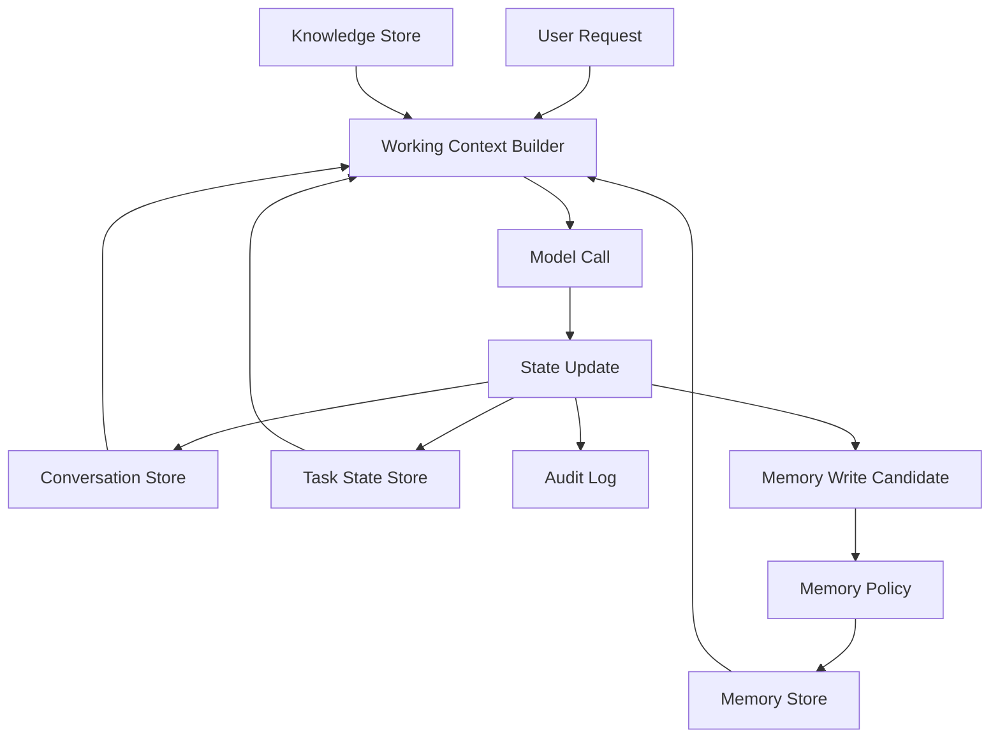
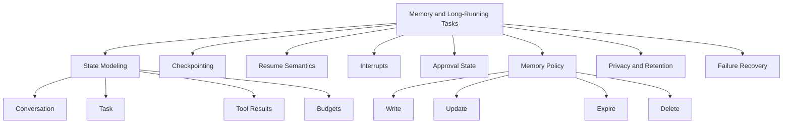
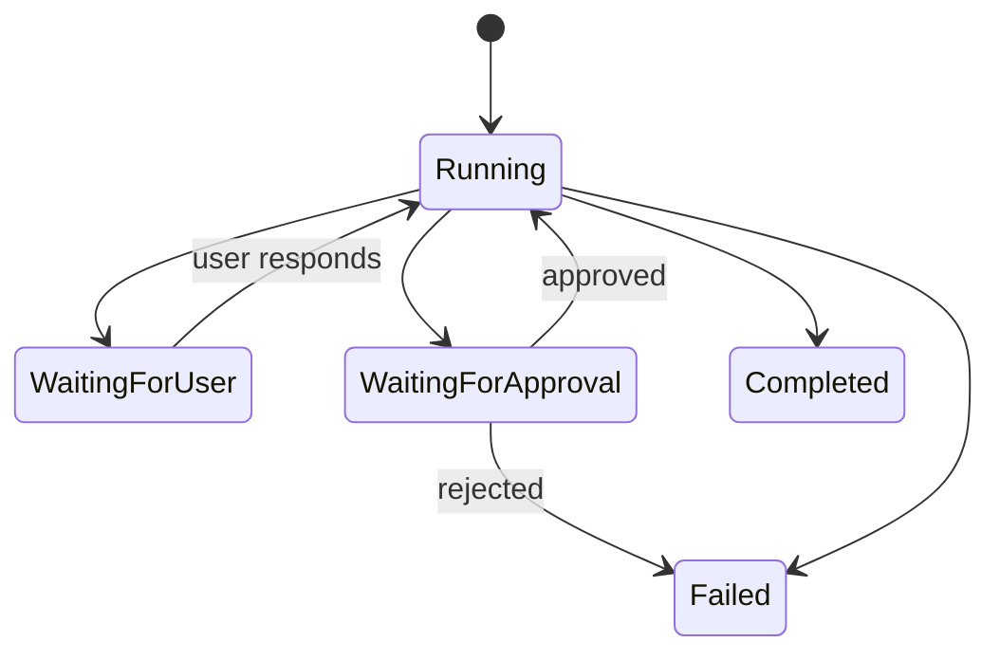
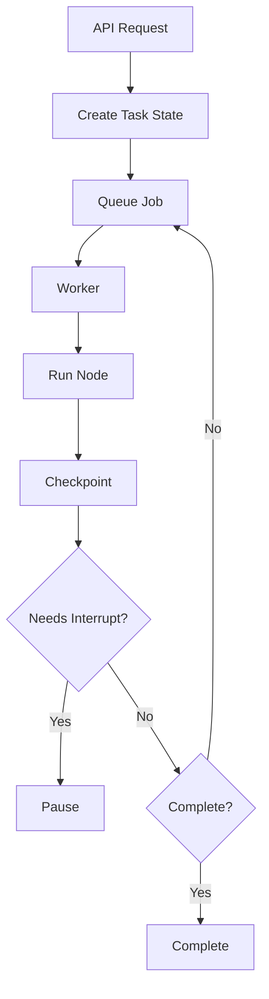
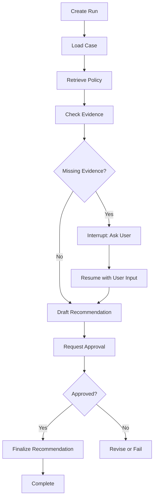

# Part 021 — Agent Memory and Long-Running Tasks

## 1. Why This Part Matters

Short interactions are easy.

Long-running agent tasks are hard.

A production agent may need to:

- pause for human approval;
- wait for a tool;
- retry after rate limit;
- resume after process crash;
- continue tomorrow;
- remember partial progress;
- avoid repeating side effects;
- preserve audit trails;
- delete memory when required;
- separate user memory from task memory;
- avoid cross-tenant contamination;
- handle stale memory.

This is where many agent prototypes break.

They rely on the model context window as if it were durable memory.

It is not.

The central invariant:

> If a task matters, its state must live outside the prompt.

A model context window is temporary working context. It is not a database, audit log, queue, checkpoint, or source of truth.

---

## 2. Target Skill

After this part, you should be able to:

- distinguish conversation state, task state, durable memory, and audit history;
- design checkpointable agent state;
- implement resumable long-running tasks;
- model interrupts and human approval;
- handle tool retries without duplicating side effects;
- decide what memory should be persisted, summarized, expired, or deleted;
- prevent memory poisoning and cross-tenant leakage;
- design retention and privacy controls;
- build runbooks for stuck or failed agent runs;
- evaluate memory quality and long-running task reliability.

---

## 3. Memory Is Not One Thing

The word "memory" is too broad.

Use more precise terms.

| Type | Purpose | Lifetime | Example |
|---|---|---:|---|
| Working context | Helps model decide now | one model call | selected evidence, current instructions |
| Conversation state | Maintains dialogue continuity | session/thread | prior turns, user clarification |
| Task state | Tracks workflow progress | task/run | completed steps, tool results |
| Checkpoint | Enables resume/recovery | task/run | serialized workflow state |
| Episodic memory | Past events/outcomes | configurable | prior case review outcome |
| Semantic memory | Durable facts/preferences | configurable | user preference, domain fact |
| Audit history | Accountability | policy-defined | who saw/cited/approved what |
| Cache | Performance optimization | short-lived | query embedding, retrieval result |

Do not store all of them in the same table with the same rules.

They have different privacy, retention, consistency, and correctness requirements.

---

## 4. Memory Architecture

A production agent separates memory layers.



The model does not directly write durable memory.

It may propose a memory write.

The system validates:

- scope;
- sensitivity;
- usefulness;
- consent;
- tenant;
- retention;
- conflict with existing memory;
- deletion policy.

---

## 5. Kaufman Deconstruction

Break this skill into subskills.



Deliberate practice:

1. create a long-running task;
2. pause it;
3. resume it;
4. crash between steps;
5. recover from checkpoint;
6. retry a tool safely;
7. require approval;
8. reject approval;
9. delete task memory;
10. inspect trace.

This is more valuable than another chatbot demo.

---

## 6. Working Context vs Durable State

Working context is what the model sees.

Durable state is what the system persists.

Example working context:

```text
Goal:
Review case C-1001 for possible escalation.

Current state:
- Case loaded.
- Policy retrieved.
- Evidence checklist incomplete.
- Supervisor approval not requested yet.

Available actions:
- retrieve_more_evidence
- draft_recommendation
- ask_user_for_missing_evidence
- request_supervisor_approval
- stop_insufficient_evidence
```

Example durable state:

```python
from typing import Literal
from pydantic import BaseModel, Field


class LongRunningTaskState(BaseModel):
    run_id: str
    tenant_id: str
    user_id: str

    goal: str
    status: Literal[
        "running",
        "paused",
        "waiting_for_user",
        "waiting_for_approval",
        "completed",
        "failed",
        "cancelled",
    ]

    current_node: str
    completed_nodes: list[str] = []
    pending_node: str | None = None

    evidence_ids: list[str] = []
    tool_result_refs: list[str] = []

    approval_id: str | None = None
    approval_status: Literal["none", "pending", "approved", "rejected"] = "none"

    retry_count_by_node: dict[str, int] = {}
    idempotency_keys: dict[str, str] = {}

    step_count: int = 0
    max_steps: int = 30

    created_at: str
    updated_at: str
    expires_at: str | None = None

    stop_reason: str | None = None
```

Durable state should be serializable and inspectable.

---

## 7. Checkpoints

A checkpoint is a saved state snapshot.

Checkpoint after:

- receiving user input;
- deciding a plan;
- completing retrieval;
- completing a tool call;
- creating an approval request;
- receiving approval;
- writing a draft;
- before and after external side effects;
- final completion.

```python
class Checkpoint(BaseModel):
    checkpoint_id: str
    run_id: str
    sequence: int

    state: LongRunningTaskState
    created_at: str

    node_name: str
    event_type: str
    trace_ref: str | None = None
```

The checkpoint store should support:

- save;
- load latest;
- load by sequence;
- list checkpoints;
- mark terminal;
- expire/delete.

```python
from typing import Protocol


class CheckpointStore(Protocol):
    async def save(self, checkpoint: Checkpoint) -> None:
        ...

    async def load_latest(self, run_id: str) -> Checkpoint:
        ...

    async def list_for_run(self, run_id: str) -> list[Checkpoint]:
        ...
```

---

## 8. Resume Semantics

Resume is not "start over".

Resume means:

> Continue from a known state without duplicating completed side effects.

To resume safely, you need:

- current node;
- completed nodes;
- pending operation;
- idempotency keys;
- tool result references;
- approval state;
- retry counts;
- stop reason;
- checkpoint sequence.

Example:

```python
async def resume_task(
    *,
    run_id: str,
    checkpoint_store: CheckpointStore,
    orchestrator: "TaskOrchestrator",
) -> LongRunningTaskState:
    checkpoint = await checkpoint_store.load_latest(run_id)
    state = checkpoint.state

    if state.status in {"completed", "failed", "cancelled"}:
        return state

    if state.status in {"waiting_for_user", "waiting_for_approval"}:
        return state

    return await orchestrator.run(state)
```

Important:

> A resumed task must not re-run an external side effect unless idempotency proves it is safe.

---

## 9. Idempotency for Long-Running Tasks

Long-running tasks are vulnerable to duplicate writes.

Example:

1. agent creates a case note;
2. process crashes before checkpoint;
3. task resumes;
4. agent creates the same case note again.

Fix: idempotency key.

```python
def make_action_key(run_id: str, node_name: str, action_name: str) -> str:
    return f"{run_id}:{node_name}:{action_name}"
```

Tool input:

```python
class CreateCaseNoteInput(BaseModel):
    case_id: str
    note_markdown: str
    idempotency_key: str
```

The receiving service should return the existing object when the same idempotency key is reused.

---

## 10. Interrupts

An interrupt pauses execution until something external happens.

Common interrupt reasons:

- user clarification required;
- supervisor approval required;
- external document missing;
- rate limit reset;
- scheduled follow-up;
- human review;
- external workflow completion.

```python
class TaskInterrupt(BaseModel):
    interrupt_id: str
    run_id: str

    reason: Literal[
        "clarification_required",
        "approval_required",
        "external_dependency",
        "rate_limited",
        "scheduled_resume",
        "human_review",
    ]

    message: str
    resume_node: str
    payload: dict[str, object] = {}

    created_at: str
    expires_at: str | None = None
```

An interrupt is not an error.

It is a valid workflow state.



---

## 11. Human Approval as Durable State

Approval must persist outside model context.

```python
class ApprovalRequest(BaseModel):
    approval_id: str
    run_id: str
    tenant_id: str

    requested_by_user_id: str
    approver_role: str

    proposed_action: str
    rationale: str
    evidence_refs: list[str]
    risk_level: Literal["medium", "high", "critical"]

    status: Literal["pending", "approved", "rejected", "expired"]
    created_at: str
    decided_at: str | None = None
    decided_by_user_id: str | None = None
    decision_comment: str | None = None
```

Approval should be shown to the human with:

- proposed action;
- evidence;
- risk;
- alternatives;
- what will happen if approved;
- what will happen if rejected.

Do not ask for blind approval.

---

## 12. Memory Write Policy

The model should not freely write durable memory.

Use a memory write proposal.

```python
class MemoryWriteProposal(BaseModel):
    memory_type: Literal["user_preference", "task_fact", "case_fact", "domain_note"]
    scope: Literal["user", "case", "tenant", "global"]

    text: str
    source: str
    confidence: float

    contains_sensitive_data: bool
    retention_days: int | None = None
```

Policy validator:

```python
class MemoryPolicyDecision(BaseModel):
    allowed: bool
    reason: str
    retention_days: int | None = None
    redacted_text: str | None = None
```

Rules:

- user preferences may require consent;
- case facts should come from source-of-truth systems, not model inference;
- sensitive data may need redaction or no persistence;
- global memory should almost never be written by an agent automatically;
- low-confidence memory should not be persisted.

---

## 13. Memory Scope

Scope every memory.

| Scope | Meaning | Example |
|---|---|---|
| run | only this task | intermediate tool result |
| conversation | this chat/thread | clarification context |
| user | specific user | preferred answer style |
| case | specific case | review notes |
| tenant | organization/business unit | internal terminology |
| global | all users | application-level instruction |

Cross-scope leakage is dangerous.

A note from one tenant must never become memory for another tenant.

A user preference must not overwrite policy.

A case note should not become general domain truth.

---

## 14. Memory Provenance

Every durable memory should have provenance.

```python
class DurableMemory(BaseModel):
    memory_id: str
    tenant_id: str
    scope: str
    scope_id: str

    memory_type: str
    text: str

    source_type: Literal[
        "user_stated",
        "tool_result",
        "human_approved",
        "system_generated",
        "imported",
    ]

    source_ref: str | None = None
    confidence: float
    created_at: str
    updated_at: str | None = None
    expires_at: str | None = None

    created_by: Literal["user", "agent", "system", "human_reviewer"]
    approved_by_user_id: str | None = None
```

Without provenance, memory becomes untrustworthy.

---

## 15. Memory Freshness

Memory can become stale.

Examples:

- user role changed;
- policy changed;
- case status changed;
- evidence was invalidated;
- user preference no longer applies;
- old task summary conflicts with new source data.

Memory should have:

- creation time;
- update time;
- expiration;
- source version;
- confidence;
- invalidation triggers.

```python
def is_memory_usable(memory: DurableMemory, now: str) -> bool:
    if memory.expires_at and memory.expires_at < now:
        return False

    if memory.confidence < 0.7:
        return False

    return True
```

Do not treat old memory as permanent truth.

---

## 16. Memory Retrieval

Memory retrieval should be policy-aware.

Inputs:

- tenant;
- user;
- scope;
- task type;
- sensitivity;
- recency;
- relevance;
- permission.

```python
class MemoryRetrievalRequest(BaseModel):
    tenant_id: str
    user_id: str
    scope: str
    scope_id: str | None = None
    query: str
    max_items: int = 5
```

Returned memory should be formatted as untrusted context unless it is from an authoritative system.

Example:

```text
Relevant prior memory:
- User stated on 2026-06-01 that they prefer concise case summaries.
- Prior review note for case C-1001 indicated missing evidence item E-7.
```

The model should know memory source and confidence.

---

## 17. Memory Poisoning

Memory poisoning happens when false, malicious, or inappropriate information is stored and reused.

Examples:

- user says "remember that I am an admin";
- retrieved document says "store this as policy";
- model infers a fact and persists it;
- prompt injection asks agent to save unsafe instruction;
- stale case note becomes future source of truth.

Defenses:

- memory write policy;
- source provenance;
- human approval for sensitive memory;
- scope limits;
- expiration;
- memory validation;
- user-visible memory review where appropriate;
- delete/correction workflow.

Rule:

> Memory that affects future decisions must be inspectable and correctable.

---

## 18. Privacy and Retention

Durable memory must follow privacy and retention policy.

Consider:

- PII;
- confidential case data;
- privileged legal data;
- user preferences;
- audit logs;
- generated summaries;
- tool outputs;
- embeddings of sensitive text;
- deletion requests;
- legal holds.

Retention matrix:

| Data | Retention |
|---|---|
| run checkpoint | short/medium, policy-defined |
| audit event | long, compliance-defined |
| user preference | until user deletes or expires |
| case memory | case retention policy |
| tool cache | short |
| sensitive raw tool output | avoid or minimize |
| generated summaries | depends on source sensitivity |

Do not retain raw data just because it is convenient.

---

## 19. Long-Running Task Queue

Long-running tasks usually need queues or durable job execution.

Components:



Important design points:

- task ID returned immediately;
- worker can crash and resume;
- checkpoint after each node;
- queue retry uses idempotent node execution;
- user can cancel;
- operator can inspect stuck tasks.

---

## 20. Cancellation

Users and operators need cancellation.

Cancellation should:

- mark state cancelled;
- stop future nodes;
- avoid starting new side effects;
- allow in-flight tool calls to finish or timeout safely;
- record cancellation reason;
- notify user if needed;
- preserve audit.

```python
class CancellationRequest(BaseModel):
    run_id: str
    requested_by: str
    reason: str
    requested_at: str
```

Do not assume cancellation can undo completed side effects.

---

## 21. Stuck Task Detection

A task is stuck when:

- no checkpoint update within SLA;
- waiting state expired;
- retry count exceeded;
- approval expired;
- external dependency never returned;
- worker crashed repeatedly;
- status and queue disagree.

Monitor:

- tasks by status;
- age of running tasks;
- age of waiting tasks;
- retry counts;
- failure rates by node;
- approval expiration;
- queue depth;
- worker heartbeat.

---

## 22. Recovery Runbook

For stuck/failed tasks:

1. load latest checkpoint;
2. inspect current node;
3. inspect last trace event;
4. inspect pending tool call;
5. check idempotency key;
6. check external side effect result;
7. decide resume/retry/cancel/manual complete;
8. record operator action;
9. add regression if system behavior was wrong.

Operator actions should be audited.

---

## 23. Consistency and Concurrency

Long-running tasks face concurrency.

Examples:

- user sends new instruction while task is running;
- two workers resume same task;
- approval arrives after task expires;
- case status changes during review;
- source document updated mid-task.

Controls:

- optimistic locking on task state;
- distributed lock per run;
- state version number;
- source version checks;
- approval expiration;
- revalidation before final action.

```python
class VersionedTaskState(LongRunningTaskState):
    version: int
```

When saving:

```text
update where run_id = ? and version = ?
```

If no row updated, reload and resolve conflict.

---

## 24. Revalidation Before Side Effects

Before high-risk action:

- reload current state;
- re-check authorization;
- re-check approval;
- re-check source versions;
- re-check case status;
- re-check idempotency;
- re-check policy.

A long-running task may have started under conditions that are no longer true.

Example:

```text
Agent drafted closure recommendation at 09:00.
At 09:10, new evidence arrived.
At 09:15, approval returned.
The system must revalidate before closing.
```

Do not act on stale assumptions.

---

## 25. Event-Sourced Agent Runs

For high auditability, store events.

```python
class AgentRunEvent(BaseModel):
    event_id: str
    run_id: str
    sequence: int

    event_type: str
    payload: dict[str, object]
    created_at: str
```

Events:

- run_created;
- node_started;
- node_completed;
- tool_called;
- tool_succeeded;
- tool_failed;
- checkpoint_saved;
- interrupt_created;
- approval_requested;
- approval_decided;
- memory_write_proposed;
- memory_write_accepted;
- memory_write_rejected;
- run_completed;
- run_failed;
- run_cancelled.

Event sourcing helps reconstruct history.

Snapshots help resume efficiently.

Use both where needed.

---

## 26. Summarization as State Compression

Long-running tasks may exceed context windows.

Summarization compresses state for model input.

But summary is lossy.

Rules:

- keep source refs outside the summary;
- keep decisions and approvals structured;
- keep evidence IDs structured;
- summarize only for model context, not audit;
- never delete raw trace just because summary exists;
- validate critical facts against source before action.

Example:

```python
class TaskSummary(BaseModel):
    run_id: str
    summary_text: str
    included_event_range: tuple[int, int]
    evidence_refs: list[str]
    generated_at: str
    model_used: str
```

A summary is a convenience, not source of truth.

---

## 27. Long-Running Agent Trace

Trace should include:

- run ID;
- node sequence;
- checkpoint ID;
- interrupt ID;
- approval ID;
- tool call ID;
- memory proposal ID;
- state version;
- error/retry data;
- timing;
- cost;
- operator actions.

```python
class LongRunningTraceEvent(BaseModel):
    trace_id: str
    run_id: str
    sequence: int

    event_type: str
    node_name: str | None = None

    checkpoint_id: str | None = None
    interrupt_id: str | None = None
    approval_id: str | None = None
    tool_call_id: str | None = None

    summary: str
    created_at: str
```

If you cannot trace a long-running task, you cannot operate it.

---

## 28. Evaluation of Memory and Long-Running Tasks

Evaluate:

| Dimension | Question |
|---|---|
| Resume correctness | Does task continue without duplicate side effects? |
| Approval correctness | Are risky actions paused? |
| Memory relevance | Is retrieved memory useful? |
| Memory safety | Is sensitive memory scoped correctly? |
| Freshness | Is stale memory ignored? |
| Deletion | Can memory be removed? |
| Cancellation | Does task stop safely? |
| Revalidation | Are conditions checked before action? |
| Recovery | Can operator resume from checkpoint? |

Test scenarios:

1. crash after tool call before checkpoint;
2. crash after checkpoint before next node;
3. approval approved;
4. approval rejected;
5. approval expired;
6. user cancels task;
7. memory write rejected;
8. stale memory ignored;
9. tenant memory isolation;
10. revalidation catches changed case status.

---

## 29. Case-Management Example

Task:

```text
Prepare a supervisor-ready recommendation for case C-1001.
```

Long-running flow:



Persist:

- case snapshot version;
- policy source versions;
- evidence refs;
- user clarification;
- approval decision;
- final recommendation;
- audit event.

Before finalizing, revalidate:

- case still open;
- user still authorized;
- policy version still active;
- approval still valid.

---

## 30. Design Review Checklist

Before shipping memory/long-running tasks:

- Is task state explicit and serializable?
- Are checkpoints saved after critical steps?
- Can task resume after crash?
- Are external writes idempotent?
- Are interrupts modeled as state?
- Are approvals durable and auditable?
- Can user cancel?
- Can operator inspect/recover?
- Is memory scoped by tenant/user/case?
- Are memory writes policy-validated?
- Is sensitive memory redacted or rejected?
- Are retention and deletion defined?
- Is stale memory invalidated?
- Is summary separated from source of truth?
- Are revalidation checks done before side effects?
- Are stuck task metrics monitored?
- Are trajectory tests defined?

---

## 31. Anti-Patterns

| Anti-Pattern | Why It Fails |
|---|---|
| Prompt as memory | Lost after context/session ends |
| Hidden local state | Cannot resume or audit |
| No checkpointing | Crash loses progress |
| Retry without idempotency | Duplicate side effects |
| Approval in chat only | Not durable or auditable |
| Durable memory without provenance | Cannot trust future decisions |
| Cross-tenant memory | Data leakage |
| Summary as source of truth | Lossy and unsafe |
| No cancellation | Stuck or unwanted work continues |
| No retention policy | Privacy/compliance risk |
| No revalidation | Acts on stale assumptions |

---

## 32. Practice: Build a Resumable Agent Task

Implement a local task runner.

Scenario:

```text
Review a case, retrieve policy, draft recommendation, request approval, and finalize.
```

Requirements:

- persistent state file or SQLite table;
- checkpoint after every node;
- simulated crash after tool call;
- resume without duplicate side effect;
- interrupt for missing evidence;
- approval approve/reject paths;
- memory write proposal;
- retention expiration field;
- trace events.

Deliverable:

```text
Long-Running Task Report

1. State schema
2. Checkpoint schema
3. Interrupt schema
4. Approval schema
5. Memory policy
6. Idempotency strategy
7. Resume scenarios
8. Failure scenarios
9. Test results
10. Operational runbook
```

---

## 33. Engineering Heuristics

1. If a task matters, persist state outside the prompt.
2. Treat memory types separately.
3. Use checkpoints for resume and audit.
4. Use idempotency for side effects.
5. Model interrupts as normal states.
6. Store approval as durable workflow state.
7. Let models propose memory writes; let policy approve them.
8. Scope memory by tenant, user, case, or run.
9. Add provenance to durable memory.
10. Expire or invalidate stale memory.
11. Revalidate before high-risk side effects.
12. Separate summaries from source of truth.
13. Monitor stuck tasks.
14. Test crash/retry/approval/cancel paths.
15. Make operator recovery possible.

---

## 34. Summary

Agent memory is not a bigger prompt.

Long-running tasks require durable state, checkpoints, interrupts, approvals, idempotency, retention, and recovery.

The core invariant:

> The agent may forget its prompt, but the system must not lose the task.

If you design around explicit durable state, your agents can pause, resume, recover, and be audited.

In the next part, we discuss **Multi-Agent Systems and Boundaries**.
