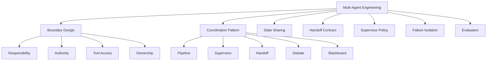
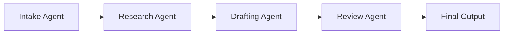
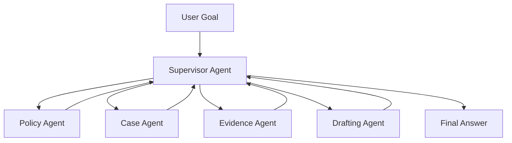
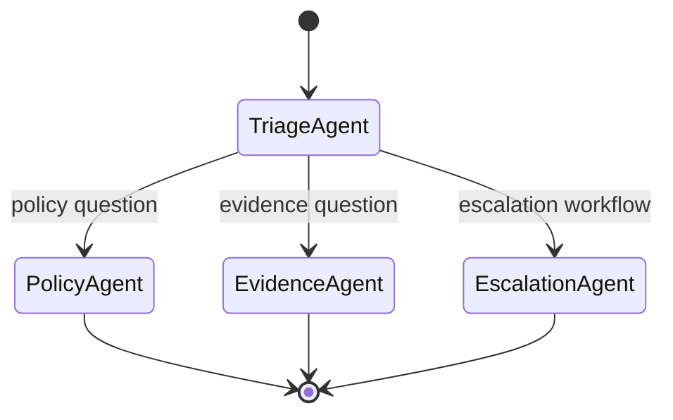
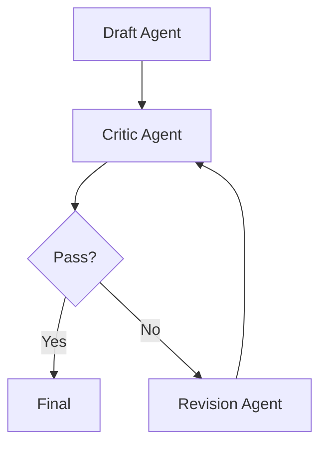
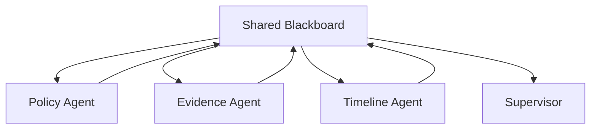
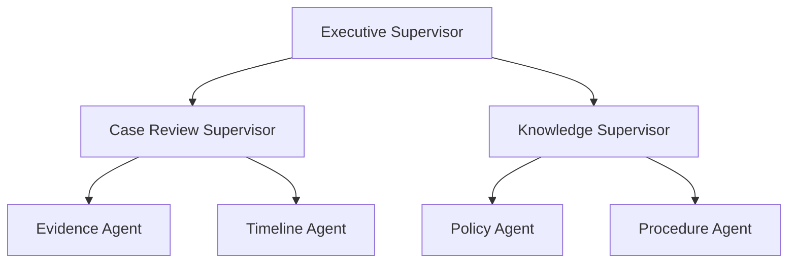
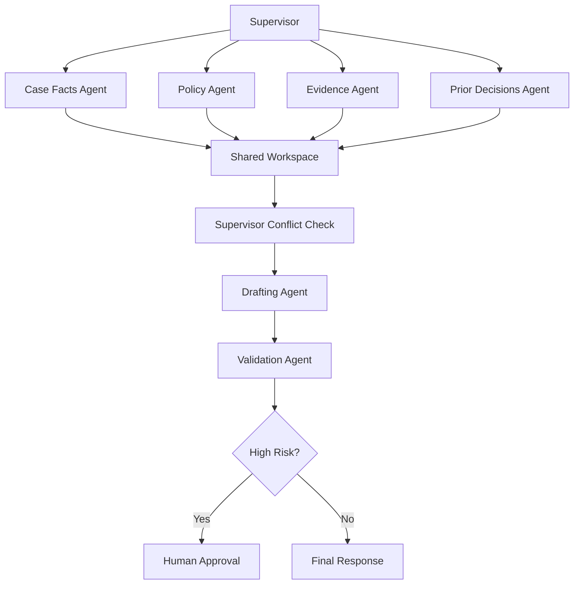

# Part 022 — Multi-Agent Systems and Boundaries

## 1. Why This Part Matters

Multi-agent systems are attractive.

They sound like teams of AI specialists collaborating:

- planner agent;
- researcher agent;
- critic agent;
- coder agent;
- policy agent;
- compliance agent;
- supervisor agent.

Sometimes this is useful.

Often it is over-engineering.

Multiple agents introduce coordination cost:

- more prompts;
- more state;
- more latency;
- more handoff failures;
- more inconsistent assumptions;
- more evaluation complexity;
- more security boundaries;
- more places for hallucination;
- more difficult debugging.

The central question is not:

> Can we use multiple agents?

The better question is:

> What boundary requires a separate agent rather than a node, tool, prompt, or deterministic function?

This part is about that boundary.

---

## 2. Target Skill

After this part, you should be able to:

- decide when multi-agent architecture is justified;
- distinguish agent, node, tool, role, and workflow;
- design supervisor, handoff, debate, pipeline, and team patterns;
- define agent responsibilities and authority boundaries;
- prevent coordination loops and role confusion;
- manage shared state and communication;
- evaluate multi-agent trajectories;
- design failure isolation;
- avoid multi-agent anti-patterns;
- apply multi-agent thinking to enterprise case-management systems.

---

## 3. Start With One Agent

Default position:

> Use one constrained agent or workflow first.

Move to multi-agent only when one of these is true:

1. responsibilities are genuinely different;
2. tools/permissions differ significantly;
3. context windows are overloaded;
4. tasks can run independently;
5. domain expertise differs;
6. teams own capabilities separately;
7. failure isolation matters;
8. handoff mirrors real business process;
9. evaluation is clearer with separated roles.

Do not create agents just to make prompts shorter.

A workflow node may be enough.

A tool may be enough.

A deterministic function may be better.

---

## 4. Agent vs Node vs Tool vs Role

| Concept | Use When | Example |
|---|---|---|
| Tool | Single capability | `search_policy` |
| Node | Step in workflow | `evaluate_evidence` |
| Role prompt | Same agent behaves with a frame | "act as reviewer" |
| Agent | Autonomous bounded worker with state/tools | policy analyst agent |
| Workflow | Orchestrated process | case review process |
| Multi-agent system | Multiple bounded agents coordinate | supervisor + policy + evidence agents |

If the component has no independent state, tools, policy, or lifecycle, it may not need to be an agent.

---

## 5. Kaufman Deconstruction

Break multi-agent engineering into subskills.



Practice loop:

1. implement single-agent workflow;
2. identify one painful boundary;
3. split only that boundary into a specialist agent;
4. define handoff contract;
5. trace both agents;
6. evaluate if quality improved enough to justify cost.

---

## 6. Multi-Agent Architecture Patterns

### 6.1 Pipeline Pattern

Agents run in sequence.



Use when:

- stages are sequential;
- each stage has different evaluation criteria;
- output of one stage feeds another;
- process resembles an assembly line.

Risks:

- upstream errors propagate;
- latency adds up;
- agents may reinterpret prior output incorrectly.

---

### 6.2 Supervisor Pattern

A supervisor routes tasks to specialist agents.



Use when:

- task type varies;
- specialists have different tools;
- supervisor can control communication;
- central trace and policy are needed.

Risks:

- supervisor becomes bottleneck;
- poor routing causes failures;
- too many round trips;
- specialist outputs may conflict.

---

### 6.3 Handoff Pattern

One agent transfers control to another.



Use when:

- user intent belongs to a specialist;
- one agent should take over conversation/task;
- domain boundaries are clear.

Handoff contract must specify:

- task summary;
- relevant history;
- state;
- permissions;
- allowed tools;
- expected output;
- return condition.

---

### 6.4 Debate / Critic Pattern

Agents critique or challenge each other.



Use when:

- output quality matters;
- independent review catches errors;
- criteria are explicit.

Risks:

- performative criticism;
- longer latency;
- false confidence;
- endless revisions;
- critic hallucination.

Use strict max iterations.

---

### 6.5 Blackboard Pattern

Agents read/write shared workspace.



Use when:

- multiple specialists contribute partial findings;
- results should be accumulated;
- task is exploratory.

Risks:

- conflicting writes;
- stale assumptions;
- no ownership;
- memory poisoning;
- hard debugging.

Use structured blackboard entries with provenance.

---

### 6.6 Hierarchical Pattern

Agents are organized in levels.



Use only for complex systems.

Hierarchy increases coordination overhead.

It should map to real decomposition, not aesthetics.

---

## 7. Boundary Design

A separate agent is justified when it has a distinct boundary.

Boundary dimensions:

| Boundary | Example |
|---|---|
| Domain | policy vs evidence vs case facts |
| Tool access | read-only search vs case update |
| Permission | legal-only vs analyst |
| Context | large independent context |
| Lifecycle | long-running subtask |
| Evaluation | different success metric |
| Ownership | different team owns capability |
| Risk | high-risk review isolated |
| Interaction mode | user-facing vs internal |

If none of these differ, use a node or prompt.

---

## 8. Agent Contract

Each agent should have a contract.

```python
from typing import Literal
from pydantic import BaseModel


class AgentContract(BaseModel):
    name: str
    version: str
    purpose: str

    input_schema: dict[str, object]
    output_schema: dict[str, object]

    allowed_tools: list[str]
    required_roles: list[str]

    memory_scope: Literal["none", "run", "conversation", "case", "user", "tenant"]
    side_effect_level: Literal["none", "read", "internal_write", "external_write", "destructive"]

    can_handoff_to: list[str] = []
    requires_supervisor: bool = True

    max_steps: int
    timeout_seconds: int
```

No agent should have undefined authority.

---

## 9. Handoff Contract

Handoffs are where multi-agent systems often fail.

A handoff should include:

- reason for handoff;
- current goal;
- task summary;
- relevant evidence;
- user constraints;
- completed steps;
- pending questions;
- permissions;
- expected output;
- return condition.

```python
class AgentHandoff(BaseModel):
    handoff_id: str
    from_agent: str
    to_agent: str

    reason: str
    task: str

    state_summary: str
    evidence_refs: list[str]
    constraints: list[str]

    expected_output_schema: dict[str, object]
    return_to: str | None = None

    created_at: str
```

Bad handoff:

```text
Can you handle this?
```

Good handoff:

```text
Task: Determine whether the current case meets escalation criteria.
Evidence: case_summary_v3, policy_chunks E1-E4.
Constraints: Use active policy only. Do not update case status.
Return: structured escalation assessment with citations.
```

---

## 10. Supervisor Responsibilities

A supervisor agent or router should:

- classify task;
- select specialist;
- pass constrained context;
- enforce tool availability;
- merge specialist outputs;
- detect conflicts;
- stop loops;
- request human approval;
- produce final answer or workflow transition.

The supervisor should not do everything.

If the supervisor becomes the only capable component, the specialist split is useless.

---

## 11. Deterministic Supervisor vs Model Supervisor

### Deterministic Supervisor

Use rules.

Pros:

- predictable;
- auditable;
- easier to test;
- safer.

Cons:

- less flexible;
- requires explicit routing logic.

### Model Supervisor

Model chooses specialist.

Pros:

- flexible;
- handles ambiguous tasks;
- easier initial implementation.

Cons:

- routing errors;
- harder to verify;
- may loop;
- may over-delegate.

Recommended pattern:

> Deterministic supervisor for high-risk routing; model-assisted routing for low-risk ambiguous tasks, validated by transition guards.

---

## 12. Shared State

Multi-agent systems need shared state, but not unrestricted shared state.

```python
class SharedWorkspaceEntry(BaseModel):
    entry_id: str
    run_id: str

    author_agent: str
    entry_type: Literal[
        "finding",
        "evidence",
        "assumption",
        "question",
        "decision",
        "risk",
        "draft",
    ]

    content: str
    evidence_refs: list[str] = []
    confidence: float | None = None

    created_at: str
    superseded_by: str | None = None
```

Rules:

- every entry has author;
- every finding has provenance;
- assumptions are marked as assumptions;
- decisions are separated from findings;
- entries can be superseded;
- high-risk decisions require approval.

---

## 13. Communication Topologies

### 13.1 Centralized

All communication goes through supervisor.

Pros:

- controllable;
- traceable;
- easier policy enforcement.

Cons:

- bottleneck;
- more round trips.

### 13.2 Peer-to-Peer

Agents communicate directly.

Pros:

- flexible;
- potentially faster.

Cons:

- hard to trace;
- harder security;
- loops;
- inconsistent state.

### 13.3 Blackboard

Agents write to shared workspace.

Pros:

- good for collaborative findings;
- decoupled.

Cons:

- conflict management needed.

For enterprise systems, prefer centralized or blackboard with strict governance.

Avoid unconstrained peer-to-peer agent chatter.

---

## 14. Tool Access Per Agent

Different agents should have different tools.

Example:

| Agent | Tools |
|---|---|
| Policy Agent | `search_policy`, `get_policy_version` |
| Case Agent | `get_case_summary`, `list_case_events` |
| Evidence Agent | `list_evidence`, `summarize_evidence` |
| Drafting Agent | `draft_recommendation` |
| Supervisor | routing, approval request |
| Action Agent | high-risk workflow tools with approval |

Tool separation limits blast radius.

A policy agent does not need to update case status.

An evidence agent does not need to send external notices.

---

## 15. Failure Isolation

A specialist failure should not corrupt the whole run.

Failure isolation strategy:

- agent-specific timeouts;
- bounded retries;
- partial result support;
- fallback specialist;
- supervisor-level error handling;
- confidence propagation;
- no direct side effects from low-trust agents;
- trace per agent.

```python
class AgentResult(BaseModel):
    agent_name: str
    status: Literal["success", "insufficient", "failed", "unsafe"]
    output: dict[str, object] | None = None
    confidence: float | None = None
    errors: list[str] = []
```

The supervisor can decide:

- proceed with partial result;
- ask clarification;
- retry;
- hand off to human;
- fail safely.

---

## 16. Conflict Resolution

Specialists may disagree.

Example:

- Policy Agent says escalation required.
- Case Agent says case status already closed.
- Evidence Agent says key evidence missing.

Conflict handling:

1. identify conflict;
2. compare source authority;
3. inspect timestamps;
4. retrieve more evidence;
5. ask human;
6. avoid unsupported final answer.

```python
class AgentConflict(BaseModel):
    conflict_id: str
    agents_involved: list[str]
    description: str
    evidence_refs: list[str]
    resolution_status: Literal["unresolved", "resolved", "escalated"]
```

Do not let the final agent silently average conflicting findings.

---

## 17. Multi-Agent Trace

Trace must include:

- agent invocation;
- handoff;
- input summary;
- output summary;
- tool calls;
- state changes;
- confidence;
- errors;
- supervisor decisions.

```python
class MultiAgentTraceEvent(BaseModel):
    trace_id: str
    run_id: str
    sequence: int

    event_type: Literal[
        "agent_invoked",
        "agent_completed",
        "agent_failed",
        "handoff",
        "supervisor_decision",
        "workspace_write",
        "conflict_detected",
    ]

    agent_name: str | None = None
    from_agent: str | None = None
    to_agent: str | None = None

    summary: str
    refs: list[str] = []
```

Without trace, multi-agent systems become impossible to debug.

---

## 18. Evaluation

Evaluate at multiple levels.

| Level | Question |
|---|---|
| Agent-level | Did specialist do its job? |
| Handoff-level | Was delegation correct? |
| Supervisor-level | Was routing correct? |
| Team-level | Did final result improve? |
| Safety-level | Did any agent exceed authority? |
| Cost-level | Was extra coordination worth it? |
| Latency-level | Did multi-agent overhead hurt UX? |

Example:

```python
class MultiAgentEval(BaseModel):
    scenario_id: str
    run_id: str

    correct_specialists_called: bool
    unnecessary_agent_calls: int
    handoff_errors: int
    unresolved_conflicts: int
    unsafe_tool_proposals: int

    final_answer_supported: bool
    completed: bool

    latency_ms: int
    cost_estimate: float
```

Compare against a single-agent baseline.

A multi-agent system must justify its overhead.

---

## 19. Cost of Coordination

Multi-agent overhead includes:

- more model calls;
- more context rendering;
- more traces;
- more validation;
- more routing decisions;
- more failure modes;
- more latency;
- more eval scenarios.

Before adopting multi-agent, estimate:

```text
single_agent_cost_per_task
multi_agent_cost_per_task
quality_delta
latency_delta
failure_delta
operational_complexity_delta
```

If quality does not improve enough, keep the simpler design.

---

## 20. Multi-Agent Anti-Patterns

| Anti-Pattern | Why It Fails |
|---|---|
| Agent for every noun | Too much coordination |
| Agents with overlapping authority | Conflicting actions |
| No supervisor | Loops and chaos |
| Peer-to-peer free chat | Untraceable behavior |
| Shared memory without schema | Memory poisoning |
| No handoff contract | Lost context |
| Same tools for every agent | No blast-radius reduction |
| Final answer by uninformed agent | Evidence loss |
| Debate without rubric | Performative disagreement |
| No single-agent baseline | Cannot justify complexity |
| No per-agent eval | Failures hidden |
| No conflict handling | Merged contradictions |

---

## 21. Case-Management Multi-Agent Design

A reasonable architecture:



Agent roles:

### 21.1 Case Facts Agent

Purpose:

- load case snapshot;
- extract current status;
- identify parties;
- list relevant events;
- detect deadlines.

Tools:

- `get_case_summary`
- `list_case_events`

No authority to update case.

### 21.2 Policy Agent

Purpose:

- retrieve governing policy;
- identify criteria;
- cite active clauses;
- detect superseded policies.

Tools:

- `search_policy`
- `get_policy_version`

No authority over case data.

### 21.3 Evidence Agent

Purpose:

- inspect evidence checklist;
- summarize evidence;
- identify missing required evidence.

Tools:

- `list_case_evidence`
- `summarize_evidence`

No authority to delete evidence.

### 21.4 Prior Decisions Agent

Purpose:

- find similar cases;
- summarize patterns;
- cite prior decisions where allowed.

Tools:

- `search_prior_decisions`

No authority to treat prior decisions as binding unless policy says so.

### 21.5 Drafting Agent

Purpose:

- compose recommendation from workspace findings.

Tools:

- `draft_internal_recommendation`

No authority to finalize high-risk action.

### 21.6 Validation Agent

Purpose:

- check citations;
- check unsupported claims;
- check risk level;
- enforce approval requirement.

Tools:

- read-only validation tools.

This is bounded multi-agent architecture.

---

## 22. When Multi-Agent Helps in Case Management

Use multi-agent when:

- policy and case facts require separate source authority;
- evidence review is large enough to be independent;
- prior decisions require different retrieval/eval;
- different teams own different capabilities;
- high-risk validation needs separation from drafting;
- audit benefits from named specialist findings.

Avoid multi-agent when:

- task is simple lookup;
- all agents use same tools and same context;
- supervisor only adds latency;
- domain boundaries are unclear;
- final answer quality does not improve.

---

## 23. Handoff Example

```python
class EscalationAssessmentRequest(BaseModel):
    case_id: str
    case_summary_ref: str
    policy_evidence_refs: list[str]
    evidence_summary_refs: list[str]

    question: str = "Does this case meet escalation criteria?"
    constraints: list[str] = [
        "Use active policy only.",
        "Do not update case status.",
        "Return cited assessment.",
    ]


class EscalationAssessmentOutput(BaseModel):
    status: Literal["escalation_required", "not_required", "insufficient_evidence", "conflicting"]
    rationale: str
    citations: list[str]
    missing_information: list[str] = []
    confidence: Literal["low", "medium", "high"]
```

The handoff is typed.

The specialist is not asked to improvise the shape of the response.

---

## 24. Supervisor Merge Logic

When specialists return results, supervisor merges.

```python
class SupervisorDecision(BaseModel):
    final_status: Literal[
        "ready_to_answer",
        "needs_more_evidence",
        "conflict_detected",
        "requires_human_approval",
        "failed",
    ]

    selected_findings: list[str]
    conflicts: list[str] = []
    next_agent: str | None = None
    rationale: str
```

Merge rules may be deterministic:

- if policy says required and case facts match trigger -> escalation likely;
- if evidence missing -> insufficient;
- if high risk -> approval;
- if policy/case conflict -> human review.

Use model judgment only where deterministic rules cannot express the domain well.

---

## 25. Security Boundaries

Multi-agent systems must preserve security.

Rules:

1. agents inherit user/tenant context;
2. agent-specific tools are filtered by role and workflow state;
3. handoff does not expand permissions;
4. shared workspace is scoped to run/tenant/case;
5. restricted findings are not sent to lower-clearance agents;
6. all tool calls are audited;
7. supervisor cannot override authorization by prompt;
8. memory writes preserve original scope.

Handoff is not privilege escalation.

---

## 26. Multi-Agent and Human Review

Human review is often another "agent" in architecture diagrams, but it is not an AI agent.

Model it explicitly as a human approval/review node.

Human reviewer should see:

- specialist findings;
- citations;
- conflicts;
- proposed action;
- risk classification;
- dissenting opinions;
- missing evidence.

Human approval should be durable state.

---

## 27. Failure Scenario: Supervisor Loop

Symptom:

- supervisor repeatedly calls Policy Agent;
- Policy Agent returns same result;
- no progress.

Causes:

- no max loop;
- supervisor does not track completed asks;
- result not written to state;
- model does not know enough evidence exists.

Fixes:

- max calls per specialist;
- workspace entries;
- route guard;
- duplicate handoff detector;
- supervisor state summary.

---

## 28. Failure Scenario: Specialist Overreach

Symptom:

- Evidence Agent recommends closing case.

Cause:

- role boundary unclear;
- prompt allowed decision beyond evidence review;
- output schema too broad.

Fixes:

- narrow agent contract;
- output schema only allows evidence findings;
- supervisor owns final recommendation;
- validation flags overreach.

---

## 29. Failure Scenario: Context Loss on Handoff

Symptom:

- specialist asks for information already known.

Cause:

- handoff missing state summary;
- evidence refs not passed;
- conversation history too broad or too narrow.

Fixes:

- typed handoff payload;
- relevant evidence refs;
- required context checklist;
- handoff evals.

---

## 30. Failure Scenario: Conflict Hidden

Symptom:

- final answer says escalation required, but evidence was incomplete.

Cause:

- supervisor ignored Evidence Agent warning;
- workspace entry not typed;
- draft agent optimized for fluent answer.

Fixes:

- conflict/missing-info fields;
- validation agent;
- deterministic merge rule;
- high-risk human approval.

---

## 31. Multi-Agent Design Review Checklist

Before approving multi-agent architecture:

- Why is one agent insufficient?
- What is each agent's responsibility?
- What tools does each agent have?
- What tools are explicitly forbidden?
- What state can each agent read/write?
- What is the handoff schema?
- Who supervises routing?
- How are loops prevented?
- How are conflicts detected?
- How are permissions preserved?
- How are outputs validated?
- What is the single-agent baseline?
- What quality improvement is expected?
- What latency/cost overhead is acceptable?
- How are per-agent failures traced?
- How are trajectory evals defined?
- What requires human review?

---

## 32. Practice: Split a Single Agent Into Specialists

Start with the bounded case-review agent from earlier.

Baseline:

```text
One agent retrieves case, policy, evidence, drafts recommendation.
```

Split into:

1. supervisor;
2. policy agent;
3. case facts agent;
4. evidence agent;
5. validation agent.

Implement:

- agent contracts;
- handoff schemas;
- shared workspace;
- supervisor merge;
- per-agent trace;
- single-agent baseline eval;
- multi-agent eval.

Compare:

```text
Single-agent:
- accuracy:
- unsupported claims:
- latency:
- cost:
- trace clarity:

Multi-agent:
- accuracy:
- unsupported claims:
- latency:
- cost:
- trace clarity:
- coordination failures:
```

Use data to decide whether multi-agent is worth it.

---

## 33. Engineering Heuristics

1. Start with one agent or workflow.
2. Split only along real boundaries.
3. Give each agent narrow tools and authority.
4. Use typed handoff contracts.
5. Prefer supervisor-controlled communication.
6. Keep shared state structured and scoped.
7. Track findings, assumptions, decisions, and conflicts separately.
8. Evaluate against a single-agent baseline.
9. Trace every handoff and specialist output.
10. Limit loops and repeated handoffs.
11. Do not let handoff expand permissions.
12. Use validation/human review for high-risk outputs.
13. Avoid debate without rubric.
14. Treat multi-agent overhead as a cost that must be justified.
15. Keep deterministic rules where domain policy is clear.

---

## 34. Summary

Multi-agent systems are coordination architectures.

They are useful when boundaries are real:

- different domains;
- different tools;
- different permissions;
- different evaluation criteria;
- different ownership;
- different risk profiles.

They are harmful when used as decoration.

The core invariant:

> A multi-agent system should reduce complexity inside each boundary more than it increases coordination complexity between boundaries.

If that is not true, use a simpler architecture.

This closes the main agentic-systems foundation block.

In the next part, we begin the quality block with **Evaluation Foundations**.
