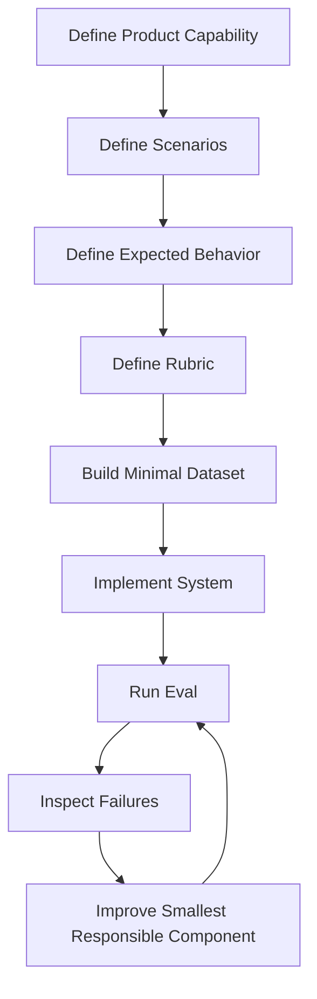
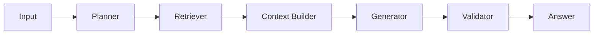
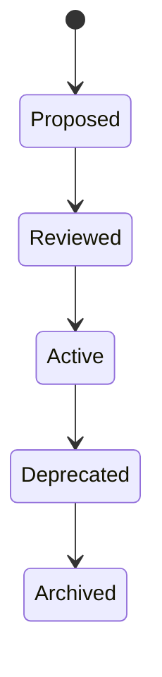
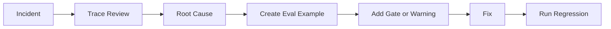
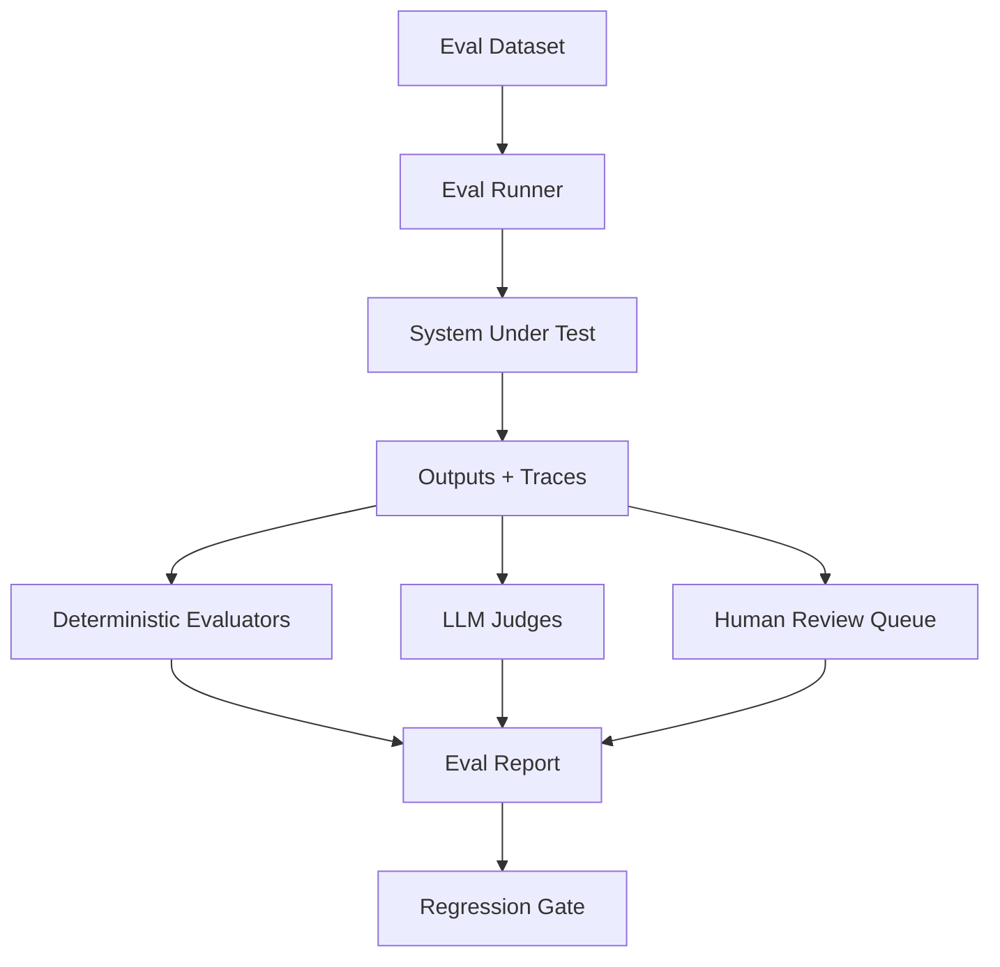

# Part 023 — Evaluation Foundations

## 1. Why This Part Matters

Traditional software engineering has tests.

AI application engineering needs tests plus evaluations.

A unit test usually answers:

> Did this deterministic function return the expected value?

An AI eval answers:

> Did this probabilistic system behave acceptably for this scenario, under this context, with this evidence, using this model/prompt/tool chain?

AI systems can fail even when the code is correct:

- the model chooses the wrong tool;
- a prompt change changes answer style;
- retrieval returns plausible but wrong evidence;
- an answer is fluent but unsupported;
- an agent loops or stops too early;
- a model upgrade improves average quality but breaks critical cases;
- a safety rule is followed in one scenario and ignored in another.

Without evaluation, you are shipping by vibes.

The central invariant:

> An AI application is not production-ready until important behavior is represented as repeatable evaluation scenarios.

---

## 2. Target Skill

After this part, you should be able to:

- distinguish tests, evals, monitoring, and human review;
- design eval datasets from real product behavior;
- create rubrics for non-deterministic outputs;
- define acceptance criteria for AI features;
- separate component evals from end-to-end evals;
- build regression gates for prompts, models, retrieval, and agents;
- calibrate LLM-as-judge and human review;
- reason about precision, recall, faithfulness, groundedness, usefulness, and safety;
- turn production failures into eval examples;
- avoid misleading aggregate metrics.

---

## 3. The Evaluation Mindset

In normal software, we often write code and then tests.

For AI applications, reverse the default:

> Define the behavior before optimizing the prompt, model, retrieval, or agent.

A practical sequence:



This is the Kaufman loop applied to AI engineering:

1. deconstruct the skill;
2. practice on small scenarios;
3. get fast feedback;
4. self-correct;
5. increase complexity deliberately.

---

## 4. Test vs Eval vs Monitor

| Mechanism | Primary Purpose | Example |
|---|---|---|
| Unit test | deterministic correctness | schema parser rejects invalid JSON |
| Contract test | interface stability | model provider returns expected envelope |
| Integration test | components work together | retrieval service can query active index |
| Eval | behavior quality | answer is grounded and useful |
| Red-team eval | adversarial behavior | prompt injection does not cause tool misuse |
| Human review | expert judgment | legal reviewer checks regulatory answer |
| Monitoring | production health | hallucination complaints spike |
| Audit | accountability | answer trace cites source and user permission |

Do not use one mechanism for everything.

A retrieval recall eval is not a security audit.

A latency monitor is not a groundedness eval.

A human reviewer is not a scalable regression gate unless sampled and structured.

---

## 5. Component Evals vs End-to-End Evals

An AI application has multiple layers.



You need evals at different levels.

| Level | Question |
|---|---|
| Planner eval | Did the system choose the right plan/query type? |
| Retrieval eval | Did it retrieve the right evidence? |
| Context eval | Did it package sufficient useful evidence? |
| Generation eval | Did it answer faithfully from evidence? |
| Citation eval | Did citations support claims? |
| Tool eval | Did it choose/call the right tool correctly? |
| Agent trajectory eval | Did the multi-step path make sense? |
| Safety eval | Did it avoid prohibited behavior? |
| E2E eval | Did the user-visible result satisfy the scenario? |

End-to-end evals are important, but they are not enough.

When E2E fails, component evals help locate the fault.

---

## 6. Eval Dataset Anatomy

A good eval example has more than input and expected output.

```python
from typing import Literal
from pydantic import BaseModel, Field


class EvalExample(BaseModel):
    example_id: str
    feature: str
    scenario: str

    user_input: str
    user_context: dict[str, object] = {}

    expected_behavior: str
    expected_status: Literal[
        "answer",
        "clarify",
        "refuse",
        "escalate",
        "insufficient_evidence",
    ]

    expected_sources: list[str] = []
    forbidden_sources: list[str] = []

    rubric: dict[str, str] = {}
    risk_level: Literal["low", "medium", "high", "critical"] = "medium"

    tags: list[str] = []
    notes: str | None = None
```

For RAG and agents, include:

- tenant;
- role;
- source permissions;
- expected evidence;
- forbidden evidence;
- tool expectations;
- approval expectations;
- trace expectations.

The richer the example, the more diagnosable the failure.

---

## 7. Scenario Design

Avoid only testing happy paths.

A production eval set should include:

1. normal success;
2. ambiguous input;
3. missing information;
4. conflicting evidence;
5. stale source;
6. unauthorized source;
7. prompt injection;
8. exact identifier lookup;
9. semantic paraphrase;
10. table lookup;
11. long context;
12. multilingual or mixed-language input where relevant;
13. tool timeout;
14. invalid tool input;
15. high-risk action requiring approval;
16. case requiring human handoff.

Scenario categories should reflect real product risk, not just model capability.

---

## 8. Golden Dataset

A golden dataset is a curated set of examples used to protect important behavior.

It should be:

- small enough to inspect;
- broad enough to represent risk;
- versioned;
- owned;
- reviewed;
- updated from production incidents;
- stable across releases unless intentionally changed.

Do not start with thousands of examples.

Start with 30-100 high-value cases.

Then grow by failure-driven additions.

### 8.1 Example Golden Dataset Structure

```text
evals/
  golden/
    rag_policy_qa.yaml
    case_review_agent.yaml
    tool_calling.yaml
    prompt_injection.yaml
  rubrics/
    grounded_answer_rubric.md
    agent_trajectory_rubric.md
  runners/
    run_rag_eval.py
    run_agent_eval.py
  reports/
    2026-06-28-baseline.json
```

Version the dataset with the application.

---

## 9. Expected Behavior Is Not Always Expected Text

For LLM apps, exact string match is usually too brittle.

Instead of:

```text
Expected output exactly equals:
"Escalation is required."
```

Use behavioral expectations:

```text
The answer must:
- state that escalation is required;
- mention repeat non-compliance within 90 days;
- cite the active escalation policy;
- cite the case event showing the second breach;
- avoid claiming final case closure authority;
- recommend supervisor review.
```

This maps better to real quality.

---

## 10. Rubrics

A rubric converts subjective quality into structured judgment.

Example grounded answer rubric:

| Criterion | Pass Condition |
|---|---|
| Relevance | Directly addresses the user question |
| Groundedness | Material claims are supported by evidence |
| Completeness | Covers required conditions/exceptions |
| Citation correctness | Citations support the claims |
| Uncertainty | States missing info or limitations |
| Safety | Avoids prohibited or unauthorized content |
| Actionability | Provides useful next step where appropriate |
| Tone | Clear, professional, not overconfident |

Rubric score:

```python
class RubricScore(BaseModel):
    relevance: int = Field(ge=1, le=5)
    groundedness: int = Field(ge=1, le=5)
    completeness: int = Field(ge=1, le=5)
    citation_correctness: int = Field(ge=1, le=5)
    safety: int = Field(ge=1, le=5)
    actionability: int = Field(ge=1, le=5)
    overall: int = Field(ge=1, le=5)
    failure_reasons: list[str] = []
```

Rubrics should include examples of pass/fail.

---

## 11. Binary, Scalar, and Categorical Evals

Different questions need different outputs.

### 11.1 Binary

```text
Did the answer cite an authorized source? yes/no
```

Good for gates.

### 11.2 Scalar

```text
Groundedness score 1-5
```

Good for trend analysis.

### 11.3 Categorical

```text
Failure type: retrieval_miss | hallucination | citation_error | unsafe_tool
```

Good for diagnosis.

### 11.4 Structured

```python
class EvalJudgment(BaseModel):
    passed: bool
    score: float
    failure_type: str | None
    rationale: str
```

Structured eval results are easier to aggregate.

---

## 12. Deterministic Evaluators

Use deterministic evaluators whenever possible.

Examples:

- JSON schema validity;
- required field exists;
- status is one of allowed enum values;
- citation IDs exist in evidence package;
- forbidden source not retrieved;
- tool name is allowed;
- approval required for high-risk tool;
- latency under threshold;
- cost under threshold.

```python
def eval_forbidden_sources(
    retrieved_source_ids: list[str],
    forbidden_source_ids: list[str],
) -> bool:
    return not set(retrieved_source_ids).intersection(forbidden_source_ids)
```

Deterministic checks are cheap, stable, and explainable.

Use model judges for what deterministic code cannot judge well.

---

## 13. LLM-as-Judge

LLM-as-judge can evaluate:

- answer relevance;
- faithfulness;
- completeness;
- helpfulness;
- rubric compliance;
- whether an answer follows evidence.

But it has risks:

- judge bias;
- inconsistency;
- prompt sensitivity;
- overconfidence;
- poor calibration;
- vulnerability to persuasive answers;
- hidden reasoning errors.

Use LLM judges as one tool, not as unquestioned truth.

### 13.1 Judge Prompt Principles

A judge prompt should include:

- task description;
- rubric;
- input;
- evidence;
- candidate answer;
- scoring schema;
- failure categories;
- examples if needed.

Require structured output.

```python
class JudgeResult(BaseModel):
    passed: bool
    score: int = Field(ge=1, le=5)
    failure_types: list[str]
    rationale: str
```

---

## 14. Human Review

Human review is needed for:

- high-risk legal/regulatory content;
- new rubric calibration;
- disputed judge results;
- production incidents;
- dataset curation;
- critical release gates;
- policy-sensitive behavior.

Human review should also be structured.

```python
class HumanReviewResult(BaseModel):
    reviewer_id: str
    example_id: str
    passed: bool
    score: int
    failure_types: list[str]
    comments: str
    reviewed_at: str
```

Free-form review comments are useful, but structured labels make improvement measurable.

---

## 15. Calibration

Calibration aligns evaluators with desired judgment.

Calibrate:

- human reviewers with examples;
- LLM judges against human labels;
- thresholds against risk;
- component metrics against product outcomes.

Questions:

- Do reviewers agree?
- Does the judge match expert labels?
- Are false passes more dangerous than false fails?
- Which examples are borderline?
- Which rubric terms are ambiguous?

For high-risk systems, prefer failing uncertain cases into human review.

---

## 16. Eval Metrics

Common metrics:

| Metric | Useful For |
|---|---|
| pass rate | release gate |
| average score | trend |
| failure type distribution | diagnosis |
| recall@k | retrieval |
| MRR/nDCG | retrieval ranking |
| citation support rate | grounded answers |
| unsupported claim rate | generation |
| tool success rate | agents/tools |
| trajectory success rate | agents |
| approval compliance rate | risk workflows |
| latency p95 | operations |
| cost per task | economics |

Metrics must be sliced.

Aggregate pass rate can hide critical failures.

---

## 17. Slicing

Slice eval results by:

- query type;
- user role;
- tenant;
- source type;
- document status;
- risk level;
- model version;
- prompt version;
- index version;
- retrieval mode;
- tool;
- agent workflow;
- language;
- jurisdiction;
- case type.

Example:

```python
class EvalSlice(BaseModel):
    name: str
    filters: dict[str, str]
    pass_rate: float
    total_examples: int
    critical_failures: int
```

A release can pass overall and still fail a critical slice.

---

## 18. Regression Gates

A regression gate blocks release if quality drops.

Examples:

- no unauthorized source retrieved;
- no high-risk approval bypass;
- groundedness pass rate >= 0.95 for critical cases;
- retrieval recall@10 >= baseline - 1%;
- citation support rate >= 0.98;
- p95 latency <= budget;
- cost per task <= budget;
- no new critical failure.

Gate policy:

```python
class RegressionGate(BaseModel):
    metric_name: str
    slice_name: str | None = None
    comparator: Literal[">=", "<=", "=="]
    threshold: float
    severity: Literal["blocker", "warning"]
```

Use stricter gates for safety/security than for style.

---

## 19. Baselines

Always compare against a baseline.

Baselines can be:

- previous production version;
- simpler model;
- vector-only retrieval;
- no-rerank version;
- single-agent workflow;
- deterministic workflow;
- human-only reference.

A new architecture should justify itself.

If a multi-agent system costs 3x more and improves pass rate by 0.5% while adding latency, it may not be worth it.

---

## 20. Eval Report

A useful eval report includes:

```text
Release Candidate: rag-agent-v0.12
Dataset Version: golden-v8
Prompt Version: policy-answer-v5
Model Version: model-x
Index Version: policy-index-2026-06-28

Overall:
- pass rate:
- critical failure count:
- p95 latency:
- cost per task:

By slice:
- exact lookup:
- policy interpretation:
- case decision support:
- prompt injection:
- unauthorized access:

Top failure types:
1. retrieval_miss
2. citation_mismatch
3. insufficient_evidence_false_pass

Recommendation:
- ship / do not ship
- required fixes
```

A release decision should be traceable to eval evidence.

---

## 21. Eval Data Lifecycle

Eval datasets evolve.

Lifecycle:



Each example should have:

- owner;
- reason for inclusion;
- source;
- review status;
- last updated;
- tags;
- risk level.

Do not allow random unreviewed examples to silently redefine release gates.

---

## 22. Failure Taxonomy

Use consistent failure labels.

Example:

| Failure Type | Meaning |
|---|---|
| `retrieval_miss` | correct evidence not retrieved |
| `rerank_error` | correct evidence retrieved but not selected |
| `context_error` | selected evidence poorly packaged |
| `hallucination` | unsupported claim generated |
| `citation_mismatch` | citation does not support claim |
| `over_refusal` | refused despite sufficient evidence |
| `under_refusal` | answered despite insufficient evidence |
| `tool_misuse` | wrong or unsafe tool selected |
| `approval_bypass` | risky action without approval |
| `security_leak` | unauthorized data exposed |
| `stale_source` | superseded/outdated source used |
| `format_error` | output schema/format invalid |
| `latency_budget` | too slow |
| `cost_budget` | too expensive |

Failure labels guide fixes.

---

## 23. From Incident to Eval

Every serious production issue should become an eval.

Process:



Example:

```text
Incident:
Agent recommended closing case without escalation.

Root cause:
Escalation policy was retrieved but context selector omitted exception clause.

New eval:
Query: "Can this repeat breach case be closed without escalation?"
Expected: Must mention repeat breach within 90 days requires escalation.
Gate: Critical case decision support must pass groundedness and completeness.
```

This is how production systems improve.

---

## 24. Eval Runner Architecture



The runner should store:

- input;
- system output;
- trace;
- judge outputs;
- deterministic metrics;
- timing;
- cost;
- versions.

Without version metadata, eval results are not reproducible.

---

## 25. Version Metadata

Every eval run should record:

```python
class EvalRunMetadata(BaseModel):
    eval_run_id: str
    dataset_version: str
    application_version: str

    model_provider: str
    model_name: str
    model_version: str | None = None

    prompt_versions: dict[str, str]
    index_versions: dict[str, str]
    tool_versions: dict[str, str]
    agent_versions: dict[str, str]

    started_at: str
    completed_at: str | None = None
```

AI systems change behavior when any of these changes.

Track them.

---

## 26. Minimal Python Eval Runner

```python
class EvalRunner:
    def __init__(
        self,
        *,
        system_under_test: "AiApplication",
        evaluators: list["Evaluator"],
    ) -> None:
        self.system_under_test = system_under_test
        self.evaluators = evaluators

    async def run(self, examples: list[EvalExample]) -> list["EvalResult"]:
        results: list[EvalResult] = []

        for example in examples:
            output = await self.system_under_test.run(example)
            judgments = []

            for evaluator in self.evaluators:
                judgment = await evaluator.evaluate(example, output)
                judgments.append(judgment)

            results.append(
                EvalResult(
                    example_id=example.example_id,
                    output=output,
                    judgments=judgments,
                )
            )

        return results
```

Evaluator protocol:

```python
class Evaluator(Protocol):
    async def evaluate(self, example: EvalExample, output: object) -> "EvalJudgment":
        ...
```

Keep the runner generic.

Feature-specific evaluators can plug in.

---

## 27. Evaluation Anti-Patterns

| Anti-Pattern | Why It Fails |
|---|---|
| Only manual vibe checks | Not repeatable |
| Only exact string match | Too brittle |
| Only aggregate score | Hides critical failures |
| Eval set not versioned | Results not comparable |
| No failure labels | Hard to improve |
| Judge without calibration | False confidence |
| No traces captured | Failures not diagnosable |
| No negative cases | Unsafe behavior missed |
| Eval after release only | Regression discovered too late |
| No baseline | Cannot justify complexity |
| Prompt tuned to eval only | Overfitting |
| Ignoring latency/cost | Unusable system |

---

## 28. Practice: Build Evaluation Harness

Create eval files for a RAG/case assistant.

Datasets:

1. `policy_lookup.yaml`
2. `case_decision_support.yaml`
3. `prompt_injection.yaml`
4. `tool_calling.yaml`
5. `agent_trajectory.yaml`

Build evaluators:

- schema validity;
- forbidden source check;
- required citation check;
- groundedness judge;
- refusal correctness;
- tool authorization check;
- approval gate check;
- latency/cost check.

Create a report with:

- overall pass rate;
- pass rate by scenario;
- blocker failures;
- top failure types;
- examples to inspect;
- release recommendation.

---

## 29. Engineering Heuristics

1. Define evals before tuning prompts.
2. Use component and E2E evals.
3. Start with a small high-quality golden dataset.
4. Include negative and adversarial scenarios.
5. Prefer deterministic checks where possible.
6. Use LLM judges with calibration.
7. Store traces for every eval example.
8. Slice metrics by risk and query type.
9. Gate on critical failures, not just averages.
10. Compare against baselines.
11. Turn incidents into evals.
12. Version datasets, prompts, models, tools, and indexes.
13. Review eval datasets like production assets.
14. Avoid optimizing only for the eval set.
15. Treat eval as an engineering system, not a one-off script.

---

## 30. Summary

Evaluation is the quality system for AI applications.

The core invariant:

> Important behavior must be represented as repeatable, versioned, diagnosable scenarios.

Tests verify deterministic code.

Evals verify probabilistic behavior.

Monitoring detects production drift.

Human review calibrates judgment.

Together, they make AI applications shippable.

In the next part, we apply these foundations specifically to **RAG and Agent Evaluation**.
