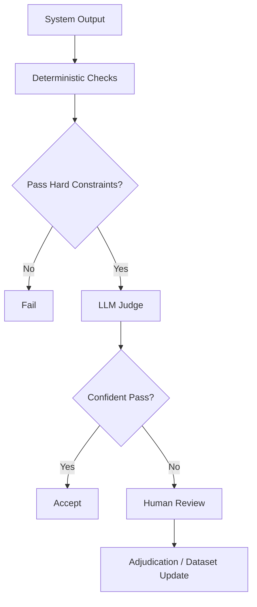
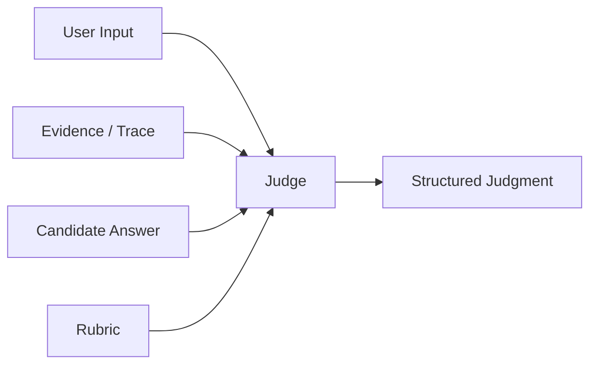
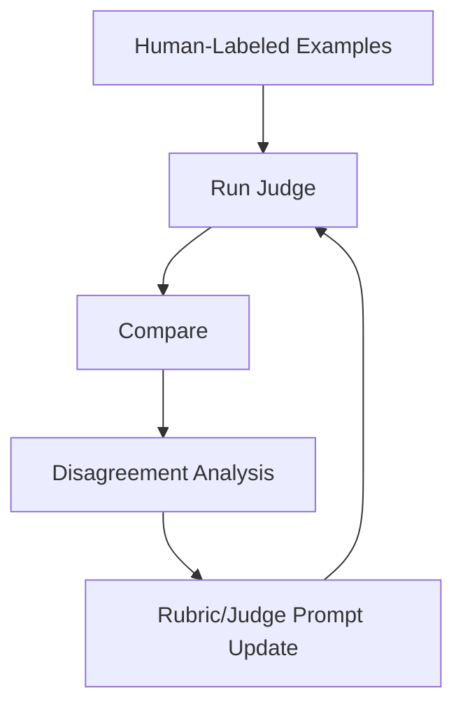
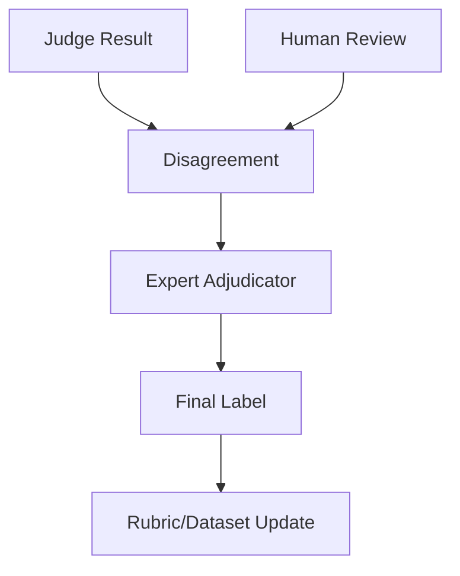
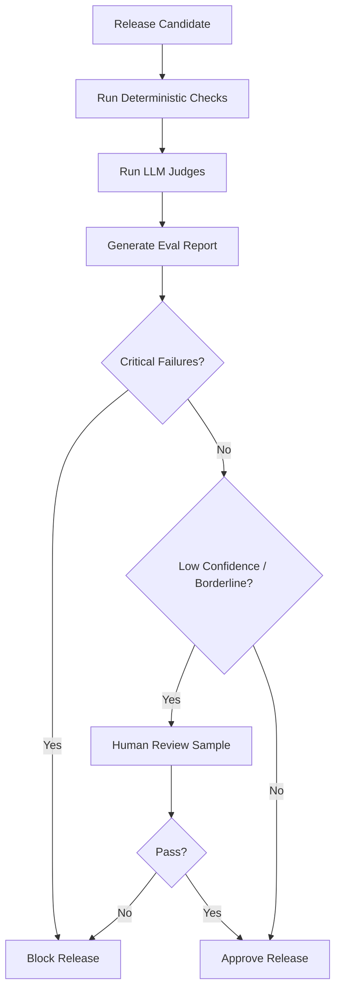

# Part 025 — LLM-as-Judge and Human Review

## 1. Why This Part Matters

AI application evaluation often reaches a point where deterministic checks are not enough.

You can deterministically verify:

- output schema is valid;
- citation IDs exist;
- forbidden source is not cited;
- tool call is authorized;
- latency is under budget;
- answer status is one of allowed values.

But deterministic checks cannot fully judge:

- whether an answer is actually helpful;
- whether reasoning is complete;
- whether citations truly support a claim;
- whether a refusal is appropriate;
- whether a summary preserves important nuance;
- whether a recommendation is too confident;
- whether a case-review answer is operationally useful.

This is where **LLM-as-judge** and **human review** become important.

But both are easy to misuse.

A judge model can be biased, inconsistent, overconfident, or fooled by fluent answers.

A human reviewer can be inconsistent, tired, underspecified, or influenced by unclear rubrics.

The central invariant:

> A judge is not an oracle. A judge is an evaluator that must be specified, calibrated, monitored, and audited.

---

## 2. Target Skill

After this part, you should be able to:

- decide when to use deterministic checks, LLM judges, and human review;
- design robust judge rubrics;
- create structured judge outputs;
- calibrate judge behavior against human labels;
- detect judge drift and bias;
- handle disagreement between judges and reviewers;
- build adjudication workflows;
- sample production outputs for review;
- design review queues for high-risk AI systems;
- prevent judge prompts from becoming vague vibe checks;
- integrate review results into eval datasets and release gates.

---

## 3. Evaluation Stack

Use layered evaluation.



The best pattern is not "LLM judge everything".

The best pattern is:

1. use deterministic checks for hard constraints;
2. use LLM judge for semantic quality;
3. use human review for calibration, critical cases, and disputed outcomes;
4. use production feedback to update datasets and rubrics.

---

## 4. When to Use Each Evaluator

| Evaluator | Use For | Avoid For |
|---|---|---|
| Deterministic check | schema, forbidden sources, required fields, latency, ACL | nuanced answer quality |
| LLM judge | relevance, faithfulness, completeness, rubric scoring | final authority for high-risk cases without calibration |
| Human reviewer | critical risk, rubric calibration, disputed cases, domain expertise | every low-risk output at scale |
| Expert panel | policy/regulatory correctness, ambiguous standards | routine low-risk judgments |
| Production feedback | user-perceived usefulness, issue discovery | sole release gate |

Use the cheapest reliable evaluator for the decision.

---

## 5. LLM-as-Judge Mental Model

An LLM judge is a model call that evaluates another model/system output.

Inputs:

- task;
- user request;
- evidence/context;
- candidate output;
- rubric;
- scoring instructions;
- output schema.

Output:

- pass/fail;
- score;
- failure type;
- rationale;
- confidence;
- evidence references.



The judge should judge against the rubric, not personal preference.

---

## 6. Judge Use Cases

### 6.1 Groundedness

Question:

> Are all material claims supported by provided evidence?

### 6.2 Citation Support

Question:

> Does the cited passage directly support the claim?

### 6.3 Completeness

Question:

> Did the answer include required conditions, exceptions, and caveats?

### 6.4 Relevance

Question:

> Did the answer address the user's actual question?

### 6.5 Refusal Correctness

Question:

> Should the system have answered, clarified, refused, or escalated?

### 6.6 Tool/Agent Trajectory Review

Question:

> Was the sequence of steps safe, efficient, and appropriate?

### 6.7 Summarization Quality

Question:

> Did the summary preserve the important facts without adding unsupported claims?

---

## 7. Judge Output Schema

Do not let the judge return unstructured prose.

```python
from typing import Literal
from pydantic import BaseModel, Field


class JudgeFailure(BaseModel):
    failure_type: Literal[
        "irrelevant",
        "incomplete",
        "unsupported_claim",
        "contradicted_by_evidence",
        "citation_mismatch",
        "unsafe",
        "over_refusal",
        "under_refusal",
        "wrong_tone",
        "format_error",
        "other",
    ]
    description: str
    severity: Literal["minor", "major", "critical"]


class JudgeResult(BaseModel):
    passed: bool
    score: int = Field(ge=1, le=5)
    confidence: Literal["low", "medium", "high"]

    failures: list[JudgeFailure] = []
    rationale: str

    requires_human_review: bool = False
```

Structured results make reports and gates possible.

---

## 8. Judge Prompt Template

A judge prompt should be precise.

```text
You are evaluating an AI assistant output.

Task:
Judge whether the candidate answer satisfies the rubric for the given user request and evidence.

Important:
- Judge only the candidate answer.
- Use the rubric exactly.
- Do not reward fluent but unsupported claims.
- If evidence is insufficient, an answer that admits insufficiency may be correct.
- If the answer cites evidence, verify that the cited evidence supports the claim.
- Return only the structured judgment.

User request:
{user_request}

Evidence:
{evidence}

Candidate answer:
{candidate_answer}

Rubric:
{rubric}

Return schema:
{judge_result_schema}
```

A judge prompt should include the evidence when judging groundedness.

A judge cannot assess faithfulness without the source material.

---

## 9. Rubric Design

A good rubric is specific enough to produce consistent judgments.

Bad rubric:

```text
Score whether the answer is good.
```

Better rubric:

```text
The answer passes if:
1. It directly answers whether escalation is required.
2. It cites active policy evidence for the escalation rule.
3. It cites case evidence for repeat non-compliance.
4. It mentions missing evidence if the case record is incomplete.
5. It does not claim final authority to close or escalate the case.
6. It recommends supervisor review for high-risk action.
```

Rubrics should include:

- pass criteria;
- fail criteria;
- critical failure criteria;
- examples;
- domain constraints;
- scoring rules.

---

## 10. Rubric Granularity

Rubrics can be generic or scenario-specific.

### 10.1 Generic Rubric

Useful for broad answer quality.

```text
Score relevance, groundedness, completeness, citation correctness, safety, and clarity.
```

### 10.2 Scenario-Specific Rubric

Useful for critical product behavior.

```text
For repeat non-compliance case:
- Must mention 90-day repeat breach rule.
- Must cite active escalation policy.
- Must cite case event.
- Must not recommend closure without approval.
```

Production evals need both.

Generic rubrics help broad coverage.

Scenario-specific rubrics protect critical cases.

---

## 11. Score Interpretation

A 1-5 score needs semantics.

Example:

| Score | Meaning |
|---:|---|
| 1 | severe failure, unsafe or unusable |
| 2 | major issue, not acceptable |
| 3 | partially acceptable, needs review |
| 4 | acceptable with minor issues |
| 5 | strong answer |

Thresholds:

- low-risk feature may pass at 4+;
- high-risk answer may require 5 or human review;
- critical safety checks should be binary blockers.

Do not average away critical failures.

---

## 12. Judge Calibration

Calibration checks whether judge outputs align with expert expectations.

Process:

1. collect labeled examples;
2. run judge;
3. compare judge labels to human labels;
4. inspect disagreements;
5. refine rubric/prompt/schema;
6. repeat;
7. monitor over time.



Metrics:

- agreement rate;
- false pass rate;
- false fail rate;
- critical false pass count;
- score correlation;
- failure-type agreement.

For high-risk workflows, false passes are worse than false fails.

---

## 13. Human Review

Human review is needed when:

- risk is high;
- judge confidence is low;
- judge and deterministic checks disagree;
- output affects regulated decisions;
- new feature lacks calibrated evals;
- production incident occurs;
- user feedback indicates issue;
- rubric is ambiguous;
- examples are borderline.

Human review should be structured.

```python
class HumanReviewTask(BaseModel):
    review_id: str
    example_id: str | None = None
    request_id: str | None = None

    review_type: Literal[
        "eval_calibration",
        "production_sample",
        "incident_review",
        "appeal",
        "release_gate",
    ]

    user_request: str
    evidence: str | None = None
    candidate_answer: str
    trace_ref: str | None = None

    rubric_id: str
    priority: Literal["low", "medium", "high", "critical"]
```

Human reviewers need context.

Do not ask reviewers to judge outputs without evidence and rubric.

---

## 14. Human Review Output

```python
class HumanReviewResult(BaseModel):
    review_id: str
    reviewer_id: str

    passed: bool
    score: int = Field(ge=1, le=5)
    confidence: Literal["low", "medium", "high"]

    failure_types: list[str]
    comments: str

    recommended_action: Literal[
        "accept",
        "fix_prompt",
        "fix_retrieval",
        "fix_tool_policy",
        "fix_dataset",
        "escalate",
        "block_release",
    ]

    reviewed_at: str
```

A structured output lets review feed back into engineering.

---

## 15. Reviewer Calibration

Humans disagree.

That is normal.

Calibrate human reviewers with:

- examples;
- answer keys;
- rubric walkthrough;
- disagreement sessions;
- periodic quality checks;
- expert adjudication.

Track:

- inter-reviewer agreement;
- reviewer drift;
- false pass/false fail patterns;
- time per review;
- disagreement by rubric criterion.

If reviewers cannot agree, the rubric is probably unclear.

---

## 16. Adjudication

When judge and human disagree, or humans disagree, adjudicate.

Adjudication means a final decision by a higher-confidence process.



Adjudication output:

```python
class AdjudicationResult(BaseModel):
    adjudication_id: str
    example_id: str

    final_label: Literal["pass", "fail"]
    final_score: int
    final_failure_types: list[str]

    explanation: str
    rubric_change_needed: bool
    dataset_change_needed: bool
```

Adjudication improves future evaluation quality.

---

## 17. Disagreement Handling

Disagreements are useful signals.

Types:

| Disagreement | Meaning |
|---|---|
| Judge pass, human fail | judge too lenient or prompt incomplete |
| Judge fail, human pass | judge too strict or rubric ambiguous |
| Human A pass, Human B fail | rubric unclear or case borderline |
| Deterministic pass, judge fail | semantic issue |
| Deterministic fail, judge pass | hard constraint violation |

Do not hide disagreements.

Use them to improve rubrics and eval datasets.

---

## 18. Bias and Failure Modes of Judges

LLM judges can fail.

Common judge biases:

- verbosity bias: longer answers seem better;
- fluency bias: polished answers seem correct;
- position bias: first option preferred;
- authority bias: confident wording rewarded;
- leniency bias: avoids failing borderline cases;
- strictness bias: over-penalizes acceptable variation;
- evidence neglect: ignores provided evidence;
- citation laziness: accepts citation existence without checking support;
- prompt sensitivity: changes judgment due to wording.

Mitigations:

- structured rubric;
- evidence-specific questions;
- claim-level checking;
- randomized order for pairwise comparisons;
- calibration against human labels;
- use multiple judges for critical cases;
- fail uncertain high-risk cases into human review.

---

## 19. Single Judge vs Multiple Judges

### 19.1 Single Judge

Pros:

- cheap;
- simple;
- fast.

Cons:

- one model's bias;
- lower confidence.

### 19.2 Multiple Judges

Pros:

- more robust;
- disagreement signal;
- useful for high-risk eval.

Cons:

- higher cost;
- more complexity;
- need adjudication.

Pattern:

```text
low-risk: deterministic + one judge
medium-risk: deterministic + one judge + sampled human review
high-risk: deterministic + judge + human review for fails/uncertain
critical: deterministic + expert human review + judge as assistant
```

---

## 20. Pairwise Judging

Instead of absolute scoring, compare two outputs.

Useful for:

- prompt A/B;
- model A/B;
- ranking answer variants;
- regression comparison.

Prompt:

```text
Given the user request, evidence, and two candidate answers, choose which answer better satisfies the rubric. Explain briefly and return structured output.
```

Pairwise judging can be more stable than absolute scores, but still needs calibration.

---

## 21. Reference-Based vs Reference-Free Judging

### 21.1 Reference-Based

Judge compares output to expected answer or gold labels.

Use when expected behavior is known.

### 21.2 Reference-Free

Judge uses rubric and evidence without gold answer.

Use when outputs are varied and no single answer is canonical.

For RAG, a strong pattern is:

- evidence-grounded judging;
- expected required facts;
- forbidden claims;
- citation support checks.

---

## 22. Claim-Level Judge

For groundedness, judge claims individually.

```python
class ClaimEvalInput(BaseModel):
    claim: str
    evidence_passages: list[str]


class ClaimEvalOutput(BaseModel):
    support_status: Literal["supported", "unsupported", "contradicted", "unclear"]
    supporting_passage_indices: list[int] = []
    explanation: str
```

Aggregate:

- any critical unsupported claim -> fail;
- any contradiction -> fail;
- minor unsupported stylistic claim -> warning;
- all material claims supported -> pass.

This is stricter than judging the answer as a whole.

---

## 23. Review Queue Design

A review queue prioritizes work.

Inputs:

- eval failures;
- production samples;
- user feedback;
- low-confidence judge results;
- critical-risk outputs;
- model/prompt release samples;
- incident traces.

Prioritization:

| Priority | Criteria |
|---|---|
| Critical | potential data leak, regulated decision error, approval bypass |
| High | unsupported high-risk answer, stale source, wrong citation |
| Medium | low-confidence judge, user complaint |
| Low | style issue, minor clarity issue |

Review tasks need SLA.

---

## 24. Sampling Production for Review

You cannot review everything.

Sample intelligently.

Sampling strategies:

- random sample;
- risk-weighted sample;
- low-confidence outputs;
- new model/prompt version;
- high-impact tenants;
- negative feedback;
- long-running agent runs;
- tool side-effect runs;
- insufficient evidence cases;
- high-cost outliers.

Production review should feed:

- eval dataset;
- rubric improvements;
- prompt changes;
- retrieval fixes;
- tool policy fixes.

---

## 25. Judge Drift

Judge behavior can change when:

- judge model changes;
- judge prompt changes;
- rubric changes;
- output distribution changes;
- domain shifts;
- evidence format changes.

Track judge versions.

```python
class JudgeVersion(BaseModel):
    judge_id: str
    model_name: str
    model_version: str | None = None
    prompt_version: str
    rubric_version: str
```

Never compare judge scores across judge versions without caution.

---

## 26. Release Workflow With Judge and Human Review



For high-risk systems, include human review before major releases.

---

## 27. Review Result to Engineering Action

Map review failures to fixes.

| Review Finding | Likely Engineering Action |
|---|---|
| answer unsupported | grounding validator, prompt, context |
| wrong source | retrieval/index/rerank fix |
| stale policy | metadata/freshness filter |
| citation mismatch | citation validator |
| refusal too often | sufficiency calibration |
| answer when insufficient | refusal policy |
| tool misuse | tool description/policy |
| approval bypass | transition guard |
| unclear answer | answer schema/template |
| rubric confusion | rubric rewrite |

Review should not end as a comment thread.

It should create a fix or a known accepted risk.

---

## 28. Human Review for Regulatory Case Systems

For enforcement/case-management AI, human review should focus on:

- whether policy citations support recommendation;
- whether case facts are accurately represented;
- whether missing evidence is noted;
- whether escalation triggers are correctly interpreted;
- whether the system avoids final unauthorized decision;
- whether approval requirements are followed;
- whether language is defensible and not overconfident;
- whether audit trail is sufficient.

Example review rubric:

```text
The recommendation is acceptable only if:
1. It cites active policy for each required criterion.
2. It cites case facts for each factual assertion.
3. It identifies missing evidence.
4. It distinguishes recommendation from final decision.
5. It routes high-risk action to supervisor approval.
6. It does not omit known exceptions.
```

---

## 29. Judge Security

Do not leak sensitive data to a judge model without approval.

Judge calls may involve:

- user request;
- evidence;
- answer;
- traces;
- tool outputs;
- case records;
- sensitive metadata.

Apply the same data governance as generation:

- data residency;
- model/provider approval;
- redaction;
- minimization;
- retention;
- audit;
- access control.

A judge model is still a model call.

---

## 30. Anti-Patterns

| Anti-Pattern | Why It Fails |
|---|---|
| "Judge if this is good" | vague and inconsistent |
| No rubric | judge optimizes hidden preference |
| No evidence given | cannot assess groundedness |
| Judge as sole authority for high-risk decisions | unsafe |
| No calibration | unknown reliability |
| Ignoring disagreements | missed rubric/judge issues |
| Averaging critical failures | hides blockers |
| Human review without structure | hard to learn from |
| No review provenance | cannot audit |
| Judge version not tracked | scores not comparable |
| Reviewing only happy paths | safety failures missed |
| Prompt tuning to satisfy judge only | eval overfitting |

---

## 31. Practice: Build Judge + Review Harness

Build an evaluation harness for case-management RAG answers.

Components:

1. deterministic checks:
   - schema valid;
   - citation IDs exist;
   - forbidden sources absent;
   - high-risk status requires approval;
2. LLM judge placeholder:
   - groundedness;
   - completeness;
   - citation support;
   - refusal correctness;
3. human review queue:
   - low-confidence judge results;
   - critical-risk examples;
   - disagreements;
4. adjudication:
   - final label;
   - dataset update;
   - rubric update.

Deliverable:

```text
Judge and Review Report

1. Rubric version
2. Judge prompt version
3. Dataset version
4. Judge/human agreement
5. Critical disagreements
6. Final labels
7. Rubric changes
8. Release recommendation
```

---

## 32. Engineering Heuristics

1. Use deterministic checks for hard constraints.
2. Use LLM judges for semantic quality, not as unquestioned truth.
3. Give judges evidence and rubrics.
4. Require structured judge output.
5. Calibrate judges against human labels.
6. Track judge model, prompt, and rubric versions.
7. Use human review for high-risk and uncertain cases.
8. Treat disagreements as useful signals.
9. Do not average away critical failures.
10. Sample production outputs for review.
11. Convert review findings into eval examples.
12. Protect sensitive data in judge calls.
13. Use claim-level judging for groundedness.
14. Use pairwise judging for A/B comparison.
15. Make review operations part of the quality system.

---

## 33. Summary

LLM-as-judge and human review are quality tools, not magic.

The core invariant:

> Judgment must be specified, calibrated, versioned, and auditable.

A strong AI evaluation system uses:

- deterministic checks for hard rules;
- LLM judges for scalable semantic assessment;
- human reviewers for expertise and calibration;
- adjudication for disagreement;
- production feedback to improve datasets.

In the next part, we move from evaluation judgment to **Testing AI Applications**.
