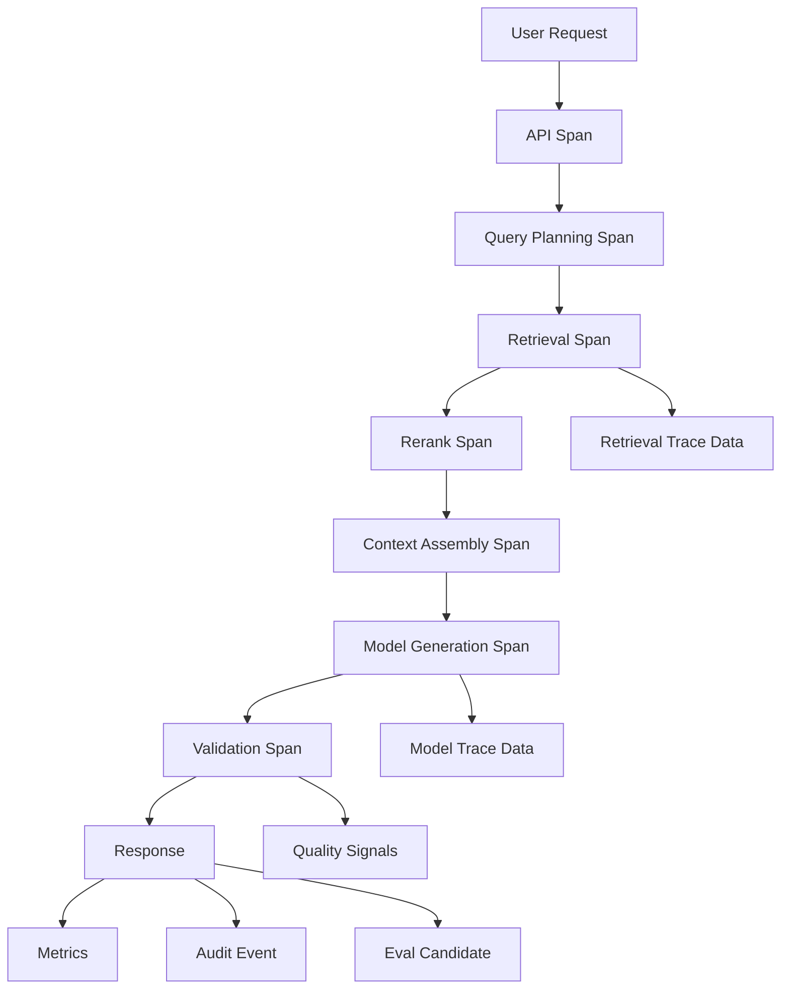
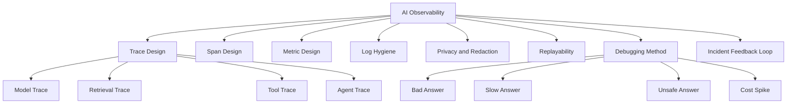
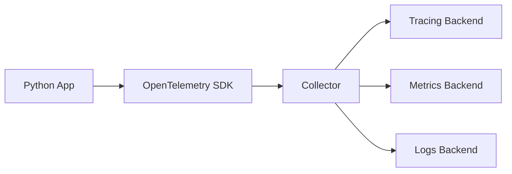
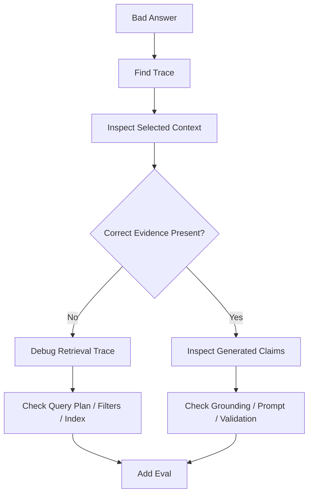

# Part 027 — Observability, Tracing, and Debugging

## 1. Why This Part Matters

An AI application can fail in ways ordinary logs do not explain.

A user says:

```text
The assistant gave the wrong answer.
```

That sentence is not enough.

You need to know:

- what the user asked;
- how the query was normalized;
- which prompt version was used;
- which model was called;
- what parameters were used;
- what the model returned;
- which documents were retrieved;
- which chunks entered context;
- which tool calls were proposed;
- which tool calls were executed;
- which guardrails fired;
- which agent node ran;
- why a workflow stopped;
- how many tokens were used;
- how much it cost;
- what latency each stage added;
- whether sensitive data was redacted;
- whether the output was validated;
- whether citations supported claims.

Without observability, AI debugging becomes guesswork.

The central invariant:

> Every AI output should be explainable through a trace of model, retrieval, tool, validation, and workflow events.

---

## 2. Target Skill

After this part, you should be able to:

- design trace schemas for LLM calls, RAG, tools, and agents;
- instrument Python AI apps with structured telemetry;
- separate traces, logs, metrics, audit events, and eval artifacts;
- debug bad answers from trace data;
- build replayable AI runs;
- track latency, cost, token usage, and failure modes;
- protect sensitive data in observability pipelines;
- map observability data into incident workflows;
- use trace data to improve eval datasets and reliability patterns.

---

## 3. Observability Vocabulary

| Term | Meaning | AI Example |
|---|---|---|
| Trace | A full request/run path across components | user query -> retrieval -> model -> tool -> answer |
| Span | Timed operation inside a trace | model call, vector search, rerank |
| Event | Point-in-time detail inside a span | tool_call_started, validation_failed |
| Metric | Aggregated numerical measurement | p95 model latency, token cost |
| Log | Structured record for debugging | schema validation error |
| Audit event | Accountability record | user accessed source S1 |
| Eval artifact | Offline quality record | groundedness score |
| Replay record | Data needed to reproduce run | prompt, evidence refs, model config |

Do not mix these without intent.

A log is not an audit trail.

A trace is not an eval.

A metric is not enough for debugging.

---

## 4. AI Observability Architecture



A single user request may produce:

- request trace;
- model spans;
- retrieval spans;
- tool spans;
- validation events;
- metrics;
- audit events;
- eval sampling events.

Each has different retention and access requirements.

---

## 5. Kaufman Deconstruction

Break AI observability into subskills.



Deliberate practice:

1. run a RAG query;
2. inspect trace;
3. inject retrieval failure;
4. inspect trace again;
5. inject model invalid output;
6. inspect trace again;
7. add a metric;
8. add a replay record;
9. convert the failure into an eval.

---

## 6. What to Trace

Trace every important AI boundary.

### 6.1 Request Boundary

- request ID;
- user/tenant context;
- channel;
- feature;
- risk level;
- sanitized query hash;
- raw query if permitted;
- auth decision reference.

### 6.2 Prompt Boundary

- prompt template ID;
- prompt version;
- rendered prompt hash;
- input variables;
- system/developer/user/evidence sections;
- context token count.

### 6.3 Model Boundary

- provider;
- model name/version;
- parameters;
- input tokens;
- output tokens;
- latency;
- status;
- error type;
- finish reason;
- structured output validity.

### 6.4 Retrieval Boundary

- index version;
- embedding model;
- query text/hash;
- filters;
- candidate IDs;
- selected context IDs;
- scores/ranks;
- reranker model;
- latency.

### 6.5 Tool Boundary

- tool name/version;
- arguments hash/summary;
- trusted context;
- authorization decision;
- idempotency key;
- status;
- latency;
- output summary;
- side effect refs.

### 6.6 Agent Boundary

- run ID;
- node sequence;
- decisions;
- transitions;
- approvals;
- interrupts;
- retries;
- stop reason;
- max step/budget status.

### 6.7 Validation Boundary

- schema validation;
- citation validation;
- grounding validation;
- safety checks;
- unsupported claims;
- repair attempts.

---

## 7. Trace Schema

```python
from typing import Literal
from pydantic import BaseModel, Field


class AiTrace(BaseModel):
    trace_id: str
    request_id: str

    tenant_id: str
    user_id: str | None = None
    feature: str
    channel: str

    status: Literal["success", "failed", "partial", "refused", "escalated"]
    started_at: str
    ended_at: str | None = None

    spans: list["AiSpan"] = []

    total_tokens: int = 0
    total_cost_estimate: float | None = None
    error_summary: str | None = None
```

Span:

```python
class AiSpan(BaseModel):
    span_id: str
    parent_span_id: str | None = None
    trace_id: str

    name: str
    span_type: Literal[
        "api",
        "prompt",
        "model",
        "retrieval",
        "rerank",
        "tool",
        "agent_node",
        "validation",
        "storage",
    ]

    started_at: str
    ended_at: str | None = None
    status: Literal["ok", "error", "timeout", "cancelled"]

    attributes: dict[str, str | int | float | bool | None] = {}
    events: list["AiSpanEvent"] = []
```

Event:

```python
class AiSpanEvent(BaseModel):
    name: str
    timestamp: str
    attributes: dict[str, str | int | float | bool | None] = {}
```

Keep trace data structured.

Plain-text trace logs are hard to query.

---

## 8. OpenTelemetry Mental Model

OpenTelemetry provides a vendor-neutral way to generate, collect, and export traces, metrics, and logs.

For AI apps, you can model:

- each request as a trace;
- each model call as a span;
- each retrieval call as a span;
- each tool call as a span;
- each agent node as a span;
- validation failures as span events;
- token/cost/latency as attributes or metrics.



Do not make observability vendor-specific inside business logic.

Use adapters.

---

## 9. Minimal Python Tracing Wrapper

This example uses a simple internal tracer interface.

```python
from contextlib import asynccontextmanager
from time import perf_counter
from typing import AsyncIterator


class TraceSink:
    async def start_span(self, name: str, span_type: str, attributes: dict[str, object]) -> str:
        ...

    async def end_span(self, span_id: str, status: str, attributes: dict[str, object]) -> None:
        ...

    async def add_event(self, span_id: str, name: str, attributes: dict[str, object]) -> None:
        ...


@asynccontextmanager
async def traced_span(
    *,
    sink: TraceSink,
    name: str,
    span_type: str,
    attributes: dict[str, object],
) -> AsyncIterator[str]:
    span_id = await sink.start_span(name, span_type, attributes)
    start = perf_counter()

    try:
        yield span_id
        await sink.end_span(
            span_id,
            "ok",
            {"duration_ms": round((perf_counter() - start) * 1000, 2)},
        )
    except TimeoutError:
        await sink.end_span(
            span_id,
            "timeout",
            {"duration_ms": round((perf_counter() - start) * 1000, 2)},
        )
        raise
    except Exception as exc:
        await sink.end_span(
            span_id,
            "error",
            {
                "duration_ms": round((perf_counter() - start) * 1000, 2),
                "error_type": type(exc).__name__,
            },
        )
        raise
```

Use this pattern around model, retrieval, and tool calls.

---

## 10. Model Call Trace

```python
class ModelCallTrace(BaseModel):
    provider: str
    model: str
    model_version: str | None = None

    prompt_template_id: str
    prompt_version: str
    rendered_prompt_hash: str

    temperature: float | None = None
    max_output_tokens: int | None = None

    input_tokens: int | None = None
    output_tokens: int | None = None
    total_tokens: int | None = None

    latency_ms: float
    finish_reason: str | None = None

    output_schema_id: str | None = None
    output_valid: bool | None = None
    repair_attempts: int = 0

    error_type: str | None = None
```

Do not store raw prompts everywhere by default.

Store hashes and references.

For debugging environments, raw prompt capture may be allowed with strict access and retention.

---

## 11. Prompt Trace

Prompt trace should answer:

- which template rendered this prompt?
- which variables were used?
- which evidence entered?
- how many tokens?
- which instructions were active?
- what changed between versions?

```python
class PromptTrace(BaseModel):
    prompt_template_id: str
    prompt_version: str

    variable_names: list[str]
    rendered_hash: str

    sections: list[str]
    evidence_ids: list[str] = []

    system_instruction_hash: str | None = None
    developer_instruction_hash: str | None = None

    estimated_tokens: int
```

Prompt bugs are easier to debug when the prompt is versioned and traceable.

---

## 12. Retrieval Trace

```python
class RetrievalTrace(BaseModel):
    query: str
    normalized_query: str
    query_type: str

    tenant_id: str
    filters: dict[str, object]

    retrieval_mode: str
    index_versions: list[str]
    embedding_model: str | None = None
    reranker_model: str | None = None

    lexical_candidate_ids: list[str] = []
    vector_candidate_ids: list[str] = []
    fused_candidate_ids: list[str] = []
    reranked_candidate_ids: list[str] = []
    selected_context_ids: list[str] = []

    latency_ms: dict[str, float] = {}
```

This trace supports RAG debugging.

If the correct chunk was not in candidates, debug retrieval.

If it was in candidates but not selected, debug reranking/context.

If it was in context but answer was wrong, debug generation/validation.

---

## 13. Tool Trace

```python
class ToolCallTrace(BaseModel):
    tool_call_id: str
    tool_name: str
    tool_version: str

    side_effect_level: str
    risk_level: str

    input_hash: str
    input_summary: dict[str, object]

    trusted_context_hash: str
    authorization_status: Literal["allowed", "denied", "approval_required"]

    idempotency_key: str | None = None
    approval_id: str | None = None

    status: Literal["success", "failed", "timeout", "denied"]
    error_type: str | None = None

    output_hash: str | None = None
    output_summary: dict[str, object] | None = None

    latency_ms: float
```

Do not log full tool input/output if it contains sensitive data.

Use summaries and hashes.

---

## 14. Agent Trace

```python
class AgentNodeTrace(BaseModel):
    run_id: str
    node_name: str
    step_number: int

    decision_type: str | None = None
    selected_action: str | None = None
    rationale_summary: str | None = None

    state_version_before: int | None = None
    state_version_after: int | None = None

    tool_call_ids: list[str] = []
    approval_id: str | None = None
    interrupt_id: str | None = None

    status: Literal["ok", "waiting", "failed", "completed"]
    stop_reason: str | None = None
```

Agent trace should show path and state transitions.

A final answer is not enough.

---

## 15. Metrics

Metrics are aggregated signals.

### 15.1 Quality Metrics

- answer pass rate;
- unsupported claim rate;
- citation failure rate;
- insufficient evidence rate;
- refusal rate;
- over-refusal rate;
- user negative feedback rate;
- human escalation rate.

### 15.2 Retrieval Metrics

- recall@k in eval;
- no-result rate in production;
- stale source rate;
- unauthorized retrieval count;
- duplicate top-k rate;
- reranker timeout rate.

### 15.3 Model Metrics

- model latency p50/p95/p99;
- error rate;
- timeout rate;
- token usage;
- cost per request;
- structured output failure rate;
- repair attempt rate.

### 15.4 Agent Metrics

- average steps per run;
- max-step failures;
- tool call count;
- tool error rate;
- approval rate;
- approval rejection rate;
- stuck task count;
- resume success rate.

### 15.5 System Metrics

- API latency;
- queue depth;
- worker utilization;
- rate-limit events;
- cache hit rate;
- database latency;
- vector index latency.

Metrics should be sliced by feature, tenant, model, prompt version, index version, and query type.

---

## 16. Logs

Logs should be structured.

Bad:

```text
Model failed lol
```

Better:

```json
{
  "event": "model_call_failed",
  "trace_id": "tr-123",
  "request_id": "req-123",
  "provider": "provider-x",
  "model": "model-y",
  "error_type": "timeout",
  "retryable": true
}
```

Log rules:

- include trace/request/run IDs;
- avoid raw sensitive text;
- include error type;
- include retryability;
- include component;
- include version metadata.

Logs support local debugging.

Traces show request flow.

Metrics show system health.

---

## 17. Audit vs Observability

Audit events are for accountability.

Observability is for debugging and operations.

Do not assume debug logs satisfy audit requirements.

Example audit event:

```python
class AiAuditEvent(BaseModel):
    audit_event_id: str
    timestamp: str

    tenant_id: str
    user_id: str
    request_id: str
    trace_id: str

    action: str
    selected_source_ids: list[str]
    cited_source_ids: list[str]

    model_versions: list[str]
    index_versions: list[str]

    authorization_decision_id: str | None = None
    answer_status: str
```

Audit events often need stricter retention and access control.

---

## 18. Privacy and Redaction

AI observability can easily leak sensitive data.

Sensitive fields:

- PII;
- case details;
- legal privileged content;
- credentials;
- tool outputs;
- raw prompts;
- retrieved passages;
- user messages;
- model outputs;
- hidden instructions.

Redaction strategy:

1. classify fields;
2. hash where possible;
3. store references instead of raw text;
4. store summaries where safe;
5. restrict raw capture to debug mode;
6. expire raw captures quickly;
7. audit access to traces;
8. redact before export.

```python
SENSITIVE_KEYS = {
    "password",
    "token",
    "access_token",
    "secret",
    "private_key",
    "ssn",
    "national_id",
}


def redact_dict(data: dict[str, object]) -> dict[str, object]:
    result = {}

    for key, value in data.items():
        if key.lower() in SENSITIVE_KEYS:
            result[key] = "[REDACTED]"
        elif isinstance(value, dict):
            result[key] = redact_dict(value)
        else:
            result[key] = value

    return result
```

Do not send sensitive traces to unapproved vendors.

---

## 19. Replayability

A replay record helps reproduce behavior.

For AI, exact replay may be impossible if model provider behavior changes.

But you can still capture enough to diagnose.

Replay record:

```python
class ReplayRecord(BaseModel):
    trace_id: str
    request_id: str

    feature: str
    user_query: str | None = None
    user_query_hash: str

    prompt_template_id: str
    prompt_version: str
    prompt_inputs_ref: str

    model_provider: str
    model_name: str
    model_parameters: dict[str, object]

    retrieval_trace_ref: str | None = None
    selected_evidence_refs: list[str] = []

    tool_trace_refs: list[str] = []
    output_ref: str | None = None

    created_at: str
```

For deterministic replay, use:

- fake model with recorded output;
- recorded tool outputs;
- recorded retrieval results;
- same prompt version;
- same context package.

This lets you reproduce pipeline behavior even if model output changes later.

---

## 20. Debugging Bad Answers

Use this method.



Checklist:

1. Was query normalized correctly?
2. Was the correct index used?
3. Were filters correct?
4. Was correct evidence in candidates?
5. Was it selected into context?
6. Was context rendered correctly?
7. Did the model output unsupported claims?
8. Did validator catch them?
9. Were citations valid?
10. Did UI display caveats?

Do not start by changing the prompt.

---

## 21. Debugging Slow Answers

Latency trace should show stage timings.

```text
api: 120ms
query_plan: 80ms
embedding: 280ms
vector_search: 150ms
lexical_search: 90ms
rerank: 1,300ms
context_build: 40ms
model_generation: 4,800ms
validation: 600ms
```

Common fixes:

- parallelize retrieval;
- reduce candidate count;
- skip rerank for exact lookup;
- use smaller model for validation;
- reduce context tokens;
- cache query embeddings;
- stream generation after evidence is ready;
- add timeout and fallback.

Do not optimize without timing spans.

---

## 22. Debugging Cost Spikes

Cost trace should include:

- input tokens;
- output tokens;
- model choice;
- number of model calls;
- reranker calls;
- eval/judge calls;
- retry count;
- agent step count;
- context size;
- tool calls with cost.

Common causes:

- agent loops;
- excessive context;
- too many rerank candidates;
- judge called on every request;
- retry storm;
- large prompt templates;
- unnecessary multi-agent handoffs;
- no caching.

Cost needs budget metrics and per-feature breakdown.

---

## 23. Debugging Tool Failures

Tool trace should answer:

- did model select correct tool?
- were arguments valid?
- was authorization allowed?
- did approval exist?
- did tool timeout?
- was retry attempted?
- was idempotency key used?
- did output validate?
- did state update happen?

Tool failure categories:

- wrong tool;
- bad arguments;
- authorization denied;
- approval missing;
- timeout;
- rate limit;
- external dependency failure;
- output schema mismatch;
- side effect conflict.

Each category has a different fix.

---

## 24. Debugging Agent Loops

Loop symptoms:

- repeated same node;
- repeated same tool call;
- increasing step count;
- no state progress;
- same observation repeated;
- max steps exceeded.

Trace checks:

- completed nodes;
- state diffs;
- tool outputs;
- planner decisions;
- stop conditions;
- duplicate handoffs;
- repeated errors.

Fixes:

- max calls per tool;
- state progress guard;
- duplicate action detector;
- better observation summary;
- deterministic router;
- explicit stop condition;
- human interrupt.

---

## 25. Dashboards

A useful AI app dashboard includes:

### 25.1 Product Quality

- answer pass rate;
- feedback rate;
- insufficient evidence rate;
- escalation rate;
- top failure types.

### 25.2 RAG

- no-result rate;
- selected context tokens;
- stale source rate;
- citation failure rate;
- retrieval latency.

### 25.3 Models

- latency by model;
- error rate;
- token usage;
- cost by feature;
- structured output failure rate.

### 25.4 Tools and Agents

- tool call rate;
- tool failure rate;
- approval rate;
- max-step failures;
- stuck tasks.

### 25.5 Safety

- unauthorized retrieval count;
- forbidden tool proposal count;
- prompt injection detections;
- redaction failures.

Dashboards should support drill-down from metric to trace.

---

## 26. Alerting

Alert on symptoms that require action.

Examples:

| Alert | Severity |
|---|---|
| unauthorized retrieval > 0 | critical |
| approval bypass > 0 | critical |
| redaction failure > 0 | critical |
| model timeout rate spike | high |
| cost per request spike | high |
| citation failure spike | high |
| retrieval no-result spike | medium |
| p95 latency exceeds SLO | medium/high |
| stuck tasks exceed threshold | medium |
| eval critical failure in release candidate | blocker |

Avoid noisy alerts.

Every alert should have an owner and runbook.

---

## 27. Incident Debugging Runbook

```text
AI Incident Runbook

1. Identify affected feature and time window.
2. Pull traces for affected requests.
3. Identify model/prompt/index/tool versions.
4. Classify failure type.
5. Check whether unauthorized data was exposed.
6. Check whether external side effects occurred.
7. Determine rollback option.
8. Add temporary mitigation.
9. Create regression eval.
10. Patch responsible component.
11. Run eval and release gate.
12. Document incident.
```

For regulated systems, preserve audit artifacts before modifying data.

---

## 28. Observability Testing

Test instrumentation.

```python
def test_model_span_has_required_attributes() -> None:
    span = make_test_model_span()

    assert span.attributes["model.name"]
    assert span.attributes["prompt.version"]
    assert "input_tokens" in span.attributes
    assert "output_tokens" in span.attributes
```

Test redaction.

```python
def test_trace_redacts_token() -> None:
    raw = {"access_token": "abc", "query": "hello"}
    redacted = redact_dict(raw)

    assert redacted["access_token"] == "[REDACTED]"
    assert redacted["query"] == "hello"
```

Observability can regress.

Treat trace schema as a contract.

---

## 29. Case-Management Observability

For case-management AI, trace must support defensibility.

Trace should capture:

- user identity and role;
- case ID;
- authorization decision;
- policy sources retrieved;
- case facts retrieved;
- evidence references;
- recommendation draft;
- citations;
- risk classification;
- approval requirement;
- approval decision;
- final output;
- workflow action status.

Do not rely on conversational transcript alone.

A regulator or auditor may ask:

> Why did the system recommend escalation?

You need a traceable answer.

---

## 30. Anti-Patterns

| Anti-Pattern | Why It Fails |
|---|---|
| Only log final answer | Cannot debug evidence path |
| No prompt version | Prompt regressions invisible |
| No model version | Model changes untraceable |
| No retrieval candidate IDs | RAG failures undiagnosable |
| Raw sensitive traces everywhere | privacy/security risk |
| Metrics without trace drill-down | cannot find cause |
| Traces without eval link | cannot improve quality |
| Audit and debug logs mixed | wrong retention/access |
| No cost metrics | runaway spend |
| No redaction tests | accidental leaks |
| No runbook | incidents become improvisation |

---

## 31. Practice: Instrument a RAG + Agent App

Add observability to your practice app.

Required traces:

1. request trace;
2. prompt trace;
3. model span;
4. retrieval span;
5. context assembly span;
6. validation span;
7. tool span;
8. agent node span.

Required metrics:

- p95 latency;
- token usage;
- cost estimate;
- retrieval no-result rate;
- citation failure rate;
- tool failure rate;
- max-step failure rate.

Required debugging scenarios:

1. wrong answer due to retrieval miss;
2. wrong answer due to hallucination;
3. slow answer due to reranker;
4. tool failure;
5. agent loop;
6. unauthorized retrieval attempt.

Deliverable:

```text
Observability Report

1. Trace schema
2. Span list
3. Metrics list
4. Redaction policy
5. Dashboard plan
6. Alert plan
7. Debugging runbooks
8. Replay strategy
```

---

## 32. Engineering Heuristics

1. Trace model, retrieval, tool, validation, and agent boundaries.
2. Store versions for prompts, models, indexes, tools, and agents.
3. Keep raw sensitive text out of default telemetry.
4. Use hashes and references for replay.
5. Make retrieval traces inspectable.
6. Make context assembly inspectable.
7. Track token and cost by feature.
8. Trace approval and high-risk actions.
9. Connect production failures to eval examples.
10. Monitor both quality and operations.
11. Alert on security and approval failures immediately.
12. Test trace schema and redaction.
13. Keep audit logs separate from debug logs.
14. Build dashboards with trace drill-down.
15. Debug from trace before changing prompts.

---

## 33. Summary

Observability makes AI systems operable.

The core invariant:

> If the system generated an output, you should be able to reconstruct the path that produced it.

For AI applications, this path includes:

- prompt;
- model;
- retrieval;
- tools;
- agent state;
- validation;
- citations;
- approvals;
- metrics;
- audit.

Without that path, you cannot reliably debug, evaluate, improve, or defend the system.

In the next part, we move into **Reliability Patterns for AI Systems**.
