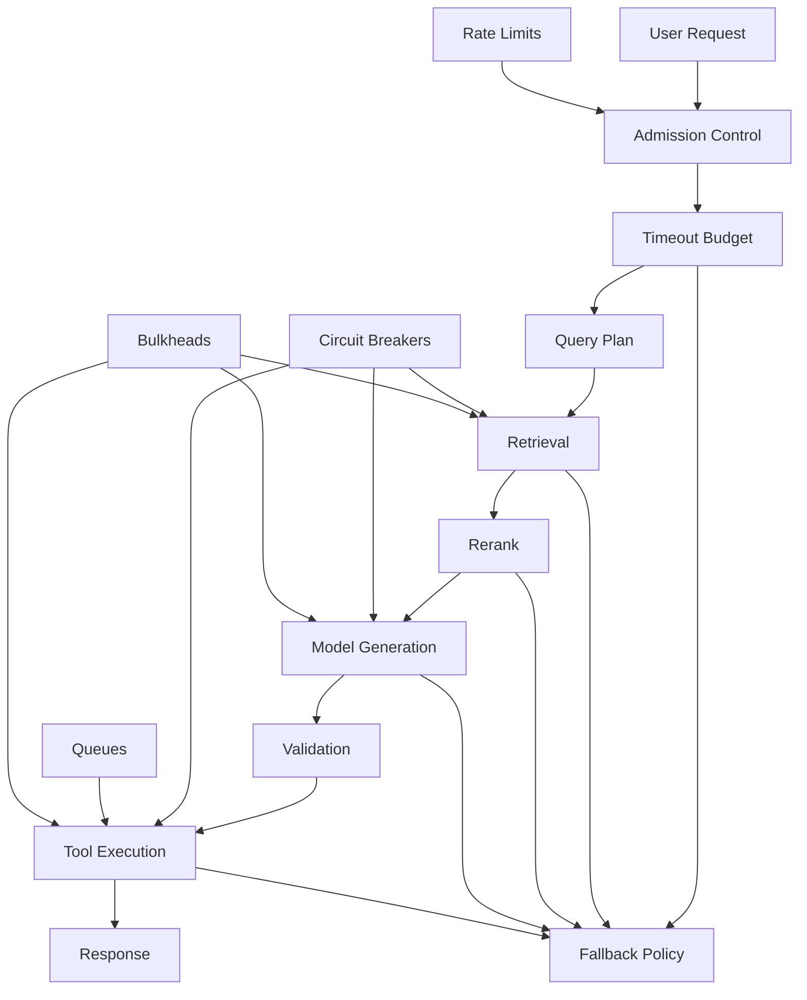
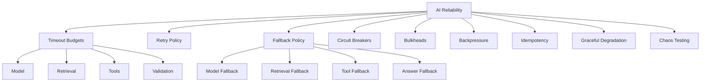
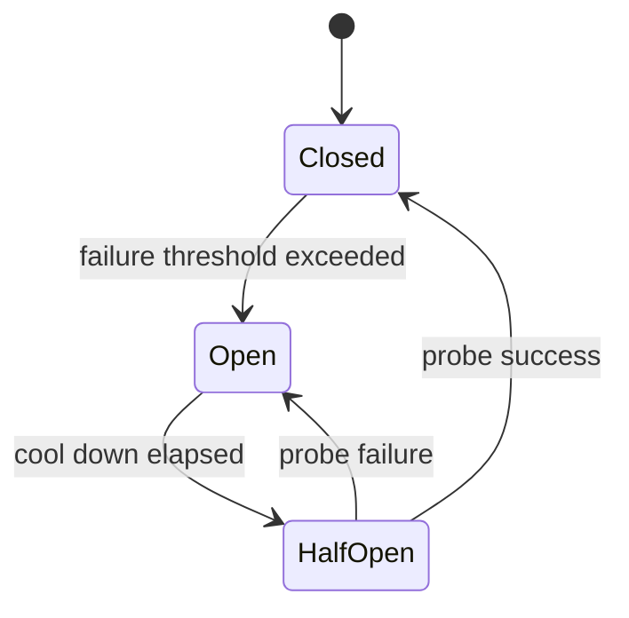
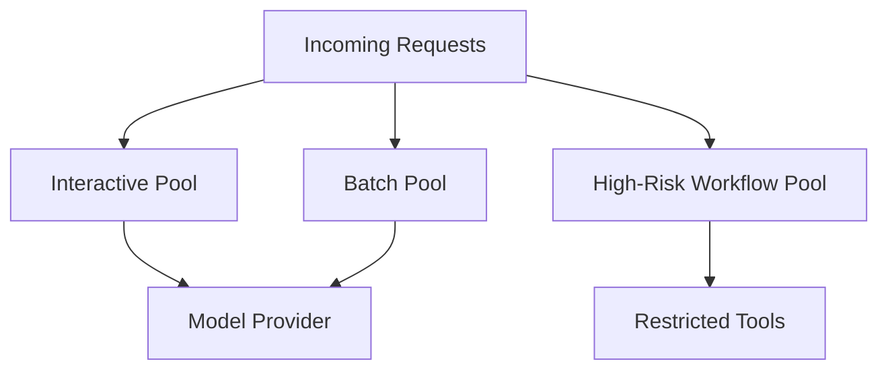
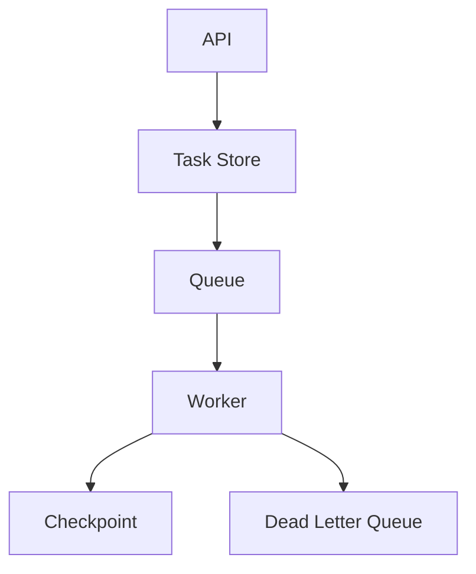

# Part 028 — Reliability Patterns for AI Systems

## 1. Why This Part Matters

AI applications are distributed systems.

They depend on:

- model providers;
- embedding providers;
- vector databases;
- rerankers;
- tool APIs;
- workflow stores;
- queues;
- databases;
- object storage;
- identity systems;
- observability systems.

Every dependency can fail.

AI adds extra failure modes:

- invalid structured output;
- prompt injection;
- tool hallucination;
- long context latency;
- token budget overflow;
- model rate limits;
- model behavior drift;
- agent loops;
- retry storms;
- runaway cost;
- partial evidence;
- unsafe fallback.

The central invariant:

> AI reliability is not achieved by hoping the model behaves. It is achieved by bounding failure, cost, latency, and authority.

This part gives you reliability patterns for production AI apps.

---

## 2. Target Skill

After this part, you should be able to:

- define timeout budgets across AI pipeline stages;
- implement retries with backoff, jitter, and retry budgets;
- use circuit breakers for failing model/tool dependencies;
- design fallback and graceful degradation;
- apply bulkheads to isolate tenants, tools, models, and queues;
- use rate limits and backpressure to prevent overload;
- make tool side effects idempotent;
- handle partial failures in RAG and agent workflows;
- build failure-mode runbooks;
- test reliability through chaos scenarios.

---

## 3. AI Reliability Architecture



Reliability is not one pattern.

It is a system of controls.

---

## 4. Kaufman Deconstruction

Break AI reliability into subskills.



Practice loop:

1. create a normal pipeline;
2. make model provider timeout;
3. observe behavior;
4. add timeout;
5. add fallback;
6. add retry budget;
7. add circuit breaker;
8. add metric;
9. add regression test.

---

## 5. Reliability Goals

Before patterns, define goals.

Examples:

```text
RAG answer endpoint:
- p95 latency <= 5s
- timeout <= 10s
- availability >= 99.5%
- no unauthorized retrieval
- no high-risk action without approval
- degraded answer allowed when reranker unavailable
- no answer when evidence insufficient

Case-review agent:
- task creation latency <= 500ms
- long-running completion within SLA
- resume after worker crash
- no duplicate side effects
- high-risk actions approval-gated
```

Reliability is contextual.

A chat response and a case-closing workflow need different patterns.

---

## 6. Timeout Budgets

Timeouts prevent resource exhaustion.

A request needs a total budget and stage budgets.

| Stage | Budget |
|---|---:|
| API/auth | 200ms |
| query planning | 300ms |
| embedding | 500ms |
| retrieval | 700ms |
| reranking | 1,000ms |
| generation | 5,000ms |
| validation | 800ms |
| response formatting | 100ms |
| total | 8,600ms |

Do not let every dependency use its own large default timeout.

```python
from pydantic import BaseModel


class TimeoutBudget(BaseModel):
    total_ms: int
    query_planning_ms: int
    embedding_ms: int
    retrieval_ms: int
    rerank_ms: int
    generation_ms: int
    validation_ms: int
    tool_ms: int
```

Timeout budget should be passed through the pipeline.

---

## 7. Deadline Propagation

A deadline is better than independent timeouts.

```python
from time import monotonic


class Deadline:
    def __init__(self, timeout_seconds: float) -> None:
        self.expires_at = monotonic() + timeout_seconds

    def remaining_seconds(self) -> float:
        return max(0.0, self.expires_at - monotonic())

    def expired(self) -> bool:
        return self.remaining_seconds() <= 0
```

Usage:

```python
async def call_model_with_deadline(model: "ModelClient", prompt: str, deadline: Deadline) -> object:
    remaining = deadline.remaining_seconds()

    if remaining <= 0:
        raise TimeoutError("No time left for model call.")

    return await model.generate(prompt, timeout_seconds=min(remaining, 5.0))
```

Deadline propagation prevents late stages from consuming time the request no longer has.

---

## 8. Retry Policy

Retries can help transient failures.

Retries can also amplify outages.

Use retries only when:

- failure is transient;
- operation is safe or idempotent;
- retry budget exists;
- backoff and jitter are applied;
- dependency can handle retry load.

Do not retry:

- authorization denied;
- validation error;
- insufficient evidence;
- high-risk side effect without idempotency;
- permanent failure;
- policy violation.

```python
class RetryPolicy(BaseModel):
    max_attempts: int
    base_delay_ms: int
    max_delay_ms: int
    jitter: bool
    retryable_errors: list[str]
```

---

## 9. Exponential Backoff With Jitter

```python
import random
import asyncio


def compute_backoff_ms(attempt: int, base_ms: int, max_ms: int, jitter: bool = True) -> int:
    delay = min(max_ms, base_ms * (2 ** (attempt - 1)))

    if jitter:
        return random.randint(0, delay)

    return delay


async def retry_async(operation, policy: RetryPolicy):
    last_error = None

    for attempt in range(1, policy.max_attempts + 1):
        try:
            return await operation()
        except Exception as exc:
            last_error = exc
            error_name = type(exc).__name__

            if error_name not in policy.retryable_errors:
                raise

            if attempt == policy.max_attempts:
                raise

            delay_ms = compute_backoff_ms(
                attempt=attempt,
                base_ms=policy.base_delay_ms,
                max_ms=policy.max_delay_ms,
                jitter=policy.jitter,
            )
            await asyncio.sleep(delay_ms / 1000)

    raise last_error
```

Jitter prevents synchronized retry waves.

---

## 10. Retry Budgets

A retry budget limits retry volume.

Example:

```text
Retries may not exceed 10% of original request volume per minute.
```

Without retry budgets, failing dependencies can receive more traffic during failure.

AI systems are especially vulnerable because model calls can be expensive.

Track:

- retry count by dependency;
- retry success rate;
- retry cost;
- retry latency;
- retry amplification factor.

If retries rarely succeed, reduce or disable them.

---

## 11. Circuit Breaker

A circuit breaker stops calling a failing dependency temporarily.

States:



Simple implementation:

```python
from enum import Enum
from time import monotonic


class CircuitState(str, Enum):
    CLOSED = "closed"
    OPEN = "open"
    HALF_OPEN = "half_open"


class CircuitBreaker:
    def __init__(self, *, failure_threshold: int, cooldown_seconds: float) -> None:
        self.failure_threshold = failure_threshold
        self.cooldown_seconds = cooldown_seconds
        self.state = CircuitState.CLOSED
        self.failures = 0
        self.opened_at: float | None = None

    def allow_request(self) -> bool:
        if self.state == CircuitState.CLOSED:
            return True

        if self.state == CircuitState.OPEN:
            if self.opened_at and monotonic() - self.opened_at >= self.cooldown_seconds:
                self.state = CircuitState.HALF_OPEN
                return True
            return False

        return True

    def record_success(self) -> None:
        self.failures = 0
        self.state = CircuitState.CLOSED
        self.opened_at = None

    def record_failure(self) -> None:
        self.failures += 1

        if self.failures >= self.failure_threshold:
            self.state = CircuitState.OPEN
            self.opened_at = monotonic()
```

Use circuit breakers for:

- model provider;
- embedding provider;
- vector database;
- reranker;
- external tools;
- notification systems.

---

## 12. Fallback

Fallback provides alternative behavior when a component fails.

| Failure | Fallback |
|---|---|
| reranker down | use fused retrieval ranking |
| vector search down | lexical search only |
| embedding provider down | cached embedding or lexical fallback |
| primary model down | secondary model |
| large model timeout | smaller model with caveat |
| validation judge down | deterministic checks only + lower confidence |
| tool down | explain unavailable or queue task |
| agent worker down | resume later from checkpoint |

Fallback must be safe.

Do not fallback from "policy-grounded answer" to "model guesses from memory".

---

## 13. Safe Fallback Rules

A fallback is safe when it preserves core invariants.

For RAG:

- still uses authorized evidence;
- does not invent missing facts;
- lowers confidence if quality reduced;
- may refuse if evidence insufficient.

For tools:

- does not perform unapproved side effects;
- preserves idempotency;
- does not bypass authorization.

For models:

- supports required output schema;
- respects safety requirements;
- stays within data residency constraints.

Fallback policy:

```python
class FallbackPolicy(BaseModel):
    component: str
    failure_type: str
    fallback_component: str | None = None
    degraded_status: str
    user_message: str
    allowed: bool
```

---

## 14. Graceful Degradation

Graceful degradation means reduced capability instead of total failure.

Examples:

- answer without reranker but with citations;
- provide summary but not final recommendation;
- create draft but do not send;
- queue long-running task instead of synchronous response;
- ask user to retry external lookup;
- return "insufficient evidence" instead of guessing;
- route high-risk case to human.

Good degraded response:

```text
I can retrieve policy evidence, but the case record service is currently unavailable. I cannot determine whether this specific case should escalate until case facts are available.
```

Bad degraded response:

```text
It probably does not require escalation.
```

---

## 15. Bulkheads

Bulkheads isolate failures.

Examples:

- separate queues per tenant;
- separate worker pools for high-risk workflows;
- separate concurrency limits per model provider;
- separate index resources for critical tenants;
- separate tool execution pools;
- separate budget pools for eval vs production;
- separate low-priority batch work from user-facing requests.



Without bulkheads, a batch eval run can starve production chat.

---

## 16. Rate Limiting and Backpressure

Rate limits protect:

- model provider quota;
- vector DB;
- tool APIs;
- tenant fairness;
- cost budget;
- downstream systems.

Backpressure tells upstream to slow down.

Signals:

- queue depth high;
- worker saturation;
- model provider rate limit;
- p95 latency rising;
- memory pressure;
- cost budget near limit;
- circuit breaker open.

Actions:

- reject low-priority requests;
- queue async tasks;
- reduce candidate_k;
- skip optional rerank;
- use smaller model;
- reduce max output tokens;
- shed load for non-critical features.

Backpressure prevents cascading failures.

---

## 17. Admission Control

Admission control decides whether to accept work.

```python
class AdmissionDecision(BaseModel):
    allowed: bool
    reason: str
    mode: str  # normal, degraded, queued, rejected
```

Policy:

```python
def admit_request(load: dict[str, float], risk_level: str) -> AdmissionDecision:
    if load["queue_depth"] > 10_000 and risk_level == "low":
        return AdmissionDecision(
            allowed=False,
            reason="System overloaded for low-priority requests.",
            mode="rejected",
        )

    if load["reranker_latency_p95"] > 2_000:
        return AdmissionDecision(
            allowed=True,
            reason="Reranker degraded.",
            mode="degraded",
        )

    return AdmissionDecision(allowed=True, reason="ok", mode="normal")
```

Do not accept work you cannot complete responsibly.

---

## 18. Idempotency

Idempotency prevents duplicate side effects.

Required for:

- retrying tool calls;
- resuming workflows;
- handling client retries;
- queue redelivery;
- external API uncertainty.

Idempotency key:

```python
def make_idempotency_key(
    *,
    request_id: str,
    workflow_run_id: str,
    node_name: str,
    operation: str,
) -> str:
    return f"{request_id}:{workflow_run_id}:{node_name}:{operation}"
```

For high-risk operations, idempotency is mandatory but not sufficient.

Approval and revalidation are still required.

---

## 19. Revalidation Before Side Effects

Long-running agents must revalidate before action.

Check:

- user still authorized;
- approval still valid;
- case status unchanged;
- source policy still active;
- idempotency key not already used for different payload;
- tool still allowed;
- risk classification unchanged.

Example:

```python
async def preflight_case_update(state: "CaseWorkflowState") -> None:
    await assert_user_authorized(state.user_id, state.case_id)
    await assert_approval_valid(state.approval_id)
    await assert_case_version_current(state.case_id, state.case_version)
    await assert_policy_version_active(state.policy_version)
```

Do not act on stale long-running assumptions.

---

## 20. Model Routing and Fallback

Model routing improves reliability and cost.

Routes can depend on:

- risk level;
- task type;
- latency budget;
- model availability;
- cost budget;
- context length;
- structured output need;
- data policy.

Fallback model contract:

```python
class ModelFallbackRule(BaseModel):
    primary_model: str
    fallback_model: str
    allowed_features: list[str]
    disallowed_risk_levels: list[str]
    requires_additional_validation: bool
```

Do not fallback high-risk regulated answers to an unvalidated model.

---

## 21. Structured Output Repair

Invalid output is a reliability issue.

Pattern:

1. call model with schema;
2. validate output;
3. if invalid, run one repair attempt;
4. if still invalid, fail safely or fallback;
5. record repair metric.

```python
class RepairPolicy(BaseModel):
    max_attempts: int = 1
    fallback_on_failure: bool = False
```

Do not run infinite repair loops.

Track structured output failure rate.

---

## 22. RAG Partial Failure

RAG components can partially fail.

Examples:

- vector search works, lexical fails;
- lexical works, vector fails;
- reranker times out;
- one index unavailable;
- metadata filter service slow;
- evidence store missing some documents.

Policy should define:

- which sources are required;
- which are optional;
- whether answer can proceed;
- confidence/caveat;
- user message.

```python
class RetrievalSourceRequirement(BaseModel):
    source_name: str
    required: bool
    failure_behavior: Literal["fail", "degrade", "omit", "ask_human"]
```

A case-specific answer may require case facts and policy. Without either, it should not proceed.

---

## 23. Agent Partial Failure

Agent workflows can degrade.

Examples:

- prior-decision search fails but policy/case facts are available;
- evidence summarizer times out;
- approval service unavailable;
- drafting model fails;
- validation model unavailable.

Define per-node failure behavior:

```python
class NodeFailurePolicy(BaseModel):
    node_name: str
    retry_policy: RetryPolicy
    fallback_node: str | None = None
    required_for_completion: bool
    human_handoff_on_failure: bool
```

High-risk workflows should prefer human handoff over unsafe fallback.

---

## 24. Queue-Based Reliability

Use queues for long-running or expensive work.

Benefits:

- decouple API from processing;
- absorb bursts;
- retry safely;
- control concurrency;
- support priority;
- support dead-letter queues.



Queue rules:

- messages are idempotent;
- state is persisted outside queue;
- dead-letter failures are reviewed;
- priority prevents critical work starvation;
- retries are bounded.

---

## 25. Dead Letter Queue

A dead letter queue stores tasks that failed too many times.

```python
class DeadLetterTask(BaseModel):
    run_id: str
    task_type: str
    failed_node: str
    error_type: str
    error_message: str
    retry_count: int
    last_checkpoint_id: str
    created_at: str
```

Operators should inspect DLQ and decide:

- retry after fix;
- cancel;
- manually complete;
- escalate incident;
- add regression test.

---

## 26. Load Shedding

Load shedding intentionally rejects or degrades requests.

Prioritize:

1. safety-critical operations;
2. contractual priority;
3. interactive user requests;
4. background jobs;
5. eval/batch jobs;
6. optional enrichment.

Load shedding is better than total collapse.

Return clear status:

```text
The system is currently under heavy load. I can start this as a background task or you can retry later.
```

---

## 27. Caching and Staleness

Caching improves reliability and latency.

Cache:

- query embeddings;
- retrieval results for public/static data;
- prompt compilation;
- tool metadata;
- model responses for deterministic low-risk tasks;
- eval outputs;
- source metadata.

Be careful caching:

- user-specific answers;
- permission-sensitive retrieval;
- case-specific data;
- generated recommendations;
- tool outputs with sensitive data.

Cache key must include:

- tenant;
- security context hash;
- index version;
- prompt version;
- model version;
- query normalization version.

Caching and fallback introduce staleness.

Rules:

- show caveat when using stale cache;
- set TTL by data sensitivity;
- invalidate on source update;
- avoid stale cache for high-risk decisions;
- revalidate before side effects.

---

## 28. Chaos Testing

Chaos testing intentionally injects failures.

Scenarios:

- model timeout;
- embedding provider failure;
- vector DB unavailable;
- reranker slow;
- tool API returns 500;
- tool API times out after side effect;
- queue worker crash;
- checkpoint store unavailable;
- approval service unavailable;
- high latency spike;
- malformed model output;
- prompt injection in retrieved doc.

Expected:

- no unauthorized data leak;
- no duplicate side effects;
- bounded retries;
- graceful degradation;
- trace captures failure;
- alert fires where appropriate.

---

## 29. Reliability Test Matrix

| Failure | Expected Behavior |
|---|---|
| model timeout | fallback or fail safely |
| invalid model output | repair once, then fail |
| vector search down | lexical fallback if safe |
| reranker down | use fused ranking |
| tool rate limit | retry with backoff or queue |
| external write uncertainty | idempotency prevents duplicate |
| worker crash | resume from checkpoint |
| approval service down | pause, do not act |
| max steps exceeded | stop safely |
| cost budget exceeded | stop/degrade |
| cache stale | avoid high-risk action |
| provider outage | circuit breaker opens |

---

## 30. Observability for Reliability

Reliability patterns need metrics.

Track:

- timeout rate by dependency;
- retry attempts by dependency;
- retry success rate;
- circuit breaker state;
- fallback rate;
- degraded response rate;
- queue depth;
- DLQ count;
- idempotency conflict count;
- duplicate side effect count;
- max-step failures;
- cost budget stops;
- load shedding count.

Trace every fallback.

A silent fallback is a hidden quality change.

---

## 31. Reliability Runbook

```text
AI Reliability Incident Runbook

1. Identify failing dependency.
2. Check circuit breaker state.
3. Check retry rate and amplification.
4. Check queue depth and worker health.
5. Check fallback/degraded response rate.
6. Check cost and token spikes.
7. Check safety metrics.
8. Disable unsafe feature path if needed.
9. Switch model/provider/index if approved.
10. Drain or pause queues if overloaded.
11. Review DLQ.
12. Add regression/chaos test.
```

Every reliability alert should link to a runbook.

---

## 32. Case-Management Reliability

For regulated case-management workflows:

### Must Fail Closed

- authorization failure;
- approval service unavailable for high-risk action;
- policy source unavailable;
- case record unavailable;
- citation validation failure for final recommendation.

### May Degrade

- prior decision search unavailable;
- optional explanation style judge unavailable;
- reranker unavailable if evidence is still sufficient;
- summary enhancement unavailable.

### Must Not Do

- close case without approval;
- send external notice during degraded mode;
- use stale policy without labeling it;
- retry destructive action without idempotency;
- hide missing evidence.

Reliability is part of regulatory defensibility.

---

## 33. Anti-Patterns

| Anti-Pattern | Why It Fails |
|---|---|
| No timeout | resource exhaustion |
| Retry everything | retry storm |
| Retry non-idempotent writes | duplicate side effects |
| Fallback to hallucination | unsafe output |
| No circuit breaker | cascading failure |
| No bulkheads | one feature starves all |
| No queue limits | memory/resource collapse |
| Cache without auth key | data leak |
| No degraded status | users trust weaker answer |
| No failure metrics | invisible instability |
| No chaos tests | failure paths untested |
| No runbook | slow incident response |

---

## 34. Practice: Build Reliability Harness

Take your RAG + agent app and inject failures.

Implement:

1. timeout budget;
2. retry with jitter;
3. circuit breaker around model provider;
4. fallback from reranker to fused retrieval;
5. idempotent tool write;
6. queue for long-running agent task;
7. DLQ for repeated failure;
8. graceful degraded response;
9. reliability metrics;
10. chaos test scenarios.

Test cases:

- model timeout;
- reranker timeout;
- vector DB failure;
- invalid structured output;
- tool rate limit;
- tool side-effect uncertainty;
- worker crash;
- approval service down;
- max steps exceeded;
- cost budget exceeded.

Deliverable:

```text
Reliability Report

1. Timeout budget
2. Retry policy
3. Circuit breaker policy
4. Fallback matrix
5. Bulkhead design
6. Queue/DLQ design
7. Idempotency strategy
8. Chaos test results
9. Metrics and alerts
10. Runbook
```

---

## 35. Engineering Heuristics

1. Every remote call needs a timeout.
2. Use deadlines, not isolated timeouts only.
3. Retry only safe transient failures.
4. Add jitter to retries.
5. Use retry budgets.
6. Use circuit breakers for failing dependencies.
7. Make side effects idempotent.
8. Do not fallback to unsupported answers.
9. Treat degraded mode as a visible status.
10. Use bulkheads to isolate tenants/features/tools.
11. Apply backpressure before collapse.
12. Queue long-running work.
13. Use DLQs for repeated failures.
14. Revalidate before high-risk side effects.
15. Chaos-test failure paths.

---

## 36. Summary

AI systems fail like distributed systems, plus they fail like probabilistic reasoning systems.

The core invariant:

> Failures must be bounded, visible, recoverable, and safe.

Reliability patterns give you that control:

- timeout budgets;
- retries with jitter;
- circuit breakers;
- fallback;
- bulkheads;
- rate limits;
- backpressure;
- idempotency;
- queues;
- graceful degradation;
- chaos testing.

In the next part, we focus on **Latency, Cost, and Throughput Engineering**.
