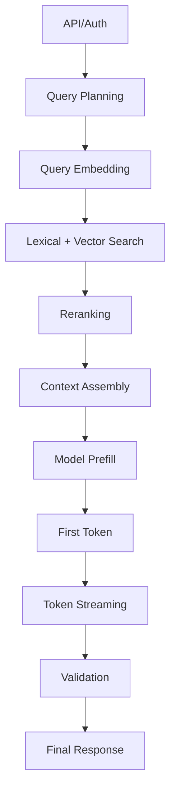
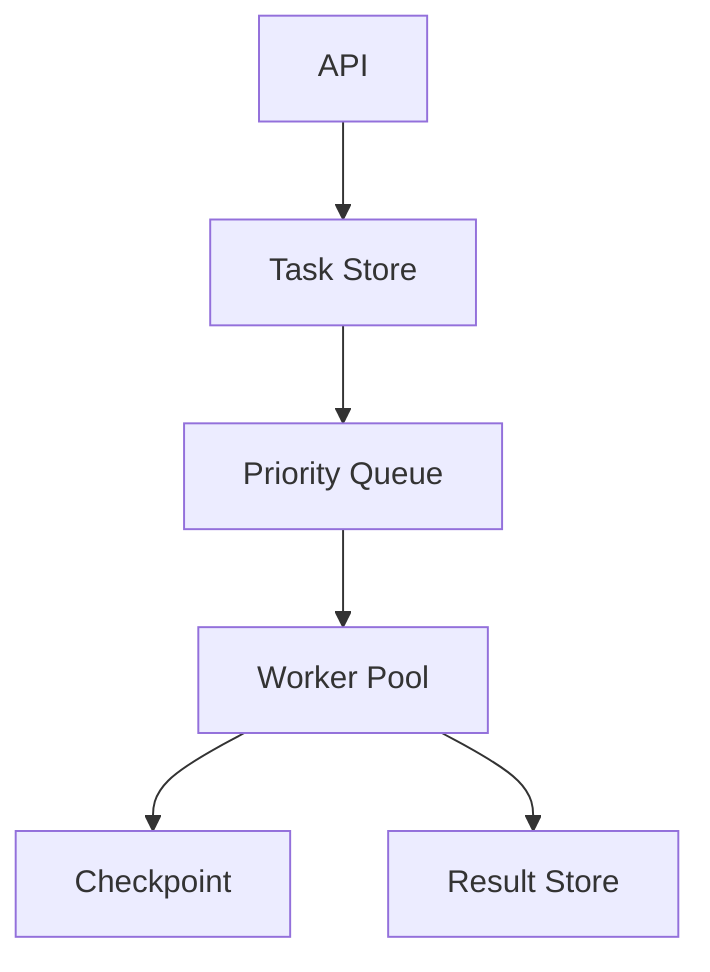
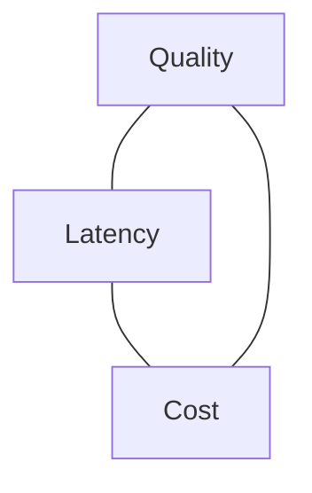

# Part 029 — Latency, Cost, and Throughput Engineering

## 1. Why This Part Matters

AI applications are expensive distributed systems with user-facing latency.

A traditional API might spend most time in:

- database query;
- cache lookup;
- business logic;
- network calls.

An AI application may spend most time and cost in:

- prompt construction;
- embedding call;
- vector search;
- reranking;
- model prefill;
- model generation;
- tool calls;
- judge calls;
- retries;
- agent loops;
- validation/repair.

A small design mistake can multiply cost.

Examples:

- adding 20 retrieved chunks to every prompt;
- using a frontier model for low-risk classification;
- reranking 200 candidates for every query;
- allowing an agent to call tools without step budget;
- running judge on every request synchronously;
- not caching stable prompt prefixes;
- streaming late because retrieval is slow;
- retrying failed model calls without budget.

The central invariant:

> Every AI feature should have an explicit latency, cost, and quality budget.

Without budgets, you cannot make engineering trade-offs.

---

## 2. Target Skill

After this part, you should be able to:

- decompose AI latency into stage-level timings;
- reason about time-to-first-token, time-to-last-token, and perceived latency;
- estimate token cost per task;
- control prompt/context growth;
- choose models by task, risk, and budget;
- design caching strategies safely;
- use streaming without hiding backend inefficiency;
- manage concurrency and throughput;
- apply batching where appropriate;
- use queues for long-running tasks;
- build capacity plans and cost dashboards;
- design release gates for latency and cost.

---

## 3. Latency Anatomy of an AI Request

A RAG request may look like this:



Latency components:

| Component | Typical Cause |
|---|---|
| API/auth | middleware, identity lookup |
| query planning | model/rule planner |
| embedding | remote embedding provider |
| search | vector DB + filters |
| reranking | cross-encoder/model judge |
| context assembly | token counting, formatting |
| prefill | model processes input tokens |
| generation | output token generation |
| validation | schema/grounding/citation checks |
| tool calls | external systems |
| retries | transient failure handling |

If you only measure total latency, you cannot optimize intelligently.

---

## 4. Latency Metrics

Track several latency metrics.

| Metric | Meaning |
|---|---|
| TTFT | time to first token |
| TTLT | time to last token |
| p50 latency | typical experience |
| p95 latency | tail user experience |
| p99 latency | worst normal operating experience |
| queue wait time | time before work starts |
| model latency | model call duration |
| retrieval latency | search + rerank duration |
| validation latency | post-generation checks |
| tool latency | external tool calls |

For streaming apps, TTFT strongly affects perceived responsiveness.

For transactional workflows, TTLT and correctness matter more.

---

## 5. Cost Anatomy

AI cost is often driven by tokens and calls.

Cost dimensions:

- input tokens;
- output tokens;
- cached input tokens;
- embedding tokens;
- reranker calls;
- judge calls;
- tool/API costs;
- vector DB cost;
- queue/worker cost;
- storage cost;
- observability cost;
- human review cost.

Cost per task:

```text
total_task_cost =
  model_generation_cost
+ embedding_cost
+ reranking_cost
+ judge_cost
+ tool_cost
+ infra_cost
+ human_review_cost
```

Do not optimize only model generation if reranking or judge calls dominate.

---

## 6. Token Economics

Input tokens come from:

- system instructions;
- developer instructions;
- user message;
- conversation history;
- retrieved evidence;
- tool definitions;
- tool results;
- output schema;
- memory;
- hidden context wrappers.

Output tokens come from:

- answer;
- reasoning-like intermediate output if exposed;
- structured JSON;
- citations;
- verbose explanations;
- repair attempts.

Large prompts increase:

- cost;
- prefill latency;
- memory pressure;
- failure surface;
- chance of irrelevant context;
- prompt injection exposure.

A top-tier engineer treats token budget like heap memory or database query budget.

---

## 7. Token Budget Design

Create budgets by feature.

Example:

| Feature | Input Budget | Output Budget |
|---|---:|---:|
| classification | 1k | 100 |
| short answer | 4k | 500 |
| RAG policy answer | 12k | 1k |
| case review draft | 24k | 2k |
| long document summary | 64k | 4k |
| agent step decision | 8k | 300 |

Budget should be enforced.

```python
from pydantic import BaseModel


class TokenBudget(BaseModel):
    max_input_tokens: int
    max_output_tokens: int
    max_context_tokens: int
    max_tool_result_tokens: int
    max_conversation_tokens: int
```

A context builder should refuse or degrade when budget is exceeded.

---

## 8. Context Compression

Techniques:

### 8.1 Select Less

Best compression is not adding irrelevant content.

- reduce top-k;
- use reranker;
- filter by metadata;
- prefer answer-bearing chunks;
- avoid duplicate chunks.

### 8.2 Summarize

Summarize previous turns or tool outputs.

Risk:

- summaries are lossy;
- source references must remain;
- critical facts need validation.

### 8.3 Structure

Structured evidence is more efficient than raw dumps.

```text
Evidence E1:
- Source: Active Escalation Policy
- Rule: repeat breach within 90 days requires escalation
- Citation: policy-enf-4.2
```

### 8.4 Use Parent-Child Carefully

Retrieve child chunks, include parent only when needed.

### 8.5 Cache Stable Prefixes

Stable system instructions and tool schemas can benefit from prompt caching where provider supports it.

---

## 9. Prompt Caching

Prompt caching reduces cost/latency when repeated prompt prefixes are stable.

Good candidates:

- system instructions;
- developer instructions;
- tool schemas;
- stable rubric;
- long static policy context;
- repeated workflow instructions.

Poor candidates:

- dynamic user data;
- rapidly changing tool results;
- per-user sensitive context;
- random ordering of tools/evidence;
- volatile timestamps at the top of prompt.

Design rule:

> Put stable reusable content early and dynamic content later.

This improves cache hit likelihood for prefix-based caching systems.

But cache safety matters:

- include tenant/security in cache keys when application-level caching;
- do not share sensitive context unsafely;
- understand provider caching policy;
- trace cached token usage;
- do not rely on caching for correctness.

---

## 10. Model Routing for Cost and Latency

Not every task needs the strongest model.

Route by:

- task complexity;
- risk level;
- required schema reliability;
- latency budget;
- context length;
- cost budget;
- user tier;
- data policy.

Example routing:

| Task | Model Strategy |
|---|---|
| intent classification | small/fast model or deterministic rules |
| query rewrite | small model |
| low-risk summary | economical model |
| high-risk case recommendation | stronger model + validation |
| judge critical answer | calibrated judge model |
| fallback during outage | approved secondary model |
| extraction with strict schema | model with strong structured output reliability |

Routing logic should be explicit and traced.

```python
class ModelRoute(BaseModel):
    task_type: str
    risk_level: str
    model_name: str
    max_input_tokens: int
    max_output_tokens: int
    requires_validation: bool
```

---

## 11. Cost Guardrails

Use cost guardrails at several levels.

| Level | Guardrail |
|---|---|
| request | max tokens, max model calls |
| user | daily/monthly quota |
| tenant | budget limit |
| feature | cost per task budget |
| agent run | max steps, max tool calls |
| eval | separate budget |
| provider | rate/cost alert |

Example:

```python
class CostBudget(BaseModel):
    max_cost_per_request_usd: float
    max_cost_per_run_usd: float
    max_model_calls: int
    max_judge_calls: int
```

If budget is exceeded:

- stop;
- ask user to narrow scope;
- queue for batch;
- degrade to cheaper path;
- require approval for costly run.

---

## 12. Streaming

Streaming improves perceived latency.

It does not reduce total compute cost.

Streaming helps when:

- generation is long;
- retrieval is already done;
- user benefits from incremental output;
- answer can be safely streamed before final validation.

Streaming is risky when:

- output requires full validation before display;
- citations may be generated late;
- safety checks happen after generation;
- tool results may change answer;
- answer status may become refusal after partial text.

For high-risk answers, consider:

- stream progress events, not final answer text;
- stream only after validation;
- stream draft with clear status;
- buffer until citation/grounding validation passes.

---

## 13. Streaming Event Design

Instead of streaming raw tokens only, stream structured events.

```python
class StreamEvent(BaseModel):
    event_type: str
    payload: dict[str, object]
```

Examples:

```text
retrieval_started
retrieval_completed
generation_started
token_delta
citation_ready
validation_started
final_answer
error
```

This improves UX and debuggability.

For case-management workflows, progress events can be more appropriate than unvalidated answer tokens.

---

## 14. Time-to-First-Token vs Time-to-First-Useful-Token

TTFT can be misleading.

If the first token arrives quickly but the answer is wrong or later corrected, UX suffers.

Define:

```text
TTFT = first generated token
TTFUT = first token that belongs to the final valid answer
```

For high-risk AI:

- retrieval and validation may need to happen before answer streaming;
- a progress stream may be safer;
- final answer may appear later but be trustworthy.

Optimize perceived latency without compromising correctness.

---

## 15. Retrieval Performance

Retrieval latency contributors:

- embedding call;
- lexical search;
- vector search;
- metadata filters;
- reranking;
- network latency;
- index size;
- candidate count;
- tenant partitioning;
- cold caches.

Optimizations:

- parallel lexical/vector search;
- cache query embeddings;
- reduce candidate_k;
- skip reranking for exact lookup;
- pre-filter by tenant/source;
- partition by tenant or domain;
- optimize metadata indexes;
- use approximate nearest neighbor tuning;
- avoid huge top-k;
- use source diversity before rerank.

Trace before tuning.

---

## 16. Reranking Cost

Reranking is powerful but expensive.

Control it:

- rerank only top N;
- skip rerank for exact identifier queries;
- use cheaper reranker for low-risk tasks;
- use metadata boosts before rerank;
- cache rerank for stable public queries;
- route high-risk queries to stronger rerank.

Example adaptive policy:

```python
def choose_rerank_k(query_type: str, risk_level: str) -> int:
    if query_type == "exact_lookup":
        return 10

    if risk_level in {"high", "critical"}:
        return 80

    return 40
```

---

## 17. Agent Cost Control

Agents can explode cost because they call models repeatedly.

Controls:

- max steps;
- max model calls;
- max tool calls;
- max cost per run;
- planning budget;
- no repeated same tool with same args;
- stop when evidence sufficient;
- use deterministic router where possible;
- summarize state carefully;
- do not use multi-agent without baseline.

Agent trace should show:

```text
step_count
model_calls
tool_calls
tokens_by_step
cost_by_step
```

If you cannot attribute agent cost by step, you cannot optimize it.

---

## 18. Batching

Batching can improve throughput.

Good for:

- offline embedding jobs;
- eval runs;
- document ingestion;
- batch classification;
- human review pre-processing;
- low-priority summarization.

Risky for:

- interactive chat;
- personalized permission-sensitive tasks;
- high-priority workflows;
- external side-effect tools.

Batching trade-off:

- higher throughput;
- lower per-item overhead;
- increased waiting latency;
- larger failure blast radius.

Use separate queues for batch workloads.

---

## 19. Concurrency

Concurrency must be bounded.

Use semaphores for model calls, embedding calls, reranker calls, and tools.

```python
import asyncio


class BoundedModelClient:
    def __init__(self, client: "ModelClient", max_concurrency: int) -> None:
        self.client = client
        self.sem = asyncio.Semaphore(max_concurrency)

    async def generate(self, *args, **kwargs):
        async with self.sem:
            return await self.client.generate(*args, **kwargs)
```

Concurrency limits should be per:

- provider;
- model;
- tenant;
- feature;
- tool;
- worker pool.

Unbounded concurrency creates rate-limit storms and cascading failures.

---

## 20. Throughput and Capacity Planning

Capacity planning asks:

```text
How many requests/tasks can the system handle while meeting latency and cost goals?
```

Inputs:

- requests per second;
- average model calls per request;
- p95 model latency;
- token usage;
- provider rate limits;
- vector DB QPS;
- tool QPS;
- worker concurrency;
- queue depth;
- average cost per request;
- peak multiplier.

Example:

```text
100 user requests/min
average 1.5 model calls/request
average 8k input tokens + 800 output tokens
rerank on 60% requests
p95 model latency 4s
```

From this, plan:

- model concurrency;
- retrieval capacity;
- worker count;
- budget;
- fallback thresholds.

---

## 21. Queueing

Use queues when work is:

- long-running;
- expensive;
- batchable;
- non-interactive;
- retryable;
- approval-dependent;
- tool-heavy.

Queue metrics:

- enqueue rate;
- dequeue rate;
- queue depth;
- oldest message age;
- worker utilization;
- retry count;
- DLQ count.

Queue design:



Interactive requests should not wait behind batch jobs.

Use priority queues or separate queues.

---

## 22. Caching Layers

Potential caches:

| Cache | Key Must Include |
|---|---|
| prompt prefix cache | provider-dependent |
| query embedding cache | normalized query + embedding model |
| retrieval result cache | query + index + security context |
| source metadata cache | source ID + version |
| tool result cache | tool args + tenant + permission |
| generated answer cache | dangerous; include many versions/security fields |
| eval result cache | example + app/model/prompt/index versions |

Generated answer caching is risky for permission-sensitive systems.

Prefer caching intermediate safe artifacts.

---

## 23. Cache Invalidation

Cache invalidation triggers:

- source document updated;
- index version changed;
- ACL changed;
- user role changed;
- prompt version changed;
- model version changed;
- tool output version changed;
- case status changed;
- policy superseded.

For regulated systems, stale cache can cause wrong decisions.

Use conservative TTLs for high-risk data.

---

## 24. Latency-Cost-Quality Trade-Off

Most AI optimization is a triangle.



Examples:

- stronger model improves quality but costs more;
- larger context improves recall but increases latency/cost;
- reranker improves precision but adds latency;
- judge improves safety but adds cost;
- caching lowers latency/cost but creates staleness/privacy risks;
- multi-agent improves decomposition but increases coordination cost.

Engineering judgment means choosing the correct trade-off for the use case.

---

## 25. Performance Budgets by Risk

Low-risk:

- cheap model;
- small context;
- no judge;
- fast fallback;
- lower citation strictness if not factual.

Medium-risk:

- RAG with citations;
- moderate model;
- validation;
- rerank if needed.

High-risk:

- stronger model;
- strict evidence;
- claim validation;
- human approval;
- no unsafe fallback;
- higher latency acceptable.

Risk should influence performance budget.

Do not optimize high-risk workflows into unsafe shortcuts.

---

## 26. Load Testing AI Apps

Load tests should simulate:

- model latency;
- provider rate limits;
- retrieval latency;
- tool latency;
- streaming clients;
- queue workloads;
- failures and retries;
- burst traffic;
- tenant distribution.

Use fake/stub providers for high-volume load tests.

Measure:

- p50/p95/p99 latency;
- error rate;
- timeout rate;
- queue depth;
- cost estimate;
- token usage;
- fallback rate;
- circuit breaker events.

Do not accidentally run huge live-model load tests without budget controls.

---

## 27. Performance Regression Gates

Example gates:

```text
Performance Gates

- p95 RAG latency <= 5s
- p99 API latency <= 12s
- average input tokens <= baseline + 10%
- average output tokens <= baseline + 10%
- cost per successful answer <= budget
- reranker timeout rate <= 1%
- model retry rate <= 2%
- agent average steps <= baseline + 1
- no unbounded context growth
```

Performance regressions are product regressions.

---

## 28. Cost Dashboard

A cost dashboard should show:

- cost by feature;
- cost by tenant;
- cost by model;
- cost by prompt version;
- cost by index version;
- cost by agent workflow;
- tokens by stage;
- judge cost;
- retry cost;
- wasted cost from failed requests;
- cost per successful task;
- cost per human-approved recommendation.

Cost per successful task is more useful than raw spend.

If many requests fail after expensive model calls, quality problems become cost problems.

---

## 29. Optimization Method

Do not optimize randomly.

Use the sequence:

1. measure by stage;
2. identify dominant cost/latency;
3. classify whether it is necessary;
4. remove waste first;
5. optimize architecture second;
6. optimize model choice third;
7. optimize provider/backend last;
8. add regression gate.

Example:

```text
Problem:
p95 latency 12s.

Trace:
generation 7s, rerank 3s, retrieval 1s, validation 1s.

Fix:
reduce output length and skip rerank for exact lookup.

Not first fix:
rewrite whole vector database layer.
```

---

## 30. Case-Management Performance Policy

For regulatory case-management AI:

### Interactive Q&A

- target p95: 5-8s;
- citations required;
- RAG required;
- no final decision side effects.

### Case Review Draft

- can be async;
- target completion: minutes not seconds;
- stronger validation;
- human approval;
- full audit.

### External Notice Draft

- async acceptable;
- strict policy and legal review;
- no direct send without approval.

### Workflow Action

- deterministic preflight;
- idempotency;
- approval;
- audit;
- latency less important than correctness.

Not all AI work should be synchronous chat.

---

## 31. Anti-Patterns

| Anti-Pattern | Why It Fails |
|---|---|
| No cost budget | surprise spend |
| No token tracking | context bloat invisible |
| Frontier model for every task | unnecessary cost |
| Judge every request synchronously | latency/cost explosion |
| Rerank huge candidate sets always | slow and expensive |
| Unbounded agent loops | runaway cost |
| Streaming unsafe drafts | bad partial answers |
| Caching without security key | data leakage |
| Batch jobs share interactive pool | user latency spikes |
| No per-stage timings | blind optimization |
| Only optimize average latency | tail users suffer |
| No performance gates | regressions ship |

---

## 32. Practice: Performance and Cost Lab

Take your RAG + agent practice app.

Add:

1. per-stage latency trace;
2. token counters;
3. cost estimator;
4. model routing policy;
5. context token budget;
6. adaptive rerank policy;
7. query embedding cache;
8. bounded concurrency;
9. queue for long-running case review;
10. performance gates.

Run scenarios:

- exact lookup;
- semantic RAG;
- long case review;
- high-risk recommendation;
- missing evidence;
- prompt injection case;
- multi-agent case review.

Report:

```text
Performance Report

1. Latency by stage
2. Token usage by stage
3. Cost by feature
4. p95/p99 latency
5. Cost per successful task
6. Top waste sources
7. Optimization applied
8. Regression gates
```

---

## 33. Engineering Heuristics

1. Measure latency by stage.
2. Track TTFT and TTLT separately.
3. Track cost per successful task.
4. Enforce token budgets.
5. Use cheaper models for simple tasks.
6. Route high-risk tasks to stronger models and validation.
7. Use streaming carefully for high-risk answers.
8. Cache stable safe content.
9. Include security context in cache keys.
10. Bound concurrency per dependency.
11. Separate interactive and batch queues.
12. Avoid unbounded agent loops.
13. Skip expensive stages when query type does not need them.
14. Add performance regression gates.
15. Optimize after tracing, not before.

---

## 34. Summary

Latency, cost, and throughput are architecture concerns.

The core invariant:

> AI quality must be delivered within explicit time, token, cost, and capacity budgets.

A top-tier AI application engineer can explain:

- why a request is slow;
- why a feature is expensive;
- which stage dominates cost;
- which optimization preserves correctness;
- which fallback is safe;
- which workload should be async;
- which model should handle which task.

In the next part, we move into **Security Threat Modeling for LLM Apps**.
