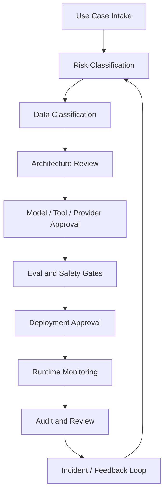
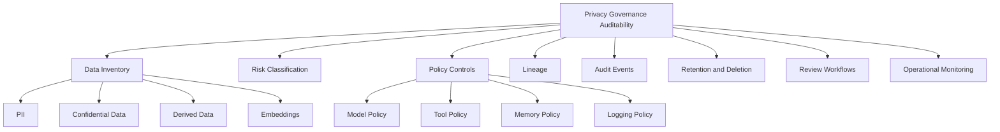
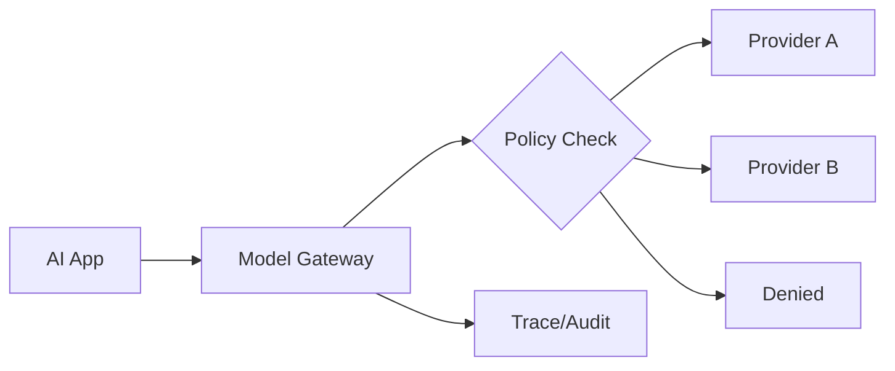
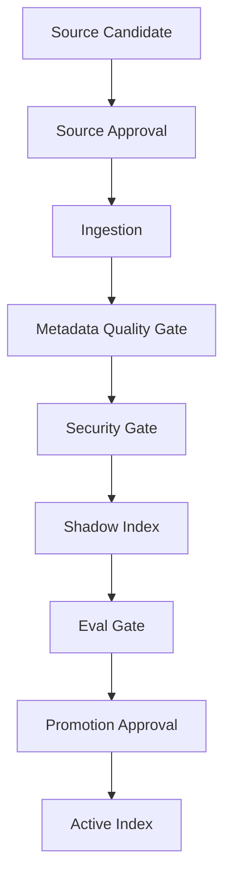
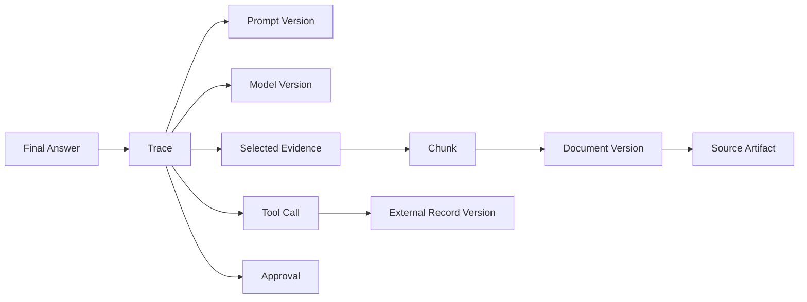
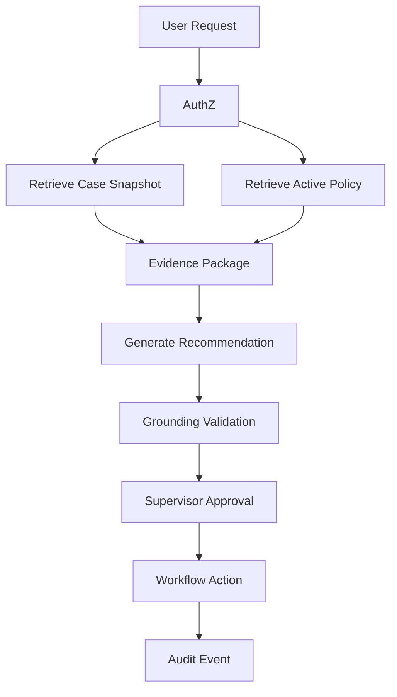

# Part 031 — Privacy, Governance, and Auditability

## 1. Why This Part Matters

Security asks:

> Can attackers or unauthorized users abuse the system?

Privacy asks:

> Are we collecting, processing, storing, exposing, and deleting personal or sensitive data appropriately?

Governance asks:

> Who decides what the AI system is allowed to do, how it is evaluated, and how risks are managed?

Auditability asks:

> Can we reconstruct and defend what happened?

For production AI applications, especially enterprise and case-management systems, these are not optional.

A model-generated answer can affect:

- customer trust;
- internal decisions;
- compliance posture;
- regulatory defensibility;
- case outcomes;
- employee workflows;
- legal exposure;
- data-subject rights;
- institutional accountability.

The central invariant:

> A production AI system must be able to explain not only what it answered, but what data, policy, permission, model, prompt, tool, and human approval path produced that answer.

This part turns privacy/governance/auditability into engineering architecture.

---

## 2. Target Skill

After this part, you should be able to:

- classify data used by AI systems;
- design privacy-aware prompt, retrieval, memory, and trace pipelines;
- minimize sensitive data exposure to models and tools;
- define retention and deletion behavior;
- track data lineage from source to answer;
- build audit records for RAG, tools, and agents;
- govern model/provider usage;
- govern prompts, tools, eval datasets, and indexes;
- design review workflows for high-risk AI changes;
- support incident review and regulatory defensibility.

---

## 3. Governance Mental Model

A governed AI system has controls across the lifecycle.



Governance should not be a PDF that nobody reads.

It should be embedded in:

- schemas;
- policy checks;
- CI/CD gates;
- tool registries;
- model gateways;
- audit logs;
- eval reports;
- approval workflows;
- dashboards;
- incident runbooks.

---

## 4. Kaufman Deconstruction

Break governance into trainable subskills.



Deliberate practice:

1. pick an AI feature;
2. map data flows;
3. classify data;
4. define retention;
5. define audit events;
6. define approval gate;
7. simulate incident;
8. check if audit trail is enough.

---

## 5. Data Inventory

Start with a data inventory.

AI apps often touch more data than expected.

| Data Category | Examples |
|---|---|
| User input | chat messages, uploaded files |
| Conversation state | prior turns, clarifications |
| Source documents | policies, manuals, evidence |
| Retrieved chunks | passages entering prompt |
| Tool inputs | case IDs, filters, action payloads |
| Tool outputs | case facts, search results |
| Model inputs | rendered prompts, schemas |
| Model outputs | answers, JSON, tool proposals |
| Memory | preferences, summaries, durable facts |
| Traces | prompt hashes, evidence IDs, tool records |
| Eval datasets | examples, outputs, labels |
| Audit events | source/citation/action records |
| Embeddings | vector representations of text |

Important:

> Derived data can still be sensitive.

Embeddings, summaries, traces, and eval examples may contain or reveal sensitive information.

---

## 6. Data Classification

Define classification levels.

Example:

| Classification | Description | Example |
|---|---|---|
| Public | safe for public disclosure | public docs |
| Internal | internal business info | internal FAQ |
| Confidential | restricted business/user info | case summaries |
| Restricted | highly sensitive/regulatory/legal | evidence, sanctions, legal advice |

Classification should flow through:

- source records;
- chunks;
- embeddings;
- retrieval filters;
- tool outputs;
- prompt context;
- traces;
- caches;
- eval datasets;
- memory.

```python
from typing import Literal
from pydantic import BaseModel


Classification = Literal["public", "internal", "confidential", "restricted"]


class ClassifiedDataRef(BaseModel):
    ref_id: str
    data_type: str
    classification: Classification
    tenant_id: str
    source_system: str
    owner_team: str
```

Do not classify only original documents.

Classify derived artifacts too.

---

## 7. Personal and Sensitive Data

AI apps may process:

- names;
- emails;
- phone numbers;
- addresses;
- IDs;
- account numbers;
- case details;
- allegations;
- evidence;
- health/financial/legal details;
- employee records;
- behavioral data;
- conversation content.

Privacy controls:

- minimize collection;
- limit purpose;
- restrict access;
- redact where possible;
- define retention;
- support deletion where applicable;
- audit access;
- review provider/data transfer implications;
- avoid using sensitive data in evals unless governed.

---

## 8. Data Minimization

Minimization means:

> Use the least data needed to achieve the task.

Bad prompt:

```text
Here is the entire case file. Decide what to do.
```

Better:

```text
Here are the specific case facts needed for escalation analysis:
- violation type
- event dates
- evidence completeness status
- prior breach count
- applicable policy evidence IDs
```

Minimize:

- prompt inputs;
- retrieved context;
- tool outputs;
- model outputs;
- logs;
- traces;
- memory;
- eval examples.

Do not send raw large objects to a model when structured facts are enough.

---

## 9. Purpose Limitation

A system should know why data is being used.

Example purposes:

- answer user question;
- draft internal summary;
- generate recommendation;
- evaluate system quality;
- audit prior answer;
- debug incident;
- train/fine-tune model;
- improve retrieval.

Purpose matters because allowed processing may differ.

```python
class ProcessingPurpose(BaseModel):
    purpose_id: str
    name: str
    allowed_data_classes: list[Classification]
    allowed_model_providers: list[str]
    retention_days: int
    requires_human_approval: bool
```

Do not reuse production case data for eval or model training without governance approval.

---

## 10. Consent and Notice

Depending on domain and policy, users may need notice or consent for:

- AI assistance;
- data sent to third-party providers;
- storage of conversation history;
- durable memory;
- human review;
- quality sampling;
- model improvement;
- sensitive data processing.

Engineering implications:

- feature flags;
- consent records;
- model routing based on consent;
- memory write policy;
- review queue exclusions;
- data export/deletion support.

```python
class ConsentRecord(BaseModel):
    subject_id: str
    tenant_id: str
    consent_type: str
    granted: bool
    version: str
    timestamp: str
```

Consent should be checked by code where relevant, not only documented.

---

## 11. Provider Governance

Model/provider choice is a governance decision.

Review:

- data processing terms;
- retention policy;
- training/use of inputs;
- region/data residency;
- security certifications;
- logging behavior;
- subprocessor chain;
- model availability;
- incident process;
- contractual restrictions;
- approved data classifications.

```python
class ProviderPolicy(BaseModel):
    provider_name: str
    approved_models: list[str]
    allowed_classifications: list[Classification]
    allowed_regions: list[str]
    may_process_pii: bool
    may_process_restricted_data: bool
    retention_policy: str
    approved_for_training_data_use: bool = False
```

The model gateway should enforce provider policy.

---

## 12. Model Gateway Governance

A model gateway centralizes model calls.

Responsibilities:

- provider allowlist;
- model allowlist;
- classification checks;
- tenant policy;
- prompt logging policy;
- token/cost limits;
- output schema enforcement;
- routing;
- fallback policy;
- audit and trace.



Do not let every service call arbitrary models directly.

---

## 13. Prompt Governance

Prompts are production artifacts.

Govern:

- prompt ID;
- version;
- owner;
- purpose;
- risk level;
- approved model families;
- expected output schema;
- eval dataset;
- review status;
- change history.

```python
class PromptManifest(BaseModel):
    prompt_id: str
    version: str
    owner_team: str

    purpose: str
    risk_level: str
    approved_models: list[str]
    output_schema_id: str | None = None

    eval_dataset_ids: list[str]
    reviewed_by: list[str] = []
    approved: bool = False
```

Prompt changes can change system behavior.

Treat them like code changes.

---

## 14. Tool Governance

Tools need governance because they create authority.

Tool governance includes:

- owner;
- side-effect level;
- data access scope;
- approval requirement;
- allowed roles;
- allowed workflows;
- audit requirement;
- kill switch;
- versioning;
- security review.

```python
class ToolGovernanceRecord(BaseModel):
    tool_name: str
    version: str
    owner_team: str

    side_effect_level: str
    risk_level: str
    allowed_roles: list[str]
    allowed_workflows: list[str]

    requires_approval: bool
    audit_required: bool
    security_review_id: str | None = None
    enabled: bool = True
```

A model should only see tools that governance policy allows for the current context.

---

## 15. RAG Governance

RAG governance controls source knowledge.

Questions:

- Which sources may be ingested?
- Who owns each source?
- Is the source authoritative?
- Is it draft, active, superseded, archived?
- What is its classification?
- What ACL applies?
- What retention applies?
- How are updates detected?
- How are deletions propagated?
- What evals protect retrieval quality?
- Who approves index promotion?

Governed RAG pipeline:



---

## 16. Embedding Governance

Embeddings are derived data.

Govern:

- embedding provider;
- data classifications allowed;
- embedding model version;
- vector store access;
- tenant isolation;
- deletion propagation;
- retention;
- encryption;
- index sharing;
- export restrictions.

Embedding records should include:

```python
class GovernedEmbeddingRecord(BaseModel):
    embedding_id: str
    source_ref: str
    tenant_id: str
    classification: Classification

    embedding_model: str
    embedding_provider: str
    embedding_policy_id: str

    created_at: str
    expires_at: str | None = None
    deleted_at: str | None = None
```

Do not forget that embeddings may encode sensitive text.

---

## 17. Memory Governance

Durable memory is high-risk.

Govern:

- who can create memory;
- what types are allowed;
- required consent;
- allowed scope;
- retention;
- deletion;
- review;
- provenance;
- correction;
- tenant isolation.

Rules:

- model may propose memory;
- policy approves memory;
- memory has provenance;
- sensitive memory is restricted or rejected;
- global memory requires review;
- stale memory expires;
- user/case memory can be deleted according to policy.

---

## 18. Eval Dataset Governance

Eval datasets may contain sensitive data.

Govern:

- source of examples;
- consent/purpose;
- anonymization;
- classification;
- retention;
- reviewer access;
- model/provider use;
- sharing restrictions;
- dataset version;
- owner;
- review status.

Do not casually copy production conversations into eval files.

Use:

- redaction;
- synthetic examples;
- minimized snippets;
- source references instead of raw content;
- secure review workflows.

---

## 19. Auditability

Auditability means reconstructing important decisions and actions.

For AI apps, audit should answer:

- who initiated the request?
- what was the user allowed to access?
- what data was retrieved?
- what sources were cited?
- which model and prompt were used?
- which tools were called?
- were side effects performed?
- was approval required?
- who approved?
- what validation passed/failed?
- what answer was shown?
- when did it happen?

This is different from generic logging.

Audit records must be structured, durable, access-controlled, and retention-managed.

---

## 20. Audit Event Schema

```python
class AiAuditEvent(BaseModel):
    audit_event_id: str
    timestamp: str

    tenant_id: str
    actor_user_id: str | None = None
    request_id: str
    trace_id: str

    feature: str
    action_type: str

    data_refs_accessed: list[str] = []
    source_ids_retrieved: list[str] = []
    source_ids_cited: list[str] = []

    model_provider: str | None = None
    model_name: str | None = None
    prompt_id: str | None = None
    prompt_version: str | None = None

    tool_calls: list[str] = []
    approval_id: str | None = None

    answer_status: str | None = None
    risk_level: str | None = None

    policy_decision_refs: list[str] = []
```

Keep raw content out unless required and approved.

Use references/hashes where possible.

---

## 21. Lineage

Lineage connects answer to source data.



Lineage is required for:

- debugging;
- audit;
- incident response;
- legal defensibility;
- deletion impact analysis;
- eval failure attribution;
- model/prompt regression analysis.

---

## 22. Retention Policy

Retention must differ by artifact.

| Artifact | Retention Consideration |
|---|---|
| raw user message | privacy and support needs |
| prompt | may contain sensitive data |
| prompt hash | lower sensitivity |
| model output | user-visible record |
| retrieval trace | source/citation defensibility |
| tool trace | side-effect audit |
| audit event | compliance retention |
| eval example | dataset governance |
| memory | consent/purpose |
| embeddings | derived sensitive data |
| cache | short TTL |

Do not store everything forever.

Do not delete audit records too early.

Define policy.

---

## 23. Deletion and Data Subject Rights

If deletion is required, derived artifacts may be affected.

Possible derived artifacts:

- conversation messages;
- summaries;
- durable memory;
- embeddings;
- vector index entries;
- prompt logs;
- traces;
- eval examples;
- caches;
- model outputs;
- audit records.

Deletion may conflict with audit/legal retention.

Design states:

- active;
- deletion requested;
- deleted;
- retained under legal basis;
- anonymized;
- redacted.

```python
class DeletionRequest(BaseModel):
    deletion_request_id: str
    subject_id: str
    tenant_id: str
    scope: str
    requested_at: str
    status: str
```

Deletion needs workflow, not ad-hoc scripts.

---

## 24. Legal Hold

Legal hold may override normal deletion.

```python
class LegalHold(BaseModel):
    hold_id: str
    tenant_id: str
    scope: str
    reason: str
    created_at: str
    released_at: str | None = None
```

If legal hold applies:

- prevent deletion;
- mark records;
- restrict access;
- preserve audit;
- document reason.

Engineering systems need to understand hold state.

---

## 25. Governance Release Gates

AI changes should pass gates.

Gate examples:

- prompt version reviewed;
- eval pass rate meets threshold;
- critical failures zero;
- model approved for data classification;
- tool risk reviewed;
- privacy impact review completed;
- logging/redaction tests pass;
- audit events emitted;
- rollback plan exists;
- human approval path tested.

Release gate schema:

```python
class GovernanceGateResult(BaseModel):
    gate_name: str
    passed: bool
    severity: str
    evidence_ref: str | None = None
    reviewer: str | None = None
```

Governance should be executable where possible.

---

## 26. Human Approval and Accountability

For high-risk workflows, human approval should record:

- proposed action;
- evidence;
- model recommendation;
- risk level;
- alternatives;
- approver identity;
- decision;
- timestamp;
- comments.

The human is not merely clicking "OK".

They need enough information to exercise judgment.

Approval should be part of audit lineage.

---

## 27. Case-Management Governance Example

Feature:

```text
AI recommends whether an enforcement case should escalate.
```

Governance requirements:

- case data classification: restricted;
- model provider approved for restricted data;
- source policy must be active;
- RAG citations required;
- evidence completeness check required;
- recommendation cannot close/escalate case directly;
- supervisor approval required for workflow action;
- audit event required;
- eval gate for escalation scenarios required;
- retention follows case retention policy.

Architecture:



This is defensible because policy, evidence, approval, and audit are explicit.

---

## 28. Governance Metrics

Track:

- AI features by risk level;
- model calls by data classification;
- unapproved model usage;
- prompt versions deployed;
- eval gate failures;
- tools by risk level;
- approval bypass attempts;
- audit event completeness;
- data deletion SLA;
- trace redaction failures;
- stale index usage;
- human review backlog;
- incident count by feature.

Governance should be observable.

---

## 29. Governance Runbook

When a governance issue occurs:

1. identify affected feature;
2. identify data classifications involved;
3. freeze traces/audit records;
4. identify model/provider/prompt/index/tool versions;
5. determine affected users/tenants;
6. check whether data was exposed or action taken;
7. disable unsafe path if needed;
8. notify governance/security/privacy owners;
9. correct data/model/tool/prompt;
10. add eval/security/regression test;
11. document residual risk.

---

## 30. Design Review Checklist

Before shipping:

- What data is processed?
- What classifications apply?
- What is the purpose?
- Is consent/notice required?
- Which providers process the data?
- Are providers approved?
- What prompts are used?
- Are prompts versioned and reviewed?
- Which tools are exposed?
- Are tools risk-classified?
- Is RAG source authority modeled?
- Is ACL enforced before retrieval?
- Are embeddings governed?
- Is durable memory allowed?
- What is retained?
- What can be deleted?
- What is under audit?
- Are eval datasets governed?
- Are human approvals required?
- Can we reconstruct a decision?
- Can we respond to an incident?

---

## 31. Anti-Patterns

| Anti-Pattern | Why It Fails |
|---|---|
| Governance as spreadsheet only | not enforced |
| No data inventory | unknown risk |
| Raw production data in evals | privacy risk |
| No provider policy | accidental data transfer |
| Unversioned prompts | behavior not auditable |
| Ungoverned tools | excessive authority |
| Vector DB as source of truth | deletion/lineage failure |
| Store all traces forever | privacy risk |
| Delete all traces immediately | no auditability |
| Memory without consent/provenance | privacy/governance risk |
| Approval outside workflow | weak accountability |
| No release gates | risky changes ship |

---

## 32. Practice: Governance Review

Take your RAG + agent case assistant.

Produce:

1. data inventory;
2. data classification map;
3. provider policy;
4. prompt manifest;
5. tool governance records;
6. RAG source governance;
7. embedding governance;
8. memory policy;
9. audit event schema;
10. retention matrix;
11. deletion workflow;
12. release gates;
13. incident runbook.

Deliverable:

```text
AI Governance Review

1. Use case and risk level
2. Data inventory
3. Data classification
4. Provider/model policy
5. Prompt/tool/index governance
6. Privacy controls
7. Retention/deletion policy
8. Auditability design
9. Release gates
10. Residual risks
```

---

## 33. Engineering Heuristics

1. Inventory data before designing prompts.
2. Classify derived artifacts, not only source data.
3. Minimize data sent to models.
4. Enforce provider policy in the model gateway.
5. Version prompts, tools, indexes, models, and eval datasets.
6. Govern embeddings as sensitive derived data.
7. Treat eval datasets as governed data assets.
8. Persist audit events for high-risk actions.
9. Use references and hashes instead of raw sensitive logs.
10. Define retention by artifact type.
11. Make deletion propagation explicit.
12. Keep approval inside workflow state.
13. Make governance gates executable.
14. Track lineage from answer to source.
15. Design for incident review before the incident.

---

## 34. Summary

Privacy, governance, and auditability turn AI from a clever feature into an accountable system.

The core invariant:

> A production AI system must know what data it used, why it used it, who was allowed to use it, which model/tool/prompt processed it, what output was produced, and how that output can be audited or challenged.

This requires:

- data inventory;
- classification;
- minimization;
- provider policy;
- prompt/tool/index governance;
- memory governance;
- retention/deletion workflows;
- audit events;
- lineage;
- release gates;
- incident response.

In the next part, we move to **Deployment Architecture and Runtime Operations**.
