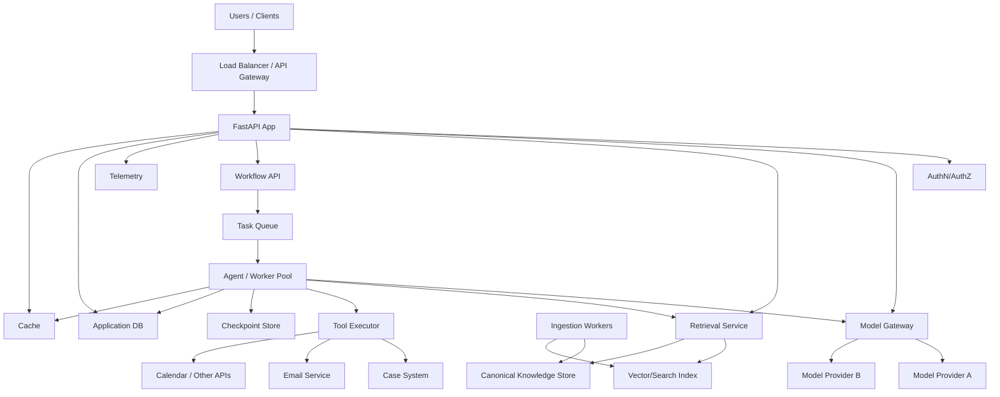
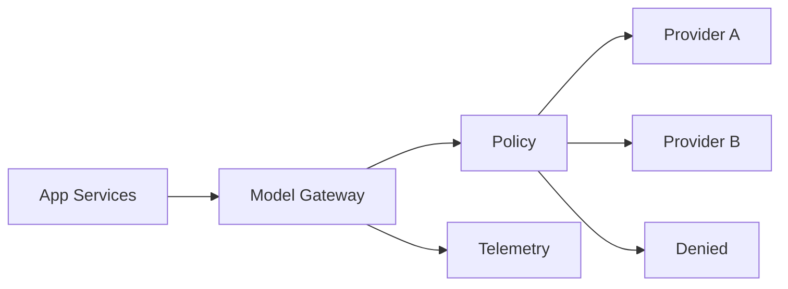
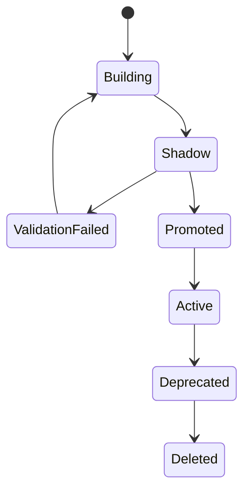
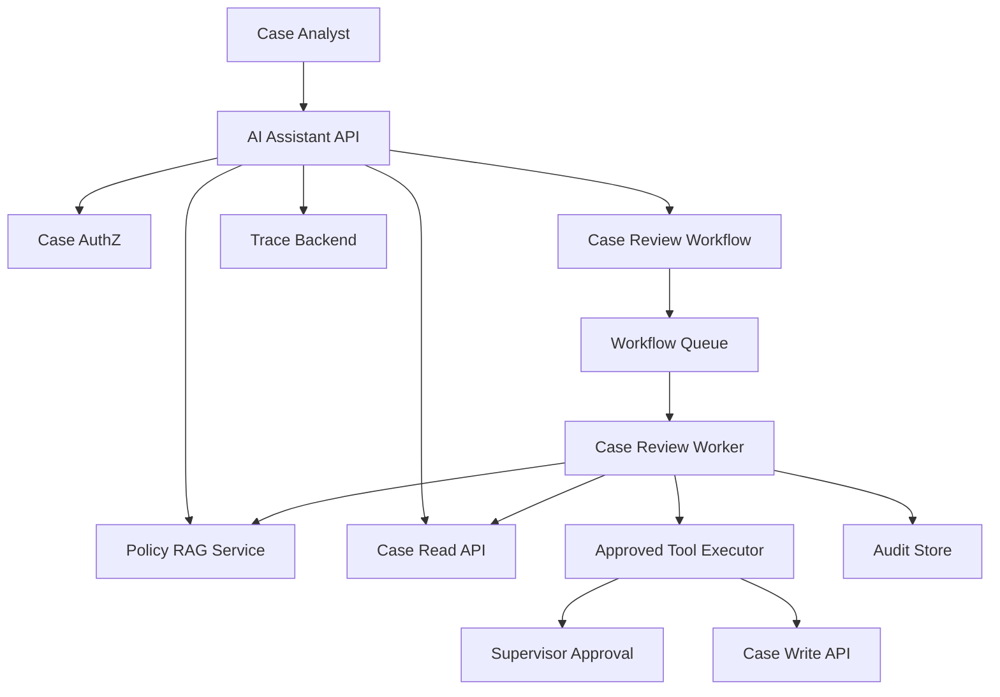

# Part 032 — Deployment Architecture and Runtime Operations

## 1. Why This Part Matters

An AI application is not production-ready because it runs locally.

Production requires:

- API deployment;
- model gateway;
- retrieval service;
- worker processes;
- queues;
- vector/search infrastructure;
- databases;
- object storage;
- secret management;
- observability;
- model/provider routing;
- rollout and rollback;
- scaling;
- incident response;
- data governance;
- cost control.

AI systems are operationally more complex than ordinary CRUD services because they depend on probabilistic and remote components.

A production deployment must handle:

- model provider failures;
- vector index rollout;
- prompt version rollout;
- tool version rollout;
- agent workflow migration;
- long-running task recovery;
- eval gates;
- high cost;
- data privacy;
- security boundaries;
- human approvals.

The central invariant:

> Deployment architecture must preserve the same safety, reliability, observability, and governance guarantees that the application design assumes.

---

## 2. Target Skill

After this part, you should be able to:

- design service topology for Python AI applications;
- separate API, model gateway, retrieval, ingestion, and worker responsibilities;
- deploy RAG indexes safely with shadow/promote/rollback flows;
- operate agent workers and long-running tasks;
- use queues and checkpoints for durable execution;
- configure health checks and readiness gates;
- manage secrets and provider credentials;
- design rollout/rollback for prompts, models, tools, and indexes;
- scale API and worker components;
- define SLOs, alerts, and runbooks;
- operate AI systems under production constraints.

---

## 3. Reference Deployment Topology



This topology separates concerns.

Do not force every responsibility into one web process.

---

## 4. Service Responsibilities

| Service | Responsibility |
|---|---|
| API service | user requests, auth context, response streaming |
| Model gateway | provider policy, routing, cost limits, tracing |
| Retrieval service | query planning, search, rerank, evidence package |
| Ingestion workers | parse, chunk, embed, index |
| Agent workers | long-running tasks, tools, approvals |
| Tool executor | authorization, side effects, audit |
| Checkpoint store | durable workflow state |
| Audit service/store | accountability records |
| Eval service/runner | offline/CI quality checks |
| Observability stack | traces, metrics, logs |
| Admin console | operations, review, incident tools |

Small systems can combine some services.

But boundaries should remain clear in code.

---

## 5. Monolith vs Modular Services

### 5.1 Modular Monolith

Good starting point:

```text
one deployable app
clear internal modules:
- api
- model_gateway
- retrieval
- ingestion
- tools
- workflows
- evals
```

Pros:

- simpler operations;
- fewer network calls;
- easier development;
- good for small teams.

Cons:

- harder independent scaling;
- larger blast radius;
- background tasks need care.

### 5.2 Distributed Services

Use when:

- ingestion load is heavy;
- model gateway is shared;
- retrieval needs independent scaling;
- tools have strict security boundary;
- agent workers need queues;
- teams own different services.

Pros:

- independent scaling;
- clearer ownership;
- stronger boundaries.

Cons:

- distributed complexity;
- more tracing needed;
- more deployment coordination.

Start modular. Split when pressure appears.

---

## 6. Runtime Process Types

A production Python AI app often has multiple process types.

```text
web:
  FastAPI / ASGI server

worker:
  queue consumer for long-running tasks

ingestion-worker:
  document parsing, chunking, embedding, indexing

scheduler:
  periodic jobs, re-index, cleanup

eval-runner:
  offline evals / CI evals

admin:
  management console or CLI
```

Each process type has different scaling and failure behavior.

---

## 7. API Runtime

API service should handle:

- auth;
- request validation;
- lightweight orchestration;
- streaming responses;
- short RAG requests;
- task creation for long-running work;
- retrieving task status;
- user feedback;
- trace correlation.

Avoid putting heavy ingestion or long-running agent loops inside request handlers.

For long tasks:

```text
POST /case-review -> returns task_id
GET /case-review/{task_id} -> status/result
```

This avoids HTTP timeout and improves reliability.

---

## 8. Worker Runtime

Workers handle:

- long-running agent workflows;
- retryable tool operations;
- batch summarization;
- human approval resumes;
- scheduled tasks;
- ingestion tasks;
- eval tasks.

Worker requirements:

- idempotent processing;
- checkpointing;
- graceful shutdown;
- concurrency limits;
- queue visibility timeout;
- dead-letter handling;
- trace propagation.

Worker should checkpoint after each important node.

---

## 9. Model Gateway

The model gateway centralizes model usage.

Responsibilities:

- provider allowlist;
- model allowlist;
- data classification policy;
- routing;
- fallback;
- timeout;
- retry;
- token/cost tracking;
- prompt version tracing;
- structured output enforcement;
- redaction;
- audit.



Do not scatter direct provider calls across code.

---

## 10. Retrieval Service

Retrieval service owns:

- query normalization;
- query planning;
- security filters;
- index selection;
- lexical/vector/hybrid search;
- reranking;
- context candidate packaging;
- retrieval trace.

It should not own final answer generation unless you intentionally combine.

Separating retrieval makes RAG failures easier to debug and evaluate.

---

## 11. Ingestion Deployment

Ingestion is operationally heavy.

Stages:

1. fetch source;
2. canonicalize;
3. parse;
4. quality check;
5. chunk;
6. embed;
7. write chunk store;
8. write vector/search index;
9. run eval;
10. promote index.

Ingestion workers should be separate from API workers.

Why?

- parsing/OCR can be CPU-heavy;
- embedding can be rate-limited;
- indexing can be slow;
- failures need quarantine;
- reprocessing should not affect user-facing latency.

---

## 12. Index Deployment

Indexes should have lifecycle.



Deployment steps:

1. build shadow index;
2. validate metadata/ACL;
3. run retrieval evals;
4. compare against active index;
5. promote atomically;
6. monitor;
7. keep rollback index;
8. delete after retention.

Never overwrite active index blindly.

---

## 13. Prompt Deployment

Prompts are deployable artifacts.

Prompt rollout should include:

- version ID;
- changelog;
- eval result;
- approved models;
- rollout percentage;
- rollback version;
- owner.

Prompt rollout strategies:

- all-at-once for low-risk;
- canary for high-risk;
- tenant-specific rollout;
- shadow evaluation;
- A/B test where appropriate.

Prompt change can be as risky as code change.

---

## 14. Tool Deployment

Tool deployment needs compatibility.

Before enabling a tool version:

- schema validated;
- authorization tests pass;
- approval policy configured;
- audit event emitted;
- idempotency supported;
- rollback/disable path exists;
- model-facing description reviewed;
- eval tests updated.

For high-risk tools, use feature flags.

```text
tool.update_case_status.v2.enabled = false
```

Enable only after approval.

---

## 15. Agent Workflow Deployment

Agent workflows are stateful.

Changing workflow while runs are active is tricky.

Strategies:

### 15.1 Versioned Workflow

Each run stores workflow version.

```python
class WorkflowRun(BaseModel):
    run_id: str
    workflow_name: str
    workflow_version: str
    state: dict[str, object]
```

Existing runs continue with old version.

New runs use new version.

### 15.2 Migration

Migrate old state to new schema if needed.

Use only when necessary.

### 15.3 Drain

Stop accepting new runs for old version, let active runs finish.

For high-risk workflows, versioned runs are safest.

---

## 16. Configuration Management

Configuration includes:

- model routing;
- prompt versions;
- index versions;
- tool enablement;
- feature flags;
- timeouts;
- retry policy;
- token budgets;
- cost budgets;
- provider policy;
- risk thresholds.

Configuration should be:

- versioned;
- environment-specific;
- reviewed;
- observable;
- rollback-capable.

Avoid changing critical AI behavior through untracked environment variables.

---

## 17. Secret Management

Secrets include:

- model provider API keys;
- database credentials;
- OAuth tokens;
- tool credentials;
- webhook secrets;
- encryption keys;
- signing keys.

Rules:

- never put secrets in prompts;
- never log secrets;
- use secret manager;
- rotate credentials;
- use least privilege;
- separate dev/staging/prod;
- short-lived tokens where possible;
- restrict worker access by need.

A model should never see API keys.

---

## 18. Environment Separation

Use separate environments:

- local;
- development;
- staging;
- production;
- regulated/sensitive environment if needed.

Staging should have:

- safe test data;
- fake or approved model providers;
- test indexes;
- test tools;
- sandbox side effects;
- eval datasets.

Do not test destructive agent tools against production systems.

---

## 19. Health Checks

Use health checks carefully.

### 19.1 Liveness

Is process alive?

```text
GET /health/live
```

Should not call external dependencies heavily.

### 19.2 Readiness

Can service handle traffic?

```text
GET /health/ready
```

May check:

- database connectivity;
- required config loaded;
- model gateway policy loaded;
- index version available;
- queue connection.

### 19.3 Dependency Health

For dashboards, check:

- model provider status;
- vector DB;
- search backend;
- queue;
- object storage;
- tool APIs.

Do not make liveness fail because model provider is temporarily down.

That can cause restart storms.

---

## 20. Graceful Shutdown

Workers need graceful shutdown.

On shutdown:

1. stop accepting new work;
2. finish current safe step or checkpoint;
3. release locks;
4. requeue unfinished work;
5. flush traces;
6. close clients.

API streaming endpoints should handle disconnects.

Long-running jobs should be resumable.

---

## 21. Scaling

Scale components differently.

| Component | Scaling Driver |
|---|---|
| API | requests/sec, streaming connections |
| retrieval | query volume, index latency |
| model gateway | model call concurrency |
| workers | queue depth, task duration |
| ingestion | document volume |
| eval runners | release/nightly workload |
| vector DB | corpus size, QPS |
| cache | hit rate, memory |

Do not scale everything together.

Agent workers may need strict concurrency limits to avoid cost spikes.

---

## 22. Autoscaling Signals

Useful signals:

- CPU/memory for parsing workers;
- request rate for API;
- queue depth for workers;
- oldest message age;
- model concurrency saturation;
- p95 latency;
- vector DB latency;
- cost rate;
- provider rate-limit events.

For AI workloads, CPU alone is often insufficient.

Queue depth and provider limits matter.

---

## 23. Kubernetes Deployment Concepts

If using Kubernetes:

- Deployment manages rollout of stateless API/worker pods;
- rolling updates can update pods gradually;
- rollout history enables rollback;
- readiness probes prevent unready pods from receiving traffic;
- ConfigMaps/Secrets hold configuration/secrets;
- Horizontal Pod Autoscaler can scale pods based on metrics.

But Kubernetes does not solve AI correctness.

It only manages runtime infrastructure.

You still need:

- eval gates;
- prompt/index versioning;
- model/provider policy;
- trace/audit;
- workflow checkpoints.

---

## 24. Rollout Strategies

### 24.1 Rolling Update

Gradually replace instances.

Good for low/medium-risk code changes.

### 24.2 Blue-Green

Run old and new environments side by side, switch traffic.

Good for major changes.

### 24.3 Canary

Send small percentage of traffic to new version.

Good for model/prompt changes.

### 24.4 Shadow

Run new system in parallel without user-visible output.

Good for retrieval/index/model evaluation.

AI-specific rollout should include quality metrics, not only error rate.

---

## 25. Rollback

Rollback units:

- code version;
- prompt version;
- model route;
- index version;
- tool version;
- workflow version;
- configuration;
- feature flag.

A good deployment can roll back each independently.

Example:

```text
Problem:
New prompt causes citation failures.

Rollback:
prompt.policy_answer.v6 -> prompt.policy_answer.v5

No code rollback needed.
```

This is why versioning matters.

---

## 26. Database and Store Choices

Common stores:

| Store | Purpose |
|---|---|
| Postgres | app state, workflows, metadata |
| Redis | cache, rate limits, ephemeral state |
| Object storage | source documents, artifacts |
| Vector DB/Search | retrieval indexes |
| Queue | async tasks |
| Audit store | immutable/auditable events |
| Time-series DB | metrics |
| Trace backend | observability |

Choose based on access pattern and governance.

Do not store audit logs only in ephemeral logs.

Do not store source-of-truth documents only in vector DB.

---

## 27. Queue Operations

Queue operational requirements:

- visibility timeout;
- retry count;
- dead-letter queue;
- priority;
- idempotency;
- monitoring;
- poison-message handling;
- backpressure.

Metrics:

- queue depth;
- oldest message age;
- processing rate;
- failure rate;
- DLQ count;
- worker concurrency;
- retry count.

Queue is not a substitute for task state.

State should live in durable store.

---

## 28. Runtime Security

Deployment security basics:

- TLS;
- authN/authZ;
- network segmentation;
- least-privilege service accounts;
- secret management;
- egress controls;
- dependency scanning;
- container image scanning;
- runtime policy;
- audit logs;
- WAF/API gateway where appropriate;
- tool network allowlist.

AI-specific additions:

- model provider allowlist;
- prompt injection monitoring;
- tool kill switches;
- vector index access controls;
- trace redaction;
- eval dataset access controls;
- memory store policy.

---

## 29. Runtime Observability

Production dashboard should show:

- API p95/p99 latency;
- model latency/error/cost;
- retrieval latency/no-result/stale;
- tool success/failure;
- worker queue depth;
- agent max-step failures;
- approval backlog;
- eval gate status;
- prompt/index/model versions;
- cost by tenant/feature;
- security alerts;
- redaction failures.

Every dashboard should link to traces and runbooks.

---

## 30. SLOs

Define SLOs by feature.

Example RAG Q&A:

```text
Availability: 99.5%
p95 latency: <= 6s
citation support failure: <= 2%
unauthorized retrieval: 0
```

Example case-review workflow:

```text
Task creation p95: <= 500ms
Workflow completion within SLA: >= 98%
approval bypass: 0
duplicate side effects: 0
audit event completeness: 100%
```

SLOs should include quality/safety where relevant.

Pure uptime is not enough.

---

## 31. Incident Operations

Incident types:

- provider outage;
- vector DB outage;
- index corruption;
- prompt regression;
- model behavior regression;
- tool side-effect bug;
- agent loop cost spike;
- unauthorized retrieval;
- stale policy answer;
- queue backlog;
- trace/audit outage.

Runbook should include:

- owner;
- detection signal;
- immediate mitigation;
- rollback option;
- data/audit preservation;
- communication path;
- regression test requirement.

---

## 32. Operational Admin Console

A serious AI app may need admin tooling for:

- active model routes;
- prompt versions;
- index versions;
- tool enablement;
- stuck workflows;
- approval queue;
- DLQ inspection;
- trace lookup;
- eval reports;
- tenant budget;
- memory records;
- source ingestion status;
- incident controls.

Admin actions must be audited.

---

## 33. Deployment Checklist

Before production:

- API service deployed with health checks;
- worker service deployed;
- queue configured with DLQ;
- checkpoint store configured;
- model gateway policy configured;
- provider credentials in secret manager;
- retrieval index active and versioned;
- prompt versions approved;
- tool registry configured;
- eval gates passed;
- observability dashboards ready;
- alerts configured;
- rollback plan tested;
- audit events verified;
- redaction tested;
- load test completed;
- incident runbook written.

---

## 34. Case-Management Deployment Blueprint

For regulated case-management AI:



Rules:

- read tools available to analyst;
- write tools require workflow approval;
- high-risk recommendations require supervisor approval;
- policy index must be active/current;
- audit events required for recommendations;
- final case action is not model-autonomous.

---

## 35. Anti-Patterns

| Anti-Pattern | Why It Fails |
|---|---|
| Everything in web request | timeouts and poor recovery |
| No model gateway | uncontrolled provider/model use |
| Direct tool calls from model output | unsafe side effects |
| Active index overwritten | no rollback |
| Prompt changes without version | no audit/rollback |
| Workers without checkpoints | lost long-running tasks |
| Queue without DLQ | invisible poison messages |
| Kubernetes liveness checks call model provider | restart storms |
| No feature flags | cannot disable bad tool/prompt |
| No staging eval | regressions reach production |
| Logs as audit | weak accountability |
| No admin tooling | operations become database surgery |

---

## 36. Practice: Deployment Architecture Review

Design deployment for your practice RAG + agent system.

Include:

1. service topology;
2. process types;
3. model gateway;
4. retrieval service;
5. ingestion workers;
6. agent workers;
7. queue and checkpoint store;
8. vector/search index lifecycle;
9. prompt/tool/workflow versioning;
10. rollout/rollback plan;
11. health checks;
12. autoscaling signals;
13. secrets;
14. observability;
15. SLOs;
16. incident runbooks.

Deliverable:

```text
Deployment Architecture Review

1. System topology
2. Service responsibilities
3. Runtime processes
4. Data stores
5. Queue design
6. Deployment strategy
7. Rollback strategy
8. Scaling plan
9. Security controls
10. SLOs and alerts
11. Operational runbooks
```

---

## 37. Engineering Heuristics

1. Separate API, workers, ingestion, retrieval, and model gateway boundaries.
2. Keep long-running work out of HTTP handlers.
3. Use queues and checkpoints for durable agent tasks.
4. Treat indexes, prompts, tools, and workflows as versioned deployable artifacts.
5. Roll out AI behavior changes with eval gates.
6. Keep rollback independent where possible.
7. Do not overwrite active indexes blindly.
8. Use model gateway for provider policy and cost control.
9. Use readiness checks carefully.
10. Do not make liveness depend on external AI providers.
11. Scale by workload type, not only CPU.
12. Trace every runtime boundary.
13. Keep secrets out of prompts/logs.
14. Build admin operations before production incidents.
15. Include quality and safety in SLOs.

---

## 38. Summary

Deployment architecture makes AI behavior operational.

The core invariant:

> Runtime systems must enforce the same boundaries that the design, security model, and governance process require.

A production AI app needs:

- service boundaries;
- model gateway;
- retrieval service;
- workers;
- queues;
- checkpoints;
- index lifecycle;
- prompt/tool/workflow versioning;
- secrets;
- rollout/rollback;
- scaling;
- observability;
- SLOs;
- incident operations.

In the next part, we move to **AI CI/CD and Readiness Gates**.
