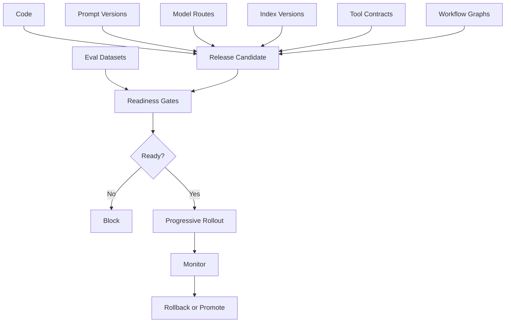
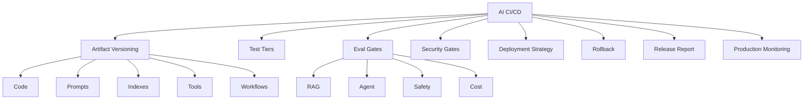
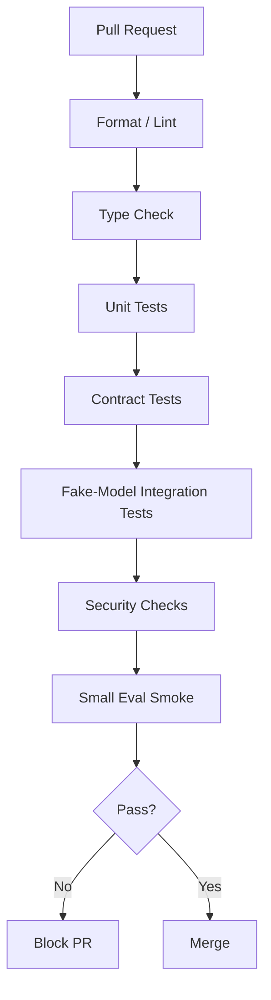
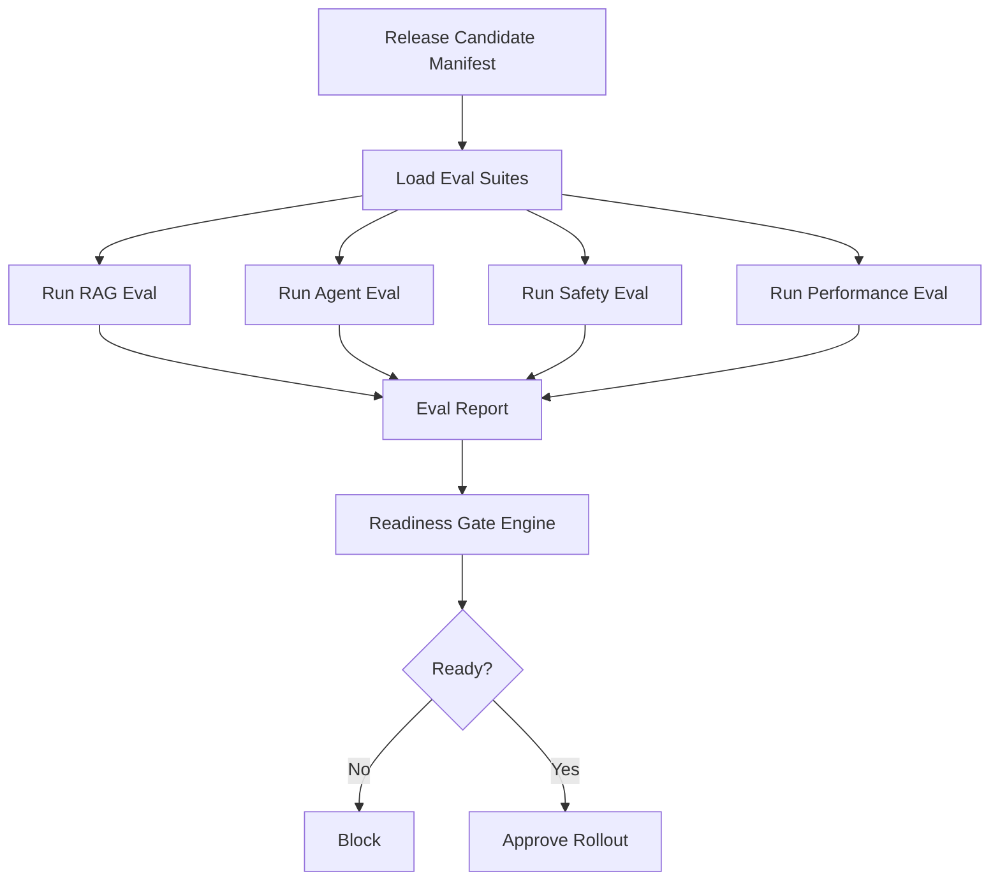

# Part 033 — AI CI/CD and Readiness Gates

## 1. Why This Part Matters

Classic CI/CD validates code.

AI CI/CD must validate code plus behavior.

A production AI system can change behavior when any of these changes:

- code;
- prompt;
- model route;
- model provider;
- output schema;
- retrieval index;
- embedding model;
- reranker;
- tool contract;
- tool description;
- agent workflow graph;
- memory policy;
- governance policy;
- eval dataset;
- safety threshold;
- cost/latency budget.

A code pipeline that only runs unit tests is not enough.

The central invariant:

> AI release engineering must gate behavior, not only build artifacts.

This part turns the previous chapters into a practical release system.

---

## 2. Target Skill

After this part, you should be able to:

- design CI/CD pipelines for Python AI applications;
- version prompts, models, tools, indexes, workflows, and eval datasets;
- run deterministic tests and behavioral evals in separate tiers;
- define readiness gates for quality, safety, security, privacy, latency, and cost;
- use canary, shadow, blue-green, and progressive rollout for AI changes;
- roll back prompts, indexes, tools, and model routes independently;
- build release reports that senior engineers and risk owners can review;
- decide whether an AI feature is production-ready.

---

## 3. CI/CD for AI Is Multi-Artifact

A normal backend release might include:

```text
source code -> build -> test -> deploy
```

An AI release includes more artifacts:



The release unit must describe all relevant artifacts.

Otherwise, you cannot reproduce or roll back behavior.

---

## 4. Kaufman Deconstruction

Break AI CI/CD into trainable subskills.



Deliberate practice:

1. change one prompt;
2. run evals;
3. inspect diff;
4. canary rollout;
5. detect a regression;
6. roll back prompt only;
7. add regression example;
8. repeat with index/model/tool change.

---

## 5. AI Release Manifest

Every AI release should have a manifest.

```python
from typing import Literal
from pydantic import BaseModel


class AiReleaseManifest(BaseModel):
    release_id: str
    application_version: str
    environment: Literal["dev", "staging", "production"]

    code_commit: str
    container_image: str

    prompt_versions: dict[str, str]
    model_routes: dict[str, str]
    index_versions: dict[str, str]
    tool_versions: dict[str, str]
    workflow_versions: dict[str, str]
    eval_dataset_versions: dict[str, str]

    config_version: str
    governance_policy_version: str

    created_at: str
    created_by: str
```

This manifest answers:

- what code ran?
- which prompt generated the answer?
- which model route was active?
- which index served retrieval?
- which tool contract was available?
- which workflow graph executed?
- which eval dataset approved the release?

No manifest, no reproducible release.

---

## 6. Version Everything That Changes Behavior

### 6.1 Code Version

Normal git commit/container image.

### 6.2 Prompt Version

Prompts are behavior.

Use IDs:

```text
prompt.policy_answer.v7
prompt.case_recommendation.v3
prompt.grounded_judge.v5
```

### 6.3 Model Route Version

A model route maps tasks to models.

```text
model_route.high_risk_case_review.v2
```

### 6.4 Index Version

Retrieval indexes must be versioned.

```text
policy-index-2026-06-28-v3
```

### 6.5 Tool Contract Version

Tool input/output and risk metadata must be versioned.

```text
tool.update_case_status.v2
```

### 6.6 Workflow Version

Agent workflows must be versioned.

```text
workflow.case_review.v4
```

### 6.7 Eval Dataset Version

The gate itself must be versioned.

```text
eval.case_review_golden.v9
```

---

## 7. Pipeline Tiers

Use multiple CI/CD tiers.

| Tier | Trigger | Purpose | Cost |
|---|---|---|---|
| PR fast | every PR | unit, lint, type, fake model tests | low |
| PR medium | important PRs | small integration and smoke eval | medium |
| main/nightly | merge/main schedule | golden eval, retrieval eval | medium/high |
| release candidate | pre-prod | full eval + security + performance | high |
| production canary | partial traffic | live quality/ops monitoring | controlled |
| post-release | after deploy | regression monitoring, feedback review | ongoing |

Do not put every expensive eval in every PR.

But do not ship high-risk behavior without release gates.

---

## 8. CI Stages for Python AI Apps



Recommended PR checks:

- `ruff` or equivalent lint/format;
- `mypy` or `pyright` where applicable;
- unit tests;
- prompt rendering tests;
- schema tests;
- tool authorization tests;
- retrieval filter tests;
- fake model/agent workflow tests;
- dependency/security scan;
- small eval smoke test.

---

## 9. Readiness Gates

A readiness gate is a release condition.

Gate categories:

1. code quality;
2. deterministic tests;
3. behavioral eval;
4. RAG quality;
5. agent trajectory;
6. security;
7. privacy/governance;
8. performance;
9. cost;
10. observability;
11. rollback readiness;
12. human approval.

```python
class ReadinessGate(BaseModel):
    gate_id: str
    name: str
    category: str
    severity: Literal["blocker", "warning", "informational"]
    passed: bool
    evidence_ref: str | None = None
    failure_reason: str | None = None
```

Blocker gates should stop production rollout.

---

## 10. Quality Gates

Examples:

```text
- critical eval pass rate >= 98%
- groundedness pass rate >= 95%
- citation support rate >= 98%
- unsupported critical claims == 0
- over-refusal rate within threshold
- under-refusal critical cases == 0
```

Quality gates must be sliced by risk.

A 95% overall pass rate is not acceptable if all failures are high-risk case recommendations.

---

## 11. RAG Readiness Gates

```text
RAG Gates:
- unauthorized retrieval count == 0
- stale active-policy failure count == 0
- recall@10 on critical policy queries >= 0.98
- citation support rate >= 0.98
- exact identifier hit rate >= 0.99
- no-result rate regression <= threshold
- index metadata completeness == 100% for mandatory fields
- active index has rollback version
```

RAG gate inputs:

- retrieval eval results;
- index manifest;
- metadata validation report;
- ACL validation report;
- latency report;
- citation eval report.

---

## 12. Agent Readiness Gates

```text
Agent Gates:
- approval bypass count == 0
- forbidden tool call count == 0
- unauthorized tool call count == 0
- max-step failure rate <= threshold
- required-node completion rate >= threshold
- idempotency violations == 0
- unsafe handoff count == 0
- long-running resume tests pass
```

Agent behavior must be evaluated by trajectory, not just final answer.

---

## 13. Tool Readiness Gates

For every tool change:

- schema compatibility verified;
- authorization tests pass;
- approval requirement configured;
- idempotency tested for writes;
- side-effect level reviewed;
- audit event emitted;
- output redaction tested;
- kill switch configured;
- tool description reviewed.

High-risk tool changes require explicit review.

---

## 14. Security Gates

Security gates:

```text
- prompt injection eval critical failures == 0
- unauthorized retrieval == 0
- forbidden tool proposals blocked == 100%
- cross-tenant tests pass
- secrets scan clean
- dependency critical vulnerabilities == 0 or accepted exception
- trace redaction tests pass
- memory poisoning tests pass
```

Security gates should fail closed.

---

## 15. Privacy and Governance Gates

Governance gates:

- provider approved for data classification;
- prompt manifest approved;
- tool governance record exists;
- eval dataset classification reviewed;
- audit event completeness tested;
- retention policy configured;
- deletion propagation tested where applicable;
- human approval path tested for high-risk workflows;
- release owner and rollback owner named.

Governance is release engineering, not paperwork only.

---

## 16. Performance and Cost Gates

Examples:

```text
- p95 RAG latency <= 6s
- p95 API latency <= budget
- average input tokens <= baseline + 10%
- average output tokens <= baseline + 10%
- cost per successful task <= budget
- model retry rate <= threshold
- agent average steps <= baseline + 1
- no unbounded context growth
```

Cost gates should be tied to successful tasks, not only raw spend.

A system that spends less because it fails more is not better.

---

## 17. Observability Gates

Before release:

- trace includes request ID;
- prompt version is traced;
- model version is traced;
- index version is traced;
- selected evidence IDs are traced;
- tool calls are traced;
- approval IDs are traced;
- cost/tokens are traced;
- redaction tests pass;
- dashboard updated;
- alerts configured;
- runbook exists.

If you cannot observe the release, you cannot operate it.

---

## 18. Example GitHub Actions Pipeline

```yaml
name: ai-app-ci

on:
  pull_request:
  push:
    branches: [main]

jobs:
  fast-checks:
    runs-on: ubuntu-latest
    steps:
      - uses: actions/checkout@v4
      - uses: actions/setup-python@v5
        with:
          python-version: '3.12'
      - run: pip install -r requirements-dev.txt
      - run: ruff check .
      - run: mypy src
      - run: pytest tests/unit tests/contract -q

  fake-model-integration:
    runs-on: ubuntu-latest
    steps:
      - uses: actions/checkout@v4
      - uses: actions/setup-python@v5
        with:
          python-version: '3.12'
      - run: pip install -r requirements-dev.txt
      - run: pytest tests/integration -q

  eval-smoke:
    runs-on: ubuntu-latest
    if: github.event_name == 'pull_request'
    steps:
      - uses: actions/checkout@v4
      - uses: actions/setup-python@v5
        with:
          python-version: '3.12'
      - run: pip install -r requirements-dev.txt
      - run: python -m evals.run --suite smoke --output reports/eval-smoke.json
      - run: python -m release_gates.check --report reports/eval-smoke.json --profile pr
```

The exact tooling can vary.

The principle is stable:

> Fast deterministic gates in PR, deeper behavioral gates before release.

---

## 19. Eval Pipeline



Eval runs must store:

- manifest;
- dataset version;
- outputs;
- traces;
- metrics;
- failures;
- gate decisions.

---

## 20. Readiness Gate Engine

```python
class GateDecision(BaseModel):
    release_id: str
    status: Literal["approved", "blocked", "approved_with_warnings"]
    gates: list[ReadinessGate]
    blockers: list[str]
    warnings: list[str]


def decide_release(gates: list[ReadinessGate], release_id: str) -> GateDecision:
    blockers = [g.name for g in gates if not g.passed and g.severity == "blocker"]
    warnings = [g.name for g in gates if not g.passed and g.severity == "warning"]

    if blockers:
        status = "blocked"
    elif warnings:
        status = "approved_with_warnings"
    else:
        status = "approved"

    return GateDecision(
        release_id=release_id,
        status=status,
        gates=gates,
        blockers=blockers,
        warnings=warnings,
    )
```

Make gate decisions deterministic and auditable.

---

## 21. Release Report

```text
AI Release Report

Release:
- release_id:
- code_commit:
- container_image:
- prompt_versions:
- model_routes:
- index_versions:
- tool_versions:
- workflow_versions:
- eval_dataset_versions:

Quality:
- overall pass rate:
- critical pass rate:
- groundedness:
- citation support:

RAG:
- recall@10:
- MRR:
- unauthorized retrieval:
- stale source failures:

Agent:
- trajectory success:
- approval bypass:
- forbidden tool calls:
- max-step failures:

Security/Privacy:
- prompt injection pass:
- redaction tests:
- provider policy:
- audit completeness:

Performance/Cost:
- p95 latency:
- avg cost/task:
- token budget regression:

Decision:
- approved / blocked
- blockers:
- warnings:
- rollback plan:
```

This report should be understandable by engineering, product, security, and governance stakeholders.

---

## 22. Canary Rollout

Canary releases expose a small percentage of traffic to a new version.

AI canary signals:

- error rate;
- latency;
- cost;
- user feedback;
- citation failure;
- refusal rate;
- tool error rate;
- safety alerts;
- model output schema failures;
- approval bypass;
- fallback rate.

Canary should support automatic rollback for critical metrics.

---

## 23. Shadow Deployment

Shadow deployment runs a new version in parallel but does not show its output.

Useful for:

- new retrieval index;
- new model;
- new reranker;
- new prompt;
- new agent workflow;
- new tool selection policy.

Shadow comparison:

```text
production answer vs shadow answer
production retrieval vs shadow retrieval
production cost vs shadow cost
production latency vs shadow latency
```

Do not use shadow output for side effects.

---

## 24. A/B Testing

A/B tests compare variants with real users.

Use carefully for AI.

Appropriate:

- answer style;
- UX presentation;
- low-risk summarization;
- retrieval ranking variants after offline safety passes.

Inappropriate without safeguards:

- high-risk policy interpretation;
- regulated decisions;
- tool side effects;
- approval workflows.

A/B testing is not a replacement for safety gates.

---

## 25. Rollback Strategy

Rollback targets:

| Artifact | Rollback Method |
|---|---|
| code | deploy previous image |
| prompt | switch prompt version |
| model route | switch route config |
| index | promote previous active index |
| tool | disable or revert tool version |
| workflow | route new runs to old version |
| eval dataset | not usually rollback; review gate change |
| config | revert config version |

Rollback should be tested.

If you cannot roll back a prompt quickly, prompt deployment is unsafe.

---

## 26. Feature Flags

Feature flags control exposure.

Use flags for:

- new prompt;
- new model route;
- new index;
- new agent workflow;
- high-risk tool;
- memory feature;
- judge/validator;
- streaming;
- canary rollout.

Flag dimensions:

- tenant;
- user;
- role;
- environment;
- risk level;
- percentage;
- feature;
- workflow.

Feature flags must be audited for high-risk capabilities.

---

## 27. Release Train for AI Systems

A mature AI release train may look like:

```text
Daily:
- code PR checks
- small eval smoke

Nightly:
- golden RAG eval
- agent trajectory eval
- cost/latency eval

Weekly:
- full eval suite
- security eval
- human review sample
- index promotion review

Release:
- manifest
- readiness gates
- canary
- production monitoring
```

Cadence depends on risk and team maturity.

---

## 28. Handling Eval Dataset Changes

Eval dataset changes can alter pass rates.

Treat dataset changes like code:

- review examples;
- document reason;
- tag risk;
- avoid accidental removal of hard cases;
- keep history;
- compare old/new gate outcomes;
- require owner approval for critical examples.

A team can cheat by weakening evals.

Govern eval datasets.

---

## 29. Handling Model Upgrades

A model upgrade should trigger:

- compatibility tests;
- structured output tests;
- golden evals;
- safety evals;
- latency/cost comparison;
- judge calibration if judge model changes;
- canary or shadow rollout;
- rollback plan.

Do not assume a newer model is better for your specific workflow.

---

## 30. Handling Index Upgrades

Index upgrade gates:

- metadata completeness;
- ACL validation;
- retrieval eval;
- stale/superseded check;
- latency/cost check;
- shadow comparison;
- rollback index retained.

Index changes can silently change answers.

Treat index promotion like deployment.

---

## 31. Handling Tool Changes

Tool changes require:

- contract tests;
- authorization tests;
- idempotency tests;
- audit tests;
- description review;
- agent evals;
- security review for high-risk tools;
- feature flag rollout.

A tool description change can change model behavior.

Review descriptions like prompts.

---

## 32. Handling Workflow Changes

Agent workflow changes require:

- state migration review;
- versioned runs;
- trajectory evals;
- max-step checks;
- approval gate tests;
- resume tests;
- rollback plan;
- active run strategy.

Do not change workflow state schema casually while runs are active.

---

## 33. Production Readiness Review

Before launching a significant AI feature, hold a readiness review.

Checklist:

- product scope clear;
- risk level assigned;
- data classification complete;
- threat model complete;
- eval suite exists;
- tests pass;
- readiness gates pass;
- monitoring dashboards ready;
- alerts and runbooks ready;
- rollback plan tested;
- human review path ready;
- audit events verified;
- owner/on-call assigned;
- residual risks accepted.

Readiness review should produce a decision, not just discussion.

---

## 34. Case-Management Readiness Gates

For enterprise case-management AI:

```text
Blocker Gates:
- unauthorized case retrieval == 0
- approval bypass == 0
- restricted trace redaction failures == 0
- active policy retrieval recall@10 >= 0.98
- unsupported high-risk recommendation == 0
- citation support for policy claims >= 0.99
- case write tools disabled unless approval exists
- audit event completeness == 100%
- rollback plan verified
```

Warnings:

```text
- p95 latency slightly above target
- answer verbosity regression
- non-critical prior-decision retrieval miss
- human review queue backlog within tolerance
```

High-risk systems should block on safety and authorization, not on minor style issues.

---

## 35. Anti-Patterns

| Anti-Pattern | Why It Fails |
|---|---|
| CI only tests code | AI behavior changes untested |
| Prompt changes without eval | regressions ship |
| Model upgrade without shadow eval | behavior drift |
| Index overwrite in place | no rollback |
| Tool enabled globally | excessive blast radius |
| Eval dataset unreviewed | gate loses meaning |
| One overall score gate | critical failures hidden |
| No release manifest | cannot reproduce behavior |
| No canary/rollback | incidents last longer |
| Governance gate manual only | inconsistent enforcement |
| No cost gate | runaway spend |
| No trace gate | un-debuggable release |

---

## 36. Practice: Build an AI CI/CD Pipeline

For your practice RAG + agent app, create:

1. release manifest;
2. prompt manifest;
3. index manifest;
4. tool manifest;
5. workflow manifest;
6. PR pipeline;
7. nightly eval pipeline;
8. release readiness gates;
9. canary rollout plan;
10. rollback plan.

Test release scenarios:

- prompt improves style but breaks citation;
- new index improves recall but leaks stale policy;
- new model improves quality but increases cost;
- tool description change causes wrong tool choice;
- workflow change bypasses approval;
- eval dataset adds new critical case.

Deliverable:

```text
AI CI/CD Review

1. Artifact inventory
2. Pipeline tiers
3. Readiness gates
4. Release manifest
5. Eval report template
6. Rollout strategy
7. Rollback strategy
8. Governance review
9. Case-management gates
10. Known gaps
```

---

## 37. Engineering Heuristics

1. Gate behavior, not only code.
2. Version prompts, models, indexes, tools, workflows, and eval datasets.
3. Keep PR checks fast.
4. Run deeper evals before release.
5. Gate critical slices, not only aggregate score.
6. Treat index promotion like deployment.
7. Treat prompt changes like code changes.
8. Treat tool descriptions as behavior-changing artifacts.
9. Use canary and shadow for risky changes.
10. Roll back artifacts independently.
11. Store release manifests.
12. Include cost, latency, security, and observability gates.
13. Require human review for high-risk releases.
14. Convert production incidents into evals.
15. Make readiness review produce a decision.

---

## 38. Summary

AI CI/CD is release engineering for probabilistic systems.

The core invariant:

> A release is ready only when its code, prompts, models, indexes, tools, workflows, policies, and eval results are known, versioned, tested, and rollback-capable.

This is how you move from experimentation to production discipline.

In the next part, we build the full **Enterprise Case Management AI Capstone**.
