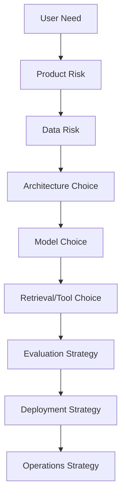
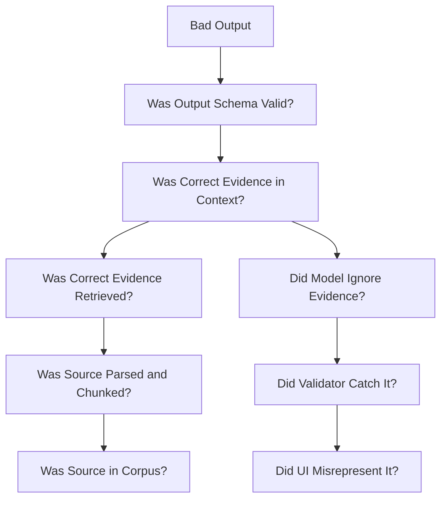
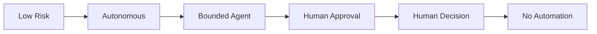
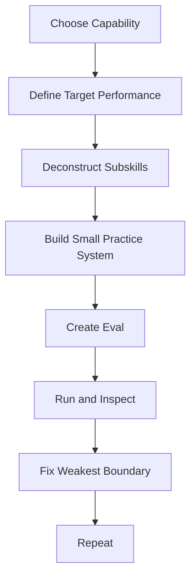

# Part 035 — Top One Percent Operational Playbook

## 1. Why This Final Part Matters

This series has covered a large surface area:

- AI application architecture;
- Python project architecture;
- model abstraction;
- prompt protocol design;
- structured outputs;
- tool calling;
- conversation state;
- async/streaming;
- embeddings;
- ingestion;
- chunking;
- vector/hybrid retrieval;
- RAG design;
- agent mental models;
- workflows;
- tool registry and MCP;
- memory;
- multi-agent boundaries;
- evaluation;
- testing;
- observability;
- reliability;
- cost/performance;
- security;
- privacy/governance;
- deployment;
- CI/CD;
- enterprise case-management capstone.

The final question is:

> How does a top-tier AI application engineer actually operate day to day?

This part is the operational playbook.

It is not a list of tools.

It is a set of habits, principles, review checklists, and decision patterns that separate a strong AI engineer from someone who only knows how to call a model API.

The central invariant:

> Top AI application engineers turn probabilistic capabilities into bounded, observable, testable, governable software systems.

---

## 2. The Top 1% Difference

Many engineers can build an AI demo.

Fewer can build an AI product.

Even fewer can build an AI system that remains safe and useful after:

- the corpus changes;
- the model changes;
- the prompt changes;
- the user base grows;
- the provider rate-limits;
- a tool fails;
- a document contains prompt injection;
- an index becomes stale;
- a human reviewer disagrees;
- cost spikes;
- audit asks why an answer was produced;
- a critical answer is wrong.

Top engineers think in invariants.

They ask:

- What must always be true?
- What can fail?
- How do we know?
- How do we recover?
- How do we prove it?
- How do we prevent this class of failure next time?

That mindset is the real skill.

---

## 3. The Core Operating Principles

### 3.1 Treat the Model as a Component, Not the System

The model is powerful, but it is not the architecture.

The system includes:

- prompt builder;
- model gateway;
- retrieval;
- tools;
- state;
- memory;
- validation;
- policy;
- observability;
- evals;
- deployment;
- humans.

When something fails, do not say:

```text
The model failed.
```

Say:

```text
Which boundary failed?
```

### 3.2 Bound Everything

Bound:

- tokens;
- cost;
- latency;
- tools;
- authority;
- memory;
- retries;
- agent steps;
- context size;
- output schema;
- data access;
- deployment blast radius.

Unbounded AI systems become unpredictable operational systems.

### 3.3 Make Behavior Inspectable

If you cannot inspect it, you cannot improve it.

Trace:

- prompt;
- model;
- retrieval;
- context;
- tool calls;
- agent nodes;
- validation;
- citations;
- approvals;
- versions.

### 3.4 Prefer Explicit Contracts

Use contracts for:

- model interface;
- prompt input;
- structured output;
- tool schema;
- retriever output;
- state transitions;
- memory writes;
- eval examples;
- release gates.

Contracts turn "LLM magic" into software engineering.

### 3.5 Optimize for Failure Diagnosis

The best AI systems are not those that never fail.

They are those whose failures can be localized, fixed, and turned into regression tests.

---

## 4. The AI Application Engineer's Stack of Judgment



A weak engineer starts at model choice.

A strong engineer starts at user need and risk.

Questions:

1. What is the user's actual job?
2. What happens if we are wrong?
3. What data do we need?
4. What data are we allowed to use?
5. Can deterministic code solve part of this?
6. Does this require RAG?
7. Does this require tools?
8. Does this require an agent?
9. Does this require human approval?
10. How will we evaluate it?
11. How will we operate it?

---

## 5. Architecture Decision Heuristics

### 5.1 When to Use Plain LLM

Use plain LLM when:

- task is low-risk;
- answer does not require private/current facts;
- output can tolerate variation;
- no side effects;
- no strict citation requirement.

Examples:

- rewrite text;
- brainstorm ideas;
- classify simple intent;
- generate draft template.

### 5.2 When to Use Structured Output

Use structured output when:

- downstream code consumes result;
- decision branch depends on model output;
- answer has fields/status;
- validation matters;
- eval needs consistent shape.

### 5.3 When to Use RAG

Use RAG when:

- answer depends on external/private/current corpus;
- citations matter;
- facts change;
- domain knowledge is too large for prompt;
- source authority matters.

Do not use RAG just because it sounds advanced.

### 5.4 When to Use Tools

Use tools when:

- system must read or modify external state;
- data is dynamic;
- action is needed;
- computation is deterministic;
- API/system of record exists.

Tools require authority controls.

### 5.5 When to Use Agents

Use agents when:

- next step depends on intermediate state;
- task is multi-step and adaptive;
- tool choice varies;
- clarification/approval may interrupt;
- bounded autonomy adds value.

Do not use agents for fixed workflows.

### 5.6 When to Use Multi-Agent

Use multi-agent only when boundaries are real:

- different domains;
- different tools;
- different permissions;
- different ownership;
- different evaluation criteria.

Do not create agents for every noun.

---

## 6. The Top 1% Design Review Questions

Before approving an AI feature, ask:

### 6.1 Product and Risk

- What user decision does this support?
- What happens if the output is wrong?
- Is this advice, automation, decision support, or final action?
- What is the risk level?
- What requires human approval?

### 6.2 Data

- What data enters the prompt?
- What data enters retrieval?
- What data enters tools?
- What is sensitive?
- What is retained?
- What can be deleted?
- Are embeddings governed?

### 6.3 Model

- Which model is used and why?
- Is the model approved for this data?
- What fallback exists?
- What output schema is required?
- How is model drift detected?

### 6.4 Prompt

- Is the prompt versioned?
- Is the prompt tested?
- Does it separate instructions from evidence?
- Does it require citations or structured output?
- What eval protects it?

### 6.5 Retrieval

- What corpus is searched?
- Which index version?
- How are ACL filters enforced?
- How are stale sources handled?
- Is retrieval evaluated separately?
- Can we trace selected chunks?

### 6.6 Tools

- Which tools are available?
- What authority do they grant?
- Are inputs validated?
- Is authorization enforced in code?
- Is idempotency required?
- Is approval required?

### 6.7 Agent Workflow

- Is state explicit?
- Are transitions bounded?
- What are stop conditions?
- What happens on tool failure?
- Can task resume?
- Can it be cancelled?

### 6.8 Evaluation

- What are golden scenarios?
- What are negative scenarios?
- What are release gates?
- What is the critical failure threshold?
- Are evals versioned?

### 6.9 Operations

- What traces exist?
- What metrics exist?
- What alerts exist?
- What runbook exists?
- What rollback exists?
- What is the cost budget?

If these questions cannot be answered, the system is not ready.

---

## 7. The Production Readiness Checklist

### 7.1 Must Have

- model gateway or equivalent policy layer;
- prompt versioning;
- structured output validation where output drives behavior;
- retrieval ACL enforcement;
- tool registry;
- tool authorization in code;
- idempotency for side effects;
- trace IDs across pipeline;
- eval dataset;
- release gates;
- timeout budgets;
- cost tracking;
- fallback/fail-safe behavior;
- redaction policy;
- audit events for high-risk actions.

### 7.2 Should Have

- shadow index testing;
- canary prompt/model rollout;
- replay records;
- human review queue;
- LLM judge calibration;
- agent trajectory evals;
- chaos tests;
- admin console;
- DLQ inspection;
- memory governance;
- incident runbooks.

### 7.3 Nice to Have

- automatic eval example mining;
- pairwise model comparison;
- multi-provider routing optimization;
- advanced cost forecasting;
- specialized domain rerankers;
- knowledge graph augmentation;
- automated root-cause classification.

Do not confuse "nice to have" with "must have".

---

## 8. Decision Records

Top engineers write decision records.

AI systems have many hidden choices.

Capture them.

```text
ADR: Use Hybrid Retrieval with Reranking for Policy QA

Context:
Users ask both semantic questions and exact policy clause questions.

Decision:
Use lexical + vector candidate generation with RRF, then rerank top 60 candidates.

Consequences:
- Higher latency than vector-only.
- Better exact identifier recall.
- Reranker fallback required.
- Retrieval eval must track recall@10 and citation support.

Alternatives:
- Vector-only retrieval.
- Lexical-only retrieval.
- Manual curated FAQ.
```

Decision records prevent architecture amnesia.

---

## 9. Failure Review Habit

After every serious failure, write a failure review.

Template:

```text
AI Failure Review

1. What happened?
2. Who was affected?
3. What was the expected behavior?
4. What trace evidence exists?
5. Which stage failed?
6. Why did tests/evals not catch it?
7. What immediate mitigation was applied?
8. What permanent fix is needed?
9. What regression eval/test was added?
10. What design principle changed?
```

The most important line:

```text
Which eval/test was added?
```

If no eval is added, the same failure can return.

---

## 10. The Debugging Ladder

When AI output is wrong, climb this ladder.



Do not start by swapping models.

Start from trace.

---

## 11. The "Smallest Responsible Fix" Rule

When something fails, fix the smallest responsible component.

Examples:

| Failure | Bad Fix | Better Fix |
|---|---|---|
| unauthorized chunk retrieved | tell model not to reveal | enforce ACL filter |
| citation mismatch | bigger model | citation validator |
| stale policy used | prompt says prefer latest | document status filter |
| tool wrong args | better wording only | schema + examples + validator |
| agent loop | larger model | max steps + progress guard |
| cost spike | cheaper model everywhere | trace and remove dominant waste |
| hallucinated deadline | lower temperature only | sufficiency check + grounding |

Model changes are sometimes correct.

But many failures are architecture failures.

---

## 12. Engineering Taste: Simplicity vs Power

AI systems tempt overengineering.

Top engineers know when not to use advanced patterns.

Do not use:

- agents when function call is enough;
- multi-agent when workflow node is enough;
- RAG when deterministic DB lookup is enough;
- LLM judge when deterministic check is enough;
- vector search when exact lookup is enough;
- large model when small model is enough;
- long context when selected evidence is enough;
- external tool when local computation is enough.

Power increases failure surface.

Use only the power the problem deserves.

---

## 13. Risk-Based Autonomy

Autonomy should decrease as risk increases.



Examples:

| Risk | Autonomy |
|---|---|
| grammar rewrite | autonomous |
| internal summary | autonomous with trace |
| policy answer | RAG + citations |
| case recommendation | RAG + validation |
| case escalation | human approval |
| enforcement notice | human decision |
| evidence deletion | usually no AI autonomy |

A top engineer does not maximize autonomy.

They match autonomy to risk.

---

## 14. The Capability Maturity Model

### Level 0 — Prompt Demo

- direct model call;
- no eval;
- no trace;
- no schema;
- no retrieval governance.

### Level 1 — App Prototype

- prompt templates;
- basic RAG;
- some tests;
- basic logs.

### Level 2 — Controlled Feature

- schema validation;
- prompt versioning;
- retrieval filters;
- eval dataset;
- basic tracing.

### Level 3 — Production System

- model gateway;
- tool registry;
- CI/CD gates;
- reliability patterns;
- observability;
- rollback;
- security review.

### Level 4 — Governed Enterprise Platform

- governance policy;
- auditability;
- Knowledge Ops;
- human review;
- incident runbooks;
- multi-tenant controls;
- release readiness process.

### Level 5 — Learning Organization

- production failures become evals;
- continuous quality improvement;
- cost/performance optimization;
- platform reuse;
- cross-team standards;
- institutional memory.

Aim for the level your risk requires.

---

## 15. The Personal Skill Loop

Use Kaufman's practice cycle after this series.



Example capabilities:

- build provider abstraction;
- implement structured output repair;
- build hybrid retriever;
- design eval harness;
- build agent workflow;
- implement tool registry;
- add trace/replay;
- secure prompt injection scenario;
- deploy canary prompt rollout.

The loop matters more than passive reading.

---

## 16. 20-Hour Advanced Practice Plan

### Hours 1-2 — Baseline App

Build a small RAG answer service with:

- FastAPI endpoint;
- fake retriever;
- fake model;
- structured output;
- trace ID.

### Hours 3-4 — Real Retrieval

Add:

- document ingestion;
- chunks;
- embeddings;
- hybrid retrieval;
- citations.

### Hours 5-6 — Eval Harness

Add:

- golden examples;
- retrieval recall;
- groundedness placeholder;
- release gate.

### Hours 7-8 — Tool Registry

Add:

- two read tools;
- one write/draft tool;
- authorization;
- audit trace.

### Hours 9-10 — Agent Workflow

Add:

- explicit state;
- nodes;
- router;
- max steps;
- checkpoint.

### Hours 11-12 — Human Approval

Add:

- approval request;
- approval response;
- high-risk gate;
- rejected approval path.

### Hours 13-14 — Observability

Add:

- model span;
- retrieval span;
- tool span;
- workflow trace;
- cost/token metrics.

### Hours 15-16 — Reliability

Add:

- timeout budget;
- retry with jitter;
- fallback;
- idempotency;
- DLQ simulation.

### Hours 17-18 — Security

Add:

- prompt injection test;
- unauthorized retrieval test;
- forbidden tool test;
- trace redaction.

### Hours 19-20 — Release Review

Create:

- architecture review;
- eval report;
- threat model;
- deployment plan;
- readiness checklist.

This 20-hour plan will teach more than building a flashy demo.

---

## 17. The Portfolio Artifact

To demonstrate top-tier skill, build a portfolio-quality artifact.

Project:

```text
Enterprise Case Review AI Assistant
```

Capabilities:

- policy RAG;
- case facts tool;
- evidence checklist;
- recommendation draft;
- supervisor approval;
- citations;
- audit trail;
- eval suite;
- deployment manifest.

Deliverables:

```text
1. Architecture document
2. Threat model
3. Eval report
4. Test suite
5. Trace examples
6. Release readiness checklist
7. Incident runbook
8. Cost/performance report
9. Demo video or walkthrough
10. Source code
```

This shows engineering maturity, not just model usage.

---

## 18. What to Avoid Becoming

### 18.1 Prompt Tinkerer Only

Knows how to tweak prompts but not systems.

### 18.2 Framework Tourist

Knows many frameworks but cannot explain invariants.

### 18.3 Model Maximalist

Solves every issue by switching models.

### 18.4 Agent Maximalist

Uses agents for everything.

### 18.5 Eval Minimalist

Ships without repeatable quality checks.

### 18.6 Security Afterthought Engineer

Adds "do not leak data" to prompt and calls it security.

### 18.7 Demo-Driven Architect

Optimizes for impressive demo, not safe operation.

Top engineers avoid these traps.

---

## 19. The Architecture Review Rubric

Score your AI system 1-5.

| Dimension | 1 | 5 |
|---|---|---|
| Data governance | unknown data flow | classified, governed lineage |
| Retrieval | vector-only black box | evaluated hybrid with ACL |
| Tools | generic broad tools | scoped registry with policy |
| Agent state | hidden prompt state | durable typed state |
| Evaluation | vibes | versioned release gates |
| Observability | logs only | trace/replay/metrics |
| Reliability | happy path | fallback/timeouts/queues |
| Security | prompt-only | defense-in-depth |
| Deployment | manual | versioned rollout/rollback |
| Auditability | cannot reconstruct | answer-to-source lineage |

Anything below 3 in a high-risk system is a warning.

---

## 20. Operating Cadence

A mature AI team has cadence.

### Daily

- inspect alerts;
- inspect cost anomalies;
- inspect failed runs;
- triage user feedback.

### Weekly

- review eval failures;
- update golden dataset;
- review prompt/model/index changes;
- review top cost drivers;
- review incidents/near misses.

### Monthly

- recalibrate judges;
- review governance metrics;
- review provider/model policy;
- run red-team scenarios;
- review architecture debt.

### Per Release

- run readiness gates;
- review eval report;
- verify rollback;
- verify observability;
- update runbooks.

This cadence turns AI quality into operations.

---

## 21. The Senior Engineer's Language

Use precise language.

Instead of:

```text
The LLM hallucinated.
```

Say:

```text
The answer contained an unsupported claim because the sufficiency checker allowed generation with relevant but incomplete evidence.
```

Instead of:

```text
RAG is bad.
```

Say:

```text
The expected source was in vector candidates at rank 42 but was dropped before reranking because candidate_k was 20.
```

Instead of:

```text
The agent went rogue.
```

Say:

```text
The workflow allowed a high-risk tool transition without checking approval state.
```

Precision improves fixes.

---

## 22. Mentoring Others

To help a team mature, teach:

- invariants;
- failure modes;
- trace reading;
- eval creation;
- tool risk classification;
- prompt versioning;
- retrieval diagnostics;
- agent state design;
- security boundaries;
- incident review.

Have juniors inspect traces before writing prompts.

Have them classify failures before fixing them.

This builds engineering judgment.

---

## 23. Interview and Career Leverage

If you want to be recognized as a top AI application engineer, demonstrate:

- you can ship beyond demos;
- you can discuss failure modes;
- you can design evals;
- you can secure tools;
- you can build RAG with governance;
- you can control cost/latency;
- you can operate long-running agents;
- you can write architecture reviews;
- you can lead incident reviews;
- you can communicate trade-offs.

A strong interview answer includes:

```text
I would not start with model choice. I would first define the risk, data sources, authority boundaries, expected behavior, eval set, and operational constraints. Then I would choose model/retrieval/tool architecture to fit those constraints.
```

That is senior-level thinking.

---

## 24. Final Comprehensive Checklist

### Architecture

- [ ] clear user capability;
- [ ] risk classification;
- [ ] data flow diagram;
- [ ] trust boundaries;
- [ ] model gateway;
- [ ] retrieval design;
- [ ] tool registry;
- [ ] workflow state;
- [ ] human approval boundary.

### Data

- [ ] data inventory;
- [ ] classification;
- [ ] minimization;
- [ ] retention;
- [ ] deletion;
- [ ] lineage;
- [ ] embeddings governed.

### RAG

- [ ] source authority;
- [ ] chunking policy;
- [ ] index version;
- [ ] ACL filter;
- [ ] retrieval eval;
- [ ] citation validation;
- [ ] stale source handling.

### Agents

- [ ] explicit state;
- [ ] allowed actions;
- [ ] max steps;
- [ ] checkpoints;
- [ ] idempotency;
- [ ] approval;
- [ ] trajectory eval.

### Tools

- [ ] schema;
- [ ] auth;
- [ ] risk;
- [ ] side effects;
- [ ] timeout;
- [ ] retry;
- [ ] audit;
- [ ] kill switch.

### Quality

- [ ] unit tests;
- [ ] integration tests;
- [ ] eval dataset;
- [ ] judge/human review;
- [ ] release gates;
- [ ] incident-to-eval loop.

### Operations

- [ ] traces;
- [ ] metrics;
- [ ] alerts;
- [ ] runbooks;
- [ ] cost dashboard;
- [ ] rollback;
- [ ] feature flags;
- [ ] SLOs.

### Security and Governance

- [ ] prompt injection defenses;
- [ ] output validation;
- [ ] least privilege;
- [ ] provider policy;
- [ ] prompt/tool/index governance;
- [ ] audit events;
- [ ] privacy review;
- [ ] incident response.

---

## 25. Final Mental Models

Keep these forever:

1. **Model as component** — not the system.
2. **Prompt as protocol** — not magic text.
3. **Schema as contract** — not convenience.
4. **Tool as authority** — not a function.
5. **RAG as evidence pipeline** — not vector search.
6. **Agent as state machine** — not autonomous vibes.
7. **Memory as governed state** — not bigger context.
8. **Eval as release gate** — not offline curiosity.
9. **Trace as truth source** — not optional logging.
10. **Governance as executable control** — not paperwork.
11. **Security in code** — not prompt promises.
12. **Reliability as bounded failure** — not provider hope.
13. **Cost as architecture signal** — not accounting afterthought.
14. **Human approval as control** — not weakness.
15. **Failure as training data** — not embarrassment.

---

## 26. The Final Capstone Challenge

Build a complete system with this scope:

```text
A Python enterprise case-review AI assistant that:
- answers policy questions with RAG;
- retrieves active policy only;
- loads case facts through authorized tools;
- checks evidence completeness;
- drafts recommendation;
- requires approval for high-risk action;
- validates citations;
- records audit trail;
- exposes trace;
- runs eval gates;
- supports rollback.
```

Acceptance criteria:

- 20 golden RAG examples;
- 10 agent trajectory examples;
- 5 prompt injection examples;
- 5 unauthorized access examples;
- 5 reliability chaos scenarios;
- CI passing;
- eval report generated;
- architecture review written;
- threat model written;
- deployment plan written.

This project would demonstrate real AI application engineering maturity.

---

## 27. Closing the Series

This series started with Kaufman's idea:

> Learn by deconstructing the skill, focusing on the most important subskills, practicing deliberately, and getting fast feedback.

For Python AI Application Engineering, the most important subskills are not only "how to call an LLM."

They are:

- how to define boundaries;
- how to represent knowledge;
- how to retrieve evidence;
- how to delegate authority safely;
- how to orchestrate state;
- how to evaluate behavior;
- how to observe failures;
- how to secure data;
- how to govern systems;
- how to operate in production.

If you internalize these, you will not merely be someone who can build AI features.

You will be someone who can make AI systems trustworthy enough to matter.

---

## 28. Final Summary

The top one percent AI application engineer is not defined by knowing the newest framework.

They are defined by judgment.

They can turn ambiguous product goals into safe architecture.

They can turn model uncertainty into bounded behavior.

They can turn failures into evals.

They can turn prototypes into operations.

They can explain not only:

```text
What did the AI answer?
```

but also:

```text
Why did it answer that, from what evidence, under what permission, using what model, through what tools, with what validation, at what cost, and how would we know if it was wrong?
```

That is the bar.

This completes the **Learn Python AI Application Engineer** series.
