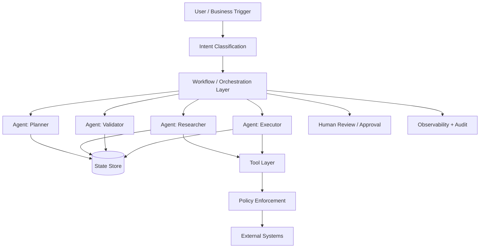
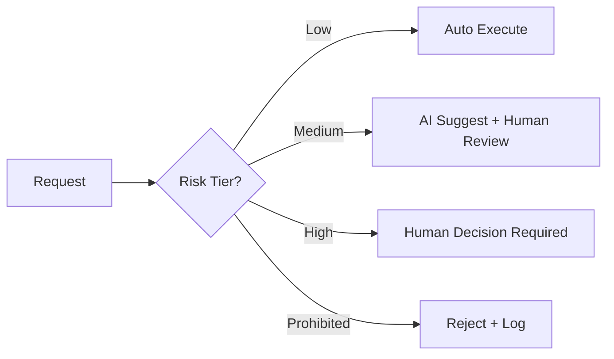
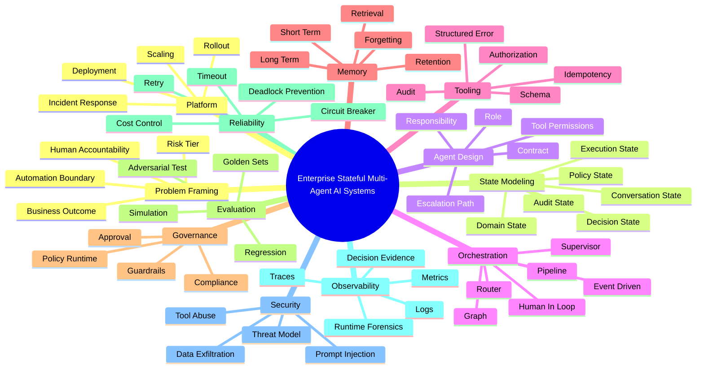
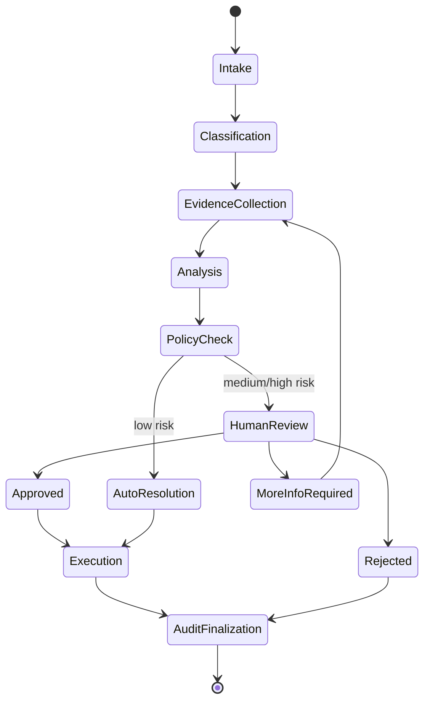
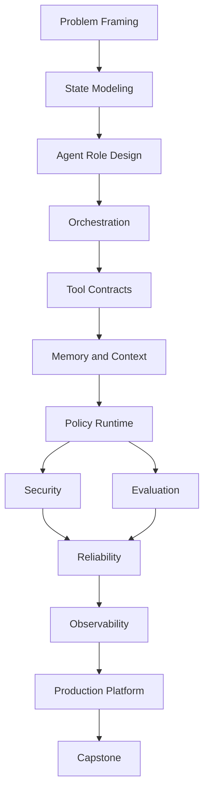

# Part 001 — Kaufman Skill Map

## 1. Tujuan Part Ini

Part ini adalah peta awal untuk seluruh seri **Learn Python Enterprise-Grade Stateful Multi-Agent AI Systems**.

Kita tidak sedang belajar "cara membuat chatbot". Kita sedang belajar bagaimana membangun **sistem AI enterprise yang stateful, auditable, reliable, governable, dan bisa menjalankan workflow lintas-agent secara aman**.

Target akhirnya adalah kamu mampu merancang dan mengimplementasikan sistem seperti:

- regulatory case management assistant,
- AI investigation workflow engine,
- underwriting copilot,
- support escalation multi-agent system,
- fraud analysis agent platform,
- knowledge work automation platform,
- internal enterprise agent runtime,
- autonomous but governed operational assistant.

Bukan sekadar:

```python
response = llm.invoke("do something")
```

Tetapi sistem dengan:

- state lifecycle,
- durable execution,
- checkpointing,
- typed tool contracts,
- memory governance,
- permission boundary,
- policy runtime,
- human approval point,
- evaluation pipeline,
- observability,
- incident readiness,
- cost control,
- audit trail,
- rollback strategy.

## 2. Mengapa Menggunakan Framework Kaufman?

Josh Kaufman dalam *The First 20 Hours* menjelaskan pendekatan rapid skill acquisition melalui empat prinsip besar:

1. **Deconstruct the skill** — pecah skill besar menjadi sub-skill kecil.
2. **Learn enough to self-correct** — pelajari cukup teori agar bisa mendeteksi kesalahan sendiri.
3. **Remove barriers to practice** — hilangkan hambatan agar latihan bisa dilakukan secara konsisten.
4. **Practice deliberately for at least 20 hours** — lakukan latihan terarah, bukan konsumsi materi pasif.

Dalam konteks kita, skill-nya terlalu besar untuk benar-benar dikuasai dalam 20 jam. Namun framework ini tetap sangat berguna untuk menentukan:

- bagian mana yang paling leverage,
- urutan belajar yang masuk akal,
- bentuk latihan yang menghasilkan feedback cepat,
- batas minimal kompetensi praktis,
- apa yang harus dihindari agar tidak tenggelam dalam tooling.

Prinsipnya: **kita tidak mengejar hafalan framework, melainkan keluwesan engineering**.

## 3. Definisi Sistem yang Akan Kita Bangun

Sebuah **enterprise-grade stateful multi-agent AI system** adalah sistem perangkat lunak yang menggunakan satu atau lebih model AI sebagai komponen reasoning/action, tetapi tetap dikendalikan oleh arsitektur enterprise yang eksplisit.

Definisi kerja kita:

> Sistem multi-agent enterprise adalah sistem yang mengoordinasikan beberapa unit pemrosesan berbasis AI atau non-AI, masing-masing dengan responsibility jelas, state eksplisit, tool boundary terkontrol, policy enforcement, observability, dan mekanisme human override untuk menjalankan workflow bernilai bisnis secara aman.

Kata pentingnya bukan hanya **AI**, tetapi:

- **enterprise-grade**,
- **stateful**,
- **multi-agent**,
- **controlled autonomy**,
- **operationally defensible**.

## 4. Perbedaan Chatbot, Workflow, Agent, dan Multi-Agent System

Banyak sistem gagal karena semua hal disebut "agent". Kita perlu taxonomy yang lebih tajam.

| Bentuk Sistem | Karakteristik | Risiko Jika Salah Dipahami |
|---|---|---|
| Chatbot | Interaksi natural language, biasanya session-based | Terlihat pintar tapi tidak punya operational responsibility |
| Workflow | Urutan langkah eksplisit, deterministik, mudah diaudit | Kurang fleksibel untuk problem terbuka |
| Tool-Using Agent | Model memilih tool untuk mencapai tujuan tertentu | Tool abuse, hallucinated action, permission leak |
| Stateful Agent | Agent memiliki state eksplisit lintas-step/session | State drift, stale context, privacy risk |
| Multi-Agent System | Banyak agent/role berkolaborasi | Loop, konflik keputusan, escalation ambiguity |
| Enterprise Agent Platform | Runtime, governance, eval, observability, security, deployment | Kompleksitas platform tinggi, false sense of autonomy |

Mental model yang sehat:



AI agent bukan pusat semesta. Ia adalah **komponen reasoning/action** di dalam sistem yang lebih besar.

## 5. Kaufman Deconstruction: Skill Besar Menjadi Sub-Skill

Skill utama:

> Mampu mendesain, membangun, mengevaluasi, dan mengoperasikan enterprise-grade stateful multi-agent AI systems dengan Python.

Skill ini kita pecah menjadi 12 domain.

### 5.1 Domain 1 — Enterprise Problem Framing

Kamu harus bisa menjawab:

- Masalah bisnis apa yang benar-benar perlu agent?
- Bagian mana yang harus deterministic workflow?
- Bagian mana yang boleh probabilistic reasoning?
- Output mana yang boleh otomatis dieksekusi?
- Output mana yang wajib review manusia?
- Apa konsekuensi jika sistem salah?

Invariant:

> Jangan mulai dari "pakai agent framework apa". Mulai dari decision lifecycle, risk, state, dan accountability.

### 5.2 Domain 2 — State Modeling

State bukan hanya chat history.

Dalam sistem enterprise, state minimal terdiri dari:

- **conversation state** — apa yang sudah dikatakan user dan agent,
- **task state** — tujuan, progress, pending action,
- **domain state** — entity bisnis seperti case, account, customer, claim,
- **execution state** — step aktif, retry count, timeout, checkpoint,
- **decision state** — rekomendasi, evidence, confidence, reviewer,
- **policy state** — permission, risk tier, approval status,
- **memory state** — fakta jangka panjang yang boleh disimpan,
- **audit state** — siapa/apa/kapan/mengapa suatu action terjadi.

Kesalahan umum:

```text
state = messages
```

Versi enterprise:

```text
state = domain + workflow + memory + policy + evidence + execution + audit
```

### 5.3 Domain 3 — Agent Role Modeling

Agent bukan persona lucu. Agent adalah unit tanggung jawab.

Contoh role:

| Role | Responsibility | Tidak Boleh Melakukan |
|---|---|---|
| Intake Agent | Mengubah input user menjadi structured request | Menyetujui keputusan final |
| Research Agent | Mengambil informasi dari sumber terpercaya | Mengubah data sumber |
| Planner Agent | Membuat rencana eksekusi | Menjalankan side effect langsung |
| Validator Agent | Mengecek konsistensi, policy, evidence | Membuat keputusan bisnis sendiri |
| Executor Agent | Menjalankan tool terotorisasi | Bypass approval |
| Supervisor Agent | Routing, escalation, termination | Menjadi single opaque god-agent |

Invariant:

> Setiap agent harus punya contract, input, output, allowed tools, denied actions, timeout, dan escalation path.

### 5.4 Domain 4 — Orchestration

Enterprise multi-agent system biasanya tidak sehat jika semua agent bebas bicara dengan semua agent.

Topologi yang perlu dikuasai:

- sequential pipeline,
- router,
- supervisor-worker,
- planner-executor,
- critic/evaluator,
- blackboard,
- graph-based workflow,
- hierarchical escalation,
- event-driven agent workflow.

Kita akan selalu menanyakan:

- siapa memanggil siapa?
- state apa yang dibaca?
- state apa yang ditulis?
- kapan berhenti?
- kapan retry?
- kapan escalate?
- kapan rollback?

### 5.5 Domain 5 — Tool Contract Engineering

Agent yang bisa memakai tool adalah agent yang bisa menimbulkan side effect.

Maka tool harus diperlakukan seperti API production:

- schema eksplisit,
- authorization,
- idempotency key,
- timeout,
- retry policy,
- rate limit,
- audit log,
- structured errors,
- dry-run mode,
- confirmation mode,
- output validation.

Contoh tool buruk:

```python
def update_customer(data):
    ...
```

Contoh arah enterprise:

```python
class UpdateCustomerRequest(BaseModel):
    customer_id: str
    requested_by: str
    idempotency_key: str
    expected_version: int
    patch: dict[str, Any]
    reason: str
    approval_id: str | None = None
```

Masalah utama bukan apakah agent bisa call tool. Masalah utama adalah apakah tool call itu **safe, authorized, explainable, reversible, and observable**.

### 5.6 Domain 6 — Memory and Context Engineering

Memory harus dibedakan dari context.

| Konsep | Definisi | Risiko |
|---|---|---|
| Context | Informasi yang dimasukkan ke model saat inference | Token bloat, irrelevant context |
| Memory | Informasi yang disimpan lintas interaksi | Privacy leak, stale fact |
| Retrieval | Proses mengambil informasi relevan | Wrong evidence, ranking failure |
| State | Representasi eksplisit kondisi sistem | Drift, race condition |
| Audit | Catatan historis yang tidak boleh diam-diam berubah | Compliance failure |

Invariant:

> Tidak semua yang diketahui agent boleh diingat. Tidak semua yang diingat boleh dipakai. Tidak semua yang dipakai boleh dipercaya.

### 5.7 Domain 7 — Policy and Governance Runtime

Enterprise agent harus punya batas.

Batas tersebut mencakup:

- input policy,
- output policy,
- tool policy,
- data access policy,
- risk tier policy,
- approval policy,
- retention policy,
- escalation policy,
- model selection policy,
- fallback policy.

Contoh:



### 5.8 Domain 8 — Evaluation Engineering

Testing agent tidak cukup dengan "saya coba manual dan hasilnya bagus".

Kita perlu:

- golden tasks,
- scenario suites,
- adversarial tests,
- regression eval,
- tool-call correctness eval,
- state transition eval,
- policy compliance eval,
- hallucination/evidence eval,
- cost/latency eval,
- human review sampling.

Output agent harus diuji sebagai behavior sistem, bukan hanya teks.

### 5.9 Domain 9 — Reliability Engineering

Failure modes khas agentic system:

- infinite loop,
- unnecessary tool call,
- hallucinated tool argument,
- stale state,
- context poisoning,
- prompt injection,
- hidden policy bypass,
- agent disagreement,
- non-deterministic regression,
- partial side effect,
- timeout cascade,
- runaway cost,
- missing audit evidence.

Invariant:

> Sistem agentic yang tidak punya termination condition adalah sistem yang belum selesai didesain.

### 5.10 Domain 10 — Observability and Forensics

Kita perlu melihat lebih dari log aplikasi biasa.

Yang harus terlihat:

- user request,
- selected workflow,
- state transition,
- agent invocation,
- model version,
- prompt/input snapshot,
- retrieved evidence,
- tool call,
- guardrail decision,
- human decision,
- final output,
- cost,
- latency,
- error,
- retry,
- escalation.

Tracing agent bukan sekadar debugging. Dalam enterprise, tracing adalah bagian dari **accountability**.

### 5.11 Domain 11 — Security Engineering

Ancaman utama:

- prompt injection,
- indirect prompt injection dari dokumen/email/web,
- tool exfiltration,
- confused deputy,
- over-permissioned tools,
- insecure MCP/tool server,
- data leakage melalui memory,
- poisoned retrieval corpus,
- unauthorized action,
- audit tampering,
- supply chain compromise.

Top 1% engineer tidak bertanya:

> Bagaimana membuat agent lebih powerful?

Mereka juga bertanya:

> Bagaimana membatasi agent agar tetap berguna, aman, dan defensible?

### 5.12 Domain 12 — Production Platform Engineering

Production agent system perlu:

- environment isolation,
- secrets management,
- model routing,
- queue/workflow engine,
- state store,
- vector store,
- relational store,
- object store,
- event bus,
- observability backend,
- eval pipeline,
- admin console,
- reviewer console,
- rollout/rollback,
- incident playbook.

## 6. Skill Map Lengkap



## 7. Apa yang Dimaksud “Top 1%” di Domain Ini?

Dalam konteks seri ini, “top 1%” bukan berarti tahu semua library terbaru.

Engineer level atas biasanya unggul karena mereka mampu:

1. **Membedakan demo dari sistem produksi.**
2. **Mendesain state dan lifecycle sebelum memilih framework.**
3. **Mengontrol autonomy, bukan memuja autonomy.**
4. **Membuat agent bisa diaudit.**
5. **Menguji behavior non-deterministic secara sistematis.**
6. **Mendesain tool boundary seperti security boundary.**
7. **Melakukan failure modeling sebelum incident terjadi.**
8. **Mengerti trade-off antara workflow deterministik dan reasoning probabilistik.**
9. **Membuat sistem mudah dioperasikan oleh manusia.**
10. **Menghubungkan AI design dengan risk, compliance, cost, dan business process.**

## 8. Anti-Goal Seri Ini

Seri ini tidak akan fokus pada:

- Python basic,
- syntax dasar,
- prompt engineering dasar,
- definisi LLM basic,
- RAG introductory tutorial,
- membuat chatbot sederhana,
- memakai framework secara copy-paste,
- “10 agent tools you must try”,
- hype autonomous agent tanpa governance,
- arsitektur yang hanya cocok untuk demo.

Kita akan fokus pada sistem yang bisa dipertanggungjawabkan.

## 9. Enterprise Reference Problem

Agar pembelajaran tidak abstrak, kita akan memakai satu reference problem sepanjang seri:

> **Enterprise Regulatory Case Management Multi-Agent System**

Sistem ini menerima case/complaint/investigation request, mengklasifikasikan risiko, mengambil evidence, menyusun reasoning, menjalankan policy check, memberi rekomendasi tindakan, meminta approval bila perlu, lalu menghasilkan audit trail.

High-level lifecycle:



Kenapa case management cocok?

Karena ia memaksa kita memikirkan:

- entity lifecycle,
- escalation,
- evidence,
- human review,
- decision defensibility,
- audit,
- SLA,
- policy,
- security,
- traceability,
- cross-system integration.

Ini lebih realistis daripada contoh “agent memesan tiket” atau “agent menjawab pertanyaan dokumen”.

## 10. Framework dan Standar yang Akan Dipakai Sebagai Referensi

Seri ini tidak bergantung pada satu framework, tetapi akan memakai beberapa referensi modern sebagai anchor:

| Area | Referensi | Digunakan Untuk |
|---|---|---|
| Stateful graph orchestration | LangGraph | Durable execution, state, graph workflow, human-in-the-loop |
| Agent runtime concepts | OpenAI Agents SDK | Agent, tool, handoff, guardrail, session, tracing |
| Enterprise protocol boundary | MCP | Tool/resource/prompt standardization |
| Typed Python boundary | Pydantic, JSON Schema | Contract, validation, structured data |
| Observability | OpenTelemetry | Trace, span, metric, log correlation |
| Governance | NIST AI RMF | Risk framing and control thinking |
| Security | OWASP LLM Top 10 | Agent/tool/prompt/data threat modeling |
| Workflow reliability | Temporal-style patterns, queue workers | Durable side effects and retry discipline |

Library bisa berubah. Mental model harus tetap.

## 11. Core Invariants untuk Seluruh Seri

Simpan bagian ini. Ini akan muncul berkali-kali dalam bentuk berbeda.

### 11.1 State Invariant

> Setiap keputusan penting harus bisa ditelusuri ke state, evidence, policy, dan actor yang membuatnya.

### 11.2 Tool Invariant

> Setiap tool yang memiliki side effect harus punya authorization, idempotency, validation, timeout, audit, dan failure semantics.

### 11.3 Agent Responsibility Invariant

> Setiap agent harus punya responsibility eksplisit, allowed actions, denied actions, dan termination condition.

### 11.4 Human Control Invariant

> Semakin tinggi risiko keputusan, semakin eksplisit mekanisme human review, override, dan accountability.

### 11.5 Evaluation Invariant

> Behavior agent yang penting harus punya regression test, bukan hanya manual inspection.

### 11.6 Observability Invariant

> Jika sebuah keputusan tidak bisa direkonstruksi setelah incident, sistem belum enterprise-grade.

### 11.7 Security Invariant

> Treat prompts, retrieved documents, tool outputs, and memory as untrusted inputs unless explicitly verified.

### 11.8 Cost Invariant

> Agent autonomy tanpa budget adalah potensi incident finansial.

## 12. Learning Dependency Graph



Urutan ini disengaja.

Kita tidak mulai dari framework karena framework hanya mempercepat implementasi setelah model sistemnya benar.

## 13. Minimal Working Architecture yang Akan Berkembang

Kita akan mulai dari bentuk sederhana:

```text
User Request
  -> Intake Agent
  -> Case State
  -> Router
  -> Specialist Agent
  -> Validator
  -> Human Review
  -> Final Decision
  -> Audit Log
```

Lalu berkembang menjadi:

```text
API Gateway
  -> Identity Context
  -> Policy Gateway
  -> Agent Orchestrator
  -> Durable State Store
  -> Tool Broker
  -> Memory/Retrieval Layer
  -> Evaluation Hooks
  -> Observability Pipeline
  -> Human Review Console
  -> External Enterprise Systems
```

## 14. Praktik 20 Jam: Bentuk Latihan Seri Ini

Framework Kaufman menekankan latihan, bukan konsumsi materi.

Untuk domain ini, latihan yang tepat bukan membaca 20 artikel, melainkan membangun sistem kecil yang makin lama makin enterprise-grade.

Setiap beberapa part, kamu akan memperluas sistem referensi:

1. membuat state model,
2. menambahkan agent role,
3. menambahkan tool contract,
4. menambahkan checkpoint,
5. menambahkan validation,
6. menambahkan human approval,
7. menambahkan observability,
8. menambahkan eval,
9. menambahkan security policy,
10. menambahkan deployment boundary.

## 15. First 20 Hours Target Outcome

Setelah 20 jam latihan terarah, target realistisnya bukan menjadi world-class researcher.

Target realistisnya:

- bisa menjelaskan architecture of record untuk enterprise stateful agent system,
- bisa membuat prototype Python dengan typed state dan agent roles,
- bisa membedakan workflow deterministic vs agentic reasoning,
- bisa mendesain tool boundary yang aman,
- bisa membuat simple eval suite,
- bisa menambahkan trace dan audit trail,
- bisa mengidentifikasi failure modes utama,
- bisa menjelaskan kapan human review wajib,
- bisa menilai apakah sebuah agent demo layak diproduksi atau tidak.

Itu sudah jauh di atas “sekadar bisa pakai framework”.

## 16. Self-Correction Checklist

Setelah membaca part ini, kamu harus bisa mengoreksi diri dengan pertanyaan berikut:

1. Apakah saya mendesain agent sebelum mendesain workflow?
2. Apakah saya menyebut chat history sebagai state penuh?
3. Apakah tool saya punya side effect tanpa approval?
4. Apakah agent saya bisa loop tanpa batas?
5. Apakah setiap decision punya evidence?
6. Apakah policy hanya prompt text, bukan runtime enforcement?
7. Apakah saya bisa replay atau reconstruct decision?
8. Apakah saya bisa menguji behavior agent secara otomatis?
9. Apakah memory punya retention dan privacy rule?
10. Apakah manusia punya override path?

Jika banyak jawaban buruk, itu bukan masalah. Itu adalah titik awal latihan.

## 17. Practice Drill

Buat dokumen pendek berisi rancangan awal sistem berikut:

> Agent system untuk membantu tim compliance menilai apakah sebuah case perlu dieskalasi ke investigator manusia.

Wajib jawab:

- entity utama apa saja?
- state apa saja?
- agent role apa saja?
- tool apa saja?
- action mana yang low risk?
- action mana yang high risk?
- kapan human review wajib?
- evidence apa yang harus disimpan?
- failure mode apa yang paling berbahaya?
- log/audit apa yang wajib ada?

Jangan tulis code dulu. Tulis lifecycle.

## 18. Common Mistakes

### 18.1 Terlalu Cepat Memilih Framework

Framework mempercepat hal yang sudah dipahami. Framework juga bisa mempercepat kesalahan desain.

### 18.2 Menganggap Agent Sama dengan Microservice

Microservice biasanya deterministic. Agent sering probabilistic. Maka contract dan testing-nya harus lebih hati-hati.

### 18.3 Menganggap Semua Agent Harus Autonomous

Enterprise system sering lebih baik memakai **bounded autonomy**.

### 18.4 Tidak Memisahkan Decision dan Execution

Agent boleh merekomendasikan. Eksekusi side effect mungkin perlu approval, policy check, atau transaction boundary.

### 18.5 Tidak Mendesain Stop Condition

Agent tanpa stop condition adalah production risk.

## 19. Ringkasan

Di part ini kita menetapkan skill map.

Inti pembelajaran:

- Gunakan Kaufman untuk memecah skill, bukan untuk meremehkan kompleksitas.
- Enterprise agent system adalah sistem software, bukan prompt collection.
- State harus eksplisit dan dapat diaudit.
- Agent adalah responsibility unit, bukan persona.
- Tool adalah security boundary.
- Memory adalah governance problem.
- Evaluation adalah engineering discipline.
- Observability adalah bagian dari accountability.
- Human review adalah fitur sistem, bukan kegagalan automation.

## 20. Referensi Awal

- Josh Kaufman, *The First 20 Hours: How to Learn Anything... Fast*.
- Josh Kaufman TEDx Talk, “The first 20 hours — how to learn anything”.
- LangGraph documentation: stateful orchestration, durable execution, persistence, human-in-the-loop.
- OpenAI Agents SDK documentation: agents, tools, handoffs, guardrails, sessions, tracing.
- Model Context Protocol specification: tools, resources, prompts.
- OWASP Top 10 for Large Language Model Applications.
- NIST AI Risk Management Framework.
- OpenTelemetry Python documentation.

## 21. Next Part

Part berikutnya:

`learn-python-enterprise-stateful-multi-agent-ai-systems-part-002-target-performance-and-skill-decomposition.mdx`

Kita akan mengubah skill map ini menjadi target performance, rubrik kemampuan, dan rencana latihan 20 jam yang konkret.
