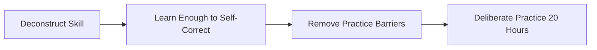
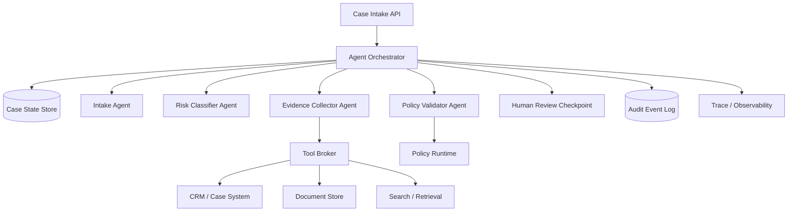
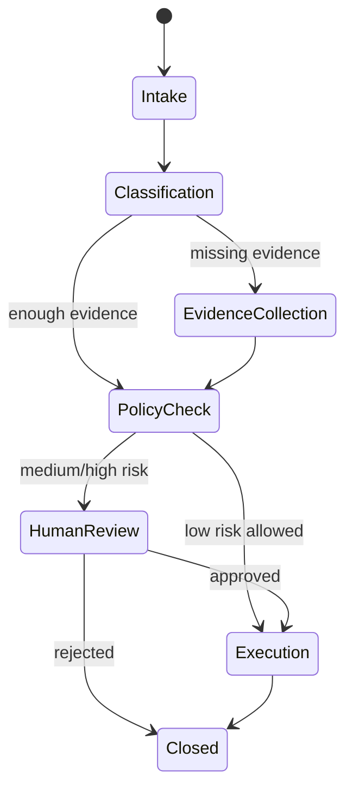
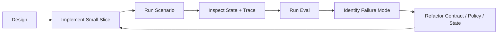
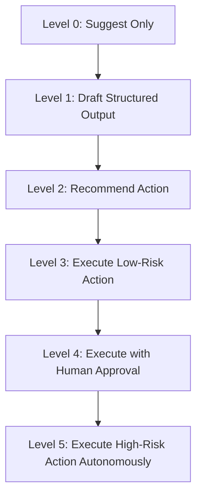

# Part 002 — Target Performance and Skill Decomposition

## 1. Tujuan Part Ini

Part sebelumnya membuat skill map besar. Part ini mengubahnya menjadi target kemampuan yang dapat dilatih.

Kita akan menjawab:

- Apa hasil nyata yang harus bisa dibuat?
- Apa ukuran “cukup bisa” pada 20 jam pertama?
- Sub-skill mana yang paling leverage?
- Bagaimana latihan dilakukan tanpa terjebak membaca terlalu banyak?
- Bagaimana self-correction dilakukan?
- Apa rubrik untuk menilai apakah desain kita enterprise-grade?

Targetnya bukan hanya tahu istilah seperti agent, tool, memory, atau orchestration. Targetnya adalah bisa mengambil sebuah business workflow berisiko, lalu mengubahnya menjadi rancangan sistem agentic yang:

- stateful,
- typed,
- bounded,
- auditable,
- observable,
- testable,
- governable.

## 2. Prinsip Kaufman yang Dipakai di Part Ini

Framework Kaufman menghindari jebakan “belajar tanpa praktik”. Dalam domain ini, jebakannya sangat besar karena ada banyak framework, paper, demo, SDK, dan istilah baru.

Kita akan pakai empat langkah:



Adaptasinya:

| Kaufman | Adaptasi untuk Enterprise Agent Systems |
|---|---|
| Deconstruct the skill | Pecah menjadi state, orchestration, tools, memory, governance, eval, reliability |
| Learn enough to self-correct | Pahami invariants dan failure modes agar bisa menilai desain sendiri |
| Remove barriers | Siapkan template, local runtime, test harness, dan reference scenario |
| Practice 20 hours | Bangun incremental case-management multi-agent system |

## 3. Target Performance

Target performance seri ini:

> Dalam 20 jam latihan terarah, kamu mampu merancang dan membuat prototype Python untuk enterprise regulatory case management multi-agent system yang memiliki typed state, agent roles, tool boundary, policy check, human review point, trace log, dan evaluation scenarios.

Prototype ini tidak harus production-ready secara infrastructure, tetapi desainnya harus production-conscious.

### 3.1 Output Konkret Setelah 20 Jam

Minimal kamu punya:

1. `CaseState` typed model.
2. State machine lifecycle untuk case.
3. Agent roles: intake, classifier, evidence collector, validator, supervisor.
4. Tool contracts dengan Pydantic.
5. Policy check sebelum action penting.
6. Human review checkpoint.
7. Audit event model.
8. Basic trace log per execution.
9. Evaluation dataset kecil.
10. Failure mode checklist.
11. Architecture decision notes.

### 3.2 Yang Tidak Ditargetkan dalam 20 Jam Pertama

Agar latihan efektif, kita sengaja tidak menargetkan:

- production Kubernetes deployment,
- full enterprise IAM integration,
- complete vector database platform,
- full compliance certification,
- complex distributed workflow engine,
- advanced model fine-tuning,
- multi-region deployment,
- high-scale load testing.

Semua itu penting, tetapi bukan leverage pertama.

Urutan yang benar:

```text
correct mental model -> safe small prototype -> evaluation -> operational hardening -> scale
```

Bukan:

```text
framework demo -> random tools -> impressive UI -> unclear responsibility -> production incident
```

## 4. Reference Scenario: Regulatory Case Management

Kita akan melatih semua skill memakai satu scenario utama.

### 4.1 Business Context

Sebuah organisasi menerima banyak case terkait potensi pelanggaran kebijakan. Setiap case perlu:

- diklasifikasikan,
- diperkaya dengan evidence,
- diperiksa terhadap policy,
- diputuskan apakah perlu eskalasi,
- diberi rekomendasi next action,
- disimpan audit trail-nya.

### 4.2 Why This Scenario Works

Scenario ini bagus karena memaksa kita memikirkan:

- state lifecycle,
- risk tier,
- evidence quality,
- false positive/false negative,
- human accountability,
- policy mapping,
- tool permission,
- audit defensibility,
- SLA,
- escalation logic.

Ini jauh lebih representative untuk enterprise system daripada agent yang hanya menjawab pertanyaan.

## 5. Target Architecture Setelah 20 Jam



Yang penting di sini bukan jumlah komponen. Yang penting adalah separation of concerns.

| Layer | Responsibility |
|---|---|
| API | menerima request, identity, correlation id |
| Orchestrator | menentukan step, agent routing, checkpoint |
| State Store | menyimpan state eksplisit |
| Agent | reasoning terbatas sesuai role |
| Tool Broker | mengontrol akses ke external systems |
| Policy Runtime | menentukan allowed/denied/review-required |
| Human Review | approval, rejection, override |
| Audit Log | immutable decision trail |
| Trace | debugging, monitoring, forensic reconstruction |

## 6. Skill Decomposition Detail

### 6.1 Sub-Skill A — Problem Framing

Kemampuan:

- mengubah business request menjadi system boundary,
- menentukan automation risk,
- menentukan user journey,
- menentukan decision point,
- menentukan escalation path.

Latihan:

Ambil satu case description dan jawab:

```text
Apa inputnya?
Apa outputnya?
Apa yang boleh otomatis?
Apa yang wajib review manusia?
Apa konsekuensi salah?
Apa evidence minimal?
Apa state transition-nya?
```

Self-correction:

Desain buruk biasanya terlalu cepat menjawab “pakai agent”. Desain baik menjawab “bagian ini workflow, bagian ini agentic reasoning, bagian ini human decision”.

### 6.2 Sub-Skill B — State Modeling

Kemampuan:

- membedakan domain state, execution state, conversation state, decision state,
- membuat model typed,
- membuat state transition eksplisit,
- menjaga auditability.

Contoh awal:

```python
from enum import StrEnum
from pydantic import BaseModel, Field
from datetime import datetime
from typing import Literal


class CaseStatus(StrEnum):
    INTAKE = "intake"
    CLASSIFICATION = "classification"
    EVIDENCE_COLLECTION = "evidence_collection"
    POLICY_CHECK = "policy_check"
    HUMAN_REVIEW = "human_review"
    EXECUTION = "execution"
    CLOSED = "closed"


class RiskTier(StrEnum):
    LOW = "low"
    MEDIUM = "medium"
    HIGH = "high"


class Evidence(BaseModel):
    source: str
    reference_id: str
    summary: str
    reliability: Literal["low", "medium", "high"]
    collected_at: datetime


class CaseState(BaseModel):
    case_id: str
    status: CaseStatus
    risk_tier: RiskTier | None = None
    summary: str
    evidence: list[Evidence] = Field(default_factory=list)
    pending_human_review: bool = False
    decision: str | None = None
    updated_at: datetime
```

Self-correction:

Jika state model tidak bisa menjawab “kenapa keputusan ini dibuat?”, modelnya belum cukup enterprise.

### 6.3 Sub-Skill C — Agent Role Design

Kemampuan:

- mendefinisikan agent berdasarkan responsibility,
- membatasi allowed tools,
- menentukan output schema,
- membuat escalation rule.

Template:

```text
Agent Name:
Responsibility:
Input State:
Output Contract:
Allowed Tools:
Denied Actions:
Stop Condition:
Escalation Rule:
Failure Handling:
Observability Events:
```

Contoh:

```text
Risk Classifier Agent
Responsibility: classify case risk based on case summary and evidence.
Allowed Tools: none during first pass.
Denied Actions: cannot close case, cannot notify external party.
Output: risk_tier, rationale, missing_evidence.
Escalation: if confidence low or risk high -> human review.
```

Self-correction:

Agent yang “boleh melakukan semuanya” adalah desain yang belum matang.

### 6.4 Sub-Skill D — Orchestration

Kemampuan:

- membuat urutan step,
- menentukan branching,
- menentukan retry,
- menentukan checkpoint,
- menentukan human approval.

State transition awal:



Self-correction:

Jika orchestration hanya “agent saling chat sampai selesai”, desainnya terlalu kabur untuk enterprise.

### 6.5 Sub-Skill E — Tool Contract Engineering

Kemampuan:

- mendesain schema tool,
- membatasi permission,
- menambahkan idempotency,
- membuat structured error,
- menambahkan audit metadata.

Contoh:

```python
from pydantic import BaseModel, Field
from typing import Literal


class ToolContext(BaseModel):
    actor_id: str
    case_id: str
    correlation_id: str
    idempotency_key: str
    approval_id: str | None = None


class SearchEvidenceRequest(BaseModel):
    context: ToolContext
    query: str = Field(min_length=3, max_length=500)
    max_results: int = Field(default=5, ge=1, le=20)
    source_scope: list[str]


class SearchEvidenceResult(BaseModel):
    status: Literal["ok", "denied", "error"]
    results: list[Evidence]
    error_code: str | None = None
    error_message: str | None = None
```

Self-correction:

Tool tanpa actor, correlation id, idempotency key, dan error semantics akan sulit dioperasikan.

### 6.6 Sub-Skill F — Policy and Guardrails

Kemampuan:

- membuat policy eksplisit,
- membedakan deny, allow, review-required,
- menempatkan policy di runtime, bukan hanya prompt,
- menguji policy dengan scenarios.

Contoh sederhana:

```python
from typing import Literal
from pydantic import BaseModel


class PolicyDecision(BaseModel):
    outcome: Literal["allow", "deny", "review_required"]
    reason: str
    policy_ids: list[str]


def decide_execution_policy(state: CaseState) -> PolicyDecision:
    if state.risk_tier == RiskTier.HIGH:
        return PolicyDecision(
            outcome="review_required",
            reason="High-risk case requires human review before execution.",
            policy_ids=["CASE-RISK-001"],
        )

    if state.pending_human_review:
        return PolicyDecision(
            outcome="review_required",
            reason="Case has pending human review flag.",
            policy_ids=["CASE-REVIEW-001"],
        )

    return PolicyDecision(
        outcome="allow",
        reason="Low-risk case may proceed.",
        policy_ids=["CASE-AUTO-LOW-001"],
    )
```

Self-correction:

Jika policy hanya ada di prompt, policy itu bisa diabaikan oleh runtime.

### 6.7 Sub-Skill G — Evaluation

Kemampuan:

- membuat golden cases,
- mengevaluasi risk classification,
- mengevaluasi tool call correctness,
- mengevaluasi policy compliance,
- mengevaluasi state transitions.

Contoh evaluation case:

```yaml
case_id: eval-001
input: Customer alleges unauthorized account change and missing consent record.
expected:
  risk_tier: high
  requires_human_review: true
  required_evidence:
    - consent_record
    - account_change_log
    - customer_communication_history
```

Self-correction:

Jika kamu tidak punya test case yang bisa gagal, kamu belum punya eval.

### 6.8 Sub-Skill H — Observability

Kemampuan:

- membuat structured event,
- memberi correlation id,
- merekam agent invocation,
- merekam tool call,
- merekam policy decision,
- merekam final decision.

Event minimal:

```python
class AuditEvent(BaseModel):
    event_id: str
    case_id: str
    correlation_id: str
    event_type: str
    actor_type: Literal["user", "agent", "system", "human_reviewer"]
    actor_id: str
    payload: dict
    created_at: datetime
```

Self-correction:

Jika incident terjadi dan kamu tidak bisa menjawab “apa yang agent lihat dan lakukan?”, observability belum cukup.

### 6.9 Sub-Skill I — Reliability

Kemampuan:

- menentukan timeout,
- retry policy,
- max iteration,
- circuit breaker,
- fallback,
- partial failure handling.

Rule awal:

```text
Every agent step must have:
- max_attempts
- timeout
- max_tokens or budget
- terminal condition
- fallback path
- audit event
```

Self-correction:

Agent yang bisa terus mencoba tanpa batas adalah risiko reliability dan cost.

### 6.10 Sub-Skill J — Security

Kemampuan:

- threat model prompt injection,
- membatasi tool permission,
- memisahkan trusted/untrusted input,
- menghindari data exfiltration,
- mengontrol memory writes,
- menjaga secrets dari model context.

Self-correction:

Jika dokumen eksternal langsung masuk prompt tanpa label untrusted, desainnya rawan indirect prompt injection.

## 7. Rubrik Kemampuan

Gunakan rubrik ini untuk menilai progress.

| Level | Ciri |
|---|---|
| 0 — Demo Consumer | Bisa menjalankan tutorial agent framework |
| 1 — Prototype Builder | Bisa membuat agent dengan tool sederhana |
| 2 — Stateful Builder | Bisa membuat state eksplisit dan checkpoint |
| 3 — Workflow Designer | Bisa menggabungkan agent, policy, human review |
| 4 — Enterprise Engineer | Bisa membuat eval, audit, observability, security boundary |
| 5 — Platform Thinker | Bisa mendesain runtime reusable untuk banyak workflow |

Target 20 jam pertama: minimal level 3, idealnya menyentuh level 4.

## 8. Rencana Latihan 20 Jam

Latihan dibagi menjadi 10 sesi, masing-masing 2 jam.

### Session 1 — Problem Framing and Lifecycle

Output:

- business workflow,
- state lifecycle,
- risk tier,
- human review points.

Latihan:

Tulis lifecycle case management dengan state diagram.

Done when:

- ada state awal/akhir,
- ada branch escalation,
- ada stop condition,
- ada risk-based path.

### Session 2 — Typed Case State

Output:

- Pydantic models,
- enum status,
- risk tier,
- evidence model,
- audit event model.

Done when:

- semua field penting typed,
- default aman,
- validation minimal ada,
- bisa serialize/deserialize.

### Session 3 — Agent Role Contracts

Output:

- intake agent contract,
- classifier contract,
- evidence collector contract,
- validator contract,
- supervisor contract.

Done when:

- setiap agent punya input/output schema,
- allowed/denied actions jelas,
- stop condition jelas.

### Session 4 — Orchestration Skeleton

Output:

- graph/workflow sederhana,
- state transition function,
- routing rule.

Done when:

- case bisa bergerak dari intake ke closed,
- branch human review berfungsi,
- tidak ada infinite loop.

### Session 5 — Tool Broker and Tool Contracts

Output:

- search evidence tool,
- get case history tool,
- create recommendation tool,
- structured error.

Done when:

- setiap tool punya request/response model,
- tool punya actor/correlation/idempotency context,
- error tidak berupa string acak.

### Session 6 — Policy Runtime

Output:

- allow/deny/review_required,
- risk-based execution policy,
- tool permission policy.

Done when:

- high-risk case tidak bisa auto-execute,
- policy decision tercatat,
- test policy scenario tersedia.

### Session 7 — Human Review Checkpoint

Output:

- approval state,
- reviewer decision model,
- override reason,
- resume after review.

Done when:

- workflow bisa pause,
- reviewer bisa approve/reject/request more info,
- state bisa lanjut dari checkpoint.

### Session 8 — Evaluation Suite

Output:

- 10 golden cases,
- expected risk tier,
- expected policy outcome,
- expected evidence.

Done when:

- eval bisa dijalankan otomatis,
- failure terlihat jelas,
- hasil disimpan.

### Session 9 — Observability and Audit

Output:

- structured trace events,
- audit event log,
- correlation id,
- per-step latency/cost placeholder.

Done when:

- satu run bisa direkonstruksi,
- tool call terlihat,
- policy decision terlihat,
- final decision punya evidence trail.

### Session 10 — Failure Modeling and Architecture Review

Output:

- failure mode table,
- mitigation plan,
- architecture decision record,
- production gap list.

Done when:

- minimal 15 failure modes diidentifikasi,
- setiap high-severity failure punya mitigation,
- jelas mana yang prototype dan mana yang production gap.

## 9. Practice Backlog

Backlog berikut akan dipakai sepanjang seri.

| ID | Practice Item | Skill |
|---|---|---|
| P-001 | Define case lifecycle | State modeling |
| P-002 | Create typed state model | Python contract |
| P-003 | Define agent role cards | Responsibility design |
| P-004 | Build routing function | Orchestration |
| P-005 | Add evidence tool schema | Tool governance |
| P-006 | Add policy runtime | Governance |
| P-007 | Add human checkpoint | Controlled autonomy |
| P-008 | Add audit event | Forensics |
| P-009 | Add eval cases | Evaluation |
| P-010 | Add failure table | Reliability |
| P-011 | Add prompt injection test | Security |
| P-012 | Add cost budget guard | Operations |

## 10. Reference Repository Structure

Kita akan memakai struktur seperti ini di part-part implementatif:

```text
enterprise_agents/
  app/
    __init__.py
    main.py
  domain/
    case_state.py
    events.py
    policies.py
  agents/
    intake.py
    classifier.py
    evidence_collector.py
    validator.py
    supervisor.py
  orchestration/
    workflow.py
    routing.py
    checkpoints.py
  tools/
    broker.py
    evidence_search.py
    case_history.py
  memory/
    context_builder.py
    retention.py
  evals/
    golden_cases.yaml
    runner.py
  observability/
    tracing.py
    audit_log.py
  tests/
    test_state_transitions.py
    test_policies.py
    test_tool_contracts.py
```

Struktur ini sengaja domain-first, bukan framework-first.

## 11. Feedback Loop

Kaufman menekankan self-correction. Untuk domain ini, feedback loop harus eksplisit.



Jangan hanya melihat final answer dari model.

Lihat:

- state transition,
- tool arguments,
- missing evidence,
- policy decision,
- retry behavior,
- hallucinated assumption,
- latency,
- cost,
- audit completeness.

## 12. “Learn Enough to Self-Correct” Checklist

Kamu cukup memahami teori jika bisa mendeteksi masalah ini:

### 12.1 State Smells

- Semua state disimpan sebagai chat messages.
- Tidak ada domain entity.
- Tidak ada status lifecycle.
- Tidak ada versioning.
- Tidak ada audit event.
- Tidak bisa resume.

### 12.2 Agent Smells

- Agent punya responsibility terlalu luas.
- Agent bisa memanggil semua tool.
- Agent tidak punya output schema.
- Agent tidak punya timeout.
- Agent tidak punya stop condition.
- Agent bisa membuat keputusan high-risk sendiri.

### 12.3 Tool Smells

- Tool menerima dict bebas.
- Tool error berupa plain string.
- Tool tidak punya idempotency.
- Tool tidak punya authorization context.
- Tool bisa side effect tanpa approval.
- Tool output langsung dipercaya.

### 12.4 Policy Smells

- Policy hanya berupa instruksi prompt.
- Tidak ada deny path.
- Tidak ada review-required path.
- Tidak ada policy id.
- Tidak ada audit untuk policy decision.

### 12.5 Evaluation Smells

- Tidak ada golden cases.
- Tidak ada regression test.
- Tidak ada adversarial case.
- Tidak ada expected tool call.
- Tidak ada expected state transition.

### 12.6 Observability Smells

- Tidak ada correlation id.
- Tidak ada trace per agent invocation.
- Tidak ada tool call log.
- Tidak ada policy decision log.
- Tidak ada final decision evidence.

## 13. Minimum Viable Evaluation Dataset

Buat 10 case awal.

Contoh kategori:

| Case | Expected Risk | Expected Review | Focus |
|---|---|---|---|
| Missing consent record | High | Yes | Evidence + policy |
| Minor data correction | Low | No | Auto resolution |
| Conflicting customer identity | High | Yes | Identity risk |
| Duplicate complaint | Low | No | Deduplication |
| Suspicious account change | High | Yes | Fraud-like signal |
| Incomplete evidence | Medium | Yes | More info required |
| Policy exception request | Medium | Yes | Approval logic |
| Internal staff access issue | High | Yes | Insider risk |
| Low-risk FAQ case | Low | No | Non-case routing |
| User prompt injection attempt | High | Yes/Deny | Security |

Format awal:

```yaml
- id: eval-001
  input: "Customer says their account settings changed without consent."
  expected:
    risk_tier: high
    policy_outcome: review_required
    must_collect:
      - consent_record
      - account_change_log
      - customer_contact_history
    must_not:
      - close_without_review
      - notify_external_party_without_approval
```

## 14. Architecture Decision Record Template

Setiap keputusan penting harus ditulis singkat.

```md
# ADR-001: Use Explicit CaseState Instead of Message-Only State

## Context
We need agent workflow to be resumable, auditable, and evaluable.

## Decision
Represent workflow state using typed CaseState with domain, execution, policy, and audit references.

## Consequences
- More upfront modeling effort.
- Easier validation and replay.
- Better separation between conversation and domain lifecycle.

## Alternatives Considered
- Store full message history only.
- Store untyped dict.
```

ADR tidak perlu panjang. Yang penting keputusan tidak hilang.

## 15. Controlled Autonomy Ladder

Tidak semua sistem perlu autonomy level tinggi.



Untuk enterprise system, level 5 jarang layak tanpa kontrol sangat kuat.

Mapping awal:

| Risk | Autonomy |
|---|---|
| Low | auto-draft or auto-execute reversible action |
| Medium | recommend + human review |
| High | human decision required |
| Prohibited | deny |

## 16. Failure Mode Table Awal

| Failure Mode | Severity | Detection | Mitigation |
|---|---:|---|---|
| Agent closes high-risk case without review | Critical | Policy eval, audit review | Runtime policy gate |
| Tool called with hallucinated case id | High | Schema + existence check | Validate against state store |
| Evidence from untrusted document overrides policy | High | Source trust metadata | Treat retrieval as untrusted |
| Infinite agent loop | High | Iteration counter | Max steps + termination rule |
| Duplicate side effect after retry | High | Audit + duplicate action | Idempotency key |
| Prompt injection from evidence text | High | Adversarial eval | Input labeling + tool isolation |
| Missing audit trail | High | Audit completeness test | Required audit event per step |
| Over-budget run | Medium | Cost metrics | Token/tool budget |
| Low confidence hidden from reviewer | Medium | Eval + review UI | Confidence/evidence display |
| Stale memory used as fact | Medium | Memory timestamp check | TTL + source validation |

## 17. Latihan Utama Part Ini

Buat file `learning-target.md` dengan isi berikut:

```md
# Enterprise Stateful Multi-Agent AI Systems — 20 Hour Target

## Reference System
Regulatory Case Management Multi-Agent System

## Business Outcome
...

## In Scope
...

## Out of Scope
...

## Agent Roles
...

## State Model
...

## Human Review Points
...

## Evaluation Scenarios
...

## Failure Modes
...

## Definition of Done After 20 Hours
...
```

Tujuan latihan ini bukan dokumentasi formal, tetapi memaksa otak berpikir sebagai system designer.

## 18. Definition of Done untuk Part Ini

Kamu selesai dengan part ini jika bisa menjawab tanpa melihat catatan:

1. Apa target performance 20 jam pertama?
2. Apa output konkret prototype?
3. Apa sub-skill utama yang harus dilatih?
4. Apa perbedaan state, memory, context, audit?
5. Apa minimal structure untuk case management multi-agent system?
6. Kenapa policy harus runtime-level, bukan prompt-only?
7. Apa tanda agent role terlalu luas?
8. Apa 10 failure modes awal?
9. Apa evaluasi minimal yang harus ada?
10. Apa indikator bahwa prototype mulai enterprise-conscious?

## 19. Ringkasan

Part ini mengubah peta besar menjadi target latihan.

Inti pemahaman:

- Target awal adalah prototype yang kecil tetapi benar secara struktur.
- Latihan harus menghasilkan artifact, bukan hanya pemahaman pasif.
- State, policy, tool, eval, dan observability harus muncul sejak awal.
- Agent harus diperlakukan sebagai responsibility unit.
- Enterprise-grade berarti bisa dikendalikan, diuji, diaudit, dan dioperasikan.
- 20 jam pertama harus membangun refleks desain yang benar.

## 20. Next Part

Part berikutnya:

`learn-python-enterprise-stateful-multi-agent-ai-systems-part-003-enterprise-ai-system-mental-model.mdx`

Kita akan membahas mental model enterprise AI system: dari chatbot menuju stateful decision system.
