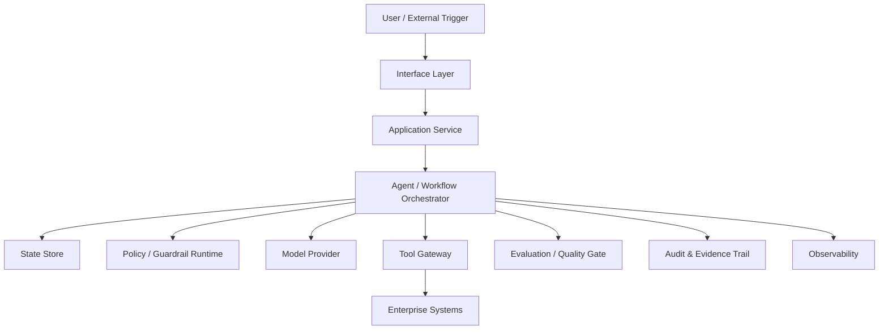
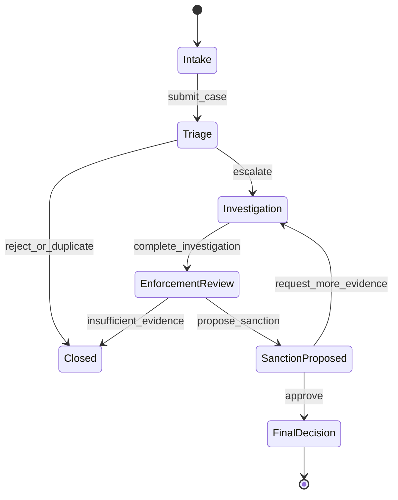
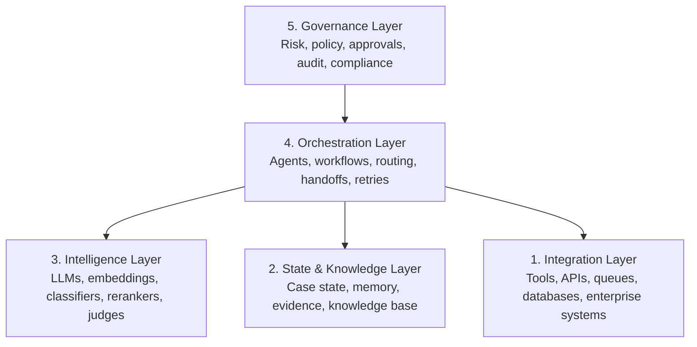
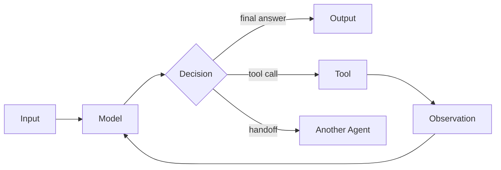
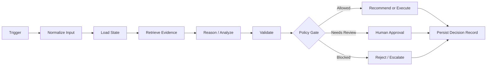
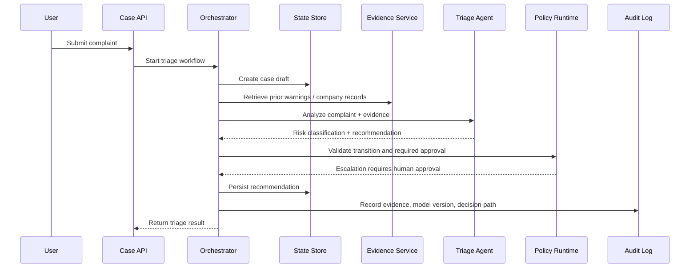
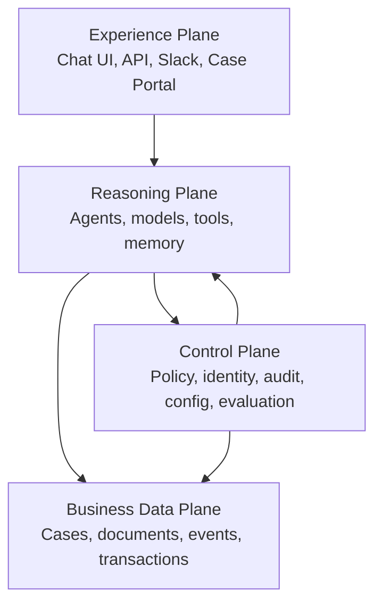
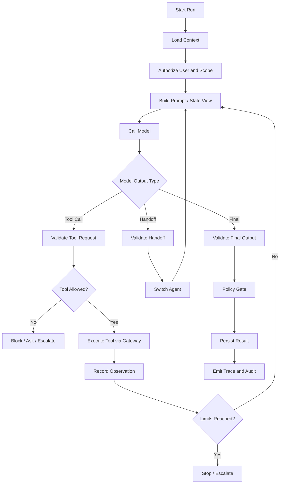
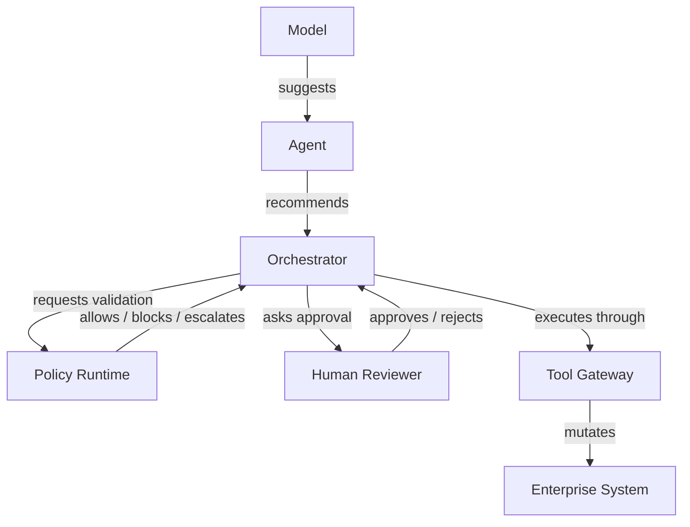

# Part 003 — Enterprise AI System Mental Model

Most failed enterprise AI systems do not fail because the model is weak. They fail because the team treats a **system** as if it were a **prompt**.

A chatbot can be useful with a prompt, a model, and a thin API wrapper. An enterprise-grade stateful multi-agent system cannot. It needs a runtime, state model, contracts, authorization, auditability, observability, rollback strategy, evaluation discipline, and clear decision ownership.

In this part, we build the mental model that will anchor the rest of the series.

This part answers one question:

> What is the difference between a chatbot, an AI feature, an agent, and an enterprise stateful decision system?

The answer matters because every architecture mistake downstream usually comes from confusing these categories.

---

## 1. Target Skill

After this part, you should be able to:

1. Explain why enterprise AI systems are not just LLM calls.
2. Separate chat UX, model inference, orchestration, state, tools, policy, and business decisioning.
3. Identify the minimum architecture required before an agent is allowed to affect business state.
4. Distinguish assistive AI from delegated AI.
5. Decide when a system should be implemented as a simple workflow, a single agent, a multi-agent system, or a stateful decision platform.
6. Model agentic systems using invariants instead of hype terms.
7. Recognize where production risk actually lives: side effects, state mutation, tool access, escalation, and audit gaps.

This is not a coding-heavy part. It is an architecture calibration part.

Kaufman's learning principle for this part is **deconstruction**: break the skill into smaller subskills before practicing implementation. For enterprise AI systems, the skill is not “build an agent.” The real skill is decomposing the system into controllable layers.

---

## 2. The Core Mistake: Treating AI as a Function Call

A common early implementation looks like this:

```python
response = client.responses.create(
    model="...",
    input="Handle this customer complaint"
)
```

That is not an enterprise AI system. That is an inference call.

An inference call has no built-in understanding of:

- who the user is,
- what authority they have,
- what case state currently allows,
- what tools can be used,
- what evidence is valid,
- what action is reversible,
- what decision must be reviewed,
- what must be logged,
- what must be retained,
- what must never be exposed,
- what happens when execution fails halfway,
- what happens when the model gives a plausible but wrong answer.

A model call is only one step inside a system.

A top-level mental model:



The LLM is not the system. It is one dependency of the system.

In traditional software architecture, we rarely confuse a database query with the whole application. In AI systems, teams often confuse a prompt with the application. This is the first habit to remove.

---

## 3. Chatbot vs Enterprise Decision System

A chatbot is optimized for conversational interaction. An enterprise decision system is optimized for controlled state transition.

| Dimension | Chatbot Mindset | Enterprise Stateful System Mindset |
|---|---|---|
| Primary goal | Produce helpful text | Advance or support a controlled business process |
| Main artifact | Message | Decision, state transition, evidence, action |
| Memory | Conversation history | Versioned state, facts, events, user intent, evidence |
| Failure handling | Apologize / retry | Rollback, compensate, escalate, quarantine |
| Correctness | User satisfaction | Policy compliance, business invariant preservation |
| Security | Basic content filtering | Authorization, tool isolation, prompt-injection defense, data minimization |
| Observability | Logs | Traces, spans, decisions, tool calls, state diffs, model versions |
| Evaluation | Prompt test examples | Regression suites, simulations, golden tasks, adversarial cases |
| Ownership | Product / support | Product + engineering + risk + legal + operations |
| Output | Natural language answer | Actionable result with traceable rationale |

The critical shift is this:

> In an enterprise AI system, text is usually not the final product. Text is an interface to a controlled decision or workflow.

For example, consider a regulatory enforcement case platform.

A chatbot might answer:

> “This case appears high risk and should be escalated.”

An enterprise decision system must produce something closer to:

```json
{
  "case_id": "CASE-2026-00127",
  "recommended_transition": "ESCALATE_TO_INVESTIGATION",
  "current_state": "INTAKE_REVIEW",
  "allowed_transition": true,
  "confidence": "medium",
  "evidence": [
    {
      "type": "document",
      "id": "DOC-771",
      "claim": "Repeated violation within 12 months"
    },
    {
      "type": "system_record",
      "id": "ENF-992",
      "claim": "Prior warning issued"
    }
  ],
  "policy_basis": [
    "escalation_rule.repeat_violation",
    "case_policy.material_consumer_harm"
  ],
  "requires_human_approval": true,
  "prohibited_actions": [
    "AUTO_NOTIFY_RESPONDENT",
    "AUTO_CLOSE_CASE"
  ]
}
```

This output is not just “smarter text.” It is structured, constrained, auditable, and tied to workflow semantics.

---

## 4. The System Is a State Transition Machine with Probabilistic Advisors

The simplest robust mental model is:

> The enterprise system is a deterministic state transition machine assisted by probabilistic components.

This framing prevents dangerous architectural drift.

The business process should remain explicit:



The AI system can help with:

- classification,
- summarization,
- evidence extraction,
- recommendation,
- anomaly detection,
- drafting,
- comparison against policy,
- next-best-action suggestions,
- routing,
- simulation of scenarios.

But the AI should not silently redefine the process.

A robust enterprise AI architecture usually separates:

1. **State authority**: what is the current source of truth?
2. **Decision authority**: who or what may decide the next state?
3. **Recommendation authority**: which model/agent may suggest action?
4. **Execution authority**: which component may mutate external systems?
5. **Audit authority**: where evidence of decisions is recorded?

If those authorities are mixed together, the system becomes difficult to govern.

---

## 5. The Five-Layer Mental Model

A useful enterprise mental model has five layers.



Each layer answers a different question.

| Layer | Primary Question | Typical Failure If Missing |
|---|---|---|
| Integration | What can the system touch? | Unsafe tool use, inconsistent side effects |
| State & Knowledge | What does the system know and remember? | Lost context, stale facts, unverifiable claims |
| Intelligence | What can the model infer or generate? | Hallucination, weak classification, poor reasoning |
| Orchestration | What happens next? | Loops, chaos, unbounded autonomy |
| Governance | What is allowed and accountable? | Compliance failure, invisible risk, no defensibility |

Many teams over-invest in layer 3 and under-invest in layers 2, 4, and 5.

Enterprise grade usually means the opposite: intelligence is important, but controlled state, orchestration, and governance dominate architecture.

---

## 6. Model, Agent, Workflow, and System

These terms are often used loosely. We need sharper definitions.

### 6.1 Model

A model is a probabilistic inference engine.

It can:

- generate text,
- classify,
- extract,
- transform,
- reason approximately,
- call tools if wrapped by a runtime,
- produce structured output if constrained.

It does not automatically own:

- durable memory,
- business authority,
- tool execution safety,
- audit trail,
- retry semantics,
- transaction boundaries.

### 6.2 Agent

An agent is a runtime-controlled loop where a model can select actions toward a goal under constraints.

A minimal agent loop:



Modern agent runtimes usually include concepts such as tools, handoffs, sessions, guardrails, and traces. But an agent is still not automatically enterprise-grade.

### 6.3 Workflow

A workflow is a predefined sequence or graph of steps.

A workflow is better when:

- the path is known,
- compliance matters,
- state transitions must be explicit,
- failure handling must be deterministic,
- business operations need predictable behavior.

### 6.4 Multi-Agent System

A multi-agent system contains multiple specialized agents collaborating, competing, reviewing, or handing off work.

It is useful when:

- roles are genuinely distinct,
- expertise differs,
- independent verification is valuable,
- planning and execution should be separated,
- escalation or adjudication is required.

It is harmful when used only because it sounds sophisticated.

### 6.5 Enterprise AI System

An enterprise AI system is a production system that uses AI components inside controlled business, security, operational, and governance boundaries.

Its important outputs are not only model responses. They are:

- state transitions,
- recommendations,
- tool executions,
- evidence bundles,
- decision records,
- task assignments,
- exceptions,
- escalations,
- audit artifacts.

---

## 7. Stateful Means More Than Chat History

In many demos, “stateful” means appending previous messages to the next prompt.

That is not enough.

Enterprise state has multiple dimensions.

| State Type | Description | Example |
|---|---|---|
| Conversation state | Messages and user interaction context | User asked about sanction policy |
| Execution state | Current run, step, retry count, active agent | Investigation agent awaiting tool result |
| Domain state | Business object lifecycle | Case is in `TRIAGE_PENDING_REVIEW` |
| Evidence state | Claims and supporting sources | Document X supports allegation Y |
| Memory state | Durable learned or retained information | User preference, prior case pattern |
| Policy state | Applicable rules and constraints | Auto-escalation disabled for high-risk cases |
| Tool state | External side effects and integration responses | Email draft created, notification pending |
| Evaluation state | Quality checks and test outcomes | Output failed citation completeness rule |
| Audit state | Immutable trace of decisions and events | Agent recommended escalation at timestamp T |

A stateful multi-agent system must know which state is authoritative and which is merely contextual.

A conversation message saying “the case is closed” should not close a case. A verified state transition command may close a case if policy allows it.

This distinction is central.

---

## 8. The Enterprise AI System as a Decision Conveyor

A good mental model is a decision conveyor.



Every major enterprise action should move through stages:

1. **Trigger**: user request, event, schedule, external message.
2. **Normalization**: convert raw input into typed intent.
3. **State loading**: load relevant business, memory, and execution state.
4. **Evidence retrieval**: gather facts from trusted sources.
5. **Reasoning**: ask model/agent to analyze within constraints.
6. **Validation**: check structure, policy, evidence, quality.
7. **Decision**: approve, reject, escalate, defer, ask clarification.
8. **Execution**: mutate external systems only through controlled tools.
9. **Persistence**: write decision record and state changes.
10. **Observation**: emit traces, metrics, audit events.

This pipeline is more important than any single agent framework.

---

## 9. A Concrete Example: Regulatory Case Triage

Assume we are building an AI-assisted regulatory case platform.

The user submits a complaint:

> “Company X has continued offering the product after receiving multiple warnings. Customers are still being charged.”

A chatbot implementation might summarize the complaint and respond politely.

An enterprise stateful AI system would run something like this:



The important design point: the agent does not directly mutate the case lifecycle. The orchestrator and policy runtime mediate state transition.

A possible internal result:

```python
from enum import Enum
from pydantic import BaseModel, Field
from typing import Literal


class RiskLevel(str, Enum):
    low = "low"
    medium = "medium"
    high = "high"


class RecommendedTransition(str, Enum):
    request_more_information = "REQUEST_MORE_INFORMATION"
    close_duplicate = "CLOSE_DUPLICATE"
    escalate_to_investigation = "ESCALATE_TO_INVESTIGATION"


class EvidenceRef(BaseModel):
    source_type: Literal["document", "case_record", "system_record", "external_registry"]
    source_id: str
    claim: str
    confidence: RiskLevel


class TriageRecommendation(BaseModel):
    case_id: str
    risk_level: RiskLevel
    recommended_transition: RecommendedTransition
    rationale: str
    evidence: list[EvidenceRef]
    requires_human_approval: bool
    policy_checks: list[str] = Field(default_factory=list)
```

This object is still not enough by itself. It must be validated:

```python
def validate_recommendation(
    recommendation: TriageRecommendation,
    current_case_state: str,
    allowed_transitions: set[str],
) -> None:
    if recommendation.recommended_transition not in allowed_transitions:
        raise ValueError(
            f"Transition {recommendation.recommended_transition} is not allowed "
            f"from state {current_case_state}"
        )

    if recommendation.risk_level == RiskLevel.high and not recommendation.requires_human_approval:
        raise ValueError("High-risk cases must require human approval")

    if not recommendation.evidence:
        raise ValueError("Recommendation must include evidence")
```

The enterprise system constrains the AI result before it can influence the business process.

---

## 10. Three Planes of an Enterprise Agent Platform

A helpful architecture split is:

1. **Experience plane**
2. **Reasoning plane**
3. **Control plane**



### 10.1 Experience Plane

The experience plane handles user interaction.

Examples:

- chat UI,
- case management portal,
- API endpoint,
- back-office dashboard,
- Slack or Teams bot,
- email ingestion,
- event trigger.

The experience plane should not own deep business decision logic.

### 10.2 Reasoning Plane

The reasoning plane contains:

- agents,
- model calls,
- prompt templates,
- retrieval,
- tool selection,
- analysis loops,
- structured output parsing.

This is where many developers focus. It is important, but it is not enough.

### 10.3 Control Plane

The control plane manages:

- policy,
- permissions,
- model routing,
- feature flags,
- rollout strategy,
- guardrails,
- evaluation gates,
- audit configuration,
- trace sampling,
- risk thresholds,
- kill switches.

The control plane is what turns an AI prototype into an enterprise platform.

### 10.4 Business Data Plane

The data plane contains the actual enterprise systems:

- case database,
- document store,
- customer records,
- payment system,
- notification system,
- enforcement action system,
- reporting warehouse.

Agents should interact with these systems through explicit, permissioned tools, not arbitrary direct access.

---

## 11. Responsibility Boundaries

A clean enterprise AI system has strong boundaries.

| Component | Should Do | Should Not Do |
|---|---|---|
| Model | Infer, generate, classify, extract | Directly own business truth |
| Agent | Decide next reasoning/action step | Bypass policy or mutate systems freely |
| Orchestrator | Manage flow, state, retries, handoffs | Hide business rules inside prompts |
| Policy runtime | Enforce permissions and constraints | Depend on model goodwill |
| Tool gateway | Expose safe capabilities | Expose raw internal systems without scope |
| State store | Persist authoritative state | Store untrusted claims as facts |
| Evaluator | Measure quality and regressions | Be treated as perfect oracle |
| Audit log | Preserve defensible evidence | Store vague summaries only |

A useful rule:

> Anything that must be guaranteed should not live only in a prompt.

Prompts are instructions, not enforcement.

If a business rule says “high-risk sanctions require human approval,” that rule belongs in code/policy, not only in a system prompt.

---

## 12. Probabilistic Components Need Deterministic Containers

LLMs are probabilistic. Enterprise processes need predictable behavior.

The solution is not to pretend the model is deterministic. The solution is to put probabilistic reasoning inside deterministic containers.

Examples:

| Risk | Deterministic Container |
|---|---|
| Model may return invalid JSON | Schema validation and repair boundary |
| Model may recommend forbidden action | Policy gate before execution |
| Model may cite weak evidence | Evidence quality validator |
| Model may loop | Max steps, timeout, budget, stop conditions |
| Model may call wrong tool | Tool allowlist and argument validation |
| Model may over-disclose data | Output filter and data classification policy |
| Model may drift after model upgrade | Evaluation regression suite |
| Model may act with stale state | State version checks and optimistic locking |

A simple Python boundary:

```python
class AgentExecutionLimits(BaseModel):
    max_steps: int = 12
    max_tool_calls: int = 8
    timeout_seconds: int = 90
    max_total_cost_usd: float = 0.50


class AgentRunContext(BaseModel):
    run_id: str
    user_id: str
    case_id: str
    state_version: int
    permissions: set[str]
    limits: AgentExecutionLimits
```

Even if the model is flexible, the runtime has limits.

---

## 13. The Enterprise Agent Runtime Loop

A production-grade agent runtime loop is not just “while not done, call LLM.” It needs control points.



Notice the repeated validations:

- before model call,
- after model output,
- before tool execution,
- after tool observation,
- before final state mutation,
- before user-visible output.

This is not bureaucracy. This is how you prevent an AI system from becoming an uncontrolled side-effect machine.

---

## 14. What “Enterprise Grade” Actually Means

Enterprise grade is not about using Kubernetes, Kafka, or a famous framework.

Enterprise grade means the system can be trusted under real organizational constraints.

A practical definition:

> An enterprise-grade AI system is one that can be operated, audited, secured, evaluated, upgraded, and recovered without relying on heroics.

That implies:

### 14.1 Operable

Operators can answer:

- What is the system doing right now?
- Which runs are stuck?
- Which tools are failing?
- Which model version is used?
- Which cost bucket is growing?
- Which users are affected?

### 14.2 Auditable

Auditors can answer:

- What decision was made?
- Who or what recommended it?
- What evidence was used?
- What policy was applied?
- Was human approval required?
- Was it granted?
- What data was exposed?

### 14.3 Secure

Security teams can answer:

- Which tools can this agent access?
- What data can it retrieve?
- How is prompt injection handled?
- Can it exfiltrate secrets?
- Can it perform unauthorized actions?
- Are tool credentials scoped?

### 14.4 Evaluated

Engineering can answer:

- Did quality improve or regress?
- Which scenarios fail?
- What changed after prompt/model/tool update?
- How does the system behave under adversarial input?

### 14.5 Recoverable

Operations can answer:

- Can a failed run resume?
- Can a bad output be quarantined?
- Can a side effect be compensated?
- Can we roll back model/prompt/tool versions?

---

## 15. The Decision Rights Model

In enterprise systems, not every component has the same authority.

A useful model:



Decision rights should be explicit:

| Decision | Owner |
|---|---|
| Which model to call | Platform/runtime policy |
| Which tool is allowed | Policy runtime / authorization |
| Whether output is structurally valid | Schema validator |
| Whether evidence is sufficient | Evidence policy + evaluator |
| Whether case can transition | Business workflow engine |
| Whether high-risk action executes | Human approver or delegated authority |
| Whether run is acceptable | Evaluation and quality gates |

A mature system does not ask “Can the model do this?” first.

It asks:

> Who is allowed to decide this, under what evidence, with what audit trail, and what recovery path?

---

## 16. Stateful AI System Invariants

An invariant is a rule that must always remain true.

Enterprise AI systems need invariants because model behavior is variable.

Examples:

### 16.1 State Invariants

- A case cannot move from `INTAKE` directly to `FINAL_SANCTION`.
- A closed case cannot be mutated except by reopening workflow.
- A recommendation must reference the state version it observed.
- A run cannot persist a transition if the state version changed underneath it.

### 16.2 Tool Invariants

- A tool call must have a user, run, purpose, and authorization scope.
- A destructive tool must require explicit confirmation or policy approval.
- A tool observation must be recorded before the next model step.
- Tool outputs are untrusted until validated.

### 16.3 Evidence Invariants

- A high-risk recommendation must include evidence.
- Evidence must be source-addressable, not just quoted.
- Generated text is not evidence.
- Retrieved documents may support evidence but must not be blindly trusted.

### 16.4 Security Invariants

- Prompt instructions from external content cannot override system policy.
- User-provided content cannot grant tools or permissions.
- Model output cannot create authorization.
- Secrets must not be placed in model context unless explicitly permitted.

### 16.5 Operational Invariants

- Every run must have a trace ID.
- Every model call must record model version and prompt version.
- Every side-effecting tool call must be idempotent or compensatable.
- Every automated action must have an owner and rollback plan.

Invariants are where engineering maturity becomes visible.

---

## 17. A Minimal Enterprise Agent System Skeleton

At a high level, the architecture could look like this:

```python
from dataclasses import dataclass
from typing import Protocol, Any


@dataclass(frozen=True)
class RunIdentity:
    run_id: str
    user_id: str
    tenant_id: str
    correlation_id: str


@dataclass(frozen=True)
class StateSnapshot:
    entity_id: str
    entity_type: str
    state_name: str
    version: int
    data: dict[str, Any]


@dataclass(frozen=True)
class DecisionRecord:
    run_id: str
    entity_id: str
    decision_type: str
    recommendation: dict[str, Any]
    evidence_refs: list[str]
    policy_results: list[str]
    approved_by: str | None


class StateRepository(Protocol):
    async def load(self, entity_id: str) -> StateSnapshot: ...
    async def compare_and_set(self, snapshot: StateSnapshot, new_state: dict[str, Any]) -> None: ...


class PolicyRuntime(Protocol):
    async def authorize(self, identity: RunIdentity, action: str, resource: str) -> bool: ...
    async def evaluate_decision(self, decision: DecisionRecord) -> list[str]: ...


class AuditSink(Protocol):
    async def record(self, decision: DecisionRecord) -> None: ...
```

The important idea is not the code itself. The important idea is that state, policy, and audit are first-class boundaries, not afterthoughts.

---

## 18. Architecture Smells

These smells indicate that the system is still a prototype even if it is deployed.

### Smell 1 — Prompt Owns Business Rules

Example:

> “Do not approve high-risk cases without manager review.”

If this only appears in a prompt, it is not enforcement.

Better:

- prompt includes instruction,
- policy runtime enforces it,
- tests verify it,
- audit records it.

### Smell 2 — Agent Has Direct Database Write Access

If an agent can directly update production tables, you have unclear transaction boundaries.

Better:

- agent emits intent,
- orchestrator validates,
- command handler mutates state,
- audit log records decision.

### Smell 3 — Conversation History Is the Only State

Conversation history is not enough for business correctness.

Better:

- domain state,
- evidence state,
- execution state,
- memory state,
- policy state.

### Smell 4 — No Run Replay

If you cannot reconstruct why an agent acted, you cannot debug or defend it.

Better:

- trace ID,
- model version,
- prompt version,
- tool inputs/outputs,
- state snapshot references,
- decision record.

### Smell 5 — Multi-Agent Used for Simple Routing

If a deterministic router can solve the problem, a multi-agent swarm is usually unnecessary.

Better:

- use a simple workflow first,
- introduce agents only where flexible reasoning is required,
- introduce multiple agents only where role separation creates measurable value.

---

## 19. A Better Design Question

Bad question:

> Which agent framework should we use?

Better questions:

1. What business state can this system affect?
2. What decisions are advisory vs delegated?
3. What evidence is required for each decision?
4. What tools can cause side effects?
5. What must be human-approved?
6. What are the invariants?
7. What must be observable?
8. What must be replayable?
9. What failure modes are unacceptable?
10. What evaluation suite blocks release?

Frameworks matter, but they do not replace architecture.

LangGraph, OpenAI Agents SDK, Microsoft Agent Framework, MCP, and similar tools provide useful building blocks. The enterprise design still belongs to the engineering team.

---

## 20. Practice Drill

Design a minimal stateful AI assistant for enforcement case triage.

Do not write code first. Produce these artifacts:

### 20.1 Business Object

Define the primary object.

Example:

```yaml
object: EnforcementCase
states:
  - DRAFT
  - INTAKE_REVIEW
  - TRIAGE
  - INVESTIGATION
  - ENFORCEMENT_REVIEW
  - CLOSED
```

### 20.2 AI Responsibilities

Define what the AI may do.

Example:

```yaml
ai_may:
  - summarize complaint
  - classify risk
  - extract entities
  - recommend transition
  - draft reviewer note

ai_must_not:
  - close case automatically
  - notify respondent automatically
  - create sanction without approval
  - treat generated text as evidence
```

### 20.3 Invariants

Write at least ten invariants.

Example:

```yaml
invariants:
  - high_risk_case_requires_human_approval
  - recommendation_requires_evidence
  - transition_must_be_allowed_from_current_state
  - side_effecting_tool_requires_idempotency_key
  - external_document_instructions_must_not_override_system_policy
```

### 20.4 Trace Requirements

Define what must be logged.

Example:

```yaml
trace:
  - run_id
  - user_id
  - case_id
  - state_version
  - model_version
  - prompt_version
  - retrieved_evidence
  - tool_calls
  - policy_results
  - final_recommendation
```

### 20.5 Evaluation Scenarios

Define at least five scenarios:

1. normal low-risk complaint,
2. high-risk complaint with strong evidence,
3. high-risk complaint with weak evidence,
4. prompt injection inside uploaded document,
5. stale state detected before transition.

This drill forces the right mindset: state and governance before agent cleverness.

---

## 21. Review Questions

1. Why is a model call not an enterprise AI system?
2. What is the difference between conversation state and domain state?
3. Why should high-risk business rules not live only in prompts?
4. What are decision rights, and why do they matter?
5. What is the difference between recommendation authority and execution authority?
6. Why is generated text not evidence?
7. What should happen before a side-effecting tool call executes?
8. What are examples of deterministic containers around probabilistic components?
9. How can multi-agent systems make architecture worse?
10. What makes an AI system auditable?

---

## 22. What Top 1% Engineers Pay Attention To

Top engineers do not start by asking how to make the agent smarter. They ask how to make the system safe, inspectable, recoverable, and useful under real constraints.

They pay attention to:

1. **Authority boundaries**: what the model suggests vs what the system allows.
2. **State correctness**: which state is authoritative, stale, tentative, or inferred.
3. **Evidence quality**: whether claims are traceable to real sources.
4. **Tool safety**: what can mutate production systems.
5. **Policy enforcement**: what is guaranteed outside the prompt.
6. **Failure handling**: what happens when the model loops, lies, times out, or calls the wrong tool.
7. **Observability**: whether decisions can be reconstructed.
8. **Evaluation**: whether behavior is tested before release.
9. **Human control**: where review, approval, and override exist.
10. **Operational ownership**: who gets paged when the agent platform misbehaves.

The core professional shift is this:

> Build AI systems as controlled stateful platforms, not as clever text generators.

---

## 23. References

- Josh Kaufman, *The First 20 Hours: How to Learn Anything ... Fast*.
- LangGraph documentation: low-level orchestration for long-running, stateful agents.
- LangGraph workflows and agents documentation: distinction between predetermined workflows and dynamic agents.
- OpenAI Agents SDK documentation: running agents, tools, handoffs, sessions, guardrails, and tracing.
- Microsoft Agent Framework documentation: Python/.NET agent and multi-agent workflow concepts, session-based state, type safety, filters, telemetry.
- Model Context Protocol specification: tools, resources, prompts, and client-server integration model.
- NIST AI Risk Management Framework.
- OWASP Top 10 for LLM Applications.
- OpenTelemetry Python documentation.
