# Part 004 — Agentic System Taxonomy

A system cannot be designed well if the category is unclear.

Many teams use the word “agent” for everything:

- a chat completion,
- a prompt template,
- a RAG chain,
- a workflow,
- a tool-calling loop,
- a background job,
- a multi-agent simulation,
- a copilot,
- an autonomous worker.

That vocabulary collapse creates bad architecture. If every AI feature is called an agent, teams overbuild simple features and under-control dangerous ones.

This part builds a practical taxonomy.

The goal is not academic classification. The goal is architectural precision.

---

## 1. Target Skill

After this part, you should be able to:

1. Classify an AI system by autonomy, statefulness, tool access, side-effect risk, and decision authority.
2. Choose between prompt-only, chain, workflow, single-agent, multi-agent, copilot, and autonomous worker designs.
3. Explain why multi-agent is not automatically more advanced.
4. Identify when deterministic workflow should dominate model autonomy.
5. Design escalation from low-risk assistive AI to high-risk delegated AI.
6. Avoid using agents where a simpler architecture is safer and cheaper.
7. Build an enterprise decision matrix for agentic architecture selection.

Kaufman's framework applies here through **removing barriers to practice**. A clear taxonomy removes a major barrier: ambiguity. Once we know what kind of system we are building, we know what constraints and tests it needs.

---

## 2. The Taxonomy Axis

Instead of asking “Is this an agent?”, ask these seven questions:

1. **Does it maintain state?**
2. **Can it choose its own next step?**
3. **Can it call tools?**
4. **Can it mutate external systems?**
5. **Can it delegate to other agents?**
6. **Can it make or recommend business decisions?**
7. **Can it run without a human actively supervising each step?**

These axes define the risk profile.

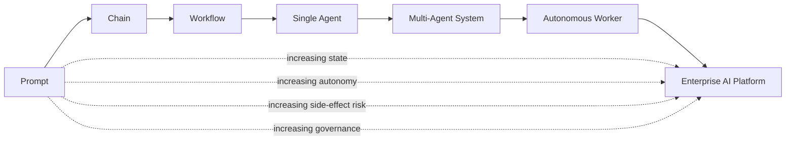

The more autonomy and side-effect power the system has, the more deterministic control it needs.

This is a key paradox:

> More agent autonomy requires more non-agent control infrastructure.

---

## 3. Category 1 — Prompt-Only AI Feature

A prompt-only feature sends input to a model and displays the output.

Examples:

- “Summarize this paragraph.”
- “Rewrite this message.”
- “Generate a draft response.”
- “Explain this policy in simple language.”

### 3.1 Architecture

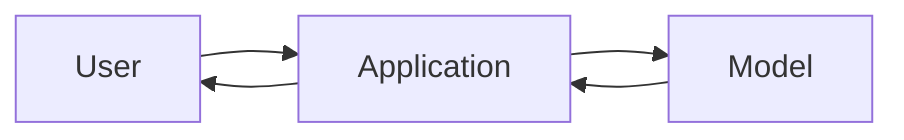

### 3.2 Good Use Cases

Use this when:

- output is advisory,
- no external tools are needed,
- no durable memory is required,
- no business state is mutated,
- user reviews the output before action,
- incorrect output has low impact.

### 3.3 Enterprise Controls

Minimum controls:

- input size limits,
- output moderation or filtering where relevant,
- model/provider logging policy,
- prompt versioning,
- basic telemetry,
- user-visible disclaimer if output is advisory.

### 3.4 Common Mistake

The common mistake is letting prompt-only features quietly evolve into decision systems.

Example:

> A summarizer starts adding “recommended action” text. Users begin treating that as official guidance. Eventually it becomes a shadow decision system without governance.

Do not let output semantics drift without architecture review.

---

## 4. Category 2 — Chain / Pipeline

A chain is a fixed sequence of model and non-model steps.

Examples:

- classify → retrieve → summarize,
- extract entities → validate JSON → store draft,
- translate → redact → format,
- retrieve policy → answer with citation.

### 4.1 Architecture

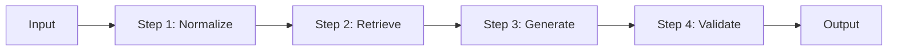

### 4.2 Good Use Cases

Use chains when:

- the order of steps is predictable,
- each step has clear input/output,
- no dynamic planning is required,
- failure handling is simple,
- business wants consistency more than autonomy.

### 4.3 Python Sketch

```python
from pydantic import BaseModel


class ComplaintInput(BaseModel):
    text: str


class ComplaintClassification(BaseModel):
    category: str
    risk: str
    entities: list[str]


async def triage_chain(input_: ComplaintInput) -> ComplaintClassification:
    normalized = normalize_text(input_.text)
    extracted = await extract_entities(normalized)
    classification = await classify_complaint(normalized, extracted)
    return validate_classification(classification)
```

### 4.4 Enterprise Controls

Minimum controls:

- typed input/output per step,
- per-step timeout,
- structured errors,
- retry policy,
- validation boundary,
- trace per step,
- test fixtures for each transformation.

### 4.5 Common Mistake

Using an agent for a chain.

If every step is known in advance, a chain is often better than an agent. It is easier to test, cheaper to run, simpler to reason about, and safer.

---

## 5. Category 3 — Deterministic Workflow

A workflow is a graph of steps with explicit branching, state transitions, and failure paths.

Examples:

- case triage workflow,
- document review workflow,
- customer complaint escalation,
- internal approval process,
- incident investigation workflow.

### 5.1 Architecture

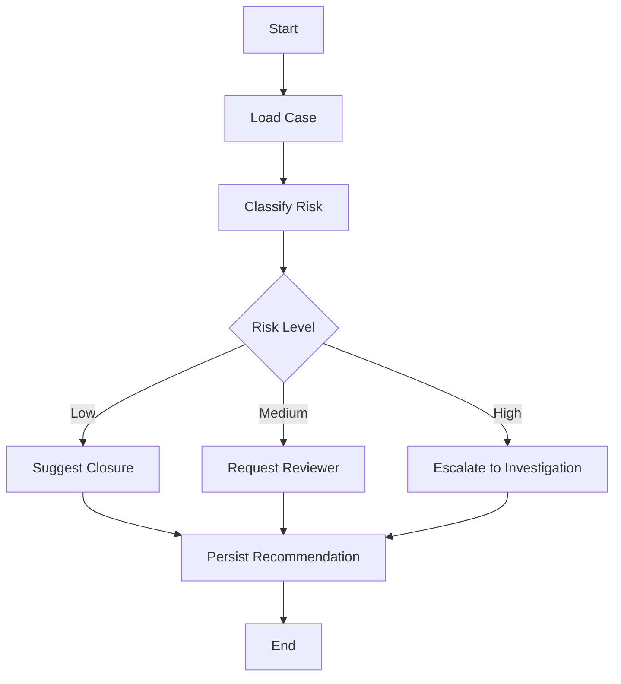

### 5.2 Good Use Cases

Use workflows when:

- process state matters,
- auditability matters,
- paths are mostly known,
- business rules are explicit,
- side effects must be controlled,
- recovery and replay are required.

### 5.3 Workflow vs Chain

| Dimension | Chain | Workflow |
|---|---|---|
| Shape | Linear | Graph/state machine |
| Branching | Minimal | First-class |
| State | Often transient | Durable or semi-durable |
| Failure handling | Step-level | Path-aware |
| Business process | Simple | Explicit |
| Auditability | Medium | High |

### 5.4 Enterprise Controls

Minimum controls:

- workflow state model,
- transition constraints,
- idempotency keys,
- retry and compensation,
- audit events,
- dead-letter handling,
- versioned workflow definitions,
- state hydration/resume.

### 5.5 Common Mistake

Hiding workflow branching inside a prompt.

Bad:

```text
You are a case triage assistant. If high risk, escalate. If low risk, suggest closure.
```

Better:

- model classifies risk,
- workflow branch uses typed classification,
- policy validates branch,
- transition is persisted with audit.

---

## 6. Category 4 — Tool-Calling Assistant

A tool-calling assistant can invoke external capabilities, but usually remains user-facing and bounded.

Examples:

- “Find my open cases.”
- “Search documents related to this complaint.”
- “Draft an email using case facts.”
- “Create a ticket, but ask me before submitting.”

### 6.1 Architecture

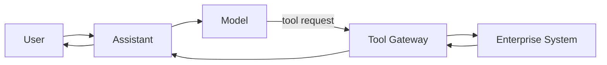

### 6.2 Good Use Cases

Use this when:

- users need natural language access to tools,
- tools are read-only or low-risk,
- the assistant should ask before side effects,
- user remains in control,
- tasks are short-lived.

### 6.3 Tool Risk Levels

| Risk Level | Tool Type | Example | Control |
|---|---|---|---|
| Low | Read-only public info | Search documentation | Logging |
| Medium | Read internal data | Get case details | Authorization + data minimization |
| High | Create draft side effect | Draft notification | Confirmation |
| Critical | Mutate official state | Close case | Policy + approval + audit |

### 6.4 Python Sketch

```python
from enum import Enum
from pydantic import BaseModel


class ToolRisk(str, Enum):
    low = "low"
    medium = "medium"
    high = "high"
    critical = "critical"


class ToolSpec(BaseModel):
    name: str
    risk: ToolRisk
    required_permission: str
    side_effecting: bool = False


def requires_confirmation(tool: ToolSpec) -> bool:
    return tool.side_effecting or tool.risk in {ToolRisk.high, ToolRisk.critical}
```

### 6.5 Common Mistake

Treating tool calls as harmless because the model “only calls functions.”

Tool calls are where AI becomes operationally dangerous. A bad answer is a content problem. A bad tool call can become a business, security, financial, or legal problem.

---

## 7. Category 5 — Single Agent

A single agent can choose steps dynamically toward a goal.

Examples:

- research assistant,
- investigation assistant,
- code maintenance assistant,
- compliance review assistant,
- support resolution assistant.

### 7.1 Architecture

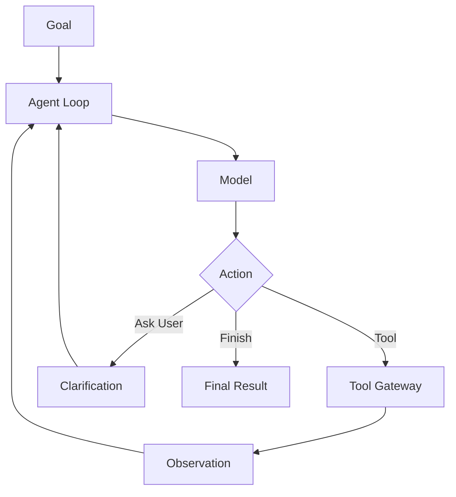

### 7.2 Good Use Cases

Use a single agent when:

- the path cannot be fully predefined,
- tool selection depends on intermediate findings,
- the task is bounded,
- one role is sufficient,
- output can be validated,
- side effects are limited or gated.

### 7.3 Required Runtime Controls

A single agent needs:

- max step count,
- max tool count,
- timeout,
- cost budget,
- tool allowlist,
- structured final output,
- trace logging,
- stop conditions,
- escalation condition,
- state checkpointing if long-running.

### 7.4 Common Mistake

Letting the agent define completion criteria by itself.

Better:

```python
class CompletionCriteria(BaseModel):
    required_fields: set[str]
    min_evidence_count: int
    must_pass_policy_checks: bool
    requires_human_review: bool
```

The agent can propose that it is done. The runtime should verify whether “done” is acceptable.

---

## 8. Category 6 — Multi-Agent System

A multi-agent system contains multiple agents with distinct roles or responsibilities.

Examples:

- planner + executor + critic,
- researcher + verifier + writer,
- triage agent + policy agent + evidence agent,
- supervisor + specialist agents,
- debate/adjudication system,
- case investigation team simulation.

### 8.1 Architecture

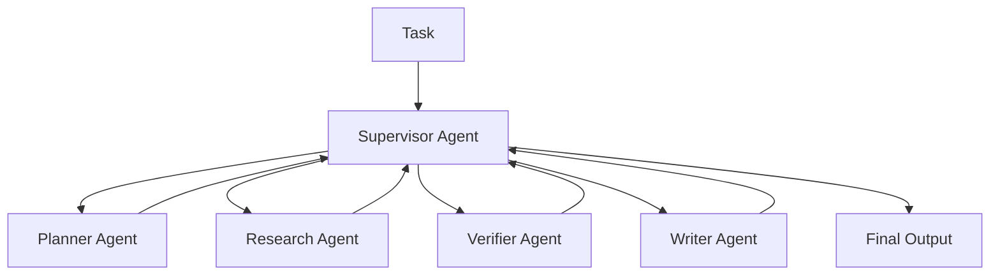

### 8.2 Good Use Cases

Use multi-agent systems when:

- role separation improves quality,
- independent verification is needed,
- different tools or permissions apply to each role,
- tasks are complex and decomposable,
- competing interpretations should be adjudicated,
- audit benefits from separating recommendation and review.

### 8.3 Bad Use Cases

Do not use multi-agent systems when:

- a deterministic workflow is enough,
- agents have overlapping responsibilities,
- the only goal is to make the demo impressive,
- cost/latency constraints are strict,
- no one can debug the interactions,
- final quality is not measurably better.

### 8.4 Role Separation Principle

A second agent is justified only if it has at least one of these differences:

1. different objective,
2. different tool access,
3. different context window,
4. different model capability,
5. different policy boundary,
6. different evaluation responsibility,
7. different human accountability path.

If two agents have the same goal, same tools, same context, and same authority, they are probably one agent split for aesthetic reasons.

---

## 9. Category 7 — Copilot

A copilot is an AI system that assists a human operator who remains responsible for the final action.

Examples:

- enforcement officer copilot,
- software engineering copilot,
- claims adjuster copilot,
- compliance analyst copilot,
- customer support copilot.

### 9.1 Architecture

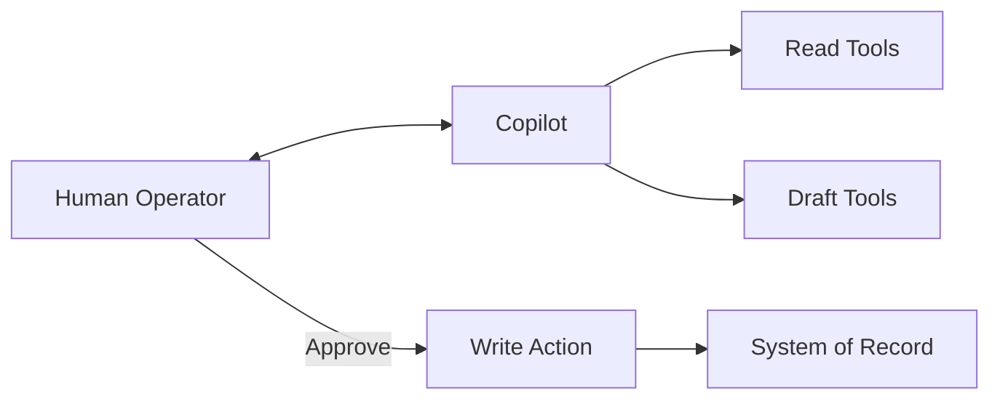

### 9.2 Good Use Cases

Use copilot mode when:

- human judgment is legally or operationally required,
- data is ambiguous,
- consequences are significant,
- trust must be built gradually,
- the AI improves speed but should not own accountability.

### 9.3 Copilot Control Model

| Capability | AI | Human |
|---|---|---|
| Search evidence | Yes | Review |
| Summarize case | Yes | Validate |
| Recommend action | Yes | Decide |
| Draft message | Yes | Approve |
| Mutate official state | Usually no | Yes |
| Override policy | No | Limited, audited |

### 9.4 Common Mistake

Calling a system a copilot while hiding automated decisions behind the scenes.

If the AI takes action without meaningful human review, it is not merely a copilot. It is delegated automation and needs stronger controls.

---

## 10. Category 8 — Autonomous Worker

An autonomous worker runs tasks with limited human supervision.

Examples:

- nightly compliance monitoring agent,
- automated evidence collection worker,
- code migration worker,
- support ticket resolver for low-risk cases,
- regulatory change monitoring agent.

### 10.1 Architecture

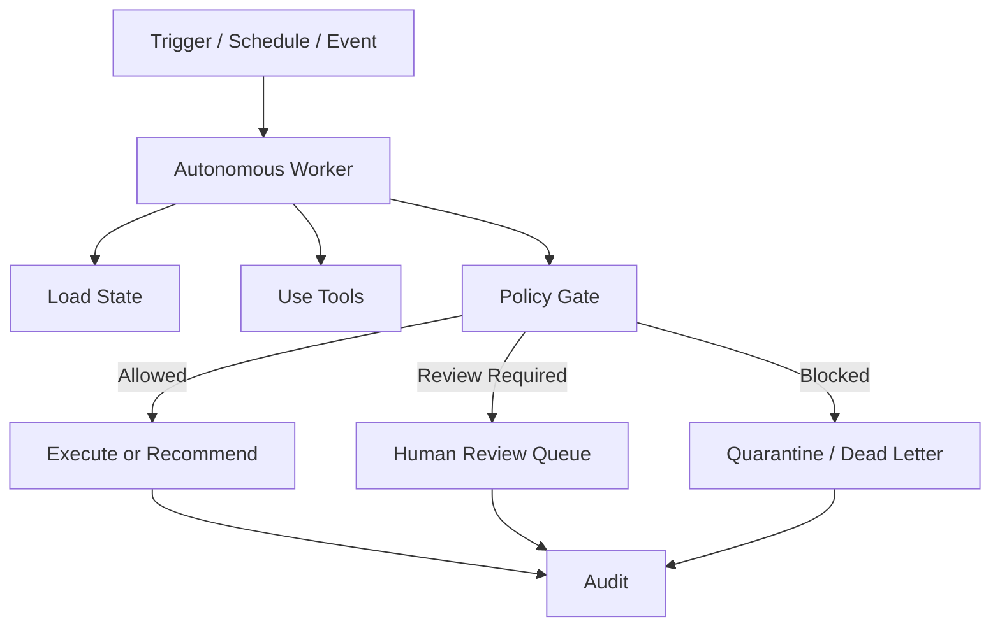

### 10.2 Good Use Cases

Use autonomous workers when:

- task boundaries are clear,
- risk is low or well-controlled,
- failure can be detected,
- recovery is possible,
- cost is bounded,
- outputs are evaluated,
- human review is available for exceptions.

### 10.3 Required Controls

Autonomous workers require stronger controls than copilots:

- explicit trigger conditions,
- scoped credentials,
- durable execution,
- budget limits,
- approval thresholds,
- anomaly detection,
- kill switch,
- replayable audit,
- dead-letter handling,
- run ownership,
- incident response playbook.

### 10.4 Common Mistake

Automating the happy path without exception design.

The real complexity of autonomous systems is not the normal path. It is ambiguous input, partial failure, stale state, policy conflict, tool outage, and model uncertainty.

---

## 11. Category 9 — Enterprise AI Platform

An enterprise AI platform is not one agent. It is a platform for building, operating, governing, and evaluating many AI capabilities.

Examples:

- internal agent platform,
- case management AI platform,
- regulated workflow AI runtime,
- multi-tenant AI automation platform.

### 11.1 Architecture

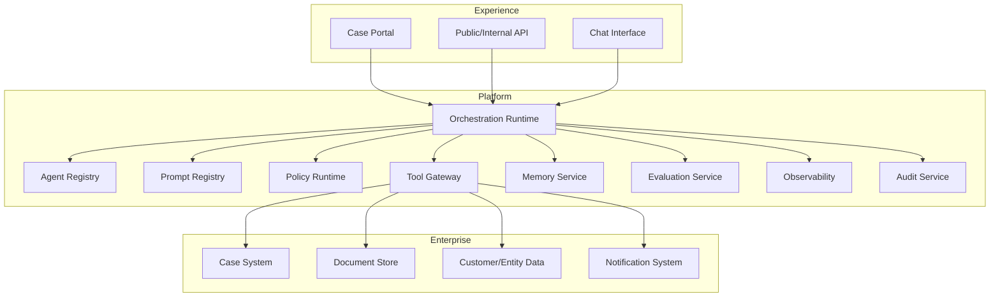

### 11.2 Platform Responsibilities

An enterprise AI platform owns:

- agent registration,
- model routing,
- prompt lifecycle,
- session state,
- memory policies,
- tool contracts,
- permissioning,
- guardrails,
- telemetry,
- evaluation,
- deployment safety,
- audit records,
- incident controls.

### 11.3 Common Mistake

Building every agent as a bespoke application.

This leads to repeated, inconsistent implementations of:

- tool auth,
- logging,
- tracing,
- prompt management,
- state persistence,
- evaluation,
- policy enforcement.

At enterprise scale, these become platform capabilities.

---

## 12. Autonomy Levels

A useful classification is autonomy level.

| Level | Name | Description | Example | Required Control |
|---:|---|---|---|---|
| 0 | No AI | Traditional software | Rule engine | Standard SDLC |
| 1 | Suggestive | AI generates content only | Draft summary | User review |
| 2 | Assistive | AI uses read tools | Search + summarize case | Auth + trace |
| 3 | Recommendatory | AI recommends business action | Suggest escalation | Evidence + policy gate |
| 4 | Semi-delegated | AI prepares action for approval | Draft sanction notice | Human approval |
| 5 | Delegated low-risk | AI executes bounded low-risk action | Tag duplicate ticket | Audit + rollback |
| 6 | Delegated high-risk | AI executes consequential action | Close enforcement case | Strong governance, usually avoid |

Most enterprise systems should spend a long time at levels 2–4 before moving to level 5.

Level 6 should be rare, heavily governed, and domain-specific.

---

## 13. Statefulness Levels

Not all stateful systems are equal.

| Level | State Type | Description | Example |
|---:|---|---|---|
| 0 | Stateless | Each request independent | Rewrite text |
| 1 | Session state | Remembers current conversation | Support chat |
| 2 | Task state | Remembers multi-step task progress | Research run |
| 3 | Domain state | Reads/writes business lifecycle | Case triage |
| 4 | Durable execution state | Can pause/resume/replay | Long-running investigation |
| 5 | Cross-session memory | Remembers across time/users/entities | User/team preference, case patterns |
| 6 | Institutional memory | Shared learned operational knowledge | Governance knowledge base |

The higher the statefulness level, the more you need:

- schema discipline,
- versioning,
- retention policy,
- consistency model,
- privacy controls,
- auditability,
- migration strategy.

---

## 14. Tool Access Levels

Tool access determines risk more than model capability.

| Level | Access | Example | Risk |
|---:|---|---|---|
| 0 | No tools | Summarization | Low |
| 1 | Static knowledge | Retrieve docs | Low-medium |
| 2 | Internal read | Read case/customer data | Medium |
| 3 | Draft side effect | Create draft email/ticket | Medium-high |
| 4 | Reversible write | Add label, assign task | High |
| 5 | Irreversible/consequential write | Close case, issue refund, sanction | Critical |
| 6 | Administrative action | Change permissions, delete records | Extreme |

A simple design rule:

> Tool access should be minimized before model behavior is optimized.

A weak model with safe tools is annoying. A strong model with dangerous tools is an incident waiting to happen.

---

## 15. Decision Authority Levels

Decision authority answers: what is the AI allowed to decide?

| Level | Authority | Description |
|---:|---|---|
| 0 | None | Produces content only |
| 1 | Formatting | Chooses wording/structure |
| 2 | Classification | Assigns categories/risk labels |
| 3 | Recommendation | Suggests business action |
| 4 | Routing | Sends work to queue/team |
| 5 | Low-risk execution | Executes reversible action |
| 6 | High-risk execution | Executes consequential action |

An enterprise AI review should always ask:

> Are we increasing model capability, or are we increasing decision authority?

Those are different risk changes.

---

## 16. Choosing the Right Architecture

Use this matrix.

| Requirement | Recommended Architecture |
|---|---|
| Generate text only | Prompt-only feature |
| Fixed transformation steps | Chain/pipeline |
| Known process with branches | Deterministic workflow |
| Natural language access to tools | Tool-calling assistant |
| Dynamic task solving with bounded scope | Single agent |
| Role-separated complex task | Multi-agent system |
| Human responsible for final action | Copilot |
| Repeated background task | Autonomous worker |
| Many teams building agents | Enterprise AI platform |

A decision tree:

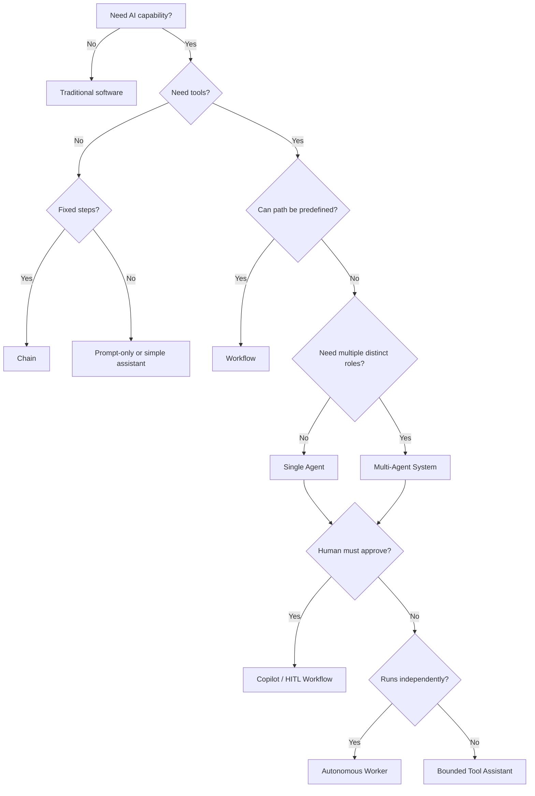

---

## 17. Enterprise Examples by Category

### 17.1 Document Summary

- Category: Prompt-only or chain.
- Statefulness: low.
- Tool risk: none or read-only.
- Governance: prompt versioning, privacy, output disclaimer.

### 17.2 Case Triage Recommendation

- Category: workflow + model classification.
- Statefulness: domain state.
- Tool risk: internal read.
- Governance: evidence, policy gate, audit.

### 17.3 Investigation Assistant

- Category: single agent or copilot.
- Statefulness: task state + evidence state.
- Tool risk: internal read, draft side effects.
- Governance: tool authorization, trace, human review.

### 17.4 Enforcement Decision Drafting

- Category: copilot workflow.
- Statefulness: domain state.
- Tool risk: draft side effect.
- Governance: human approval, citation validation, policy review.

### 17.5 Automated Low-Risk Ticket Routing

- Category: autonomous worker.
- Statefulness: task/domain state.
- Tool risk: reversible write.
- Governance: confidence threshold, rollback, sampling review.

### 17.6 Automated Sanction Issuance

- Category: delegated high-risk automation.
- Statefulness: domain state.
- Tool risk: consequential write.
- Governance: usually not appropriate without strict legal, policy, and human approval framework.

---

## 18. Multi-Agent Taxonomy

Not all multi-agent systems are the same.

### 18.1 Sequential Specialist Pattern

Agents run in sequence.

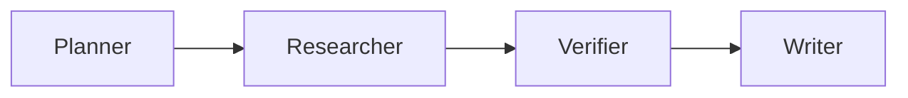

Use when each stage has a clear output.

### 18.2 Supervisor-Worker Pattern

A supervisor routes tasks to specialized workers.

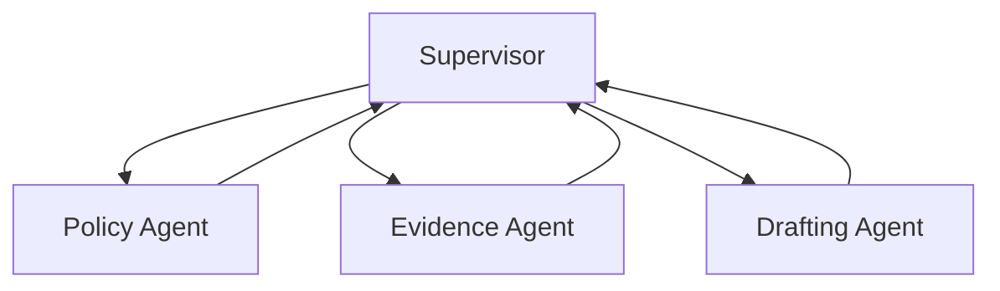

Use when routing and aggregation are important.

### 18.3 Debate / Adjudication Pattern

Multiple agents produce independent views. An adjudicator compares them.

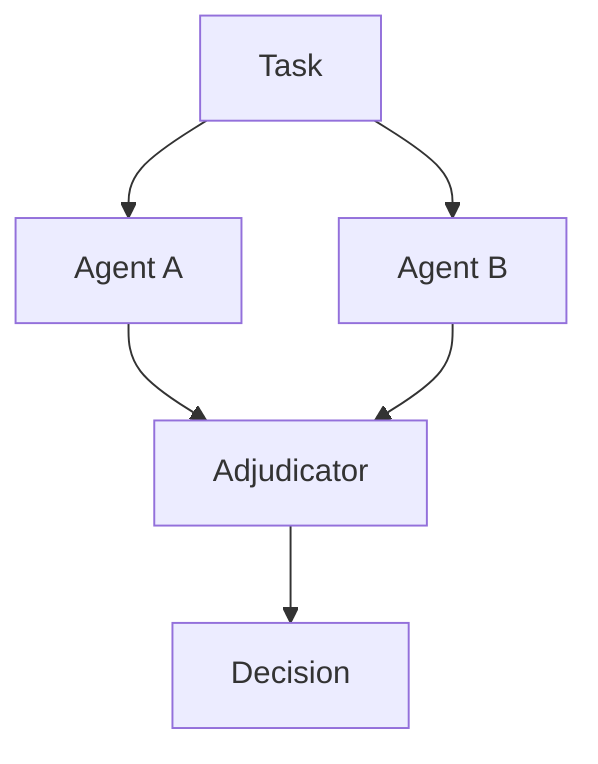

Use when independent reasoning reduces blind spots.

### 18.4 Blackboard Pattern

Agents collaborate through shared state.

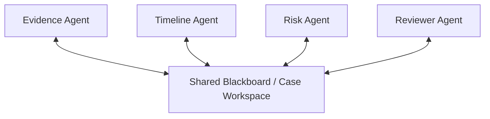

Use carefully. Shared state can become messy unless schemas and ownership are strict.

### 18.5 Swarm Pattern

Many agents explore options in parallel.

Use rarely in enterprise systems unless:

- exploration is valuable,
- cost is acceptable,
- outputs are strongly filtered,
- behavior is observable,
- non-determinism is tolerable.

Swarm designs are powerful for research and simulation but often difficult to govern in production business workflows.

---

## 19. The “Do We Need Multi-Agent?” Test

Before adding another agent, answer these questions:

1. What responsibility does the new agent own?
2. What output contract does it produce?
3. What tools does it need that others should not have?
4. What context does it need that others should not see?
5. What failure does it isolate?
6. What quality metric improves?
7. What latency/cost increase is acceptable?
8. How will we debug its behavior?
9. How will we prevent circular delegation?
10. Who owns the final decision?

If the answers are weak, do not add the agent.

---

## 20. Python Interface Sketch for Taxonomy

A useful engineering practice is to encode taxonomy into configuration.

```python
from enum import Enum
from pydantic import BaseModel, Field


class SystemCategory(str, Enum):
    prompt_only = "prompt_only"
    chain = "chain"
    workflow = "workflow"
    tool_assistant = "tool_assistant"
    single_agent = "single_agent"
    multi_agent = "multi_agent"
    copilot = "copilot"
    autonomous_worker = "autonomous_worker"
    enterprise_platform = "enterprise_platform"


class AutonomyLevel(int, Enum):
    none = 0
    suggestive = 1
    assistive = 2
    recommendatory = 3
    semi_delegated = 4
    delegated_low_risk = 5
    delegated_high_risk = 6


class ToolAccessLevel(int, Enum):
    none = 0
    static_knowledge = 1
    internal_read = 2
    draft_side_effect = 3
    reversible_write = 4
    consequential_write = 5
    administrative = 6


class AgenticSystemProfile(BaseModel):
    name: str
    category: SystemCategory
    autonomy_level: AutonomyLevel
    statefulness_level: int = Field(ge=0, le=6)
    tool_access_level: ToolAccessLevel
    can_mutate_business_state: bool
    requires_human_approval: bool
    requires_audit_record: bool
    requires_regression_eval: bool
```

Then enforce architecture checks:

```python
def validate_profile(profile: AgenticSystemProfile) -> list[str]:
    findings: list[str] = []

    if profile.tool_access_level.value >= ToolAccessLevel.reversible_write.value:
        if not profile.requires_audit_record:
            findings.append("Write-capable systems require audit records")

    if profile.autonomy_level.value >= AutonomyLevel.semi_delegated.value:
        if not profile.requires_regression_eval:
            findings.append("Semi-delegated systems require regression evaluation")

    if profile.tool_access_level == ToolAccessLevel.consequential_write:
        if not profile.requires_human_approval:
            findings.append("Consequential writes require human approval by default")

    if profile.category == SystemCategory.multi_agent and profile.statefulness_level == 0:
        findings.append("Multi-agent systems usually need explicit task or execution state")

    return findings
```

The purpose is not bureaucratic classification. The purpose is to make architectural risk visible before implementation.

---

## 21. Governance by Category

Different categories require different governance.

| Category | Prompt Versioning | Tool Auth | Audit | Evaluation | Human Approval | Durable State |
|---|---:|---:|---:|---:|---:|---:|
| Prompt-only | Yes | No | Low | Basic | Optional | No |
| Chain | Yes | Maybe | Medium | Step tests | Optional | Usually no |
| Workflow | Yes | Yes | High | Scenario tests | Often | Yes |
| Tool assistant | Yes | Yes | Medium-high | Tool tests | For side effects | Session/task |
| Single agent | Yes | Yes | High | Trajectory tests | Risk-based | Task/session |
| Multi-agent | Yes | Yes | High | Interaction tests | Risk-based | Task/session |
| Copilot | Yes | Yes | High | Human factors + quality | Yes | Domain/task |
| Autonomous worker | Yes | Yes | Very high | Regression + simulation | Exception-based | Durable |
| Platform | Yes | Yes | Very high | Portfolio-wide | Policy-driven | Durable |

Do not apply the same governance to all AI systems. That creates either too much friction for low-risk features or too little control for high-risk automation.

---

## 22. Architecture Anti-Patterns

### 22.1 Agent Washing

Calling ordinary workflow automation an “agent” to make it sound modern.

Why it is harmful:

- hides the fact that deterministic software is enough,
- increases cost,
- reduces testability,
- confuses stakeholders.

### 22.2 Workflow Avoidance

Using LLM autonomy because the team does not want to model the business process.

Why it is harmful:

- business rules become implicit,
- failures are harder to debug,
- audit trail becomes weak,
- compliance teams lose confidence.

### 22.3 Tool Explosion

Giving agents too many tools too early.

Why it is harmful:

- model has too many action choices,
- permissioning becomes unclear,
- attack surface grows,
- debugging becomes harder.

### 22.4 Role Duplication

Creating multiple agents with vague role differences.

Why it is harmful:

- agents conflict,
- cost increases,
- latency increases,
- responsibility becomes unclear.

### 22.5 Hidden Autonomy Escalation

A system starts as a draft assistant but gradually begins making operational decisions.

Why it is harmful:

- governance does not catch up,
- users over-trust output,
- audit and approval are missing.

---

## 23. The Enterprise Architecture Selection Checklist

Before building, fill this checklist.

```yaml
system:
  name: ""
  category: ""
  autonomy_level: 0
  statefulness_level: 0
  tool_access_level: 0

business:
  object_affected: ""
  decisions_supported: []
  decisions_delegated: []
  prohibited_actions: []

state:
  conversation_state: false
  execution_state: false
  domain_state: false
  memory_state: false
  audit_state: false

controls:
  authorization_required: false
  human_approval_required: false
  policy_gate_required: false
  regression_eval_required: false
  trace_required: false
  rollback_required: false

operations:
  owner: ""
  on_call: ""
  kill_switch: false
  cost_budget: ""
  failure_queue: ""
```

This template should exist before the first production implementation.

---

## 24. Practice Drill

Classify the following systems.

### Scenario A

A feature summarizes uploaded PDFs for internal analysts.

Questions:

- Is it prompt-only, chain, or workflow?
- Does it need durable state?
- What is the tool access level?
- What is the minimum governance?

Expected direction:

- likely chain,
- low-to-medium statefulness,
- read-only document access,
- privacy + prompt versioning + trace + basic eval.

### Scenario B

An assistant reads enforcement cases, finds missing evidence, and drafts requests for additional information. Human reviewers send the request.

Expected direction:

- copilot + workflow,
- domain state read,
- draft side effect,
- human approval,
- audit and evidence references.

### Scenario C

A background worker closes low-risk duplicate complaints automatically when confidence is high.

Expected direction:

- autonomous worker,
- domain state mutation,
- reversible or consequential write depending domain,
- strict policy gate,
- audit,
- rollback/reopen path,
- sampling review,
- confidence threshold.

### Scenario D

A planner agent, researcher agent, and critic agent collaborate to produce legal enforcement recommendations.

Expected direction:

- multi-agent system,
- high audit requirement,
- evidence validation,
- likely human approval,
- strict role contracts,
- avoid allowing final automated action.

### Scenario E

An AI writes friendly customer support replies but cannot send them.

Expected direction:

- prompt-only or chain,
- low autonomy,
- no side-effecting tool,
- user approval.

---

## 25. Review Questions

1. Why is “agent” too broad as an architectural category?
2. What axes define agentic system risk?
3. When is a chain better than an agent?
4. When is a workflow better than a tool-calling agent?
5. What justifies adding a second agent?
6. Why is tool access often more important than model capability?
7. What is the difference between copilot and autonomous worker?
8. What is hidden autonomy escalation?
9. Why do autonomous workers need stronger controls than copilots?
10. What category would you choose for high-risk regulatory decision support, and why?

---

## 26. What Top 1% Engineers Pay Attention To

Top engineers do not treat agentic architecture as a maturity ladder where multi-agent is always better. They treat it as a risk/fit problem.

They ask:

- Can this be deterministic?
- Can this be a chain?
- Can this be a workflow?
- What autonomy is actually needed?
- What side effects are possible?
- What state must be durable?
- What decision authority is being delegated?
- What must be human-approved?
- What must be auditable?
- What failure mode would make this unacceptable?

The discipline is simple but difficult:

> Use the least autonomous architecture that satisfies the business need.

That is not anti-agent. It is good engineering.

---

## 27. References

- Josh Kaufman, *The First 20 Hours: How to Learn Anything ... Fast*.
- LangGraph documentation: workflows and agents; stateful orchestration; persistence and debugging concepts.
- OpenAI Agents SDK documentation: running agents, handoffs, tools, guardrails, sessions, and tracing.
- Microsoft Agent Framework documentation: Python/.NET agents, workflows, session state, telemetry, filters, and type-safety.
- Model Context Protocol specification: standardization of tools, resources, prompts, and client/server integration.
- NIST AI Risk Management Framework.
- OWASP Top 10 for LLM Applications.
