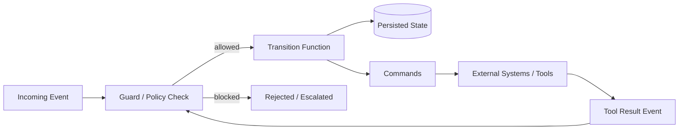
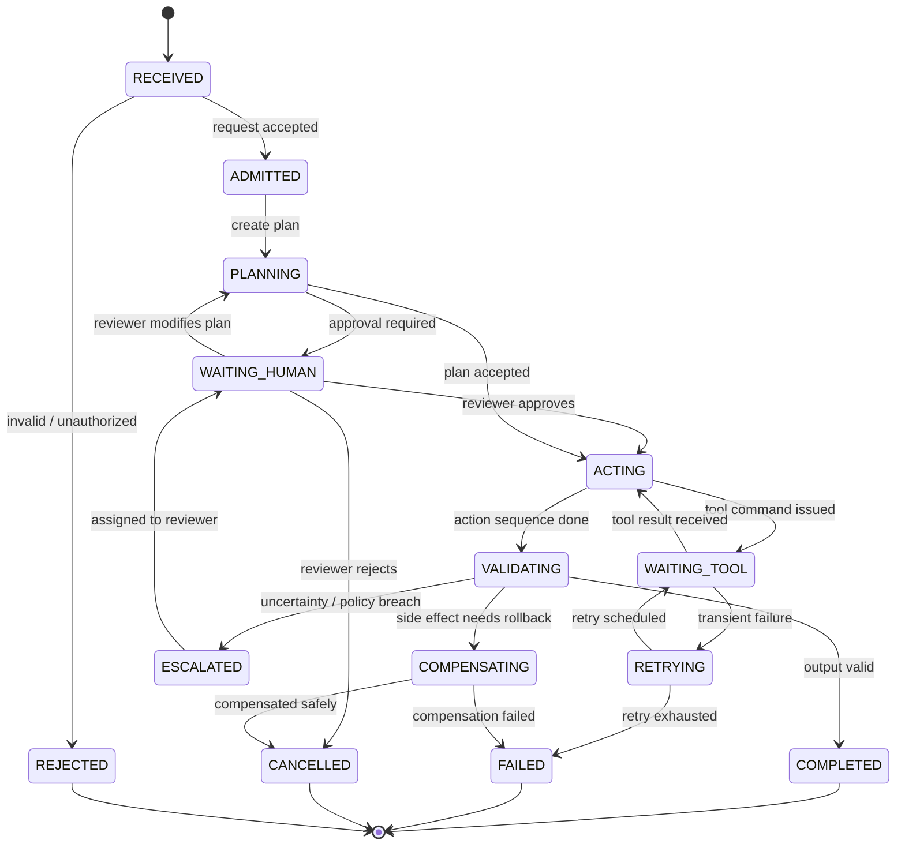
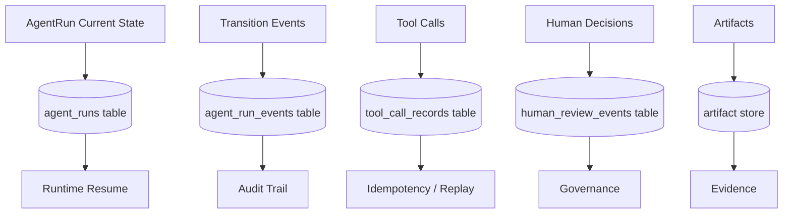
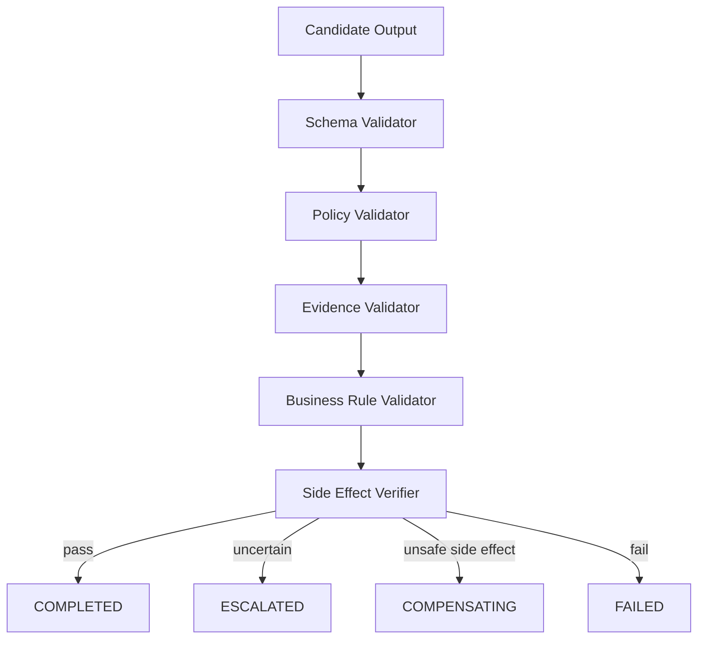
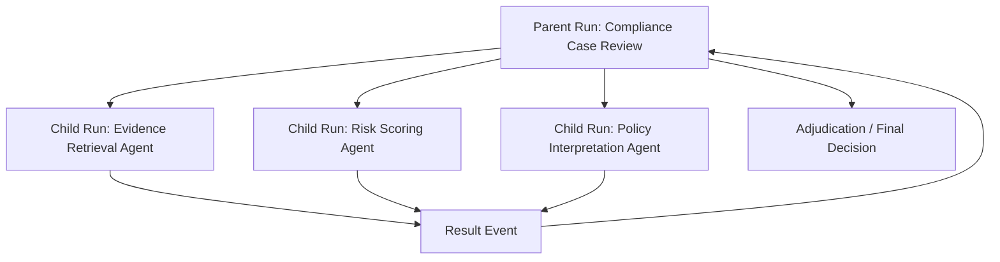
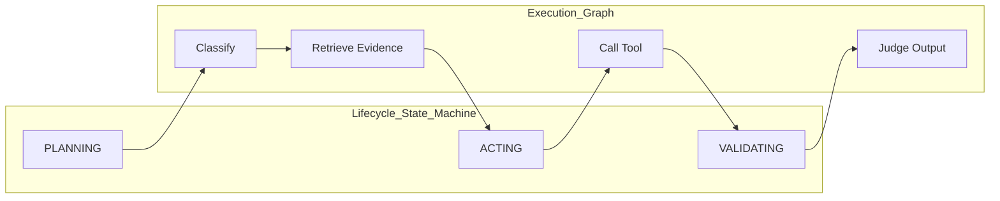

# Part 005 — State Machines and Agent Lifecycle Engineering

Materi ini membahas inti dari sistem agentic enterprise: **agent tidak boleh diperlakukan sebagai fungsi bebas yang hanya menerima prompt lalu mengembalikan teks**. Dalam sistem production, agent adalah entitas runtime yang punya lifecycle, state, ownership, transition rule, failure semantics, checkpoint, audit trail, dan batas keputusan.

Di level basic, banyak engineer memahami agent sebagai:

```text
input -> LLM -> tool calls -> output
```

Di level enterprise, model yang lebih benar adalah:

```text
case/request -> admission -> state transition -> planning -> controlled action -> validation -> persistence -> escalation/completion
```

Perbedaannya besar. Yang pertama cocok untuk prototype. Yang kedua cocok untuk sistem yang harus bisa dijelaskan, diaudit, diulang, dihentikan, dilanjutkan, dan dipertanggungjawabkan.

---

## 1. Target Skill

Setelah menyelesaikan bagian ini, kamu harus mampu:

1. Mendesain lifecycle agent sebagai finite state machine, bukan sekadar loop bebas.
2. Memisahkan state eksekusi, state domain, state percakapan, state tool, dan state policy.
3. Menulis transition rule yang eksplisit dan bisa diuji.
4. Menentukan kapan agent boleh lanjut, berhenti, retry, escalate, compensate, atau fail.
5. Menyimpan checkpoint agar agent bisa resume setelah crash, timeout, human review, atau deployment restart.
6. Mendesain audit trail yang menjawab: siapa/apa mengambil keputusan, berdasarkan evidence apa, pada state mana, dan menghasilkan efek samping apa.

Dalam framework Kaufman, bagian ini adalah **deconstruction**: kita memecah “membangun agent” menjadi kemampuan-kemampuan kecil yang bisa dilatih secara eksplisit.

---

## 2. Kenapa State Machine Penting untuk Agentic AI

LLM bersifat probabilistic. Enterprise workflow bersifat accountable. State machine adalah salah satu cara paling efektif untuk menjembatani keduanya.

Tanpa state machine, sistem agent biasanya mengalami masalah berikut:

| Masalah | Gejala | Dampak |
|---|---|---|
| Agent loop tidak terkendali | Agent terus memanggil tool tanpa batas jelas | Cost meledak, latency buruk, user kehilangan kontrol |
| Tidak ada lifecycle eksplisit | Sulit tahu apakah run sedang planning, acting, waiting, atau failed | Operasi dan support sulit melakukan diagnosis |
| Retry tidak aman | Action yang sama bisa dieksekusi dua kali | Double charge, double email, duplicate ticket, data corruption |
| Human review tidak terstruktur | Approval dilakukan lewat chat biasa | Tidak audit-ready |
| Tidak ada checkpoint | Crash berarti run hilang atau harus mulai dari awal | Reliability rendah |
| Completion tidak jelas | Output terlihat selesai tapi side effect belum konsisten | Case management rusak |

State machine memaksa sistem menjawab pertanyaan penting:

> “Pada state ini, action apa yang legal, siapa yang boleh memicu, precondition apa yang wajib benar, dan postcondition apa yang harus tercatat?”

Itu adalah pertanyaan engineering, bukan prompt engineering.

---

## 3. Mental Model: Agent sebagai Stateful Actor

Bayangkan agent sebagai **stateful actor** yang menerima event, melakukan transition, dan menghasilkan command/event baru.



Ada tiga ide penting:

1. **Agent run adalah entity**, bukan request sementara.
2. **Setiap perubahan penting harus direpresentasikan sebagai transition**, bukan mutasi tersembunyi.
3. **Tool result bukan “jawaban sampingan”**, tetapi event yang memengaruhi state.

Dalam sistem sederhana, agent bisa berupa function. Dalam sistem enterprise, agent lebih tepat dianggap sebagai process instance.

---

## 4. Lima Jenis State yang Wajib Dipisahkan

Salah satu kesalahan umum adalah menyimpan semua hal dalam `messages` atau `chat_history`. Itu buruk karena percakapan bukan satu-satunya state.

### 4.1 Execution State

Execution state menjawab:

> “Run ini sedang berada di fase apa?”

Contoh:

```text
RECEIVED -> ADMITTED -> PLANNING -> ACTING -> WAITING_TOOL -> VALIDATING -> COMPLETED
```

Execution state adalah state yang mengontrol lifecycle.

### 4.2 Domain State

Domain state menjawab:

> “Apa kondisi bisnis dari objek yang sedang diproses?”

Contoh untuk case management:

```text
case_status = UNDER_REVIEW
risk_level = HIGH
missing_documents = ["tax_certificate", "ownership_proof"]
recommended_action = ESCALATE_TO_SUPERVISOR
```

Domain state harus bisa dipahami domain expert. Jangan sembunyikan domain state dalam narasi LLM.

### 4.3 Conversation State

Conversation state menjawab:

> “Apa yang sudah dikatakan user, agent, reviewer, atau system?”

Contoh:

```text
messages = [
  user request,
  agent clarification,
  human reviewer note,
  final response
]
```

Conversation state berguna, tetapi tidak boleh menjadi sumber kebenaran tunggal.

### 4.4 Tool State

Tool state menjawab:

> “Tool apa yang dipanggil, dengan argumen apa, hasil apa, latency berapa, dan apakah side effect terjadi?”

Contoh:

```text
tool_call_id = "tc_123"
tool_name = "create_compliance_case"
idempotency_key = "case-789:create:v1"
status = SUCCEEDED
external_reference = "CASE-2026-0042"
```

Tool state penting untuk idempotency, audit, replay, dan compensation.

### 4.5 Policy State

Policy state menjawab:

> “Batasan apa yang berlaku untuk run ini?”

Contoh:

```text
max_tool_calls = 12
max_cost_usd = 1.50
requires_human_approval_for = ["external_email", "case_closure", "regulatory_notice"]
allowed_data_scopes = ["case_summary", "evidence_metadata"]
forbidden_data_scopes = ["raw_personal_identifier"]
```

Policy state membuat agent tidak sekadar pintar, tetapi terkendali.

---

## 5. Canonical Agent Lifecycle

Lifecycle berikut cukup umum untuk sistem enterprise. Kamu boleh menyesuaikan, tetapi jangan menghapus fase tanpa alasan kuat.



Lifecycle ini bukan dekorasi. Ini menjadi basis:

- endpoint API,
- database schema,
- observability span,
- audit event,
- UI dashboard,
- retry policy,
- incident response,
- test scenario.

---

## 6. State Definitions

Berikut daftar state yang direkomendasikan untuk agent run enterprise.

| State | Meaning | Allowed Next States | Notes |
|---|---|---|---|
| `RECEIVED` | Request masuk, belum divalidasi | `ADMITTED`, `REJECTED` | Jangan panggil LLM sebelum admission minimal selesai |
| `ADMITTED` | Request valid secara format, auth, quota, dan scope | `PLANNING`, `REJECTED` | Cocok untuk membuat initial run record |
| `PLANNING` | Agent menyusun next steps | `ACTING`, `WAITING_HUMAN`, `ESCALATED`, `FAILED` | Plan harus typed, bukan hanya narasi |
| `ACTING` | Agent menjalankan step internal atau memutuskan tool call | `WAITING_TOOL`, `VALIDATING`, `ESCALATED`, `FAILED` | Side effect perlu idempotency key |
| `WAITING_TOOL` | Command sudah dikirim, menunggu result | `ACTING`, `RETRYING`, `FAILED` | Cocok untuk async tool atau durable workflow |
| `RETRYING` | Sistem menjadwalkan retry | `WAITING_TOOL`, `FAILED`, `ESCALATED` | Retry bukan state tersembunyi |
| `WAITING_HUMAN` | Butuh approval/review/override | `PLANNING`, `ACTING`, `CANCELLED`, `ESCALATED` | Human decision menjadi event |
| `VALIDATING` | Sistem memvalidasi output dan side effect | `COMPLETED`, `ESCALATED`, `COMPENSATING`, `FAILED` | Cocok untuk judge, rule checks, contract checks |
| `ESCALATED` | Agent tidak boleh lanjut tanpa owner baru | `WAITING_HUMAN`, `FAILED`, `CANCELLED` | Escalation harus punya reason code |
| `COMPENSATING` | Sistem mencoba membatalkan/menetralkan side effect | `CANCELLED`, `FAILED` | Tidak semua side effect bisa di-rollback |
| `COMPLETED` | Run selesai sukses | terminal | Harus punya final artifact/output |
| `FAILED` | Run gagal | terminal | Harus punya failure category |
| `CANCELLED` | Run dibatalkan secara sah | terminal | Berbeda dari failed |
| `REJECTED` | Request ditolak sebelum admission | terminal | Bukan failure internal |

---

## 7. Transition Rule sebagai Kontrak Engineering

Transition rule harus eksplisit. Jangan hanya menulis:

```python
state.status = "COMPLETED"
```

Lebih baik gunakan command/event transition yang memeriksa legalitas.

```python
from enum import StrEnum
from pydantic import BaseModel, Field
from datetime import datetime, timezone
from typing import Any, Literal


class RunStatus(StrEnum):
    RECEIVED = "RECEIVED"
    ADMITTED = "ADMITTED"
    PLANNING = "PLANNING"
    ACTING = "ACTING"
    WAITING_TOOL = "WAITING_TOOL"
    RETRYING = "RETRYING"
    WAITING_HUMAN = "WAITING_HUMAN"
    VALIDATING = "VALIDATING"
    ESCALATED = "ESCALATED"
    COMPENSATING = "COMPENSATING"
    COMPLETED = "COMPLETED"
    FAILED = "FAILED"
    CANCELLED = "CANCELLED"
    REJECTED = "REJECTED"


TERMINAL_STATES = {
    RunStatus.COMPLETED,
    RunStatus.FAILED,
    RunStatus.CANCELLED,
    RunStatus.REJECTED,
}


ALLOWED_TRANSITIONS: dict[RunStatus, set[RunStatus]] = {
    RunStatus.RECEIVED: {RunStatus.ADMITTED, RunStatus.REJECTED},
    RunStatus.ADMITTED: {RunStatus.PLANNING, RunStatus.REJECTED},
    RunStatus.PLANNING: {
        RunStatus.ACTING,
        RunStatus.WAITING_HUMAN,
        RunStatus.ESCALATED,
        RunStatus.FAILED,
    },
    RunStatus.ACTING: {
        RunStatus.WAITING_TOOL,
        RunStatus.VALIDATING,
        RunStatus.ESCALATED,
        RunStatus.FAILED,
    },
    RunStatus.WAITING_TOOL: {
        RunStatus.ACTING,
        RunStatus.RETRYING,
        RunStatus.FAILED,
    },
    RunStatus.RETRYING: {
        RunStatus.WAITING_TOOL,
        RunStatus.FAILED,
        RunStatus.ESCALATED,
    },
    RunStatus.WAITING_HUMAN: {
        RunStatus.PLANNING,
        RunStatus.ACTING,
        RunStatus.CANCELLED,
        RunStatus.ESCALATED,
    },
    RunStatus.VALIDATING: {
        RunStatus.COMPLETED,
        RunStatus.ESCALATED,
        RunStatus.COMPENSATING,
        RunStatus.FAILED,
    },
    RunStatus.ESCALATED: {
        RunStatus.WAITING_HUMAN,
        RunStatus.FAILED,
        RunStatus.CANCELLED,
    },
    RunStatus.COMPENSATING: {RunStatus.CANCELLED, RunStatus.FAILED},
    RunStatus.COMPLETED: set(),
    RunStatus.FAILED: set(),
    RunStatus.CANCELLED: set(),
    RunStatus.REJECTED: set(),
}


class TransitionError(Exception):
    pass


class TransitionEvent(BaseModel):
    run_id: str
    from_status: RunStatus
    to_status: RunStatus
    reason_code: str
    actor_type: Literal["system", "agent", "human", "tool"]
    actor_id: str
    occurred_at: datetime = Field(default_factory=lambda: datetime.now(timezone.utc))
    metadata: dict[str, Any] = Field(default_factory=dict)


def assert_transition_allowed(current: RunStatus, target: RunStatus) -> None:
    if current in TERMINAL_STATES:
        raise TransitionError(f"Run is terminal: {current}")

    allowed = ALLOWED_TRANSITIONS.get(current, set())
    if target not in allowed:
        raise TransitionError(f"Illegal transition: {current} -> {target}")
```

Hal penting: state transition bukan hanya validasi enum. Transition adalah kontrol terhadap lifecycle bisnis.

---

## 8. Agent Run State Model

Gunakan satu aggregate utama untuk run. Jangan membuat state tersebar tanpa ownership.

```python
from pydantic import BaseModel, Field
from typing import Any
from datetime import datetime, timezone


class TokenUsage(BaseModel):
    input_tokens: int = 0
    output_tokens: int = 0
    reasoning_tokens: int = 0
    estimated_cost_usd: float = 0.0


class ToolCallRecord(BaseModel):
    tool_call_id: str
    tool_name: str
    idempotency_key: str
    status: str
    args_hash: str
    result_hash: str | None = None
    external_reference: str | None = None
    started_at: datetime
    completed_at: datetime | None = None
    error_type: str | None = None
    retry_count: int = 0


class AgentRunState(BaseModel):
    run_id: str
    tenant_id: str
    case_id: str | None = None
    status: RunStatus
    version: int = 0

    # Correlation and causality
    request_id: str
    correlation_id: str
    parent_run_id: str | None = None
    causal_event_id: str | None = None

    # Operational controls
    max_steps: int = 32
    step_count: int = 0
    max_tool_calls: int = 16
    tool_call_count: int = 0
    token_usage: TokenUsage = Field(default_factory=TokenUsage)

    # Separated state categories
    domain_state: dict[str, Any] = Field(default_factory=dict)
    conversation_state: list[dict[str, Any]] = Field(default_factory=list)
    policy_state: dict[str, Any] = Field(default_factory=dict)
    tool_state: list[ToolCallRecord] = Field(default_factory=list)

    # Diagnostics
    last_error: dict[str, Any] | None = None
    escalation_reason: str | None = None
    final_output_ref: str | None = None

    created_at: datetime = Field(default_factory=lambda: datetime.now(timezone.utc))
    updated_at: datetime = Field(default_factory=lambda: datetime.now(timezone.utc))
```

### Kenapa Ada `version`?

`version` digunakan untuk optimistic concurrency control.

Tanpa version, dua worker bisa membaca state yang sama lalu menulis hasil berbeda. Dalam agentic runtime, race condition sering muncul karena:

- tool result datang terlambat,
- human approval datang saat retry berjalan,
- scheduler menjalankan timeout handler,
- worker restart dan memproses event lama,
- multi-agent child run mengirim result bersamaan.

Rule minimal:

```text
update state where run_id = ? and version = expected_version
```

Kalau tidak ada row yang berubah, berarti state sudah dimodifikasi proses lain. Jangan overwrite. Reload dan evaluasi ulang event.

---

## 9. Event-Sourced Thinking Tanpa Harus Full Event Sourcing

Kamu tidak selalu harus menerapkan full event sourcing. Namun kamu harus berpikir seperti event-sourced system.

Minimal, simpan:

1. current state,
2. transition events,
3. tool call records,
4. human decisions,
5. final artifacts.



Pertanyaan audit yang harus bisa dijawab:

| Pertanyaan | Data yang Dibutuhkan |
|---|---|
| Mengapa agent membuat keputusan ini? | plan, evidence refs, model output, validator result |
| Tool apa saja yang dipanggil? | tool call records, args hash, result hash |
| Apakah ada human approval? | human review event, actor, timestamp, decision |
| Apakah retry terjadi? | retry count, error type, transition events |
| Apakah run bisa direplay? | input event, state snapshot, deterministic boundary notes |
| Apakah ada data sensitif keluar? | policy state, tool args, redaction logs |

---

## 10. Transition Function

Transition function harus menerima current state dan event, lalu menghasilkan new state dan side effects yang akan dijalankan oleh orchestrator.

```python
from dataclasses import dataclass
from typing import Protocol


class RunEvent(BaseModel):
    event_id: str
    run_id: str
    event_type: str
    actor_type: str
    actor_id: str
    payload: dict[str, Any] = Field(default_factory=dict)
    occurred_at: datetime = Field(default_factory=lambda: datetime.now(timezone.utc))


@dataclass(frozen=True)
class Command:
    command_type: str
    payload: dict[str, Any]
    idempotency_key: str | None = None


@dataclass(frozen=True)
class TransitionResult:
    new_state: AgentRunState
    transition_event: TransitionEvent
    commands: list[Command]


def transition(state: AgentRunState, event: RunEvent) -> TransitionResult:
    if state.status in TERMINAL_STATES:
        raise TransitionError("Cannot transition terminal run")

    match (state.status, event.event_type):
        case (RunStatus.RECEIVED, "REQUEST_VALIDATED"):
            next_status = RunStatus.ADMITTED
            commands = [Command("START_PLANNING", {"run_id": state.run_id})]

        case (RunStatus.ADMITTED, "PLANNING_STARTED"):
            next_status = RunStatus.PLANNING
            commands = [Command("CALL_PLANNER_AGENT", {"run_id": state.run_id})]

        case (RunStatus.PLANNING, "PLAN_REQUIRES_APPROVAL"):
            next_status = RunStatus.WAITING_HUMAN
            commands = [Command("CREATE_REVIEW_TASK", event.payload)]

        case (RunStatus.PLANNING, "PLAN_ACCEPTED"):
            next_status = RunStatus.ACTING
            commands = [Command("EXECUTE_NEXT_STEP", {"run_id": state.run_id})]

        case (RunStatus.ACTING, "TOOL_COMMAND_CREATED"):
            next_status = RunStatus.WAITING_TOOL
            commands = [Command("DISPATCH_TOOL", event.payload, event.payload["idempotency_key"])]

        case (RunStatus.WAITING_TOOL, "TOOL_RESULT_SUCCEEDED"):
            next_status = RunStatus.ACTING
            commands = [Command("CONTINUE_EXECUTION", {"run_id": state.run_id})]

        case (RunStatus.ACTING, "ACTION_SEQUENCE_DONE"):
            next_status = RunStatus.VALIDATING
            commands = [Command("VALIDATE_OUTPUT", {"run_id": state.run_id})]

        case (RunStatus.VALIDATING, "VALIDATION_PASSED"):
            next_status = RunStatus.COMPLETED
            commands = [Command("PUBLISH_FINAL_ARTIFACT", event.payload)]

        case _:
            raise TransitionError(
                f"No rule for status={state.status}, event={event.event_type}"
            )

    assert_transition_allowed(state.status, next_status)

    new_state = state.model_copy(
        update={
            "status": next_status,
            "version": state.version + 1,
            "updated_at": datetime.now(timezone.utc),
        }
    )

    transition_event = TransitionEvent(
        run_id=state.run_id,
        from_status=state.status,
        to_status=next_status,
        reason_code=event.event_type,
        actor_type=event.actor_type,
        actor_id=event.actor_id,
        metadata={"source_event_id": event.event_id},
    )

    return TransitionResult(new_state, transition_event, commands)
```

Perhatikan pola penting:

- transition function tidak langsung memanggil tool,
- transition function menghasilkan command,
- command dieksekusi oleh orchestrator/worker,
- tool result kembali sebagai event,
- event memicu transition berikutnya.

Ini membuat lifecycle bisa diuji tanpa memanggil LLM atau external system.

---

## 11. Agent Step Bukan State Transition yang Sama

Banyak engineer mencampur agent step dengan state transition.

Agent step adalah unit reasoning/execution internal.

State transition adalah perubahan lifecycle yang observable.

Contoh:

```text
Agent step 1: classify request
Agent step 2: retrieve policy
Agent step 3: draft plan
State transition: PLANNING -> WAITING_HUMAN
```

Tidak semua step harus menjadi top-level lifecycle state. Tetapi step penting harus masuk trace dan audit log.

Prinsip praktis:

| Jika sesuatu... | Maka... |
|---|---|
| memengaruhi user-visible lifecycle | jadikan state transition |
| memengaruhi audit/legal decision | jadikan event |
| hanya internal reasoning | jadikan trace span/artifact ringkas |
| menyebabkan side effect | jadikan command + tool record |
| membutuhkan human approval | jadikan state transition |
| bisa retry/resume | persist checkpoint |

---

## 12. Planning State: Plan Harus Typed

Agent plan yang hanya berupa teks naratif sulit divalidasi. Gunakan typed plan.

```python
class PlanStep(BaseModel):
    step_id: str
    kind: Literal["reason", "retrieve", "tool", "human_review", "finalize"]
    description: str
    required_tool: str | None = None
    risk_level: Literal["low", "medium", "high"]
    requires_approval: bool = False
    expected_evidence: list[str] = Field(default_factory=list)


class AgentPlan(BaseModel):
    objective: str
    assumptions: list[str] = Field(default_factory=list)
    steps: list[PlanStep]
    stop_conditions: list[str]
    escalation_conditions: list[str]
```

Validator plan minimal:

```python
def validate_plan(plan: AgentPlan, policy: dict[str, Any]) -> list[str]:
    violations: list[str] = []

    if len(plan.steps) > policy.get("max_plan_steps", 10):
        violations.append("PLAN_TOO_LONG")

    for step in plan.steps:
        if step.kind == "tool" and not step.required_tool:
            violations.append(f"TOOL_STEP_WITHOUT_TOOL:{step.step_id}")

        if step.risk_level == "high" and not step.requires_approval:
            violations.append(f"HIGH_RISK_STEP_WITHOUT_APPROVAL:{step.step_id}")

        if step.required_tool in policy.get("blocked_tools", []):
            violations.append(f"BLOCKED_TOOL:{step.required_tool}")

    return violations
```

Top 1% engineer tidak hanya bertanya “apakah model bisa membuat plan?”. Mereka bertanya:

> “Apakah plan ini bisa divalidasi, diubah human reviewer, dieksekusi sebagian, di-resume, dan diaudit?”

---

## 13. Acting State: Semua Side Effect Harus Lewat Command

Jangan biarkan agent langsung melakukan side effect dari dalam prompt loop tanpa boundary.

Buruk:

```python
result = llm_decides_and_calls_any_tool(messages)
```

Lebih baik:

```python
proposed_action = agent.propose_next_action(state)
validated_action = policy_engine.validate(proposed_action, state.policy_state)
command = command_factory.create(validated_action)
command_bus.dispatch(command)
```

### Action Proposal Model

```python
class ActionProposal(BaseModel):
    action_id: str
    action_type: Literal["call_tool", "ask_human", "final_answer", "escalate"]
    rationale: str
    confidence: float
    tool_name: str | None = None
    tool_args: dict[str, Any] = Field(default_factory=dict)
    expected_side_effect: str | None = None
    evidence_refs: list[str] = Field(default_factory=list)
```

### Action Validation

```python
def validate_action(action: ActionProposal, state: AgentRunState) -> list[str]:
    violations: list[str] = []

    if state.step_count >= state.max_steps:
        violations.append("MAX_STEPS_EXCEEDED")

    if action.action_type == "call_tool":
        if state.tool_call_count >= state.max_tool_calls:
            violations.append("MAX_TOOL_CALLS_EXCEEDED")

        allowed_tools = set(state.policy_state.get("allowed_tools", []))
        if action.tool_name not in allowed_tools:
            violations.append(f"TOOL_NOT_ALLOWED:{action.tool_name}")

    if action.confidence < state.policy_state.get("min_confidence", 0.0):
        violations.append("CONFIDENCE_TOO_LOW")

    return violations
```

LLM boleh mengusulkan. Runtime yang memutuskan apakah action boleh berjalan.

---

## 14. Waiting State: Agent Tidak Selalu Harus Aktif

Agentic system enterprise sering long-running. Run bisa menunggu:

- tool async,
- external webhook,
- human approval,
- batch job,
- scheduled retry,
- rate limit window,
- missing document,
- downstream system recovery.

Waiting state harus eksplisit.

```text
WAITING_TOOL != stuck
WAITING_HUMAN != failed
RETRYING != running
SUSPENDED != cancelled
```

Tanpa perbedaan ini, dashboard operasi akan salah membaca keadaan.

### Timeout Policy

```python
class TimeoutPolicy(BaseModel):
    state: RunStatus
    timeout_seconds: int
    on_timeout_event: str


TIMEOUT_POLICIES = [
    TimeoutPolicy(
        state=RunStatus.WAITING_TOOL,
        timeout_seconds=120,
        on_timeout_event="TOOL_TIMEOUT",
    ),
    TimeoutPolicy(
        state=RunStatus.WAITING_HUMAN,
        timeout_seconds=86_400,
        on_timeout_event="HUMAN_REVIEW_TIMEOUT",
    ),
]
```

Timeout bukan sekadar exception. Timeout adalah event lifecycle.

---

## 15. Validation State: Jangan Langsung Percaya Output Agent

Validation adalah state khusus karena output agent harus diperiksa sebelum dianggap final.

Validasi bisa berupa:

1. schema validation,
2. policy validation,
3. factual consistency check,
4. evidence coverage check,
5. business rule check,
6. tool side-effect verification,
7. human review for high-risk cases,
8. regression/evaluation hooks untuk behavior penting.



### Output Contract

```python
class EvidenceRef(BaseModel):
    source_type: Literal["document", "tool_result", "human_note", "database_record"]
    source_id: str
    claim_supported: str


class FinalDecision(BaseModel):
    decision: Literal["approve", "reject", "escalate", "request_more_info"]
    summary: str
    rationale: str
    evidence: list[EvidenceRef]
    residual_risk: Literal["low", "medium", "high"]
    requires_human_signoff: bool
```

Output yang tidak punya evidence untuk claim penting sebaiknya tidak masuk `COMPLETED`.

---

## 16. Escalation State

Escalation bukan failure. Escalation adalah mekanisme kontrol.

Run harus escalate ketika:

- policy mewajibkan human review,
- confidence rendah,
- evidence tidak cukup,
- tool result konflik,
- agent mendeteksi ambiguity material,
- action berisiko tinggi,
- cost/step mendekati limit,
- prompt injection terdeteksi,
- data access scope tidak cukup,
- business rule tidak bisa diputuskan otomatis.

Gunakan reason code, bukan hanya teks bebas.

```python
class EscalationReason(StrEnum):
    LOW_CONFIDENCE = "LOW_CONFIDENCE"
    INSUFFICIENT_EVIDENCE = "INSUFFICIENT_EVIDENCE"
    POLICY_REQUIRES_REVIEW = "POLICY_REQUIRES_REVIEW"
    TOOL_RESULT_CONFLICT = "TOOL_RESULT_CONFLICT"
    HIGH_RISK_ACTION = "HIGH_RISK_ACTION"
    POSSIBLE_PROMPT_INJECTION = "POSSIBLE_PROMPT_INJECTION"
    COST_LIMIT_NEARLY_EXCEEDED = "COST_LIMIT_NEARLY_EXCEEDED"
    AMBIGUOUS_USER_INTENT = "AMBIGUOUS_USER_INTENT"
```

Escalation event harus menyertakan:

- reason code,
- current state,
- recommended reviewer group,
- evidence summary,
- suggested next action,
- deadline/SLA,
- whether run is safe to resume automatically.

---

## 17. Compensation State

Tidak semua side effect bisa di-rollback. Dalam enterprise workflow, kamu harus membedakan:

| Side Effect | Compensation Strategy |
|---|---|
| draft email created | delete draft atau mark cancelled |
| email already sent | send correction, not rollback |
| case created | close/cancel case with audit reason |
| payment initiated | void if pending, refund if settled |
| database update | reverse update if reversible and legal |
| external notification | issue amended notification |

Agent tidak boleh “menganggap” rollback selalu mungkin.

```python
class CompensationPlan(BaseModel):
    original_tool_call_id: str
    side_effect_type: str
    compensatable: bool
    compensation_tool: str | None = None
    compensation_args: dict[str, Any] = Field(default_factory=dict)
    residual_risk: str
    requires_human_approval: bool
```

Prinsipnya:

> Setiap tool dengan side effect harus mendefinisikan compensation semantics sejak desain, bukan setelah incident.

---

## 18. Multi-Agent Lifecycle: Parent Run dan Child Run

Multi-agent system menambah kompleksitas. Jangan biarkan agent saling memanggil tanpa struktur.

Gunakan parent-child run.



Parent run bertanggung jawab atas:

- objective global,
- delegation boundary,
- merge/adjudication,
- final decision,
- user-visible output,
- escalation.

Child run bertanggung jawab atas:

- tugas spesifik,
- evidence lokal,
- result contract,
- failure lokal,
- cost lokal.

### Child Result Contract

```python
class ChildAgentResult(BaseModel):
    child_run_id: str
    role: str
    status: Literal["succeeded", "failed", "escalated"]
    result: dict[str, Any] = Field(default_factory=dict)
    evidence_refs: list[str] = Field(default_factory=list)
    confidence: float
    failure_reason: str | None = None
```

Parent tidak boleh hanya menggabungkan teks dari child agents. Parent harus menggabungkan structured result.

---

## 19. State Machine vs Graph Orchestration

Graph orchestration dan state machine saling melengkapi.

| Konsep | Fokus |
|---|---|
| State machine | status lifecycle legal dan terminal |
| Graph | alur node/action/decision execution |
| Workflow engine | durability, scheduling, retries, timers |
| Agent loop | dynamic reasoning/action selection |

Graph bisa mengimplementasikan state machine. Namun graph yang kompleks tanpa lifecycle state tetap sulit dioperasikan.



Rule praktis:

- gunakan state machine untuk lifecycle dan governance,
- gunakan graph untuk routing dan orchestration,
- gunakan event log untuk audit dan replay,
- gunakan trace untuk debugging runtime.

---

## 20. Persistence Schema Minimal

Untuk sistem nyata, minimal butuh tabel/koleksi berikut.

```sql
create table agent_runs (
    run_id text primary key,
    tenant_id text not null,
    case_id text,
    status text not null,
    version integer not null,
    request_id text not null,
    correlation_id text not null,
    parent_run_id text,
    state_json jsonb not null,
    created_at timestamptz not null,
    updated_at timestamptz not null
);

create table agent_run_events (
    event_id text primary key,
    run_id text not null,
    from_status text,
    to_status text,
    event_type text not null,
    actor_type text not null,
    actor_id text not null,
    payload_json jsonb not null,
    occurred_at timestamptz not null
);

create table tool_call_records (
    tool_call_id text primary key,
    run_id text not null,
    tool_name text not null,
    idempotency_key text not null unique,
    status text not null,
    args_hash text not null,
    result_hash text,
    external_reference text,
    retry_count integer not null,
    started_at timestamptz not null,
    completed_at timestamptz
);
```

Catatan: schema ini bukan final universal. Namun ini menunjukkan minimum yang cukup untuk lifecycle, audit, idempotency, dan resume.

---

## 21. Checkpoint dan Resume

Checkpoint adalah state snapshot yang cukup lengkap untuk melanjutkan run.

Checkpoint harus menjawab:

- status sekarang apa,
- step terakhir apa,
- command apa yang sudah dikirim,
- tool call mana yang pending,
- human review mana yang pending,
- output sementara apa,
- policy apa yang berlaku,
- version berapa,
- apakah aman untuk resume otomatis.

```python
class Checkpoint(BaseModel):
    checkpoint_id: str
    run_id: str
    state_version: int
    status: RunStatus
    resume_strategy: Literal[
        "automatic",
        "manual_review_required",
        "wait_for_external_event",
        "do_not_resume",
    ]
    state_snapshot: dict[str, Any]
    pending_commands: list[dict[str, Any]] = Field(default_factory=list)
    pending_tool_calls: list[str] = Field(default_factory=list)
    created_at: datetime = Field(default_factory=lambda: datetime.now(timezone.utc))
```

Resume policy harus konservatif. Jangan otomatis resume action berisiko tinggi jika sistem tidak yakin apakah side effect sudah terjadi.

---

## 22. Failure Categories

`FAILED` saja tidak cukup. Gunakan failure category.

| Category | Meaning | Retry? | Escalate? |
|---|---|---:|---:|
| `TRANSIENT_INFRA` | network, timeout, temporary DB issue | yes | maybe |
| `DOWNSTREAM_UNAVAILABLE` | external API unavailable | yes with backoff | maybe |
| `POLICY_VIOLATION` | blocked by policy | no | yes |
| `VALIDATION_FAILED` | output/tool result invalid | maybe | yes |
| `MODEL_UNRELIABLE` | repeated invalid outputs | maybe with fallback | yes |
| `BUDGET_EXCEEDED` | token/cost/step limit exceeded | no | maybe |
| `HUMAN_REJECTED` | reviewer rejected continuation | no | no |
| `NON_COMPENSATABLE_SIDE_EFFECT` | unsafe state after partial side effect | no | yes |

Failure category memengaruhi retry, alerting, dashboard, dan postmortem.

---

## 23. Engineering Invariants

Invariants adalah aturan yang harus selalu benar.

### Lifecycle Invariants

1. Terminal state tidak boleh berubah.
2. Transition harus berada dalam allowed transition map.
3. Setiap transition harus menghasilkan event audit.
4. Setiap side-effect command harus punya idempotency key.
5. Setiap human decision harus punya actor dan timestamp.
6. `COMPLETED` harus punya final output reference.
7. `FAILED` harus punya failure category.
8. `ESCALATED` harus punya reason code dan owner.
9. `WAITING_TOOL` harus punya pending tool call.
10. `WAITING_HUMAN` harus punya pending review task.

### Multi-Agent Invariants

1. Child run tidak boleh menutup parent run langsung.
2. Parent run harus mengontrol final decision.
3. Child result harus structured.
4. Delegation harus memiliki objective dan scope.
5. Parent harus menangani partial child failure.

### Audit Invariants

1. Tidak ada state mutation tanpa event.
2. Tidak ada tool call tanpa record.
3. Tidak ada external side effect tanpa idempotency key.
4. Tidak ada high-risk decision tanpa evidence atau human signoff sesuai policy.
5. Tidak ada final answer yang tidak bisa dikaitkan ke run id.

---

## 24. Testing State Machine

State machine harus diuji seperti business-critical component.

### Test Legal Transitions

```python
def test_received_can_be_admitted():
    assert RunStatus.ADMITTED in ALLOWED_TRANSITIONS[RunStatus.RECEIVED]


def test_completed_is_terminal():
    assert ALLOWED_TRANSITIONS[RunStatus.COMPLETED] == set()
```

### Test Illegal Transition

```python
import pytest


def test_cannot_skip_to_completed_from_planning():
    with pytest.raises(TransitionError):
        assert_transition_allowed(RunStatus.PLANNING, RunStatus.COMPLETED)
```

### Test Property: Terminal States Never Transition

```python
def test_terminal_states_have_no_outgoing_edges():
    for status in TERMINAL_STATES:
        assert ALLOWED_TRANSITIONS[status] == set()
```

### Test Transition Produces Event

```python
def test_transition_records_event(sample_state, request_validated_event):
    result = transition(sample_state, request_validated_event)

    assert result.new_state.status == RunStatus.ADMITTED
    assert result.transition_event.from_status == RunStatus.RECEIVED
    assert result.transition_event.to_status == RunStatus.ADMITTED
    assert result.transition_event.reason_code == "REQUEST_VALIDATED"
```

Testing seperti ini terlihat sederhana, tetapi sangat menentukan reliability agentic runtime.

---

## 25. Failure Modes

### 25.1 Hidden State Mutation

Agent mengubah state melalui side effect tersembunyi, bukan transition.

Mitigasi:

- semua mutation lewat command handler,
- database write dibatasi service layer,
- audit event wajib.

### 25.2 Terminal State Resurrection

Run yang sudah `FAILED` atau `COMPLETED` diproses ulang oleh retry worker.

Mitigasi:

- terminal state check,
- idempotent event handling,
- optimistic concurrency.

### 25.3 Tool Result Arrives Late

Tool result datang setelah run cancelled.

Mitigasi:

- event handler harus cek current state,
- late result disimpan sebagai ignored event,
- jangan langsung mutate state.

### 25.4 Human Approval Race

Reviewer approve saat policy sudah berubah atau run sudah timeout.

Mitigasi:

- approval event membawa expected version,
- approval harus divalidasi terhadap current policy,
- expired approval task tidak boleh dipakai.

### 25.5 Infinite Planning Loop

Agent terus merevisi plan tanpa maju.

Mitigasi:

- max planning attempts,
- plan validator,
- escalation threshold.

### 25.6 Split-Brain Parent/Child

Child agent menganggap tugas sukses, parent menganggap gagal.

Mitigasi:

- structured child result,
- parent adjudication,
- explicit child terminal status.

---

## 26. Production Checklist

Gunakan checklist ini sebelum menganggap agent runtime siap production.

### Lifecycle

- [ ] Semua state utama terdokumentasi.
- [ ] Semua allowed transition eksplisit.
- [ ] Terminal state tidak bisa berubah.
- [ ] Waiting state memiliki timeout policy.
- [ ] Escalation state memiliki reason code.
- [ ] Completion state memiliki output artifact.

### Persistence

- [ ] Current state persisted.
- [ ] Transition events persisted.
- [ ] Tool calls persisted.
- [ ] Human decisions persisted.
- [ ] Checkpoint cukup untuk resume.
- [ ] Optimistic concurrency diterapkan.

### Side Effects

- [ ] Semua side effect lewat command.
- [ ] Semua command punya idempotency key.
- [ ] Tool result diproses sebagai event.
- [ ] Compensation semantics diketahui.

### Governance

- [ ] High-risk state membutuhkan approval.
- [ ] Policy state disimpan bersama run.
- [ ] Data scope eksplisit.
- [ ] Audit trail bisa menjelaskan decision.

### Testing

- [ ] Legal transition tests.
- [ ] Illegal transition tests.
- [ ] Terminal state tests.
- [ ] Race condition tests.
- [ ] Late event tests.
- [ ] Retry/idempotency tests.

---

## 27. Practice Drill Berdasarkan Kaufman

Gunakan latihan 90 menit berikut.

### Drill 1 — 20 Menit: Lifecycle Sketch

Ambil satu use case:

```text
AI compliance assistant membantu reviewer mengevaluasi sebuah regulatory case.
```

Tulis state minimal:

```text
RECEIVED, ADMITTED, PLANNING, ACTING, WAITING_HUMAN, WAITING_TOOL, VALIDATING, COMPLETED, FAILED, ESCALATED
```

Tentukan allowed transitions.

### Drill 2 — 20 Menit: Event Model

Untuk setiap transition, tulis event pemicu.

Contoh:

```text
RECEIVED -> ADMITTED: REQUEST_VALIDATED
PLANNING -> WAITING_HUMAN: PLAN_REQUIRES_APPROVAL
WAITING_TOOL -> ACTING: TOOL_RESULT_SUCCEEDED
```

### Drill 3 — 20 Menit: Invariant Test

Tulis minimal lima invariant.

Contoh:

```text
COMPLETED must have final_output_ref.
WAITING_TOOL must have pending_tool_call_id.
ESCALATED must have escalation_reason.
```

### Drill 4 — 30 Menit: Failure Scenario

Simulasikan:

```text
Tool timeout -> retry -> tool succeeded late -> human cancelled run -> late result arrives
```

Tentukan event handling yang benar.

---

## 28. What Top 1% Engineers Pay Attention To

Engineer biasa bertanya:

> “Agent-nya bisa jawab tidak?”

Engineer kuat bertanya:

> “Agent-nya bisa dikontrol tidak?”

Engineer top-level bertanya lebih jauh:

1. **Apa lifecycle legal dari agent run?**
2. **State mana yang domain-critical dan harus typed?**
3. **Event apa yang mengubah state?**
4. **Siapa actor dari setiap transition?**
5. **Apa yang terjadi jika event datang terlambat?**
6. **Apa yang terjadi jika worker crash setelah side effect tapi sebelum state update?**
7. **Apa yang terjadi jika human approval diberikan terhadap state lama?**
8. **Apa terminal semantics dari cancelled vs failed vs rejected?**
9. **Bisakah keputusan direplay dan diaudit?**
10. **Apakah run bisa resume tanpa mengulang side effect?**

Di sistem agentic enterprise, kualitas arsitektur tidak diukur dari seberapa impresif demo-nya, tetapi dari seberapa baik sistem tetap benar saat terjadi partial failure, ambiguity, latency, policy conflict, dan human intervention.

---

## 29. Summary

State machine adalah fondasi enterprise-grade stateful agent system.

Kunci dari bagian ini:

- agent run adalah entity dengan lifecycle,
- conversation history bukan state model yang cukup,
- execution, domain, conversation, tool, dan policy state harus dipisahkan,
- transition harus eksplisit dan diuji,
- side effect harus lewat command dan idempotency key,
- waiting, escalation, validation, compensation, dan terminal state harus punya makna operasional,
- multi-agent collaboration butuh parent-child lifecycle,
- audit trail harus dibangun sejak awal, bukan setelah compliance audit datang.

Pada bagian berikutnya, kita akan naik satu level ke arsitektur platform: **Control Plane vs Data Plane for AI Agent Platforms**.
