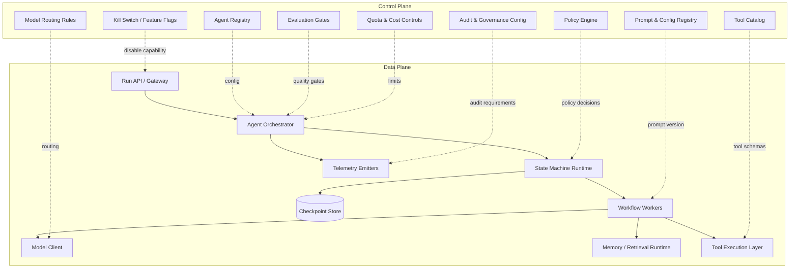
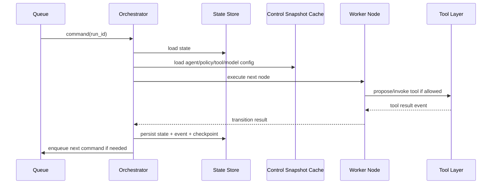
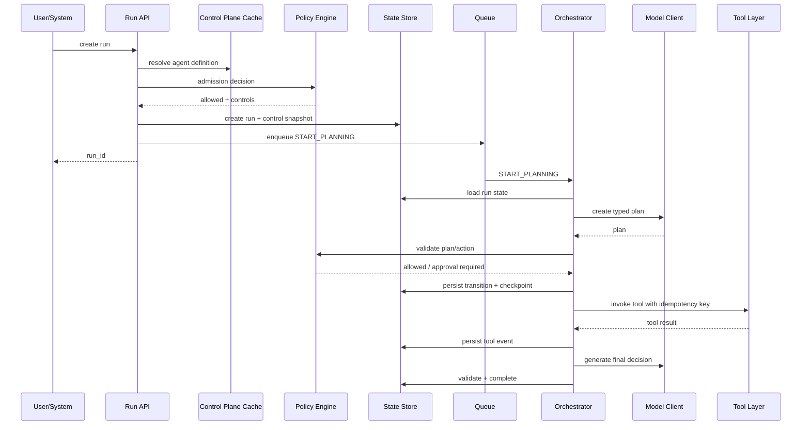
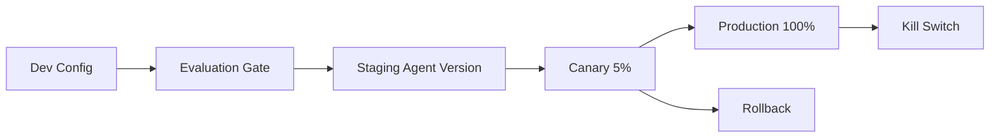
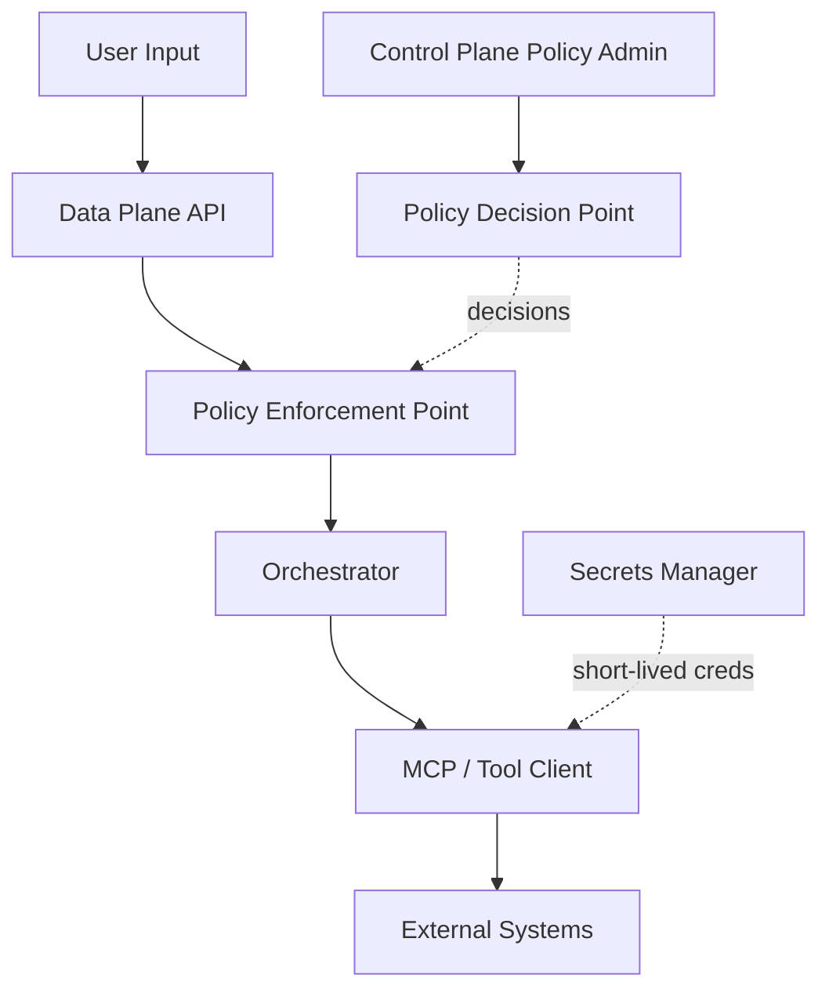
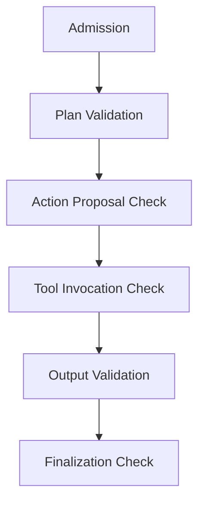

# Part 006 — Control Plane vs Data Plane for AI Agent Platforms

Pada bagian sebelumnya, kita mendesain agent run sebagai lifecycle state machine. Sekarang kita naik satu level: bagaimana membangun **platform architecture** untuk menjalankan banyak agent, banyak tenant, banyak workflow, banyak tool, banyak policy, dan banyak deployment secara aman.

Konsep kuncinya adalah pemisahan **control plane** dan **data plane**.

Sederhananya:

```text
Control plane decides what is allowed, configured, deployed, governed, and observed.
Data plane executes agent runs, tool calls, memory retrieval, model calls, and workflow steps.
```

Pemisahan ini umum di sistem cloud, networking, service mesh, Kubernetes, API gateway, dan platform engineering. Untuk agentic AI enterprise, pemisahan ini menjadi semakin penting karena agent memiliki kombinasi unik: probabilistic behavior, tool side effects, policy sensitivity, cost variability, data access risk, dan long-running state.

---

## 1. Target Skill

Setelah menyelesaikan bagian ini, kamu harus mampu:

1. Menjelaskan perbedaan control plane dan data plane dalam platform AI agent.
2. Menentukan komponen mana yang harus berada di control plane dan mana yang harus berada di data plane.
3. Mendesain boundary antara configuration, policy, registry, runtime, execution, memory, dan tool invocation.
4. Menghindari anti-pattern: agent runtime yang terlalu banyak mengambil keputusan governance sendiri.
5. Mendesain arsitektur yang mendukung multi-tenant, audit, rollout, rollback, policy enforcement, observability, dan cost control.
6. Membuat skeleton Python service/module untuk platform agentic enterprise.

Dalam framework Kaufman, bagian ini adalah **mental model compression**: kita menggunakan satu pemisahan arsitektural untuk menyederhanakan banyak kompleksitas.

---

## 2. Kenapa Pemisahan Ini Penting

Prototype agent biasanya hanya punya satu service:

```text
FastAPI endpoint -> LLM -> tools -> response
```

Untuk internal demo, ini cukup.

Untuk enterprise platform, desain itu cepat rusak ketika:

- ada banyak agent dengan versi berbeda,
- ada approval flow,
- ada tenant policy berbeda,
- ada tool dengan permission berbeda,
- ada model routing per risk level,
- ada quota dan cost budget,
- ada audit dan regulatory trace,
- ada deployment canary,
- ada prompt/version rollback,
- ada incident yang harus mematikan satu capability tanpa mematikan semua runtime.

Control plane/data plane membantu menjawab:

> “Bagaimana sistem bisa menjalankan agent secara fleksibel tanpa membuat runtime bebas melakukan apa pun?”

---

## 3. Definisi Singkat

### 3.1 Control Plane

Control plane adalah lapisan yang mengatur:

- agent registry,
- prompt/config version,
- policy,
- tool catalog,
- model routing,
- deployment rollout,
- tenant configuration,
- quota/budget,
- permission,
- evaluation gates,
- observability configuration,
- kill switch,
- audit governance.

Control plane tidak menjalankan setiap token generation secara langsung. Ia mengatur aturan dan konfigurasi yang digunakan runtime.

### 3.2 Data Plane

Data plane adalah lapisan yang menjalankan:

- incoming run,
- state transition,
- model call,
- tool call,
- memory retrieval,
- MCP/tool integration,
- workflow step,
- event processing,
- checkpoint persistence,
- telemetry emission,
- streaming response.

Data plane harus cepat, scalable, isolated, observable, dan resilient.

---

## 4. Arsitektur Besar



Garis solid menunjukkan execution flow. Garis putus-putus menunjukkan configuration/control flow.

---

## 5. Pembagian Tanggung Jawab

| Concern | Control Plane | Data Plane |
|---|---|---|
| Agent definition | menyimpan registry, version, owner, capability | menjalankan agent version tertentu |
| Prompt/config | versioning, approval, rollout | load prompt/config immutable per run |
| Policy | mendefinisikan rules, risk class, permission | enforce policy pada runtime decision |
| Tool | katalog, schema, risk, owner, auth requirement | invoke tool secara controlled dan observable |
| Model | routing rules, allowed models, fallback strategy | execute model call sesuai route |
| Memory | governance, retention, index policy | retrieve/store memory sesuai scope |
| Evaluation | gate definition, thresholds, test sets | emit run data dan block jika gate gagal |
| Quota/cost | budget, limits, tenant plan | count usage dan stop/escalate jika limit |
| Observability | required signals, sampling, dashboards | emit traces, metrics, logs, events |
| Deployment | canary, rollback, kill switch | respect active deployment config |

Rule utama:

> Data plane boleh mengeksekusi keputusan, tetapi control plane menentukan batas legalnya.

---

## 6. Control Plane Components

### 6.1 Agent Registry

Agent registry menyimpan definisi agent.

```python
from pydantic import BaseModel, Field
from typing import Literal


class AgentDefinition(BaseModel):
    agent_id: str
    name: str
    version: str
    owner_team: str
    description: str
    capability_tags: list[str] = Field(default_factory=list)
    risk_class: Literal["low", "medium", "high", "critical"]
    default_model_route: str
    allowed_tools: list[str]
    system_prompt_ref: str
    config_ref: str
    output_schema_ref: str | None = None
    enabled: bool = True
```

Agent registry menjawab:

- agent apa yang tersedia,
- versi mana yang aktif,
- siapa owner-nya,
- tool apa yang boleh dipakai,
- model route apa yang dipakai,
- output schema apa yang wajib dipatuhi,
- apakah agent sedang enabled.

Tanpa registry, agent akan tersebar sebagai kode dan prompt tidak terkontrol.

---

### 6.2 Prompt and Config Registry

Prompt production harus diperlakukan seperti deployment artifact.

Minimal metadata:

```python
class PromptArtifact(BaseModel):
    prompt_id: str
    version: str
    content_hash: str
    storage_uri: str
    author: str
    approved_by: str | None = None
    status: Literal["draft", "approved", "deprecated", "disabled"]
    created_at: str
    changelog: str
```

Prompt registry bukan hanya tempat menyimpan string. Ia harus mendukung:

- versioning,
- approval,
- rollback,
- diff,
- ownership,
- test/evaluation association,
- environment promotion,
- deprecation.

Prinsip praktis:

> Jangan menjalankan prompt production yang tidak bisa diidentifikasi dengan version/hash.

---

### 6.3 Policy Engine

Policy engine menentukan apakah action boleh berjalan.

Policy bisa mencakup:

- tenant access,
- user role,
- case sensitivity,
- data classification,
- tool risk,
- action type,
- confidence threshold,
- human approval requirement,
- token/cost budget,
- jurisdiction/regulatory constraint.

```python
class PolicyDecision(BaseModel):
    allowed: bool
    decision_id: str
    reason_codes: list[str] = Field(default_factory=list)
    required_controls: list[str] = Field(default_factory=list)
    redactions: list[str] = Field(default_factory=list)
    max_steps: int | None = None
    max_cost_usd: float | None = None
```

Data plane harus meminta atau mengevaluasi policy sebelum action penting.

```python
def enforce_policy(decision: PolicyDecision) -> None:
    if not decision.allowed:
        raise PermissionError(f"Policy denied: {decision.reason_codes}")
```

Policy engine tidak harus selalu service remote. Pada beberapa sistem, policy bisa berupa library lokal dengan rules yang di-load dari control plane. Yang penting: policy definition dan runtime enforcement tidak kacau.

---

### 6.4 Tool Catalog

Tool catalog menyimpan daftar tool yang dapat digunakan agent.

```python
class ToolDefinition(BaseModel):
    tool_name: str
    version: str
    description: str
    input_schema_ref: str
    output_schema_ref: str
    owner_team: str
    risk_class: Literal["read_only", "write_low", "write_high", "external_side_effect"]
    requires_user_consent: bool = False
    requires_human_approval: bool = False
    supports_idempotency: bool = True
    supports_compensation: bool = False
    compensation_tool_name: str | None = None
    enabled: bool = True
```

Tool catalog harus menjawab:

- apakah tool read-only atau write,
- apakah tool punya side effect,
- apakah butuh approval,
- apakah idempotent,
- apakah bisa dikompensasi,
- schema input/output apa,
- owner siapa,
- telemetry apa yang wajib.

Agent tidak boleh bebas menemukan tool dari environment tanpa registry.

---

### 6.5 Model Routing Rules

Model routing bukan hanya memilih model termurah.

Routing bisa berdasarkan:

- task type,
- risk level,
- latency SLO,
- privacy requirement,
- context length,
- output schema complexity,
- cost budget,
- tenant contract,
- fallback availability.

```python
class ModelRoute(BaseModel):
    route_id: str
    primary_model: str
    fallback_models: list[str] = Field(default_factory=list)
    max_input_tokens: int
    max_output_tokens: int
    timeout_ms: int
    allowed_for_risk_classes: list[str]
    pii_allowed: bool
```

Runtime model client menggunakan route, bukan hard-coded model name.

---

### 6.6 Evaluation Gates

Evaluation gate menjawab:

> “Apakah agent version/prompt/tool config ini boleh dipromosikan ke environment berikutnya?”

Gate bisa berupa:

- unit tests untuk parser/output schema,
- golden task eval,
- safety eval,
- regression eval,
- tool selection accuracy,
- cost/latency threshold,
- human review sampling result.

Control plane menyimpan gate. Data plane mengirim evidence run.

---

### 6.7 Kill Switch dan Feature Flags

Enterprise agent platform harus bisa mematikan capability cepat.

Contoh kill switch:

- disable specific agent version,
- disable specific tool,
- force human review for all high-risk actions,
- switch model route,
- disable autonomous execution,
- set max tool calls to zero,
- disable memory write,
- force read-only mode.

Jangan menunggu deployment baru untuk menghentikan perilaku berbahaya.

---

## 7. Data Plane Components

### 7.1 Run API / Gateway

Run API menerima request dari user/system.

Tugasnya:

- authenticate,
- authorize initial request,
- assign request id/correlation id,
- enforce rate limit awal,
- create run record,
- stream progress jika perlu,
- expose run status.

```python
from fastapi import FastAPI, Depends
from pydantic import BaseModel

app = FastAPI()


class CreateRunRequest(BaseModel):
    agent_id: str
    input: dict
    case_id: str | None = None


class CreateRunResponse(BaseModel):
    run_id: str
    status: str


@app.post("/runs", response_model=CreateRunResponse)
async def create_run(request: CreateRunRequest) -> CreateRunResponse:
    # 1. authenticate and authorize
    # 2. resolve agent definition from control plane cache
    # 3. apply admission policy
    # 4. persist RECEIVED/ADMITTED state
    # 5. enqueue planning command
    return CreateRunResponse(run_id="run_123", status="ADMITTED")
```

API layer tidak boleh memuat semua logic agent.

---

### 7.2 Agent Orchestrator

Orchestrator menghubungkan state machine, workflow node, command bus, model client, memory runtime, dan tool layer.

Tugasnya:

- load run state,
- load immutable control snapshot,
- decide next node,
- execute node,
- persist checkpoint,
- emit telemetry,
- handle retries/timeouts,
- schedule child runs,
- process tool/human events.



Orchestrator harus deterministic sejauh mungkin. Bagian probabilistic dibungkus sebagai node yang output-nya typed.

---

### 7.3 State Machine Runtime

State machine runtime menerapkan lifecycle dari Part 005.

Tugasnya:

- validate transition,
- update state version,
- write event,
- enforce terminal state,
- reject stale event,
- trigger commands.

Data plane boleh cepat, tetapi tidak boleh bypass state machine.

---

### 7.4 Workflow Workers

Workflow workers menjalankan node spesifik.

Contoh node:

- classify intent,
- retrieve context,
- create plan,
- validate plan,
- execute tool proposal,
- judge output,
- summarize evidence,
- create final artifact.

Setiap node sebaiknya:

- menerima typed input,
- menghasilkan typed output,
- punya timeout,
- punya retry policy,
- emit trace span,
- tidak melakukan side effect tersembunyi.

```python
class NodeContext(BaseModel):
    run_id: str
    tenant_id: str
    agent: AgentDefinition
    policy: dict
    state: dict


class NodeResult(BaseModel):
    events: list[dict]
    commands: list[dict]
    artifacts: list[dict] = []
```

---

### 7.5 Model Client

Model client adalah boundary untuk semua model calls.

Ia harus menangani:

- route resolution,
- timeout,
- retry untuk error aman,
- token usage,
- request/response logging policy,
- redaction,
- structured output parsing,
- fallback,
- telemetry.

Jangan biarkan setiap node memanggil provider SDK secara langsung.

```python
class ModelRequest(BaseModel):
    route_id: str
    messages: list[dict]
    response_schema: dict | None = None
    temperature: float = 0.0
    metadata: dict = Field(default_factory=dict)


class ModelResponse(BaseModel):
    content: str
    parsed: dict | None = None
    model_name: str
    usage: dict
    latency_ms: int
    finish_reason: str
```

---

### 7.6 Memory / Retrieval Runtime

Memory runtime menjalankan retrieval dan memory write sesuai policy.

Tugasnya:

- enforce tenant isolation,
- apply data classification rules,
- filter by authorization,
- retrieve context,
- record evidence refs,
- write memory only when allowed,
- support retention/deletion.

Memory bukan hanya vector database. Memory adalah controlled context subsystem.

---

### 7.7 Tool Execution Layer

Tool layer menjalankan tool dengan schema, policy, idempotency, dan telemetry.

```python
class ToolInvocationRequest(BaseModel):
    run_id: str
    tool_name: str
    tool_version: str
    args: dict
    idempotency_key: str
    actor_agent_id: str
    policy_decision_id: str


class ToolInvocationResult(BaseModel):
    tool_call_id: str
    status: Literal["succeeded", "failed", "retryable_failed"]
    result: dict | None = None
    error: dict | None = None
    external_reference: str | None = None
```

Tool layer adalah tempat penting untuk:

- schema validation,
- permission enforcement,
- secret injection,
- network boundary,
- rate limit,
- idempotency,
- compensation,
- audit.

---

## 8. Control Snapshot per Run

Salah satu desain penting: setiap run harus menyimpan **control snapshot**.

Control snapshot adalah versi konfigurasi yang berlaku saat run dimulai atau saat phase tertentu dimulai.

```python
class ControlSnapshot(BaseModel):
    snapshot_id: str
    agent_id: str
    agent_version: str
    prompt_versions: dict[str, str]
    policy_version: str
    tool_versions: dict[str, str]
    model_route_versions: dict[str, str]
    evaluation_gate_version: str | None = None
    created_at: str
```

Kenapa perlu?

Tanpa snapshot, audit akan bingung:

> “Run ini diputuskan oleh prompt versi mana? Policy versi mana? Tool schema versi mana? Model route mana?”

Untuk run long-running, kamu perlu strategy:

| Strategy | Meaning | Cocok untuk |
|---|---|---|
| `fixed_snapshot` | run memakai config yang sama sampai selesai | audit-heavy workflow |
| `phase_snapshot` | config bisa update antar phase | long-running case lifecycle |
| `latest_safe` | runtime memakai latest config yang compatible | low-risk assistant |
| `forced_upgrade` | control plane memaksa run memakai policy baru | incident/security fix |

Untuk regulated system, default yang aman biasanya `fixed_snapshot` atau `phase_snapshot`, bukan selalu latest.

---

## 9. Request Flow End-to-End



Flow ini menunjukkan hal penting: control plane tidak berada di hot path untuk semua hal jika cache/snapshot digunakan, tetapi policy dan config tetap menjadi batas legal data plane.

---

## 10. Deployment Model

Control plane/data plane memungkinkan deployment yang lebih aman.



Untuk agent, deployment bukan hanya kode. Yang dideploy bisa berupa:

- Python runtime code,
- prompt version,
- tool schema,
- policy rule,
- model route,
- memory index config,
- evaluation threshold,
- workflow graph,
- guardrail config.

Karena itu control plane harus memahami artifact versioning.

---

## 11. Multi-Tenancy

Enterprise agent platform sering melayani banyak tenant, business unit, region, atau product line.

Pemisahan control/data plane membantu multi-tenancy.

### Tenant Configuration

```python
class TenantAgentConfig(BaseModel):
    tenant_id: str
    enabled_agents: list[str]
    allowed_model_routes: list[str]
    allowed_tools: list[str]
    max_monthly_cost_usd: float
    data_residency_region: str
    retention_policy_id: str
    human_review_group: str
```

### Tenant Isolation Requirements

1. Tenant A tidak boleh membaca memory Tenant B.
2. Tool credential harus scoped per tenant atau per integration.
3. Quota dihitung per tenant.
4. Audit log harus filterable per tenant.
5. Policy bisa berbeda per tenant.
6. Deployment rollout bisa berbeda per tenant.
7. Data residency harus dihormati.

Data plane harus menganggap `tenant_id` sebagai mandatory context, bukan optional metadata.

---

## 12. Security Boundary

Pemisahan control/data plane tidak otomatis aman, tetapi membuat boundary lebih jelas.



Gunakan konsep:

- **PEP**: Policy Enforcement Point di data plane.
- **PDP**: Policy Decision Point di control/policy plane.
- **PIP**: Policy Information Point untuk context seperti user role, data class, tenant, case risk.

Jangan berikan secret langsung ke LLM context. Secret hanya boleh dipakai tool executor.

---

## 13. Observability Boundary

Control plane menentukan apa yang harus diobservasi. Data plane mengirim sinyal.

Minimal telemetry:

| Signal | Examples |
|---|---|
| Trace | run, state transition, model call, tool call, retrieval, validation |
| Metrics | latency, token usage, cost, failure rate, escalation rate, retry count |
| Logs | structured lifecycle event, policy denial, tool error |
| Audit Events | human approval, side effect, final decision |

Span hierarchy yang direkomendasikan:

```text
agent.run
  agent.admission
  agent.plan
    model.call
  agent.action
    policy.check
    tool.call
  agent.validate
    evaluator.check
  agent.finalize
```

Jangan mencampur observability operational dengan audit legal. Keduanya beririsan, tetapi kebutuhan retention, redaction, dan aksesnya berbeda.

---

## 14. Python Package Layout

Berikut layout yang lebih sehat untuk platform kecil-menengah.

```text
agent_platform/
  control/
    agent_registry.py
    prompt_registry.py
    tool_catalog.py
    model_routes.py
    policy.py
    quota.py
    feature_flags.py
  runtime/
    api.py
    orchestrator.py
    state_machine.py
    command_bus.py
    checkpoints.py
    workers/
      planning.py
      acting.py
      validation.py
      finalization.py
  integrations/
    model_client.py
    memory_client.py
    tool_executor.py
    mcp_client.py
  governance/
    audit.py
    evaluation.py
    approvals.py
  observability/
    tracing.py
    metrics.py
    logging.py
  persistence/
    repositories.py
    schemas.py
  tests/
    test_state_machine.py
    test_policy.py
    test_idempotency.py
    test_late_events.py
```

Prinsip layout:

- `control/` mendefinisikan konfigurasi dan policy.
- `runtime/` menjalankan run.
- `integrations/` membungkus external boundary.
- `governance/` menyimpan audit/evaluation/approval concerns.
- `observability/` tidak disisipkan manual di setiap tempat secara kacau.
- `persistence/` mengontrol state store.

---

## 15. Control Plane Cache

Data plane tidak boleh bergantung pada remote control plane untuk setiap micro-step, karena latency dan availability bisa buruk.

Gunakan cache/snapshot.

```python
class ControlPlaneClient:
    async def get_agent_definition(self, agent_id: str) -> AgentDefinition:
        ...

    async def get_tool_definition(self, tool_name: str) -> ToolDefinition:
        ...

    async def get_model_route(self, route_id: str) -> ModelRoute:
        ...

    async def get_policy_bundle(self, tenant_id: str, agent_id: str) -> dict:
        ...


class ControlSnapshotService:
    def __init__(self, client: ControlPlaneClient):
        self.client = client

    async def create_snapshot(self, tenant_id: str, agent_id: str) -> ControlSnapshot:
        agent = await self.client.get_agent_definition(agent_id)
        policy = await self.client.get_policy_bundle(tenant_id, agent_id)

        # Persist exact versions/hashes, not just names.
        return ControlSnapshot(
            snapshot_id="snap_123",
            agent_id=agent.agent_id,
            agent_version=agent.version,
            prompt_versions={"system": agent.system_prompt_ref},
            policy_version=policy["version"],
            tool_versions={tool: "resolved-version" for tool in agent.allowed_tools},
            model_route_versions={"default": agent.default_model_route},
        )
```

Cache harus punya invalidation strategy untuk kill switch. Jangan membuat data plane tetap menjalankan capability berbahaya karena cache terlalu lama.

---

## 16. Policy Enforcement Placement

Policy enforcement harus terjadi di beberapa titik.



| Enforcement Point | Contoh Check |
|---|---|
| Admission | user boleh memakai agent ini? tenant quota cukup? |
| Plan validation | plan mengandung high-risk step? |
| Action proposal | tool/action boleh dipakai sekarang? |
| Tool invocation | argumen tool sesuai scope? approval ada? |
| Output validation | output membocorkan data? claim punya evidence? |
| Finalization | final decision butuh signoff? |

Jangan hanya memeriksa policy di awal. Agentic behavior berkembang selama run.

---

## 17. Cost and Quota Control

Agentic systems bisa boros karena loop, retries, child agents, retrieval, tool calls, dan evaluator.

Control plane mendefinisikan budget. Data plane menghitung pemakaian.

```python
class BudgetState(BaseModel):
    max_cost_usd: float
    current_cost_usd: float = 0.0
    max_model_calls: int
    model_calls: int = 0
    max_tool_calls: int
    tool_calls: int = 0
    max_runtime_seconds: int
```

Runtime harus bisa melakukan:

- stop ketika budget habis,
- degrade model route,
- require approval untuk lanjut,
- summarize context agar token turun,
- escalate ketika cost tidak proporsional dengan value.

Metric penting:

```text
cost_per_successful_run
cost_per_escalated_run
tool_calls_per_run
model_calls_per_run
retry_cost_ratio
child_agent_cost_ratio
```

---

## 18. Control Plane Failure Modes

### 18.1 Control Plane Down

Data plane harus tahu apakah boleh lanjut memakai snapshot.

Policy:

| Run Type | Behavior saat control plane down |
|---|---|
| low-risk read-only | continue with cached snapshot |
| high-risk side effect | pause/escalate |
| regulated decision | pause unless snapshot explicitly allows |
| incident mode | obey last known kill switch if available |

### 18.2 Bad Config Rollout

Prompt/policy/tool config baru menyebabkan failure massal.

Mitigasi:

- canary,
- automatic rollback threshold,
- evaluation gates,
- version pinning,
- kill switch.

### 18.3 Stale Policy Cache

Data plane menjalankan policy lama setelah control plane mengubah rule penting.

Mitigasi:

- short TTL untuk high-risk policy,
- push invalidation,
- forced policy version check untuk high-risk action,
- fail closed untuk dangerous tool.

---

## 19. Data Plane Failure Modes

### 19.1 Runtime Crash After Tool Side Effect

Tool sukses, tetapi state belum update.

Mitigasi:

- idempotency key,
- tool call record sebelum dispatch,
- reconciliation worker,
- external reference lookup,
- outbox pattern.

### 19.2 Duplicate Command Delivery

Queue mengirim command dua kali.

Mitigasi:

- command idempotency key,
- state version check,
- command dedup table.

### 19.3 Worker Executes Disabled Agent

Agent disabled di control plane, tetapi worker masih menjalankan run.

Mitigasi:

- kill switch check at admission and before high-risk action,
- active run policy,
- forced suspension event.

### 19.4 Tool Catalog Drift

Runtime memakai schema tool lama sementara tool service sudah berubah.

Mitigasi:

- versioned tool schemas,
- compatibility tests,
- schema negotiation,
- deployment coordination.

---

## 20. Anti-Patterns

### 20.1 God Orchestrator

Satu orchestrator mengetahui semua policy, prompt, model, tool, memory, audit, dan business rule.

Akibat:

- sulit dites,
- sulit rollback,
- sulit ownership,
- sulit scale team.

Solusi: pisahkan registry, policy, tool layer, model client, state machine, worker nodes.

### 20.2 Prompt as Control Plane

Semua policy ditulis di system prompt.

Akibat:

- tidak enforceable,
- mudah di-bypass,
- sulit audit,
- tidak bisa diuji deterministik.

Solusi: prompt memberi instruction; runtime/policy engine memberi enforcement.

### 20.3 Tool Without Catalog

Tool langsung diekspos ke agent dari kode.

Akibat:

- tidak ada risk class,
- tidak ada approval metadata,
- tidak ada owner,
- tidak ada compensation semantics.

Solusi: tool catalog.

### 20.4 Always Latest Config

Semua run selalu memakai config terbaru.

Akibat:

- audit sulit,
- long-running run berubah behavior di tengah jalan,
- incident sulit dianalisis.

Solusi: control snapshot.

### 20.5 No Kill Switch

Satu-satunya cara disable agent adalah deploy ulang.

Akibat:

- response incident lambat,
- blast radius besar.

Solusi: feature flags dan kill switch di control plane.

---

## 21. Design Decision Matrix

| Decision | Default Recommendation | Kapan Berbeda |
|---|---|---|
| Snapshot strategy | fixed per run | low-risk assistant bisa latest compatible |
| Policy enforcement | multiple points | read-only demo bisa admission only |
| Tool invocation | centralized tool layer | local pure functions bisa direct wrapper |
| Model calls | centralized model client | eksperimen lokal |
| Prompt versioning | mandatory | throwaway prototype |
| Kill switch | mandatory | tidak ada alasan kuat untuk production |
| Control cache | yes | single-node toy system |
| Terminal state enforcement | mandatory | tidak ada alasan kuat untuk production |
| Tenant isolation | mandatory jika multi-tenant | single-tenant internal tool |

---

## 22. Minimum Viable Enterprise Platform

Jika harus membangun versi awal yang tetap sehat, jangan mulai dari fitur terlalu banyak. Mulai dari minimum ini:

1. Agent registry sederhana.
2. Prompt/config version hash.
3. Tool catalog dengan risk class.
4. Policy check untuk admission dan tool invocation.
5. State machine runtime.
6. Checkpoint store.
7. Central model client.
8. Central tool executor.
9. Structured telemetry.
10. Kill switch untuk agent dan tool.

Ini belum sempurna, tetapi cukup untuk menghindari fondasi yang salah.

---

## 23. Practice Drill Berdasarkan Kaufman

### Drill 1 — 25 Menit: Komponen Mapping

Ambil use case:

```text
Enterprise case management multi-agent system untuk regulatory enforcement lifecycle.
```

Buat tabel:

| Concern | Control Plane | Data Plane |
|---|---|---|
| Case triage agent | ... | ... |
| Evidence retrieval | ... | ... |
| Risk scoring | ... | ... |
| Human approval | ... | ... |
| Final notice generation | ... | ... |

### Drill 2 — 25 Menit: Control Snapshot

Tulis control snapshot untuk satu run.

Minimal memuat:

- agent version,
- prompt version,
- policy version,
- tool versions,
- model route,
- tenant config,
- risk class.

### Drill 3 — 25 Menit: Kill Switch Scenario

Simulasikan incident:

```text
Tool external_email mengirim email dengan attachment salah.
```

Tentukan kill switch:

- disable tool atau force human approval?
- apa yang terjadi pada active runs?
- bagaimana data plane menerima update?
- bagaimana audit mencatat forced policy change?

### Drill 4 — 25 Menit: Failure Boundary

Simulasikan:

```text
Control plane down, data plane masih punya cached snapshot, run high-risk sedang menunggu tool call.
```

Tentukan apakah run lanjut, pause, escalate, atau fail.

---

## 24. What Top 1% Engineers Pay Attention To

Engineer biasa melihat agent platform sebagai kumpulan API dan prompt.

Engineer kuat melihatnya sebagai orchestration runtime.

Engineer top-level melihatnya sebagai **governed execution platform**.

Mereka bertanya:

1. **Apa yang dikontrol control plane dan apa yang dieksekusi data plane?**
2. **Apakah runtime bisa berjalan dengan snapshot yang audit-ready?**
3. **Apakah policy hanya instruksi prompt atau benar-benar enforced?**
4. **Apakah tool punya risk class, owner, idempotency, dan compensation metadata?**
5. **Apakah model routing bisa diubah tanpa deploy kode?**
6. **Apakah prompt bisa rollback?**
7. **Apakah active run aman ketika config berubah?**
8. **Apakah kill switch cukup cepat untuk incident?**
9. **Apakah tenant isolation enforcement ada di setiap boundary?**
10. **Apakah observability cukup untuk forensic analysis?**

Top engineer tidak hanya membuat agent “bisa bekerja”. Mereka membuat platform yang bisa dikendalikan saat agent bekerja terlalu jauh, terlalu mahal, terlalu yakin, terlalu lambat, atau terlalu berisiko.

---

## 25. Summary

Control plane/data plane adalah mental model penting untuk enterprise AI agent platform.

Kunci dari bagian ini:

- control plane mengatur registry, policy, config, model route, tool catalog, quota, evaluation, rollout, dan kill switch,
- data plane menjalankan run, state transition, model call, tool call, memory retrieval, checkpoint, dan telemetry,
- setiap run sebaiknya punya control snapshot,
- policy enforcement harus terjadi di beberapa titik,
- prompt bukan control plane,
- tool tanpa catalog adalah risiko production,
- kill switch harus tersedia sebelum incident,
- observability dan audit harus didesain sebagai first-class capability.

Pada bagian berikutnya, kita akan membahas **Orchestration Topologies: Router, Supervisor, Swarm, Graph, Pipeline, Blackboard**.
