# Part 007 — Orchestration Topologies

> Top 1% engineers do not start a multi-agent system by asking: “Which framework should I use?”
>
> They start by asking: **what coordination topology makes the system correct, explainable, recoverable, and governable?**

This part focuses on **orchestration topology**: the structural pattern used to coordinate multiple agents, tools, workflows, state transitions, human approvals, and side effects.

A topology is not a diagram decoration. It determines:

- who owns the decision;
- where state lives;
- where retries happen;
- where human approval is inserted;
- how failures are isolated;
- how audit trails are reconstructed;
- how expensive loops are prevented;
- how agent behavior is tested.

Frameworks such as LangGraph, OpenAI Agents SDK, Microsoft Agent Framework, CrewAI, Autogen-style systems, or custom Python runtimes can express these patterns differently. The important skill is not memorizing framework APIs. The important skill is knowing **which topology fits the risk, state, latency, audit, and autonomy requirements**.

---

## 1. Kaufman Framing

Josh Kaufman’s method emphasizes:

1. **Deconstruct the skill**
2. **Learn enough to self-correct**
3. **Remove barriers to practice**
4. **Practice deliberately for at least 20 hours**

For orchestration topology, the skill is not “knowing all patterns.” The skill is:

> Given a business process, risk profile, and operational constraint, choose and implement the simplest topology that preserves correctness, visibility, and control.

### Target Performance

By the end of this part, you should be able to:

- classify an AI workflow into router, pipeline, supervisor, graph, swarm, blackboard, handoff, or hierarchical topology;
- explain the state ownership model of each topology;
- identify where retries, compensation, approvals, and audit logging belong;
- recognize when a multi-agent design is over-engineered;
- design a topology for a case-management or enforcement workflow;
- sketch a Python runtime interface independent of any specific framework.

---

## 2. The Core Problem: Coordination Under Uncertainty

A traditional distributed system coordinates deterministic services.

An agentic system coordinates **semi-deterministic actors**:

- LLM calls may vary;
- tool selection may be probabilistic;
- context may be incomplete;
- memory may be stale;
- agents may disagree;
- output may require validation;
- side effects may be irreversible.

So the orchestration layer must answer:

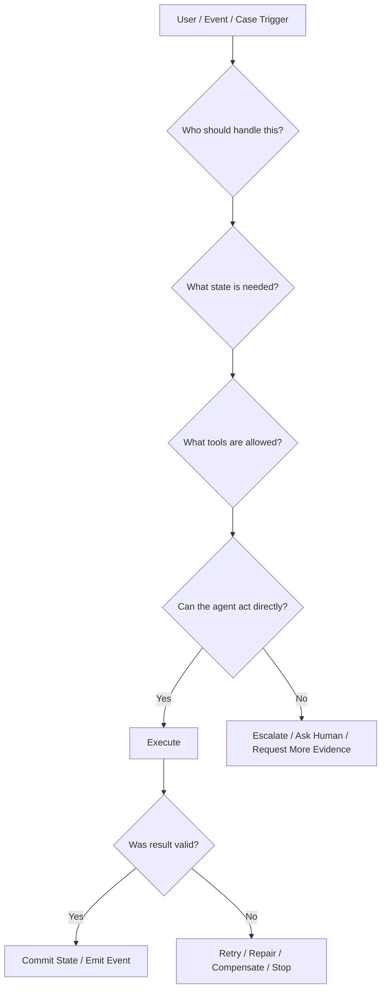

In enterprise systems, the orchestration layer is usually more important than the model call itself.

---

## 3. Workflow vs Agent vs Multi-Agent

Before selecting a topology, separate these three ideas.

### Workflow

A workflow has a mostly predetermined path.

Example:

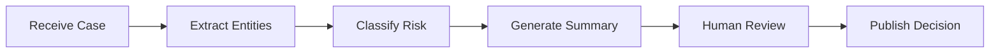

The system knows the order. The model may help inside steps, but the path is controlled.

### Agent

An agent chooses some of its own path.

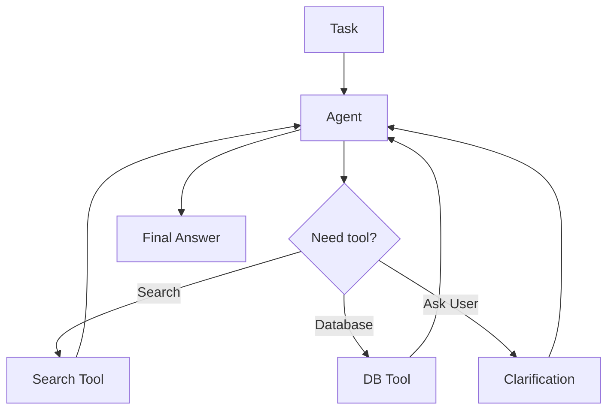

The runtime gives the agent capabilities, and the agent decides when to use them.

### Multi-Agent System

A multi-agent system has multiple specialized actors.

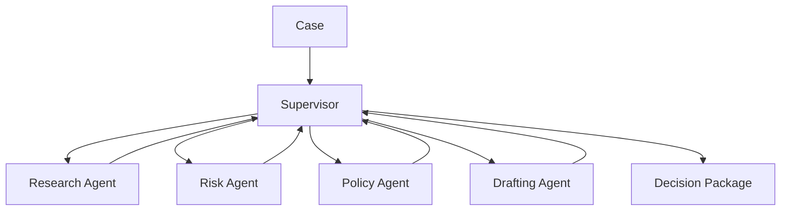

The hard part is not creating agents. The hard part is defining **coordination semantics**.

---

## 4. Orchestration Topology Overview

| Topology | Best For | State Ownership | Autonomy | Risk | Typical Failure |
|---|---|---:|---:|---:|---|
| Router | Fast dispatch to known specialist | Central request state | Low | Low-Medium | Misclassification |
| Pipeline | Predictable step-by-step process | Stage-owned or shared state | Low | Low-Medium | Brittle sequence |
| Supervisor | Delegation with central control | Supervisor-owned state | Medium | Medium | Supervisor bottleneck |
| Handoff | Specialist ownership transfer | Current agent/session state | Medium | Medium | Lost context |
| Graph | Explicit stateful transitions | Shared typed graph state | Medium | Medium-High | State explosion |
| Blackboard | Shared evidence workspace | Shared artifact store | Medium-High | High | Conflicting writes |
| Swarm / Peer Network | Emergent collaboration | Distributed / local state | High | High | Unbounded loops |
| Hierarchical | Large enterprise decomposition | Layered ownership | Medium-High | High | Slow escalation |
| Hybrid | Real enterprise systems | Mixed | Depends | Depends | Inconsistent boundaries |

A serious enterprise implementation often combines several topologies. But it should combine them intentionally, not accidentally.

---

# 5. Router Topology

A router decides which specialist should handle a task.

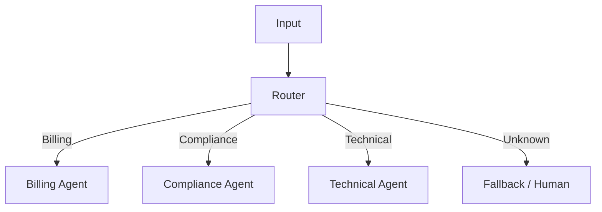

## When to Use

Use a router when:

- categories are known;
- routing decision is cheap;
- specialist behavior is isolated;
- state does not require complex cross-agent negotiation;
- wrong routing is recoverable.

Examples:

- classify support ticket into billing/refund/technical;
- route compliance case to domain-specific workflow;
- choose extraction prompt by document type;
- choose model tier by risk/cost.

## Router Invariants

A router topology needs these invariants:

1. **Every input has a route or fallback**
2. **Routing decision is recorded**
3. **Routing confidence is explicit**
4. **Low-confidence routes go to fallback**
5. **Specialists do not silently reroute without emitting a handoff event**

## Python Sketch

```python
from enum import Enum
from pydantic import BaseModel, Field


class Route(str, Enum):
    BILLING = "billing"
    COMPLIANCE = "compliance"
    TECHNICAL = "technical"
    FALLBACK = "fallback"


class RoutingDecision(BaseModel):
    route: Route
    confidence: float = Field(ge=0.0, le=1.0)
    rationale: str
    required_evidence: list[str] = []


class RoutedRequest(BaseModel):
    request_id: str
    tenant_id: str
    text: str
    route: Route | None = None
    routing_decision: RoutingDecision | None = None


def enforce_routing_policy(decision: RoutingDecision, threshold: float = 0.75) -> Route:
    if decision.confidence < threshold:
        return Route.FALLBACK
    return decision.route
```

The important detail is not the code. The important detail is that the router output is a **typed decision artifact**, not an unstructured string.

## Router Failure Modes

| Failure | Cause | Mitigation |
|---|---|---|
| Misroute | Ambiguous input | Confidence threshold + fallback |
| Specialist mismatch | Taxonomy drift | Route taxonomy versioning |
| Hidden reroute | Specialist calls another path silently | Handoff event required |
| Over-routing | Too many categories | Collapse categories by operational owner |
| Prompt-only routing | No testable contract | Typed routing output |

## Router Practice Drill

Take 30 real support/case-management examples. Define:

- route taxonomy;
- confidence threshold;
- fallback criteria;
- evaluation set;
- expected route;
- explanation quality rubric.

The goal is not 100% automation. The goal is knowing when not to automate.

---

# 6. Pipeline Topology

A pipeline executes steps in a known order.

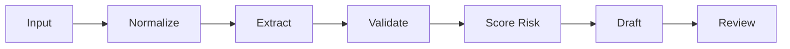

## When to Use

Use a pipeline when:

- the process is stable;
- steps are known;
- output of each step feeds the next;
- auditability matters;
- parallelism is not the main concern;
- deterministic control is more valuable than agent autonomy.

Examples:

- document ingestion;
- regulatory case intake;
- KYC evidence extraction;
- incident triage summary;
- report generation with human review.

## Pipeline State Model

A pipeline can use stage-specific state:

```python
class IntakeState(BaseModel):
    raw_input: str
    normalized_text: str | None = None
    extracted_entities: dict[str, str] = {}
    validation_errors: list[str] = []
    risk_score: float | None = None
    draft_summary: str | None = None
    approved: bool = False
```

Each stage should be a pure-ish transformation where possible:

```python
def extract_entities(state: IntakeState) -> IntakeState:
    # call LLM or deterministic parser
    # validate output
    # return new state snapshot
    return state
```

## Pipeline Invariants

1. **Each stage has typed input/output**
2. **Each stage is idempotent or protected by idempotency key**
3. **Each stage emits an event**
4. **Failure at one stage does not corrupt previous state**
5. **Human review points are explicit**
6. **Retries are local unless state is invalidated**

## Pipeline Anti-Pattern

A common anti-pattern is hiding a fully autonomous agent inside a pipeline step:

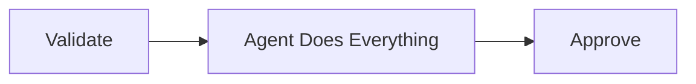

This defeats the purpose of the pipeline. If a step has broad autonomy, make that autonomy visible in the topology.

## Pipeline Practice Drill

Model a case intake workflow:

1. receive complaint;
2. normalize complaint;
3. extract entities;
4. map allegations to regulatory categories;
5. score severity;
6. identify missing evidence;
7. draft analyst brief;
8. wait for human approval.

For each step, define:

- input schema;
- output schema;
- validation rule;
- retry policy;
- escalation condition.

---

# 7. Supervisor Topology

A supervisor coordinates specialists while retaining central control.

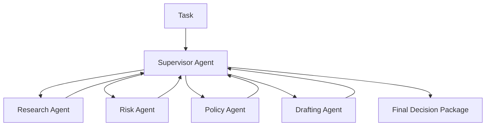

## When to Use

Use a supervisor when:

- multiple specialist agents are useful;
- central coordination is required;
- cross-agent consistency matters;
- state must remain coherent;
- the system needs explainable delegation;
- agent-to-agent chaos is unacceptable.

Examples:

- enforcement case analysis;
- incident investigation;
- complex claim review;
- enterprise support resolution;
- software engineering assistant with planner/reviewer/tester roles.

## Supervisor State

The supervisor should own the canonical run state.

```python
class AgentFinding(BaseModel):
    agent_name: str
    finding_type: str
    summary: str
    evidence_refs: list[str]
    confidence: float
    blockers: list[str] = []


class SupervisorState(BaseModel):
    run_id: str
    objective: str
    findings: list[AgentFinding] = []
    open_questions: list[str] = []
    decisions: list[str] = []
    escalation_required: bool = False
```

Specialists produce findings. The supervisor decides how to integrate them.

## Delegation Contract

A specialist should not be called with vague instructions such as:

> “Analyze this case.”

A better delegation contract:

```python
class DelegatedTask(BaseModel):
    task_id: str
    agent_name: str
    objective: str
    allowed_tools: list[str]
    input_refs: list[str]
    output_schema: str
    deadline_ms: int
    stop_conditions: list[str]
```

## Supervisor Invariants

1. **The supervisor owns the final decision**
2. **Specialists own findings, not final authority**
3. **Every delegation is recorded**
4. **Every specialist output is validated**
5. **Disagreements become explicit state**
6. **The supervisor has a stop policy**

## Supervisor Failure Modes

| Failure | Description | Mitigation |
|---|---|---|
| Bottleneck | Supervisor does too much | Parallel specialist calls + summarization |
| Rubber stamp | Supervisor accepts all outputs | Independent validation |
| Delegation loop | Supervisor keeps asking agents | Max turns + stop conditions |
| Context overload | Supervisor state grows too large | Evidence refs + summaries + memory policy |
| Authority confusion | Specialist makes final decision | Explicit decision rights |

## Practical Rule

If the system has regulatory, financial, legal, or irreversible consequences, prefer **supervisor with deterministic gates** over free-form peer collaboration.

---

# 8. Handoff Topology

A handoff transfers control from one agent to another.

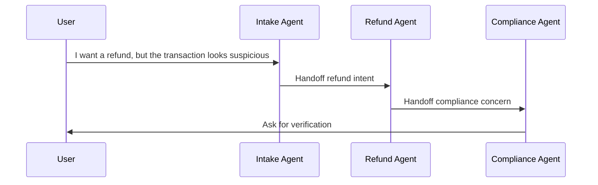

## When to Use

Use handoff when:

- agents represent distinct operational domains;
- each domain can own a segment of the interaction;
- the user experience should remain conversational;
- control naturally transfers between specialists.

Examples:

- customer support agents;
- internal helpdesk;
- healthcare intake to specialist workflow;
- legal intake to document review;
- software assistant from triage to code-generation agent.

## Handoff Payload

A handoff must carry structured context.

```python
class HandoffPayload(BaseModel):
    from_agent: str
    to_agent: str
    reason: str
    user_intent: str
    relevant_history_refs: list[str]
    current_state_summary: str
    unresolved_questions: list[str]
    allowed_next_actions: list[str]
```

Without this, the receiving agent reconstructs context from raw chat history, which is unreliable.

## Handoff Invariants

1. **Handoff reason is explicit**
2. **Receiving agent knows current objective**
3. **Relevant context is summarized and referenced**
4. **Authority transfers are clear**
5. **Handoff is logged**
6. **There is a fallback if receiving agent refuses or cannot proceed**

## Handoff Anti-Pattern

Do not use handoff to hide routing uncertainty.

Bad:

```text
I do not know who owns this, so I will transfer it randomly.
```

Better:

```text
Routing confidence is low. Ask for clarification or escalate to human triage.
```

---

# 9. Graph Topology

A graph topology represents execution as nodes and transitions over shared state.

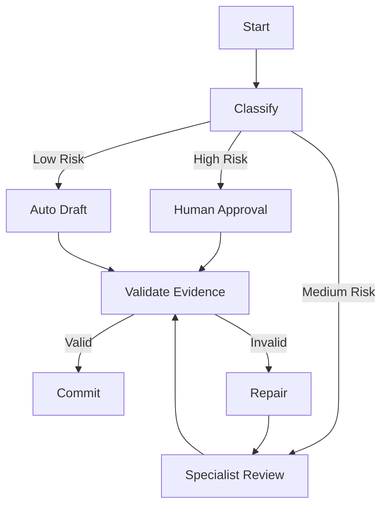

## When to Use

Use a graph when:

- execution paths branch based on state;
- loops are possible but must be controlled;
- human-in-the-loop points are needed;
- state must be persisted and resumed;
- nodes can be tested independently;
- different teams own different subgraphs.

## Graph State

A graph topology should use a shared, typed state object.

```python
class CaseGraphState(BaseModel):
    case_id: str
    phase: str
    risk_level: str | None = None
    evidence_refs: list[str] = []
    draft_decision: str | None = None
    validation_errors: list[str] = []
    human_approval_required: bool = False
    completed_nodes: list[str] = []
```

## Graph Invariants

1. **Every node declares input assumptions**
2. **Every node declares state mutations**
3. **Every edge has a transition condition**
4. **Cycles have termination criteria**
5. **State snapshots are persisted**
6. **Resume behavior is deterministic**
7. **Human interrupts are represented as state, not exceptions**

## Graph vs Pipeline

A pipeline is a graph with mostly linear edges.

A graph is better when the process contains:

- branches;
- loops;
- conditional escalation;
- repair paths;
- dynamic specialist invocation;
- checkpoint/resume requirements.

## Graph Failure Modes

| Failure | Cause | Mitigation |
|---|---|---|
| State explosion | Too many mutable fields | Typed substate + ownership |
| Edge ambiguity | Multiple valid transitions | Priority rules |
| Infinite loop | Repair path lacks stop policy | Max iteration + loop reason |
| Hidden mutation | Node mutates unrelated state | Mutation contract |
| Resume bug | State cannot be hydrated cleanly | Snapshot schema versioning |

---

# 10. Blackboard Topology

In a blackboard topology, agents collaborate through a shared workspace.

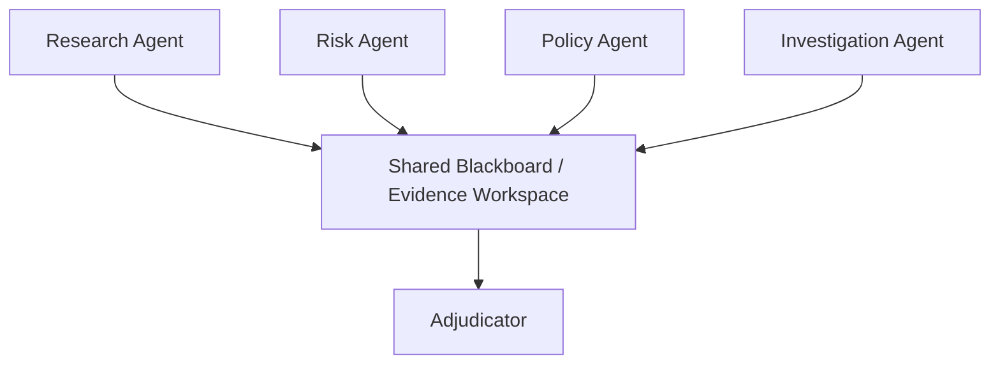

Each agent contributes evidence, hypotheses, findings, and objections.

## When to Use

Use blackboard topology when:

- multiple specialists need to contribute asynchronously;
- no single agent has full context;
- evidence evolves over time;
- findings may conflict;
- the final decision requires adjudication.

Examples:

- fraud investigation;
- regulatory enforcement lifecycle;
- security incident response;
- complex litigation support;
- large-scale research synthesis.

## Blackboard Data Model

The blackboard is not a random shared dictionary. It needs typed artifacts.

```python
class BlackboardArtifact(BaseModel):
    artifact_id: str
    artifact_type: str
    produced_by: str
    summary: str
    evidence_refs: list[str]
    confidence: float
    created_at: str
    supersedes: list[str] = []
    disputed_by: list[str] = []


class BlackboardState(BaseModel):
    case_id: str
    artifacts: list[BlackboardArtifact] = []
    open_hypotheses: list[str] = []
    disputes: list[str] = []
```

## Blackboard Invariants

1. **Agents append artifacts; they do not overwrite silently**
2. **Contradictions are first-class artifacts**
3. **Every artifact has provenance**
4. **Evidence references are mandatory**
5. **Adjudication is separate from contribution**
6. **Obsolete artifacts are superseded, not deleted**

## Blackboard Failure Modes

| Failure | Description | Mitigation |
|---|---|---|
| Conflicting writes | Agents overwrite shared state | Append-only artifact log |
| Evidence pollution | Low-quality artifacts accumulate | Evidence quality scoring |
| No convergence | Agents keep adding findings | Adjudicator + stop criteria |
| Unclear authority | Contributors decide final outcome | Separate adjudication stage |
| Context bloat | Blackboard grows without bound | Summaries + archival policy |

---

# 11. Swarm / Peer Network Topology

A swarm topology allows agents to coordinate more freely.

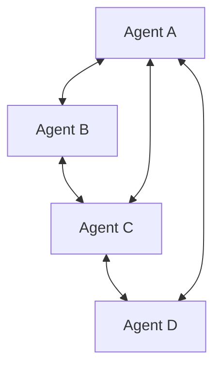

This can be powerful but dangerous.

## When to Use

Use swarm-like patterns only when:

- exploration matters more than determinism;
- cost is bounded;
- side effects are prohibited;
- agents operate in a sandbox;
- final output is reviewed by a deterministic or human gate.

Examples:

- brainstorming;
- research exploration;
- design alternatives;
- test-case generation;
- red-team simulation.

## When Not to Use

Avoid swarm topology for:

- payment execution;
- compliance decisions;
- identity verification;
- regulatory notices;
- production data mutation;
- customer-facing irreversible actions.

## Swarm Invariants

1. **No irreversible side effects**
2. **Strict budget limit**
3. **Max turn limit**
4. **Final adjudication outside the swarm**
5. **All messages logged**
6. **No secret sharing between agents unless permitted**

## Swarm Failure Modes

| Failure | Description | Mitigation |
|---|---|---|
| Infinite debate | Agents keep responding | Turn budget |
| Consensus illusion | Agents agree without evidence | Independent evidence requirement |
| Cost explosion | Peer loops multiply calls | Token/tool budgets |
| Authority collapse | No one owns decision | External adjudicator |
| Prompt contamination | Agents amplify bad context | Context filters |

The enterprise rule is simple:

> Swarms are good for exploration, not authority.

---

# 12. Hierarchical Topology

A hierarchy decomposes work across layers.

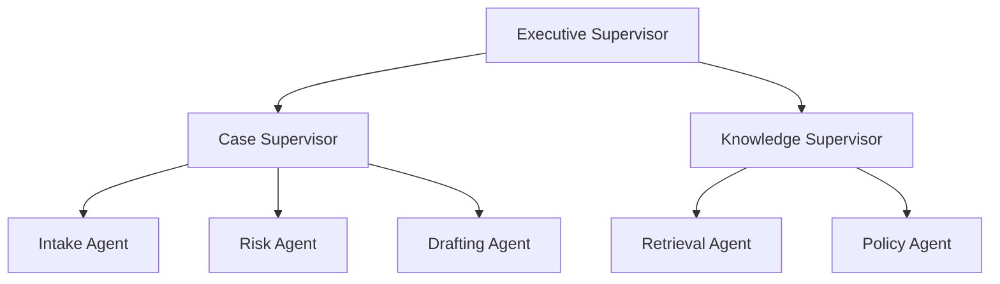

## When to Use

Use hierarchy when:

- the domain is large;
- teams own different subsystems;
- the workflow spans multiple bounded contexts;
- permissions differ by layer;
- audit and escalation are mandatory.

Examples:

- enterprise case management;
- banking operations;
- telecom BSS/OSS workflows;
- public sector regulatory enforcement;
- cross-domain compliance review.

## Hierarchical Invariants

1. **Each layer has explicit authority**
2. **Lower layers cannot bypass upper policy**
3. **Escalation path is deterministic**
4. **State ownership is partitioned**
5. **Summaries move upward; detailed evidence remains referenced**
6. **Cross-layer communication is typed**

## Hierarchy Failure Modes

| Failure | Description | Mitigation |
|---|---|---|
| Slow escalation | Too many layers | Risk-based fast path |
| Distorted summaries | Information lost upward | Evidence refs + audit log |
| Over-centralization | Top agent bottlenecks | Delegated authority matrix |
| Policy bypass | Lower agent takes action | Policy guard at tool boundary |
| Inconsistent state | Layers hold different truths | Canonical state store |

---

# 13. Hybrid Topology

Most real enterprise systems are hybrid.

Example: enforcement case management.

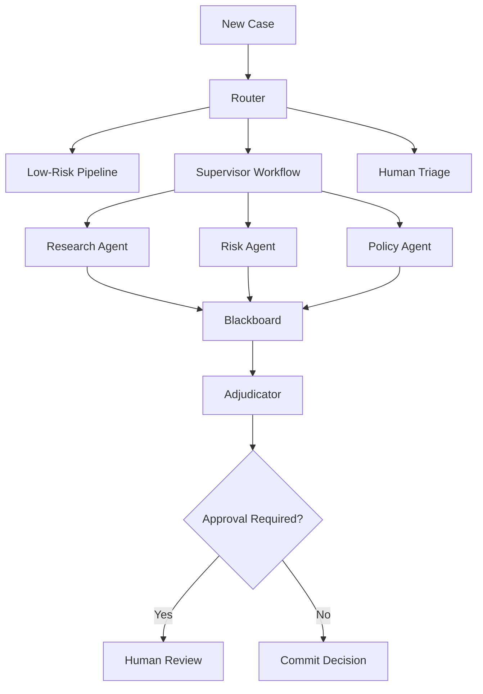

This hybrid combines:

- router for intake;
- pipeline for low-risk cases;
- supervisor for complex cases;
- blackboard for shared evidence;
- adjudicator for decision;
- human review for high-risk actions.

The skill is not avoiding hybrid systems. The skill is making hybrid systems **explicit**.

---

# 14. Decision Matrix

Use this matrix when selecting topology.

| Requirement | Prefer |
|---|---|
| Fast classification | Router |
| Stable business process | Pipeline |
| Branching stateful workflow | Graph |
| Specialist delegation with central authority | Supervisor |
| Conversational domain transfer | Handoff |
| Shared evolving evidence | Blackboard |
| Exploration / ideation | Swarm |
| Large regulated organization | Hierarchical |
| Mixed risk levels | Hybrid |

## Risk-Based Shortcut

| Risk Level | Suggested Topology |
|---|---|
| Low risk, reversible | Router or pipeline |
| Medium risk, reviewable | Graph or supervisor |
| High risk, irreversible | Supervisor + deterministic gates + human review |
| Exploratory only | Swarm with no side effects |
| Regulated decision | Graph + blackboard + adjudicator + audit |

---

# 15. State Ownership by Topology

State ownership determines correctness.

| Topology | Canonical State Owner |
|---|---|
| Router | Request/session service |
| Pipeline | Workflow engine |
| Supervisor | Supervisor state |
| Handoff | Current owning agent/session |
| Graph | Graph runtime/checkpointer |
| Blackboard | Shared artifact store |
| Swarm | External coordinator |
| Hierarchical | Layered state stores |
| Hybrid | Explicit per-subsystem ownership |

A dangerous system is one where every agent believes it owns the truth.

---

# 16. Tool Ownership by Topology

Tool ownership should follow authority.

| Topology | Tool Rule |
|---|---|
| Router | Router usually has no side-effect tools |
| Pipeline | Tools are bound to stages |
| Supervisor | Supervisor grants tools to specialists |
| Handoff | Receiving agent gets domain tools |
| Graph | Node declares tools |
| Blackboard | Contributors may read/write artifacts only |
| Swarm | Read-only or sandbox tools |
| Hierarchical | Tools scoped by authority layer |

A top-level design principle:

> Tools should be granted to execution units, not personalities.

Do not say: “The policy agent is trusted.”

Say: “The policy-review node can read policy documents, propose interpretations, and cannot mutate case state.”

---

# 17. Retry and Compensation by Topology

| Topology | Retry Strategy |
|---|---|
| Router | Retry classification only if input/context changes |
| Pipeline | Retry failed stage idempotently |
| Supervisor | Retry specialist task with same task ID |
| Handoff | Retry handoff only if receiving agent did not accept |
| Graph | Retry node with checkpointed state |
| Blackboard | Append correction artifact |
| Swarm | Usually do not retry; rerun exploration |
| Hierarchical | Retry at lowest safe layer |

Compensation is required when a step has side effects.

Example:

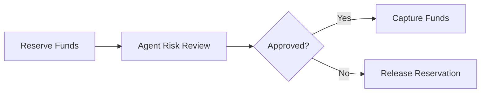

Agentic systems must not pretend all operations are pure.

---

# 18. Observability by Topology

Every topology needs runtime forensics.

| Topology | Must Observe |
|---|---|
| Router | route, confidence, rationale, fallback rate |
| Pipeline | stage latency, validation failure, retry count |
| Supervisor | delegation graph, specialist outputs, disagreements |
| Handoff | from/to agent, handoff reason, context payload |
| Graph | node transitions, state snapshots, loop count |
| Blackboard | artifact provenance, disputes, supersession |
| Swarm | turn count, cost, convergence, final adjudication |
| Hierarchical | escalation path, layer decision, authority boundary |

Do not log only prompts and responses. Log **decisions**.

---

# 19. Enterprise Design Heuristics

## Heuristic 1 — Prefer the Least Autonomous Topology That Works

If a pipeline solves the problem, do not use a swarm.

If a router solves the problem, do not use a supervisor.

If a deterministic function solves the problem, do not call an LLM.

## Heuristic 2 — Separate Exploration from Authority

Use autonomous agents to explore.

Use deterministic gates, typed validators, policy engines, and humans to authorize.

## Heuristic 3 — Make Every Boundary Typed

Agent boundaries are system boundaries.

Each boundary should have:

- input schema;
- output schema;
- tool permission;
- timeout;
- retry policy;
- validation rule;
- audit event.

## Heuristic 4 — Design for Replay

A production incident will eventually require answering:

- What did the agent know?
- What did it do?
- Which tools did it call?
- Which policy version applied?
- Why did it choose that path?
- Who approved the action?
- Can we reproduce or replay the decision?

If your topology cannot answer these, it is not enterprise-grade.

---

# 20. Reference Python Interfaces

Below is a minimal topology-agnostic orchestration interface.

```python
from abc import ABC, abstractmethod
from typing import Any
from pydantic import BaseModel


class RunContext(BaseModel):
    run_id: str
    tenant_id: str
    user_id: str | None = None
    policy_version: str
    correlation_id: str


class StepResult(BaseModel):
    status: str
    output: dict[str, Any] = {}
    events: list[dict[str, Any]] = []
    next_steps: list[str] = []


class OrchestrationNode(ABC):
    name: str

    @abstractmethod
    async def run(self, context: RunContext, state: BaseModel) -> StepResult:
        pass


class Transition(BaseModel):
    from_node: str
    to_node: str
    condition: str


class TopologySpec(BaseModel):
    name: str
    nodes: list[str]
    transitions: list[Transition]
    state_schema: str
```

This abstraction is intentionally simple. You can map it to LangGraph nodes, a workflow engine, custom async tasks, Temporal-like orchestration, or another runtime.

The point is to keep architecture concepts separate from vendor APIs.

---

# 21. Practice: Design a Regulatory Case Topology

Design an AI-assisted regulatory case workflow.

Requirements:

- cases arrive from multiple channels;
- low-risk cases can be summarized automatically;
- high-risk cases require human approval;
- evidence can be incomplete;
- multiple specialist agents may disagree;
- every decision must be auditable;
- side effects include notifying regulated entities.

Recommended topology:

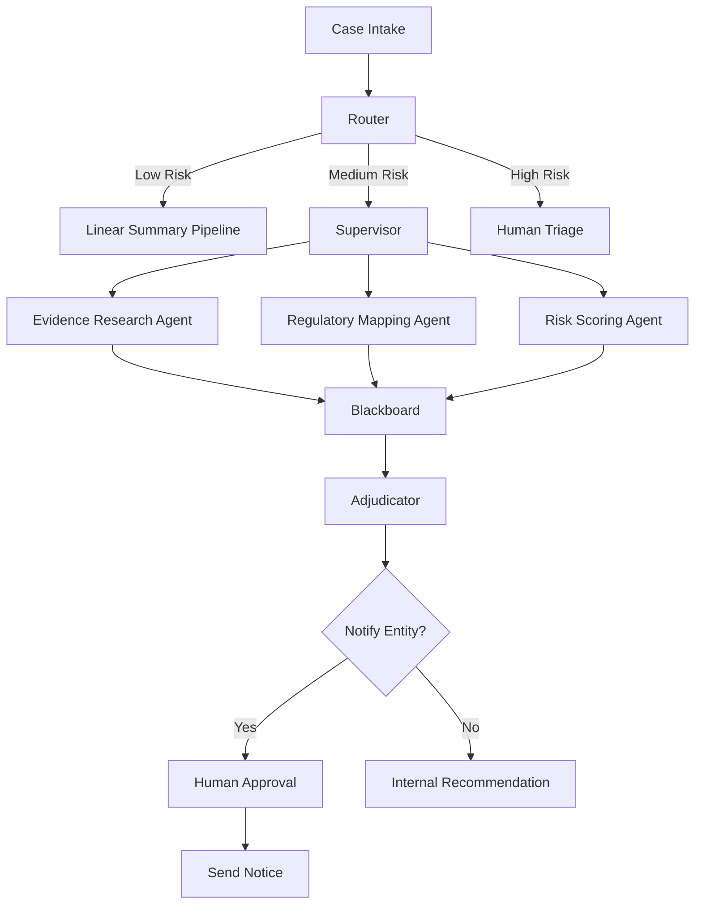

Now define:

1. canonical state owner;
2. tool permissions by node;
3. retry strategy;
4. stop conditions;
5. audit events;
6. human approval gates;
7. failure modes;
8. evaluation scenarios.

---

# 22. What Top 1% Engineers Pay Attention To

Top engineers are not impressed by diagrams with many agents.

They ask:

- Is the topology simpler than the problem?
- Is authority explicit?
- Is state ownership explicit?
- Are side effects isolated?
- Are failures recoverable?
- Are decisions replayable?
- Are human gates placed before irreversible action?
- Is autonomy bounded by risk?
- Can each agent be tested independently?
- Can the system be operated by people who did not build it?

The best topology is rarely the most “agentic.” It is the one that gives the business enough intelligence without losing control.

---

# 23. Summary

In this part, we covered:

- router topology;
- pipeline topology;
- supervisor topology;
- handoff topology;
- graph topology;
- blackboard topology;
- swarm topology;
- hierarchical topology;
- hybrid enterprise topology;
- state ownership;
- tool ownership;
- retries and compensation;
- observability;
- enterprise heuristics.

The next part focuses on a deeper architectural tension:

> How deterministic should an enterprise agentic system be, and where should autonomy be allowed?

That is the heart of production AI system design.

---

## References

- LangGraph documentation: workflows, agents, durable execution, graph state, subgraphs, interrupts.
- OpenAI Agents SDK documentation: handoffs, tools, guardrails, tracing.
- Microsoft Agent Framework documentation: workflows, multi-agent orchestration, state, checkpointing, telemetry.
- Model Context Protocol specification: tools, resources, prompts, authorization.
- OpenTelemetry documentation: traces, metrics, logs.
