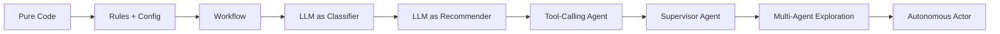
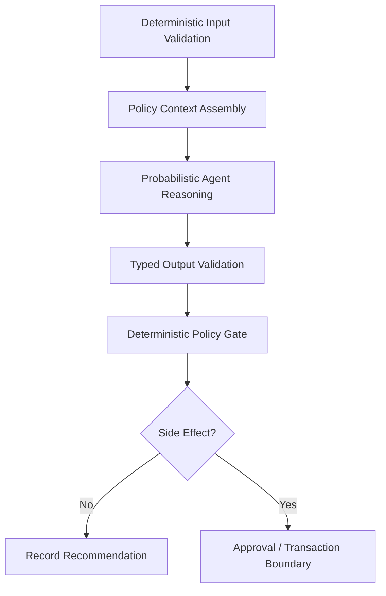
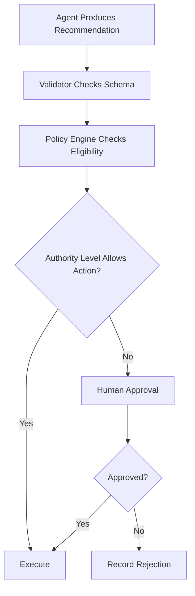
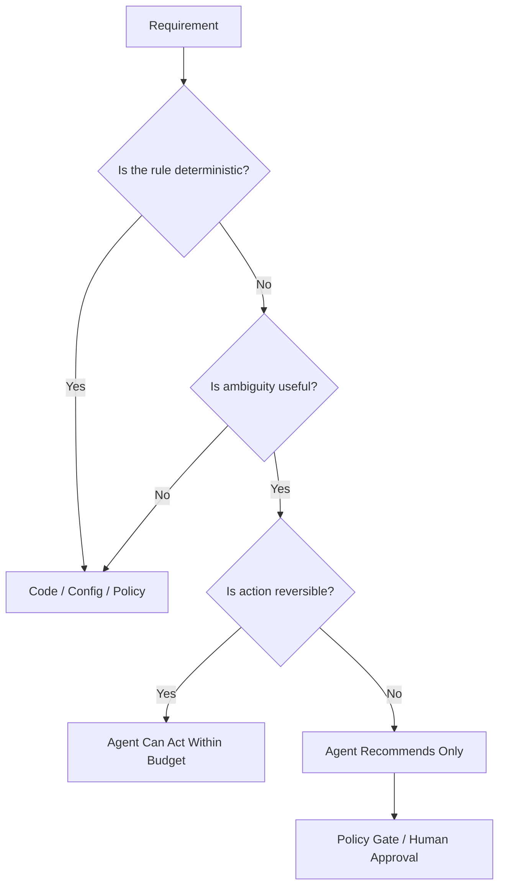
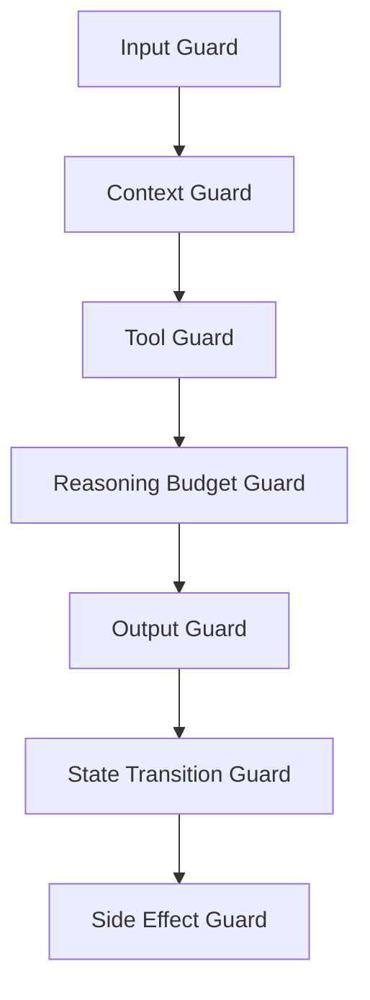
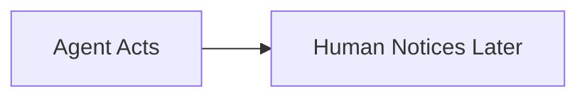
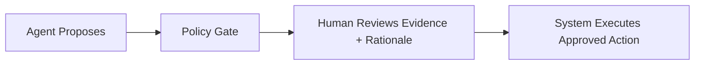
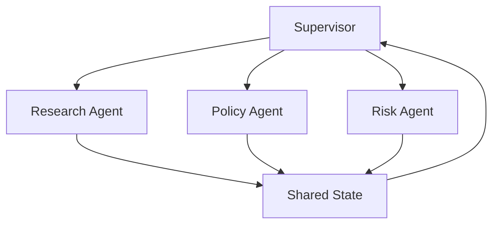
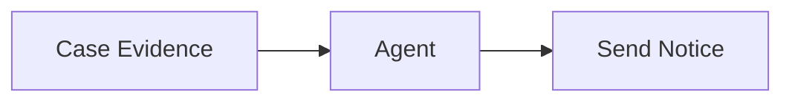
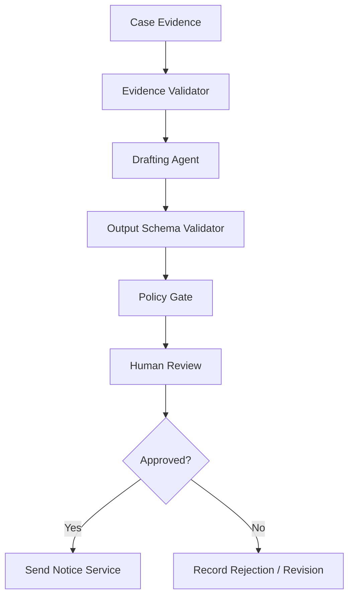

# Part 008 — Determinism vs Autonomy

> Enterprise AI architecture is not about maximizing autonomy.
>
> It is about placing autonomy exactly where uncertainty exists, and placing determinism everywhere else.

Many failed agentic systems fail for the same reason: they give an LLM decision authority that should have belonged to code, workflow, policy, validation, or a human.

This part gives you a practical mental model for deciding:

- which parts of the system should be deterministic;
- which parts can be probabilistic;
- where an agent may choose;
- where an agent must only recommend;
- where human review is required;
- where policy must override model behavior;
- how to encode autonomy as an explicit budget.

---

## 1. Kaufman Framing

The sub-skill here is:

> Given a system requirement, decide the correct autonomy level for each step, tool, agent, and state transition.

This is a high-leverage skill because bad autonomy placement creates:

- unpredictable behavior;
- expensive loops;
- security failures;
- compliance gaps;
- unclear accountability;
- untestable systems;
- incidents that cannot be reconstructed.

### Target Performance

By the end of this part, you should be able to:

- describe the determinism-autonomy spectrum;
- classify actions by reversibility and risk;
- define autonomy budgets;
- design deterministic shells around probabilistic cores;
- separate recommendation authority from execution authority;
- implement policy gates before side effects;
- identify where autonomy is dangerous;
- explain why “more agentic” is often worse.

---

# 2. The Spectrum

Determinism and autonomy are not binary.



Each step to the right increases flexibility and risk.

## Spectrum Table

| Level | Description | Example | Typical Use |
|---:|---|---|---|
| 0 | Pure deterministic code | `if status == CLOSED` | invariants, validation |
| 1 | Rules/config | policy threshold | business policy |
| 2 | Workflow | fixed case lifecycle | regulated process |
| 3 | LLM classifier | categorize complaint | low-risk judgment |
| 4 | LLM recommender | suggest risk rationale | analyst support |
| 5 | Tool-calling agent | fetch evidence | bounded investigation |
| 6 | Supervisor agent | coordinate specialists | complex analysis |
| 7 | Multi-agent exploration | generate hypotheses | research/simulation |
| 8 | Autonomous actor | acts directly | rare, high-control contexts only |

The core enterprise rule:

> Move right only when the business benefit exceeds the control cost.

---

# 3. Deterministic Shell, Probabilistic Core

A strong enterprise pattern is:



The LLM can reason, summarize, rank, classify, or propose. But the shell controls:

- input schema;
- allowed tools;
- context sources;
- state transitions;
- output schema;
- policy enforcement;
- side effects;
- audit events;
- retry behavior;
- escalation.

This design respects the strengths of LLMs without letting them become the entire system.

---

# 4. Autonomy as a Budget

Autonomy should be budgeted like CPU, memory, latency, or money.

An autonomy budget limits what the agent can decide.

```python
from pydantic import BaseModel, Field


class AutonomyBudget(BaseModel):
    max_turns: int = Field(ge=1)
    max_tool_calls: int = Field(ge=0)
    max_tokens: int = Field(ge=1)
    max_cost_usd: float = Field(ge=0.0)
    max_wall_time_ms: int = Field(ge=1)
    can_call_external_tools: bool = False
    can_mutate_state: bool = False
    can_trigger_side_effects: bool = False
    requires_human_approval: bool = True
```

This makes autonomy explicit.

Bad:

```text
The agent can solve the case.
```

Better:

```text
The agent can inspect evidence, call read-only tools up to 8 times, produce a recommendation, and cannot mutate case status or notify an external party.
```

---

# 5. Authority Levels

Autonomy is not just about tool access. It is about authority.

| Authority Level | Agent May | Agent May Not |
|---:|---|---|
| 0 — Observe | read context | propose, mutate, call tools |
| 1 — Analyze | summarize, classify, extract | commit decisions |
| 2 — Recommend | propose action | execute action |
| 3 — Prepare | draft side-effect payload | send or commit |
| 4 — Execute Reversible | perform reversible action | perform irreversible action |
| 5 — Execute Irreversible | perform final action | bypass policy/human controls |

Most enterprise AI systems should keep LLM agents between levels 1 and 3.

Level 4 can be allowed only with strict constraints.

Level 5 is exceptional and usually inappropriate for regulated decisions.

---

# 6. Reversibility Matrix

The more irreversible an action is, the less autonomy you should allow.

| Action | Reversible? | Suggested Autonomy |
|---|---:|---|
| Summarize a document | Yes | High |
| Classify a topic | Usually | Medium |
| Suggest next best action | Yes | Medium |
| Draft customer email | Yes before send | Medium |
| Send customer email | Harder | Low + approval |
| Update case status | Depends | Low + policy gate |
| Freeze account | No/High impact | Human approval |
| File regulatory notice | No/High impact | Human approval |
| Delete data | Often no | Deterministic + approval |
| Trigger payment | Financial risk | Strong deterministic control |

A practical rule:

> The agent may draft high-impact actions. It should not independently commit them.

---

# 7. Decision Rights

For every step, define decision rights.



## Decision Rights Table

| Decision | Owner |
|---|---|
| Which model to call | control plane / model router |
| Which tools are available | policy engine / tool registry |
| Which evidence is trusted | retrieval/evidence policy |
| Whether output schema is valid | validator |
| Whether case can advance | workflow rule |
| Whether side effect can occur | policy gate / human |
| Final regulated decision | accountable human or authorized service |

Agents can recommend. Systems decide.

---

# 8. Risk-Based Autonomy Policy

A risk policy can be represented as code.

```python
from enum import Enum
from pydantic import BaseModel


class RiskLevel(str, Enum):
    LOW = "low"
    MEDIUM = "medium"
    HIGH = "high"
    CRITICAL = "critical"


class ActionType(str, Enum):
    READ = "read"
    ANALYZE = "analyze"
    DRAFT = "draft"
    MUTATE_INTERNAL = "mutate_internal"
    NOTIFY_EXTERNAL = "notify_external"
    IRREVERSIBLE = "irreversible"


class AutonomyDecision(BaseModel):
    allowed: bool
    requires_human_approval: bool
    reason: str


def decide_autonomy(risk: RiskLevel, action: ActionType) -> AutonomyDecision:
    if action in {ActionType.IRREVERSIBLE, ActionType.NOTIFY_EXTERNAL}:
        return AutonomyDecision(
            allowed=True,
            requires_human_approval=True,
            reason="External or irreversible action requires approval.",
        )

    if risk in {RiskLevel.HIGH, RiskLevel.CRITICAL} and action == ActionType.MUTATE_INTERNAL:
        return AutonomyDecision(
            allowed=True,
            requires_human_approval=True,
            reason="High-risk internal mutation requires approval.",
        )

    if risk == RiskLevel.LOW and action in {ActionType.READ, ActionType.ANALYZE, ActionType.DRAFT}:
        return AutonomyDecision(
            allowed=True,
            requires_human_approval=False,
            reason="Low-risk reversible action.",
        )

    return AutonomyDecision(
        allowed=True,
        requires_human_approval=True,
        reason="Default approval required.",
    )
```

The exact rules vary by business. The pattern remains: autonomy is not a prompt. It is a policy decision.

---

# 9. Where Determinism Belongs

Use deterministic logic for:

- identity and authorization;
- tenant isolation;
- tool permission;
- schema validation;
- budget enforcement;
- retry limits;
- deadline enforcement;
- state transition validity;
- idempotency;
- external side-effect commitment;
- audit logging;
- compliance retention;
- policy version selection.

Do not ask an LLM:

```text
Is this user allowed to access this tenant's case?
```

That belongs to authorization logic.

Do not ask an LLM:

```text
Should we ignore the configured cost limit?
```

That belongs to runtime enforcement.

Do not ask an LLM:

```text
Should we record an audit event?
```

Always record audit events.

---

# 10. Where Autonomy Belongs

Use LLM autonomy for:

- ambiguous natural language interpretation;
- summarization;
- evidence synthesis;
- hypothesis generation;
- document classification;
- missing-information detection;
- drafting;
- planning within bounded steps;
- choosing read-only tools;
- explaining trade-offs;
- identifying contradictions.

The safe formulation is:

> Let the agent reason where judgment is useful. Let deterministic systems enforce where correctness is mandatory.

---

# 11. Autonomy Placement Pattern

A practical design approach:



Ask these questions for every agent capability:

1. Is the decision deterministic?
2. Is ambiguity useful?
3. Is the action reversible?
4. Is the impact external?
5. Can we validate the output?
6. Can we replay the decision?
7. Who is accountable if it is wrong?

---

# 12. Autonomy Contracts

An autonomy contract describes what an agent may do.

```python
class ToolPermission(BaseModel):
    tool_name: str
    mode: str  # read, draft, write, execute
    max_calls: int
    required_approval: bool


class AgentAutonomyContract(BaseModel):
    agent_name: str
    purpose: str
    authority_level: int
    allowed_tools: list[ToolPermission]
    allowed_state_mutations: list[str]
    forbidden_actions: list[str]
    budget: AutonomyBudget
    escalation_conditions: list[str]
```

Example:

```python
risk_agent_contract = AgentAutonomyContract(
    agent_name="risk-agent",
    purpose="Assess case risk and explain evidence.",
    authority_level=2,
    allowed_tools=[
        ToolPermission(
            tool_name="case_evidence_search",
            mode="read",
            max_calls=5,
            required_approval=False,
        )
    ],
    allowed_state_mutations=[],
    forbidden_actions=[
        "change_case_status",
        "notify_external_party",
        "delete_evidence",
    ],
    budget=AutonomyBudget(
        max_turns=6,
        max_tool_calls=5,
        max_tokens=12000,
        max_cost_usd=2.0,
        max_wall_time_ms=60000,
        can_call_external_tools=False,
        can_mutate_state=False,
        can_trigger_side_effects=False,
        requires_human_approval=False,
    ),
    escalation_conditions=[
        "confidence_below_threshold",
        "missing_required_evidence",
        "conflicting_policy_interpretation",
    ],
)
```

This is the kind of structure enterprise systems need.

---

# 13. Guardrail Placement

Guardrails are not only output filters.

They exist at several layers.



## Guardrail Types

| Guardrail | Purpose |
|---|---|
| Input guard | reject unsafe or irrelevant input |
| Context guard | prevent unauthorized data injection |
| Tool guard | restrict tool access |
| Budget guard | stop runaway loops |
| Output guard | enforce schema/safety |
| State guard | prevent invalid transition |
| Side-effect guard | block unauthorized external actions |

A serious system has multiple guardrails. A weak system has one prompt saying “be careful.”

---

# 14. Deterministic Policy Gate

Before any side effect, insert a policy gate.

```python
class ProposedAction(BaseModel):
    action_id: str
    action_type: ActionType
    case_id: str
    proposed_by: str
    payload: dict
    rationale: str
    evidence_refs: list[str]


class PolicyGateResult(BaseModel):
    decision: str  # allow, require_approval, deny
    reason: str
    policy_version: str


def policy_gate(action: ProposedAction, risk: RiskLevel) -> PolicyGateResult:
    autonomy = decide_autonomy(risk, action.action_type)

    if not autonomy.allowed:
        return PolicyGateResult(
            decision="deny",
            reason=autonomy.reason,
            policy_version="2026-06-29",
        )

    if autonomy.requires_human_approval:
        return PolicyGateResult(
            decision="require_approval",
            reason=autonomy.reason,
            policy_version="2026-06-29",
        )

    return PolicyGateResult(
        decision="allow",
        reason=autonomy.reason,
        policy_version="2026-06-29",
    )
```

A policy gate should be outside the LLM. The model can supply rationale. The policy gate enforces authority.

---

# 15. Stop Conditions

Autonomy without stop conditions is operational debt.

Every agent should have explicit stop conditions.

```python
class StopCondition(BaseModel):
    name: str
    description: str
    severity: str


DEFAULT_STOP_CONDITIONS = [
    StopCondition(
        name="max_turns_reached",
        description="Agent reached maximum allowed turns.",
        severity="hard",
    ),
    StopCondition(
        name="tool_budget_exhausted",
        description="Agent reached maximum allowed tool calls.",
        severity="hard",
    ),
    StopCondition(
        name="low_confidence",
        description="Agent cannot produce a confident result.",
        severity="soft",
    ),
    StopCondition(
        name="conflicting_evidence",
        description="Evidence supports multiple incompatible conclusions.",
        severity="soft",
    ),
    StopCondition(
        name="policy_boundary",
        description="Requested action exceeds agent authority.",
        severity="hard",
    ),
]
```

Stop conditions are part of correctness.

---

# 16. Non-Determinism Management

LLM systems are not fully deterministic, but you can reduce uncontrolled variation.

Control variables:

- model version;
- prompt version;
- tool version;
- retrieval index version;
- context assembly version;
- temperature and sampling settings;
- output schema;
- validator version;
- policy version;
- memory snapshot;
- seed if supported;
- runtime configuration.

For every important run, record a **run manifest**.

```python
class RunManifest(BaseModel):
    run_id: str
    model: str
    model_version: str | None = None
    prompt_version: str
    tool_versions: dict[str, str]
    retrieval_index_version: str | None = None
    policy_version: str
    autonomy_contract_version: str
    state_schema_version: str
    temperature: float
    created_at: str
```

You may not reproduce the exact same token sequence, but you can reproduce the conditions closely enough for forensic analysis.

---

# 17. Autonomy and Evaluation

The more autonomy you allow, the stronger your evaluation harness must be.

| Autonomy Level | Evaluation Requirement |
|---:|---|
| 0-1 | Unit tests |
| 2 | Workflow tests |
| 3 | Classifier accuracy + confusion matrix |
| 4 | Recommendation quality rubric |
| 5 | Tool-use simulation |
| 6 | Multi-agent scenario tests |
| 7 | Red-team / adversarial evaluation |
| 8 | Continuous monitoring + human audit |

Agent autonomy increases the test surface.

A deterministic function has an input-output contract.

An autonomous agent has:

- input-output behavior;
- tool behavior;
- state behavior;
- budget behavior;
- refusal behavior;
- escalation behavior;
- recovery behavior;
- policy behavior.

---

# 18. Autonomy Drift

Autonomy drift happens when a system becomes more autonomous over time without formal design approval.

Examples:

- a read-only tool becomes a write tool;
- a draft action becomes an auto-send action;
- a recommendation becomes an automatic state transition;
- an analyst approval step is removed because “the agent is usually right”;
- a prompt gains language telling the agent to decide.

Autonomy drift is dangerous because it often happens gradually.

## Drift Controls

- version autonomy contracts;
- require architecture review for authority changes;
- log all side-effect capability changes;
- separate read/write tools;
- run regression evaluation after prompt updates;
- maintain a decision-rights matrix;
- review production traces.

---

# 19. Human-in-the-Loop Is Not a Patch

Human review should be designed, not bolted on.

Bad pattern:



Better pattern:



A human reviewer needs:

- proposed action;
- rationale;
- evidence references;
- confidence;
- policy basis;
- alternatives;
- known uncertainty;
- previous similar decisions;
- side-effect preview.

Do not ask humans to approve opaque agent output. Give them a decision package.

---

# 20. Autonomy in Multi-Agent Systems

Multi-agent systems multiply autonomy.

If one agent has 5 possible actions and another has 5 possible actions, the combined execution space is not 10. It can become combinatorial because actions interact through state.



## Multi-Agent Autonomy Rules

1. Specialists should have narrower autonomy than the supervisor.
2. Shared state mutation should be restricted.
3. Agents should not grant tools to other agents.
4. Peer-to-peer communication should be logged.
5. Disagreement should become structured state.
6. Final authority should be centralized or explicitly adjudicated.
7. Side effects should be outside specialist agents.

---

# 21. Autonomy Smells

Watch for these design smells.

| Smell | Why It Is Dangerous |
|---|---|
| “The agent decides what to do next” | No bounded action space |
| “The agent has access to all tools” | No least privilege |
| “We trust the model” | Trust is not a control |
| “Human can check later” | Too late for irreversible effects |
| “It usually works” | No evaluation discipline |
| “We log the prompt” | Not enough for audit |
| “It can update memory freely” | Memory poisoning risk |
| “Agents talk to each other until done” | Loop/cost risk |
| “The prompt says not to do unsafe things” | Prompt is not enforcement |

---

# 22. Enterprise Autonomy Review Checklist

Before increasing autonomy, answer:

- What new decision right is being granted?
- Is the action reversible?
- What is the worst credible failure?
- Which policy applies?
- Which human role is accountable?
- What evidence must exist?
- What validator checks the output?
- What telemetry proves correct behavior?
- What budget limits execution?
- What stop condition prevents loops?
- How is rollback or compensation handled?
- How will this be evaluated before release?
- What production metric signals drift?

If you cannot answer these, do not increase autonomy.

---

# 23. Python Control Wrapper

A simple execution wrapper can enforce autonomy.

```python
import time
from typing import Awaitable, Callable, Any


class AutonomyViolation(Exception):
    pass


async def run_with_autonomy_budget(
    *,
    contract: AgentAutonomyContract,
    run_fn: Callable[[], Awaitable[Any]],
) -> Any:
    start = time.monotonic()

    if contract.budget.can_trigger_side_effects and contract.budget.requires_human_approval:
        raise AutonomyViolation("Agent cannot trigger side effects without approval.")

    result = await run_fn()

    elapsed_ms = int((time.monotonic() - start) * 1000)

    if elapsed_ms > contract.budget.max_wall_time_ms:
        raise AutonomyViolation("Agent exceeded wall-time budget.")

    return result
```

A production version would also track:

- token usage;
- cost;
- tool calls;
- state mutations;
- model calls;
- policy decisions;
- output validation;
- trace spans.

---

# 24. Case Study: Enforcement Notice Drafting

Suppose an agent helps draft a regulatory enforcement notice.

## Dangerous Design



The agent reads evidence and sends notice directly.

Problems:

- no policy gate;
- no human approval;
- no evidence validation;
- no draft review;
- no state transition control;
- no audit package;
- unclear accountability.

## Safer Design



Here the agent drafts. The system decides whether the draft can proceed.

## Authority Assignment

| Component | Authority |
|---|---|
| Evidence Validator | determine evidence completeness |
| Drafting Agent | draft text only |
| Output Validator | enforce structure |
| Policy Gate | determine approval requirement |
| Human Reviewer | approve/reject |
| Send Notice Service | execute approved side effect |
| Audit Logger | record all decisions |

This is enterprise-grade autonomy placement.

---

# 25. What Top 1% Engineers Pay Attention To

Top engineers ask:

- Why is this step agentic?
- What happens if the model is wrong?
- What happens if the model is right for the wrong reason?
- What state can the agent mutate?
- What tools can it call?
- What irreversible action can it trigger?
- What authority does it actually have?
- What stops it?
- What validates it?
- What records it?
- What replays it?
- What human role owns the risk?
- What metric shows autonomy drift?

They are not anti-agent. They are anti-unbounded-authority.

---

# 26. Summary

In this part, we covered:

- determinism-autonomy spectrum;
- deterministic shell and probabilistic core;
- autonomy budgets;
- authority levels;
- reversibility matrix;
- decision rights;
- policy gates;
- stop conditions;
- non-determinism management;
- autonomy drift;
- human-in-the-loop design;
- multi-agent autonomy risks;
- enterprise autonomy review.

The key principle:

> Use autonomy for judgment. Use determinism for authority.

The next part will go deeper into **stateful runtime design**: sessions, threads, checkpoints, hydration, resume, and long-running execution.

---

## References

- LangGraph documentation: workflows versus agents, durable execution, persistence, interrupts, graph state.
- OpenAI Agents SDK documentation: tools, handoffs, guardrails, sessions, tracing.
- Microsoft Agent Framework documentation: workflows, state, checkpointing, human-in-the-loop, telemetry.
- Model Context Protocol specification: tools, resources, prompts, authorization.
- NIST AI Risk Management Framework: governance, mapping, measuring, managing AI risk.
- OWASP Top 10 for LLM Applications: prompt injection, sensitive information disclosure, excessive agency, insecure output handling.
