# Part 009 — Stateful Runtime Design

> A chatbot remembers messages.
>
> An enterprise stateful agent runtime remembers **decisions, state transitions, tool effects, policy versions, checkpoints, approvals, and why execution can safely resume after interruption**.

This part focuses on the runtime foundation behind serious agentic systems:

- sessions;
- threads;
- runs;
- turns;
- steps;
- checkpoints;
- hydration;
- resume;
- interrupts;
- replay;
- state schema evolution;
- human-in-the-loop pauses;
- state ownership;
- recovery boundaries.

This is one of the most important parts in the series. Without a correct stateful runtime, multi-agent architecture becomes a pile of prompts, callbacks, and logs that cannot be operated safely.

---

## 1. Kaufman Framing

Josh Kaufman’s skill acquisition method asks us to deconstruct the skill into smaller capabilities. For stateful runtime design, the sub-skills are:

1. identify all forms of state;
2. define ownership of each state type;
3. persist state at safe boundaries;
4. resume execution without duplicating side effects;
5. version and migrate state schemas;
6. support human review without losing execution context;
7. reconstruct a run after failure;
8. audit why an agent did what it did.

### Target Performance

By the end of this part, you should be able to design a runtime that can answer:

- What is the difference between a session, thread, run, turn, step, and checkpoint?
- Which state is ephemeral, durable, reconstructable, or authoritative?
- What exactly is saved at a checkpoint?
- When can a run be resumed safely?
- How do we avoid re-running irreversible side effects?
- How do human interrupts fit into the execution model?
- How do we replay a run for debugging?
- How do we evolve state schemas without breaking old checkpoints?

---

# 2. Why Stateful Runtime Matters

A stateless agent call is easy:

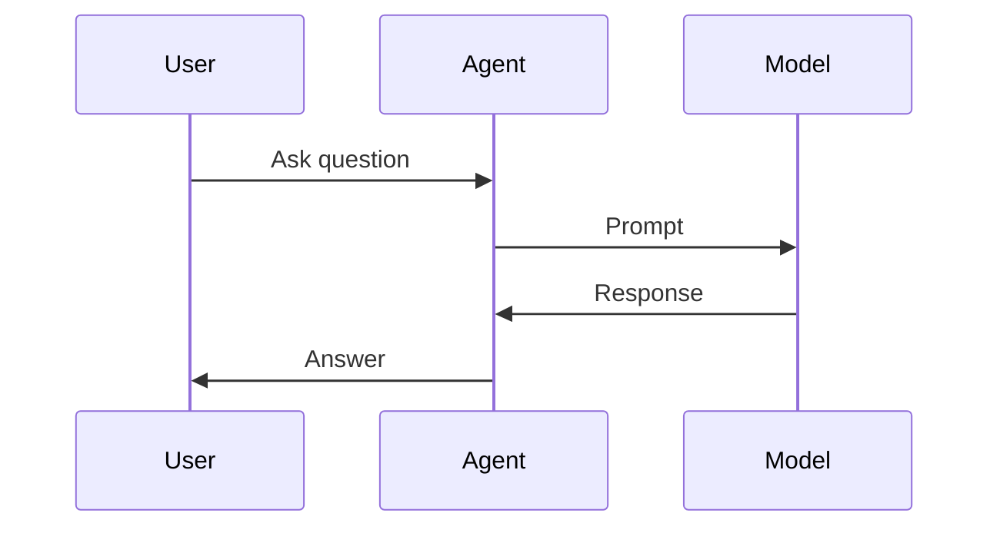

A production stateful agent system is different:

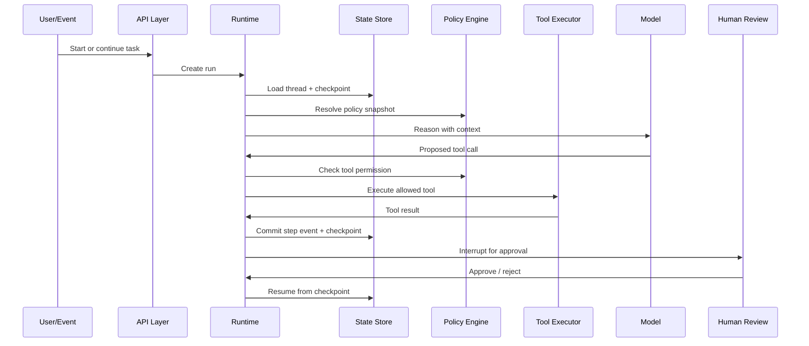

The runtime must manage state across time, failure, users, agents, tools, and humans.

---

# 3. Vocabulary: Session, Thread, Run, Turn, Step, Checkpoint

The terms vary across frameworks, but enterprise architecture needs stable mental models.

| Concept | Meaning | Persistence | Typical Owner |
|---|---|---:|---|
| Session | A user/application interaction boundary | Durable or semi-durable | application/runtime |
| Thread | Long-lived conversation or task lineage | Durable | runtime/state store |
| Run | One execution attempt against a thread/task | Durable | runtime |
| Turn | One conversational exchange | Durable | conversation layer |
| Step | One runtime action: model call, tool call, validation, transition | Durable | orchestrator |
| Checkpoint | Persisted state snapshot at a safe boundary | Durable | checkpointer |
| Event | Append-only record of what happened | Durable | event log |
| Artifact | Produced output/evidence/draft/finding | Durable | artifact store |
| Memory | Reusable knowledge across runs/sessions | Durable with governance | memory service |
| Context | Assembled prompt/tool/model input | Reconstructable | context builder |

A common mistake is collapsing all of these into “chat history.”

That is not enough.

---

# 4. The Runtime State Stack

A stateful enterprise agent typically has multiple state layers.

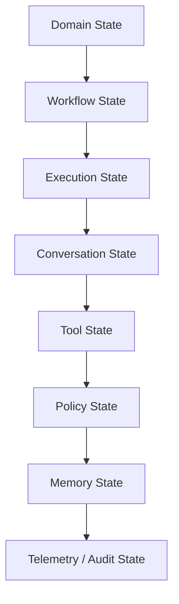

## 4.1 Domain State

Business facts.

Examples:

- case status;
- customer risk level;
- account flags;
- regulatory category;
- document evidence list;
- investigation phase.

Domain state is authoritative and usually owned by the business system, not the agent.

## 4.2 Workflow State

Process position.

Examples:

- current node;
- completed stages;
- pending approval;
- retry count;
- escalation status;
- compensation required.

Workflow state is owned by the orchestrator or workflow runtime.

## 4.3 Execution State

Runtime mechanics.

Examples:

- current run ID;
- active task;
- model call ID;
- tool call status;
- deadline;
- cancellation token;
- budget remaining.

Execution state is owned by the agent runtime.

## 4.4 Conversation State

Interaction history and conversational context.

Examples:

- user messages;
- assistant messages;
- tool call messages;
- user preferences;
- clarifications;
- unresolved questions.

Conversation state is useful, but it is not the whole system.

## 4.5 Tool State

State related to tool calls.

Examples:

- tool request;
- tool response;
- idempotency key;
- side-effect preview;
- approval requirement;
- compensation action.

Tool state is critical when tools mutate external systems.

## 4.6 Policy State

The policy snapshot used during execution.

Examples:

- policy version;
- permission set;
- model allowlist;
- risk classification;
- data access scope;
- approval rules.

Policy state must be recorded because policy can change after a run.

## 4.7 Memory State

Reusable information beyond a single run.

Examples:

- user profile;
- organization facts;
- historical decisions;
- embeddings;
- semantic memories;
- procedural instructions.

Memory must be governed. It is not a free scratchpad.

## 4.8 Telemetry and Audit State

Operational and forensic evidence.

Examples:

- traces;
- spans;
- events;
- cost;
- latency;
- model version;
- prompt version;
- decision rationale;
- human approval.

Audit state is not optional in enterprise systems.

---

# 5. Runtime Lifecycle

A typical stateful runtime lifecycle:

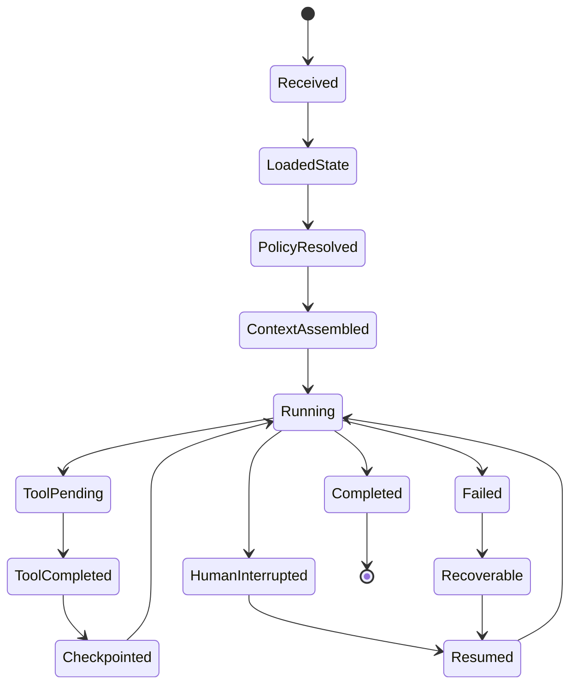

## Step-by-Step

1. Receive input or event.
2. Resolve identity and tenant.
3. Load thread/session.
4. Load latest checkpoint.
5. Resolve policy snapshot.
6. Assemble context.
7. Execute next node/agent.
8. Validate output.
9. Execute tool if allowed.
10. Emit step event.
11. Persist checkpoint.
12. Continue, interrupt, complete, or fail.

The important discipline:

> Never let model reasoning, tool side effects, and state commits blur into one untracked blob.

---

# 6. Data Model Foundation

Below is a minimal vocabulary model.

```python
from __future__ import annotations

from enum import Enum
from typing import Any, Literal
from pydantic import BaseModel, Field


class RunStatus(str, Enum):
    CREATED = "created"
    RUNNING = "running"
    INTERRUPTED = "interrupted"
    COMPLETED = "completed"
    FAILED = "failed"
    CANCELLED = "cancelled"


class StepType(str, Enum):
    MODEL_CALL = "model_call"
    TOOL_CALL = "tool_call"
    VALIDATION = "validation"
    POLICY_CHECK = "policy_check"
    STATE_TRANSITION = "state_transition"
    HUMAN_INTERRUPT = "human_interrupt"
    SYSTEM = "system"


class AgentThread(BaseModel):
    thread_id: str
    tenant_id: str
    user_id: str | None = None
    subject_type: str
    subject_id: str
    created_at: str
    metadata: dict[str, Any] = {}


class AgentRun(BaseModel):
    run_id: str
    thread_id: str
    status: RunStatus
    objective: str
    policy_version: str
    state_schema_version: str
    started_at: str
    completed_at: str | None = None
    failure_reason: str | None = None


class StepEvent(BaseModel):
    event_id: str
    run_id: str
    step_index: int
    step_type: StepType
    name: str
    input_ref: str | None = None
    output_ref: str | None = None
    metadata: dict[str, Any] = {}
    created_at: str
```

The first design principle:

> Store state and events as typed domain objects, not just logs.

---

# 7. Checkpoints

A checkpoint is a persisted snapshot of execution state at a known safe boundary.

A checkpoint should support:

- resume;
- human-in-the-loop;
- debugging;
- time travel;
- retry;
- failure recovery;
- audit;
- state inspection.

```python
class Checkpoint(BaseModel):
    checkpoint_id: str
    run_id: str
    thread_id: str
    step_index: int
    state_schema_version: str
    state_snapshot: dict[str, Any]
    pending_interrupt: dict[str, Any] | None = None
    created_at: str
    checksum: str | None = None
```

## What Should Be in a Checkpoint?

A useful checkpoint includes:

- canonical graph/workflow state;
- current node;
- completed nodes;
- pending tasks;
- approved/rejected interrupts;
- tool call statuses;
- budget remaining;
- retry counters;
- policy snapshot reference;
- memory snapshot references;
- artifact references;
- schema version;
- idempotency keys.

## What Should Not Be in a Checkpoint?

Avoid storing:

- raw secrets;
- large documents;
- entire vector index content;
- unbounded message history;
- transient socket/session objects;
- non-serializable Python objects;
- raw credentials;
- objects that cannot survive deployment/version changes.

Use references for large artifacts.

---

# 8. Snapshot vs Event Log

There are two common persistence models.

## 8.1 Snapshot Model

Store the latest full state.

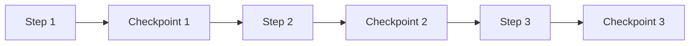

Pros:

- easy resume;
- easy inspect;
- simple implementation.

Cons:

- large state;
- harder audit history;
- harder diff.

## 8.2 Event Log Model

Store every event and reconstruct state.

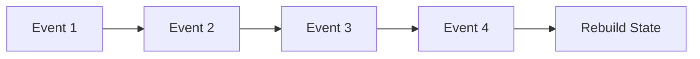

Pros:

- strong auditability;
- append-only;
- replayable;
- easier forensic reconstruction.

Cons:

- replay cost;
- migration complexity;
- requires deterministic reducers.

## 8.3 Hybrid Model

Enterprise systems usually use both:

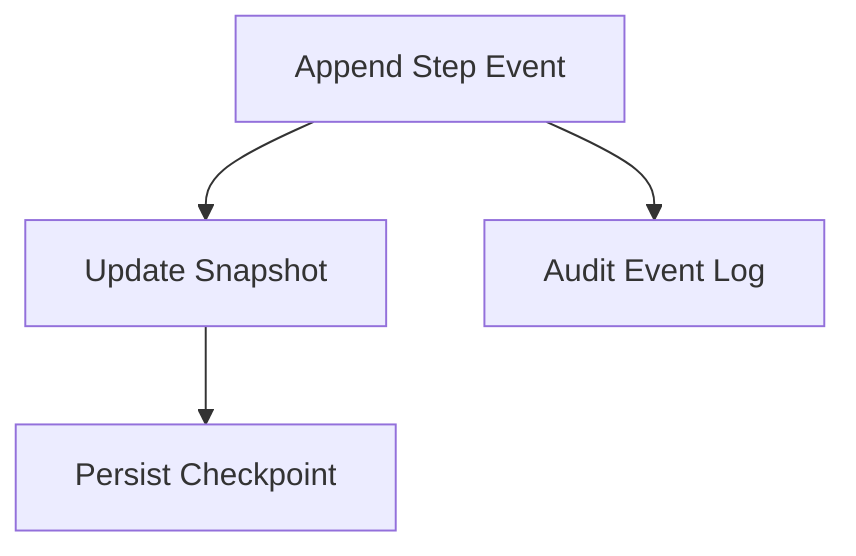

Use event log for audit and checkpoint snapshot for efficient resume.

---

# 9. Checkpoint Boundaries

Not every line of code needs a checkpoint. Save at meaningful boundaries.

Good checkpoint boundaries:

- after model output is validated;
- before a human interrupt;
- after human response;
- before irreversible side effect;
- after side effect commit;
- after graph node completion;
- after compensation;
- when budget/turn limit changes;
- when state transition occurs.

Bad checkpoint boundaries:

- halfway through non-idempotent tool call;
- after mutating external system but before recording it;
- before validation of corrupted output;
- with unserializable runtime objects;
- without schema version.

## The Golden Rule

> A checkpoint should represent a state from which the system can safely continue.

---

# 10. Hydration

Hydration is loading persisted state back into executable runtime objects.

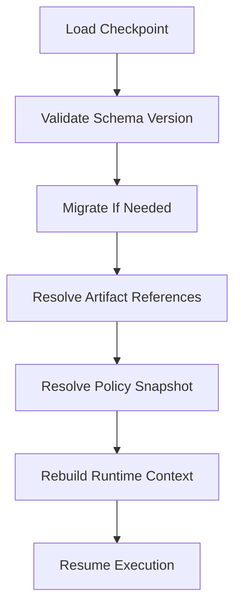

Hydration must handle:

- missing artifacts;
- old schema versions;
- changed tool versions;
- expired permissions;
- unavailable models;
- partially completed side effects;
- human interrupts;
- cancelled runs.

## Hydration Model

```python
class HydratedRun(BaseModel):
    run: AgentRun
    thread: AgentThread
    checkpoint: Checkpoint
    state: dict[str, Any]
    artifacts: dict[str, Any]
    policy_snapshot: dict[str, Any]
```

## Hydration Invariants

1. The checkpoint schema version is known.
2. The state can be validated.
3. Referenced artifacts exist or are marked unavailable.
4. Tool side effects are reconciled.
5. Policy snapshot is resolved as it was during execution.
6. Resume node is explicit.
7. Budget remaining is restored.
8. Pending interrupts are preserved.

Hydration is where many toy systems break.

---

# 11. Resume

Resume is not “run the prompt again.”

Resume means continue from a safe, known, persisted state.

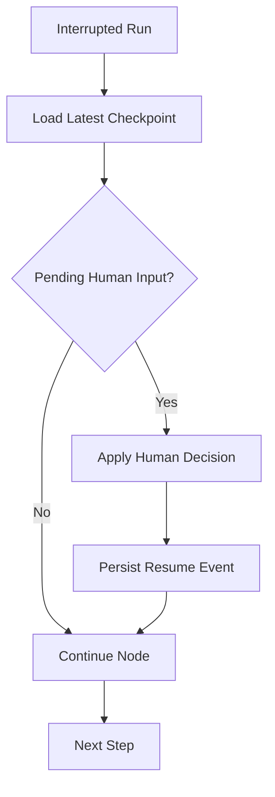

## Resume Cases

| Case | Resume Strategy |
|---|---|
| Model call failed before output | retry model call |
| Output invalid | repair or ask model again |
| Tool call timed out before side effect | retry if idempotent |
| Tool call committed side effect | do not retry blindly |
| Waiting for approval | apply decision then continue |
| Runtime crashed after checkpoint | resume from checkpoint |
| Runtime crashed after side effect before checkpoint | reconcile using idempotency key |

## Resume Invariant

> A resumed run must not duplicate irreversible side effects.

This requires idempotency, side-effect logs, and transaction boundaries.

---

# 12. Human Interrupts

Human-in-the-loop is not a UI popup. It is a runtime state.

```python
class HumanInterrupt(BaseModel):
    interrupt_id: str
    run_id: str
    reason: str
    requested_role: str
    decision_options: list[str]
    decision_package_ref: str
    expires_at: str | None = None


class HumanDecision(BaseModel):
    interrupt_id: str
    reviewer_id: str
    decision: Literal["approve", "reject", "revise", "escalate"]
    comment: str | None = None
    decided_at: str
```

## Interrupt Flow

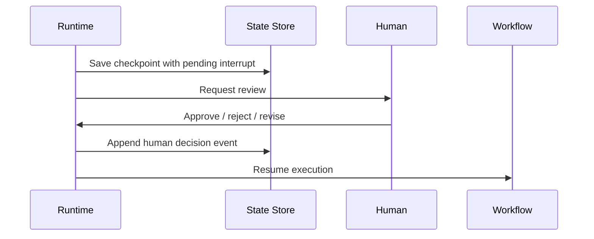

## Human Interrupt Invariants

1. Interrupt has a reason.
2. Required reviewer role is explicit.
3. Decision package is durable.
4. Run is paused, not lost.
5. Decision is recorded immutably.
6. Resume applies the decision deterministically.
7. Timeout/escalation is defined.

---

# 13. Stateful Multi-Agent Runtime

Multi-agent state requires more discipline.

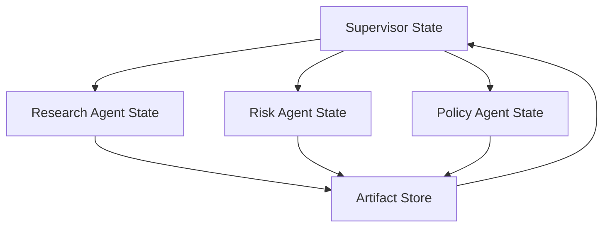

## State Ownership

| State | Owner |
|---|---|
| Final objective | supervisor |
| Specialist task status | supervisor + specialist |
| Specialist intermediate reasoning | specialist/private runtime |
| Finding artifact | artifact store |
| Evidence reference | evidence store |
| Final decision | supervisor/adjudicator/human |
| Side effect status | tool executor/service |

Specialists should not freely mutate canonical state.

## Agent Task State

```python
class AgentTaskStatus(str, Enum):
    PENDING = "pending"
    RUNNING = "running"
    COMPLETED = "completed"
    FAILED = "failed"
    CANCELLED = "cancelled"


class DelegatedAgentTask(BaseModel):
    task_id: str
    run_id: str
    parent_agent: str
    assigned_agent: str
    objective: str
    status: AgentTaskStatus
    input_refs: list[str]
    output_refs: list[str] = []
    max_tool_calls: int
    deadline_ms: int
```

A supervisor runtime can checkpoint after each specialist returns.

---

# 14. Concurrency and State

Stateful systems must control concurrent updates.

Problem:

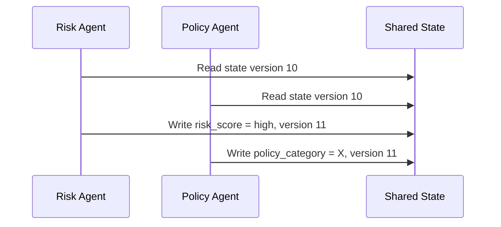

One update can overwrite the other if state versioning is not enforced.

## Optimistic Concurrency

```python
class StateWrite(BaseModel):
    thread_id: str
    expected_version: int
    new_state: dict[str, Any]


class ConcurrencyConflict(Exception):
    pass


async def commit_state(write: StateWrite) -> int:
    """
    Pseudocode:
    UPDATE thread_state
    SET state = :new_state, version = version + 1
    WHERE thread_id = :thread_id AND version = :expected_version
    """
    updated_rows = 1  # from database
    if updated_rows != 1:
        raise ConcurrencyConflict("State version changed.")
    return write.expected_version + 1
```

## Safer Pattern: Append Artifacts

Instead of letting agents overwrite shared state, let them append artifacts.

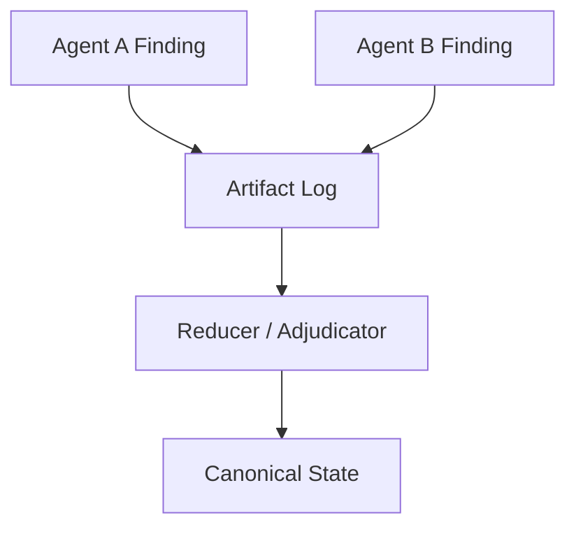

This is often safer for blackboard/supervisor systems.

---

# 15. Idempotency and Side Effects

A checkpoint alone does not prevent duplicate side effects.

Every side-effecting tool call needs an idempotency key.

```python
class ToolCallRecord(BaseModel):
    tool_call_id: str
    run_id: str
    tool_name: str
    idempotency_key: str
    status: Literal["proposed", "approved", "started", "committed", "failed", "compensated"]
    input_hash: str
    output_ref: str | None = None
```

## Side Effect Execution

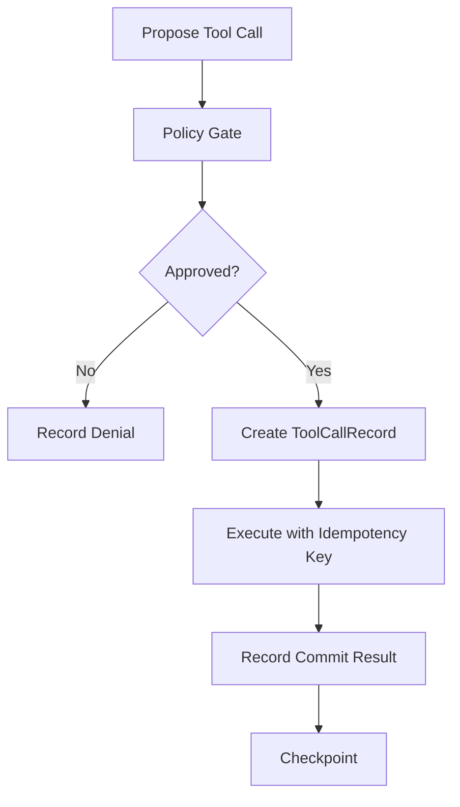

## The Crash Window

The dangerous window:

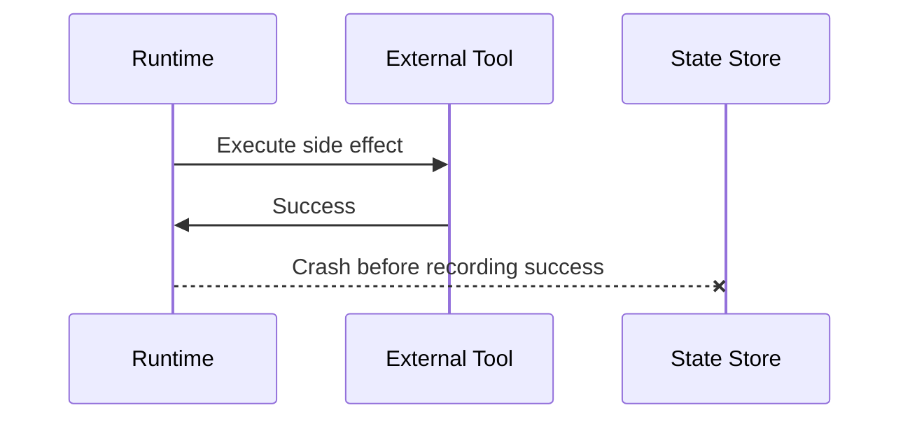

On resume, the runtime must reconcile:

- Did the external action happen?
- Does the tool support idempotency lookup?
- Was the same idempotency key used?
- Should the runtime mark committed, retry, or compensate?

Top engineers design for this window explicitly.

---

# 16. State Schema Versioning

Checkpoints outlive code deployments.

If you persist state, you must version it.

```python
class StateEnvelope(BaseModel):
    schema_name: str
    schema_version: str
    payload: dict[str, Any]
```

## Migration Function

```python
from collections.abc import Callable

Migration = Callable[[dict[str, Any]], dict[str, Any]]


class StateMigrator:
    def __init__(self) -> None:
        self._migrations: dict[tuple[str, str], Migration] = {}

    def register(self, from_version: str, to_version: str, fn: Migration) -> None:
        self._migrations[(from_version, to_version)] = fn

    def migrate(self, payload: dict[str, Any], from_version: str, to_version: str) -> dict[str, Any]:
        key = (from_version, to_version)
        if key not in self._migrations:
            raise ValueError(f"No migration from {from_version} to {to_version}")
        return self._migrations[key](payload)
```

## Schema Versioning Invariants

1. Never persist unversioned state.
2. Never delete a migration needed by active checkpoints.
3. Keep backward compatibility during rolling deployments.
4. Validate migrated state.
5. Record migration events.
6. Avoid storing framework-specific internal objects as canonical state.

---

# 17. Replay and Time Travel

Replay means reconstructing what happened.

Time travel means inspecting or resuming from an earlier checkpoint.

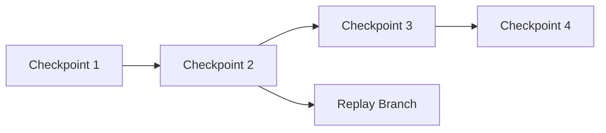

## Replay Requirements

To replay a run, record:

- input events;
- model name/version;
- prompt version;
- tool versions;
- policy version;
- state schema version;
- memory references;
- retrieval index version;
- tool outputs;
- human decisions;
- random/sampling parameters where available.

Replay does not always reproduce exact tokens. But it should reconstruct enough causal evidence for debugging and audit.

## Replay Types

| Type | Purpose |
|---|---|
| Forensic replay | understand what happened |
| Deterministic replay | reproduce workflow transitions |
| Simulation replay | test alternative policy/model |
| Branch replay | resume from old checkpoint |
| Regression replay | verify new version does not break behavior |

---

# 18. Persistence Architecture

A practical enterprise persistence architecture:

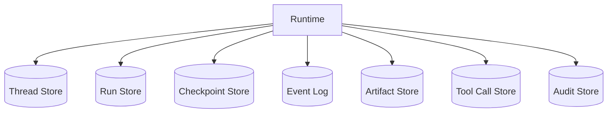

## Storage Choices

| Store | Common Backend |
|---|---|
| Thread/run metadata | PostgreSQL |
| Checkpoints | PostgreSQL, Redis, object store |
| Event log | Kafka, PostgreSQL append table |
| Artifacts | S3/GCS/Azure Blob |
| Vector memory | vector database/search index |
| Audit logs | append-only database/log platform |
| Short-lived locks | Redis/PostgreSQL advisory locks |

Avoid one giant JSON blob for everything. It becomes impossible to operate.

---

# 19. Checkpointer Interface

A minimal checkpointer:

```python
from abc import ABC, abstractmethod


class Checkpointer(ABC):
    @abstractmethod
    async def save(self, checkpoint: Checkpoint) -> None:
        pass

    @abstractmethod
    async def load_latest(self, thread_id: str) -> Checkpoint | None:
        pass

    @abstractmethod
    async def load(self, checkpoint_id: str) -> Checkpoint:
        pass

    @abstractmethod
    async def list_for_thread(self, thread_id: str, limit: int = 50) -> list[Checkpoint]:
        pass
```

A production checkpointer also needs:

- atomic write;
- schema validation;
- encryption;
- retention policy;
- tenant partitioning;
- optimistic concurrency;
- cleanup/archival;
- observability.

---

# 20. Run Manifest

Each run should have a manifest.

```python
class RunManifest(BaseModel):
    run_id: str
    thread_id: str
    tenant_id: str
    objective: str
    runtime_version: str
    orchestrator_version: str
    model_routes: dict[str, str]
    prompt_versions: dict[str, str]
    tool_versions: dict[str, str]
    policy_version: str
    memory_snapshot_refs: list[str]
    state_schema_version: str
    created_at: str
```

The run manifest is essential for:

- incident response;
- compliance audit;
- debugging;
- regression testing;
- cost attribution;
- rollout analysis.

---

# 21. Context Is Reconstructable, Not Authoritative

Do not treat prompt context as the source of truth.

Context should be assembled from authoritative state.

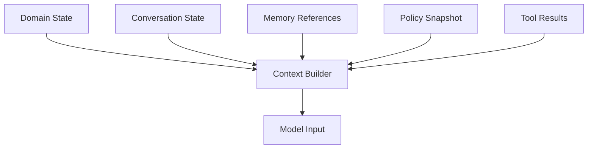

If context assembly changes, old runs may become hard to interpret unless the context version is recorded.

## Context Record

```python
class ContextAssemblyRecord(BaseModel):
    context_id: str
    run_id: str
    builder_version: str
    source_refs: list[str]
    token_count: int
    redactions_applied: list[str]
    created_at: str
```

For sensitive systems, store either the assembled context or a redacted/context-hash record depending on privacy and retention requirements.

---

# 22. Memory vs Checkpoint

Do not confuse memory and checkpoint.

| Aspect | Checkpoint | Memory |
|---|---|---|
| Purpose | resume execution | reuse knowledge |
| Scope | run/thread | user/app/domain |
| Mutability | controlled by runtime | governed by memory policy |
| Audit | high | high if business-critical |
| Used for | recovery | personalization/knowledge |
| Retention | execution lifecycle | policy-based |
| Risk | duplicate side effects if wrong | stale/poisoned context if wrong |

A checkpoint says:

> “Continue this execution from here.”

Memory says:

> “This fact may be useful in future executions.”

They require different governance.

---

# 23. Cancellation and Deadlines

Stateful runs must support cancellation.

Cancellation can come from:

- user request;
- admin kill switch;
- timeout;
- budget exhaustion;
- policy violation;
- deployment shutdown;
- downstream service outage.

## Cancellation State

```python
class CancellationRecord(BaseModel):
    run_id: str
    reason: str
    requested_by: str
    requested_at: str
    safe_to_resume: bool
    compensation_required: bool
```

## Cancellation Invariants

1. Running tasks observe cancellation.
2. Side effects are not left ambiguous.
3. Checkpoint reflects cancellation.
4. Compensation is scheduled if needed.
5. Human reviewers are notified if relevant.
6. Cancelled run is not accidentally resumed.

---

# 24. Long-Running Execution

Enterprise AI tasks can last:

- seconds for classification;
- minutes for research;
- hours for human review;
- days for case processing;
- weeks for investigation support.

Long-running execution requires durable state.

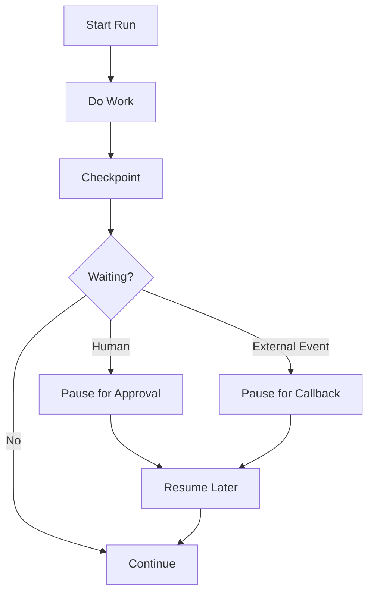

If the process can outlive a worker process, it needs durable execution.

---

# 25. Runtime Failure Modes

| Failure | Description | Mitigation |
|---|---|---|
| Lost state | runtime crash without checkpoint | checkpoint at safe boundaries |
| Duplicate side effect | retry after external commit | idempotency key + reconciliation |
| Corrupt state | invalid model output persisted | validate before commit |
| Stale policy | policy changed mid-run | policy snapshot |
| Lost human approval | approval stored only in UI | durable interrupt record |
| Broken resume | code cannot read old checkpoint | schema version + migration |
| Context drift | prompt rebuilt differently | context assembly version |
| Agent overwrite | parallel agents mutate same state | append artifacts + reducer |
| Memory poisoning | bad fact persisted | memory governance |
| Audit gap | logs lack decision data | append decision events |

---

# 26. Production Checklist

Before shipping a stateful agent runtime, verify:

- [ ] every run has a run ID;
- [ ] every thread/session has a durable ID;
- [ ] every checkpoint has schema version;
- [ ] state is serializable and validated;
- [ ] side-effecting tool calls use idempotency keys;
- [ ] human interrupts are durable;
- [ ] policy version is recorded;
- [ ] prompt/model/tool versions are recorded;
- [ ] old checkpoints can be hydrated;
- [ ] cancellation is safe;
- [ ] retries do not duplicate external actions;
- [ ] telemetry links run, step, tool call, and checkpoint;
- [ ] state store is tenant-isolated;
- [ ] sensitive data is encrypted/redacted;
- [ ] retention policy is defined;
- [ ] replay procedure exists.

---

# 27. Practice Drill

Design a stateful runtime for an AI-assisted enforcement case system.

Requirements:

- case intake starts a thread;
- each case can have multiple runs;
- agents can research evidence;
- high-risk actions require human approval;
- notices cannot be sent twice;
- policy changes must not corrupt old runs;
- analyst can resume after 3 days;
- operations team can inspect failed runs.

Deliverables:

1. define session/thread/run/step/checkpoint schema;
2. define checkpoint boundaries;
3. define side-effect idempotency model;
4. define human interrupt model;
5. define replay metadata;
6. define state migration policy;
7. draw runtime lifecycle;
8. list failure modes.

---

# 28. What Top 1% Engineers Pay Attention To

Top engineers ask:

- Which state is authoritative?
- Which state is derived?
- Which state is reconstructable?
- Which state is unsafe to store?
- What is the resume boundary?
- What happens after worker crash?
- What happens after deployment while runs are paused?
- What happens if a human approves after policy changes?
- What happens if a tool succeeds but runtime crashes?
- What happens if two agents write concurrently?
- Can the system explain why it resumed from a checkpoint?
- Can we safely delete or archive old state?
- Can we replay enough to debug an incident?

This is the difference between a demo and a production system.

---

# 29. Summary

In this part, we covered:

- session/thread/run/turn/step/checkpoint vocabulary;
- runtime state stack;
- lifecycle of stateful execution;
- checkpoint design;
- snapshot vs event log;
- hydration;
- resume;
- human interrupts;
- multi-agent state ownership;
- concurrency control;
- idempotency and side effects;
- schema versioning;
- replay/time travel;
- persistence architecture;
- cancellation;
- long-running execution;
- production checklist.

The next part translates these concepts into **Python runtime architecture**: async orchestration, isolation, backpressure, timeouts, cancellation, and production-safe execution wrappers.

---

## References

- LangGraph documentation: durable execution, persistence, checkpointers, graph state, threads, interrupts, and fault-tolerant execution.
- OpenAI Agents SDK documentation: sessions, handoffs, guardrails, tracing, and tool execution concepts.
- Microsoft Agent Framework documentation: graph-based workflows, checkpointing, human-in-the-loop, telemetry, and multi-agent orchestration.
- Python documentation: asyncio tasks, TaskGroup, timeout, and cancellation behavior.
