# Part 010 — Python Agent Runtime Architecture

> In production, the hard part is not calling an LLM from Python.
>
> The hard part is building a runtime that can coordinate model calls, tools, state, budgets, cancellation, retries, policy, telemetry, and human interrupts without becoming fragile.

This part translates the previous stateful runtime design into Python architecture.

We focus on:

- async orchestration;
- structured concurrency;
- runtime components;
- model/tool isolation;
- backpressure;
- deadlines;
- cancellation;
- rate limiting;
- budget enforcement;
- graceful shutdown;
- worker architecture;
- production safety.

This is not a Python basics part. We assume you already understand Python syntax and general async programming. The focus here is how senior engineers design a Python runtime for enterprise AI agents.

---

## 1. Kaufman Framing

The skill here is:

> Build a Python runtime that can safely execute stateful, multi-step, multi-agent tasks under real production constraints.

The runtime must handle:

- slow model calls;
- flaky tools;
- long-running workflows;
- partial failures;
- parallel specialist agents;
- tenant isolation;
- user cancellation;
- infrastructure shutdown;
- rate limits;
- cost limits;
- telemetry;
- policy enforcement.

### Target Performance

By the end of this part, you should be able to:

- design a Python runtime architecture for stateful agents;
- use structured concurrency instead of uncontrolled background tasks;
- apply deadlines and cancellation correctly;
- isolate tool execution;
- implement backpressure using queues and semaphores;
- prevent runaway model/tool calls;
- design worker shutdown behavior;
- choose where async is appropriate and where durable workflow is needed.

---

# 2. Runtime Architecture Overview

A production-grade Python agent runtime is usually composed of several cooperating components.

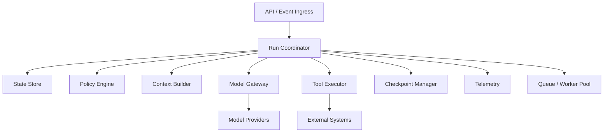

## Component Responsibilities

| Component | Responsibility |
|---|---|
| API/Event ingress | receive user requests, webhooks, jobs |
| Run coordinator | own execution lifecycle |
| State store | persist thread/run/checkpoint state |
| Policy engine | enforce permissions and autonomy |
| Context builder | assemble prompt/model input |
| Model gateway | call model providers safely |
| Tool executor | run tools under policy and isolation |
| Checkpoint manager | save/resume execution state |
| Queue/worker pool | manage background/long-running work |
| Telemetry | traces, metrics, logs, audit events |

A common mistake is putting all of this inside one “agent function.”

That works for a demo, not for an enterprise system.

---

# 3. The Core Runtime Loop

A minimal runtime loop:

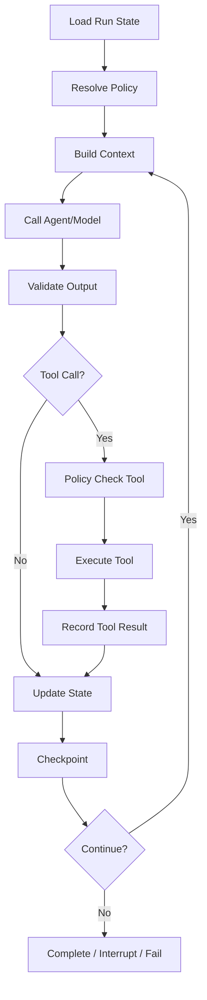

## Python Skeleton

```python
from pydantic import BaseModel


class RuntimeContext(BaseModel):
    run_id: str
    thread_id: str
    tenant_id: str
    deadline_ms: int
    policy_version: str


class RuntimeResult(BaseModel):
    status: str
    output: dict = {}
    next_action: str | None = None


class AgentRuntime:
    async def run(self, context: RuntimeContext) -> RuntimeResult:
        state = await self.load_state(context)
        policy = await self.resolve_policy(context)

        while True:
            context_input = await self.build_context(context, state, policy)
            model_output = await self.call_model(context, context_input)
            validated = await self.validate_output(model_output)

            state = await self.apply_output(context, state, validated)
            await self.checkpoint(context, state)

            if self.should_stop(state):
                return RuntimeResult(status="completed", output=state.get("output", {}))
```

This skeleton is intentionally incomplete. Production architecture adds:

- deadlines;
- cancellation;
- budget tracking;
- tool execution;
- human interrupts;
- telemetry;
- retries;
- policy gates;
- error classification.

---

# 4. Async Is Not Durable Execution

Python async helps with concurrent I/O.

It does not automatically provide:

- durable checkpoints;
- retry after process crash;
- long-running human wait;
- replay;
- distributed scheduling;
- exactly-once side effects.

Do not confuse:

```python
async def run_agent():
    ...
```

with durable workflow execution.

## Async Solves

- concurrent model calls;
- concurrent read-only tools;
- non-blocking HTTP;
- streaming responses;
- bounded parallelism;
- cancellation propagation;
- timeouts.

## Async Does Not Solve Alone

- process crash recovery;
- checkpoint persistence;
- cross-worker coordination;
- human approval after days;
- distributed locks;
- side-effect idempotency;
- schema migration;
- audit retention.

The practical design:

> Use async inside execution steps. Use durable state/checkpoints around execution steps.

---

# 5. Structured Concurrency

Unstructured background tasks are dangerous.

Bad:

```python
asyncio.create_task(do_tool_call())
return "started"
```

If that task fails, who observes it? Who cancels it? Who records it?

Use structured concurrency: tasks are created within a scope, and the scope owns their completion/cancellation.

```python
import asyncio


async def run_specialists(tasks: list[callable]):
    async with asyncio.TaskGroup() as tg:
        for task_fn in tasks:
            tg.create_task(task_fn())
```

With structured concurrency:

- child tasks belong to a parent scope;
- exceptions are propagated;
- cancellation is coordinated;
- runtime can reason about completion.

## Runtime Rule

> No orphan tasks in enterprise agent execution.

Every task should have:

- parent run ID;
- deadline;
- cancellation behavior;
- telemetry span;
- result handling;
- failure policy.

---

# 6. Deadlines and Timeouts

A timeout is local. A deadline is end-to-end.

Bad:

```python
await asyncio.wait_for(call_model(), timeout=30)
```

This gives a local timeout but not necessarily a consistent run-wide deadline.

Better:

```python
import time
from pydantic import BaseModel


class Deadline(BaseModel):
    expires_at_monotonic: float

    @classmethod
    def after_seconds(cls, seconds: float) -> "Deadline":
        return cls(expires_at_monotonic=time.monotonic() + seconds)

    def remaining_seconds(self) -> float:
        return max(0.0, self.expires_at_monotonic - time.monotonic())

    def expired(self) -> bool:
        return self.remaining_seconds() <= 0.0
```

Then pass the deadline through the runtime:

```python
import asyncio


async def call_with_deadline(coro, deadline: Deadline):
    remaining = deadline.remaining_seconds()
    if remaining <= 0:
        raise TimeoutError("Deadline expired before call started.")

    async with asyncio.timeout(remaining):
        return await coro
```

## Timeout Invariants

1. Every external call has a timeout.
2. Every run has a deadline.
3. Child operations cannot exceed parent deadline.
4. Timeout is recorded as a typed failure.
5. Timeout does not imply side effect did not happen.
6. Tool timeout may require reconciliation.

---

# 7. Cancellation

Cancellation is a correctness concern, not just a performance detail.

Cancellation can happen because:

- user cancels;
- admin stops run;
- deadline expires;
- budget exhausted;
- deployment is shutting down;
- parent task failed.

## Cancellation Handling

```python
import asyncio


async def run_node():
    try:
        await do_work()
    except asyncio.CancelledError:
        await cleanup_local_resources()
        raise
```

Do not swallow `CancelledError` unless you fully understand the consequences. In modern Python structured concurrency, cancellation is used internally by constructs such as task groups and timeouts.

## Cancellation Invariants

1. Cleanup local resources.
2. Propagate cancellation.
3. Record cancellation state if the run is durable.
4. Do not mark cancelled work as completed.
5. Reconcile ambiguous side effects.
6. Do not shield arbitrary agent work from cancellation.

---

# 8. Shielding Critical Sections

Sometimes a tiny section must not be interrupted halfway, such as committing a checkpoint after a tool succeeds.

Use shielding sparingly.

```python
async def commit_tool_result_safely(record):
    # Pseudocode: avoid leaving local runtime cancellation
    # in the middle of a commit operation.
    await save_tool_result(record)
    await save_checkpoint(record)
```

In many systems, it is better to make commit operations idempotent and retryable than to rely on shielding.

## Critical Section Rule

Only protect:

- recording side-effect result;
- writing checkpoint;
- releasing distributed lock;
- emitting audit event.

Do not protect:

- long model calls;
- long tool execution;
- arbitrary agent loops.

---

# 9. Fan-Out/Fan-In Specialist Execution

Multi-agent supervisor systems often call several specialists.

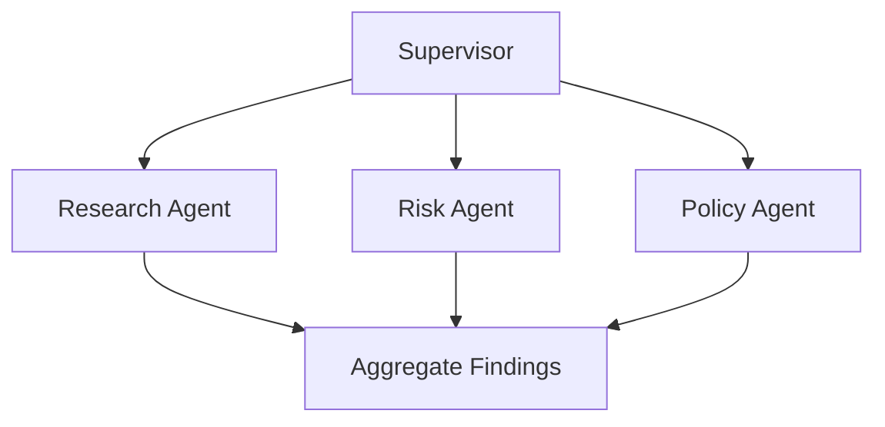

## Bounded Parallelism

```python
import asyncio
from collections.abc import Awaitable, Callable
from typing import TypeVar

T = TypeVar("T")


async def bounded_gather(
    callables: list[Callable[[], Awaitable[T]]],
    *,
    limit: int,
) -> list[T]:
    semaphore = asyncio.Semaphore(limit)

    async def run_one(fn: Callable[[], Awaitable[T]]) -> T:
        async with semaphore:
            return await fn()

    async with asyncio.TaskGroup() as tg:
        tasks = [tg.create_task(run_one(fn)) for fn in callables]

    return [task.result() for task in tasks]
```

Why bounded?

- model APIs have rate limits;
- tools have downstream capacity;
- cost can explode;
- context windows are expensive;
- failures become harder to isolate.

## Fan-Out Invariants

1. Each child task has a task ID.
2. Each child has a budget.
3. Each child has a deadline.
4. Parent aggregates typed outputs.
5. Failures are classified.
6. Partial results are allowed only if explicitly designed.

---

# 10. Backpressure

Backpressure prevents overload from spreading.

Without backpressure:

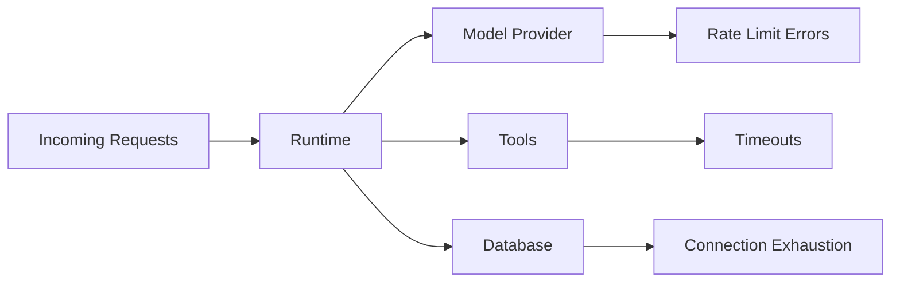

With backpressure:

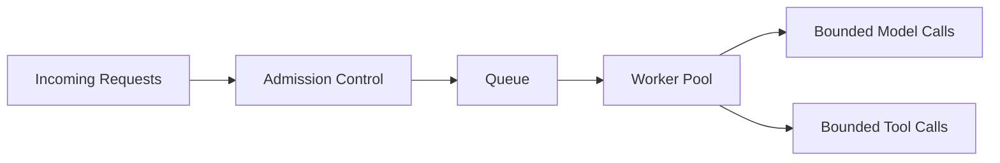

## Backpressure Mechanisms

| Mechanism | Purpose |
|---|---|
| queue limit | cap pending work |
| semaphore | cap concurrent operations |
| rate limiter | respect provider limits |
| circuit breaker | stop calling broken dependency |
| budget | cap cost/tool/model usage |
| admission control | reject/defer before overload |
| priority queue | protect high-value workloads |
| tenant quota | prevent noisy neighbor |

## Queue Example

```python
import asyncio


class RunQueue:
    def __init__(self, max_size: int) -> None:
        self._queue: asyncio.Queue[str] = asyncio.Queue(maxsize=max_size)

    async def submit(self, run_id: str) -> None:
        await self._queue.put(run_id)

    async def get(self) -> str:
        return await self._queue.get()

    def task_done(self) -> None:
        self._queue.task_done()
```

A production queue is usually external: Redis, RabbitMQ, Kafka, SQS, Pub/Sub, or a workflow engine. But the mental model is the same.

---

# 11. Rate Limiting

Model calls and tools need rate limits.

Rate limits should be applied by:

- tenant;
- user;
- agent type;
- tool;
- model provider;
- risk tier;
- environment.

```python
import time
from collections import deque


class SlidingWindowRateLimiter:
    def __init__(self, max_calls: int, window_seconds: float) -> None:
        self.max_calls = max_calls
        self.window_seconds = window_seconds
        self.calls: deque[float] = deque()

    def allow(self) -> bool:
        now = time.monotonic()

        while self.calls and now - self.calls[0] > self.window_seconds:
            self.calls.popleft()

        if len(self.calls) >= self.max_calls:
            return False

        self.calls.append(now)
        return True
```

This in-memory example is only for local understanding. Distributed systems need external/shared rate limiting.

---

# 12. Budget Enforcement

Budgets are runtime controls.

```python
from pydantic import BaseModel, Field


class RuntimeBudget(BaseModel):
    max_model_calls: int = Field(ge=0)
    max_tool_calls: int = Field(ge=0)
    max_tokens: int = Field(ge=0)
    max_cost_usd: float = Field(ge=0.0)


class BudgetState(BaseModel):
    model_calls: int = 0
    tool_calls: int = 0
    tokens_used: int = 0
    cost_usd: float = 0.0


class BudgetExceeded(Exception):
    pass


def enforce_budget(budget: RuntimeBudget, state: BudgetState) -> None:
    if state.model_calls > budget.max_model_calls:
        raise BudgetExceeded("Model call budget exceeded.")
    if state.tool_calls > budget.max_tool_calls:
        raise BudgetExceeded("Tool call budget exceeded.")
    if state.tokens_used > budget.max_tokens:
        raise BudgetExceeded("Token budget exceeded.")
    if state.cost_usd > budget.max_cost_usd:
        raise BudgetExceeded("Cost budget exceeded.")
```

Budgets should be checked before and after operations.

---

# 13. Model Gateway

Do not let every agent call providers directly.

Use a model gateway.

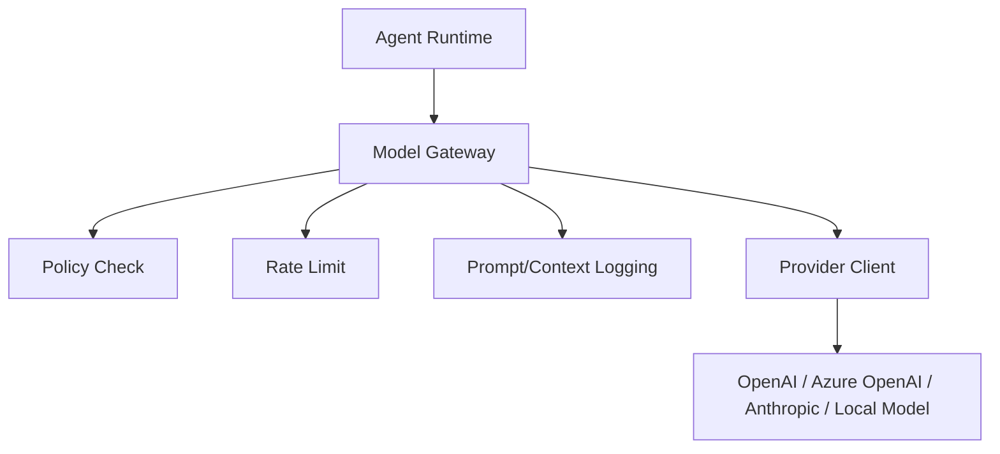

## Model Gateway Responsibilities

- model routing;
- provider abstraction;
- timeout enforcement;
- retry policy;
- rate limiting;
- cost estimation;
- prompt/context audit;
- output validation hooks;
- tracing;
- fallback policy;
- tenant restrictions.

## Model Request Contract

```python
class ModelRequest(BaseModel):
    run_id: str
    agent_name: str
    model_policy: str
    messages: list[dict]
    temperature: float
    max_tokens: int
    response_schema: dict | None = None
    deadline: Deadline


class ModelResponse(BaseModel):
    provider: str
    model: str
    content: str
    input_tokens: int
    output_tokens: int
    cost_usd: float
    raw_response_ref: str | None = None
```

The gateway is where production controls belong.

---

# 14. Tool Executor

Tools are more dangerous than model calls because tools can affect the world.

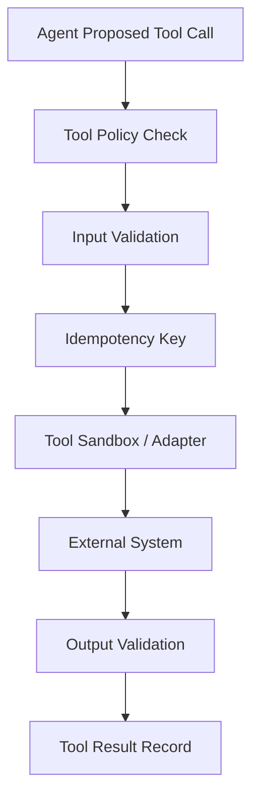

## Tool Executor Responsibilities

- validate tool name;
- validate input schema;
- enforce permissions;
- enforce timeout;
- enforce idempotency;
- isolate secrets;
- redact sensitive output;
- classify side effects;
- record tool result;
- emit telemetry.

## Tool Call Contract

```python
class ToolRequest(BaseModel):
    run_id: str
    tool_call_id: str
    tool_name: str
    input: dict
    idempotency_key: str
    deadline: Deadline


class ToolResult(BaseModel):
    tool_call_id: str
    status: str
    output: dict | None = None
    error_type: str | None = None
    error_message: str | None = None
```

---

# 15. Tool Isolation

Tool isolation means limiting what tool execution can access or affect.

Isolation dimensions:

| Dimension | Examples |
|---|---|
| process | separate process for unsafe code |
| network | egress allowlist |
| filesystem | temp directory, no host secrets |
| credentials | scoped token, no broad API key |
| tenant | tenant-specific access checks |
| time | timeout/deadline |
| memory | resource limits |
| side effects | dry-run/preview before commit |

## Unsafe Tool Example

```python
def run_shell(command: str) -> str:
    ...
```

This is not acceptable as a broad agent tool.

A safer pattern:

```python
class AllowedCommand(BaseModel):
    command_name: str
    args: dict


async def run_allowed_command(request: AllowedCommand) -> dict:
    if request.command_name not in {"render_report", "validate_schema"}:
        raise PermissionError("Command not allowed.")

    # Map command name to safe internal implementation.
    ...
```

Agents should call **business capabilities**, not arbitrary system primitives.

---

# 16. Tenant Isolation

Enterprise runtimes must isolate tenants.

Tenant isolation applies to:

- state store;
- vector memory;
- artifact store;
- tool permissions;
- model policies;
- telemetry;
- rate limits;
- cost attribution;
- human approval queues.

## Tenant Context

```python
class TenantContext(BaseModel):
    tenant_id: str
    user_id: str | None
    roles: list[str]
    data_scopes: list[str]
    policy_version: str
```

Every runtime operation should carry tenant context.

Never rely on prompt instructions for tenant isolation.

---

# 17. Error Taxonomy

Runtime errors should be classified.

| Error Type | Example | Retry? |
|---|---|---|
| validation_error | invalid model JSON | maybe repair |
| policy_denied | forbidden tool | no |
| auth_error | expired token | maybe after refresh |
| rate_limited | provider 429 | yes with backoff |
| timeout | model/tool timeout | maybe |
| transient_dependency | network issue | yes |
| permanent_dependency | invalid request | no |
| budget_exceeded | cost/tool limit | no |
| human_required | approval needed | interrupt |
| cancellation | user/admin stop | no unless resumed |

## Error Model

```python
class RuntimeErrorRecord(BaseModel):
    run_id: str
    step_name: str
    error_type: str
    retryable: bool
    message: str
    metadata: dict = {}
```

Error classification drives recovery.

---

# 18. Retry Policy

Retries must be bounded and contextual.

```python
import random
import asyncio
from collections.abc import Awaitable, Callable
from typing import TypeVar

T = TypeVar("T")


async def retry_async(
    fn: Callable[[], Awaitable[T]],
    *,
    max_attempts: int,
    base_delay: float,
    retryable: Callable[[Exception], bool],
) -> T:
    attempt = 0

    while True:
        try:
            return await fn()
        except Exception as exc:
            attempt += 1
            if attempt >= max_attempts or not retryable(exc):
                raise

            jitter = random.uniform(0, base_delay)
            delay = base_delay * (2 ** (attempt - 1)) + jitter
            await asyncio.sleep(delay)
```

## Retry Rules

1. Retry read-only operations more freely.
2. Retry side-effecting operations only with idempotency.
3. Do not retry policy denials.
4. Do not retry budget exhaustion.
5. Record every retry.
6. Use jitter to avoid thundering herd.
7. Respect parent deadline.

---

# 19. Circuit Breakers

When dependencies fail, stop hammering them.

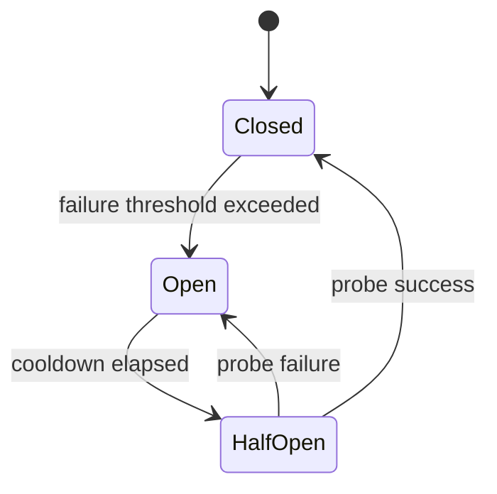

Use circuit breakers for:

- model providers;
- vector stores;
- search APIs;
- ticketing systems;
- email/notification services;
- document processing services.

Circuit breakers protect the system from cascading failure.

---

# 20. Worker Architecture

For long-running agent tasks, use workers.

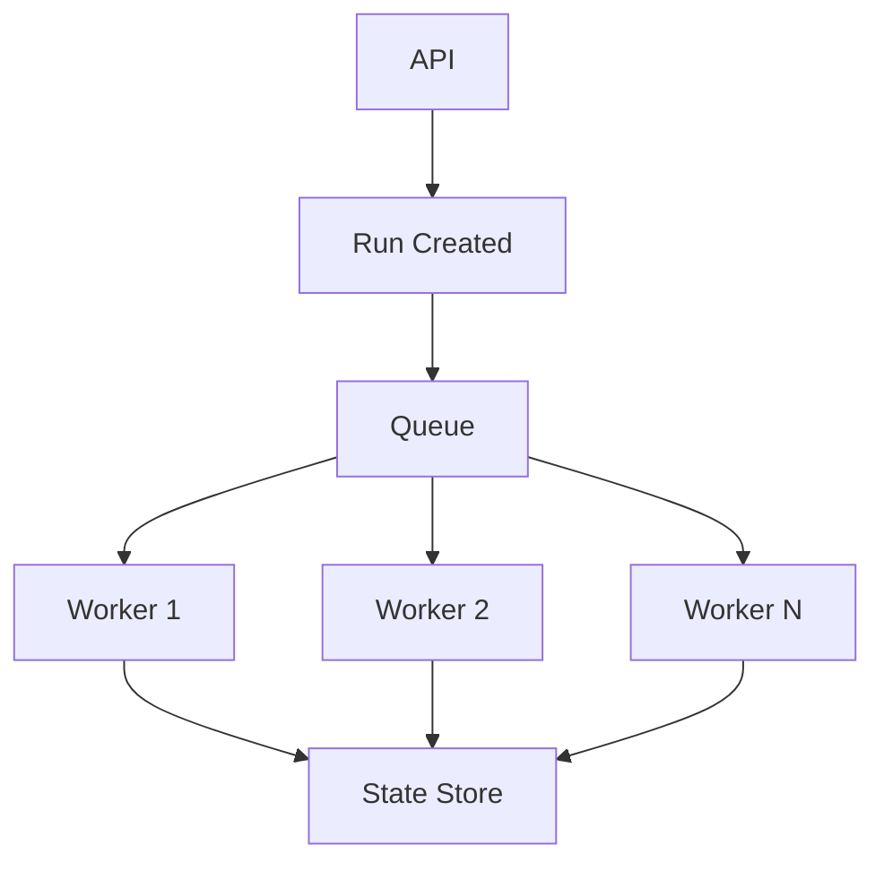

## Worker Responsibilities

- claim run;
- hydrate checkpoint;
- execute until checkpoint/interrupt/completion;
- handle cancellation;
- emit telemetry;
- release claim;
- respect graceful shutdown.

## Worker Claim Model

```python
class RunClaim(BaseModel):
    run_id: str
    worker_id: str
    claimed_until: str
    heartbeat_at: str
```

Use leases, not permanent ownership. If a worker dies, another worker can resume after lease expiry.

---

# 21. Graceful Shutdown

A production runtime must handle deployment shutdown.

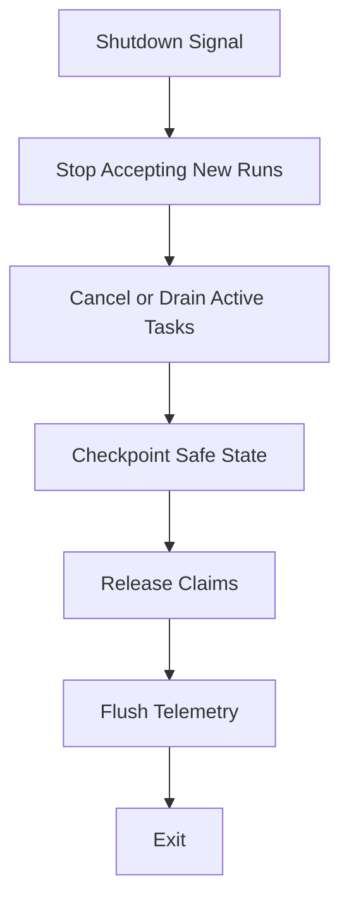

## Shutdown Rules

1. Stop accepting new work.
2. Continue short safe work if within grace period.
3. Cancel long work safely.
4. Checkpoint interrupted state.
5. Release worker leases.
6. Flush telemetry.
7. Do not start side effects during shutdown.

---

# 22. Streaming

Streaming improves user experience but complicates state.

Streaming output should be treated as provisional until committed.

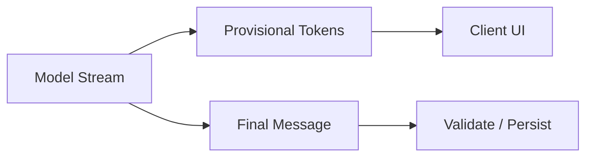

## Streaming Invariants

- partial tokens are not final state;
- final output must still be validated;
- tool calls must be structured;
- stream cancellation must be handled;
- committed state should reflect final validated output.

Do not update authoritative business state from partial tokens.

---

# 23. Observability

Every runtime operation needs telemetry.

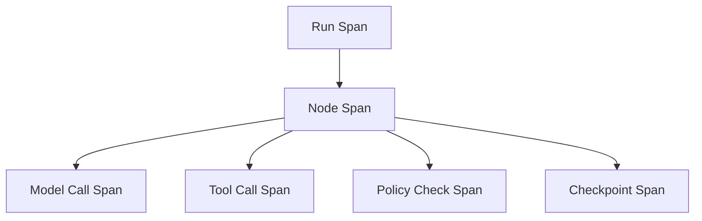

## Runtime Telemetry Fields

| Field | Purpose |
|---|---|
| run_id | correlate execution |
| thread_id | correlate session/task |
| tenant_id | isolate/account |
| agent_name | identify actor |
| node_name | identify workflow step |
| model | cost/performance tracking |
| tool_name | dependency tracking |
| policy_version | audit |
| prompt_version | behavior regression |
| checkpoint_id | recovery |
| cost_usd | cost control |
| latency_ms | performance |
| error_type | reliability |

Telemetry should connect operational data and audit data without leaking sensitive content unnecessarily.

---

# 24. Security Boundaries

Runtime security boundaries:

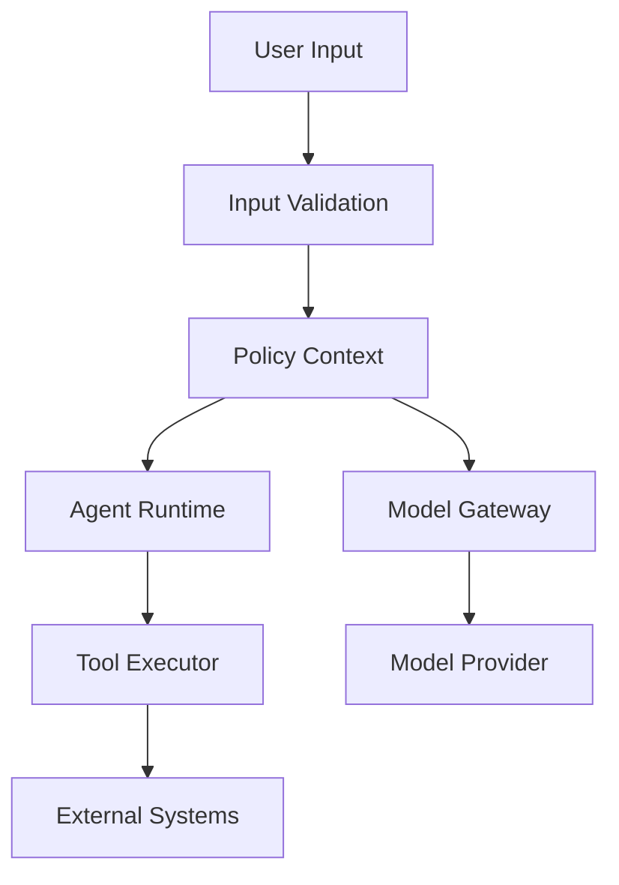

Protect:

- tenant data;
- secrets;
- credentials;
- tool permissions;
- memory writes;
- external side effects;
- prompt/context injection;
- logs/traces.

A runtime should assume user and retrieved content can be hostile.

---

# 25. Choosing In-Process vs External Workflow Engine

You can implement orchestration in Python directly, but sometimes you need a workflow engine.

| Requirement | In-Process Python | External Durable Workflow |
|---|---:|---:|
| simple request/response | good | overkill |
| short async calls | good | optional |
| human wait for days | weak | strong |
| crash recovery | requires custom work | strong |
| distributed workers | custom | strong |
| replay semantics | custom | strong |
| high auditability | possible | strong if designed |
| complex compensation | custom | strong |

A common enterprise pattern:

- use Python async runtime for execution nodes;
- use durable workflow/checkpointing for long-lived process state;
- use queues/workers for scale;
- use state store/event log for audit.

---

# 26. Reference Runtime Layout

A practical Python package layout:

```text
agent_runtime/
  api/
    routes.py
    schemas.py
  runtime/
    coordinator.py
    deadlines.py
    cancellation.py
    budget.py
    errors.py
  orchestration/
    graph.py
    supervisor.py
    transitions.py
  state/
    models.py
    checkpointer.py
    event_log.py
    migrations.py
  model_gateway/
    client.py
    routing.py
    usage.py
  tools/
    registry.py
    executor.py
    policies.py
    schemas.py
  policy/
    engine.py
    autonomy.py
    permissions.py
  telemetry/
    tracing.py
    metrics.py
    audit.py
  workers/
    runner.py
    leases.py
    shutdown.py
  tests/
    unit/
    integration/
    simulations/
```

This structure keeps concerns separated.

---

# 27. End-to-End Execution Example

```python
class RunCoordinator:
    def __init__(
        self,
        *,
        checkpointer,
        model_gateway,
        tool_executor,
        policy_engine,
        telemetry,
    ) -> None:
        self.checkpointer = checkpointer
        self.model_gateway = model_gateway
        self.tool_executor = tool_executor
        self.policy_engine = policy_engine
        self.telemetry = telemetry

    async def execute(self, context: RuntimeContext) -> RuntimeResult:
        checkpoint = await self.checkpointer.load_latest(context.thread_id)
        state = checkpoint.state_snapshot if checkpoint else {}

        deadline = Deadline.after_seconds(context.deadline_ms / 1000)

        while not deadline.expired():
            policy = await self.policy_engine.resolve(context)
            model_request = await self.build_model_request(context, state, policy, deadline)
            model_response = await self.model_gateway.call(model_request)

            action = await self.parse_action(model_response)

            if action["type"] == "tool":
                await self.policy_engine.check_tool(context, action)
                tool_result = await self.tool_executor.execute(context, action, deadline)
                state = await self.apply_tool_result(state, tool_result)
            elif action["type"] == "final":
                state["output"] = action["output"]
                await self.checkpointer.save_from_state(context, state)
                return RuntimeResult(status="completed", output=action["output"])
            elif action["type"] == "human_interrupt":
                state["pending_interrupt"] = action["interrupt"]
                await self.checkpointer.save_from_state(context, state)
                return RuntimeResult(status="interrupted")

            await self.checkpointer.save_from_state(context, state)

        return RuntimeResult(status="failed", output={"reason": "deadline_expired"})
```

This is still simplified, but it shows the separation:

- coordinator owns lifecycle;
- model gateway owns model calls;
- tool executor owns tools;
- policy engine owns authority;
- checkpointer owns durable state.

---

# 28. Runtime Failure Modes

| Failure | Cause | Mitigation |
|---|---|---|
| orphan task | `create_task` without ownership | structured concurrency |
| runaway agent | no turn/tool budget | budget enforcement |
| provider overload | unbounded parallel calls | semaphore/rate limiter |
| duplicate side effect | retry without idempotency | idempotency key |
| stuck worker | no lease/heartbeat | worker leases |
| cancellation swallowed | bad exception handling | propagate `CancelledError` |
| context leak | missing tenant isolation | tenant context everywhere |
| tool abuse | broad tool permissions | tool policy executor |
| hidden cost explosion | no usage tracking | model gateway budget |
| shutdown corruption | no graceful shutdown | checkpoint before exit |
| audit gap | logs only raw text | structured events/traces |

---

# 29. Production Checklist

Before shipping a Python agent runtime:

- [ ] no orphan background tasks;
- [ ] every run has deadline and budget;
- [ ] every model call has timeout;
- [ ] every tool call has timeout;
- [ ] side-effecting tools use idempotency;
- [ ] cancellation is propagated;
- [ ] graceful shutdown is tested;
- [ ] worker leases recover after crash;
- [ ] backpressure is enforced;
- [ ] model calls are routed through gateway;
- [ ] tools are routed through executor;
- [ ] policy checks are outside prompts;
- [ ] telemetry includes run/thread/tenant IDs;
- [ ] checkpointing occurs at safe boundaries;
- [ ] tenant isolation is enforced in code;
- [ ] retry policies classify errors;
- [ ] rate limits exist per provider/tenant;
- [ ] budget exhaustion stops execution;
- [ ] human interrupts are durable.

---

# 30. Practice Drill

Build a minimal runtime prototype.

Requirements:

1. create a run;
2. execute a fake model call;
3. execute a fake tool call;
4. enforce max tool calls;
5. checkpoint after each step;
6. support cancellation;
7. simulate worker crash;
8. resume from checkpoint;
9. avoid duplicate tool result;
10. emit structured events.

Suggested components:

- `RunCoordinator`
- `Checkpointer`
- `EventLog`
- `ModelGateway`
- `ToolExecutor`
- `PolicyEngine`
- `BudgetTracker`
- `Deadline`
- `Worker`

The goal is not building a framework. The goal is learning the control points.

---

# 31. What Top 1% Engineers Pay Attention To

Top engineers ask:

- What happens under load?
- What happens under cancellation?
- What happens if the model provider slows down?
- What happens if a tool hangs?
- What happens if one specialist fails?
- What happens if the process crashes after side effect?
- What happens during deployment shutdown?
- What happens if tenant A floods the system?
- What happens if budget is exhausted mid-run?
- What happens if telemetry fails?
- What happens if a queued run resumes with old code?
- What happens if a task is cancelled during checkpoint?

They do not treat async as magic. They treat it as a concurrency model with failure semantics.

---

# 32. Summary

In this part, we covered:

- runtime component architecture;
- core runtime loop;
- async vs durable execution;
- structured concurrency;
- deadlines;
- timeouts;
- cancellation;
- bounded fan-out/fan-in;
- backpressure;
- rate limiting;
- budget enforcement;
- model gateway;
- tool executor;
- tool isolation;
- tenant isolation;
- error taxonomy;
- retry policy;
- circuit breakers;
- worker architecture;
- graceful shutdown;
- streaming;
- observability;
- security boundaries;
- workflow engine trade-offs;
- production checklist.

The next part will go deeper into **domain state, conversation state, and execution state**, because many agent systems fail by mixing them together.

---

## References

- Python documentation: asyncio tasks, TaskGroup, timeout, and cancellation.
- LangGraph documentation: durable execution, persistence, checkpoints, interrupts, and stateful agents.
- OpenAI Agents SDK documentation: sessions, tools, handoffs, guardrails, and tracing.
- Microsoft Agent Framework documentation: workflows, checkpointing, multi-agent orchestration, and telemetry.
- OpenTelemetry documentation: traces, metrics, logs, context propagation.
