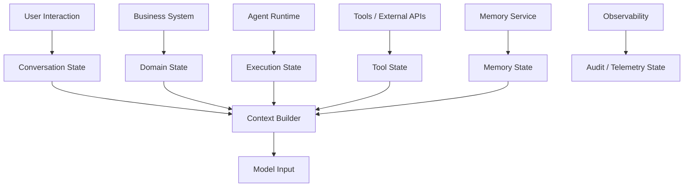
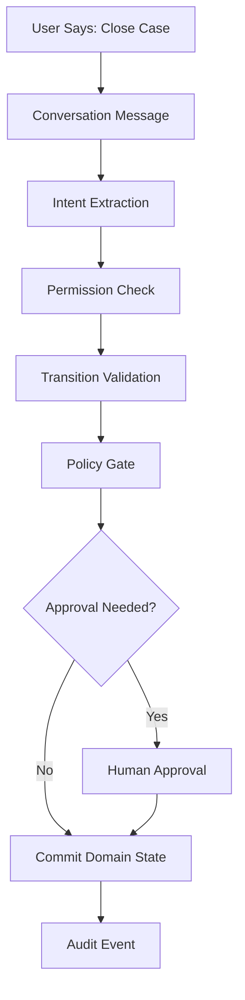
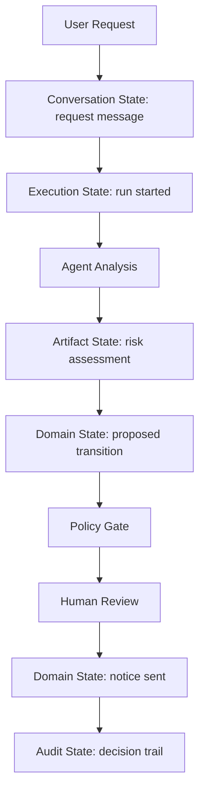
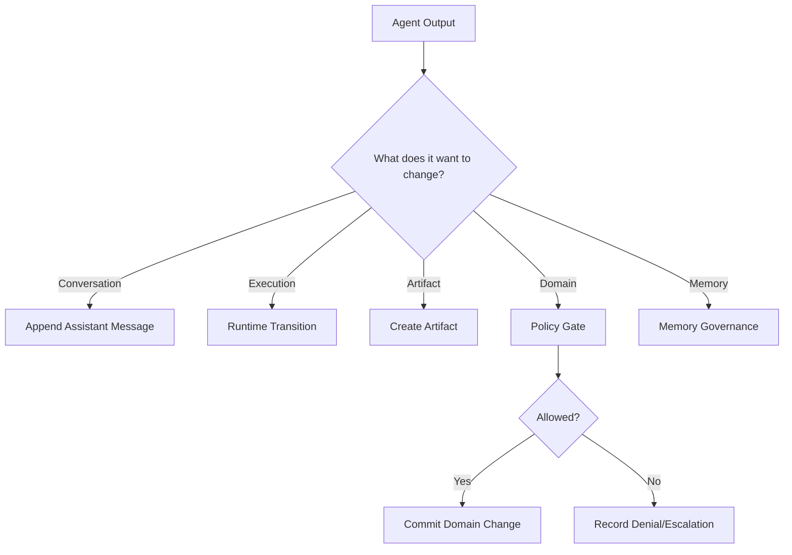
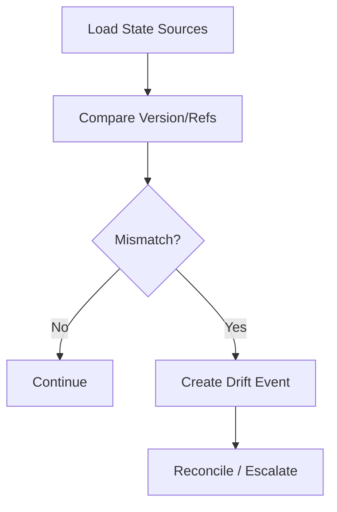
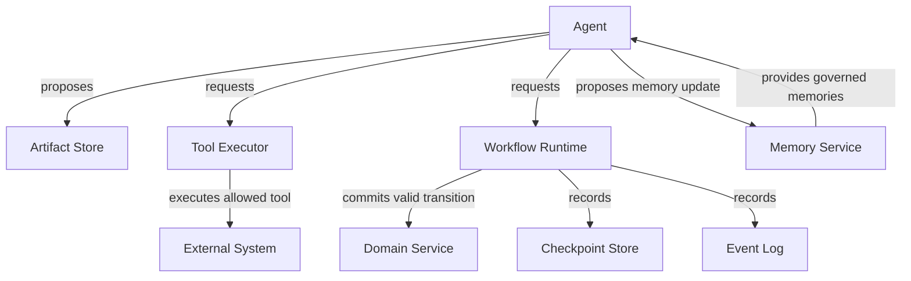
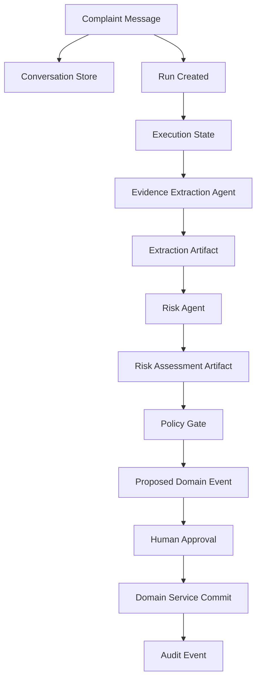

# Part 011 — Domain State vs Conversation State vs Execution State

> Most broken stateful agent systems have the same architectural smell:
>
> they treat chat history as the source of truth.

A conversation is not a database.

A transcript is not a workflow state.

A tool result is not automatically a domain fact.

A model-generated summary is not automatically evidence.

An agent recommendation is not automatically a business decision.

This part separates three state categories that are often mixed together:

1. **domain state**
2. **conversation state**
3. **execution state**

The distinction sounds simple, but it is one of the most important mental models for building enterprise-grade stateful multi-agent AI systems.

---

## 1. Kaufman Framing

Using Kaufman's framework, we deconstruct “stateful AI system design” into smaller skills:

- identify state type;
- identify owner;
- identify source of truth;
- define mutation authority;
- define validation rule;
- define retention policy;
- define replay/audit requirement;
- define whether an agent may read, propose, or mutate it.

### Target Performance

By the end of this part, you should be able to:

- distinguish domain, conversation, execution, memory, artifact, and audit state;
- design a state ownership matrix;
- prevent agents from mutating authoritative state without policy gates;
- avoid treating transcripts as canonical business facts;
- design state transitions using events and reducers;
- handle state drift between conversation and domain systems;
- decide what belongs in checkpoint, memory, event log, artifact store, and domain database.

---

# 2. The Core Distinction



The model sees context assembled from multiple state sources. But context is a **view**, not the source of truth.

## Quick Definition

| State Type | Meaning | Example | Source of Truth |
|---|---|---|---|
| Domain state | business facts and lifecycle | case status, account status, risk tier | business database/service |
| Conversation state | interaction history | user messages, assistant replies | chat/session store |
| Execution state | runtime progress | current node, retry count, checkpoint | runtime/checkpointer |
| Tool state | tool request/result/side effect | email draft created, payment reserved | tool executor + external system |
| Memory state | reusable knowledge | user preference, prior decision pattern | memory service |
| Artifact state | produced durable work product | brief, evidence summary, draft notice | artifact store |
| Audit state | forensic record | who approved, policy version, trace | append-only audit/event log |

The mistake is letting one layer silently impersonate another.

---

# 3. Domain State

Domain state is the business reality.

Examples:

- `case.status = "UNDER_REVIEW"`
- `customer.kyc_status = "VERIFIED"`
- `account.freeze_status = "ACTIVE"`
- `complaint.severity = "HIGH"`
- `notice.sent_at = "2026-06-29T10:12:00Z"`
- `investigation.phase = "EVIDENCE_COLLECTION"`

Domain state answers:

> What is true in the business system?

## Domain State Characteristics

| Characteristic | Meaning |
|---|---|
| authoritative | other systems depend on it |
| lifecycle-bound | follows domain state machine |
| permissioned | only certain actors can mutate |
| audited | changes require traceability |
| durable | survives conversations and runs |
| policy-constrained | mutation depends on rules |
| externally meaningful | may affect users, customers, regulators, or money |

## Example Domain Model

```python
from enum import Enum
from pydantic import BaseModel, Field


class CaseStatus(str, Enum):
    NEW = "new"
    TRIAGED = "triaged"
    UNDER_REVIEW = "under_review"
    WAITING_FOR_EVIDENCE = "waiting_for_evidence"
    READY_FOR_DECISION = "ready_for_decision"
    DECIDED = "decided"
    CLOSED = "closed"


class RiskLevel(str, Enum):
    LOW = "low"
    MEDIUM = "medium"
    HIGH = "high"
    CRITICAL = "critical"


class RegulatoryCase(BaseModel):
    case_id: str
    tenant_id: str
    status: CaseStatus
    risk_level: RiskLevel | None = None
    assigned_team: str | None = None
    evidence_refs: list[str] = Field(default_factory=list)
    version: int
```

## Domain Mutation Rule

An agent should not casually mutate this object.

Bad:

```python
case.status = CaseStatus.CLOSED  # from model recommendation
```

Better:

```python
class ProposedCaseTransition(BaseModel):
    case_id: str
    from_status: CaseStatus
    to_status: CaseStatus
    proposed_by: str
    rationale: str
    evidence_refs: list[str]
    requires_human_approval: bool
```

Then a deterministic workflow/policy layer decides whether the transition is valid.

---

# 4. Conversation State

Conversation state is interaction history.

Examples:

- user asked a question;
- assistant answered;
- user clarified;
- tool call was displayed;
- assistant asked for approval;
- user approved in chat.

Conversation state answers:

> What was said during the interaction?

## Conversation State Characteristics

| Characteristic | Meaning |
|---|---|
| user-facing | reflects interaction |
| chronological | ordered messages/turns |
| contextual | useful for model input |
| lossy | may omit hidden system events |
| ambiguous | natural language can be unclear |
| not authoritative | cannot replace domain state |
| retention-sensitive | may contain private data |

## Conversation Model

```python
from typing import Literal
from pydantic import BaseModel


class ConversationMessage(BaseModel):
    message_id: str
    thread_id: str
    role: Literal["user", "assistant", "tool", "system"]
    content: str
    created_at: str
    metadata: dict = {}
```

## Why Conversation State Is Not Domain State

A user can say:

> “Please close the case.”

That does not mean the case is closed.

The conversation contains an **intent**. Domain state changes only after:

1. identity check;
2. permission check;
3. state transition validation;
4. policy evaluation;
5. possible human approval;
6. commit to domain system;
7. audit event.



The transcript is evidence that a user requested something. It is not proof the action happened.

---

# 5. Execution State

Execution state is runtime progress.

Examples:

- current graph node;
- completed steps;
- pending tool call;
- retry count;
- budget consumed;
- pending human interrupt;
- latest checkpoint ID;
- cancellation status;
- active worker lease.

Execution state answers:

> Where is the runtime in the process?

## Execution State Characteristics

| Characteristic | Meaning |
|---|---|
| runtime-owned | managed by orchestrator |
| checkpointed | used for resume |
| operational | controls execution |
| versioned | must survive deployments |
| failure-sensitive | incorrect state causes duplicate or lost work |
| not user-facing by default | may be exposed through admin/ops UI |

## Execution State Model

```python
class ExecutionPhase(str, Enum):
    STARTED = "started"
    CLASSIFYING = "classifying"
    RESEARCHING = "researching"
    WAITING_FOR_APPROVAL = "waiting_for_approval"
    COMMITTING = "committing"
    COMPLETED = "completed"
    FAILED = "failed"


class AgentExecutionState(BaseModel):
    run_id: str
    thread_id: str
    phase: ExecutionPhase
    current_node: str
    completed_nodes: list[str] = Field(default_factory=list)
    retry_counts: dict[str, int] = Field(default_factory=dict)
    budget_remaining: dict[str, int | float] = Field(default_factory=dict)
    pending_interrupt_id: str | None = None
    checkpoint_id: str | None = None
    state_version: int
```

Execution state is not the same as domain state. A run can fail while the domain case remains unchanged.

---

# 6. Three States in One Example

Suppose a user asks:

> “Analyze this complaint and send a notice if it looks serious.”

The system should separate state carefully.



## What Belongs Where?

| Data | State Type |
|---|---|
| user request text | conversation state |
| current workflow node | execution state |
| extracted allegation summary | artifact state |
| severity recommendation | artifact/proposed domain change |
| actual case status | domain state |
| notice draft | artifact state |
| approval decision | audit + execution + maybe domain state |
| notice sent timestamp | domain state + tool state |
| model/tool latency | telemetry state |

This separation prevents accidental authority transfer from model output to business reality.

---

# 7. Source of Truth Matrix

Every state field needs a source of truth.

| Information | Source of Truth | Agent Authority |
|---|---|---|
| case status | case management service | may recommend transition |
| customer identity | identity service | may not decide |
| user request text | conversation store | may interpret |
| current workflow node | orchestrator | may not override |
| evidence document | document store | may summarize |
| risk rationale | artifact store | may produce |
| risk level | policy/workflow/domain service | may propose |
| approval decision | human review service | may request |
| tool execution result | tool executor/external system | may observe |
| memory fact | memory service | may propose update |
| audit trail | audit/event log | may not mutate |

A good architecture makes this matrix explicit.

---

# 8. Mutation Authority

State mutation is an authority question.



## Mutation Authority Table

| State Type | Who Can Mutate? | Agent Role |
|---|---|---|
| conversation | conversation service/runtime | produce assistant message |
| execution | orchestrator | request next action |
| domain | business service/workflow | propose, rarely mutate directly |
| tool | tool executor | propose tool call |
| memory | memory service with policy | propose memory update |
| artifact | artifact service | create draft/finding |
| audit | audit logger only | generate metadata, not mutate |

## Design Rule

> Agents produce proposals and artifacts. Authoritative services commit state.

---

# 9. State Transition Events

A robust design uses events to move between states.

```python
class DomainEvent(BaseModel):
    event_id: str
    tenant_id: str
    aggregate_type: str
    aggregate_id: str
    event_type: str
    event_version: str
    payload: dict
    caused_by_run_id: str | None = None
    caused_by_user_id: str | None = None
    policy_version: str | None = None
    created_at: str
```

Example event:

```python
case_transition_proposed = DomainEvent(
    event_id="evt_001",
    tenant_id="tenant_a",
    aggregate_type="regulatory_case",
    aggregate_id="case_123",
    event_type="case.transition_proposed",
    event_version="1.0",
    payload={
        "from_status": "under_review",
        "to_status": "ready_for_decision",
        "rationale": "Evidence appears complete.",
        "evidence_refs": ["doc_1", "doc_2"],
        "proposed_by": "risk-agent",
    },
    caused_by_run_id="run_456",
    caused_by_user_id=None,
    policy_version="policy_2026_06",
    created_at="2026-06-29T10:00:00Z",
)
```

Events give you:

- traceability;
- replay;
- debugging;
- audit;
- integration with downstream systems;
- separation between proposal and commit.

---

# 10. Reducers

A reducer applies events to state.

```python
def reduce_case_state(case: RegulatoryCase, event: DomainEvent) -> RegulatoryCase:
    if event.event_type == "case.risk_level_updated":
        return case.model_copy(
            update={
                "risk_level": event.payload["risk_level"],
                "version": case.version + 1,
            }
        )

    if event.event_type == "case.status_changed":
        return case.model_copy(
            update={
                "status": event.payload["to_status"],
                "version": case.version + 1,
            }
        )

    return case
```

Reducers should be deterministic.

The agent may generate event proposals. The reducer enforces valid state change.

---

# 11. State Drift

State drift happens when different layers disagree.

Examples:

| Drift | Example |
|---|---|
| conversation-domain drift | assistant says case is closed, but domain state is open |
| execution-domain drift | runtime thinks notice sent, but domain system has no notice |
| memory-domain drift | memory says user is premium, billing says not premium |
| artifact-domain drift | risk report says high risk, case risk field is medium |
| policy-runtime drift | runtime used old permission model |

## Drift Detection



## Drift Controls

- include version numbers;
- store source references;
- avoid copying domain facts into memory without expiry;
- regenerate summaries from authoritative sources;
- record domain state version used by agent;
- validate before commit;
- reconcile tool side effects.

---

# 12. Context Assembly

Context is a projection.

```python
class ContextSourceRef(BaseModel):
    source_type: str
    source_id: str
    version: str | None = None
    relevance: float | None = None


class AssembledContext(BaseModel):
    context_id: str
    run_id: str
    builder_version: str
    source_refs: list[ContextSourceRef]
    messages: list[dict]
    token_count: int
```

The context builder may include:

- recent conversation;
- domain state snapshot;
- artifact summaries;
- memory snippets;
- tool results;
- policy instructions;
- output schema;
- agent role.

But the model should not confuse context with authority.

## Context Builder Rule

> Context may inform reasoning. It must not grant permissions.

A malicious document retrieved into context must not be able to grant itself tool access.

---

# 13. Prompt-State Anti-Pattern

Bad:

```text
System prompt:
The case is approved. You may send the notice.
```

Why bad?

- no source reference;
- no policy version;
- no approval event;
- no domain state version;
- no audit trail;
- prompt injection can imitate authority.

Better:

```python
class ApprovalState(BaseModel):
    approved: bool
    approval_id: str
    reviewer_id: str
    approved_action: str
    policy_version: str
    created_at: str
```

Then the tool executor verifies this approval state outside the prompt.

---

# 14. Tool State

Tool calls have their own state because tools may produce side effects.

```python
class ToolEffectType(str, Enum):
    READ_ONLY = "read_only"
    DRAFT = "draft"
    INTERNAL_MUTATION = "internal_mutation"
    EXTERNAL_NOTIFICATION = "external_notification"
    IRREVERSIBLE = "irreversible"


class ToolCallState(BaseModel):
    tool_call_id: str
    run_id: str
    tool_name: str
    effect_type: ToolEffectType
    idempotency_key: str
    status: str
    request_payload_ref: str | None = None
    response_payload_ref: str | None = None
    external_reference_id: str | None = None
```

Tool state should record:

- proposed call;
- policy decision;
- approval decision if needed;
- execution attempt;
- result;
- external reference;
- compensation status.

---

# 15. Artifact State

Artifacts are durable outputs.

Examples:

- evidence summary;
- risk assessment;
- legal/regulatory mapping;
- draft email;
- decision package;
- analyst brief;
- test report;
- code patch proposal.

```python
class Artifact(BaseModel):
    artifact_id: str
    tenant_id: str
    artifact_type: str
    produced_by: str
    run_id: str
    source_refs: list[str]
    content_ref: str
    content_hash: str
    schema_version: str
    created_at: str
```

Artifacts are safer than directly mutating domain state.

An agent can create a `risk_assessment` artifact. A workflow can later decide whether to update `case.risk_level`.

---

# 16. Memory State

Memory is cross-run reusable knowledge.

Examples:

- user prefers concise answers;
- analyst uses a specific report format;
- organization policy document is relevant;
- previous case had similar pattern;
- tool usage guidance.

Memory must have governance:

```python
class MemoryRecord(BaseModel):
    memory_id: str
    tenant_id: str
    subject_type: str
    subject_id: str
    memory_type: str
    content: str
    source_refs: list[str]
    confidence: float
    expires_at: str | None = None
    created_by: str
    created_at: str
```

## Memory Rules

1. Memory should have source references.
2. Memory should expire if facts can change.
3. Sensitive memory should be access-controlled.
4. Agents may propose memory, not freely write it.
5. Memory should not override authoritative domain state.

---

# 17. Audit State

Audit state answers:

> What happened, who/what caused it, under which policy, and with what evidence?

```python
class AuditEvent(BaseModel):
    audit_id: str
    tenant_id: str
    actor_type: str
    actor_id: str
    action: str
    target_type: str
    target_id: str
    run_id: str | None = None
    policy_version: str | None = None
    decision: str | None = None
    evidence_refs: list[str] = []
    created_at: str
```

Audit state is append-only. Agents do not edit audit state.

---

# 18. State Ownership Diagram



This diagram encodes authority.

---

# 19. Multi-Agent State Rules

In a multi-agent system:

1. Specialists should not overwrite shared state.
2. Specialists should produce artifacts/findings.
3. Supervisor/adjudicator integrates artifacts.
4. Shared state mutations require a reducer.
5. Conflicts become explicit dispute artifacts.
6. Final domain changes go through policy/workflow gates.

## Example

```python
class SpecialistFinding(BaseModel):
    finding_id: str
    agent_name: str
    finding_type: str
    summary: str
    evidence_refs: list[str]
    confidence: float
    contradicts: list[str] = Field(default_factory=list)
```

A risk agent and policy agent may disagree. That disagreement should be captured, not overwritten.

---

# 20. State Retention

Different states have different retention needs.

| State | Retention |
|---|---|
| domain state | business/legal policy |
| conversation state | privacy/user policy |
| execution checkpoints | operational recovery window |
| audit events | compliance policy |
| artifacts | business value + retention policy |
| memory | governed expiry |
| telemetry | observability retention |
| tool state | side-effect audit requirement |

Do not keep everything forever by accident.

Do not delete audit-critical evidence too early.

---

# 21. Sensitive Data Handling

State stores may contain sensitive data.

Rules:

- minimize raw content in checkpoints;
- use references to secure artifact storage;
- redact prompt/context logs when needed;
- encrypt sensitive fields;
- partition by tenant;
- enforce access at query layer;
- avoid writing secrets to model context;
- avoid storing credentials in state;
- define deletion and retention policy.

A stateful agent runtime is often a sensitive data processor.

---

# 22. Example: Safe Case Analysis State Design



## Key Separation

| Thing | Stored As |
|---|---|
| complaint text | conversation + document artifact |
| extracted entities | artifact |
| risk recommendation | artifact |
| proposed case transition | proposed domain event |
| actual case transition | domain event committed by service |
| approval | human decision + audit |
| runtime progress | checkpoint |
| trace/cost/latency | telemetry |

This is the difference between enterprise architecture and prompt scripting.

---

# 23. Anti-Patterns

## Anti-Pattern 1 — Chat History as Database

```python
# Bad: infer current case status from transcript
if "case is closed" in chat_history:
    status = "closed"
```

Use domain service.

## Anti-Pattern 2 — Model Output as State

```python
# Bad
case.risk_level = llm_response["risk_level"]
```

Use validated proposal + policy/reducer.

## Anti-Pattern 3 — Hidden Execution State

```python
# Bad
if "already asked for approval" in prompt:
    ...
```

Use durable interrupt state.

## Anti-Pattern 4 — Memory as Source of Truth

```python
# Bad
customer_tier = memory.lookup("customer_tier")
```

Use billing/customer service.

## Anti-Pattern 5 — Shared Mutable Dict Across Agents

```python
shared_state["risk"] = "high"
shared_state["policy"] = "category_x"
```

Use append-only findings and reducer/adjudicator.

---

# 24. Testing State Separation

Test cases should verify state boundaries.

## Example Tests

| Test | Expected |
|---|---|
| user asks to close case | no domain change without permission |
| model recommends high risk | artifact created, domain unchanged |
| approval missing | side effect blocked |
| old memory conflicts with domain | domain wins |
| tool succeeds then runtime crashes | resume reconciles tool state |
| conversation says notice sent but tool state absent | system does not assume sent |
| agent tries forbidden mutation | policy denial event |
| concurrent agents produce findings | both artifacts preserved |

## Test Sketch

```python
def test_agent_recommendation_does_not_mutate_domain_state():
    case = RegulatoryCase(
        case_id="case_1",
        tenant_id="tenant_1",
        status=CaseStatus.UNDER_REVIEW,
        risk_level=RiskLevel.MEDIUM,
        version=10,
    )

    finding = SpecialistFinding(
        finding_id="finding_1",
        agent_name="risk-agent",
        finding_type="risk_assessment",
        summary="Risk appears high.",
        evidence_refs=["doc_1"],
        confidence=0.82,
    )

    assert case.risk_level == RiskLevel.MEDIUM
    assert finding.summary == "Risk appears high."
```

The point is to test that proposal and commitment are different.

---

# 25. Production Checklist

Before shipping stateful agent features:

- [ ] domain state source of truth is explicit;
- [ ] conversation state is not used as authoritative business state;
- [ ] execution state is checkpointed;
- [ ] tool state records idempotency and side effects;
- [ ] memory has governance and expiry;
- [ ] artifacts have provenance;
- [ ] audit events are append-only;
- [ ] agents cannot directly mutate high-risk domain state;
- [ ] policy gates exist before side effects;
- [ ] state versions are recorded;
- [ ] context builder records source references;
- [ ] drift detection exists for critical states;
- [ ] replay can reconstruct causal chain;
- [ ] sensitive data is minimized in checkpoints;
- [ ] retention policy differs by state type.

---

# 26. Practice Drill

Design state separation for a multi-agent regulatory enforcement assistant.

Requirements:

- user can discuss a case in chat;
- agents can analyze evidence;
- agents can draft notices;
- only authorized users can approve notices;
- notices must not be sent twice;
- memory may store analyst preferences;
- case status must remain authoritative in case management system.

Deliverables:

1. state type inventory;
2. source of truth matrix;
3. mutation authority matrix;
4. event model;
5. artifact model;
6. checkpoint model;
7. memory governance rule;
8. drift detection scenarios;
9. tests proving conversation cannot mutate domain directly.

---

# 27. What Top 1% Engineers Pay Attention To

Top engineers ask:

- What is the source of truth?
- Who owns this state?
- Is this fact authoritative or derived?
- Can the model only propose, or can it commit?
- Which state survives a run?
- Which state survives a conversation?
- Which state can be replayed?
- Which state can be forgotten?
- Which state requires audit?
- What happens if conversation and domain state disagree?
- What happens if memory is stale?
- What happens if an agent writes conflicting findings?
- What happens if a checkpoint contains sensitive data?
- What happens if tool state and domain state disagree?

They design state like a system boundary, not like a prompt buffer.

---

# 28. Summary

In this part, we separated:

- domain state;
- conversation state;
- execution state;
- tool state;
- artifact state;
- memory state;
- audit state.

We covered:

- source of truth;
- mutation authority;
- state transition events;
- reducers;
- state drift;
- context assembly;
- multi-agent state rules;
- retention;
- sensitive data handling;
- anti-patterns;
- testing state separation.

The next part focuses on **agent contracts and typed boundaries**: how to make agent input/output, tool calls, events, and state transitions explicit, validated, versioned, and testable.

---

## References

- Pydantic documentation: validation and JSON Schema generation.
- JSON Schema specification and documentation.
- OpenAI API documentation: structured outputs and tool/function calling with schemas.
- Model Context Protocol specification: tools, resources, prompts, and protocol boundaries.
