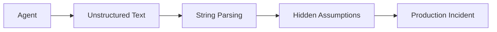
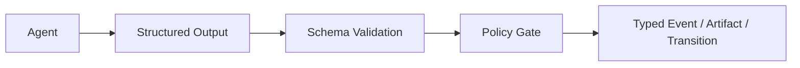
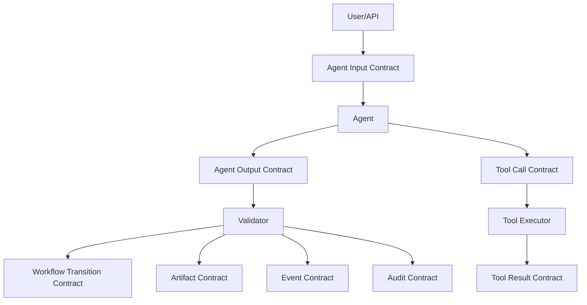
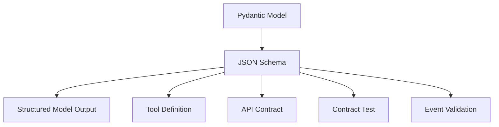
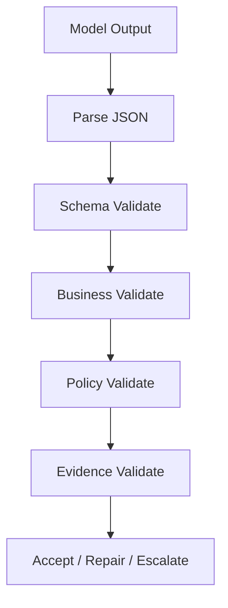
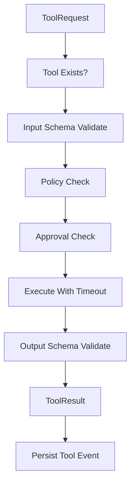
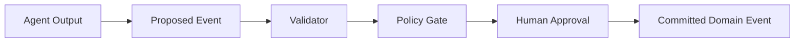
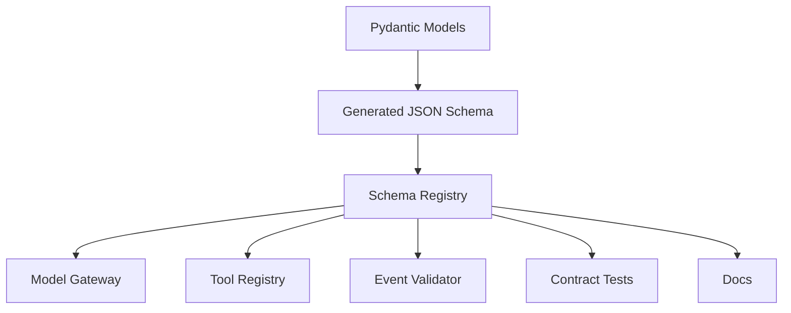
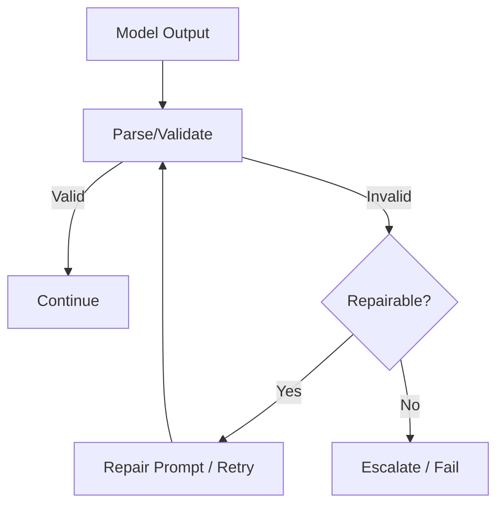
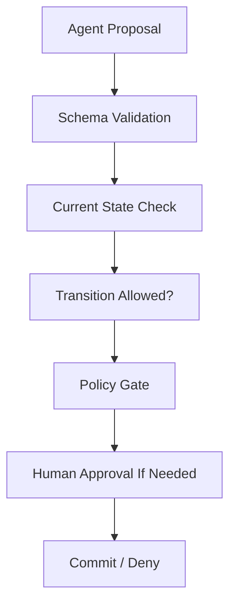

# Part 012 — Agent Contracts and Typed Boundaries

> In enterprise systems, an agent boundary is an API boundary.
>
> If it is not typed, validated, versioned, observable, and governed, it is not a reliable boundary.

This part focuses on the contract layer of enterprise-grade stateful multi-agent AI systems.

We will cover:

- agent input/output contracts;
- Pydantic models;
- JSON Schema;
- structured model outputs;
- tool contracts;
- event envelopes;
- versioning;
- compatibility;
- validation;
- schema registry;
- contract tests;
- failure handling;
- typed state transitions.

This part is intentionally concrete. It is the antidote to “just parse the LLM output and hope.”

---

## 1. Kaufman Framing

The skill here is:

> Design agent and tool boundaries so that probabilistic reasoning produces deterministic, testable system artifacts.

This sub-skill decomposes into:

1. define input schema;
2. define output schema;
3. validate at runtime;
4. version schemas;
5. reject or repair invalid outputs;
6. represent events consistently;
7. prevent hidden authority escalation;
8. test contract compatibility;
9. expose contracts to tools, agents, and evaluators.

### Target Performance

By the end of this part, you should be able to:

- model agent inputs and outputs with Pydantic;
- generate JSON Schema for structured outputs and tool contracts;
- design an event envelope for agentic systems;
- distinguish domain events, runtime events, tool events, and audit events;
- version schemas safely;
- write contract tests;
- handle invalid model output;
- design typed boundaries between agents, tools, state stores, and workflows.

---

# 2. Why Typed Boundaries Matter

Without typed boundaries:



With typed boundaries:



Typed boundaries make systems:

- testable;
- observable;
- replayable;
- safer;
- easier to evolve;
- easier to integrate;
- easier to audit.

The model may be probabilistic. The boundary must be deterministic.

---

# 3. Boundary Types

An enterprise agent system has multiple contract boundaries.



## Contract Inventory

| Boundary | Contract Example |
|---|---|
| user/API to runtime | `StartRunRequest` |
| runtime to agent | `AgentTaskInput` |
| agent to runtime | `AgentTaskOutput` |
| agent to tool | `ToolRequest` |
| tool to agent/runtime | `ToolResult` |
| agent to artifact store | `Artifact` |
| runtime to event log | `EventEnvelope` |
| runtime to workflow | `StateTransitionProposal` |
| runtime to human review | `DecisionPackage` |
| runtime to audit store | `AuditEvent` |

A serious system defines all of these explicitly.

---

# 4. Pydantic as a Contract Layer

Pydantic is commonly used in Python to define data models using type hints and validate runtime data.

```python
from pydantic import BaseModel, Field


class AgentTaskInput(BaseModel):
    task_id: str
    run_id: str
    agent_name: str
    objective: str = Field(min_length=1)
    input_refs: list[str] = Field(default_factory=list)
    constraints: list[str] = Field(default_factory=list)
```

## Why Pydantic Helps

- validation at runtime;
- Python type hints;
- serialization/deserialization;
- JSON Schema generation;
- nested model support;
- constrained fields;
- custom validators;
- better testability.

## Important Discipline

Do not use `dict[str, Any]` everywhere just because agent systems are flexible.

Use flexible fields at the edges, not in the core contract.

Bad:

```python
class AgentOutput(BaseModel):
    result: dict
```

Better:

```python
class RiskAssessmentOutput(BaseModel):
    risk_level: str
    confidence: float = Field(ge=0.0, le=1.0)
    rationale: str
    evidence_refs: list[str]
    missing_evidence: list[str] = Field(default_factory=list)
```

---

# 5. Agent Input Contract

An agent input contract should define:

- objective;
- input references;
- allowed tools;
- relevant state snapshot;
- constraints;
- output schema;
- budget;
- stop conditions;
- policy context;
- trace identifiers.

```python
from enum import Enum
from pydantic import BaseModel, Field


class ToolMode(str, Enum):
    READ = "read"
    DRAFT = "draft"
    WRITE = "write"
    EXECUTE = "execute"


class AllowedTool(BaseModel):
    tool_name: str
    mode: ToolMode
    max_calls: int = Field(ge=0)
    requires_approval: bool


class AgentBudget(BaseModel):
    max_turns: int = Field(ge=1)
    max_tool_calls: int = Field(ge=0)
    max_tokens: int = Field(ge=1)
    max_cost_usd: float = Field(ge=0.0)


class AgentTaskInput(BaseModel):
    task_id: str
    run_id: str
    thread_id: str
    tenant_id: str
    agent_name: str
    objective: str
    input_refs: list[str]
    allowed_tools: list[AllowedTool]
    constraints: list[str]
    budget: AgentBudget
    output_contract: str
    policy_version: str
```

This prevents vague agent invocation.

Bad:

```text
Analyze the case.
```

Better:

```text
Given evidence refs X and Y, produce RiskAssessmentOutput v1.2. You may call case_evidence_search up to 3 times. You may not mutate case state.
```

---

# 6. Agent Output Contract

An output contract should be narrow and business-meaningful.

```python
class RiskLevel(str, Enum):
    LOW = "low"
    MEDIUM = "medium"
    HIGH = "high"
    CRITICAL = "critical"


class EvidenceRef(BaseModel):
    ref_id: str
    relevance: str
    quote_or_summary: str | None = None


class RiskAssessmentOutput(BaseModel):
    case_id: str
    risk_level: RiskLevel
    confidence: float = Field(ge=0.0, le=1.0)
    rationale: str = Field(min_length=20)
    evidence: list[EvidenceRef]
    missing_evidence: list[str] = Field(default_factory=list)
    recommended_next_action: str
```

## Output Contract Rules

1. Use enums for closed categories.
2. Use constrained numbers for confidence/scores.
3. Require evidence references.
4. Avoid vague `notes` as the main output.
5. Separate recommendation from action.
6. Include uncertainty explicitly.
7. Validate before using output.
8. Do not treat valid schema as true content.

A schema can prove shape. It cannot prove factual correctness.

---

# 7. JSON Schema

JSON Schema is the common boundary format for structured JSON contracts across languages, APIs, model outputs, tools, and event systems.

Pydantic can generate JSON Schema from models.

```python
schema = RiskAssessmentOutput.model_json_schema()
```

A simplified generated schema could represent:

```json
{
  "title": "RiskAssessmentOutput",
  "type": "object",
  "properties": {
    "case_id": { "type": "string" },
    "risk_level": { "enum": ["low", "medium", "high", "critical"] },
    "confidence": { "type": "number", "minimum": 0.0, "maximum": 1.0 },
    "rationale": { "type": "string", "minLength": 20 }
  },
  "required": ["case_id", "risk_level", "confidence", "rationale"]
}
```

## Where JSON Schema Fits



Pydantic is convenient for Python. JSON Schema is useful at system boundaries.

---

# 8. Structured Outputs

Structured outputs let you constrain a model response to a schema-supported shape.

But schema adherence does not solve all problems.

It helps with:

- parseability;
- missing fields;
- type errors;
- enum constraints;
- predictable downstream processing.

It does not guarantee:

- factual accuracy;
- policy correctness;
- evidence quality;
- valid reasoning;
- allowed authority;
- absence of prompt injection.

## Validation Pipeline



Schema validation is necessary but not sufficient.

---

# 9. Business Validation

Business validation checks semantic constraints.

Example: risk assessment cannot be high confidence without evidence.

```python
from pydantic import model_validator


class RiskAssessmentOutput(BaseModel):
    case_id: str
    risk_level: RiskLevel
    confidence: float = Field(ge=0.0, le=1.0)
    rationale: str
    evidence: list[EvidenceRef]
    missing_evidence: list[str] = Field(default_factory=list)
    recommended_next_action: str

    @model_validator(mode="after")
    def validate_evidence_for_confidence(self):
        if self.confidence >= 0.8 and not self.evidence:
            raise ValueError("High-confidence assessment requires evidence.")
        return self
```

This is where typed boundaries become domain-specific.

---

# 10. Tool Contracts

A tool contract defines what a tool can do.

```python
class ToolContract(BaseModel):
    tool_name: str
    version: str
    description: str
    input_schema: dict
    output_schema: dict
    effect_type: str
    auth_scope: str
    timeout_ms: int
    idempotent: bool
    requires_approval: bool
```

## Tool Effect Types

| Effect Type | Meaning |
|---|---|
| read_only | reads data only |
| draft | creates non-sent/non-committed artifact |
| internal_mutation | changes internal system |
| external_notification | sends message/notice |
| irreversible | irreversible or high-impact action |

## Tool Contract Example

```python
class CaseEvidenceSearchInput(BaseModel):
    case_id: str
    query: str
    max_results: int = Field(ge=1, le=20)


class CaseEvidenceSearchResult(BaseModel):
    document_id: str
    title: str
    snippet: str
    relevance_score: float = Field(ge=0.0, le=1.0)


class CaseEvidenceSearchOutput(BaseModel):
    results: list[CaseEvidenceSearchResult]


case_evidence_search_contract = ToolContract(
    tool_name="case_evidence_search",
    version="1.0.0",
    description="Searches approved evidence documents for a case.",
    input_schema=CaseEvidenceSearchInput.model_json_schema(),
    output_schema=CaseEvidenceSearchOutput.model_json_schema(),
    effect_type="read_only",
    auth_scope="case:evidence:read",
    timeout_ms=5000,
    idempotent=True,
    requires_approval=False,
)
```

Agents should receive tool contracts, not raw Python functions.

---

# 11. Tool Request and Tool Result

```python
class ToolRequest(BaseModel):
    tool_call_id: str
    run_id: str
    agent_name: str
    tool_name: str
    tool_version: str
    input: dict
    idempotency_key: str | None = None


class ToolResultStatus(str, Enum):
    SUCCESS = "success"
    VALIDATION_ERROR = "validation_error"
    POLICY_DENIED = "policy_denied"
    TIMEOUT = "timeout"
    FAILED = "failed"


class ToolResult(BaseModel):
    tool_call_id: str
    status: ToolResultStatus
    output: dict | None = None
    error_message: str | None = None
    external_ref: str | None = None
```

## Tool Execution Pipeline



The model should not execute tools directly. It should propose tool calls.

---

# 12. Event Envelope

Events need a consistent envelope.

```python
class EventEnvelope(BaseModel):
    event_id: str
    event_type: str
    event_version: str
    occurred_at: str
    tenant_id: str
    correlation_id: str
    causation_id: str | None = None
    run_id: str | None = None
    thread_id: str | None = None
    actor_type: str
    actor_id: str
    payload_schema: str
    payload: dict
```

## Why Envelope Matters

The envelope provides cross-cutting metadata:

- identity;
- tenant;
- correlation;
- causation;
- event type;
- schema version;
- time;
- actor;
- run/thread relation.

The payload contains event-specific data.

---

# 13. Event Categories

| Event Category | Example |
|---|---|
| domain event | `case.status_changed` |
| proposed domain event | `case.transition_proposed` |
| runtime event | `run.checkpoint_saved` |
| tool event | `tool.call_committed` |
| human event | `human.approval_granted` |
| memory event | `memory.update_proposed` |
| audit event | `audit.policy_decision_recorded` |
| telemetry event | trace/span/metric event |

Do not put everything into a single vague `agent.event`.

---

# 14. Proposed vs Committed Events

This distinction is critical.



## Example

```python
class CaseTransitionProposed(BaseModel):
    case_id: str
    from_status: str
    to_status: str
    rationale: str
    evidence_refs: list[str]
    proposed_by_agent: str


class CaseStatusChanged(BaseModel):
    case_id: str
    from_status: str
    to_status: str
    approved_by: str
    approval_id: str
```

The agent can produce `CaseTransitionProposed`.

The business service emits `CaseStatusChanged`.

---

# 15. Contract Versioning

Contracts evolve.

Version every contract that crosses a boundary.

```python
class ContractId(BaseModel):
    name: str
    version: str
```

Use semantic-ish rules:

| Change | Compatibility |
|---|---|
| add optional field | backward compatible |
| add required field | breaking |
| remove field | breaking |
| rename field | breaking |
| widen enum | maybe compatible for producer, risky for consumer |
| narrow enum | breaking |
| change field meaning | breaking |
| change numeric range | depends |
| change default | potentially breaking |

## Versioning Rule

> If old consumers cannot safely process new payloads, it is a breaking change.

---

# 16. Schema Evolution Example

Version 1:

```python
class RiskAssessmentV1(BaseModel):
    case_id: str
    risk_level: RiskLevel
    rationale: str
```

Version 2 adds optional confidence:

```python
class RiskAssessmentV2(BaseModel):
    case_id: str
    risk_level: RiskLevel
    rationale: str
    confidence: float | None = Field(default=None, ge=0.0, le=1.0)
```

This is usually backward compatible for new consumers reading old data if they handle `None`.

Version 3 makes confidence required:

```python
class RiskAssessmentV3(BaseModel):
    case_id: str
    risk_level: RiskLevel
    rationale: str
    confidence: float = Field(ge=0.0, le=1.0)
```

That can be breaking for old producers.

---

# 17. Schema Registry

For enterprise systems, maintain a schema registry.



A schema registry can be simple at first:

```text
schemas/
  agent/
    risk_assessment_output/
      1.0.0.json
      1.1.0.json
  tool/
    case_evidence_search/
      1.0.0.input.json
      1.0.0.output.json
  events/
    case.transition_proposed/
      1.0.0.json
```

The value is consistency and reviewability.

---

# 18. Compatibility Tests

Contracts need tests.

```python
def test_risk_assessment_accepts_valid_output():
    output = RiskAssessmentOutput.model_validate(
        {
            "case_id": "case_123",
            "risk_level": "high",
            "confidence": 0.82,
            "rationale": "Evidence indicates repeated violations.",
            "evidence": [
                {
                    "ref_id": "doc_1",
                    "relevance": "Shows repeated failed compliance checks.",
                }
            ],
            "recommended_next_action": "Prepare analyst review package.",
        }
    )

    assert output.risk_level == RiskLevel.HIGH


def test_high_confidence_requires_evidence():
    try:
        RiskAssessmentOutput.model_validate(
            {
                "case_id": "case_123",
                "risk_level": "high",
                "confidence": 0.9,
                "rationale": "Looks serious.",
                "evidence": [],
                "recommended_next_action": "Escalate.",
            }
        )
    except ValueError:
        assert True
    else:
        assert False
```

Test contract behavior like you test APIs.

---

# 19. Invalid Output Handling

Invalid output is normal in agent systems.



## Invalid Output Strategy

| Failure | Strategy |
|---|---|
| malformed JSON | repair/retry once |
| missing optional field | default |
| missing required field | retry/repair |
| enum invalid | retry with explicit allowed values |
| business validation failure | ask for correction or escalate |
| policy violation | deny, do not retry as normal |
| low confidence | escalate or request evidence |
| hallucinated evidence ref | reject output |

Do not silently coerce dangerous output.

---

# 20. Contract-Aware Prompting

The model should know the output contract.

Example:

```text
Produce a RiskAssessmentOutput JSON object.

Rules:
- Use only the allowed risk_level enum.
- confidence must be between 0 and 1.
- Every high or critical risk assessment must include at least one evidence ref.
- Do not invent evidence refs.
- If evidence is insufficient, lower confidence and list missing_evidence.
```

But the prompt is only guidance.

The validator is enforcement.

---

# 21. Typed State Transitions

State transitions should also be typed.

```python
class StateTransitionProposal(BaseModel):
    aggregate_type: str
    aggregate_id: str
    from_state: str
    to_state: str
    rationale: str
    evidence_refs: list[str]
    proposed_by: str
    confidence: float = Field(ge=0.0, le=1.0)


class StateTransitionDecision(BaseModel):
    proposal_id: str
    decision: str  # allow, deny, require_approval
    reason: str
    policy_version: str
```

## Transition Pipeline



The agent proposes. The workflow controls.

---

# 22. Decision Package Contract

Human review needs a typed package.

```python
class DecisionPackage(BaseModel):
    decision_package_id: str
    run_id: str
    title: str
    proposed_action: str
    rationale: str
    evidence_refs: list[str]
    risk_level: RiskLevel
    confidence: float = Field(ge=0.0, le=1.0)
    alternatives: list[str] = []
    known_uncertainties: list[str] = []
    policy_basis: list[str] = []
```

A reviewer should not approve opaque text.

They should approve a structured decision package.

---

# 23. Agent-to-Agent Contract

Agents should communicate through typed task and finding objects.

```python
class DelegatedAgentTask(BaseModel):
    task_id: str
    parent_run_id: str
    assigned_agent: str
    objective: str
    input_artifact_refs: list[str]
    expected_output_contract: str
    allowed_tools: list[AllowedTool]
    deadline_ms: int


class AgentFinding(BaseModel):
    finding_id: str
    task_id: str
    produced_by: str
    summary: str
    evidence_refs: list[str]
    confidence: float = Field(ge=0.0, le=1.0)
    blockers: list[str] = []
    disputes: list[str] = []
```

Do not let agents communicate only through free-form chat if the output affects system behavior.

---

# 24. MCP-Style Boundary Thinking

The Model Context Protocol separates concepts such as tools, resources, and prompts.

Even if you do not use MCP, the separation is useful:

| Concept | Meaning |
|---|---|
| tool | executable capability |
| resource | readable context/data |
| prompt | reusable interaction template/instruction |

In enterprise design:

- tools require permissions;
- resources require access control;
- prompts require versioning;
- all boundaries require audit.

Do not treat every integration as “a tool.” Reading a policy document is different from sending a notice.

---

# 25. Least-Privilege Contracts

A contract should expose the smallest useful capability.

Bad tool:

```text
database_query(sql: string)
```

Better tools:

```text
get_case_summary(case_id)
search_case_evidence(case_id, query, max_results)
create_notice_draft(case_id, template_id, facts)
```

Why?

- easier to authorize;
- easier to validate;
- easier to audit;
- less injection risk;
- less accidental damage;
- better domain semantics.

## Tool Design Rule

> Expose business capabilities, not infrastructure primitives.

---

# 26. Contract Observability

Log contract-level facts.

| Field | Why |
|---|---|
| contract name | understand behavior |
| contract version | diagnose deployments |
| validation result | detect model drift |
| validation error | improve prompts/contracts |
| repair attempts | monitor fragility |
| producer | identify agent/tool |
| consumer | identify downstream |
| schema hash | ensure exact contract |
| payload size | detect abnormal data |

This helps detect breakage before it becomes a business incident.

---

# 27. Contract Security

Typed contracts reduce risk, but they are not enough.

Security controls:

- validate input and output;
- enforce auth outside model;
- reject unknown fields for strict contracts;
- limit string lengths;
- constrain enums;
- validate refs exist and are authorized;
- avoid arbitrary code/tool names;
- separate read and write tools;
- sanitize content rendered to users;
- protect against prompt injection in retrieved content;
- do not trust model-generated URLs, file paths, or SQL.

## Strict Model Example

```python
from pydantic import ConfigDict


class StrictRiskAssessment(BaseModel):
    model_config = ConfigDict(extra="forbid")

    case_id: str
    risk_level: RiskLevel
    confidence: float = Field(ge=0.0, le=1.0)
    rationale: str
    evidence: list[EvidenceRef]
```

Rejecting extra fields can prevent hidden payloads from slipping through.

---

# 28. Contract Documentation

Contracts should be documented like APIs.

For each contract, document:

- name;
- version;
- owner;
- purpose;
- producer;
- consumer;
- schema;
- examples;
- validation rules;
- compatibility policy;
- security classification;
- retention policy;
- failure handling.

This is part of enterprise maintainability.

---

# 29. Contract Review Checklist

Before adding a new agent/tool/event contract:

- [ ] Does it have a clear owner?
- [ ] Is the purpose narrow?
- [ ] Are required fields justified?
- [ ] Are enums constrained?
- [ ] Are string lengths bounded where needed?
- [ ] Are evidence/source refs required?
- [ ] Is schema version included?
- [ ] Is compatibility documented?
- [ ] Is validation tested?
- [ ] Is policy enforced outside the prompt?
- [ ] Is authority level explicit?
- [ ] Is side-effect type explicit?
- [ ] Is audit metadata captured?
- [ ] Are sensitive fields classified?
- [ ] Are examples included?
- [ ] Is there a migration path?

---

# 30. Common Anti-Patterns

## Anti-Pattern 1 — Free-Form Output for Business Decisions

```text
The case is risky and should be escalated.
```

Better: `RiskAssessmentOutput`.

## Anti-Pattern 2 — Tool Without Effect Classification

```python
send_email(to, body)
```

Better: declare `external_notification`, approval requirement, idempotency, audit.

## Anti-Pattern 3 — Untyped Agent Handoff

```text
Passing to policy agent...
```

Better: `HandoffPayload`.

## Anti-Pattern 4 — Versionless Events

```json
{ "type": "case_changed", "payload": { ... } }
```

Better: `event_type`, `event_version`, `payload_schema`.

## Anti-Pattern 5 — Schema Validity as Truth

A valid risk assessment can still be wrong. Validate evidence and policy.

---

# 31. Practice Drill

Design contracts for a multi-agent case review workflow.

Agents:

- intake agent;
- evidence agent;
- risk agent;
- policy agent;
- drafting agent;
- supervisor agent.

Tools:

- search evidence;
- fetch case;
- create draft notice;
- request human approval;
- send approved notice.

Deliverables:

1. `AgentTaskInput`;
2. `AgentFinding`;
3. `RiskAssessmentOutput`;
4. `PolicyMappingOutput`;
5. `NoticeDraftOutput`;
6. `ToolContract` for each tool;
7. `ToolRequest` and `ToolResult`;
8. `EventEnvelope`;
9. proposed vs committed event examples;
10. contract compatibility tests;
11. invalid output handling strategy.

---

# 32. What Top 1% Engineers Pay Attention To

Top engineers ask:

- What is the contract at this boundary?
- Who produces it?
- Who consumes it?
- What version is it?
- What validates it?
- What happens if validation fails?
- Is the contract too broad?
- Does it accidentally grant authority?
- Does it require evidence refs?
- Does it distinguish proposal from commitment?
- Does it classify side effects?
- Does it support audit and replay?
- Can old consumers read new payloads?
- Can new consumers read old payloads?
- Is this contract documented and tested?

They do not trust strings where business state changes are involved.

---

# 33. Summary

In this part, we covered:

- typed agent input contracts;
- typed agent output contracts;
- Pydantic models;
- JSON Schema generation;
- structured outputs;
- business validation;
- tool contracts;
- tool request/result models;
- event envelopes;
- proposed vs committed events;
- schema versioning;
- compatibility;
- schema registry;
- invalid output handling;
- contract-aware prompting;
- typed state transitions;
- decision packages;
- agent-to-agent contracts;
- MCP-style boundary thinking;
- least privilege;
- observability;
- security;
- documentation and review checklist.

The key principle:

> A probabilistic system becomes operationally reliable only when its boundaries are deterministic.

The next part will build on this with the **Command, Query, Event Model** for AI agent systems.

---

## References

- Pydantic documentation: models, validation, and JSON Schema generation.
- JSON Schema specification and documentation.
- OpenAI API documentation: structured outputs and function/tool calling.
- Model Context Protocol specification: tools, resources, prompts, and protocol boundaries.
